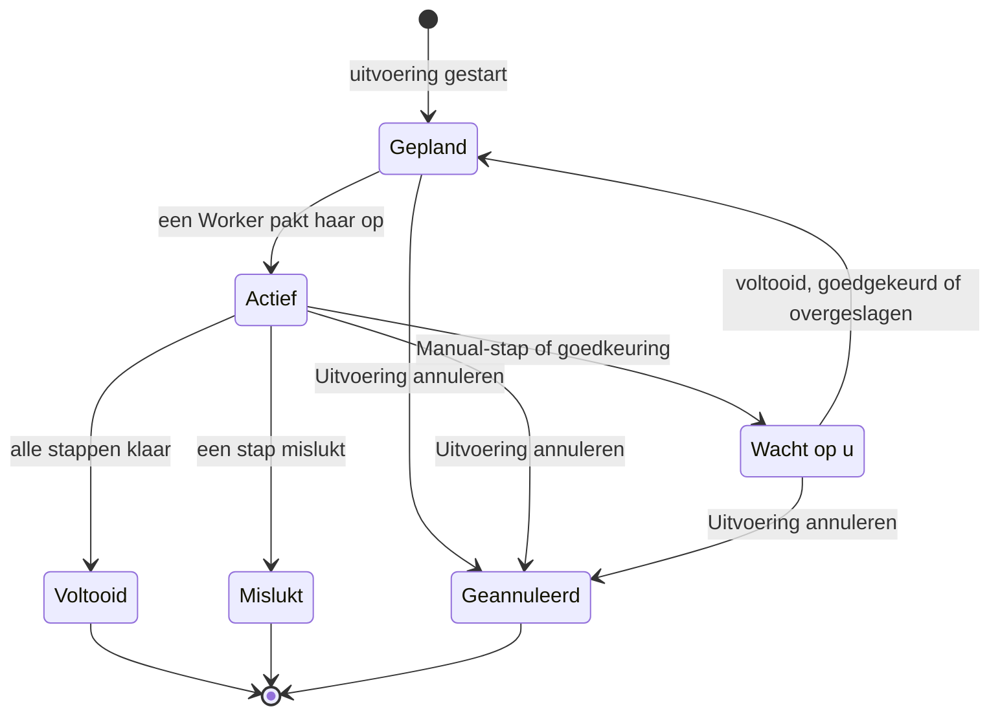

# Een runbook uitvoeren

Elke run van een runbook is een **uitvoering**: een momentopname van de stappen van het runbook, op volgorde afgewerkt, met de status en uitvoer van elke stap vastgelegd. Deze pagina is voor wie reageert, uitvoeringen start en ze verder helpt: hoe een uitvoering start, wat de uitvoeringspagina toont en hoe u stappen voltooit, goedkeurt, overslaat en annuleert.

:::cards
- [Een uitvoering starten](#een-uitvoering-starten): Vanuit een incident, waarschuwing of evenement, of vanuit het runbook zelf.
- [De uitvoeringsweergave](#de-uitvoeringsweergave): Wat elke stap toont terwijl een uitvoering bezig is.
- [Stappen voltooien, goedkeuren en overslaan](#stappen-voltooien-goedkeuren-en-overslaan): Welke stap een beslissing aanneemt, en wanneer.
- [Problemen oplossen](#problemen-oplossen): Uitvoeringen die niet starten of niet eindigen.
:::

## Hoe een uitvoering verloopt

Een nieuwe uitvoering staat op **Gepland** tot een Worker haar oppakt en als **Actief** markeert. Ze pauzeert als **Wacht op u** bij een Manual-stap, of na een stap die goedkeuring nodig heeft, en gaat terug in de wachtrij zodra iemand handelt. Een uitvoering die op een persoon wacht, verloopt nooit. Ze eindigt als **Voltooid**, **Mislukt** of **Geannuleerd**.

## Een uitvoering starten

Een runbook-uitvoering ontstaat op drie manieren:

1. **Automatisch via een regel**: een [runbook-regel](/docs/runbooks/rules) start haar wanneer een overeenkomend incident, overeenkomende waarschuwing of overeenkomend gepland onderhoudsevenement ontstaat. Ook een regel voor automatisch herstel kan er een starten; zie [AI SRE](/docs/ai/ai-sre).
2. **Handmatig vanuit een evenement**: klik op een incident, waarschuwing of gepland onderhoudsevenement op **Runbook uitvoeren**. De uitvoering hangt aan dat evenement.
3. **Handmatig vanaf de runbookpagina**: klik op de pagina **Overzicht** van een runbook op **Run Now**. De uitvoering hangt aan geen enkel incident, geen waarschuwing en geen gepland onderhoudsevenement.

Zo start u er een met de hand:

:::tabs
@tab Vanuit een evenement
1. Open het incident, de waarschuwing of het geplande onderhoudsevenement en ga naar de pagina **Runbooks** ervan.
2. Klik op **Runbook uitvoeren**. Het dialoogvenster **Een runbook uitvoeren** toont de runbooks van het project die zijn ingeschakeld.
3. Klik naast het runbook op **Run**. De uitvoering verschijnt in de lijst van het evenement: klik op **Bekijken** om haar te openen.
@tab Vanuit het runbook
1. Open het runbook via **Runbooks**.
2. Klik op het **Overzicht** ervan op **Run Now**.
3. De uitvoeringspagina opent.
:::

Een uitvoering starten vereist Project Owner, Project Admin, Project Member, Runbook Admin of Runbook Member, of de machtiging **Create Runbook Execution**. Runbook Viewer en Viewer zien **Run Now** vergrendeld, met de reden. Zie [Machtigingen](/docs/runbooks/configuration#machtigingen).

## De uitvoeringsweergave

Open een uitvoering om de checklist te zien. Bovenaan de pagina staan de **Status** van de uitvoering, de **Progress** (voltooide stappen van het totaal), **Gestart** (wanneer ze begon) en **Geactiveerd door** (wat haar startte). Elke stap toont:

- **Statuslabel** — In behandeling, Actief, Wacht op u, Klaar, Overgeslagen, Mislukt of Geannuleerd.
- **Titel en beschrijving** — bij de start van de uitvoering uit het runbook gekopieerd.
- **Output** (inklapbaar) — stdout, returnwaarden, HTTP-antwoorden of het antwoord van de AI.
- **Foutmelding** als de stap mislukte.
- Op de stap waarop de uitvoering wacht: **Mark complete** (een Manual-stap) of **Approve & continue** (een stap met **Goedkeuring vereisen**), en **Overslaan**.
- Terwijl de uitvoering pauzeert, **Overslaan** op latere geautomatiseerde stappen die geen goedkeuring vereisen.

Zolang de uitvoering bezig is, ververst de pagina zichzelf elke 30 seconden. Klik op **Vernieuwen** om de nieuwste stand meteen te zien.

## Stappen voltooien, goedkeuren en overslaan

Alleen de stap waarop de uitvoering wacht, kan als voltooid worden gemarkeerd, worden goedgekeurd of worden overgeslagen om de uitvoering te laten doorgaan. Een Manual-stap of een stap met **Goedkeuring vereisen** kan niet worden afgevinkt of overgeslagen voordat de uitvoering hem bereikt: zijn taak is de uitvoering te stoppen, dus hij neemt pas een beslissing aan wanneer de uitvoering er is (bij een goedkeuring: zodra de stap gelopen heeft en u de uitvoer ziet).

Terwijl de uitvoering pauzeert, kunt u ook een latere geautomatiseerde stap overslaan die geen goedkeuring vereist, zodat die niet loopt wanneer de uitvoering verdergaat. De uitvoering blijft gepauzeerd op de stap die op u wacht. Overslaan kan niet terwijl er stappen lopen: wacht tot de uitvoering pauzeert, of annuleer haar. Elke stap legt vast wie hem voltooide of oversloeg.

| De stap | Voltooien of goedkeuren | Overslaan |
| --- | --- | --- |
| Die waarop de uitvoering wacht | Ja | Ja |
| Een latere geautomatiseerde stap, zonder **Goedkeuring vereisen** | Nee | Ja, terwijl de uitvoering pauzeert |
| Een latere Manual-stap, of een met **Goedkeuring vereisen** | Nee | Nee |
| Elke stap, terwijl er stappen lopen | Nee | Nee |

Voltooien, goedkeuren, overslaan en annuleren vereisen dezelfde rollen als een uitvoering starten, of de machtiging **Edit Runbook Execution**.

## Handmatige en geautomatiseerde stappen afwisselen

Het klassieke verloop:

| # | Stap | Wat er gebeurt |
| --- | --- | --- |
| 1 | Bash: systeemtoestand vastleggen | Loopt op zijn Runner zodra de uitvoering start. |
| 2 | Manual: "Informeer klanten via de banner op de statuspagina." | De uitvoering pauzeert tot iemand op **Mark complete** klikt. |
| 3 | HTTP request: de DBA oproepen via PagerDuty | Loopt op de Worker. |
| 4 | Manual: "Bevestig dat de secundaire database nu primair is." | De uitvoering pauzeert opnieuw. |
| 5 | HTTP request: het sein veilig naar een Slack-webhook posten | Loopt, en de uitvoering staat op **Voltooid**. |

De stappen 2 en 4 pauzeren de uitvoering tot iemand ze afvinkt. De stappen 1, 3 en 5 lopen automatisch. De hele run is één uitvoering, één tijdlijn en één bron van waarheid.

## Een uitvoering annuleren

Klik op de uitvoeringspagina op **Uitvoering annuleren**. De status wordt `Cancelled` en er start geen latere stap meer. Een stap die al loopt, wordt niet onderbroken, maar het resultaat ervan wordt niet vastgelegd: de stap blijft `Cancelled`. Taken die nog op een Runner wachten, worden geannuleerd; een Runner die al een script uitvoert, maakt het af, maar het resultaat wordt niet geaccepteerd.

## Uitvoerlimieten

De uitvoer per stap is beperkt tot **50 KB**, zodat een op hol geslagen script de database niet opblaast. Langere uitvoer wordt afgekapt met een markering. Hebt u grotere artefacten nodig, schrijf ze dan vanuit het script naar objectopslag of een logsysteem en zet de URL in de uitvoer.

## Een runbook opnieuw uitvoeren

Een uitvoering is een eenmalig, onveranderlijk record. Klik om het runbook opnieuw uit te voeren op **Opnieuw uitvoeren** bij een afgeronde uitvoering, of op **Run Now** bij het runbook. Beide maken een nieuwe uitvoering met de huidige stappen van het runbook, aan geen enkel evenement gekoppeld. Gebruik **Runbook uitvoeren** op de pagina **Runbooks** van het incident om het opnieuw op een incident uit te voeren. De oorspronkelijke uitvoering blijft intact voor het audittrail.

## Eerdere uitvoeringen vinden

| Waar | Wat het toont |
| --- | --- |
| De **Uitvoeringen** van een runbook | Elke uitvoering van dat runbook, met filters op status en startdatum, en een kolom **Geactiveerd door**. |
| **Runbooks → Uitvoeringen** | Elke uitvoering van elk runbook in het project. |
| De pagina **Runbooks** van een incident, waarschuwing of evenement | De gekoppelde uitvoeringen. Het overzicht van het evenement toont ze ook, zodra er een is. |

## Problemen oplossen

:::details Run Now is vergrendeld
Uw rol leest runbooks maar voert ze niet uit: de knop zegt "Je hebt geen toestemming om in dit project runbook-uitvoeringen te starten." Vraag om Runbook Member, of om de machtiging **Create Runbook Execution**.
:::

:::details Een uitvoering starten mislukt met "Runbook is disabled" of "Runbook has no steps to run"
De schakelaar **Dit runbook uitvoeren** van het runbook staat uit, op de pagina **Instellingen** ervan, of het heeft geen opgeslagen stappen. Zet de schakelaar aan, of voeg stappen toe en klik op **Save Steps**.
:::

:::details Een stap is mislukt omdat er een Runner of inloggegeven ontbreekt
De melding luidt bijvoorbeeld "Bash step is missing a Runner. Pick one under Runbooks → Runners." De stap is opgeslagen zonder **Runner**, of een SSH- of Kubernetes-stap zonder **Credential**. Open de **Stappen** van het runbook, kies wat de stap mist, klik op **Save Steps** en voer het runbook opnieuw uit.
:::

:::details Een stap is mislukt omdat geen runbook-agent hem oppakte
De melding luidt "No runbook agent picked up this step before the wait window expired." De Runner van de stap pakte de taak niet op binnen zijn claim timeout. Controleer onder **Runbooks → Runbook-agenten** of de Runner **Verbonden** is en of **Voert Runbooks uit** aan staat. Zie [Runbook-agenten](/docs/runbooks/agents#problemen-oplossen).
:::

:::details De uitvoering wacht al uren
Een uitvoering die op een persoon wacht, verloopt nooit. Open haar en handel op de stap met **Wacht op u**, of klik op **Uitvoering annuleren**.
:::

:::details Een stap meldt dat hij mogelijk deels is uitgevoerd
De OneUptime Worker die de stap uitvoerde, is herstart of reageerde niet meer, en de uitvoering werd als mislukt gemarkeerd in plaats van actief te blijven. Controleer het doelsysteem voordat u het runbook opnieuw uitvoert.
:::

## Volgende stappen

:::cards
- [Een runbook schrijven](/docs/runbooks/authoring): Manual-stappen en goedkeuringen toevoegen waar een persoon moet beslissen.
- [Runbook-regels](/docs/runbooks/rules): Uitvoeringen automatisch starten bij nieuwe incidenten.
- [Runbook-agenten](/docs/runbooks/agents): De Runners online houden die uw stappen nodig hebben.
:::
