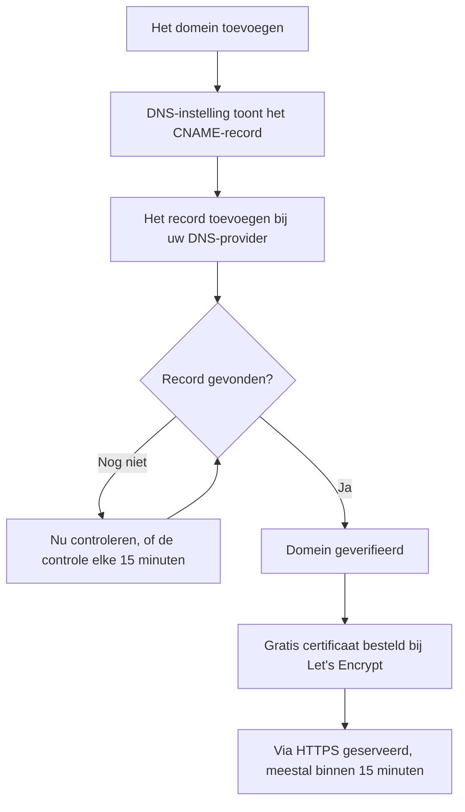

# Statuspagina – branding en domeinen

Uw statuspagina is het enige scherm van OneUptime waar uw klanten naar kijken, dus het moet eruitzien als het uwe en op uw eigen domein staan, zoals `status.yourcompany.com`. Deze pagina loopt de pagina **Huisstijl** kaart voor kaart door en zet daarna de statuspagina op uw domein: voeg het domein toe, voeg één DNS-record toe, en het gratis SSL-certificaat volgt vanzelf.

:::cards
- [De pagina Huisstijl](#de-pagina-huisstijl): Logo, titel, favicon, links, footer, kleuren en talen.
- [Aangepaste HTML, CSS en JavaScript](#aangepaste-html-css-en-javascript): Alles wat de ingebouwde instellingen niet dekken.
- [Aangepaste domeinen](#aangepaste-domeinen): Uw eigen hostnaam, met een gratis certificaat.
- [De kolom Status](#de-kolom-status-van-het-domein-lezen): Hoe ver elk domein op weg is naar HTTPS.
:::

## Waar elke huisstijlinstelling staat

Open een statuspagina: de sectie **Huisstijl** van het zijmenu heeft drie items:

| Pagina | Wat u daar instelt |
| ---- | ------------------ |
| **Huisstijl** | Logo en omslagafbeelding, paginatitel en -beschrijving, favicon, koptekstlinks, de beschrijving van de overzichtspagina, de copyrightregel en de footerlinks. Ingeklapt onder **Meer instellingen**: de kleuren van de geschiedenisgrafiek, de talen en de indexering door zoekmachines. |
| **Aangepaste domeinen** | Uw eigen domein, het DNS-record ervan en het gratis SSL-certificaat ervan. |
| **HTML, CSS & JavaScript** | Koptekst-HTML, footer-HTML, aangepaste CSS, aangepaste JavaScript. |

Drie dingen die op huisstijl lijken, staan in plaats daarvan onder **Statuspagina's → uw pagina → Geavanceerd → Geavanceerde instellingen** (`{id}/settings`), omdat ze bepalen wat de pagina toont en niet hoe die eruitziet: het totale uptimepercentage, welke monitorstatussen tegen de uptime tellen, en de regel "Powered by OneUptime". Alle drie zijn rijen van de kaart **Wat uw statuspagina toont** daar.

De huisstijl was vroeger verdeeld over aparte schermen **Basishuisstijl**, **Koptekst**, **Footer**, **Overzichtspagina** en **Talen**. Hun oude adressen (`{id}/header-style`, `{id}/footer-style`, `{id}/overview-page-branding` en `{id}/languages`) openen nu de pagina **Huisstijl**, dus oude bladwijzers en links blijven werken.

## De pagina Huisstijl

**Statuspagina's → uw pagina → Huisstijl → Huisstijl** (`{id}/branding`). Elke kaart wordt apart opgeslagen. Na het logo, de titel en de favicon volgen de kaarten uw statuspagina van boven naar beneden: de links in de koptekst, de tekst bovenaan het overzicht, en dan de footer. Wat weinig mensen wijzigen, staat ingeklapt onder **Meer instellingen**, onderaan.

### Logo en omslagafbeelding

De eerste kaart, **Logo en omslagafbeelding**, heeft een knop **Edit Images** die twee stappen opent:

| Stap | Velden |
| ---- | ------ |
| **Logo** | De upload van het logo (plaatshouder `Upload logo`) en **Logo Alt Text** (plaatshouder `Logo of My Company`). Laat de alt-tekst leeg en de titel van de statuspagina wordt in plaats daarvan gebruikt. |
| **Omslagafbeelding** | **Omslag**, een upload (plaatshouder `Upload cover image`) voor de brede banner achter de koptekst, en **Cover Image Alt Text**. Laat de alt-tekst leeg als de omslag puur decoratief is. |

Het logo, de omslagafbeelding en de favicon zijn bestanden die in het eigen project van de statuspagina zijn geüpload, en dat wordt gecontroleerd telkens wanneer er een wordt opgeslagen, vanuit het dashboard, de API, Terraform of een workflow. Een bestand dat in een ander project is geüpload, wordt geweigerd met de woorden die een bestand krijgt dat niet meer bestaat: "The logo's file could not be found. Upload the logo again.", "The cover image's file could not be found. Upload the cover image again." of "The favicon's file could not be found. Upload the favicon again." De afbeelding opnieuw uploaden vanaf de pagina lost het op.

Uw statuspagina toont alleen afbeeldingen van haar eigen project; een afbeelding die ze niet kan tonen, wordt weggelaten, alsof de pagina er geen had. Het dashboard, de API en Terraform lezen de afbeeldingen van de pagina op dezelfde manier: een afbeelding van een ander project komt terug als helemaal geen afbeelding. De e-mails die de pagina stuurt (aan abonnees, en aan privégebruikers over hun aanmelding) tonen haar logo op dezelfde manier: een logo dat de pagina niet kan tonen, wordt ook daaruit weggelaten in plaats van als kapotte afbeelding te verschijnen.

### Titel, beschrijving en favicon

- **Titel en beschrijving**: de kaart vermeldt dat dit ook voor SEO wordt gebruikt. **Bewerken** opent **Paginatitel** (plaatshouder `Please enter page title here.`) en **Paginabeschrijving**. Zoekmachines en linkvoorbeelden tonen deze teksten, dus schrijf ze voor een klant, niet voor uw team.
- **Favicon**: **Edit Favicon** opent de upload **Favicon**: het kleine pictogram in het browsertabblad.

### Koptekstlinks

De tabel **Koptekstkoppelingen** bevat de links in de koptekst van de statuspagina, zoals uw website, uw documentatie of een supportportaal. Elke link heeft een **Titel** en een **Koppeling** (een URL, plaatshouder `https://link.com`), en u herschikt ze door te slepen. Zonder links zegt de tabel **Geen statuskoptekstlink voor deze statuspagina**, met **Statuspagina Kop Link aanmaken** eronder.

### Beschrijving van de overzichtspagina

**Beschrijving overzichtspagina** is het eerste op het overzicht van de statuspagina, boven de aankondigingen, de algemene status en uw resources. **Beschrijving bewerken** opent een markdownveld. Gebruik het voor een zin context: wat deze pagina beslaat en waar men terechtkan voor support. Een afbeelding die u erin zet, wordt aan elke bezoeker van de pagina getoond.

### Footer

- **Copyrightinformatie**: **Edit Copyright** opent één veld, **Copyrightinformatie**, met de plaatshouder `Acme, Inc.`.
- **Footerlinks**: hetzelfde paar **Titel** en **Koppeling** als bij de koptekstlinks, herschikt door te slepen. Zonder links staat er "Geen statusvoettekstlink voor deze statuspagina."

Koptekstlinks zijn voor navigatie; footerlinks zijn voor de kleine lettertjes, zoals juridische informatie, privacy en voorwaarden.

### Meer instellingen

De laatste sectie van de pagina staat ingeklapt onder **Meer instellingen**, omdat weinig mensen ooit wijzigen wat erin staat. Ingeklapt noemt de kop de vier secties (**Standaard balkkleur**, **Regels voor balkkleuren**, **Talen** en **Indexering door zoekmachines**) en toont hij elke sectie die afwijkt van hoe een nieuwe statuspagina begint: een andere standaard balkkleur dan het groen waarmee elke pagina begint, een regel voor balkkleuren, een andere standaardtaal dan Engels, een kortere lijst talen, of indexering door zoekmachines die uit staat. Klik erop om hem te openen: het is één kaart, met de vier secties onder elkaar, elk met een eigen titel en knop, gescheiden door scheidingslijnen.

**Kleuren van de geschiedenisgrafiek.** Dit zijn de enige ingebouwde kleurinstellingen van een statuspagina.

- **Standaard balkkleur van de geschiedenisgrafiek**: **Edit Default Bar Color** opent de kiezer **Standaard balkkleur**. Elke nieuwe statuspagina begint met groen. Met regels voor balkkleuren is het ook de kleur van een dag waarvoor geen regel geldt. Een dag waarvoor de pagina geen gegevens heeft, wordt altijd grijs getekend.
- **Rules for Bar Colors of History Chart**: een geordende tabel met regels die u door te slepen sorteert. Elke regel heeft **Wanneer uptime % groter is dan of gelijk is aan** en **Gebruik dan deze balkkleur**; de kolommen van de tabel heten `When Uptime Percent >=` en `Then, Bar Color is`. De kleur van een nieuwe regel is al gekozen, een die de andere regels nog niet gebruiken; kies in plaats daarvan de kleur die u wilt. De volgorde telt, dus zet de regels in de volgorde waarin u ze geëvalueerd wilt hebben. Zonder regels krijgt de balk van elke dag de kleur van de laagste monitorstatus van die dag.

Hoeveel dagen de grafiek beslaat, stelt u hier niet in. Dat is **Uptimegeschiedenis** op de kaart **Wat uw statuspagina toont** onder **Geavanceerd → Geavanceerde instellingen**, van 1 tot 90 dagen. Welke monitorstatussen als down tellen, is **Telt als downtime**, in dezelfde rij van die kaart.

**Talen.** De sectie **Talen** stelt de taalkeuze in die bezoekers in de footer van de pagina krijgen. **Talen bewerken** opent twee velden:

| Veld | Wat het doet |
| ----- | ------------ |
| **Standaardtaal** | De taal die bezoekers bij hun eerste bezoek zien, gekozen uit een lijst die elke taal in de eigen taal en in het Engels noemt (`Deutsch (German)`). Standaard is dat Engels, en bezoekers kunnen altijd wisselen via de footer. |
| **Ingeschakelde talen** | Een meervoudige selectie, plaatshouder `All languages`. Laat die leeg en elke ondersteunde taal wordt aangeboden; kies er een paar en de footer toont alleen die. |

OneUptime wordt geleverd met zeventien talen: Engels, Duits, Frans, Spaans, Italiaans, Portugees, Nederlands, Deens, Noors, Zweeds, Russisch, Japans, Koreaans, Chinees (vereenvoudigd), Chinees (traditioneel), Hindi en Perzisch.

**Indexering door zoekmachines.** Eén schakelaar, **Zoekmachines toestaan deze statuspagina te indexeren**, bepaalt of Google, Bing en andere zoekmachines de pagina mogen opnemen. Hij staat standaard aan. Er is geen knop **Bewerken**: de schakelaar wordt opgeslagen op het moment dat u hem omzet. Zet hem uit en de pagina wordt geserveerd met `noindex, nofollow` (een robots-metatag en een header `X-Robots-Tag`); iedereen met de link kan de pagina nog steeds openen. Zoekmachines kunnen een paar weken nodig hebben om een pagina te laten vallen die ze al hebben geïndexeerd.

> [!TIP]
> Zet **Zoekmachines toestaan deze statuspagina te indexeren** uit zolang een pagina alleen intern is of nog wordt ingericht, zodat een halfafgemaakte pagina niet gaat scoren op uw merknaam.

## Uptimepercentage en downtimestatussen

Beide staan in de rij **Uptimegeschiedenis** van de kaart **Wat uw statuspagina toont** onder **Statuspagina's → uw pagina → Geavanceerd → Geavanceerde instellingen** (`{id}/settings`). Er is geen knop **Bewerken**: elke instelling wordt opgeslagen op het moment dat u haar wijzigt.

- **Totaal uptimepercentage weergeven**: een schakelaar, standaard uit. Zolang hij aan staat, kiest **Precisie** ernaast hoeveel decimalen het percentage toont: `99%`, `99.9%`, `99.99%` (de standaard) of `99.999%`. Op OneUptime Cloud vereist het aanzetten van het percentage het plan **Scale**; de precisie ervan is in elk plan te wijzigen.
- **Telt als downtime**: de monitorstatussen, als gekleurde labels, waarvan de tijd op deze pagina tegen de uptime telt. Hier bepaalt u bijvoorbeeld of een verminderde status tegen de uptime telt. Er blijft altijd minstens één status gekozen.

Vroeger waren dit twee eigen kaarten, **Totaal uptimepercentage** en **Downtime-monitorstatussen**, elk achter een knop **Bewerken**. Zie [Kiezen wat er op de pagina komt](/docs/status-pages/index#kiezen-wat-er-op-de-pagina-komt) voor de rest van de kaart.

## Aangepaste HTML, CSS en JavaScript

**Statuspagina's → uw pagina → Huisstijl → HTML, CSS & JavaScript** (`{id}/custom-code`) heeft vier kaarten, die elk apart worden bewerkt en in een kolom van de statuspagina worden opgeslagen:

| Kaart | Kolom | Wat het bevat |
| ---- | ------ | ------------- |
| **Koptekst-HTML** | `headerHTML` | HTML die aan de koptekst van de pagina wordt toegevoegd (plaatshouder `Insert Custom HTML here.`). |
| **Footer-HTML** | `footerHTML` | HTML die aan de footer van de pagina wordt toegevoegd. |
| **Aangepaste CSS** | `customCSS` | Stijlen voor de hele pagina (plaatshouder `Insert Custom CSS here.`). |
| **Aangepaste JavaScript** | `customJavaScript` | Een script dat de pagina uitvoert (plaatshouder `Insert Custom JavaScript here.`). |

> [!IMPORTANT]
> Aangepaste HTML, CSS en JavaScript worden alleen op een geverifieerd aangepast domein geserveerd. Op het standaardadres `/status-page/:id` staan ze uit, omdat dat adres de oorsprong deelt waarop u bij OneUptime bent aangemeld.

Op OneUptime Cloud vereist het toevoegen of wijzigen van een ervan het plan **Growth**. Een ervan leegmaken werkt in elk plan, dus aangepaste code die tijdens een proefperiode is toegevoegd, kan altijd worden verwijderd.

**Er is geen themakiezer.** Statuspagina's van OneUptime hebben geen instelling voor een thema of een merkkleur: de enige ingebouwde kleurinstellingen, waar dan ook, zijn **Standaard balkkleur** en de regels voor de balkkleuren van de geschiedenisgrafiek, onder **Meer instellingen** op de pagina **Huisstijl**. Lettertypen, achtergrondkleuren, accentkleuren en aanpassingen aan de opmaak lopen allemaal via **Aangepaste CSS**. Zocht u een veld voor een "merkkleur", dan is dit het antwoord: dat bestaat niet, en dit vak is de manier om het te doen.

> [!WARNING]
> Aangepaste JavaScript draait in de browsers van uw bezoekers, op een pagina die mensen juist openen wanneer ze denken dat er iets stuk is. Houd het klein, host wat het laadt waar mogelijk zelf, en test het voordat u erop vertrouwt.

## Aangepaste domeinen

Standaard is een statuspagina bereikbaar op de voorbeeld-URL op het scherm **Overzicht** ervan. Om haar op uw eigen hostnaam te zetten, gaat u naar **Statuspagina's → uw pagina → Huisstijl → Aangepaste domeinen** (`{id}/domains`).

De kaart **Aangepaste domeinen** zegt wat u moet doen: laat het CNAME-record van elk domein naar het statuspagina-CNAME-record van uw installatie wijzen, en OneUptime geeft het SSL-certificaat van het domein uit en verlengt het voor u. Zonder iets ingesteld zegt de tabel **Geen aangepaste domeinen gevonden**, met **Statuspagina Domein aanmaken** eronder. De tabel heeft twee kolommen, **Domein** en **Status**, en filters voor **Domein**, **CNAME geldig** en **SSL geprovisioneerd**.

De pagina op uw domein zetten kost drie stappen, en alleen de eerste twee zijn voor u:

1. **Het domein toevoegen**: een subdomein en een van uw geverifieerde domeinen.
2. **Het CNAME-record ervan toevoegen** bij uw DNS-provider. Het dialoogvenster **DNS-instelling** toont het record zodra u het domein toevoegt.
3. **Het gratis SSL-certificaat wordt automatisch uitgegeven** zodra het record is gevonden. Er is geen knop om op te drukken.



### Voordat u begint

- **Het bovenliggende domein moet geverifieerd zijn.** De keuzelijst **Domein** toont alleen de domeinen die zijn geverifieerd onder **Projectinstellingen → Domeinen**, waar u met een TXT-record bewijst dat een domein van u is. De link **Domein toevoegen** naast het veld opent die pagina in een nieuw tabblad.
- **Uw installatie heeft een statuspagina-CNAME-record nodig.** OneUptime Cloud heeft er een. Stel het bij een zelfgehoste installatie in op een hostnaam die naar uw OneUptime-server wijst (een A-record), en zorg dat de server antwoordt op poort 80, waar Let's Encrypt hem controleert. Zonder dat record zeggen de kaart en het dialoogvenster **DNS-instelling** "Custom Domains not enabled for this OneUptime installation" in plaats van een record te tonen.

:::tabs
@tab Docker Compose
```ini title="config.env"
STATUS_PAGE_CNAME_RECORD=oneuptime.yourcompany.com
```
@tab Kubernetes
```yaml title="values.yaml"
statusPage:
  cnameRecord: oneuptime.yourcompany.com
```
:::

### Het domein toevoegen

:::steps
#### Statuspagina Domein aanmaken openen

Klik op **Aangepaste domeinen** op **Statuspagina Domein aanmaken**. Het dialoogvenster bestaat uit één pagina.

#### Het subdomein invullen

Vul in **Subdomein** (plaatshouder `status (leave blank for root)`) alleen het label in, zoals `status`, niet de volledige hostnaam. Laat het leeg, of vul `@` in, om het hoofddomein (apex) te gebruiken.

#### Het domein kiezen

Kies in **Domein** (plaatshouder `Select domain`) een van uw geverifieerde domeinen. Een domein dat u niet hebt geverifieerd, staat er niet tussen, omdat het zou worden geweigerd.

#### Het gratis certificaat houden, of uw eigen uploaden

**Meer velden** is ingeklapt, en de kop zegt welk certificaat het domein gaat gebruiken: "We geven een gratis SSL-certificaat uit voor dit domein en verlengen het automatisch." Open het alleen om een eigen certificaat te gebruiken: zet **Aangepast certificaat uploaden** aan en plak dan het **Certificaat** en de **Privésleutel van certificaat** in PEM-formaat. Beide zijn dan verplicht.

#### Het domein aanmaken

Klik op **Statuspagina Domein aanmaken**. Het dialoogvenster sluit en de **DNS-instelling** van het nieuwe domein opent, met het record dat u moet toevoegen.
:::

De volledige naam van een domein ligt vast zodra u het toevoegt, dus **Bewerken** wijzigt alleen het certificaat ervan. Om een ander subdomein te gebruiken, voegt u dat domein toe en verwijdert u het oude.

### DNS-instelling en verificatie

Het dialoogvenster **DNS-instelling** toont het record dat u bij uw DNS-provider toevoegt, één veld per rij, elk met een kopieerknop:

| Veld | Wat u invult |
| ----- | ------------- |
| **Type** | `CNAME` |
| **Naam** | Het volledige domein dat u hebt toegevoegd, bijvoorbeeld `status.yourcompany.com` |
| **Waarde** | Het statuspagina-CNAME-record van uw installatie |

> [!NOTE]
> Voor een hoofddomein, zonder subdomein, voegt het dialoogvenster een opmerking toe: veel DNS-providers staan daar geen CNAME-record toe. Gebruik in plaats daarvan het ALIAS-, ANAME- of CNAME-flattening-record van uw provider, met dezelfde waarde.

OneUptime controleert elk niet-geverifieerd domein elke 15 minuten en verifieert het uwe zodra het record live is, of u nu terugkomt of niet. Om meteen te controleren, klikt u op **Nu controleren**:

- **Het record is nog niet gevonden.** Het dialoogvenster blijft open en zegt naar welk record het zocht. Een nieuw DNS-record kan even nodig hebben om zichtbaar te worden: klik later nog eens op **Nu controleren**, of laat het aan de controle elke 15 minuten over.
- **Het record is gevonden.** Het dialoogvenster zegt "Uw CNAME-record is geverifieerd." en wat er daarna met het certificaat gebeurt. Het gratis certificaat wordt op dat moment besteld.

Zolang een domein niet is geverifieerd en het certificaat er niet is, heeft de rij ervan een actie **DNS-instelling** die hetzelfde dialoogvenster opent. Bij een geverifieerd domein waarvan de certificaatbestelling steeds mislukt, of waarvan het certificaat is verlopen, bestelt **Nu controleren** daar opnieuw en toont het waarom de laatste bestelling mislukte. Het bestelt hoogstens één keer per domein per 15 minuten; daartussen blijft OneUptime het zelf opnieuw proberen.

### SSL-certificaten

Elk aangepast domein krijgt een gratis certificaat van Let's Encrypt, automatisch uitgegeven en verlengd. Er hoeft niets te worden aangeklikt:

- **Nu controleren** bestelt het certificaat op het moment dat het record wordt gevonden. Het dialoogvenster zegt daarna dat het certificaat meestal binnen 15 minuten live is.
- Wanneer de controle elke 15 minuten een domein verifieert, bestelt ze in dezelfde controle het certificaat van het domein.
- Verlengen gebeurt automatisch, ruim voordat het certificaat verloopt. Als uw DNS even niet antwoordt terwijl een certificaat wordt verlengd, blijft het certificaat geserveerd en wordt het bij een latere poging verlengd. Een mislukte DNS-controle verwijdert nooit een certificaat dat nog geldig is.

Een nieuw certificaat wordt binnen 15 minuten na uitgifte geserveerd, omdat de certificaten zo vaak worden weggeschreven naar de servers die voor uw domein antwoorden. De kolom Status zegt _meestal_ binnen 15 minuten: wanneer veel domeinen tegelijk wachten, worden ze een paar tegelijk afgehandeld.

Elk OneUptime-certificaat wordt besteld via één gedeeld Let's Encrypt-account, en Let's Encrypt beperkt hoeveel nieuwe bestellingen één account in korte tijd mag plaatsen, en hoe vaak een bestelling voor hetzelfde domein mag mislukken. OneUptime houdt al zijn bestellingen (nieuwe domeinen, **Nu controleren**, heruitgiftes en verlengingen) samen binnen die limieten, en verlengingen gaan altijd voor, zodat een golf nieuwe domeinen nooit de verlengingen ophoudt die bestaande domeinen online houden.

Mislukt een bestelling, dan zegt de kolom Status van het domein dat, met de reden op de regel eronder, en **Nu controleren** in **DNS-instelling** toont het ook. OneUptime blijft het zelf proberen en wacht na elke opeenvolgende mislukking iets langer, zodat een domein waarvan de bestelling steeds mislukt, niet de bestellingen opmaakt die alle andere domeinen nodig hebben. De gebruikelijke oorzaken zijn een CAA-record op uw domein dat `letsencrypt.org` niet toestaat en, bij een zelfgehoste installatie, een server die Let's Encrypt niet op poort 80 kan bereiken; bij een zelfgehoste installatie staan de details in de logs van de worker. Hebt u de oorzaak verholpen, klik dan op **Nu controleren** om meteen opnieuw te bestellen. Het plaatst hoogstens één bestelling per domein per 15 minuten; een klik daartussen toont hoe de laatste bestelling verliep.

Hebt u onder **Meer velden** uw eigen certificaat geüpload, dan serveert OneUptime dat, binnen 15 minuten na het opslaan. Upload de vervanger ervan voordat het verloopt, door het domein te bewerken.

### Een certificaat opnieuw uitgeven

Automatisch verlengen dekt het gewone geval, maar soms wilt u nu meteen een gloednieuw certificaat: een privésleutel die u liever niet houdt, een certificaat waar uw eigen scanner niet blij mee is, of een domein dat elders is gewijzigd. Zodra er voor een domein een gratis certificaat is besteld, toont de rij ervan een actie **Reissue SSL**.

Het dialoogvenster ervan, **Reissue SSL Certificate for this Status Page**, vraagt Let's Encrypt om een nieuw certificaat voor het domein en vervangt daarmee het certificaat dat wordt geserveerd. Uw statuspagina blijft intussen online met het bestaande certificaat, en het nieuwe certificaat wordt binnen 15 minuten geserveerd. Klik op **Reissue SSL Certificate** om het te bestellen.

> [!NOTE]
> Een domein kan maar één keer per 24 uur opnieuw worden uitgegeven. Let's Encrypt beperkt hoe vaak hetzelfde domein mag worden uitgegeven, en elk OneUptime-certificaat wordt besteld via één gedeeld account, ook de automatische verlengingen die de pagina's van alle anderen online houden. Binnen dat venster vertelt het dialoogvenster hoeveel tijd er nog over is in plaats van te bestellen. Wordt er op dat moment een certificaat voor het domein besteld, of zijn de Let's Encrypt-bestellingen van de installatie voorlopig op, dan zegt het dialoogvenster dat, wordt er niets besteld en telt de klik niet als uw heruitgifte.

De actie verschijnt niet bij een domein dat een door u geüpload certificaat gebruikt: er is geen Let's Encrypt-certificaat om opnieuw uit te geven, dus upload in plaats daarvan een nieuw door het domein te bewerken. Ze verschijnt ook niet voordat het eerste certificaat van het domein is besteld, wat vanzelf gebeurt zodra het CNAME-record ervan is geverifieerd.

Dezelfde knop, met dezelfde limiet van 24 uur, staat bij de aangepaste domeinen van dashboards onder **Dashboards → uw dashboard → Huisstijl → Aangepaste domeinen**, die net zo werken als aangepaste domeinen van statuspagina's: zie [Delen en publieke dashboards](/docs/dashboards/sharing#custom-domains).

### De kolom Status van het domein lezen

De kolom **Status** zegt hoe ver elk domein op weg is naar HTTPS, in een van zeven toestanden. Wanneer een bestelling mislukte, staat de reden op de regel eronder.

| Wat de kolom Status zegt | Wat het betekent |
| --------------------------- | ------------- |
| Wachten op DNS: voeg het CNAME-record toe. | Het CNAME-record is nog niet gevonden. Open **DNS-instelling** voor het record, voeg het toe bij uw DNS-provider en klik dan op **Nu controleren** of wacht op de controle elke 15 minuten. |
| Gratis certificaat wordt uitgegeven, meestal binnen 15 minuten. | Het record is geverifieerd, en het certificaat wordt besteld of weggeschreven. U hoeft niets te doen. |
| Gratis certificaat kon nog niet worden uitgegeven. We blijven het proberen. | Het record is geverifieerd, maar het bestellen van het certificaat is mislukt, om de reden op de regel eronder. Verhelp de oorzaak, open dan **DNS-instelling** en klik op **Nu controleren** om meteen opnieuw te bestellen. |
| Certificaat verlopen. We blijven proberen het te verlengen. | Het certificaat van het domein is verlopen omdat de verlengingen mislukten. Open **DNS-instelling** en klik op **Nu controleren** om het meteen te verlengen en te zien waarom. |
| Certificaat uitgegeven, wordt automatisch verlengd. | Klaar. Het domein serveert zijn certificaat via HTTPS, en OneUptime verlengt het. |
| Certificaat uitgegeven, maar verlengen is mislukt. We blijven het proberen. | Het domein serveert nog een geldig certificaat, maar de laatste verlenging is mislukt, om de reden op de regel eronder. OneUptime probeert het ruim voordat het certificaat verloopt opnieuw. |
| Gebruikt uw geüploade certificaat. | Het record is geverifieerd, en het domein wordt geserveerd met het certificaat dat u hebt geüpload. |

:::details Een domein blijft lang na het toevoegen van het record op "Wachten op DNS" staan
Controleer of de naam van het record het volledige domein is, zoals `status.yourcompany.com`, en of de waarde precies overeenkomt met het CNAME-record van uw installatie. Gebruik op een hoofddomein een ALIAS-, ANAME- of afgevlakt CNAME-record. Klik daarna op **Nu controleren** in **DNS-instelling**.
:::

:::details De kolom Status zegt dat er geen gratis certificaat kon worden uitgegeven
Zoek op uw domein naar een CAA-record dat `letsencrypt.org` buitensluit, en controleer bij een zelfgehoste installatie of uw server op poort 80 antwoordt. Verhelp de oorzaak en klik dan op **Nu controleren** in **DNS-instelling** om opnieuw te bestellen.
:::

### Wie mag controleren en opnieuw uitgeven

**Nu controleren**, het bestellen van het certificaat van een domein en **Reissue SSL** wijzigen het domein, dus daarvoor is de machtiging nodig om het te bewerken: **Edit Status Page Domain**, of een rol die die machtiging bevat (Project Owner, Project Admin, Project Member, Status Page Admin of Status Page Member).

Wie het domein alleen mag lezen, zoals een Viewer of een Status Page Viewer, ziet nog steeds de kolom **Status** en het toe te voegen record in **DNS-instelling**. Voor hen zijn **Nu controleren** en **Reissue SSL** vergrendeld, en ze zeggen welke machtiging nodig is. OneUptime blijft hoe dan ook elk domein controleren en het certificaat ervan zelf bestellen.

Hetzelfde geldt voor API-sleutels. Een sleutel die domeinen van statuspagina's alleen mag lezen, kan `verify-cname`, `order-ssl` of `reissue-ssl` op `/status-page-domain` niet aanroepen. Geef hem **Read Status Page Domain** en **Edit Status Page Domain** als hij dat nodig heeft.

## Powered by OneUptime

De regel "Powered by OneUptime" is geen huisstijlinstelling. Het is de laatste schakelaar van de kaart **Wat uw statuspagina toont** onder **Statuspagina's → uw pagina → Geavanceerd → Geavanceerde instellingen** (`{id}/settings`): **'Powered By OneUptime'-branding weergeven**, standaard aan. Zet hem uit om de regel te verbergen; hij wordt meteen opgeslagen. Op OneUptime Cloud vereist het verbergen het plan **Scale**.

## Volgende stappen

:::cards
- [Statuspagina's – Overzicht](/docs/status-pages/index): Wat de pagina toont, en wie haar mag zien.
- [Statuspagina – bronnen en groepen](/docs/status-pages/resources-and-groups): Kies wat bezoekers echt op de pagina zien.
- [Abonnees en aankondigingen](/docs/status-pages/subscribers): De e-mails die uw logo dragen en naar uw domein linken.
- [Publieke API](/docs/status-pages/public-api): Lees de pagina als JSON, ook op uw eigen domein.
:::
