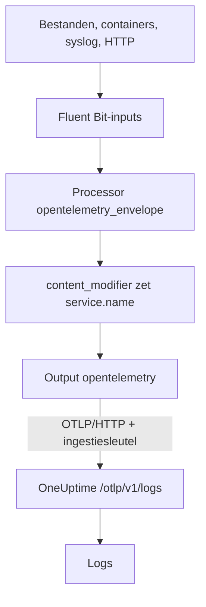

# Fluent Bit

[Fluent Bit](https://docs.fluentbit.io/manual) is een lichte agent die logs verzamelt uit bestanden, systemd, containers, syslog, HTTP en vele andere bronnen. De [OpenTelemetry-output](https://docs.fluentbit.io/manual/pipeline/outputs/opentelemetry) stuurt wat hij verzamelt naar het OpenTelemetry-endpoint (OTLP) van OneUptime, waar de logs doorzoekbaar worden onder **Producten → Logboeken**.

:::cards
- [Fluent Bit configureren](#fluent-bit-configureren): De OpenTelemetry-output toevoegen en je service een naam geven.
- [Volledig voorbeeld](#volledig-voorbeeld): Een compleet configuratiebestand om mee te beginnen.
- [Zelf gehoste OneUptime](#zelf-gehoste-oneuptime): Fluent Bit op je eigen instantie richten.
:::

## Hoe het werkt



Fluent Bit verpakt elk record in een OpenTelemetry-envelop, zodat het resource-attributen zoals `service.name` kan dragen. De OpenTelemetry-output stuurt de records daarna naar OneUptime, met je ingestiesleutel in de header `x-oneuptime-token`. OneUptime slaat ze op onder de service die `service.name` noemt, en maakt die service aan zodra hij voor het eerst stuurt.

## Voordat je begint

- **Fluent Bit installeren**: zie de [installatiehandleiding](https://docs.fluentbit.io/manual/installation/getting-started-with-fluent-bit). De configuratie op deze pagina gebruikt het YAML-formaat van Fluent Bit en de processor `opentelemetry_envelope`, dus gebruik een recente versie.
- **Een OneUptime-project.** In OneUptime Cloud wordt telemetrie per opgenomen GB gefactureerd (zie de [prijzen](https://oneuptime.com/pricing)), en een project op het Free-abonnement heeft een betaalmethode nodig voordat het telemetrie kan sturen.
- **Een telemetrie-ingestiesleutel.** Heb je er nog geen:

:::steps
### De ingestiesleutels openen

Ga naar **Producten → Projectinstellingen**, open **Telemetrie & APM** in het zijmenu en kies **Ingestiesleutels**.


### Een sleutel maken

Klik op **Inname-sleutel aanmaken**. In het dialoogvenster is de naam van de sleutel al ingevuld en **Server** gekozen, het soort sleutel waarmee een applicatie of een collector stuurt. Klik dus op **Inname-sleutel aanmaken** om hem te maken, of geef hem eerst een andere naam.

### Het geheim kopiëren

De nieuwe sleutel opent op een eigen pagina. Kopieer de **Geheime sleutel**: dat is het `YOUR_TELEMETRY_INGESTION_TOKEN` in de configuratie hieronder.


:::

## Fluent Bit configureren

Fluent Bit leest zijn YAML-configuratie uit een bestand zoals `/etc/fluent-bit/fluent-bit.yaml`.

:::steps
### De OpenTelemetry-output toevoegen

Voeg een `opentelemetry`-output toe die naar OneUptime stuurt. Houd tijdens het testen de `stdout`-output aan als je de records lokaal wilt zien:

```yaml title="fluent-bit.yaml"
pipeline:
  outputs:
    - name: stdout
      match: "*"
    - name: opentelemetry
      match: "*"
      host: "oneuptime.com"
      port: 443
      metrics_uri: "/otlp/v1/metrics"
      logs_uri: "/otlp/v1/logs"
      traces_uri: "/otlp/v1/traces"
      tls: On
      header:
        - x-oneuptime-token YOUR_TELEMETRY_INGESTION_TOKEN
```

### Logs in een OpenTelemetry-envelop verpakken en de service een naam geven

Voeg de processor `opentelemetry_envelope` aan elke input toe, gevolgd door een `content_modifier` die `service.name` zet. Vervang `YOUR_SERVICE_NAME` door de naam waaronder de logs in OneUptime moeten verschijnen:

```yaml title="fluent-bit.yaml"
pipeline:
  inputs:
    - name: tail # or any other input
      path: /var/log/my-app/*.log

      processors:
        logs:
          - name: opentelemetry_envelope

          - name: content_modifier
            context: otel_resource_attributes
            action: upsert
            key: service.name
            value: YOUR_SERVICE_NAME
```

### Fluent Bit herstarten

Herstart de Fluent Bit-service, of start hem met `fluent-bit -c /etc/fluent-bit/fluent-bit.yaml`. Binnen enkele seconden verschijnen de logs onder **Producten → Logboeken**, en staat de service onder **Producten → Services**.
:::

## Volledig voorbeeld

Deze configuratie ontvangt logs via HTTP op poort `8888` en stuurt ze door naar OneUptime:

```yaml title="fluent-bit.yaml"
service:
  flush: 1
  log_level: info

pipeline:
  inputs:
    - name: http
      listen: 0.0.0.0
      port: 8888

      processors:
        logs:
          - name: opentelemetry_envelope

          - name: content_modifier
            context: otel_resource_attributes
            action: upsert
            key: service.name
            value: YOUR_SERVICE_NAME

  outputs:
    - name: stdout
      match: "*"
    - name: opentelemetry
      match: "*"
      host: "oneuptime.com"
      port: 443
      metrics_uri: "/otlp/v1/metrics"
      logs_uri: "/otlp/v1/logs"
      traces_uri: "/otlp/v1/traces"
      tls: On
      header:
        - x-oneuptime-token YOUR_TELEMETRY_INGESTION_TOKEN
```

Vervang de `http`-input door de inputs die je nodig hebt (bijvoorbeeld `tail` voor logbestanden of `systemd` voor het journal) en houd op elk ervan de twee processors.

## Zelf gehoste OneUptime

Zet `host` op de host van je OneUptime-instantie. Wordt die via gewone HTTP in plaats van HTTPS aangeboden, zet dan ook `port` op de poort waarop hij luistert (meestal `80`) en verwijder `tls`:

```yaml title="fluent-bit.yaml"
pipeline:
  outputs:
    - name: stdout
      match: "*"
    - name: opentelemetry
      match: "*"
      host: "your-oneuptime-instance.com"
      port: 80
      metrics_uri: "/otlp/v1/metrics"
      logs_uri: "/otlp/v1/logs"
      traces_uri: "/otlp/v1/traces"
      header:
        - x-oneuptime-token YOUR_TELEMETRY_INGESTION_TOKEN
```

## Problemen oplossen

:::details Fluent Bit logt `401` van de OpenTelemetry-output
De ingestiesleutel ontbreekt, is onbekend of verlopen. Controleer de regel `header`: die is `x-oneuptime-token`, een spatie en dan de **Geheime sleutel** van de sleutel.
:::

:::details Fluent Bit logt `402` of `422`
`402`: in OneUptime Cloud zit het project op het Free-abonnement en heeft het geen betaalmethode. Voeg er een toe onder **Projectinstellingen → Facturering en facturen → Facturering**. `422`: de sleutel is uitgeschakeld, of het is een browsersleutel. Zet **Ingeschakeld** weer aan in de instellingen van de sleutel, of maak een **Server**-sleutel.
:::

:::details Logs komen binnen onder een onverwachte service
De service komt uit `service.name`. Controleer of elke input de processor `opentelemetry_envelope` heeft, gevolgd door de `content_modifier` die hem zet.
:::

:::details Er komt niets binnen en Fluent Bit logt verbindingsfouten
Controleer of `tls: On` en `port: 443` zijn ingesteld voor een HTTPS-endpoint, en of de host waarop Fluent Bit draait je OneUptime-host op die poort kan bereiken.
:::

Heb je vragen of hulp nodig bij de configuratie, mail ons dan op support@oneuptime.com.

## Volgende stappen

:::cards
- [Logboekpipelines](/docs/telemetry/log-pipelines): De logs die Fluent Bit stuurt parsen en verrijken.
- [Zoeksyntaxis](/docs/telemetry/search-syntax): De logs vinden in de logboekexplorer.
- [OpenTelemetry](/docs/telemetry/open-telemetry): Endpoints, sleutels en limieten voor alle telemetrie.
- [Fluentd](/docs/telemetry/fluentd): In plaats daarvan Fluentd gebruiken.
:::
