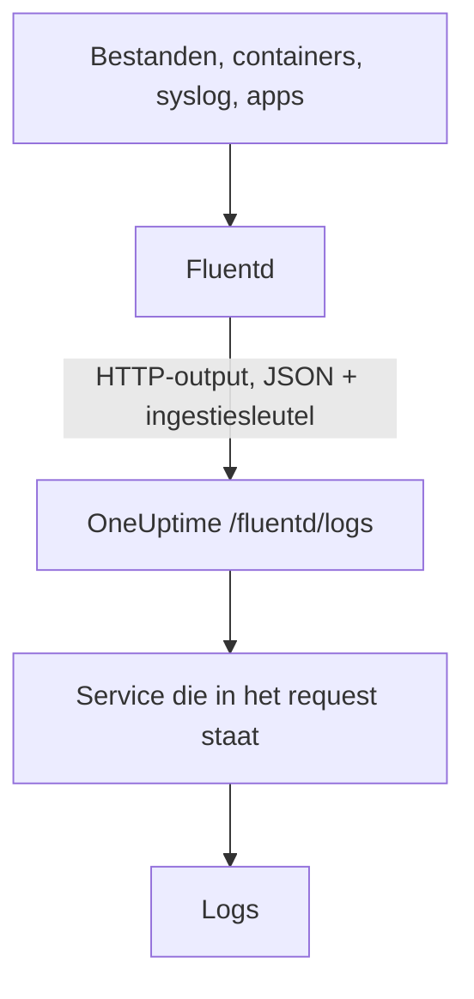

# Fluentd

[Fluentd](https://www.fluentd.org/) verzamelt logs uit bestanden, containers, syslog, applicaties en [vele andere bronnen](https://www.fluentd.org/datasources). De ingebouwde [HTTP-output](https://docs.fluentd.org/output/http) stuurt ze naar het Fluentd-endpoint van OneUptime, waar ze doorzoekbaar worden onder **Producten → Logboeken**.

:::cards
- [Fluentd configureren](#fluentd-configureren): Een HTTP-output toevoegen die naar OneUptime wijst.
- [Hoe records worden gelezen](#hoe-records-worden-gelezen): Welke velden het bericht, het niveau en de attributen worden.
- [Zelf gehoste OneUptime](#zelf-gehoste-oneuptime): Fluentd op je eigen instantie richten.
:::

## Hoe het werkt



Fluentd stuurt records in batches als JSON, met je ingestiesleutel in de header `x-oneuptime-token` en de servicenaam in `x-oneuptime-service-name`. OneUptime maakt van elk record een log van die service, en maakt de service aan zodra hij voor het eerst stuurt.

## Voordat je begint

- **Fluentd installeren**: zie de [installatiehandleiding](https://docs.fluentd.org/installation).
- **Een OneUptime-project.** In OneUptime Cloud wordt telemetrie per opgenomen GB gefactureerd (zie de [prijzen](https://oneuptime.com/pricing)), en een project op het Free-abonnement heeft een betaalmethode nodig voordat het telemetrie kan sturen.
- **Een telemetrie-ingestiesleutel.** Heb je er nog geen:

:::steps
### De ingestiesleutels openen

Ga naar **Producten → Projectinstellingen**, open **Telemetrie & APM** in het zijmenu en kies **Ingestiesleutels**.


### Een sleutel maken

Klik op **Inname-sleutel aanmaken**. In het dialoogvenster is de naam van de sleutel al ingevuld en **Server** gekozen, het soort sleutel waarmee een applicatie of een collector stuurt. Klik dus op **Inname-sleutel aanmaken** om hem te maken, of geef hem eerst een andere naam.

### Het geheim kopiëren

De nieuwe sleutel opent op een eigen pagina. Kopieer de **Geheime sleutel**: dat is het `YOUR_SERVICE_TOKEN` in de configuratie hieronder.


:::

## Fluentd configureren

Het configuratiebestand van Fluentd is meestal `/etc/fluent/fluentd.conf`, of `/etc/td-agent/td-agent.conf` bij het oudere td-agent-pakket.

:::steps
### Een HTTP-output toevoegen

Voeg een `<match>`-sectie toe die records naar OneUptime stuurt. Vervang `YOUR_SERVICE_TOKEN` door je ingestiesleutel en `YOUR_SERVICE_NAME` door de naam waaronder de logs moeten verschijnen (welke naam je maar wilt):

```text title="fluentd.conf"
# Match all patterns
<match **>
  @type http

  endpoint https://oneuptime.com/fluentd/logs
  open_timeout 2

  headers {"x-oneuptime-token":"YOUR_SERVICE_TOKEN", "x-oneuptime-service-name":"YOUR_SERVICE_NAME"}

  content_type application/json
  json_array true

  <format>
    @type json
  </format>
  <buffer>
    flush_interval 10s
  </buffer>
</match>
```

`json_array true` stuurt elke flush van de buffer als één JSON-array, en `flush_interval 10s` stuurt elke 10 seconden een batch.

### Fluentd herstarten

Herstart de Fluentd-service, zodat hij de nieuwe output laadt.

### Controleren of logs binnenkomen

Enkele seconden na de volgende flush verschijnen de logs onder **Producten → Logboeken**. De service staat onder **Producten → Services**; bestond hij nog niet, dan maakt OneUptime hem aan.
:::

## Volledig voorbeeld

Deze configuratie ontvangt records via het forward-protocol van Fluentd op poort `24224` en stuurt ze allemaal naar OneUptime:

```text title="fluentd.conf"
####
## Source descriptions:
##

## built-in TCP input
## @see https://docs.fluentd.org/input/forward
<source>
  @type forward
  port 24224
  bind 0.0.0.0
</source>

<match **>
  @type http

  endpoint https://oneuptime.com/fluentd/logs
  open_timeout 2

  headers {"x-oneuptime-token":"YOUR_SERVICE_TOKEN", "x-oneuptime-service-name":"YOUR_SERVICE_NAME"}

  content_type application/json
  json_array true

  <format>
    @type json
  </format>
  <buffer>
    flush_interval 10s
  </buffer>
</match>
```

Wil je verschillende bronnen als verschillende services sturen, gebruik dan één `<match>`-sectie per tag, elk met een eigen `x-oneuptime-service-name`.

## Hoe records worden gelezen

OneUptime leest deze velden uit elk record:

| Logveld | Gelezen uit het eerste aanwezige veld van | Opmerkingen |
| --- | --- | --- |
| Inhoud | `message`, `log`, `msg`, `body`, `text` | De logregel. Een record zonder een van deze velden wordt in zijn geheel opgeslagen, als JSON. |
| Niveau | `level`, `severity`, `loglevel`, `log_level`, `priority`, `severityText`, `severity_text` | Namen zoals `trace`, `debug`, `info`, `notice`, `warn`, `error`, `critical` en `fatal`, in hoofd- of kleine letters. Elke andere waarde wordt opgeslagen als `Unspecified`. |
| Trace-ID | `trace_id`, `traceId`, `traceid` | Koppelt de log aan zijn trace. |
| Span-ID | `span_id`, `spanId`, `spanid` | Koppelt de log aan zijn span. |
| Service | de header `x-oneuptime-service-name` | `Fluentd` als de header niet is ingesteld. |
| Tijd | — | Het moment waarop OneUptime het record ontvangt. |

Elk ander veld wordt een attribuut met de naam `fluentd.` gevolgd door de naam van het veld, waarop je kunt zoeken en filteren: een veld `container_name` is `@fluentd.container_name` in de logboekexplorer. Een genest object wordt met punten platgemaakt, zoals `fluentd.kubernetes.pod_name`, en een lijst wordt als JSON opgeslagen.

Fluentd-logs gaan door je [logboekpipelines](/docs/telemetry/log-pipelines), dropfilters en maskeerregels, net als elke andere log.

## Zelf gehoste OneUptime

Vervang `https://oneuptime.com` in `endpoint` door de URL van je OneUptime-instantie: `http(s)://YOUR_ONEUPTIME_HOST/fluentd/logs`.

## Problemen oplossen

:::details Fluentd logt `401` van de HTTP-output
De ingestiesleutel ontbreekt, is onbekend of verlopen. Controleer de waarde van `x-oneuptime-token` in `headers`.
:::

:::details Fluentd logt `402` of `422`
`402`: in OneUptime Cloud zit het project op het Free-abonnement en heeft het geen betaalmethode. Voeg er een toe onder **Projectinstellingen → Facturering en facturen → Facturering**. `422`: de sleutel is uitgeschakeld, of het is een browsersleutel. Zet **Ingeschakeld** weer aan in de instellingen van de sleutel, of maak een **Server**-sleutel.
:::

:::details Logs komen binnen onder de service `Fluentd`
De header `x-oneuptime-service-name` ontbreekt. Voeg hem toe aan `headers` in elke `<match>`-sectie.
:::

:::details De inhoud van de log toont het hele record als JSON
OneUptime neemt de inhoud uit het eerste aanwezige veld van `message`, `log`, `msg`, `body` of `text`, en slaat het hele record op als het geen van die velden heeft. Hernoem het veld met je logregel naar een daarvan, bijvoorbeeld met het filter `record_transformer` van Fluentd.
:::

Heb je vragen of hulp nodig bij de configuratie, mail ons dan op support@oneuptime.com.

## Volgende stappen

:::cards
- [Logboekpipelines](/docs/telemetry/log-pipelines): De logs die Fluentd stuurt parsen en verrijken.
- [Zoeksyntaxis](/docs/telemetry/search-syntax): De logs vinden in de logboekexplorer.
- [Fluent Bit](/docs/telemetry/fluentbit): Een lichtere agent die via OpenTelemetry stuurt.
- [Logs-monitor](/docs/monitor/logs-monitor): Waarschuwen wanneer overeenkomende logs verschijnen.
:::
