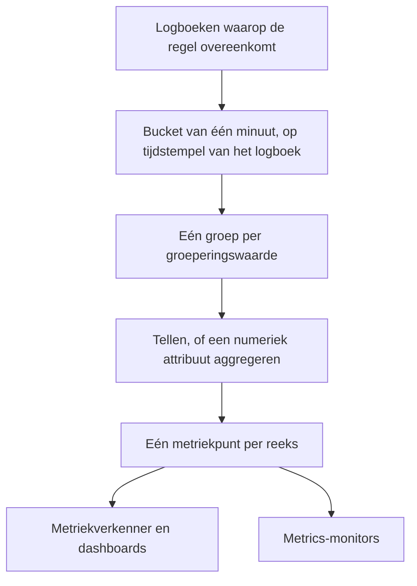
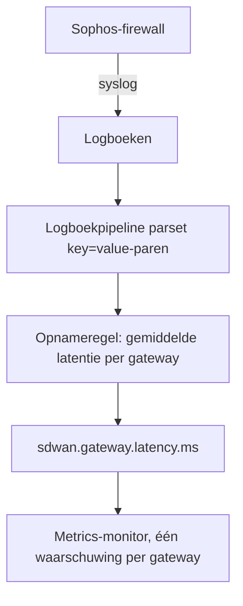

# Opnameregels voor logboeken

Een **Log Recording Rule** maakt van logboeken een metriek. Elke minuut neemt hij de logboeken waarop zijn filter overeenkomt en schrijft hij per minuut één getal naar de metriekopslag: hoeveel logboeken overeenkwamen, of de som, het gemiddelde, het minimum, het maximum of een percentiel van een numeriek attribuut van die logboeken. Splits het resultaat op naar maximaal vijf logboekattributen en u krijgt één reeks per waarde: één per gateway, per host, per klant.

:::cards
- [Hoe een regel werkt](#hoe-een-regel-werkt): Buckets, timing, inhalen en gaten.
- [Een regel maken](#een-regel-maken): De velden van de regeleditor.
- [Voorbeeld: SD-WAN-gatewaylatentie](#voorbeeld-sd-wan-gatewaylatentie-van-een-sophos-firewall): Van firewall-syslog naar een waarschuwing per gateway.
- [Machtigingen](#machtigingen): Wie regels mag maken, wijzigen en lezen.
:::

## Overzicht

Het resultaat is een gewone metriek. Toon hem in de **Metriekverkenner** en op dashboards, en waarschuw erop met een monitor van het type **Metrieken**, inclusief waarschuwingen per reeks met **Groeperen op**.

Gebruik een opnameregel voor logboeken wanneer het getal dat u wilt weten alleen in uw logboeken staat: de SLA-samenvattingen van een firewall, een batchtaak die logt hoe lang hij duurde, de antwoordgroottes van een toegangslogboek, of gewoon hoeveel foutlogboeken een service per minuut schrijft.

Opnameregels voor logboeken staan onder **Logboeken → Instellingen → Opnameregels**. Hun tegenhangers voor metrieken en spans staan onder **Metrieken → Instellingen → Opnameregels** en **Traces → Instellingen → Opnameregels**.

## Hoe een regel werkt



- **Eén punt per minuut, per reeks.** Logboeken worden op hun tijdstempel in buckets van 1 minuut gegroepeerd. Elke bucket levert één punt op voor elke afzonderlijke combinatie van waarden van de groeperingsattributen.
- **Berekend 30 seconden nadat de minuut voorbij is.** Door die korte wachttijd komen logboeken die iets te laat binnenkomen toch nog in hun minuut terecht. Een logboek dat later binnenkomt, wordt niet geteld.
- **Geen gaten, geen dubbeltellingen.** Elke regel onthoudt de laatste minuut die hij schreef (in de regellijst getoond als **Computed Until**). Na een herstart van de worker of andere uitval haalt hij de gemiste minuten in, tot 60 minuten terug, en schrijft hij dezelfde minuut nooit twee keer.
- **Een telling zonder groepering heeft nooit gaten.** Een minuut zonder overeenkomende logboeken wordt geschreven als `0`. Elke andere regel schrijft niets voor een minuut zonder iets om te aggregeren, zodat grafieken en monitors geen gegevens zien in plaats van een verzonnen nul.
- **Geschreven zoals elke andere afgeleide metriek.** De punten zijn Gauge-datapunten met de **Naam uitvoermetriek** van de regel, ze dragen de groeperingsattributen en `oneuptime.derived.log_rule_id` (de ID van de regel) en volgen dezelfde bewaartermijn als de punten van de opnameregels voor metrieken en traces: 15 dagen.

Een wijziging aan de definitie van een regel geldt vanaf de volgende minuut die hij schrijft; al geschreven punten worden niet herschreven. Een regel uitschakelen stopt hem; weer ingeschakeld haalt hij de minuten in die hij uitgeschakeld heeft gemist, tot dezelfde 60 minuten.

## Een regel maken

:::steps
### De opnameregels openen

Ga naar **Logboeken → Instellingen → Opnameregels** en kies **Log Recording Rule aanmaken**.

### De regel een naam geven

Typ een **Naam**. De **Naam uitvoermetriek** eronder wordt tijdens het typen uit de naam gevormd; kies **Bewerken** ernaast om een eigen naam te typen.

### De logboeken kiezen en bepalen wat wordt berekend

Beperk de regel onder **Which Logs** met telemetrieservices, ernstniveaus, tekst en attribuutfilters. Kies een **Aggregatie** en, voor alles behalve een telling, het **Numeric Attribute** dat wordt geaggregeerd.

### Het resultaat opsplitsen en opslaan

Voeg eventueel attributen toe onder **Groeperen op** en een **Unit**. Controleer de regel onderaan de editor en sla op. Binnen een paar minuten toont de regellijst een tijd onder **Computed Until**.
:::

| Veld | Wat het doet |
| --- | --- |
| Naam | Wat de regel berekent, bijvoorbeeld *SD-WAN gateway latency*. |
| Naam uitvoermetriek | De metriek die de regel schrijft. Gevormd uit de naam (*SD-WAN gateway latency* schrijft `sd_wan_gateway_latency`), tenzij u **Bewerken** kiest en een eigen naam typt. Moet uniek zijn onder de opnameregels van het project. |
| Which Logs | Optionele filters, allemaal met AND gecombineerd: telemetrieservices, ernstniveaus, tekst die de logtekst bevat en attribuutfilters (een attribuut gelijk aan een waarde). |
| Aggregatie | `Count of logs`, of een aggregatie van een numeriek attribuut (zie hieronder). |
| Numeric Attribute | Bij elke aggregatie behalve de telling: het attribuut waarvan de waarden worden geaggregeerd, bijvoorbeeld `latency`. |
| Groeperen op | Optioneel: tot 5 attribuutsleutels. Eén reeks per afzonderlijke combinatie van hun waarden. |
| Unit | Optioneel: de eenheid van de uitvoermetriek, bijvoorbeeld `ms`. Wordt getoond overal waar de metriek in een grafiek staat. |
| Beschrijving | Onder **Meer velden**: waar de regel voor dient. |
| Ingeschakeld | Onder **Meer velden**: standaard aan. Alleen ingeschakelde regels worden berekend. |

De regel onderaan de editor zegt wat de regel zal schrijven, bijvoorbeeld `avg(latency) by gw_name, profile_name`.

Een regel kan op hoogstens 10 attributen en 100 telemetrieservices filteren.

### Aggregaties

| Aggregatie | Het punt van elke minuut |
| --- | --- |
| Count of logs | Hoeveel logboeken op het filter overeenkwamen. |
| Gemiddelde | Het gemiddelde van de waarden van het numerieke attribuut. |
| Som | De waarden van het attribuut opgeteld. |
| Minimum | De kleinste waarde. |
| Maximum | De grootste waarde. |
| p50 (median) | De mediaan. |
| p75 | Het 75e percentiel. |
| p90 | Het 90e percentiel. |
| p95 | Het 95e percentiel. |
| p99 | Het 99e percentiel. |

### Numerieke attributen

De waarde van het numerieke attribuut moet een gewoon getal zijn. Die kan binnenkomen als getal (`latency=11` als getal geparst) of als tekst (`"11"`, `"11.5"`, `"1e3"`). Een logboek waarvan de waarde ontbreekt of geen getal is (`"11ms"`, `"n/a"`, een lege tekenreeks) wordt **overgeslagen**. Het telt nooit als `0`, dus een misvormd logboek kan een gemiddelde niet omlaag trekken.

### Attribuutsleutels

Sleutels van attribuutfilters komen overeen ongeacht hoofdletters, net als de filters van de logboekverkenner. Het numerieke attribuut en de groeperingssleutels moeten precies zo worden geschreven als uw logboeken ze dragen, inclusief een voorvoegsel dat een logboekpipeline toevoegt. De sleutelvelden stellen de sleutels voor die de logboeken van uw project dragen, dus kies uit de lijst in plaats van een sleutel met de hand te typen.

Sleutels mogen letters, cijfers en `. _ : / -` bevatten.

### Groeperen en het maximum aantal reeksen

Elke groeperingssleutel vermenigvuldigt het aantal reeksen dat een regel schrijft, dus groepeer op attributen die iets aanduiden dat u apart wilt zien of waarop u apart wilt waarschuwen (een gateway, een host, een klant), niet op attributen die bij elk logboek anders zijn, zoals een verzoek-ID of het IP-adres van een client.

Een regel schrijft hoogstens 1000 reeksen per minuut. Daarboven worden de reeksen met de meeste overeenkomende logboeken behouden en wordt de rest van die minuut weggelaten. Een logboek dat een van de groeperingsattributen mist, telt toch mee; zijn reeks wordt zonder dat attribuut geschreven.

## Voorbeeld: SD-WAN-gatewaylatentie van een Sophos-firewall

Een Sophos XGS-firewall met SD-WAN-logging aan stuurt om de paar minuten een SLA-samenvatting per SD-WAN-profiel en gateway:

```text
log_type="SD-WAN" log_component="SLA" profile_name="Branch-Internet" gw_name="WAN2" latency=11 jitter=2 packet_loss=0 gw_status="up" sla_status="SLA met"
```

Dit voorbeeld maakt van die samenvattingen een latentiemetriek per gateway en waarschuwt wanneer de latentie van één gateway hoog blijft.



:::steps
### De logboeken binnenhalen, met hun velden als attributen

1. Stuur de syslog van de firewall naar OneUptime: zie [Syslog](/docs/telemetry/syslog).
2. Voeg onder **Logboeken → Instellingen → Pipelines** een pipeline toe met een processor die de `key=value`-paren van de tekst in logboekattributen splitst, zodat elke samenvatting `log_type`, `log_component`, `profile_name`, `gw_name`, `latency`, `jitter` en `packet_loss` als attributen draagt. De [Key=Value Parser](/docs/telemetry/log-pipelines#keyvalue-parser) doet dat.
3. Open de verkenner **Logboeken** en controleer de attribuutnamen op een SLA-logboek. Voegt uw pipeline een voorvoegsel toe, gebruik dan hieronder de namen met voorvoegsel.

### De opnameregel maken

Maak onder **Logboeken → Instellingen → Opnameregels** een regel:

- **Naam:** SD-WAN gateway latency
- **Naam uitvoermetriek:** kies **Bewerken** en typ `sdwan.gateway.latency.ms`
- **Which Logs:** attribuutfilters `log_type` = `SD-WAN` en `log_component` = `SLA`
- **Aggregatie:** Gemiddelde, **Numeric Attribute:** `latency`
- **Groeperen op:** `gw_name` en `profile_name`
- **Unit:** `ms`

Via de API, MCP of Terraform is de **definitie** van dezelfde regel:

```json
{
  "filter": {
    "attributeFilters": [
      { "key": "log_type", "value": "SD-WAN" },
      { "key": "log_component", "value": "SLA" }
    ]
  },
  "aggregationType": "Avg",
  "valueAttribute": "latency",
  "groupByAttributes": ["gw_name", "profile_name"],
  "unit": "ms"
}
```

Herhaal dit met `jitter` (`sdwan.gateway.jitter.ms`, eenheid `ms`) en `packet_loss` (`sdwan.gateway.packet_loss.percent`, eenheid `%`) voor de andere twee SLA-metingen. Een regel **Count of logs**, gefilterd op `gw_status` = `down` en gegroepeerd op `gw_name`, telt de meldingen van uitgevallen gateways per gateway.

Binnen een paar minuten toont de regellijst een tijd onder **Computed Until**, en `sdwan.gateway.latency.ms` verschijnt in de metriekverkenner: kies hem, groepeer op `gw_name` en u hebt één latentielijn per gateway.

### Waarschuwen wanneer de latentie van één gateway hoog blijft

Maak een monitor van het type **Metrieken** (zie [Metrics-monitor](/docs/monitor/metrics-monitor)):

1. **Metriekquery:** `sdwan.gateway.latency.ms`, aggregatie **Gemiddelde**, **Groeperen op** `gw_name` en `profile_name`.
2. **Voortschrijdend tijdvenster:** Past 15 Minutes. De firewall meldt zich om de paar minuten, dus het venster bevat meerdere punten per gateway.
3. **Aggregatiestrategie:** **All Values**: elk punt in het venster moet de drempel overschrijden, zodat één trage samenvatting niemand oproept. Gebruik in plaats daarvan **Gemiddelde** om bij een hoog gemiddelde te waarschuwen.
4. **Criteria:** Metric value **Greater Than** `150` opent een waarschuwing.
5. Gebruik eventueel de groeperingswaarden in de titel van de waarschuwing, bijvoorbeeld `SD-WAN latency high on {{gw_name}} ({{profile_name}})`.

Met groepering ingesteld is elke gateway een eigen reeks: wordt WAN2 traag, dan opent er alleen voor WAN2 een waarschuwing, en die lost zichzelf op wanneer WAN2 herstelt. Zie [Waarschuwingen per reeks](/docs/monitor/metrics-monitor).
:::

## Goed om te weten

- **Tijdstempels komen uit de logboeken.** Een logboek valt in de minuut van zijn eigen tijdstempel. Een apparaat waarvan de klok meer dan een beetje afwijkt, legt zijn logboeken in de verkeerde minuut, of helemaal buiten het venster.
- **Geen terugrekening.** Een nieuwe regel begint met de minuut vóór zijn eerste uitvoering; oudere logboeken worden niet berekend.
- **Een regel verwijderen** stopt hem. De punten die hij al schreef, blijven tot ze verlopen.
- **Opnameregels zien alle logboeken van het project.** Wie de uitvoermetriek kan lezen, ziet getallen die zijn berekend uit elk logboek waarop het filter van de regel overeenkomt; opnameregels voor logboeken maken en bewerken is daarom voorbehouden aan projecteigenaren, beheerders en de machtigingen **Create / Edit Log Recording Rule**.

## Machtigingen

| Machtiging | Staat toe |
| --- | --- |
| Create Log Recording Rule | Regels maken. |
| Edit Log Recording Rule | Regels wijzigen en uitschakelen. |
| Delete Log Recording Rule | Regels verwijderen. |
| Read Log Recording Rule | Regels bekijken en wat ze berekenen. |

Projecteigenaren en beheerders mogen dit allemaal. Projectleden, kijkers en de telemetrierollen kunnen regels lezen.

## Volgende stappen

:::cards
- [Metrics-monitor](/docs/monitor/metrics-monitor): Waarschuwen op de metrieken die uw regels schrijven.
- [Logboekpipelines](/docs/telemetry/log-pipelines): De attributen eruit halen die een regel aggregeert.
- [Syslog](/docs/telemetry/syslog): Logboeken van firewalls en servers naar OneUptime sturen.
:::
