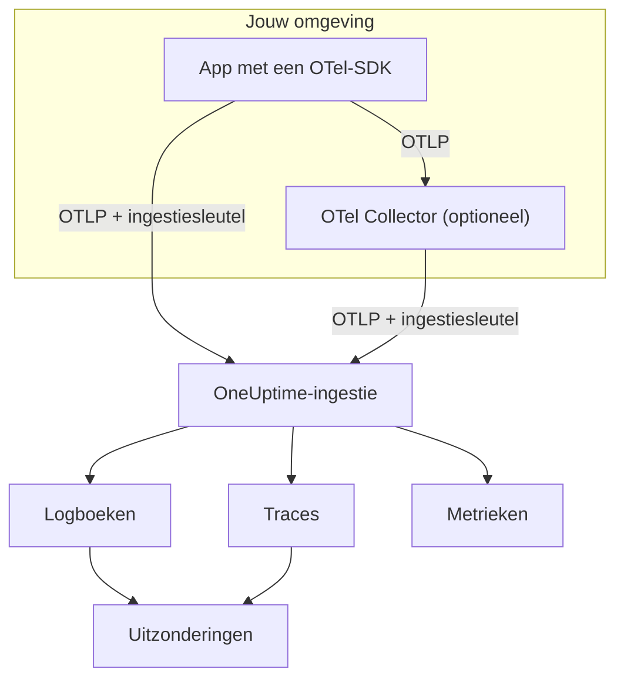

# OpenTelemetry

OneUptime neemt logs, metrics en traces op via het OpenTelemetry Protocol (OTLP). Richt een willekeurige OpenTelemetry-SDK, of een OpenTelemetry Collector, met een ingestiesleutel op OneUptime, en je gegevens verschijnen onder **Logboeken**, **Traces**, **Metrieken** en **Uitzonderingen**. Deze pagina laat een service binnen een paar minuten gegevens sturen en behandelt daarna de endpoints, limieten en fouten die je in productie nodig hebt.

:::cards
- [Snelstart](#snelstart): Een sleutel maken, vier omgevingsvariabelen instellen en de SDK toevoegen.
- [Een Collector gebruiken](#via-een-opentelemetry-collector-sturen): OneUptime als exporter toevoegen aan een collector die je al draait.
- [Endpoints en limieten](#endpoints-en-limieten): URL's, poorten, coderingen, groottelimieten en statuscodes.
- [Problemen oplossen](#problemen-oplossen): Wat je controleert als er geen gegevens binnenkomen.
:::

## Hoe het werkt

Je applicatie exporteert OTLP rechtstreeks naar OneUptime, of naar een OpenTelemetry Collector die het doorstuurt. Elk verzoek draagt je ingestiesleutel in de header `x-oneuptime-token`, en OneUptime gebruikt de sleutel om je project te vinden.



- **Services worden voor je aangemaakt.** Het resource-attribuut `service.name` (ingesteld met `OTEL_SERVICE_NAME`) geeft de service een naam waartoe je gegevens horen. OneUptime maakt de service aan zodra die voor het eerst stuurt, en toont hem onder **Producten → Services**.
- **Fouten worden uitzonderingen.** Uitzonderingsgebeurtenissen op spans, en uitzonderingen die in logs zijn vastgelegd, worden onder **Uitzonderingen** gegroepeerd in issues — zie [Uitzonderingen uit logs](#uitzonderingen-uit-logs).

## Voordat je begint

- Een OneUptime-project waarin je ingestiesleutels mag maken: projecteigenaren en -beheerders mogen dat, en ook iedereen met de machtiging **Create Telemetry Ingestion Key**.
- Een applicatie waaraan je een OpenTelemetry-SDK kunt toevoegen, of een OpenTelemetry Collector.
- Uitgaand HTTPS (poort 443) van je applicatie of collector naar `oneuptime.com`, of naar je eigen OneUptime-host.

> [!NOTE]
> Op OneUptime Cloud wordt telemetrie gefactureerd per opgenomen GB. Een project op het Free-abonnement heeft een betaalmethode nodig voordat het telemetrie kan sturen — het dialoogvenster dat de sleutel maakt, toont de prijzen.

## Snelstart

:::steps
### Een ingestiesleutel maken

1. Ga naar **Producten → Projectinstellingen**.
2. Open in het zijmenu **Telemetrie & APM** en kies **Ingestiesleutels**.
3. Klik op **Inname-sleutel aanmaken**. Het dialoogvenster vult een naam in en kiest het sleuteltype **Server**, waarmee een applicatie of een collector stuurt. Geef hem eventueel een andere naam en klik dan op **Inname-sleutel aanmaken**.


De nieuwe sleutel opent op een eigen pagina. Kopieer de **Geheime sleutel** — dat is het token dat je als `x-oneuptime-token` stuurt.


### De OpenTelemetry-omgevingsvariabelen instellen

Elke OpenTelemetry-SDK leest dezelfde standaard omgevingsvariabelen, dus deze stap is in elke taal hetzelfde.

| Omgevingsvariabele | Waarde | Wat het doet |
| --- | --- | --- |
| `OTEL_EXPORTER_OTLP_ENDPOINT` | `https://oneuptime.com/otlp` | Waarheen te sturen. De SDK voegt zelf `/v1/traces`, `/v1/metrics` en `/v1/logs` toe. |
| `OTEL_EXPORTER_OTLP_HEADERS` | `x-oneuptime-token=YOUR_ONEUPTIME_INGESTION_KEY` | Stuurt je ingestiesleutel mee met elk verzoek. |
| `OTEL_EXPORTER_OTLP_PROTOCOL` | `http/protobuf` | OTLP via HTTP. Sommige SDK's gebruiken standaard gRPC, dat een ander endpoint gebruikt. |
| `OTEL_SERVICE_NAME` | `my-service` | De service waaronder je gegevens in OneUptime verschijnen. |

```bash
export OTEL_EXPORTER_OTLP_ENDPOINT="https://oneuptime.com/otlp"
export OTEL_EXPORTER_OTLP_HEADERS="x-oneuptime-token=YOUR_ONEUPTIME_INGESTION_KEY"
export OTEL_EXPORTER_OTLP_PROTOCOL="http/protobuf"
export OTEL_SERVICE_NAME="my-service"
```

Zelf gehost? Vervang `https://oneuptime.com` door de URL van je OneUptime-instantie, bijvoorbeeld `https://oneuptime.example.com/otlp`. Om uitzonderingen met een omgeving te labelen, stel je ook `OTEL_RESOURCE_ATTRIBUTES` in op `deployment.environment=production`.

### OpenTelemetry aan je app toevoegen

Kies je taal. Elke opzet leest de omgevingsvariabelen hierboven, dus er staat geen endpoint of sleutel in je code.

:::tabs
@tab Node.js
Installeer de SDK, de automatische instrumentaties en de OTLP/HTTP-exporters:

```bash
npm install @opentelemetry/sdk-node @opentelemetry/auto-instrumentations-node \
  @opentelemetry/exporter-trace-otlp-proto @opentelemetry/exporter-metrics-otlp-proto \
  @opentelemetry/exporter-logs-otlp-proto @opentelemetry/sdk-metrics @opentelemetry/sdk-logs
```

Maak de SDK in een eigen bestand:

```javascript title="instrumentation.js"
const { NodeSDK } = require("@opentelemetry/sdk-node");
const { getNodeAutoInstrumentations } = require("@opentelemetry/auto-instrumentations-node");
const { OTLPTraceExporter } = require("@opentelemetry/exporter-trace-otlp-proto");
const { OTLPMetricExporter } = require("@opentelemetry/exporter-metrics-otlp-proto");
const { OTLPLogExporter } = require("@opentelemetry/exporter-logs-otlp-proto");
const { PeriodicExportingMetricReader } = require("@opentelemetry/sdk-metrics");
const { BatchLogRecordProcessor } = require("@opentelemetry/sdk-logs");

// The exporters read OTEL_EXPORTER_OTLP_ENDPOINT and OTEL_EXPORTER_OTLP_HEADERS.
const sdk = new NodeSDK({
  traceExporter: new OTLPTraceExporter(),
  metricReader: new PeriodicExportingMetricReader({
    exporter: new OTLPMetricExporter(),
  }),
  logRecordProcessors: [new BatchLogRecordProcessor(new OTLPLogExporter())],
  instrumentations: [getNodeAutoInstrumentations()],
});

sdk.start();
```

Laad het vóór je applicatiecode:

```bash
node --require ./instrumentation.js app.js
```
@tab Python
Installeer de OpenTelemetry-distributie en de exporter, en daarna de instrumentaties voor de bibliotheken die je app gebruikt:

```bash
pip install opentelemetry-distro opentelemetry-exporter-otlp
opentelemetry-bootstrap -a install
```

Start je app via `opentelemetry-instrument`. Het exporteert traces, metrics en logs; de logging-variabele stuurt ook records die met de `logging`-module van Python zijn geschreven:

```bash
OTEL_PYTHON_LOGGING_AUTO_INSTRUMENTATION_ENABLED=true opentelemetry-instrument python app.py
```
@tab Go
Voeg de SDK en de OTLP/HTTP-exporters toe:

```bash
go get go.opentelemetry.io/otel go.opentelemetry.io/otel/sdk go.opentelemetry.io/otel/sdk/metric \
  go.opentelemetry.io/otel/exporters/otlp/otlptrace/otlptracehttp \
  go.opentelemetry.io/otel/exporters/otlp/otlpmetric/otlpmetrichttp
```

Maak de tracer- en meter-providers wanneer je programma start:

```go title="main.go"
package main

import (
	"context"
	"log"

	"go.opentelemetry.io/otel"
	"go.opentelemetry.io/otel/exporters/otlp/otlpmetric/otlpmetrichttp"
	"go.opentelemetry.io/otel/exporters/otlp/otlptrace/otlptracehttp"
	sdkmetric "go.opentelemetry.io/otel/sdk/metric"
	sdktrace "go.opentelemetry.io/otel/sdk/trace"
)

func main() {
	ctx := context.Background()

	// Both exporters read OTEL_EXPORTER_OTLP_ENDPOINT and OTEL_EXPORTER_OTLP_HEADERS.
	traceExporter, err := otlptracehttp.New(ctx)
	if err != nil {
		log.Fatal(err)
	}
	tracerProvider := sdktrace.NewTracerProvider(sdktrace.WithBatcher(traceExporter))
	defer tracerProvider.Shutdown(ctx)
	otel.SetTracerProvider(tracerProvider)

	metricExporter, err := otlpmetrichttp.New(ctx)
	if err != nil {
		log.Fatal(err)
	}
	meterProvider := sdkmetric.NewMeterProvider(
		sdkmetric.WithReader(sdkmetric.NewPeriodicReader(metricExporter)),
	)
	defer meterProvider.Shutdown(ctx)
	otel.SetMeterProvider(meterProvider)

	// Your application code.
}
```

De providers halen `OTEL_SERVICE_NAME` uit de omgeving. Voeg voor logs `otlploghttp` toe met een log-bridge zoals `otelslog`; die leest dezelfde variabelen.
@tab Java
Download de OpenTelemetry Java-agent en koppel hem aan je applicatie. Er zijn geen codewijzigingen nodig:

```bash
curl -L -O https://github.com/open-telemetry/opentelemetry-java-instrumentation/releases/latest/download/opentelemetry-javaagent.jar
java -javaagent:opentelemetry-javaagent.jar -jar my-app.jar
```

De agent instrumenteert gangbare frameworks en bibliotheken, en exporteert traces, metrics en logs die via Logback of Log4j worden geschreven.
@tab .NET
Voeg de OpenTelemetry-pakketten voor ASP.NET Core toe:

```bash
dotnet add package OpenTelemetry.Extensions.Hosting
dotnet add package OpenTelemetry.Exporter.OpenTelemetryProtocol
dotnet add package OpenTelemetry.Instrumentation.AspNetCore
dotnet add package OpenTelemetry.Instrumentation.Http
```

Registreer OpenTelemetry bij het opstarten. `UseOtlpExporter()` stuurt traces, metrics en logs, en leest de variabelen `OTEL_EXPORTER_OTLP_*`:

```csharp title="Program.cs"
using OpenTelemetry;
using OpenTelemetry.Metrics;
using OpenTelemetry.Trace;

var builder = WebApplication.CreateBuilder(args);

builder.Services.AddOpenTelemetry()
    .WithTracing(tracing => tracing
        .AddAspNetCoreInstrumentation()
        .AddHttpClientInstrumentation())
    .WithMetrics(metrics => metrics
        .AddAspNetCoreInstrumentation()
        .AddHttpClientInstrumentation())
    .WithLogging()
    .UseOtlpExporter();

var app = builder.Build();
app.Run();
```

Gebruik je Serilog? Zie [Serilog](/docs/telemetry/serilog) om de logs ervan naar OneUptime te sturen.
:::

### Controleren of gegevens binnenkomen

Vraag OneUptime of het je sleutel accepteert:

```bash
curl -i -H "x-oneuptime-token: YOUR_ONEUPTIME_INGESTION_KEY" \
  https://oneuptime.com/otlp/v1/validate
```

Een werkende sleutel geeft `200` met `"valid": true`. Al het andere geeft `401` met een melding wat er mis is — onbekend, uitgeschakeld of verlopen.

Start daarna je app en gebruik hem een minuut. Open **Producten → Services**: je service staat daar onder de naam die je in `OTEL_SERVICE_NAME` hebt ingesteld, met zijn logs, traces, metrics en uitzonderingen. **Producten → Logboeken**, **Producten → Traces** en **Producten → Metrieken** tonen dezelfde gegevens voor alle services.
:::

:::details Een testlog sturen zonder SDK
OTLP/HTTP accepteert ook JSON, dus je kunt een log posten met `curl`. De `severityNumber` `9` maakt er een informatief log van:

```bash
curl -i https://oneuptime.com/otlp/v1/logs \
  -H "Content-Type: application/json" \
  -H "x-oneuptime-token: YOUR_ONEUPTIME_INGESTION_KEY" \
  -d '{
    "resourceLogs": [{
      "resource": {
        "attributes": [
          { "key": "service.name", "value": { "stringValue": "my-service" } }
        ]
      },
      "scopeLogs": [{
        "logRecords": [{
          "severityNumber": 9,
          "body": { "stringValue": "Hello from curl" }
        }]
      }]
    }]
  }'
```

Een `200` betekent dat het log is geaccepteerd. Het verschijnt binnen een paar seconden onder **Producten → Logboeken**, in de service `my-service`.
:::

## Via een OpenTelemetry Collector sturen

Draai een collector als je er al een hebt, als je gegevens op één plek wilt bundelen, filteren of verrijken, of om de ingestiesleutel buiten je applicaties te houden. Je apps exporteren naar de collector, en alleen de collector praat met OneUptime.

:::steps
### OneUptime als exporter toevoegen

Voeg een `otlphttp`-exporter toe die naar OneUptime wijst, en stuur elke pipeline erdoorheen:

```yaml title="otel-collector-config.yaml"
receivers:
  otlp:
    protocols:
      grpc:
        endpoint: 0.0.0.0:4317
      http:
        endpoint: 0.0.0.0:4318

processors:
  batch: {}

exporters:
  otlphttp:
    endpoint: https://oneuptime.com/otlp
    headers:
      x-oneuptime-token: YOUR_ONEUPTIME_INGESTION_KEY

service:
  pipelines:
    traces:
      receivers: [otlp]
      processors: [batch]
      exporters: [otlphttp]
    metrics:
      receivers: [otlp]
      processors: [batch]
      exporters: [otlphttp]
    logs:
      receivers: [otlp]
      processors: [batch]
      exporters: [otlphttp]
```

Houd de standaardinstellingen van de exporter aan: hij stuurt protobuf, gecomprimeerd met gzip, en OneUptime accepteert beide. Stel geen `Content-Type`-header in op de exporter — OneUptime kiest zijn decoder op basis van die header, dus een JSON-contenttype vóór protobuf-bytes breekt de ingestie.

### De collector starten

:::tabs
@tab Docker
```bash
docker run -d --name otel-collector \
  -p 4317:4317 -p 4318:4318 \
  -v "$(pwd)/otel-collector-config.yaml:/etc/otelcol-contrib/config.yaml" \
  otel/opentelemetry-collector-contrib:latest
```
@tab Linux
```bash
otelcol-contrib --config otel-collector-config.yaml
```
:::

De collector luistert naar OTLP op poort `4317` (gRPC) en `4318` (HTTP), de poorten waar SDK's standaard naartoe sturen.

### Je apps op de collector richten

Stel in je applicaties `OTEL_EXPORTER_OTLP_ENDPOINT` in op de collector, bijvoorbeeld `http://localhost:4318`, en verwijder `OTEL_EXPORTER_OTLP_HEADERS` — de collector voegt de sleutel toe. Behoud `OTEL_SERVICE_NAME` in elke applicatie.

Gegevens komen in OneUptime precies zo binnen als in de snelstart. Zo niet, dan staat in het log van de collector waarom — zie [Problemen oplossen](#problemen-oplossen).
:::

Exporteer je al naar een andere leverancier? Voeg de `otlphttp`-exporter toe naast de bestaande en noem beide in de `exporters` van elke pipeline, zodat je tijdens het vergelijken naar allebei stuurt. Om ook hostmetrics en logbestanden te verzamelen, zie de handleiding [Host OpenTelemetry Collector](/docs/telemetry/host-otel-collector).

## Endpoints en limieten

| Instelling | OTLP/HTTP (aanbevolen) | OTLP/gRPC |
| --- | --- | --- |
| Endpoint | `https://oneuptime.com/otlp` | `https://oneuptime.com:443` |
| Authenticatie | Header `x-oneuptime-token` | Metadata `x-oneuptime-token` |
| Codering | Protobuf (`application/x-protobuf`) of JSON (`application/json`) | Protobuf |
| Compressie | Geen, `gzip`, `deflate` of `zstd` | Geen of `gzip` |
| Verzoekgrootte | Tot 4 MB per verzoek op `/otlp` | Tot 4 MB per bericht |

Via HTTP heeft elk signaal een eigen pad onder het endpoint. SDK's en de collector voegen het voor je toe; stel het alleen zelf in als een tool om een volledige URL vraagt.

| Signaal | OTLP/HTTP-URL |
| --- | --- |
| Traces | `https://oneuptime.com/otlp/v1/traces` |
| Metrics | `https://oneuptime.com/otlp/v1/metrics` |
| Logs | `https://oneuptime.com/otlp/v1/logs` |
| Profielen | `https://oneuptime.com/otlp/v1/profiles` |

Voor continue profilering sturen de meeste profilers naar het Pyroscope-compatibele endpoint — zie [Continue profilering](/docs/telemetry/profiles). Een collector die OTLP-profielen exporteert, moet het `profiles_endpoint` van de exporter instellen op `https://oneuptime.com/otlp/v1/profiles`, omdat hij profielen standaard naar een ontwikkelpad stuurt dat OneUptime niet bedient.

### OTLP via gRPC

OneUptime biedt OTLP/gRPC aan op dezelfde host als de webapp, op poort 443 via TLS. Stel `OTEL_EXPORTER_OTLP_PROTOCOL` in op `grpc` en `OTEL_EXPORTER_OTLP_ENDPOINT` op `https://oneuptime.com:443`, en stuur dezelfde header `x-oneuptime-token`. Gebruik in een collector de exporter `otlp` met `endpoint: oneuptime.com:443` en dezelfde `headers`.

Bij een zelf gehoste installatie bereikt gRPC OneUptime alleen via HTTPS: een onversleutelde HTTP-verbinding (h2c) wordt geweigerd. Wordt je instantie via gewoon HTTP aangeboden, gebruik dan OTLP/HTTP.

Twee instellingen van een sleutel gelden alleen voor OTLP/HTTP: de **Requests Per Minute Limit** en de **Pinned Service Name**. Via gRPC verstuurde gegevens houden de `service.name` waarmee ze zijn verstuurd, en tellen niet mee voor de limiet.

### Antwoorden

OneUptime beantwoordt een export zodra de gegevens in de wachtrij staan, en de gegevens verschijnen een paar seconden later.

| Antwoord | gRPC-status | Betekenis | Wat te doen |
| --- | --- | --- | --- |
| `200` | `OK` | Geaccepteerd. | Niets. |
| `401` | `UNAUTHENTICATED` | De sleutel ontbreekt, is onbekend of is verlopen. | Vergelijk de waarde van `x-oneuptime-token` met de **Geheime sleutel** van de sleutel. |
| `402` | `PERMISSION_DENIED` | Alleen OneUptime Cloud: het project zit op het Free-abonnement en heeft geen betaalmethode. | Voeg er een toe onder **Projectinstellingen → Facturering en facturen → Facturering**. |
| `413` | — | Het verzoek is groter dan de groottelimiet. | Stuur kleinere batches. |
| `415` | — | Niet-ondersteunde `Content-Encoding`. | Gebruik `gzip`, `deflate` of `zstd`, of geen compressie. |
| `422` | `PERMISSION_DENIED` | De sleutel is uitgeschakeld, of het is een browsersleutel die buiten zijn toegestane origins wordt gebruikt. | Schakel de sleutel weer in, of stuur met een serversleutel. |
| `429` | — | De **Requests Per Minute Limit** van de sleutel is bereikt. | In eerste instantie niets: exporters proberen het opnieuw na de `Retry-After`-tijd. Verhoog de limiet als het blijft gebeuren. |
| `503` | `UNAVAILABLE` | OneUptime is aan het opstarten, of de ingestiewachtrij is niet beschikbaar. | Niets: OTLP-exporters herhalen een `503` uit zichzelf. |

`401`, `402`, `413`, `415` en `422` zijn permanente fouten voor OTLP-exporters: de exporter laat de batch vallen en logt de fout in plaats van het opnieuw te proberen.

### Herstarts en upgrades

Terwijl OneUptime herstart of wordt geüpgraded, beantwoordt het exports met `503` en `Retry-After: 5` tot het klaar is, en exporters sturen ze opnieuw. De exporter van een collector blijft standaard vijf minuten opnieuw proberen (`retry_on_failure`) en bewaart wat hij niet kon versturen in zijn `sending_queue`, dus laat beide ingeschakeld. De tijd waarin OneUptime niets ontving, wordt je servers, hosts en andere resources nooit aangerekend: zie [Wanneer OneUptime geen gegevens ontvangt](/docs/monitor/when-oneuptime-is-not-receiving#bij-het-opstarten).

### Ingestiesleutels

De pagina van elke sleutel, onder **Projectinstellingen → Telemetrie & APM → Ingestiesleutels**, heeft deze instellingen:

| Instelling | Wat het doet |
| --- | --- |
| **Sleuteltype** | **Server** (standaard) voor applicaties, collectors en agents. **Browser** voor sleutels die in een webpagina worden meegeleverd: alleen schrijven, en alleen geaccepteerd vanaf de eigen **Allowed Origins**. Kan niet worden gewijzigd nadat de sleutel is gemaakt. |
| **Allowed Origins** | De web-origins waarvandaan een browsersleutel werkt, zoals `https://app.example.com`. Genegeerd bij een serversleutel. |
| **Pinned Service Name** | Indien ingesteld, vervangt `service.name` bij alles wat met deze sleutel via OTLP/HTTP wordt gestuurd. |
| **Ingeschakeld** | Zet dit uit om met de sleutel gestuurde gegevens meteen niet meer te accepteren, zonder hem te verwijderen. |
| **Verloopt om** | Na deze datum wordt de sleutel geweigerd. Leeg betekent dat hij nooit verloopt. |
| **Requests Per Minute Limit** | Het maximale aantal OTLP/HTTP-verzoeken per minuut dat met de sleutel wordt geaccepteerd, over alle clients die hem gebruiken. Leeg betekent geen limiet bij een serversleutel, en 6.000 bij een browsersleutel. |
| **Last Used At** | Wanneer voor het laatst gegevens met de sleutel zijn geaccepteerd. Gebruik dit om sleutels te vinden die je veilig kunt roteren of verwijderen. |

**Geheime sleutel opnieuw instellen** op de pagina van de sleutel vervangt het geheim. Elke applicatie en collector die met het oude stuurt, wordt geweigerd tot je hem bijwerkt.

## Zelf gehoste OneUptime

Alles op deze pagina werkt op dezelfde manier met je eigen installatie. Gebruik je OneUptime-URL overal waar deze pagina `https://oneuptime.com` zegt:

- `OTEL_EXPORTER_OTLP_ENDPOINT` is `https://YOUR-ONEUPTIME-HOST/otlp`, of `http://YOUR-ONEUPTIME-HOST/otlp` als je OneUptime via gewoon HTTP aanbiedt.
- De meegeleverde ingress accepteert verzoeken tot 4 MB op `/otlp`. Een proxy die je vóór OneUptime draait, kan een lagere limiet hebben — ingress-nginx stelt `proxy-body-size` standaard in op 1 MB —, dus verhoog die ook voor `/otlp`, anders krijgen exporters `413`.
- Als `DISABLE_TELEMETRY_INGESTION=true` is ingesteld, accepteert OneUptime elke export en slaat het niets op. Controleer dit eerst als een zelf gehoste instantie helemaal geen gegevens toont.

## Uitzonderingen uit logs

OneUptime vindt uitzonderingen in je **logs** en brengt ze samen in dezelfde weergave **Uitzonderingen** die door tracefouten wordt gevoed. Elk log hoort al bij een service of host, dus de uitzondering wordt daaraan toegewezen. Uitzonderingen uit logs en traces delen de groepering op vingerafdruk, zodat een fout die zowel door een trace als door een log wordt gemeld, samenvalt tot één issue.

Er zijn twee manieren waarop een log een uitzondering wordt:

| Detectie | Logs waarop het van toepassing is | Hoe het werkt |
| --- | --- | --- |
| **Uitzonderingsattributen** (aanbevolen) | Elk log | Een logrecord met het OpenTelemetry-attribuut `exception.type`, `exception.message` of `exception.stacktrace` wordt direct een uitzondering. De meeste logging-integraties stellen ze in wanneer je een uitzondering logt: Logback- en Log4j-appenders, Serilog, de logging-instrumentatie van Python. Het is nauwkeurig en werkt in elke taal. |
| **Stacktrace in de body** | Error- en fatal-logs zonder trace-ID en span-ID | OneUptime doorzoekt de eerste 16 KB van de body naar een stacktrace van JavaScript, Python, Java, Go, Ruby, C#/.NET of PHP, en haalt daar type, bericht en frames uit. Een log dat binnen een span is geschreven, wordt overgeslagen, omdat de span de uitzondering zelf meldt. |

Het doorzoeken van de body past bij platte-tekstlogs zoals ruwe stdout, journald of syslog die een collector leest. Een stacktrace van meerdere regels moet als één logrecord aankomen, dus schakel het samenvoegen van meerdere regels in de collector in — zie de handleiding [Host OpenTelemetry Collector](/docs/telemetry/host-otel-collector).

Detectie staat standaard aan. Bij een zelf gehoste installatie zet je hem uit door `TELEMETRY_LOG_EXCEPTION_EXTRACTION_ENABLED=false` in te stellen op de service `app` — en ook op de `worker` als je de aparte worker van de Helm-chart draait.

## Problemen oplossen

:::details Er verschijnen geen gegevens en de exporter logt `401`
De sleutel ontbreekt, is onbekend of is verlopen. Controleer dat `OTEL_EXPORTER_OTLP_HEADERS` gelijk is aan `x-oneuptime-token=` gevolgd door de **Geheime sleutel** van de sleutel, zonder aanhalingstekens of spaties in de waarde, en dat de sleutel bij het project hoort dat je bekijkt. Het validatieverzoek in [Controleren of gegevens binnenkomen](#controleren-of-gegevens-binnenkomen) vertelt welk geval het is.
:::

:::details De exporter logt `422`
De sleutel is uitgeschakeld, of het is een browsersleutel. Zet **Ingeschakeld** weer aan in de instellingen van de sleutel, of maak een **Server**-sleutel: een browsersleutel wordt alleen geaccepteerd vanaf een webpagina op een van zijn toegestane origins.
:::

:::details De exporter logt `402`
Het project zit op het Free-abonnement van OneUptime Cloud en heeft geen betaalmethode, en telemetrie wordt per gebruik gefactureerd. Voeg een betaalmethode toe onder **Projectinstellingen → Facturering en facturen → Facturering**, en exports worden weer geaccepteerd.
:::

:::details De exporter logt `404`
De SDK post naar het verkeerde pad. `OTEL_EXPORTER_OTLP_ENDPOINT` moet eindigen op `/otlp`, zonder afsluitende slash en zonder `/v1/...` — dat voegt de SDK toe. Als je een signaalspecifieke variabele instelt, zoals `OTEL_EXPORTER_OTLP_TRACES_ENDPOINT`, verwacht die de volledige URL, bijvoorbeeld `https://oneuptime.com/otlp/v1/traces`.
:::

:::details Er gebeurt niets en de SDK logt verbindingsfouten
De SDK exporteert waarschijnlijk via gRPC naar een HTTP-endpoint, of naar `localhost`. Stel `OTEL_EXPORTER_OTLP_PROTOCOL=http/protobuf` in, of gebruik het gRPC-endpoint uit [OTLP via gRPC](#otlp-via-grpc). Controleer ook of het proces de omgevingsvariabelen echt ziet — stel ze in een container in op de container, niet in je shell.
:::

:::details De collector logt `Exporting failed` met `413`
Een batch is groter dan de groottelimiet. Verklein de batches, bijvoorbeeld met `send_batch_max_size: 1000` op de processor `batch`. Als je zelf host achter je eigen proxy, controleer dan ook de body-limiet van die proxy.
:::

:::details Gegevens komen binnen onder de verkeerde service, of onder Unknown Service
De service komt uit het resource-attribuut `service.name`. Stel `OTEL_SERVICE_NAME` in elke applicatie in. Heeft de sleutel een **Pinned Service Name**, dan komt elke OTLP/HTTP-export met die sleutel in plaats daarvan onder die naam terecht.
:::

## Volgende stappen

:::cards
- [Zoeksyntaxis](/docs/telemetry/search-syntax): Logs, traces, metrics en uitzonderingen filteren in de explorers.
- [Logpipelines](/docs/telemetry/log-pipelines): Logs parsen en verrijken zodra ze binnenkomen.
- [Logmonitor](/docs/monitor/logs-monitor): Een melding krijgen wanneer overeenkomende logs verschijnen.
- [Host OpenTelemetry Collector](/docs/telemetry/host-otel-collector): Hostmetrics en logbestanden met een collector verzamelen.
:::
