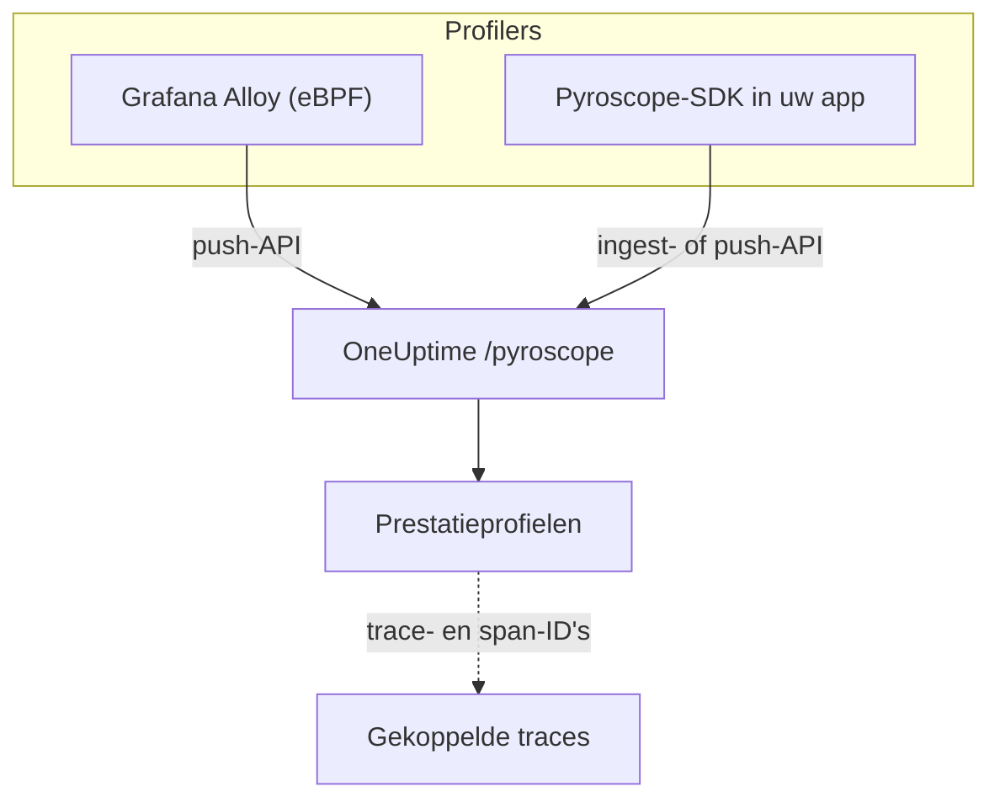

# Continue profilering

Continue profilering laat zien waaraan uw applicatie CPU-tijd en geheugen besteedt, functie voor functie. OneUptime biedt een **met Pyroscope compatibele ingest-API**, dus alles wat naar een Pyroscope-server kan sturen (de eBPF-profiler van Grafana Alloy of een Pyroscope-SDK voor uw taal) kan naar OneUptime sturen, en u leest het resultaat als flame graphs naast uw logboeken, metrieken en traces.

:::cards
- [Profielen versturen](#profielen-versturen): Grafana Alloy met eBPF, of een Pyroscope-SDK in uw app.
- [Ingest-endpoint](#ingest-endpoint): De basis-URL en de drie manieren om de sleutel mee te geven.
- [Controleren of het werkt](#controleren-of-het-werkt): De sleutel, de pagina en de uploadstatus nakijken.
- [Profielen verkennen](#profielen-verkennen-in-oneuptime): Flame graphs, topfuncties, vergelijkingen en tracelinks.
:::

## Hoe het werkt

Een profiler neemt steekproeven van uw processen en uploadt om de paar seconden een profiel naar het endpoint `/pyroscope` van OneUptime, met uw ingestiesleutel. OneUptime slaat elk profiel op onder de service die het noemt en tekent het als flame graph onder **Prestatieprofielen**.



## Voordat u begint

U hebt een telemetrie-ingestiesleutel van het type **Server** nodig. Hebt u er nog geen:

:::steps
### De ingestiesleutels openen

Ga naar **Producten → Projectinstellingen**, open **Telemetrie & APM** in het zijmenu en kies **Ingestiesleutels**.


### Een sleutel aanmaken

Klik op **Inname-sleutel aanmaken**. In het dialoogvenster is de naam van de sleutel al ingevuld en **Server** gekozen (het soort sleutel waarmee een applicatie of een collector verstuurt), dus klik op **Inname-sleutel aanmaken** om hem aan te maken, of geef hem eerst een andere naam.

### Het geheim kopiëren

De nieuwe sleutel opent op zijn eigen pagina. Kopieer de **Geheime sleutel**: dat is het ingestietoken dat de voorbeelden hieronder `YOUR_ONEUPTIME_INGESTION_TOKEN` noemen.


:::

## Ingest-endpoint

| Instelling | Waarde |
| --- | --- |
| Basis-URL (adres van de Pyroscope-server) | `https://oneuptime.com/pyroscope` |
| Authenticatieheader | `x-oneuptime-token: YOUR_ONEUPTIME_INGESTION_TOKEN` |

Clients voegen hun eigen pad aan de basis-URL toe (`/ingest` bij de meeste Pyroscope-SDK's, `/push.v1.PusherService/Push` bij Grafana Alloy en de .NET-SDK vanaf v0.14), dus u configureert altijd alleen de basis-URL, zonder slash aan het eind.

OneUptime leest het ingestietoken uit elk van deze bronnen; gebruik wat uw client ondersteunt:

| Methode | Wanneer gebruiken |
| --- | --- |
| Header `x-oneuptime-token` | Clients waarmee u eigen headers kunt toevoegen. |
| `Authorization: Bearer <token>` | SDK's met een optie `authToken` / `auth_token`: dat is wat ze versturen. |
| HTTP Basic-authenticatie, met het token als **wachtwoord** (willekeurige gebruikersnaam) | Clients die alleen een gebruiker en wachtwoord voor Basic-authenticatie bieden. |

> [!NOTE]
> Host u OneUptime zelf? Vervang `https://oneuptime.com` door uw eigen host, bijvoorbeeld `https://YOUR-ONEUPTIME-HOST/pyroscope`.

## Ondersteunde profielformaten

| Formaat | Verstuurd door | Ondersteund |
| --- | --- | --- |
| pprof (binaire protobuf, optioneel met gzip) | Pyroscope-SDK's voor Go, Node.js en .NET; Grafana Alloy | Ja |
| Folded / collapsed tekst | Pyroscope-SDK's voor Python, Ruby en Rust (hun standaard uploadformaat) | Ja |
| JFR (Java Flight Recorder) | Pyroscope Java-agent | Nog niet: gebruik Grafana Alloy voor Java-services |

## Profielen versturen

Grafana Alloy profileert elk proces op een host zonder codewijzigingen en is de aanbevolen manier om te beginnen. Een Pyroscope-SDK draait daarentegen in uw applicatie.

:::tabs
@tab Grafana Alloy
[Grafana Alloy](https://grafana.com/docs/alloy/latest/) verzamelt met eBPF CPU-profielen van elk proces op een Linux-host: geen agent in uw applicatie en geen codewijzigingen. Het werkt voor Go, Rust, C/C++, Java, Python, Ruby, PHP, Node.js en .NET.

Maak de Alloy-configuratie:

```hcl title="alloy-config.alloy"
discovery.process "all" {
  refresh_interval = "60s"
}

discovery.relabel "alloy_profiles" {
  targets = discovery.process.all.targets

  rule {
    action       = "replace"
    source_labels = ["__meta_process_exe"]
    target_label  = "service_name"
  }
}

pyroscope.ebpf "default" {
  targets    = discovery.relabel.alloy_profiles.output
  forward_to = [pyroscope.write.oneuptime.receiver]

  collect_interval = "15s"
  sample_rate      = 97
}

pyroscope.write "oneuptime" {
  endpoint {
    url = "https://oneuptime.com/pyroscope"
    headers = {
      "x-oneuptime-token" = "YOUR_ONEUPTIME_INGESTION_TOKEN",
    }
  }
}
```

Draai het met Docker. eBPF heeft een geprivilegieerde container met de PID-naamruimte van de host nodig:

```yaml title="docker-compose.yml"
services:
  alloy:
    image: grafana/alloy:latest
    privileged: true
    pid: host
    volumes:
      - ./alloy-config.alloy:/etc/alloy/config.alloy
      - /proc:/proc:ro
      - /sys:/sys:ro
    command:
      - run
      - /etc/alloy/config.alloy
```

Of draai het rechtstreeks op de host:

```bash
alloy run alloy-config.alloy
```

De relabel-regel geeft de service van elk profiel de naam van het uitvoerbare bestand van het proces.
@tab Go
De Go-SDK uploadt pprof. Laat het serveradres naar de basis-URL van OneUptime wijzen en geef uw ingestietoken mee als auth-token:

```go
import "github.com/grafana/pyroscope-go"

pyroscope.Start(pyroscope.Config{
    ApplicationName: "my-service",
    ServerAddress:   "https://oneuptime.com/pyroscope",
    AuthToken:       "YOUR_ONEUPTIME_INGESTION_TOKEN",
    ProfileTypes: []pyroscope.ProfileType{
        pyroscope.ProfileCPU,
        pyroscope.ProfileAllocObjects,
        pyroscope.ProfileAllocSpace,
        pyroscope.ProfileInuseObjects,
        pyroscope.ProfileInuseSpace,
        pyroscope.ProfileGoroutines,
    },
})
```
@tab Node.js
De Node.js-SDK uploadt pprof:

```javascript
const Pyroscope = require("@pyroscope/nodejs");

Pyroscope.init({
  serverAddress: "https://oneuptime.com/pyroscope",
  appName: "my-service",
  authToken: "YOUR_ONEUPTIME_INGESTION_TOKEN",
});

Pyroscope.start();
```
@tab Python
De Python-SDK uploadt folded tekst:

```python
import pyroscope

pyroscope.configure(
    application_name="my-service",
    server_address="https://oneuptime.com/pyroscope",
    auth_token="YOUR_ONEUPTIME_INGESTION_TOKEN",
)
```
@tab .NET
De Pyroscope .NET-profiler is een native CLR-profiler: hij heeft geen codewijzigingen nodig en wordt volledig via omgevingsvariabelen ingeschakeld. Download de release voor uw image van [pyroscope-dotnet releases](https://github.com/grafana/pyroscope-dotnet/releases) (`glibc` of `musl` voor Alpine, `x86_64` of `aarch64`) en laad hem in de runtime:

```dockerfile title="Dockerfile"
FROM alpine:3.20 AS pyroscope-profiler
ARG PYROSCOPE_DOTNET_VERSION=1.5.1
ADD https://github.com/grafana/pyroscope-dotnet/releases/download/pyroscope-${PYROSCOPE_DOTNET_VERSION}/pyroscope.${PYROSCOPE_DOTNET_VERSION}-glibc-x86_64.tar.gz /tmp/pyroscope.tar.gz
RUN mkdir -p /pyroscope && tar -xzf /tmp/pyroscope.tar.gz -C /pyroscope

FROM mcr.microsoft.com/dotnet/aspnet:10.0
# ... your application ...
COPY --from=pyroscope-profiler /pyroscope /pyroscope
ENV CORECLR_ENABLE_PROFILING=1
ENV CORECLR_PROFILER={BD1A650D-AC5D-4896-B64F-D6FA25D6B26A}
ENV CORECLR_PROFILER_PATH=/pyroscope/Pyroscope.Profiler.Native.so
ENV LD_PRELOAD=/pyroscope/Pyroscope.Linux.ApiWrapper.x64.so
ENV LD_LIBRARY_PATH=/pyroscope
```

Laat hem daarna naar OneUptime wijzen, bijvoorbeeld in uw Kubernetes- / Helm-omgeving:

```bash
PYROSCOPE_APPLICATION_NAME=my-service
PYROSCOPE_PROFILING_ENABLED=1
PYROSCOPE_SERVER_ADDRESS=https://oneuptime.com/pyroscope
PYROSCOPE_BASIC_AUTH_USER=oneuptime
PYROSCOPE_BASIC_AUTH_PASSWORD=YOUR_ONEUPTIME_INGESTION_TOKEN
```

Het ingestietoken hoort in het Basic-auth-wachtwoord. De gebruikersnaam mag elke niet-lege waarde zijn, maar de profiler stuurt helemaal geen inloggegevens als niet beide zijn ingesteld. Om het token in plaats daarvan als header te sturen, stelt u `PYROSCOPE_HTTP_HEADERS={"x-oneuptime-token":"YOUR_ONEUPTIME_INGESTION_TOKEN"}` in.

Hoe het token wordt meegegeven, hangt af van de profilerrelease. 1.5 en later negeren `PYROSCOPE_AUTH_TOKEN`; als u vanaf een oudere release bijwerkt en die instelling houdt, wordt elke upload dus geweigerd met `401`:

| pyroscope-dotnet-release | Uploadt naar | Tokeninstelling |
| --- | --- | --- |
| v0.13 en eerder | `/pyroscope/ingest` | `PYROSCOPE_AUTH_TOKEN` |
| v0.14 tot en met 1.4 | `/pyroscope/push.v1.PusherService/Push` | `PYROSCOPE_AUTH_TOKEN` |
| 1.5 en later | `/pyroscope/push.v1.PusherService/Push` | `PYROSCOPE_BASIC_AUTH_USER=oneuptime` en `PYROSCOPE_BASIC_AUTH_PASSWORD=<token>` (beide moeten zijn ingesteld), of `PYROSCOPE_HTTP_HEADERS={"x-oneuptime-token":"<token>"}` |

Releases vóór 1.0 hebben de tag `v<version>-pyroscope` in plaats van `pyroscope-<version>` (bijvoorbeeld `https://github.com/grafana/pyroscope-dotnet/releases/download/v0.13.0-pyroscope/pyroscope.0.13.0-glibc-x86_64.tar.gz`); de GUID van de profiler en de bestandsnamen zijn in elke release hetzelfde.

CPU-profilering staat standaard aan. Profilering van kloktijd, allocaties, exceptions en lock-conflicten is optioneel: zet `PYROSCOPE_PROFILING_WALLTIME_ENABLED`, `PYROSCOPE_PROFILING_ALLOCATION_ENABLED`, `PYROSCOPE_PROFILING_EXCEPTION_ENABLED` of `PYROSCOPE_PROFILING_LOCK_ENABLED` op `true`. Statische labels horen in `PYROSCOPE_LABELS` (`key:value,key:value`).

De profiler uploadt elke 15 seconden en comprimeert zijn uploads **niet**, dus een drukke service kan meerdere MB per upload sturen. De eigen ingress van OneUptime accepteert tot 16 MB op `/pyroscope`; staat er nog een proxy vóór OneUptime (bijvoorbeeld ingress-nginx, waarvan de standaard `proxy-body-size` 1 MB is), verhoog dan ook diens groottelimiet voor `/pyroscope`, anders worden grote uploads met `413` geweigerd voordat ze OneUptime bereiken.
@tab Java
De Pyroscope Java-agent uploadt profielen in het JFR-formaat, dat OneUptime nog niet opneemt. Profileer Java-services in plaats daarvan met Grafana Alloy (het tabblad **Grafana Alloy**): dat legt JVM-CPU-profielen vast zonder agent of codewijzigingen.
:::

**Ruby** en **Rust** werken zoals Go, Node.js en Python: installeer de [Pyroscope-SDK voor uw taal](https://grafana.com/docs/pyroscope/latest/configure-client/) en stel het serveradres in op `https://oneuptime.com/pyroscope` met uw ingestietoken als auth-token (of, als uw SDK-versie alleen Basic-auth biedt, als Basic-auth-wachtwoord).

## Ondersteunde profieltypen

Een pprof kan meerdere sampletypen declareren; elk geüpload profiel wordt onder één daarvan opgeslagen: CPU-tijd (`cpu` in nanoseconden) als het die heeft, anders kloktijd, anders bytes in gebruik en daarna toegewezen bytes, anders het eerste type dat het declareert. Elk type wordt opgeslagen en is te bekijken; de typen hieronder krijgen eigen groepering, eenheden en labels in OneUptime:

| Profieltype | Weergegeven als | Eenheid |
| --- | --- | --- |
| `cpu`, `samples` | CPU-tijd | nanoseconden |
| `wall` | Kloktijd | nanoseconden |
| `inuse_space`, `alloc_space`, `heap` | Geheugen (bytes) | bytes |
| `inuse_objects`, `alloc_objects` | Geheugen (aantal objecten) | aantal |
| `mutex`, `contention`, `block` | Lock-conflicten | nanoseconden |
| `goroutine` | Goroutines (Go) | aantal |

Al het andere (bijvoorbeeld een eigen sampletype) verschijnt onder "Overig" met zijn ruwe naam.

## Controleren of het werkt

:::steps
### Uw token controleren

De ingest-endpoints beantwoorden een ontbrekend of ongeldig token met `401`, maar de meeste profilers tonen dat nergens waar u het ziet (de .NET-profiler logt HTTP-antwoorden bijvoorbeeld alleen op debugniveau). Vraag het validatie-endpoint rechtstreeks:

```bash
curl -i -H "x-oneuptime-token: YOUR_ONEUPTIME_INGESTION_TOKEN" \
  https://oneuptime.com/otlp/v1/validate
```

Een geldig token geeft `200` met `{"valid": true, ...}`, en de `keyType` ervan moet `Server` zijn: een browsersleutel is ook geldig, maar kan geen profielen versturen. Een onbekend, ingetrokken, uitgeschakeld of verlopen token geeft `401`.

### De profielpagina openen

Ga in het OneUptime-dashboard naar **Producten → Prestatieprofielen**. Met het verzamelinterval van 15 seconden van Alloy (of het uploadinterval van 10 tot 15 seconden van de SDK's) verschijnen de eerste profielen en hun flame graphs binnen een of twee minuten na het starten van de agent.

### De service controleren

Profielen worden gekoppeld aan de telemetrieservice die `application_name` / `appName` / `PYROSCOPE_APPLICATION_NAME` van de SDK noemt (of de naam van het uitvoerbare bestand van het proces, met de relabel-regel van Alloy hierboven).

### Nog steeds niets? Bekijk de uploadstatus

Zet bij de .NET-profiler een minuut lang `DD_TRACE_DEBUG=1` op de applicatie: dan logt hij voor elke upload een regel `PyroscopePprofSink <status>`. `200` betekent dat OneUptime de upload heeft geaccepteerd; `401` is het token; `404` betekent meestal dat `PYROSCOPE_SERVER_ADDRESS` het achtervoegsel `/pyroscope` mist; `413` betekent dat een proxy vóór OneUptime de upload vanwege de grootte heeft geweigerd (zie het tabblad **.NET** onder [Profielen versturen](#profielen-versturen)). Host u OneUptime zelf, dan registreert het toegangslogboek van de ingress (nginx) dezelfde status voor elk verzoek aan `/pyroscope`.
:::

## Profielen verkennen in OneUptime

**Producten → Prestatieprofielen** opent een overzicht van waar de tijd in uw services heen gaat, en **Alle profielen** toont elke upload. Kies wat u wilt analyseren: **Alles**, **CPU-tijd**, **Geheugen** of **Locks**, of een specifiek type zoals **Kloktijd** of **Goroutines**.

De pagina van een profiel heeft drie weergaven:

| Weergave | Wat die toont |
| --- | --- |
| **Flame graph** | Elke balk is een functie in de aanroepstack, en de breedte is evenredig aan de verbruikte tijd of resources. Klik op een functie om in te zoomen en de aanroepers en aangeroepen functies te zien. |
| **Top functions** | De functies in het profiel, gerangschikt op eigen of totale tijd. **Only my code** verbergt bibliotheekframes. |
| **Diff vs. baseline** | Het profiel vergeleken met een eerdere periode (**t.o.v. 1 uur geleden**, **t.o.v. gisteren** of **t.o.v. vorige week**), met de functies onder **Most regressed** en **Most improved**. |

**Download pprof** slaat het profiel op voor lokale tools zoals `go tool pprof`.

### Tracecorrelatie

Wanneer een profiel trace- en span-ID's draagt (bijvoorbeeld als samplelabels `trace_id` / `span_id`), gaat u rechtstreeks van een trage tracespan naar het bijbehorende CPU- of geheugenprofiel om precies te begrijpen welke code draaide, en **Open linked trace** gaat de andere kant op.

Het tabblad **Profiel** van een span bevat ook de samples die gekoppeld zijn aan de spans die eronder zijn genest, omdat profilers de CPU-tijd van een verzoek vaak aan een kindspan toekennen in plaats van aan de span van het verzoek zelf.

## Gegevensbewaring

Profielen worden bewaard zolang de telemetrie van uw project: **Projectinstellingen → Telemetrie & APM → Gegevensbewaring** stelt de **Standaardbewaring (dagen)** in, 15 dagen tenzij u die wijzigt. Gegevens worden automatisch verwijderd wanneer de bewaartermijn afloopt. Abonnementen met bewaaruitzonderingen kunnen profielen ook langer of korter bewaren dan andere telemetrie, of de bewaring per service instellen op de pagina **Instellingen** van de service.

## Volgende stappen

:::cards
- [Profielen-monitor](/docs/monitor/profiles-monitor): Waarschuwen op de profielen die uw services versturen, naar aantal en type.
- [OpenTelemetry](/docs/telemetry/open-telemetry): De traces versturen waaraan uw profielen zijn gekoppeld.
- [Kubernetes-agent](/docs/telemetry/kubernetes-agent): Een heel cluster profileren met de eBPF-profiler van de agent.
:::
