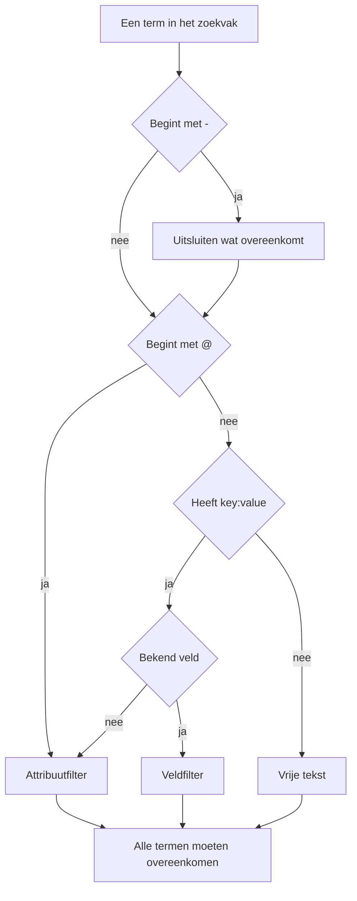

# Zoeksyntaxis

Het zoekvak boven de verkenners voor logboeken, traces, metrieken en uitzonderingen spreekt één querytaal. Een query is een lijst filters gescheiden door spaties, en **elk filter moet overeenkomen**: tussen filters bestaat geen impliciete OR. Gebruik deze pagina als naslag tijdens het zoeken.

:::cards
- [De twee soorten filters](#de-twee-soorten-filters): Ingebouwde velden, attributen en vrije tekst.
- [Waarden laten overeenkomen](#waarden-laten-overeenkomen): Jokertekens, "bevat", vergelijkingen en lijsten.
- [Uitsluiten](#uitsluiten): Elk filter omkeren met een `-` vooraan.
- [Velden per signaal](#velden-per-signaal): Waarop u in elke verkenner kunt filteren.
:::

## Hoe een query wordt gelezen

```text
severity:error @platform.team:a* -@http.method:GET timeout
```

Dat leest als: logboeken van het niveau error waarvan het attribuut `platform.team` met `a` begint, waarvan het attribuut `http.method` niet `GET` is en waarvan het bericht `timeout` noemt.

| Term | Soort | Komt overeen met |
| --- | --- | --- |
| `severity:error` | Veld | De ernst van het logboek is Error. |
| `@platform.team:a*` | Attribuut | Het attribuut `platform.team` begint met `a`. |
| `-@http.method:GET` | Uitgesloten attribuut | Het attribuut `http.method` is alles behalve `GET`. |
| `timeout` | Vrije tekst | Het bericht bevat `timeout`. |

Elke door spaties gescheiden term wordt apart gelezen, daarna worden ze allemaal met AND gecombineerd:



## De twee soorten filters

| Vorm | Filtert | Voorbeeld |
| --- | --- | --- |
| `field:value` | Een ingebouwd veld van het signaal | `severity:error` |
| `@attribute:value` | Een OpenTelemetry-attribuut van de rij | `@http.status_code:500` |
| losse woorden | Het bericht (logboeken), de spannaam (traces), de metrieknaam (metrieken) of het uitzonderingsbericht (uitzonderingen) | `connection refused` |

Een losse `key:value` waarvan de sleutel geen bekend veld is, wordt als attribuut behandeld; `k8s.pod:api-0` en `@k8s.pod:api-0` betekenen dus hetzelfde. Het voorvoegsel `@` betekent altijd "zoek in de attributen", met één uitzondering: in de uitzonderingenverkenner filteren `@type:`, `@service:`, `@env:` en `@class:` nog steeds die velden.

Tekst die toevallig een dubbele punt bevat, blijft tekst: `https://example.com` en `12:30` worden als woorden gezocht, niet als filters gelezen.

## Waarden laten overeenkomen

Alles in deze tabel werkt op elk attribuut en op de meeste ingebouwde velden; [Velden per signaal](#velden-per-signaal) noemt de velden die een waarde eenvoudiger lezen.

| U typt | Komt overeen met |
| --- | --- |
| `@k:abc` | precies `abc` |
| `@k:a*` | alles wat met `a` begint: `abc`, `alpha` |
| `@k:*c` | alles wat op `c` eindigt |
| `@k:a*c` | begint met `a` en eindigt op `c` |
| `@k:a?c` | `?` is precies één teken: `abc`, `axc`, maar niet `ac` |
| `@k:*` | het attribuut is aanwezig en niet leeg |
| `@k:~abc` | bevat `abc` ergens |
| `@k:!abc` | alles behalve `abc` |
| `@k:>100` | groter dan 100. Ook `>=`, `<`, `<=` |
| `@k:(a OR b)` | een van beide waarden. `@k:[a, b]` is hetzelfde |
| `@k:(a* OR b*)` | een van beide patronen |

Overeenkomsten met jokertekens en met "bevat" negeren hoofdletters; een exacte overeenkomst niet, omdat die vergelijkt met de waarde precies zoals ze is opgeslagen.

### Waarden met spaties

Zet de waarde tussen dubbele aanhalingstekens:

```text
name:"SELECT wp_options"
@k8s.container.name:"my container"
```

Aanhalingstekens beschermen **spaties**, geen jokertekens: `@k:"a b*"` komt nog steeds overeen met alles wat met `a b` begint.

### `*`, `?` en andere leestekens letterlijk

Een backslash maakt het volgende teken letterlijk:

| U typt | Komt overeen met |
| --- | --- |
| `@k:a\*b` | precies `a*b` |
| `@k:\~abc` | precies `~abc` |
| `@k:\>5` | precies `>5` |

Waarden met `%` of `_` hoeven niet te worden geëscaped: die tekens zijn altijd letterlijk.

## Uitsluiten

Een `-` vooraan keert elk filter om, ook de filters hierboven:

| U typt | Komt overeen met |
| --- | --- |
| `-severity:debug` | alles behalve debug |
| `-@platform.team:a*` | alles waarvan `platform.team` **niet** met `a` begint, ook rijen zonder `platform.team` |
| `-@k:*` | het attribuut ontbreekt of is leeg |
| `-@k:(a OR b)` | geen van beide waarden |
| `-@k:>100` | 100 of minder |
| `-@k:~abc` | bevat `abc` niet |

In de traceverkenner sluit `-` alleen attributen uit. `-status:error` wordt gelezen als tekst die in spannamen wordt gezocht, en vindt niets; vraag in plaats daarvan om de waarden die u wilt, zoals `status:(ok OR unset)`.

## Velden per signaal

Veldnamen zijn niet hoofdlettergevoelig: `statusMessage:` en `statusmessage:` zijn hetzelfde veld.

### Logboeken

| Veld | Aliassen | Opmerkingen |
| --- | --- | --- |
| `severity` | `level` | `fatal`, `error`, `warning` (of `warn`), `info` (of `information`), `debug`, `trace`, `unspecified`, in willekeurige hoofdletters |
| `service` | | Servicenaam, volledig uitgeschreven, in willekeurige hoofdletters |
| `trace` | | Trace-ID |
| `span` | | Span-ID |
| `message` | `msg`, `log`, `body` | De logregel. Losse woorden doorzoeken die ook |

### Traces

Tracevelden nemen een gewone waarde of een lijst zoals `status:(ok OR unset)`, en `duration` neemt ook `>` en `<`. Jokertekens, `~`, `!` en een `-` vooraan werken hier alleen op attributen.

| Veld | Opmerkingen |
| --- | --- |
| `service` | Servicenaam |
| `name` | Spannaam. Eén waarde komt overeen met elk deel ervan. Losse woorden doorzoeken die ook |
| `status` | `ok`, `error`, `unset` (unset = Geen foutstatus ingesteld, de OpenTelemetry-standaard) |
| `kind` | `server`, `client`, `producer`, `consumer`, `internal` |
| `duration` | Milliseconden: `duration:>500`, `duration:<200` of een exacte waarde |
| `statusMessage` | Tekst van het statusbericht. Eén waarde komt overeen met elk deel ervan |
| `hasException` | `true` of `false` |
| `trace`, `span` | ID's |

### Metrieken

| Veld | Opmerkingen |
| --- | --- |
| `name` | Metrieknaam. Een gewone waarde komt overeen met elk deel ervan, dus `name:http.server` vindt `http.server.request.duration`. Losse woorden doorzoeken die ook |
| `service` | Servicenaam. Een gewone waarde komt overeen met elk deel ervan |

### Uitzonderingen

| Veld | Aliassen | Opmerkingen |
| --- | --- | --- |
| `type` | `exceptionType` | Uitzonderingstype, bijvoorbeeld `type:TypeError` |
| `env` | `environment` | Omgeving, uit het resource-attribuut `deployment.environment` |
| `service` | | Servicenaam. Een gewone waarde komt overeen met elk deel ervan |
| `class` | `errorClass` | Wiens fout het is: `code-fault`, `user-error`, `expected-denial`, `infrastructure` of `unknown` |

Losse woorden doorzoeken het uitzonderingsbericht.

De verkenner **Security Events** gebruikt dezelfde taal met eigen velden, zoals `severity`, `tactic` en `user`: zie [Security Events](/docs/telemetry/security-events).

## Filters combineren

Filters worden met AND gecombineerd. U mag `AND` ertussen schrijven en dat verandert niets:

```text
severity:error service:api          # both must hold
severity:error AND service:api      # identical
```

Er is geen OR en geen NOT **tussen** filters: `OR` en `NOT` die daar staan worden overgeslagen, dus `NOT severity:debug` betekent hetzelfde als `severity:debug`. Sluit uit met een `-` vooraan (`-severity:debug`), en gebruik voor een van twee waarden van dezelfde sleutel de lijstvorm:

```text
@http.method:(GET OR POST)
```

Twee filters op dezelfde sleutel worden met AND gecombineerd; zo schrijft u een bereik of een patroon met twee kanten:

```text
@http.status_code:>=500 @http.status_code:<=599
@k:a* @k:*z
```

## Chips en het zoekvak

Op Enter drukken bij een term `key:value` past die toe, meestal als chip boven de resultaten. Een chip draagt de waarde precies zoals die is getypt, dus een jokerteken blijft een jokerteken. Een term die een chip niet kan dragen, zoals een uitgesloten `-key:value`, blijft in het zoekvak en filtert van daaruit. Klikken op een waarde in de facettenzijbalk voegt dezelfde soort chip toe, met de waarde geëscaped: een opgeslagen waarde die toevallig `*` bevat, filtert op die letterlijke waarde, niet als patroon.

Chips horen bij de opgeslagen weergave en bij de URL van de pagina, dus een filter overleeft een vernieuwing, een bladwijzer en een gedeelde link.

## Goed om te weten

- Attribuut**sleutels** worden bij jokerteken-, "bevat"-, voorvoegsel- en achtervoegselfilters zonder onderscheid in hoofdletters vergeleken, dus u hoeft niet te onthouden of ze als `requestId` of als `requestid` is opgenomen.
- Een filter `-@k:...` komt ook overeen met rijen die het attribuut nooit hadden: een rij zonder `platform.team` begint vanzelfsprekend niet met `a`.
- Numerieke vergelijkingen werken op attribuutwaarden die als tekst zijn opgeslagen; een waarde die geen getal is, voldoet nooit aan een vergelijking.

## Volgende stappen

:::cards
- [Inzoomen op een tijdsbereik](/docs/telemetry/charts-and-time-ranges): De verkenners beperken tot het moment dat telt.
- [Logboekpipelines](/docs/telemetry/log-pipelines): Delen van een logregel omzetten in doorzoekbare attributen.
- [Logs-monitor](/docs/monitor/logs-monitor): Waarschuwen wanneer de logboeken waarnaar u zoekt verschijnen.
- [OpenTelemetry](/docs/telemetry/open-telemetry): Logboeken, metrieken en traces sturen om te doorzoeken.
:::
