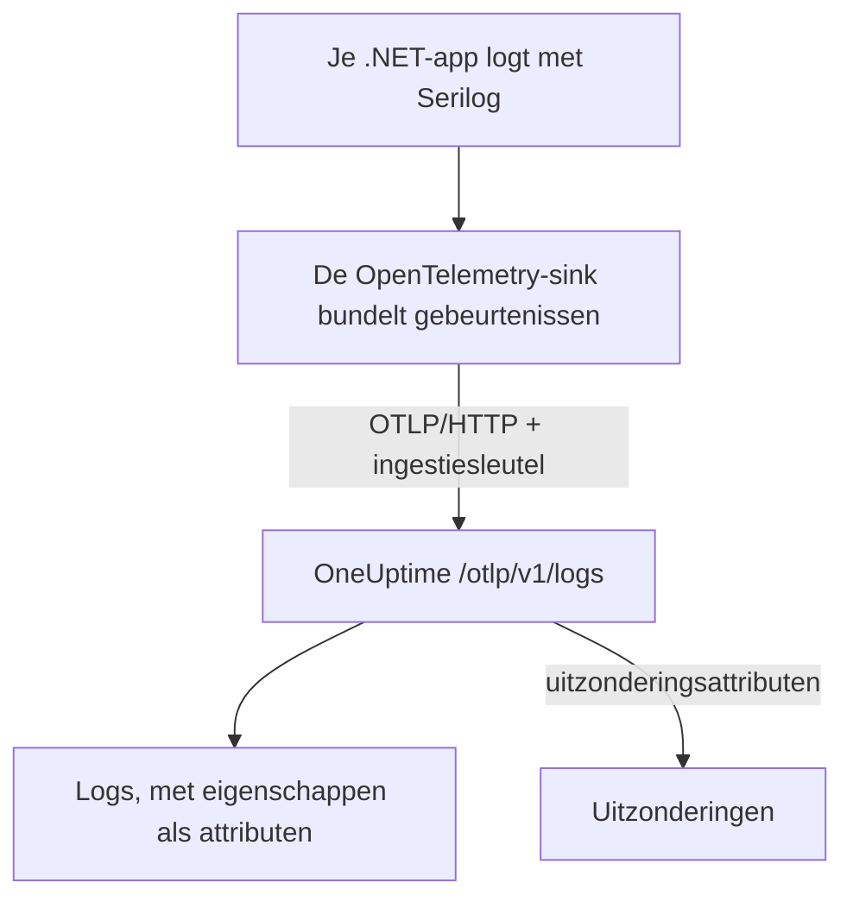

# Serilog (.NET)

[Serilog](https://serilog.net) is de populairste bibliotheek voor gestructureerd loggen in .NET. Met de officiële sink [`Serilog.Sinks.OpenTelemetry`](https://github.com/serilog/serilog-sinks-opentelemetry) gaat elke gebeurtenis die je applicatie via Serilog logt over het OpenTelemetry Protocol (OTLP) naar OneUptime, en wordt die doorzoekbaar in **Producten → Logboeken**, met de gestructureerde eigenschappen, het niveau en de koppeling met traces.

Je hoeft geen OneUptime-specifiek pakket te installeren: de sink praat met hetzelfde OTLP-endpoint dat OneUptime voor alle OpenTelemetry-gegevens aanbiedt. Dit werkt voor consoleapps, worker services, ASP.NET Core-apps en alles wat verder op .NET draait.

:::cards
- [De sink instellen](#de-sink-instellen): Twee pakketten installeren en configureren in code of in `appsettings.json`.
- [Uitzonderingen](#uitzonderingen): Gelogde uitzonderingen worden issues in Uitzonderingen.
- [Problemen oplossen](#problemen-oplossen): Wat je controleert als er geen logs binnenkomen.
:::

## Hoe het werkt



De sink bundelt loggebeurtenissen en stuurt ze op de achtergrond. Elke benoemde eigenschap wordt een attribuut van de log, en een uitzondering die je met Serilog logt komt binnen met de attributen waarvan OneUptime een issue maakt.

## Voordat je begint

- Een OneUptime-project. In OneUptime Cloud wordt telemetrie per opgenomen GB gefactureerd (zie de [prijzen](https://oneuptime.com/pricing)), en een project op het Free-abonnement heeft een betaalmethode nodig voordat het telemetrie kan sturen.
- Een .NET-applicatie die Serilog gebruikt, of kan gebruiken.
- Een telemetrie-ingestiesleutel om je logs mee te authenticeren. Heb je er nog geen:

:::steps
### De ingestiesleutels openen

Ga naar **Producten → Projectinstellingen**, open **Telemetrie & APM** in het zijmenu en kies **Ingestiesleutels**.


### Een sleutel maken

Klik op **Inname-sleutel aanmaken**. In het dialoogvenster is de naam van de sleutel al ingevuld en **Server** gekozen, het soort sleutel waarmee een applicatie of een collector stuurt. Klik dus op **Inname-sleutel aanmaken** om hem te maken, of geef hem eerst een andere naam.

### Het geheim kopiëren

De nieuwe sleutel opent op een eigen pagina. Kopieer de **Geheime sleutel**: dat is het `YOUR_TELEMETRY_INGESTION_TOKEN` in de voorbeelden hieronder.


:::

## Wat je van OneUptime nodig hebt

| Instelling | Waarde |
| ------------- | ------------------------------------------------------------ |
| OTLP-endpoint | `https://oneuptime.com/otlp` |
| Auth-header | `x-oneuptime-token: YOUR_TELEMETRY_INGESTION_TOKEN` |
| Servicenaam | De naam waaronder je service moet verschijnen, bijv. `my-service` |

> [!NOTE]
> Host je OneUptime zelf? Vervang `https://oneuptime.com/otlp` door `https://YOUR-ONEUPTIME-HOST/otlp` (of `http://...` als je TLS niet termineert). Al het andere blijft hetzelfde.

Met het protocol op `HttpProtobuf` plakt de sink het pad `/v1/logs` achter het endpoint, dus de uiteindelijke URL waarnaar hij stuurt is `https://oneuptime.com/otlp/v1/logs`. Je geeft alleen het basis-endpoint `/otlp` op.

## De sink instellen

:::steps
### De NuGet-pakketten installeren

Voeg Serilog en de OpenTelemetry-sink toe aan je project:

```bash
dotnet add package Serilog
dotnet add package Serilog.Sinks.OpenTelemetry
```

Configureer je de sink vanuit `appsettings.json`, voeg dan ook `Serilog.Settings.Configuration` toe. Voeg voor ASP.NET Core-apps `Serilog.AspNetCore` toe, dat Serilog aan de host en de request-pipeline koppelt:

```bash
dotnet add package Serilog.Settings.Configuration
dotnet add package Serilog.AspNetCore
```

### De sink configureren

Richt de sink op je OneUptime-OTLP-endpoint, zet het protocol op `HttpProtobuf`, geef je ingestietoken mee als header en label de logs met een `service.name`. Configureer hem in code, in `appsettings.json` of in de ASP.NET Core-host:

:::tabs
@tab In code
```csharp title="Program.cs"
using Serilog;
using Serilog.Sinks.OpenTelemetry;

Log.Logger = new LoggerConfiguration()
    .MinimumLevel.Information()
    .Enrich.FromLogContext()
    .WriteTo.Console() // optional: keep local logs too
    .WriteTo.OpenTelemetry(options =>
    {
        // Base OTLP endpoint. The sink appends /v1/logs automatically.
        options.Endpoint = "https://oneuptime.com/otlp";
        options.Protocol = OtlpProtocol.HttpProtobuf;

        // Authenticate with your OneUptime telemetry ingestion token.
        options.Headers = new Dictionary<string, string>
        {
            ["x-oneuptime-token"] = "YOUR_TELEMETRY_INGESTION_TOKEN"
        };

        // Identify your service in OneUptime.
        options.ResourceAttributes = new Dictionary<string, object>
        {
            ["service.name"] = "my-service",
            ["deployment.environment"] = "production"
        };
    })
    .CreateLogger();

try
{
    Log.Information("Application starting up");
    // ... your application code ...
}
finally
{
    // Flush any buffered logs before the process exits.
    Log.CloseAndFlush();
}
```
@tab appsettings.json
Zet de instellingen van de sink in `appsettings.json`:

```json title="appsettings.json"
{
  "Serilog": {
    "Using": ["Serilog.Sinks.OpenTelemetry"],
    "MinimumLevel": "Information",
    "WriteTo": [
      {
        "Name": "OpenTelemetry",
        "Args": {
          "endpoint": "https://oneuptime.com/otlp",
          "protocol": "HttpProtobuf",
          "headers": {
            "x-oneuptime-token": "YOUR_TELEMETRY_INGESTION_TOKEN"
          },
          "resourceAttributes": {
            "service.name": "my-service",
            "deployment.environment": "production"
          }
        }
      }
    ]
  }
}
```

Bouw de logger daarna op uit de configuratie:

```csharp title="Program.cs"
using Serilog;
using Microsoft.Extensions.Configuration;

IConfiguration configuration = new ConfigurationBuilder()
    .AddJsonFile("appsettings.json")
    .Build();

Log.Logger = new LoggerConfiguration()
    .ReadFrom.Configuration(configuration)
    .CreateLogger();
```
@tab ASP.NET Core
Gebruik voor ASP.NET Core (minimal hosting, .NET 6 en hoger) `Serilog.AspNetCore`, zodat Serilog de standaardlogger vervangt en ook framework- en requestlogs vastlegt:

```csharp title="Program.cs"
using Serilog;
using Serilog.Sinks.OpenTelemetry;

var builder = WebApplication.CreateBuilder(args);

builder.Host.UseSerilog((context, services, configuration) =>
{
    configuration
        .ReadFrom.Configuration(context.Configuration)
        .Enrich.FromLogContext()
        .WriteTo.OpenTelemetry(options =>
        {
            options.Endpoint = "https://oneuptime.com/otlp";
            options.Protocol = OtlpProtocol.HttpProtobuf;
            options.Headers = new Dictionary<string, string>
            {
                ["x-oneuptime-token"] = "YOUR_TELEMETRY_INGESTION_TOKEN"
            };
            options.ResourceAttributes = new Dictionary<string, object>
            {
                ["service.name"] = "my-service"
            };
        });
});

var app = builder.Build();

// Logs one summary event per HTTP request.
app.UseSerilogRequestLogging();

app.MapGet("/", () => "Hello World");
app.Run();
```
:::

> [!IMPORTANT]
> De sink bundelt loggebeurtenissen en stuurt ze asynchroon. Roep altijd `Log.CloseAndFlush()` aan (of geef de logger vrij) voordat je applicatie stopt, anders kan de laatste batch logs verloren gaan. In ASP.NET Core regelt `Serilog.AspNetCore` dit voor je bij een nette afsluiting.

> [!TIP]
> Houd het token buiten versiebeheer. Lees het uit een omgevingsvariabele of een secrets-store en geef het bij het opstarten aan de configuratie, in plaats van het in `appsettings.json` te committen.

### Logs schrijven

Gebruik Serilog zoals je gewend bent. Gestructureerde eigenschappen blijven behouden en worden doorzoekbare attributen in OneUptime:

```csharp
Log.Information("Order {OrderId} placed by {CustomerId} for {Amount:C}",
    orderId, customerId, amount);

Log.Warning("Payment gateway slow: {LatencyMs}ms", latencyMs);
```

Elke benoemde eigenschap (`OrderId`, `CustomerId`, `Amount`, `LatencyMs`) wordt als attribuut van de log gestuurd, zodat je erop kunt filteren en zoeken in de explorer **Producten → Logboeken**.

### Controleren of logs binnenkomen

Start je applicatie en schrijf een paar loggebeurtenissen. Binnen enkele seconden verschijnen ze onder **Producten → Logboeken**, en op de pagina van je service onder **Producten → Services**; de service heet naar de `service.name` die je hebt ingesteld (`my-service`). Hun gestructureerde eigenschappen zijn als filters beschikbaar.
:::

## Uitzonderingen

Als je met Serilog een uitzondering logt, hangt de sink de OpenTelemetry-attributen `exception.type`, `exception.message` en `exception.stacktrace` aan de logregel:

```csharp
try
{
    ProcessPayment();
}
catch (Exception ex)
{
    Log.Error(ex, "Failed to process payment for order {OrderId}", orderId);
}
```

OneUptime herkent deze attributen en groepeert de fout tot een issue onder **Uitzonderingen**, op vingerafdruk en toegewezen aan de juiste service. Een fout die zowel een trace als een log meldt, wordt samengevoegd tot één issue. Zie [Uitzonderingen uit logs](/docs/telemetry/open-telemetry#uitzonderingen-uit-logs) voor hoe de herkenning werkt.

## Koppeling met traces

Is je applicatie ook geïnstrumenteerd met de OpenTelemetry .NET SDK voor traces, dan krijgen Serilog-gebeurtenissen die binnen een actieve span ontstaan automatisch de huidige `TraceId` en `SpanId` mee (dat hoort bij de standaard `IncludedData` van de sink). Zo koppelt OneUptime een logregel direct aan de trace waarin hij ontstond, en spring je van een log naar het omliggende request en terug.

Wil je ook traces en metrics sturen, zie dan de .NET-instelling in de [OpenTelemetry-snelstart](/docs/telemetry/open-telemetry#snelstart).

## Problemen oplossen

:::details Er verschijnen geen logs
Controleer de waarde van `x-oneuptime-token` en of die bij het project hoort dat je bekijkt. Controleer of het endpoint `https://oneuptime.com/otlp` is (alleen het basispad; plak er zelf geen `/v1/logs` achter). Om te zien waarom de sink faalt, zet je bij het opstarten de eigen foutuitvoer van Serilog aan met `Serilog.Debugging.SelfLog.Enable(Console.Error)`: die toont de statuscode waarmee OneUptime antwoordt.
:::

:::details Logs verschijnen pas als de app stopt, of de laatste logs ontbreken
Zorg dat `Log.CloseAndFlush()` bij het afsluiten draait. De sink bundelt gebeurtenissen, dus gebufferde logs gaan verloren als het proces zonder flush wordt beëindigd.
:::

:::details 401 Unauthorized, en er wordt niets opgenomen
De sleutel ontbreekt, is onbekend of verlopen. Controleer of de headernaam precies `x-oneuptime-token` is en de waarde de **Geheime sleutel** van de sleutel.
:::

:::details 402 of 422, en er wordt niets opgenomen
`402`: in OneUptime Cloud zit het project op het Free-abonnement en heeft het geen betaalmethode. Voeg er een toe onder **Projectinstellingen → Facturering en facturen → Facturering**. `422`: de sleutel is uitgeschakeld, of het is een browsersleutel. Zet **Ingeschakeld** weer aan in de instellingen van de sleutel, of maak een **Server**-sleutel.
:::

:::details Logs komen binnen onder de verkeerde servicenaam
Stel `service.name` in `ResourceAttributes` (code) of `resourceAttributes` (appsettings.json) in. Zonder die waarde worden je logs opgeslagen onder de tijdelijke naam die de sink in plaats daarvan stuurt, en niet onder de naam van je service.
:::

:::details Verbindingsfouten naar een zelf gehoste instantie
Zorg dat het protocol past bij het schema van je endpoint (`https://` of `http://`) en dat je OneUptime-host vanaf de applicatie bereikbaar is.
:::

Heb je vragen of hulp nodig, mail ons dan op support@oneuptime.com.

## Volgende stappen

:::cards
- [OpenTelemetry](/docs/telemetry/open-telemetry): Ook traces en metrics vanuit .NET sturen.
- [Logboekpipelines](/docs/telemetry/log-pipelines): Logs bij binnenkomst parsen en verrijken.
- [Logs-monitor](/docs/monitor/logs-monitor): Waarschuwen wanneer overeenkomende logs verschijnen.
- [Zoeksyntaxis](/docs/telemetry/search-syntax): Filteren op je Serilog-eigenschappen.
:::
