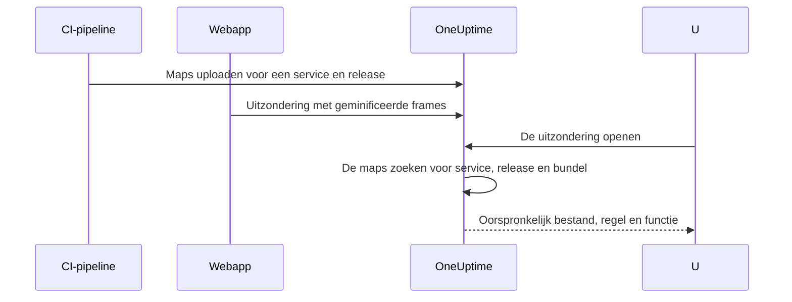

# Source maps

Upload de source maps van uw front-endbuild naar OneUptime, en browseruitzonderingen onder **Uitzonderingen** tonen uw oorspronkelijke bestandsnamen, regels en functies in plaats van de geminificeerde. Deze pagina is voor front-endontwikkelaars die al browsertelemetrie naar OneUptime sturen.

:::cards
- [Hoe het koppelen werkt](#hoe-het-koppelen-werkt): Servicenaam, release en bundelbestand.
- [Source maps uploaden](#source-maps-uploaden): Eén `curl`-verzoek vanuit CI.
- [Limieten](#limieten): Groottes, aantallen en de instellingen voor zelf hosten.
- [Opgeloste stacktraces bekijken](#opgeloste-stacktraces-bekijken): Hoe een opgelost frame eruitziet.
:::

## Overzicht

Productiebundels van de front-end zijn geminificeerd, dus een browseruitzondering die via de OpenTelemetry-web-SDK is vastgelegd, komt binnen met stackframes zoals:

```text
TypeError: Cannot read properties of undefined (reading 'id')
    at e.onSelect (https://app.example.com/assets/main.a8f1b2.js:1:48291)
```

Upload de source maps van uw build naar OneUptime en het uitzonderingendashboard zet die frames terug naar het oorspronkelijke bestand, de regel en de functienaam, en, als de map met `sourcesContent` is gebouwd, naar de omliggende regels van uw oorspronkelijke broncode.

Maps worden via een geauthenticeerde API naar OneUptime geüpload en **nooit van uw site opgehaald**, dus u kunt (en moet) blijven bouwen met `hidden-source-map` (webpack) of `sourcemap: 'hidden'` (Vite / Rollup) en de `.map`-bestanden nooit naast uw bundels publiceren.



## Hoe het koppelen werkt

Een source map wordt opgeslagen onder drie sleutels:

| Sleutel | Moet overeenkomen met |
|---|---|
| Servicenaam | Het OpenTelemetry-resource-attribuut `service.name` waarmee uw webapp telemetrie verstuurt |
| Serviceversie | Het resource-attribuut `service.version` (uw release-ID) |
| Bundelpad | Het geminificeerde bestand waarvoor de map is gemaakt, bijvoorbeeld `main.a8f1b2.js` |

Wanneer u een uitzondering opent, zoekt OneUptime de maps die voor de service en release van die uitzondering zijn geüpload, koppelt elk stackframe op bestandsnaam aan een bundel (padachtervoegsels zijn prima: `main.a8f1b2.js` komt overeen met `https://app.example.com/assets/main.a8f1b2.js`) en lost de geminificeerde regel en kolom via de map op. Het oplossen gebeurt pas wanneer de uitzondering wordt bekeken, nooit tijdens de opname, dus een map die een paar minuten *na* de eerste fout van een nieuwe release wordt geüpload, geldt alsnog met terugwerkende kracht.

## Voordat u begint

- Een telemetrie-ingestiesleutel van het type **Server**, uit **Projectinstellingen → Telemetrie & APM → Ingestiesleutels**. Zie [Een ingestiesleutel maken](/docs/telemetry/open-telemetry#een-ingestiesleutel-maken).
- Een webapp die al uitzonderingen naar OneUptime stuurt met de OpenTelemetry-web-SDK: zie [Browserconfiguratie](/docs/rum/browser-setup).
- Een build die source maps schrijft, met `sourcesContent` (bij de meeste bundlers de standaard) als u codefragmenten rond elk frame wilt.

## Source maps uploaden

:::steps
### `service.version` met uw telemetrie meesturen

Uw webapp moet `service.version` sturen, en dat moet dezelfde tekenreeks zijn waarmee u de maps uploadt:

```javascript
import { resourceFromAttributes } from "@opentelemetry/resources";

const resource = resourceFromAttributes({
  "service.name": "my-web-app",
  "service.version": "1.4.2", // same value you upload maps with
});
```

Elke stabiele release-ID werkt (een semantische versie, een git-commit-SHA, een buildnummer), zolang de geüploade `serviceVersion` en het resource-attribuut `service.version` dezelfde tekenreeks zijn.

### De maps na elke productiebuild uploaden

Upload vanuit CI, met uw ingestiesleutel in de header `x-oneuptime-token`:

```bash
curl --fail -X POST "https://oneuptime.com/source-maps/v1/upload" \
  -H "x-oneuptime-token: YOUR_TELEMETRY_INGESTION_KEY" \
  -F "serviceName=my-web-app" \
  -F "serviceVersion=1.4.2" \
  -F "sourcemap=@dist/assets/main.a8f1b2.js.map" \
  -F "sourcemap=@dist/assets/vendor.9c3d4e.js.map"
```

Vervang bij zelf gehoste installaties `oneuptime.com` door uw OneUptime-host. `Authorization: Bearer YOUR_KEY` wordt geaccepteerd als alternatief voor de header `x-oneuptime-token`.

### De upload controleren

Een geslaagde upload geeft een JSON-body met de opgeslagen maps terug, zodat CI erop kan controleren. De maps staan ook op de pagina **Source Maps** van de service in OneUptime.
:::

Een gangbare CI-stap uploadt elke map die de build heeft gemaakt:

```bash
VERSION="$(git rev-parse --short HEAD)"

find dist -name "*.js.map" -print0 | while IFS= read -r -d '' map; do
  curl --fail -X POST "https://oneuptime.com/source-maps/v1/upload" \
    -H "x-oneuptime-token: $ONEUPTIME_INGESTION_KEY" \
    -F "serviceName=my-web-app" \
    -F "serviceVersion=$VERSION" \
    -F "sourcemap=@$map"
done
```

### Uploadregels

- Het bundelpad van elk geüpload bestand is de bestandsnaam zonder de afsluitende `.map`: `main.a8f1b2.js.map` wordt `main.a8f1b2.js`. Volgt de naam van uw mapbestand die conventie niet, upload dan één bestand per verzoek en geef een expliciet veld `bundlePath` mee.
- Dezelfde bundel opnieuw uploaden voor dezelfde service en versie vervangt de vorige map, dus nieuwe pogingen vanuit CI kunnen geen kwaad.
- Bestanden moeten JSON volgens [source map v3](https://tc39.es/ecma426/) zijn (wat elke moderne bundler maakt; geïndexeerde maps met `sections` worden ook ondersteund).
- Heeft de beheerder van uw zelf gehoste installatie de telemetrie-opname uitgeschakeld (`DISABLE_TELEMETRY_INGESTION`), dan geven uploads een leeg succesantwoord en wordt er niets opgeslagen, hetzelfde gedrag als elk telemetrie-ingest-endpoint in die modus. Een echte upload geeft altijd een JSON-body met de opgeslagen maps terug, zodat CI de twee kan onderscheiden.

## Limieten

Elk `.map`-bestand mag tot 50 MB groot zijn, maar de ingress beperkt ook de **volledige verzoekbody** tot 50 MB, dus upload grote maps één per verzoek. Per verzoek worden tot 50 bestanden geaccepteerd, en één release (service + versie) kan in totaal hoogstens 1000 maps bevatten; een upload die daarboven zou komen, wordt geweigerd met een bericht dat de limiet noemt. Een build die meer maps maakt dan één verzoek accepteert, stuurt gewoon meerdere verzoeken: uploads voor dezelfde release tellen op.

Zelf gehoste installaties kunnen deze waarden wijzigen. Alle vijf zijn gewone omgevingsvariabelen, en de Helm-chart stelt ze beschikbaar onder `sourceMaps` in `values.yaml`:

| `values.yaml` | Omgevingsvariabele | Standaard |
| --- | --- | --- |
| `sourceMaps.maxMapsPerRelease` | `SOURCE_MAP_MAX_MAPS_PER_RELEASE` | `1000` |
| `sourceMaps.maxFilesPerRequest` | `SOURCE_MAP_MAX_FILES_PER_REQUEST` | `50` |
| `sourceMaps.maxFileSizeBytes` | `SOURCE_MAP_MAX_FILE_SIZE_BYTES` | `52428800` |
| `sourceMaps.maxBytesPerResolve` | `SOURCE_MAP_MAX_BYTES_PER_RESOLVE` | `536870912` |
| `sourceMaps.retentionDays` | `SOURCE_MAP_RETENTION_DAYS` | `90` |

`maxMapsPerRelease` is degene die u verhoogt als uw build boven de standaard uitkomt; het is alleen een limiet op de vorm van de opslag, omdat het oplossen wordt begrensd door `maxBytesPerResolve` en niet door het aantal maps van een release. `maxFilesPerRequest` en `maxFileSizeBytes` kunnen alleen worden **verlaagd**: de multipart-body wordt geparst voordat het verzoek is geauthenticeerd, dus de gedeelde plafonds daarboven gelden voor elke niet-geauthenticeerde aanroeper, en een grotere waarde wordt verkleind in plaats van toegepast.

## Opgeloste stacktraces bekijken

Open een willekeurige uitzondering onder **Uitzonderingen** in het dashboard. Frames die via een source map zijn opgelost, tonen een badge **Source mapped** en de oorspronkelijke functienaam en bestandslocatie; een opengeklapt frame toont het oorspronkelijke codefragment (als de map `sourcesContent` bevat) naast de geminificeerde locatie.

De geüploade maps van een service kunt u bekijken en verwijderen onder **Producten → Services → uw service → Source Maps**, met per map de release, de bundel, de grootte en het uploadtijdstip.

## Bewaartermijn

Source maps worden 90 dagen na het uploaden bewaard en daarna automatisch verwijderd. Een map is alleen nuttig zolang uitzonderingen van zijn release binnen uw bewaartermijn voor telemetrie vallen, dus deze termijn duurt ruim langer dan de uitzonderingen die hij leesbaar maakt. Upload de maps van een release opnieuw als u ze weer nodig hebt.

## Beveiliging

- Maps worden geüpload via een geauthenticeerd endpoint en opgeslagen in uw OneUptime-project: ze worden nooit van uw website opgehaald, dus verborgen source maps blijven verborgen.
- De ruwe inhoud van een map (inclusief uw oorspronkelijke broncode als hij met `sourcesContent` is gebouwd) kan alleen worden teruggelezen door projecteigenaren en beheerders, en door iedereen met de machtiging **Read Telemetry Source Map**. Andere teamleden zien alleen de opgeloste frames en de paar coderegels rond elke crashplek van uitzonderingen waartoe ze al toegang hebben.
- Een service verwijderen, verwijdert ook de source maps ervan.

## Problemen oplossen

:::details Frames zijn nog steeds geminificeerd
De release van de uitzondering heeft geen overeenkomende maps. Controleer of de `service.version` die uw app stuurt precies de `serviceVersion` is waarmee u hebt geüpload, of `serviceName` overeenkomt met `service.name`, en of er een map voor dat bundelbestand is geüpload: de pagina **Source Maps** van de service toont de release en bundel van elke map.
:::

:::details De upload wordt geweigerd omdat een map te groot is
Eén map mag tot 50 MB groot zijn, en het hele verzoek ook. Upload grote maps één per verzoek, zoals de CI-lus hierboven doet.
:::

## Volgende stappen

:::cards
- [Browserconfiguratie](/docs/rum/browser-setup): Browsertraces en -uitzonderingen versturen met de OpenTelemetry-web-SDK.
- [Uitzonderingen-monitor](/docs/monitor/exceptions-monitor): Waarschuwen wanneer nieuwe uitzonderingen verschijnen.
- [OpenTelemetry](/docs/telemetry/open-telemetry): Endpoints, sleutels en limieten voor alle telemetrie.
:::
