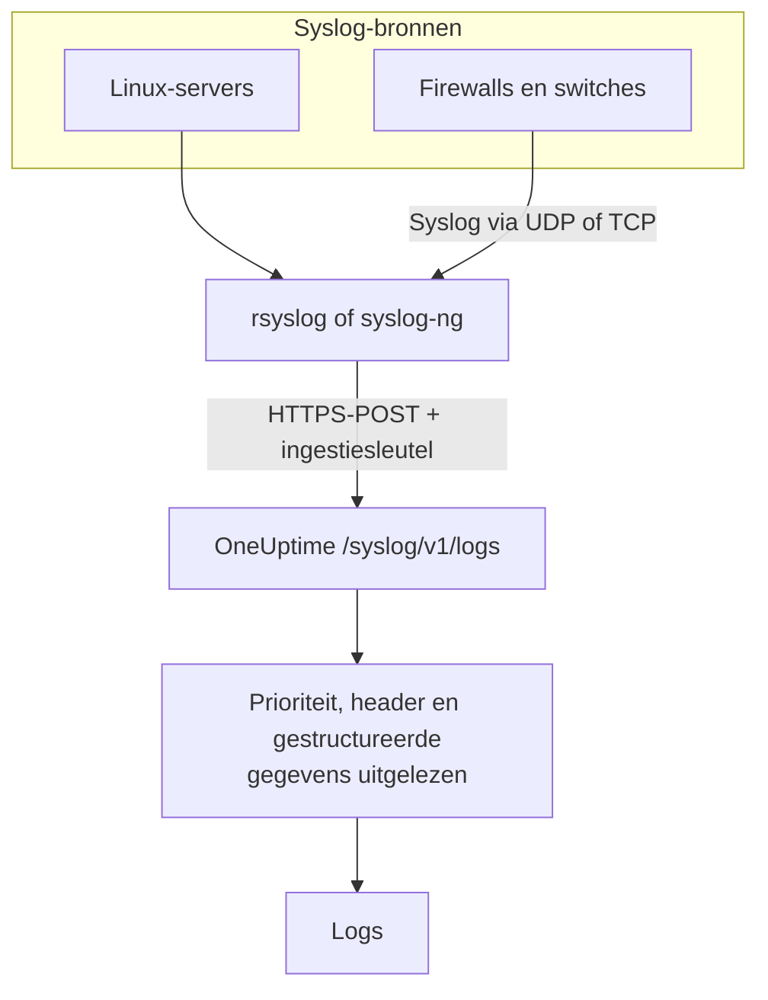

# Syslog

OneUptime neemt syslog aan via HTTPS. Stuur berichten volgens RFC 5424 of RFC 3164 met je ingestiesleutel naar `/syslog/v1/logs`, en elk bericht wordt een doorzoekbare log, met prioriteit, facility, niveau, host, applicatie en gestructureerde gegevens als attributen. Gebruik het om door te sturen vanuit rsyslog, syslog-ng of elke relay die HTTP-requests kan doen.

:::cards
- [Een testbericht sturen](#een-testbericht-sturen): Eén `curl`-request.
- [Doorsturen vanuit rsyslog](#doorsturen-vanuit-rsyslog): Alles sturen wat een server of relay ontvangt.
- [Uitgelezen attributen](#uitgelezen-attributen): Wat OneUptime uit elk bericht haalt.
- [Problemen oplossen](#problemen-oplossen): Geweigerde requests en onverwachte services.
:::

## Hoe het werkt



OneUptime antwoordt zodra het de berichten uit het request heeft gelezen, en leest en bewaart ze een moment later. De berichttekst blijft in de inhoud van de log; al het andere wordt een attribuut.

> [!TIP]
> Netwerkapparaten die je met een OneUptime-probe bewaakt, kunnen hun syslog via UDP rechtstreeks naar de probe sturen, zonder relay; de logs verschijnen dan bij het apparaat in OneUptime. Zie [Handleidingen per netwerkleverancier](/docs/monitor/network-vendor-guides).

## Voordat je begint

- **Een OneUptime-project**: in OneUptime Cloud wordt telemetrie per opgenomen GB gefactureerd, en een project op het Free-abonnement heeft een betaalmethode nodig voordat het telemetrie kan sturen.
- **Telemetrie-ingestiesleutel**: maak een **Server**-sleutel onder **Producten → Projectinstellingen → Telemetrie & APM → Ingestiesleutels** en kopieer de **Geheime sleutel**. Je stuurt die in de header `x-oneuptime-token`.
- **Syslog-doorstuurder**: elk hulpmiddel dat HTTP POST-requests kan sturen (bijvoorbeeld `curl`, `rsyslog` via `omhttp`, of `syslog-ng` met zijn HTTP-bestemming).
- **Servicenaam (optioneel)**: zet de header `x-oneuptime-service-name` om binnenkomende logs onder een bepaalde telemetrieservice te groeperen. Laat je hem weg, dan valt OneUptime terug op de syslog-`APP-NAME`, de hostnaam of `Syslog`.

## Endpoint

```http
POST https://oneuptime.com/syslog/v1/logs
```

| Header | Verplicht | Waarde |
| --- | --- | --- |
| `x-oneuptime-token` | Ja | Je ingestiesleutel. |
| `Content-Type` | Ja, voor JSON-inhoud | `application/json` |
| `x-oneuptime-service-name` | Nee | De service waartoe de logs horen. |
| `Content-Encoding` | Nee | `gzip`, voor gecomprimeerde inhoud. |

Vervang `oneuptime.com` door je eigen host als je OneUptime zelf host.

## Inhoud van het request

Stuur een JSON-payload met een array `messages`. Zowel RFC 5424 als RFC 3164 (BSD) worden ondersteund, en je kunt ze in één request door elkaar gebruiken:

```json
{
  "messages": [
    "<34>1 2025-03-02T14:48:05.003Z web-01 nginx 7421 ID47 [env@32473 host=\"web-01\"] 502 on /api/login",
    "<13>Feb  5 17:32:18 db-01 postgres[2419]: connection received from 10.0.0.12"
  ]
}
```

### Ondersteunde inhoudsformaten

| Inhoud | Hoe je hem stuurt |
| --- | --- |
| Een JSON-object met een array `messages` | `Content-Type: application/json`, aanbevolen. |
| Een JSON-array van berichten | `Content-Type: application/json`. |
| Een JSON-object met één `message` | `Content-Type: application/json`. Een waarde met meerdere regels wordt als meerdere berichten gelezen. |
| Berichten gescheiden door regeleinden | Met gzip gecomprimeerd en verstuurd met `Content-Encoding: gzip`. |

Platte tekst die niet met gzip is gecomprimeerd wordt niet gelezen, en het request wordt geweigerd met `400`. Met gzip gecomprimeerde inhoud wordt altijd gelezen als berichten gescheiden door regeleinden, dus comprimeer geen JSON-inhoud. Houd elk request onder 1 MB: de ingress van OneUptime verhoogt de standaardlimiet van nginx voor de requestinhoud niet voor dit endpoint.

## Een testbericht sturen

```bash
curl \
  -X POST https://oneuptime.com/syslog/v1/logs \
  -H "Content-Type: application/json" \
  -H "x-oneuptime-token: YOUR_TELEMETRY_KEY" \
  -H "x-oneuptime-service-name: production-web" \
  -d '{
    "messages": [
      "<34>1 2025-03-02T14:48:05.003Z web-01 nginx 7421 ID47 [env@32473 host=\"web-01\"] 502 on /api/login"
    ]
  }'
```

Een `200` betekent dat het bericht is aangenomen. Open **Producten → Logboeken**: de log verschijnt in de service `production-web` met de inhoud `502 on /api/login`, het niveau `Error` en de attributen uit [Uitgelezen attributen](#uitgelezen-attributen).

## Doorsturen vanuit rsyslog

rsyslog stuurt naar OneUptime met zijn HTTP-uitvoermodule, `omhttp`.

:::steps
### Zorgen dat `omhttp` beschikbaar is

De configuratie hieronder laadt hem met `module(load="omhttp")`. Meldt rsyslog dat het de module niet kan laden, installeer dan het pakket dat `omhttp` voor je distributie levert.

### De OneUptime-bestemming toevoegen

Maak `/etc/rsyslog.d/oneuptime.conf` aan. De template bouwt elk bericht opnieuw op als RFC 5424-regel en verpakt het in de JSON-inhoud die OneUptime verwacht:

```text title="/etc/rsyslog.d/oneuptime.conf"
module(load="omhttp")

template(name="OneUptimeJson" type="string"
         string="{\"messages\":[\"<%PRI%>1 %TIMESTAMP:::date-rfc3339% %HOSTNAME% %APP-NAME% %PROCID% %MSGID% - %msg:::json%\"]}")

action(
  type="omhttp"
  server="oneuptime.com"
  serverport="443"
  usehttps="on"
  restpath="syslog/v1/logs"
  httpheaders=[
    "x-oneuptime-token: YOUR_TELEMETRY_KEY",
    "x-oneuptime-service-name: rsyslog-demo"
  ]
  template="OneUptimeJson"
)
```

`restpath` krijgt het pad zonder de schuine streep vooraan. `omhttp` stuurt standaard een JSON-`Content-Type`, en dat is precies wat deze template oplevert.

### De configuratie controleren en rsyslog herstarten

```bash
sudo rsyslogd -N1
sudo systemctl restart rsyslog
```

`rsyslogd -N1` controleert de configuratie zonder rsyslog te starten. Na de herstart verschijnen nieuwe berichten onder **Producten → Logboeken** in de service `rsyslog-demo`.
:::

De actie stuurt elk bericht door dat rsyslog verwerkt: lokale programma's, het systemd-journal als rsyslog het leest, en alles wat het van het netwerk ontvangt.

### Syslog van netwerkapparaten doorgeven

Firewalls, switches en andere appliances sturen syslog vaak alleen via UDP of TCP. Richt ze op een rsyslog-relay en laat de relay via HTTPS doorsturen. Voeg in de configuratie van de relay vóór de `action` een listener toe:

```text title="/etc/rsyslog.d/oneuptime.conf"
module(load="imudp")
input(type="imudp" port="514")
```

Zet `x-oneuptime-service-name` op een naam zoals `perimeter-firewall`, of laat de header weg zodat de logs van elk apparaat op hostnaam worden gegroepeerd. Veel appliances schrijven hun bericht als `key=value`-paren; een [Key=Value Parser](/docs/telemetry/log-pipelines#keyvalue-parser) maakt er attributen van.

:::details In batches sturen in plaats van één request per bericht
rsyslog kan berichten bundelen en met gzip comprimeren, wat OneUptime leest als berichten gescheiden door regeleinden. Vervang de template en de actie door:

```text title="/etc/rsyslog.d/oneuptime.conf"
template(name="OneUptimeLine" type="string"
         string="<%PRI%>1 %TIMESTAMP:::date-rfc3339% %HOSTNAME% %APP-NAME% %PROCID% %MSGID% - %msg%")

action(
  type="omhttp"
  server="oneuptime.com"
  serverport="443"
  usehttps="on"
  restpath="syslog/v1/logs"
  httpheaders=["x-oneuptime-token: YOUR_TELEMETRY_KEY"]
  template="OneUptimeLine"
  batch="on"
  batch.format="newline"
  compress="on"
)
```

Houd `compress="on"` aan: OneUptime leest berichten gescheiden door regeleinden alleen uit inhoud die met gzip is gecomprimeerd.
:::

### Andere doorstuurders

- **syslog-ng**: gebruik zijn HTTP-bestemming met dezelfde URL, dezelfde headers en dezelfde JSON-inhoud.
- **Fluent Bit**: ontvang syslog met de `syslog`-input van Fluent Bit en stuur het door zoals elke andere log. Zie [Fluent Bit](/docs/telemetry/fluentbit).

## Uitgelezen attributen

OneUptime voegt automatisch de volgende attributen aan elke logregel toe:

| Attribuut | Waarde | Uit het testbericht |
| --- | --- | --- |
| `syslog.priority` | De prioriteit, `<PRI>` | `34` |
| `syslog.facility.code`, `syslog.facility.name` | De facility, uit de prioriteit | `4`, `security` |
| `syslog.severity.code`, `syslog.severity.name` | Het niveau, uit de prioriteit | `2`, `critical` |
| `syslog.version` | De RFC 5424-versie | `1` |
| `syslog.hostname` | `HOSTNAME` | `web-01` |
| `syslog.appName` | `APP-NAME`, of de RFC 3164-tag | `nginx` |
| `syslog.processId` | `PROCID` | `7421` |
| `syslog.messageId` | `MSGID` | `ID47` |
| `syslog.structured.raw` | De gestructureerde RFC 5424-gegevens, zoals verstuurd | `[env@32473 host="web-01"]` |
| `syslog.structured.*` | Elke parameter van de gestructureerde gegevens, platgemaakt | `syslog.structured.env_32473.host` = `web-01` |
| `syslog.raw` | Het oorspronkelijke bericht, voor herleidbaarheid | de hele regel |

Deze attributen worden doorzoekbaar in de explorer **Producten → Logboeken**, bijvoorbeeld `@syslog.severity.name:error` of `@syslog.hostname:web-01`. Zie [Zoeksyntaxis](/docs/telemetry/search-syntax).

Het bericht zelf blijft in de inhoud van de log. Firewalls zoals Sophos XGS en Fortinet FortiGate schrijven het als `key=value`-paren (`log_component="IPSec" con_name="HQ-Branch1" status="Terminated"`); voeg in een [logboekpipeline](/docs/telemetry/log-pipelines#keyvalue-parser) een processor **Key=Value Parser** toe om ook die paren in attributen om te zetten.

### Niveau

| Syslog-niveau | Code | Niveau in OneUptime |
| --- | --- | --- |
| Emergency, Alert | `0`, `1` | `Fatal` |
| Critical, Error | `2`, `3` | `Error` |
| Warning | `4` | `Warning` |
| Notice, Informational | `5`, `6` | `Information` |
| Debug | `7` | `Debug` |
| Geen prioriteit in het bericht | — | `Unspecified` |

Een bericht zonder tijdstempel wordt opgeslagen met het moment waarop OneUptime het ontving.

### Service

Elke log wordt opgeslagen onder een telemetrieservice, die OneUptime aanmaakt zodra die voor het eerst stuurt. De service is de eerste die aanwezig is van:

1. de header `x-oneuptime-service-name`;
2. de `APP-NAME` (of tag) van het bericht;
3. de hostnaam van het bericht;
4. `Syslog`.

## Problemen oplossen

:::details HTTP 401
De sleutel ontbreekt, is onbekend of verlopen. Controleer of de header `x-oneuptime-token` de **Geheime sleutel** bevat van een ingestiesleutel uit het project dat de logs moet ontvangen.
:::

:::details HTTP 402 of 422
`402`: in OneUptime Cloud zit het project op het Free-abonnement en heeft het geen betaalmethode. Voeg er een toe onder **Projectinstellingen → Facturering en facturen → Facturering**. `422`: de sleutel is uitgeschakeld, of het is een browsersleutel. Zet **Ingeschakeld** weer aan in de instellingen van de sleutel, of maak een **Server**-sleutel.
:::

:::details HTTP 400, of er verschijnen geen logs
Controleer of de requestinhoud echt syslog-regels bevat, als JSON met `Content-Type: application/json`. Lege inhoud, en platte tekst die niet met gzip is gecomprimeerd, wordt geweigerd met HTTP 400.
:::

:::details HTTP 413
Het request is groter dan de ingress aanneemt. Stuur minder berichten per request.
:::

:::details Logs komen binnen onder een onverwachte servicenaam
Zet `x-oneuptime-service-name` om de standaardherkenning te overschrijven, die eerst de `APP-NAME` en dan de hostnaam gebruikt.
:::

## Volgende stappen

:::cards
- [Logboekpipelines](/docs/telemetry/log-pipelines): `key=value`-berichten in attributen omzetten.
- [Opnameregels voor logboeken](/docs/telemetry/log-recording-rules): De getallen in je syslog in metrics omzetten.
- [Logs-monitor](/docs/monitor/logs-monitor): Waarschuwen wanneer overeenkomende syslog-berichten binnenkomen.
:::
