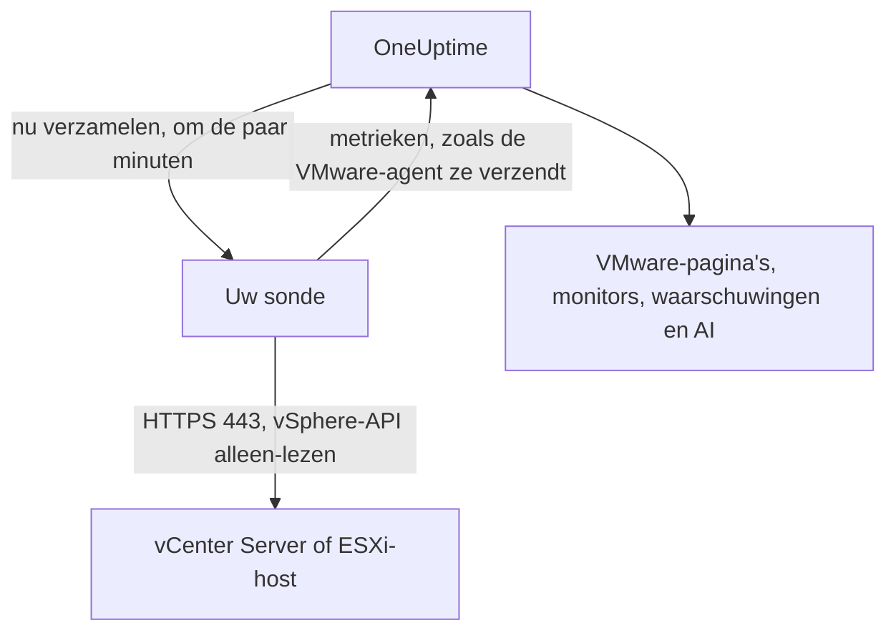

# VMware zonder agent

Bewaak een vCenter Server, of een zelfstandige ESXi-host, zonder iets te installeren: voer in OneUptime het adres van vCenter en een alleen-lezenaccount in, kies de sonde die het kan bereiken, en de sonde verzamelt dezelfde gegevens als de [VMware-agent](/docs/telemetry/vmware). Er is geen agent om te installeren, bij te werken of draaiende te houden, en geen eigen machine om in te richten.

:::cards
- [Voordat u begint](#voordat-u-begint): Een sonde die vCenter bereikt, en een alleen-lezenaccount.
- [Een vCenter koppelen](#een-vcenter-koppelen): Vier velden, een test en een naam.
- [Problemen oplossen](#problemen-oplossen): Wat elk bericht betekent en wat het verhelpt.
:::

## Hoe het werkt

Om de paar minuten meldt de sonde zich bij vCenter aan met het account dat u hebt opgeslagen, leest de inventaris, de prestatietellers en de vSAN-statistieken, en verzendt ze naar OneUptime. Ze komen precies zo binnen als die van de VMware-agent, dus elke VMware-pagina, elke [VMware-monitor](/docs/monitor/vmware-monitor), elke waarschuwingssjabloon en OneUptime AI lezen ze op dezelfde manier. De sonde houdt haar vCenter-sessie vast tussen verzamelingen, zodat het gebeurtenislogboek van vCenter niet volloopt met aanmeldingen.

## Sonde of agent?

| | Een sonde (deze pagina) | De VMware-agent |
|---|---|---|
| Wat u draait | Een sonde die u al draait, of een nieuwe | De agent, op een eigen machine |
| Waar het account wordt bewaard | Versleuteld in OneUptime, alleen naar de sonde verzonden | In het bestand `.env` van de agent |
| Wat bereikbaar moet zijn | vCenter via TCP 443, vanaf de sonde | vCenter via TCP 443, vanaf de agent |
| Grootste vCenter | Ongeveer 48 MiB aan metrieken per verzameling | Geen limiet |
| ESXi-syslog en de AI-agent | Niet inbegrepen | Inbegrepen |

Beide verzenden dezelfde gegevens. U kunt een vCenter op elk moment van de een naar de ander overzetten op de pagina **Instellingen**.

## Voordat u begint

- **Een sonde die vCenter via TCP 443 kan bereiken.** Meestal is dat een [aangepaste sonde](/docs/probe/custom-probe) in het netwerk van vCenter. Op OneUptime Cloud ontvangen de gedeelde sondes nooit een vCenter-wachtwoord, dus voeg een eigen sonde toe. Op een zelf gehoste instantie kunnen ook de eigen sondes van de instantie verzamelen.
- **Een vSphere-gebruiker met de rol Read-Only** op het bovenste vCenter-object, met **Propagate to children** aangevinkt. Volg [De alleen-lezengebruiker in vSphere aanmaken](/docs/telemetry/vmware#create-the-read-only-vsphere-user): het account is hetzelfde als dat van de agent.

> [!IMPORTANT]
> Zonder **Propagate to children** meldt de gebruiker zich aan maar ziet hij niets, en meldt de sonde dat het account de inventaris van vCenter niet kan lezen.

## Een vCenter koppelen

:::steps
### vCenters openen
Open in OneUptime **VMware → Alle vCenters** en klik op **vCenter koppelen**.

### Het adres en het account invoeren
Voer het adres in waarop u de vSphere Client opent, zoals `https://vcsa.example.com`, de gebruikersnaam met zijn domein, zoals `oneuptime@vsphere.local`, en het wachtwoord. Kies de sonde die vCenter bereikt.

### De verbinding testen
Klik in de volgende stap op **Verbinding testen**. De sonde meldt zich aan, leest wat het account kan zien en meldt zich af, en het resultaat vermeldt hoeveel datacenters, clusters, hosts, virtuele machines en datastores ze heeft gevonden.

### Het certificaat van vCenter vertrouwen
vCenter gebruikt standaard een certificaat van zijn eigen autoriteit, dat de sonde niet vertrouwt. De test toont dan het certificaat: vergelijk de vingerafdruk met die van vCenter zelf en klik dan op **Dit certificaat vertrouwen**.

### Een naam geven en koppelen
De naam is standaard de hostnaam van vCenter. Klik op **vCenter koppelen** om op te slaan.
:::

Het **Overzicht** van de vCenter toont een kaart **Gegevensverzameling**. Die toont **Bezig met controleren** tot de eerste verzameling, die binnen een minuut begint, daarna **Wordt verzameld**, en de inventaris vult zich.

## Certificaten

De sonde slaat de certificaatcontrole nooit over. Elke verbinding voltooit een volledige TLS-handshake, en daarna:

- als er geen certificaat wordt vertrouwd, moet het certificaat van vCenter afkomstig zijn van een autoriteit die de machine van de sonde vertrouwt, voor het ingevoerde adres;
- als er een certificaat wordt vertrouwd, moet vCenter precies dat certificaat tonen, herkend aan zijn SHA-256-vingerafdruk. Niets anders wordt geaccepteerd, zelfs geen publiek vertrouwd certificaat.

Om een vingerafdruk te controleren, opent u de vSphere Client bij **Administration → Certificates → Certificate Management**, of voert u `openssl s_client -connect vcsa.example.com:443 </dev/null | openssl x509 -noout -fingerprint -sha256` uit op de machine van de sonde.

Wanneer het certificaat van vCenter wordt vernieuwd, stopt het verzamelen met **Het certificaat van vCenter is gewijzigd** en wordt het nieuwe certificaat getoond. Er wordt niets naar vCenter verzonden totdat u het vertrouwt, op de pagina **Overzicht** of **Instellingen** van de vCenter.

## Het opgeslagen wachtwoord

Het wachtwoord is versleuteld en alleen-schrijven: niemand kan het teruglezen, en de API geeft het nooit terug. Het wordt alleen verzonden naar de sonde die de vCenter verzamelt, en die bewaart het in het geheugen.

Een opgeslagen wachtwoord wordt alleen ooit verzonden naar het adres, via de sonde en naar het certificaat waarvoor het is ingevoerd. Wie het adres, de sonde of het vertrouwde certificaat wijzigt, moet het wachtwoord opnieuw invoeren, zodat niemand die de vCenter kan bewerken het ergens anders heen kan sturen. Wie het certificaat vertrouwt dat de sonde op het opgeslagen adres vond, behoudt het.

## Wisselen tussen de agent en een sonde

Open de pagina **Instellingen** van de vCenter. De kaart **Gegevensverzameling** biedt **Verzamelen met een sonde** voor een vCenter die de agent verzendt, en **De VMware-agent gebruiken** voor een vCenter die een sonde verzamelt. Overstappen naar de agent vergeet het opgeslagen wachtwoord.

> [!WARNING]
> Stop de VMware-agent zodra de eerste verzameling door de sonde slaagt. Zolang beide draaien, komt elke metriek twee keer binnen.

## Naslag

| Instelling | Standaard | Opmerkingen |
|---|---|---|
| Verzamelen elke | 2 minuten | Van 1 tot 60 minuten. Verzamel een grote vCenter minder vaak om hem te ontzien. |
| Gelijktijdige verzamelingen | 4 per sonde | Een verzameling die trager is dan haar interval wordt overgeslagen, nooit opgestapeld. |
| Grootste verzameling | Ongeveer 48 MiB | Grotere vCenters hebben de VMware-agent nodig. |
| Verbindingstest | 90 seconden om te starten | Een test die geen sonde op tijd oppakt, of die langer dan 2 minuten duurt, wordt als mislukt beantwoord. |

## Problemen oplossen

:::details Het certificaat van vCenter wordt niet vertrouwd
vCenter toont een certificaat van zijn eigen autoriteit. Vergelijk de getoonde vingerafdruk met het certificaat van vCenter en klik dan op **Dit certificaat vertrouwen**.
:::

:::details vCenter weigerde de aanmelding
Gebruik de volledige gebruikersnaam met zijn domein, zoals `oneuptime@vsphere.local`, en controleer het wachtwoord en of het account niet is vergrendeld. Wijzig ze met **Verbinding bewerken** op de pagina **Instellingen** van de vCenter.
:::

:::details De gebruiker kan de inventaris van vCenter niet lezen
Geef de gebruiker de rol Read-Only op het bovenste vCenter-object, met **Propagate to children** aangevinkt.
:::

:::details De sonde krijgt geen antwoord van vCenter
Het netwerk van de sonde kan vCenter niet via TCP 443 bereiken. Sta het verkeer toe in de firewall, of kies een sonde in het netwerk van vCenter.
:::

:::details De sonde heeft dit niet opgepakt
De sonde is offline, of draait een OneUptime-versie die ouder is dan de VMware-verzameling. Controleer in de tabel **Aangepaste probes** of ze verbonden is, en werk haar bij.
:::

:::details Deze vCenter is te groot om met een sonde te verzamelen
Zijn metrieken zijn groter dan één upload van een sonde mag zijn. Gebruik de [VMware-agent](/docs/telemetry/vmware) voor deze vCenter.
:::

## Volgende stappen

:::cards
- [VMware-monitor](/docs/monitor/vmware-monitor): Waarschuwingen over hosts, virtuele machines, datastores en clusters.
- [Aangepaste sonde](/docs/probe/custom-probe): Draai een sonde in het netwerk van vCenter.
- [VMware-agent](/docs/telemetry/vmware): Verzamel een vCenter in plaats daarvan met de agent.
:::
