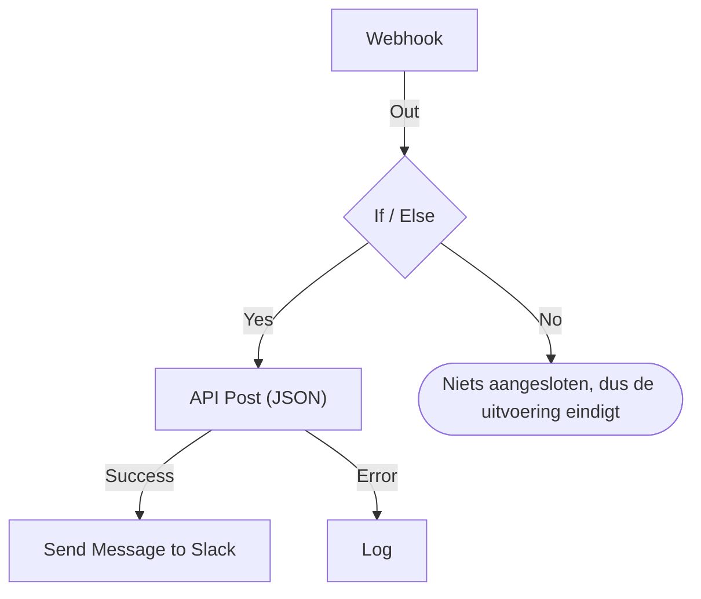

# Een workflow maken

Je bouwt een workflow in de **Bouwer** ervan: een canvas waarop je blokken toevoegt, ze verbindt en hun instellingen invult. Deze pagina laat zien hoe je een workflow maakt, [blokken toevoegt](#blokken-toevoegen), ze [verbindt](#blokken-verbinden) en [instelt](#een-blok-instellen), [waarden tussen blokken doorgeeft](#waarden-uit-eerdere-blokken-gebruiken) en [de workflow inschakelt](#inschakelen).

Om een workflow te maken open je **Workflows** en klik je op **Workflow maken**. Het dialoogvenster **Een workflow maken** vraagt eerst hoe je wilt beginnen en daarna een naam. Een sjabloon dat eigen instellingen nodig heeft, zoals een Slack-webhook-URL, vraagt daar in een extra stap om en slaat ze op als workflow-variabelen, zodat je ze later kunt wijzigen zonder de workflow te bewerken.

Kies hoe je begint:

- **Vanaf nul beginnen**, bovenaan het dialoogvenster, geeft je een leeg canvas. De meeste workflows beginnen hier.
- **Of begin met een sjabloon** toont een paar **Aanbevolen** sjablonen. Kies voor de andere een categorie naast het zoekveld, zoals **Incidenten**, **Monitoren** of **Jira**, of **Alle sjablonen**, of typ in **Sjablonen zoeken…**. Elk woord dat je typt moet overeenkomen.

Klik op een sjabloon om te zien wat het doet: de trigger, de blokken waaruit het bestaat en de instellingen waarom het gaat vragen. Klik daarna op **Dit sjabloon gebruiken**, of dubbelklik op het sjabloon. In het zoekveld kiezen de pijltjestoetsen een sjabloon en gebruikt **Enter** het. Met `/` ga je terug naar het zoekveld.

Workflows worden uitgeschakeld aangemaakt, zodat er niets draait totdat je ze inschakelt. Een nieuwe workflow opent in de **Bouwer**, het canvas waarop je hem ontwerpt.

## Het canvas

Een workflow vanaf nul opent met één gestippeld blok met de tekst **Choose what starts this workflow**. Dat blok is het startpunt: klik erop om een trigger te kiezen. Een workflow die van een sjabloon is gemaakt, opent met zijn blokken al op hun plek.

Elke workflow heeft precies één **trigger** bovenaan. Al het andere is een **component** dat iets doet. Om de trigger te wisselen verwijder je hem: de gestippelde plaatshouder komt terug op zijn plek, en als je erop klikt kies je een andere. Als je een blok verwijdert, verdwijnen ook de lijnen ervan, dus verbind de nieuwe trigger opnieuw met het eerste blok.

Wijzigingen worden automatisch opgeslagen. Een label in de werkbalk houdt het bij: **Opslaan…** terwijl de wijziging onderweg is, daarna **Opgeslagen**, of **Kon niet opslaan** als het niet lukte. Het canvas heeft geen opslaan-knop en geen aparte publicatiestap.

## Blokken toevoegen

| Om toe te voegen       | Klik op                                                        | Paneel dat opent              |
| ---------------------- | -------------------------------------------------------------- | ----------------------------- |
| De trigger             | Het gestippelde plaatshouderblok                               | **Add Trigger**               |
| Elk ander blok         | **Component toevoegen**, in de werkbalk boven het canvas       | **Component toevoegen**       |

Beide panelen openen op de blokken die de meeste workflows gebruiken, onder **Popular**, gevolgd door de andere ingebouwde blokken. Klik onder **OneUptime resources** op een resource zoals **Incident** om te zien wat je ermee kunt doen; **Browse all resources** toont ze allemaal. Of zoek: typ een paar woorden, zoals `create incident`, en de beste overeenkomst staat bovenaan. Druk op `/` om naar het zoekveld te springen, op de pijltjestoetsen om door de resultaten te gaan en op **Enter** om het gemarkeerde blok toe te voegen. Klikken op een blok voegt het toe.

Een nieuw blok komt onder het onderste blok van het canvas terecht, en een nieuwe trigger neemt bovenaan de plaats van het gestippelde blok in. Het nieuwe blok is geselecteerd, en als het buiten beeld terechtkomt, scrolt het canvas net ver genoeg om het te tonen. De instellingen ervan openen niet vanzelf: klik op het blok als je het wilt instellen. Zolang de verplichte instellingen niet zijn ingevuld, staat erop **Click to set up**.

Sleep blokken waarheen je wilt; het canvas klikt ze daarbij vast aan een raster. De posities van de blokken worden opgeslagen, zodat de volgende persoon dezelfde indeling ziet die jij achterliet.

## Wat er op een blok staat

| Veld                                  | Wat het doet                                                                                                                                                                                                                                                                                                  |
| ------------------------------------- | ------------------------------------------------------------------------------------------------------------------------------------------------------------------------------------------------------------------------------------------------------------------------------------------------------------- |
| **Identifier** (onder **ID**)         | De korte ID op het blok, zoals `log-1`. Hiermee verwijzen andere blokken naar dit blok, dus hernoemen breekt elke `{{local.components.…}}`-verwijzing die ernaar wijst. De kop van het blok is de eigen naam van het component en kan niet worden gewijzigd.                                                    |
| **Instellingen**                      | Wat het blok nodig heeft om zijn werk te doen: een URL, een Slack-kanaal, de tekst van een bericht. Optionele velden zijn gemarkeerd met **(Optioneel)**; al het andere is verplicht. Een aan/uit-schakelaar heeft geen van beide, omdat die altijd een waarde heeft. Minder gebruikte instellingen zijn ingeklapt onder **Meer velden**, waarvan de kop ze noemt en de ingevulde toont. |
| **Input**                             | Het punt aan de bovenrand, waar lijnen van eerdere blokken binnenkomen. Triggers hebben er geen: er draait niets vóór hen.                                                                                                                                                                                     |
| **Outputs**                           | De punten langs de onderrand, met het label er direct boven, waar lijnen naar de volgende blokken vertrekken. Veel blokken hebben aparte uitgangen **Success** en **Error**, zodat je beide gevallen kunt afhandelen.                                                                                         |

## Blokken verbinden

Sleep van een punt onderaan het ene blok naar het punt bovenaan het volgende. De lijn die je trekt, bepaalt wat er daarna draait.

- Verbind je vanaf **Success**, dan draait het volgende blok alleen als het vorige lukte.
- Verbind je vanaf **Error**, dan draait het volgende blok alleen als het vorige mislukte.
- Verbind je een uitgang niet, dan stopt dat pad gewoon.

Je kunt één uitgang op meerdere blokken aansluiten. Ze draaien allemaal, maar na elkaar, in één wachtrij, niet parallel. Reken niet op de volgorde tussen de takken en ook niet op overlap in de tijd.

Elk blok draait hooguit één keer per uitvoering. Een lijn die leidt naar een blok dat al heeft gedraaid — terug omhoog op het canvas, of vanuit een tweede tak nadat de eerste het al bereikte — stopt de uitvoering met een fout, zodat een workflow niet in een lus kan raken.

## Een blok instellen

Klik op een blok om de instellingen ervan in een dialoogvenster te openen, of ga er met **Tab** naartoe en druk op **Enter**. Vul de instellingen in en klik op **Opslaan**.

Elke instelling heeft het invoerveld dat haar waarde nodig heeft:

| De instelling bevat                              | Je krijgt                                                                      |
| ------------------------------------------------ | ------------------------------------------------------------------------------ |
| Woorden: een bericht, een prompt, een waarde om te loggen | Een vak dat meegroeit terwijl je typt. **Enter** begint een nieuwe regel. |
| Een korte waarde: een URL, een ID, een onderwerpregel | Eén regel.                                                                 |
| Code of HTML                                     | Een code-editor.                                                               |
| JSON                                             | Een JSON-editor.                                                               |
| Aan of uit                                       | Een schakelaar met de naam ernaast. Klik op de schakelaar of de naam om hem om te zetten. |

Het dialoogvenster opent op waarvoor je waarschijnlijk kwam. Bij een **Webhook**-trigger is dat de URL ervan, met een knop **URL kopiëren**, de methoden die hij accepteert en een voorbeeldverzoek. Bij een **Manual**-trigger is het hoe de workflow wordt gestart. Elk ander blok opent op zijn instellingen. Een blok zonder instellingen heeft helemaal geen sectie **Instellingen**.

Daaronder, van boven naar beneden:

- **ID**, **Inputs** en **Outputs**, naast elkaar — de identifier van het blok, vanwaar het wordt bereikt en wat erna draait.
- **Returns** — de gegevens die dit blok aan latere stappen doorgeeft. Elke waarde toont de exacte verwijzing die haar leest, met een knop om die te kopiëren.
- **How to use** — wat het blok doet in één zin, de stappen om het in te stellen, een voorbeeld om te kopiëren en de fouten die vaak worden gemaakt. Het voorbeeld is opgebouwd uit jouw workflow: het gebruikt de ID van dit blok, en de waarden van de trigger waar het gegevens in een bericht zet. **Learn more** opent de langere uitleg, en de links gaan naar de volledige gids. Elk blok heeft er een, en de knop **How to use** bovenaan het dialoogvenster springt er direct naartoe.

De voettekst bevat:

- **Verwijderen** — dit blok weghalen. Het vraagt eerst om bevestiging en noemt het blok bij soort en identifier, zoals **Send Email (send-email-2)**, zodat je weet welke van meerdere gelijke blokken verdwijnt.
- **Run just this step** — alleen dit ene blok uitvoeren, zonder de rest van de workflow. Waarden die het uit andere stappen zou hebben gelezen, komen leeg aan, en alles wat het verstuurt, schrijft of verwijdert, gebeurt echt. Het slaat elke voorwaarde vóór het blok over, dus alleen mensen die de workflow mogen bewerken, kunnen het gebruiken.

### Waarden uit eerdere blokken gebruiken

De meeste instellingen kunnen een waarde uit een eerder blok of een variabele gebruiken — zo stromen gegevens van het ene blok naar het volgende. Elke zo'n instelling heeft aan het eind een knop **{ }**. Die opent een lijst met de waarden die je kunt gebruiken: elk eerder blok bij naam, met elke waarde die het teruggeeft — hoe die heet, wat ze bevat en welk type ze heeft —, en daarna de variabelen van je workflow en je globale variabelen. Doorzoek de lijst, kies een waarde met de muis of met de pijltjestoetsen en **Enter**, en de waarde komt waar je cursor staat.

In de instelling verschijnt een waarde als chip, zoals **Webhook › Request Body**. Houd de muis erboven om de verwijzing te zien waarvoor hij staat, `{{local.components.webhook-1.returnValues.request-body}}`; dat is wat wordt opgeslagen. De cursor springt in één keer over een chip, **Backspace** verwijdert hem helemaal en kopiëren kopieert de verwijzing. Ken je de syntaxis, typ dan `{{`: dezelfde lijst opent onder de instelling en wordt kleiner terwijl je typt.

- **Alleen waarden die er zullen zijn, worden aangeboden.** Dat zijn de trigger en de blokken die vóór dit blok draaien. Een blok dat later draait, heeft nog geen uitvoer. Zolang een blok niet is verbonden, worden alleen de waarden van de trigger getoond, en de lijst zegt dat.
- **Een record opent op zijn velden.** Een Find One- of On Create-blok geeft een volledig record terug. Kies het om de velden te zien, te beginnen met de velden die **Select Fields** van het blok leest. Een JSON-waarde of een set headers opent op een vak waarin je een pad typt, zoals `title` of `alerts[0].status`.
- **Heeft een blok eenmaal gedraaid, dan weet de lijst wat er in zijn waarden zit.** Elke waarde zegt wat ze bij de laatste uitvoering bevatte — `"production"` of `3 fields` —, en een JSON-waarde of een set headers opent op de velden die ze had, elk met de inhoud. Zo kies je uit de **Request Body** van een Webhook **incident.title** in plaats van een pad te typen. Zoeken vindt deze velden ook: typ `title`, of `{{` en het begin van een pad. Ook de velden van een record tonen wat ze bevatten. De velden komen uit de laatste uitvoering, dus een veld dat een later verzoek weglaat, is in die uitvoering leeg. Een waarde die op een geheim lijkt, zoals een `Authorization`-header, een token of een wachtwoord, wordt zonder inhoud getoond.
- **Een Webhook die nog geen verzoek heeft ontvangen, zegt dat** bovenaan zijn waarden, met **Copy test request**: een `curl`-opdracht die `{"message": "Hello"}` naar de webhook-URL van de workflow stuurt. Voer hem uit in een terminal terwijl de lijst open is, en de velden van het verzoek verschijnen erin zodra de uitvoering die het start klaar is, meestal binnen enkele seconden. De workflow moet ingeschakeld zijn, anders wordt het verzoek geweigerd. Alleen mensen die de webhook-URL mogen zien, krijgen de knop. Een Incoming Email-trigger die nog geen e-mail heeft ontvangen, zegt dat op dezelfde plek; stuur een e-mail naar het adres ervan, en de headers en bijlagen verschijnen op dezelfde manier.
- **Code-editors hebben Insert value in hun werkbalk.** In JSON voegt het de aanhalingstekens toe die een waarde in een document nodig heeft. **Run Custom JavaScript** leest waarden via zijn **Arguments**, dus de code ervan heeft geen kiezer.
- **Getallen, wachtwoorden, schakelaars en datums houden hun eigen besturingselement,** met **{ }** ernaast. Een gekozen waarde vervangt het besturingselement, en met **abc** ga je terug naar typen.

Een chip wordt oranje als wat hij leest er niet is: een blok dat is hernoemd of verwijderd, een waarde die het blok niet teruggeeft, een blok dat later draait of een variabele die niet bestaat. De tooltip zegt welke van deze het is. Zie [Variabelen](/docs/workflows/variables) voor de syntaxis van verwijzingen.

## Controles tijdens het bouwen

De Bouwer controleert de hele graaf bij elke wijziging en meldt wat hij vindt in een label in de werkbalk. Klik op het label om **Problems with this workflow** te openen, dat elk probleem toont en je naar het verantwoordelijke blok brengt. Op het canvas staat op een blok waarvan de verplichte instellingen nog leeg zijn **Click to set up**, en een blok met een ander probleem draagt een badge in de hoek: rood voor een fout, oranje voor een waarschuwing. Houd de muis boven de badge om te lezen wat er mis is.

Hij vangt de fouten op die anders onzichtbaar blijven totdat een uitvoering misgaat:

- een workflow zonder trigger;
- twee blokken met dezelfde ID, of een ID met een punt erin;
- een blok waarop niets is aangesloten;
- een verplichte instelling die leeg is gelaten;
- ongeldige JSON;
- spaties binnen `{{ }}`;
- verwijzingen naar een stap of een retourwaarde die niet bestaat.

Eén ding kan hij niet controleren: of een variabelenaam bestaat. De instellingen van een blok kunnen dat wel — een verwijzing naar een variabele die niet bestaat, verschijnt daar als oranje chip. Overal elders merk je een hernoemde variabele pas in het logboek van de uitvoering.

## Je eerste workflow

De snelste manier om het canvas te leren kennen is een workflow van twee blokken die je handmatig start:

:::steps
1. Klik op het gestippelde plaatshouderblok en daarna op **Manual** in het paneel **Add Trigger**.
2. Klik op **Component toevoegen** en daarna op **Logboek** onder **Popular**. Het nieuwe blok komt onder de trigger terecht. Verbind het punt **Execute** van de trigger met het invoerpunt van het Log-blok eronder.
3. Klik op het Log-blok, waarop **Click to set up** staat, en typ `Hello from ` in de **Value** ervan. Klik op **{ }** en daarna op **JSON** onder **Manual**. De instelling toont **Manual › JSON** en slaat `{{local.components.manual-1.returnValues.value}}` op. `manual-1` is de **Identifier** van de trigger, die op het triggerblok staat. Klik op **Opslaan**.
4. Zet **Ingeschakeld** aan, bovenaan de Bouwer. Een uitgeschakelde workflow kan helemaal niet worden uitgevoerd, ook niet handmatig; sla je dit over, dan vraagt **Workflow uitvoeren** eerst om hem in te schakelen.
5. Klik terug in de **Bouwer** op **Workflow uitvoeren**, zet `{ "name": "Ada" }` in het veld **JSON**, klik op **Run Workflow Manually** en bevestig met **Run**.
6. Er opent vanzelf een paneel **Workflow-uitvoering** dat de uitvoering volgt. Het logboek toont `Value:` gevolgd door `Hello from { "name": "Ada" }`.
:::

Die cyclus — toevoegen, verbinden, instellen, uitvoeren, het logboek lezen — is hoe je elke workflow bouwt.

> [!TIP]
> JSON die je in **Workflow uitvoeren** typt, bereikt de Manual-trigger als de tekst die je typte. Om één veld ervan te lezen, zoals `name`, voeg je een **Text to JSON**-blok toe, zet je de **JSON** van de trigger in de **Text** ervan en lees je het veld uit de **JSON** van dat blok: `{{local.components.text-to-json-1.returnValues.json.name}}`.

## Inschakelen

Nieuwe workflows beginnen uitgeschakeld, net als elke workflow die je dupliceert of importeert. Zolang een workflow uit staat, zegt de Bouwer dat boven het canvas, met een knop **Workflow inschakelen**.

De schakelaar **Ingeschakeld** staat bovenaan de **Bouwer**, naast **Component toevoegen** en **Workflow uitvoeren**. Hij staat ook op de pagina **Overzicht** van de workflow, waarvan de kaart **Workflow-details** de huidige toestand toont als groen label **Ingeschakeld** of rood label **Uitgeschakeld**: klik op **Workflow bewerken** en open **Meer velden**. Alleen mensen die de workflow mogen bewerken, kunnen hem aan- of uitzetten; anderen zien de schakelaar grijs.

Een uitgeschakelde workflow kan helemaal niet draaien, hoe hij ook wordt gestart:

| Gestart door                                               | Zolang de workflow uit staat                                                                                                                                                              |
| ---------------------------------------------------------- | ----------------------------------------------------------------------------------------------------------------------------------------------------------------------------------------- |
| Zijn trigger: een schema, een OneUptime-gebeurtenis of een e-mail | Genegeerd.                                                                                                                                                                         |
| **Workflow uitvoeren** of **Run just this step**            | De Bouwer vraagt in plaats daarvan **Deze workflow inschakelen?**. **Inschakelen en uitvoeren** (of **Inschakelen en stap uitvoeren**) zet de workflow aan en voert daarna uit waar je om vroeg, met de waarden die je gaf. |
| Een aanroep van zijn webhook-URL                           | Geweigerd met HTTP 400 en "This workflow is turned off, so it can't run. Turn it on with the Enabled switch at the top of its Builder, then try again."                                      |
| Het **Execute Workflow**-blok van een andere workflow       | Dat blok neemt zijn pad **Error**, en de fout noemt de workflow die het aanriep.                                                                                                          |

De volgorde is dus: bouwen, testen met **Workflow uitvoeren**, het logboek van de uitvoering lezen en **Ingeschakeld** weer uitzetten als je nog niet wilt dat de trigger afgaat. Gebruik **Run just this step** in de instellingen van een blok om één blok te testen zonder het geheel uit te voeren.

Wil je een workflow pauzeren zonder hem te verwijderen, zet dan **Ingeschakeld** uit. Er starten geen nieuwe uitvoeringen. Een uitvoering die halverwege is, maakt haar werk af, maar een uitvoering die op een **Sleep**-blok wacht, wordt bij het ontwaken geannuleerd en als fout vastgelegd.

## Opruimen

- Sleep blokken om ze te verplaatsen. De indeling wordt opgeslagen.
- Om een lijn te verwijderen sleep je een van de uiteinden van het punt af en laat je het los op een lege plek van het canvas.
- Om een blok te verwijderen klik je erop en gebruik je **Verwijderen** onderaan het instellingenvenster. Een blok of lijn selecteren en op Backspace drukken verwijdert het ook.
- Eén blok dupliceren kan niet. **Workflow dupliceren** op de pagina **Instellingen** van de workflow kopieert het geheel. De naam van de kopie is al ingevuld, doorgenummerd voorbij de workflows van het project ("Nightly Sync" wordt gekopieerd als "Nightly Sync 2"), en de kopie opent, uitgeschakeld.
- Stapel blokken van boven naar beneden, zodat ze lezen in de richting waarin ze draaien — ingangen zitten aan de bovenrand, uitgangen aan de onderrand, dus de stroom gaat vanzelf naar beneden.

## Volgende stappen

:::cards
- [Triggers](/docs/workflows/triggers): De vijf manieren waarop een workflow kan starten.
- [Componenten](/docs/workflows/components): Elk blok dat je kunt toevoegen, met zijn instellingen en uitgangen.
- [Variabelen](/docs/workflows/variables): Verplaats gegevens tussen blokken en houd geheimen erbuiten.
- [Uitvoeringen](/docs/workflows/runs-and-logs): Controleer wat elke uitvoering deed, stap voor stap.
:::
