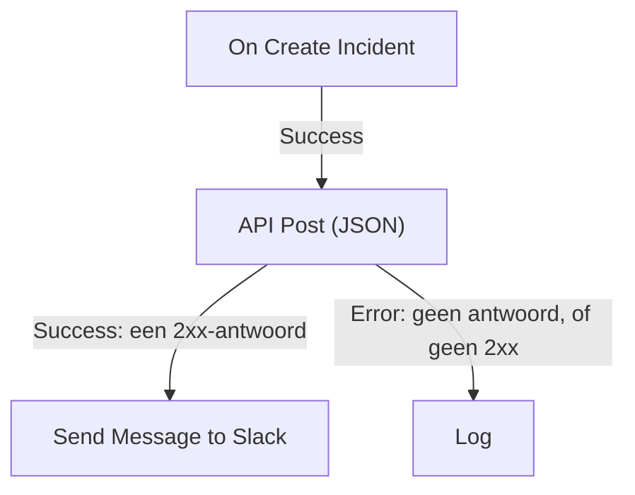

# Workflow-componenten

Componenten zijn de blokken die je na de trigger toevoegt. Elk doet één ding — een bericht sturen, een API aanroepen, een voorwaarde controleren, een OneUptime-record wijzigen — en neemt daarna een van zijn uitgangen naar de blokken die erop zijn aangesloten. Deze pagina is de catalogus: wat elk blok nodig heeft, wat het teruggeeft en wanneer het welke uitgang neemt.

Je hebt haar zelden open nodig tijdens het bouwen. De instellingen van elk blok eindigen met **How to use**: wat het blok doet, de stappen om het in te stellen, een voorbeeld dat uit je eigen workflow is opgebouwd en de fouten die vaak worden gemaakt. Zie [Een workflow maken](/docs/workflows/authoring) voor het toevoegen en verbinden van blokken.

:::cards
- [Een bericht sturen](#slack): Slack, Microsoft Teams, Discord, Telegram, IRC en e-mail.
- [Een API aanroepen](#api): Stuur een verzoek naar elke HTTP-API en lees het antwoord.
- [Logica toevoegen](#conditions): Vertakken op een waarde, gegevens omvormen, wachten of loggen.
- [Werken met OneUptime-records](#oneuptime-datacomponenten): Monitoren, incidenten en meer vinden, aanmaken, bijwerken en verwijderen.
:::

## Welk component moet ik gebruiken?

| Om…                                                           | Gebruik                                                           |
| ------------------------------------------------------------- | ----------------------------------------------------------------- |
| In een chattool te posten                                     | [Slack](#slack), [Microsoft Teams](#microsoft-teams), [Discord](#discord), [Telegram](#telegram) of [IRC](#irc) |
| Een e-mail via je eigen mailserver te sturen                  | [Email](#email)                                                   |
| Een andere API of je eigen dienst aan te roepen               | [API](#api)                                                       |
| Tekst samen te vatten, te classificeren of op te stellen      | [Generate Text with AI](#generate-text-with-ai)                   |
| Afhankelijk van een waarde het ene of het andere pad te nemen | [Conditions](#conditions)                                         |
| Gegevens tussen twee blokken om te vormen                     | [JSON](#json) of [Custom Code](#custom-code)                      |
| Te wachten vóór het volgende blok                             | [Sleep](#sleep)                                                   |
| Een andere workflow te starten                                | [Execute Workflow](#execute-workflow)                             |
| Incidenten, monitoren en andere records te lezen of te wijzigen | [OneUptime-datacomponenten](#oneuptime-datacomponenten)         |

Een specifiek blok is beter dan een algemeen: het Slack-blok kent de limieten van Slack, en een recordblok kent de velden van het record, dus je krijgt duidelijkere fouten en logboeken dan van een **API**-blok dat hetzelfde werk doet.

## Hoe elk blok werkt

Een blok draait als het blok ervoor de uitgang neemt die erop is aangesloten. Het leest zijn instellingen, doet zijn werk en neemt daarna een van zijn uitgangen. Alleen de blokken die op die uitgang zijn aangesloten, draaien daarna.



- **Instellingen** zijn wat je invult. Instellingen met **(Optioneel)** mogen leeg blijven. Minder gebruikte instellingen zijn ingeklapt onder **Meer velden**.
- **Outputs** zijn de punten aan de onderrand. De meeste blokken hebben **Success** en **Error**; [Conditions](#conditions) heeft **Yes** en **No**.
- **Returns** zijn de waarden die een blok aan latere blokken doorgeeft, zoals de **Response Body** van een API. Een later blok leest er een met `{{local.components.<block ID>.returnValues.<value ID>}}`; de knop **{ }** in een instelling voegt hem voor je in. Zie [Variabelen](/docs/workflows/variables#componentuitvoer-data-uit-eerdere-blokken).

Een blok dat **Error** neemt, laat de uitvoering niet mislukken: de uitvoering volgt het pad **Error**, of eindigt daar als er niets op is aangesloten. Een verplichte instelling die leeg is gelaten, of een instelling die nooit kan werken, stopt de uitvoering daarentegen met een fout.

## API

Doe een HTTP-verzoek naar elke URL. Er is één blok per methode: **API Get (JSON)**, **API Post (JSON)**, **API Put (JSON)**, **API Patch (JSON)** en **API Delete (JSON)**.

| Instelling          | Wat het doet                                                                                                                         |
| ------------------- | ------------------------------------------------------------------------------------------------------------------------------------ |
| **URL**             | Het adres om aan te roepen, `http` of `https`.                                                                                       |
| **Request Body**    | De JSON om te versturen. Meestal hebben alleen `POST`-, `PUT`- en `PATCH`-verzoeken er een nodig.                                    |
| **Request Headers** | Headers om mee te sturen, zoals een API-sleutel. Onder **Meer velden**. Hun waarden zijn verborgen in het logboek van de uitvoering. |

| Uitgang     | Wanneer                                                                                        |
| ----------- | ---------------------------------------------------------------------------------------------- |
| **Success** | De server antwoordde met een 2xx-status.                                                       |
| **Error**   | Het verzoek mislukte: de server was niet bereikbaar, of antwoordde met een andere status.      |

Hoe dan ook geeft het blok **Response Status**, **Response Headers** en **Response Body** terug, plus **Error** met de reden als het mislukte. Lees één veld van een JSON-antwoord door de naam ervan aan de verwijzing toe te voegen, zoals in `{{local.components.api-get-1.returnValues.response-body.id}}`.

Omleidingen worden niet gevolgd, dus richt het blok op het adres dat antwoordt. Verzoeken gaan vanuit OneUptime de deur uit: een URL die naar een privénetwerkadres verwijst, wordt geweigerd tenzij een beheerder van een zelf gehoste installatie die toestaat, en de uitvoering stopt met de reden. Zie [Uitgaande netwerktoegang](/docs/workflows/configuration#uitgaande-netwerktoegang).

## AI

### Generate Text with AI

Genereer één tekstantwoord op basis van een prompt en optionele JSON-context. Het blok gebruikt de standaard-LLM-provider van het project, of de globale provider van de installatie als het project er geen heeft. Providers worden centraal ingesteld onder **Projectinstellingen → AI → LLM-providers**; hun sleutels en endpoints zijn nooit instellingen van het blok.

| Instelling                | Wat het doet                                                                                                                                                      |
| ------------------------- | ----------------------------------------------------------------------------------------------------------------------------------------------------------------- |
| **System Instructions**   | Optionele aanwijzingen voor de rol, de toon en de beperkingen van het model.                                                                                     |
| **Prompt**                | De taak. Die wordt verstuurd precies zoals je hem typt, dus Markdown werkt, en hij kan variabelen en waarden uit eerdere blokken bevatten.                       |
| **Context**               | Optionele JSON die je bewust meestuurt. Die wordt toegevoegd na een expliciete markering voor het einde van het bericht en behandeld als onbetrouwbare gegevens. |
| **Temperature**           | Onder **Meer velden**. De variatie, van `0` tot `1`; de standaardwaarde is `0.2`, voor voorspelbare automatisering. Huidige Claude-modellen, Opus 4.7 en later en elk Claude 5-model, kiezen hun eigen sampling: OneUptime laat **Temperature** weg uit hun verzoeken, dus op hen heeft het geen effect. |
| **Maximum Output Tokens** | Onder **Meer velden**. Van `1` tot `4096`; de standaardwaarde is `1024`.                                                                                         |

System Instructions, Prompt en de geserialiseerde Context zijn samen beperkt tot 50.000 tekens. Een afbeelding die er als base64 in zit, zoals de schermafbeelding van een synthetische monitor in de beschrijving van een incident, wordt vóór het meten vervangen door een korte notitie zoals `[image omitted: PNG, 340 KB]`, omdat het model tekst leest, geen afbeeldingen. Het logboek van de uitvoering zegt wat er is weggelaten. Het verzoek aan de provider duurt hooguit 60 seconden en wordt één keer geprobeerd. Per project kunnen hooguit drie AI-verzoeken van workflows tegelijk lopen.

Het geeft **Response** terug (de gegenereerde tekst), **Provider** en **Model** (wat antwoordde), **Total Tokens** en **Completion Tokens** (het gebruik dat de provider rapporteerde), **LLM Log ID** (de vermelding van de aanroep in de AI-logboeken) en **Error**.

Sluit **Success** aan op de blokken die het antwoord gebruiken, en **Error** op een terugvaloptie: fouten in validatie, toegang, provider, budget, facturering en time-out nemen allemaal dat pad. Het blok stuurt geen tools mee, dus het model kan zelf geen OneUptime opvragen, geen API's aanroepen en geen gegevens wijzigen.

> [!WARNING]
> Uitvoer van het model is onbetrouwbare tekst. Controleer die voordat ze klanten bereikt, en laat vrije AI-tekst nooit in zijn eentje over een destructieve actie beslissen. Zie [AI-componenten](/docs/workflows/configuration#ai-componenten) voor wat er naar de provider gaat, wat er wordt gelogd en wat het kost.

## Slack

Post een bericht in een Slack-kanaal via een inkomende webhook.

| Instelling                     | Wat het doet                                                                                                                                                                                                 |
| ------------------------------ | ------------------------------------------------------------------------------------------------------------------------------------------------------------------------------------------------------------ |
| **Slack Incoming Webhook URL** | De webhook van het kanaal waarin je wilt posten. Die moet beginnen met `https://hooks.slack.com/services/`. De handleiding van Slack om [er een te maken](https://api.slack.com/messaging/webhooks) kost een paar minuten. |
| **Message Text**               | De tekst om te versturen. Die wordt verstuurd precies zoals je hem typt, dus gebruik de eigen opmaak van Slack: `*bold*`, `_italic_`, `~strikethrough~` en `<https://example.com|a link>`. Een tekst die langer is dan één Slack-sectie (3.000 tekens) gaat als meerdere secties; na tien secties wordt hij afgekapt en eindigt hij met "… (truncated — see OneUptime for the full text)". |

**Success** gaat af als Slack het bericht aannam en **Error** als Slack het weigerde, met de reden van Slack in **Error**. Deze blokken posten via de webhook in hun instellingen, niet via de Slack-verbinding van je project.

## Microsoft Teams

Post een bericht in een Microsoft Teams-kanaal. Het blok heet **Send Message to Teams**.

| Instelling                     | Wat het doet                                                                                                                                                                                                                                  |
| ------------------------------ | --------------------------------------------------------------------------------------------------------------------------------------------------------------------------------------------------------------------------------------------- |
| **Teams Incoming Webhook URL** | De kanaalwebhook om in te posten, een `https`-URL op `office.com`, `office365.com`, `logic.azure.com` of `environment.api.powerplatform.com`. De handleiding van Microsoft laat zien hoe je [er een maakt met Teams Workflows](https://support.microsoft.com/en-us/teams/apps-service/create-incoming-webhooks-with-workflows-for-microsoft-teams). |
| **Message Text**               | De tekst om te versturen. Een bericht dat groter is dan een inkomende webhook aanneemt (ongeveer 12.000 tekens, gemeten zoals het wordt verstuurd) wordt afgekapt en eindigt met "… (truncated — see OneUptime for the full text)".             |

## Discord

Post een bericht in een Discord-kanaal via een inkomende webhook.

| Instelling                       | Wat het doet                                                                                                                                       |
| -------------------------------- | -------------------------------------------------------------------------------------------------------------------------------------------------- |
| **Discord Incoming Webhook URL** | De webhook van het kanaal, een `https`-URL op `discord.com` of `discordapp.com`.                                                                   |
| **Message Text**                 | De tekst om te versturen. Een bericht van meer dan 2.000 tekens, de limiet van Discord, wordt afgekapt en eindigt met "… (truncated — see OneUptime for the full text)". |

## Telegram

Stuur een bericht naar een Telegram-chat met een bot.

| Instelling             | Wat het doet                                                                                                                                       |
| ---------------------- | -------------------------------------------------------------------------------------------------------------------------------------------------- |
| **Telegram Bot Token** | Het token dat BotFather je bot gaf, zoals `123456789:ABCdef…`. Een token met een andere vorm stopt de uitvoering, zonder dat het token in het logboek komt. |
| **Chat ID**            | De chat om in te posten: de ID ervan, of de `@username` van een kanaal. Voeg de bot eerst toe aan de groep of het kanaal. Om iemand een bericht te sturen, moet die persoon eerst een chat met de bot zijn begonnen. |
| **Message Text**       | De tekst om te versturen. Een bericht van meer dan 4.096 tekens, de limiet van Telegram, wordt afgekapt en eindigt met "… (truncated — see OneUptime for the full text)". |

Als Telegram het bericht weigert, gaat **Error** af met de reden van Telegram.

## IRC

Post een bericht in een IRC-kanaal op elk IRC-netwerk: Libera.Chat, OFTC of een eigen server. IRC heeft geen webhooks, dus het blok maakt zelf verbinding met de server, gaat het kanaal in, stuurt het bericht en vertrekt weer.

| Instelling       | Wat het doet                                                                                                                                                                                                                                       |
| ---------------- | -------------------------------------------------------------------------------------------------------------------------------------------------------------------------------------------------------------------------------------------------- |
| **IRC Server**   | De hostnaam van de server, zoals `irc.libera.chat`. Alleen de naam: geen `ircs://` en geen poort.                                                                                                                                                  |
| **Channel**      | Het kanaal om in te posten, zoals `#ops`. Het moet een kanaal zijn: een bijnaam die je hier typt, wordt geweigerd in plaats van een privébericht te krijgen.                                                                                       |
| **Message Text** | De tekst om te versturen. Elke regel gaat als een eigen IRC-bericht, en een lange regel wordt opgesplitst zodat hij past. Een bericht wordt als hooguit 15 IRC-regels verstuurd: een langer bericht wordt ingekort, en de laatste regel zegt dat. IRC heeft geen Markdown, dus de tekst wordt verstuurd zoals getypt; de eigen opmaakcodes van IRC, zoals vet en kleuren, werken wel. |

Onder **Meer velden**:

| Instelling                               | Wat het doet                                                                                                                                                                                                       |
| ---------------------------------------- | ------------------------------------------------------------------------------------------------------------------------------------------------------------------------------------------------------------------ |
| **Nickname**                             | Van wie het bericht is. Standaard `OneUptime`. Is de bijnaam bezet, dan probeert het blok hem met een underscore of een cijfer erbij, en daarna met zo'n teken in plaats van de laatste tekens, voor een server die geen langere bijnaam accepteert. |
| **Port**                                 | De poort van de server. Standaard `6697`, of `6667` als **Disable TLS** aan staat.                                                                                                                                  |
| **Disable TLS**                          | Het blok verbindt via TLS en controleert het certificaat van de server. Zet dit alleen aan voor een server die geen TLS aanbiedt; een eventueel wachtwoord gaat dan onversleuteld over de lijn. Om een certificaat van je eigen certificeringsinstantie te vertrouwen, stelt een zelf gehoste installatie in plaats daarvan `NODE_EXTRA_CA_CERTS` in. |
| **Channel Key**                          | De sleutel van een kanaal dat er een heeft (modus `+k`).                                                                                                                                                           |
| **Send Without Joining**                 | Post zonder het kanaal in te gaan, zodat het kanaal het blok niet ziet komen en gaan. Werkt alleen waar het kanaal berichten van buiten accepteert (geen modus `+n`).                                               |
| **Server Password**                      | Een wachtwoord dat de server of je bouncer vraagt bij het verbinden.                                                                                                                                              |
| **SASL Username** en **SASL Password**   | Log in op je account op netwerken die SASL gebruiken, zoals Libera.Chat, dat het vereist voor verbindingen vanaf sommige cloud- en VPN-adressen. Vul beide in of geen van beide.                                    |

**Success** gaat af zodra de server elke regel heeft aangenomen. Het blok controleert dat door de server na de laatste regel om een antwoord op een ping te vragen: een server antwoordt op volgorde, dus een eventuele weigering van het bericht komt eerst. Een bouncer zoals ZNC beantwoordt de ping zelf, dus het blok luistert een seconde langer naar het antwoord van het netwerk erachter.

**Error** gaat af als de server niet bereikbaar is, de verbinding, de bijnaam, een wachtwoord of het kanaal weigert, of het bericht weigert. Het geeft de reden door, in de eigen woorden van de server als die ze gaf. Een ontbrekende **IRC Server**, **Channel** of **Message Text**, of een instelling die nooit zou kunnen werken, stopt de uitvoering daarentegen.

Elke uitvoering van het blok is een eigen verbinding, en IRC-netwerken beperken hoe vaak één adres mag verbinden: een golf berichten kan worden geweigerd met een reden zoals "Reconnecting too fast", en neemt **Error** zoals elke andere weigering. Voor een workflow die vele keren per minuut kan afgaan, bundel je wat hij te zeggen heeft in één bericht, of stuur je het via een eigen server.

Bewaar de wachtwoorden in [geheime globale variabelen](/docs/workflows/variables#globale-variabelen) en gebruik de variabele in de instelling; ze zijn hoe dan ook verborgen in de logboeken van uitvoeringen. Verbindingen naar loopback- (`localhost`, `127.0.0.1`), link-local- en cloudmetadata-adressen worden geweigerd. In OneUptime Cloud wordt ook een server op een privénetwerkadres, of een naam die daarnaar verwijst, geweigerd. Zelf gehoste installaties kunnen een IRC-server op hun eigen netwerk bereiken, tenzij `DATA_SOURCE_BLOCK_PRIVATE_ADDRESSES` op `true` staat.

## Email

Stuur een e-mail via een SMTP-server die je in het blok invult. Het blok heet **Send Email**.

| Instelling                              | Wat het doet                                                                                          |
| --------------------------------------- | ----------------------------------------------------------------------------------------------------- |
| **From Email**                          | De afzender, bijvoorbeeld `Alerts <alerts@company.com>`.                                              |
| **To Email**                            | Het adres van de ontvanger. Scheid meerdere adressen met komma's of puntkomma's.                      |
| **Subject**                             | De onderwerpregel.                                                                                    |
| **Email Body**                          | Het bericht, verstuurd als HTML.                                                                      |
| **SMTP HOST** en **SMTP Port**          | De mailserver om mee te verbinden.                                                                    |
| **SMTP Username** en **SMTP Password**  | Optioneel. Vul beide in of geen van beide.                                                            |
| **Use Implicit TLS**                    | Zet aan voor impliciete TLS, meestal op poort 465. Laat uit voor STARTTLS, meestal op poort 587.     |

**Success** gaat af als de SMTP-server het bericht aannam. **Error** gaat af als de SMTP-host wordt geweigerd, de server niet bereikbaar is of het bericht weigert, en geeft de foutmelding door. Een ontbrekende **To Email**, **From Email**, **SMTP HOST** of **SMTP Port** stopt de uitvoering daarentegen.

Het blok verbindt rechtstreeks met de server in zijn instellingen. Het gebruikt niet de [SMTP](/docs/emails/smtp)-instellingen van je project of de eigen mailserver van OneUptime, en de e-mails die het verstuurt, verschijnen niet in de meldingslogboeken. Bekijk de [Uitvoeringen](/docs/workflows/runs-and-logs) van de workflow om te controleren wat het deed.

Verbindingen naar loopback- (`localhost`, `127.0.0.1`), link-local- en cloudmetadata-adressen worden geweigerd. In OneUptime Cloud wordt ook een SMTP-host op een privénetwerkadres, of een naam die daarnaar verwijst, geweigerd. Zelf gehoste installaties kunnen een mailserver op hun eigen netwerk bereiken, tenzij `DATA_SOURCE_BLOCK_PRIVATE_ADDRESSES` op `true` staat. Een geweigerde host neemt de uitgang **Error**, en er wordt niets verstuurd.

## Custom Code

Voer een paar regels JavaScript uit als de andere blokken niet kunnen wat je nodig hebt. Het blok heet **Run Custom JavaScript**.

| Instelling          | Wat het doet                                                                                                                         |
| ------------------- | ------------------------------------------------------------------------------------------------------------------------------------ |
| **JavaScript Code** | Je code. Wat die met `return` teruggeeft, wordt de **Value** van het blok. Ze kan `await` gebruiken.                                |
| **Arguments**       | Een JSON-object met waarden voor de code, die ze leest als `args`. Zet hier variabelen en waarden uit eerdere blokken in; de code zelf kan ze niet lezen. |

```json title="Arguments"
{ "title": "{{local.components.incident-on-create-1.returnValues.model.title}}" }
```

```javascript title="JavaScript Code"
const words = args.title.split(" ");

return {
  shortTitle: words.slice(0, 5).join(" "),
  wordCount: words.length,
};
```

Een later blok leest de korte titel als `{{local.components.javascript-1.returnValues.returnValue.shortTitle}}`.

De code draait in een sandbox met `args`, `console.log` (geschreven naar het logboek van de uitvoering), `axios` voor HTTP-verzoeken, `crypto` en `sleep`. Ze heeft geen bestandssysteem en geen proces, en haar verzoeken vallen onder dezelfde adresregels als het API-blok. Ze heeft standaard 5 seconden; een zelf gehoste installatie wijzigt dat met `WORKFLOW_SCRIPT_TIMEOUT_IN_MS`.

**Success** gaat af met de teruggegeven **Value**, en **Error** als de code een fout gooit of door haar tijd heen is, met de melding in **Error**. Gebruik voor zwaardere scripts een [Runbook](/docs/runbooks/index).

## JSON

Zet tekst om naar JSON en terug, of combineer twee JSON-objecten.

| Blok             | Neemt                                    | Geeft terug                                                                                                |
| ---------------- | ---------------------------------------- | ---------------------------------------------------------------------------------------------------------- |
| **JSON to Text** | **JSON**, een object                     | **Text**: het object als string. Handig als het volgende blok tekst verwacht.                              |
| **Text to JSON** | **Text**, dat meerdere regels mag hebben | **JSON**: het geparste object, zodat je de velden ervan kunt lezen. Gebruik het op JSON die als tekst binnenkwam. |
| **Merge JSON**   | **JSON 1** en **JSON 2**                 | **JSON**: één object met de sleutels van beide. Hebben beide een sleutel, dan wint **JSON 2**.             |

**Text to JSON** neemt **Error** als de tekst geen JSON is. Een ontbrekende invoer, of een invoer van **Merge JSON** die geen object is, stopt de uitvoering.

## Conditions

Vertak op basis van een vergelijking. In het paneel **Component toevoegen** heet dit blok **If / Else**, onder **Popular**.

De instellingen lezen als een zin: **Als** *waarde om te controleren* *vergelijking* *waarde om mee te vergelijken*, ga verder op **Yes**, anders op **No**. Onder de instellingen wordt de voorwaarde in woorden teruggelezen, zodat je ziet dat ze zegt wat je bedoelt. Op het canvas toont het blok de voorwaarde ook, bijvoorbeeld *Als environment is equal to “production”*.

| Instelling         | Wat het doet                                                                                                                             |
| ------------------ | ---------------------------------------------------------------------------------------------------------------------------------------- |
| **Value to check** | Meestal een waarde uit een eerder blok. Druk op **{ }** in het vak om er een te kiezen, of typ `{{`.                                     |
| **Comparison**     | Hoe te vergelijken, in woorden. De vergelijkingen staan hieronder.                                                                       |
| **Compare with**   | Waarmee te vergelijken, op dezelfde manier getypt of gekozen. **is leeg**, **is niet leeg**, **is true** en **is false** gebruiken het niet. |
| **Compare as**     | Ingeklapt onder de vergelijking: **Text**, **Nummer** of **True / False**. Kies **Text** om datums als `2026-10-01` te ordenen, of **Nummer** om `200` en `200.0` gelijk te maken. |

De vergelijkingen:

- **is equal to** en **is not equal to**;
- voor tekst: **bevat**, **bevat niet**, **begint met** en **eindigt met**;
- voor getallen: **is groter dan**, **is greater than or equal to**, **is kleiner dan** en **is less than or equal to**;
- **is leeg** en **is niet leeg**, die controleren of de waarde er überhaupt is;
- **is true** en **is false**.

De getalvergelijkingen vergelijken getallen en de tekstvergelijkingen vergelijken tekst, dus je hebt **Compare as** zelden nodig. Hoe de waarden worden vergeleken:

- Als tekst tellen hoofdletters: `Error` is niet `error`.
- Als getallen telt tekst die geen getal is als `0`. De instellingen wijzen op zo'n getypte waarde.
- Als waar of onwaar telt alleen `true` als waar.
- Aan **is leeg** wordt voldaan door helemaal niets, lege tekst, een lege lijst of een leeg object, of een waarde die het eerdere blok niet had, zoals een veld dat de webhook niet stuurde. `0` en `false` zijn waarden, dus die zijn niet leeg.

**Yes** draait als aan de voorwaarde wordt voldaan en **No** als dat niet zo is. Blokken die zijn ingesteld voordat de instellingen deze namen hadden, draaien precies zoals voorheen. Eén oude keuze wordt niet meer aangeboden: een waarde vergelijken als **Null** of **Undefined**, wat negeerde wat de waarde bevatte. Een blok dat die nog gebruikt, zegt dat als je het opent; kies **is leeg** om op een ontbrekende waarde te controleren.

## Sleep

Pauzeer de uitvoering vóór het volgende blok, om een ander systeem even tijd te geven of om later op te volgen.

**Days**, **Hours**, **Minutes** en **Seconds** worden bij elkaar opgeteld. De langste wachttijd is 30 dagen: een langere wordt ingekort tot 30 dagen, en het logboek van de uitvoering zegt dat.

Tijdens het wachten wordt de uitvoering opzijgezet met de status **Wachten** en weer opgepakt als de tijd om is, dus een lange wachttijd houdt niets op. Een uitvoering waarvan de workflow intussen is uitgezet of gearchiveerd, wordt bij het ontwaken geannuleerd.

## Log

Schrijf een waarde naar het logboek van de uitvoering. Het verandert verder niets, wat het de makkelijkste manier maakt om te zien wat een waarde bevatte.

**Value** is wat er geschreven moet worden. Die mag meerdere regels hebben en waarden uit eerdere blokken bevatten, zoals `{{local.components.webhook-1.returnValues.request-body}}`. Het blok neemt **Out** als het klaar is.

## Execute Workflow

Start een andere workflow van hetzelfde project. Je workflow gaat door zonder te wachten tot de andere klaar is.

| Instelling    | Wat het doet                                                                                                                              |
| ------------- | ----------------------------------------------------------------------------------------------------------------------------------------- |
| **Workflow**  | De workflow om te starten. Die moet ingeschakeld zijn en, om argumenten te ontvangen, een **Manual**-trigger hebben.                      |
| **Arguments** | JSON om door te geven. De Manual-trigger van de andere workflow geeft elke sleutel door als eigen waarde: met `{"customerId": "42"}` leest die `{{local.components.manual-1.returnValues.customerId}}`. |

**Out** gaat af zodra de andere workflow in de wachtrij staat. **Error** gaat af als dat niet lukt: hij wordt niet gevonden, staat uit of is gearchiveerd, of hem starten zou een lus maken.

Gebruik het om gemeenschappelijke logica te delen: bouw één keer een workflow «posten in het incidentkanaal» en start die vanuit elke workflow die hem nodig heeft. Een keten van workflows die elkaar starten, kan niet bij zichzelf terugkomen en is hooguit 10 diep. Zie [Configuratie en veiligheid](/docs/workflows/configuration#limiet-op-het-aanroepen-van-andere-workflows).

## OneUptime-datacomponenten

Voor elk soort record in OneUptime (monitoren, incidenten, waarschuwingen, statuspagina's, bereikbaarheidsbeleid en nog veel meer) heeft het paneel **Component toevoegen** deze componenten: klik onder **OneUptime resources** op het recordtype (**Browse all resources** bevat de niet-getoonde), of zoek op de naam van het type. Elke titel wordt uit het recordtype gegenereerd, dus de set voor Monitor luidt:

| Component                | Wat het doet                                                                   |
| ------------------------ | ------------------------------------------------------------------------------ |
| **Find One Monitor**     | Leest één record dat met de query overeenkomt.                                 |
| **Find Many Monitors**   | Leest een lijst records die met de query overeenkomen.                         |
| **Create One Monitor**   | Voegt één record toe vanuit een JSON-object.                                   |
| **Create Many Monitors** | Voegt meerdere records toe vanuit een JSON-array.                              |
| **Update One Monitor**   | Past de schrijfgegevens toe op één overeenkomend record.                       |
| **Update Many Monitors** | Past de schrijfgegevens toe op overeenkomende records, tot **Limit**.          |
| **Delete One Monitor**   | Verwijdert één overeenkomend record.                                           |
| **Delete Many Monitors** | Verwijdert overeenkomende records, tot **Limit**.                              |

Dezelfde set geeft je drie triggers — **On Create Monitor**, **On Update Monitor** en **On Delete Monitor**. Zie [Triggers](/docs/workflows/triggers#oneuptime-gebeurtenistriggers).

Een type biedt alleen de componenten die zijn model toestaat. Een alleen-lezentype heeft de twee Find-componenten en verder niets, dus als je **Delete One Monitor** niet in het paneel vindt, staat dat type het niet toe.

Zo leest en wijzigt een workflow OneUptime-gegevens. Een webhook van je CI-tool kan bijvoorbeeld **Create One Incident** gebruiken om een incident te openen met de details van de fout.

Deze componenten handelen als Project Admin van het project van de workflow: wat een Project Admin niet mag, of wat je abonnement niet bevat, wordt geweigerd, en het logboek van de uitvoering zegt waarom. Zie [Wat workflowstappen mogen](/docs/workflows/configuration#wat-workflowstappen-mogen).

### Een incident melden vanuit een sjabloon

**Create One Incident** kan het incident melden vanuit een van je [incidentsjablonen](/docs/incidents/settings#incidentsjablonen): kies het onder **Incident Template**, de eerste instelling van de stap. Het sjabloon vult elk veld in dat **JSON Object** weglaat — de titel, de beschrijving, de ernst, de begintoestand, de monitoren en andere resources, het bereikbaarheidsbeleid, de labels, de statuspagina's en de aangepaste velden — en de eigenaren ervan worden de eigenaren van het incident. Alles wat je in **JSON Object** instelt, gaat voor op het sjabloon, toestand inbegrepen, dus met een gekozen sjabloon hoeft **JSON Object** alleen te bevatten wat moet afwijken, en mag het leeg blijven.

Het incident legt het sjabloon waarvan het is gemeld vast in `createdIncidentTemplateId`. Die kolom stelt OneUptime zelf in: een stap die hem in **JSON Object** meestuurt, wordt geweigerd, en het logboek van de uitvoering verwijst je naar **Incident Template**. Een sjabloon uit een ander project, of een dat is verwijderd, laat de stap zijn uitgang **Error** nemen, en op een abonnement zonder incidentsjablonen wordt de stap geweigerd met het abonnement dat nodig is. Zie [Hoe een sjabloon wordt toegepast](/docs/incidents/settings#hoe-een-sjabloon-wordt-toegepast).

## Werken met records

Elk veld van een datacomponent gebruikt de eigen **kolom**namen van het record — dezelfde namen als de API, niet de labels van het formulier in het dashboard. De ID-kolom is `_id`. De spelling `id` wordt overal waar je een kolomnaam kunt typen als alias geaccepteerd, maar `_id` is wat een record teruggeeft, dus dat lees je bij de uitvoer:

```json
{ "_id": "00000000-0000-0000-0000-000000000000" }
```

**Query** bepaalt op welke records het component werkt. Sleutels zijn kolommen, waarden zijn waarop moet worden gematcht:

```json
{ "monitorType": "Website", "isEnabled": true }
```

Een query is altijd beperkt tot het project waarin de workflow draait. Je kunt de records van een ander project niet bereiken, en je hoeft het project niet zelf aan de query toe te voegen.

**JSON Object** bij Create One, **JSON Array** bij Create Many en **Data (JSON Object)** bij de Update-componenten bevatten de velden om te schrijven, met dezelfde sleutels:

```json
{ "name": "Checkout API", "monitorType": "Website" }
```

Een sleutel die geen kolom is, wordt genegeerd in plaats van geweigerd — het logboek van de uitvoering noemt de sleutels die zijn weggelaten, dus kijk daar als een veld niet aankomt. **Select Fields**, bij de Find-componenten en de triggers, gebruikt dezelfde kolomsleutels met de waarde `true`: `{"_id": true, "name": true}`.

**Aangepaste velden** zijn één kolom, `customFields`, met de waarde van elk aangepast veld onder de naam van het veld. De Update-componenten wijzigen alleen de aangepaste velden die je noemt, en alle andere houden hun waarde:

```json
{ "customFields": { "Notification Count": 1 } }
```

stelt **Notification Count** in en laat de andere aangepaste velden van het record zoals ze waren. Zet een aangepast veld op `null` om het te wissen, of zet `customFields` zelf op `null` om ze allemaal te wissen. Twee workflows die op hetzelfde moment verschillende aangepaste velden van hetzelfde record bijwerken, komen allebei aan. Dit geldt alleen voor de Update-componenten: de OneUptime-API schrijft `customFields` in zijn geheel, dus een verzoek aan de API moet elk aangepast veld bevatten dat je wilt houden.

Je typt deze sleutels zelden zelf. In de instellingen van het component toont **Add a field** (of **Add a condition** bij een query) de kolommen van het model op naam, met het soort waarde dat elke kolom aanneemt. Zoek op naam, op kolomsleutel of op wat het veld doet, en druk op **Enter** om de beste overeenkomst toe te voegen. Bij het aanmaken komen eerst de velden zonder welke het record niet kan worden aangemaakt, dan de hoofdvelden van het model (die het voor je invult als je ze weglaat) en dan de rest.

Velden die OneUptime zelf invult, worden niet aangeboden als je een record schrijft: de `_id` van het record, **Aangemaakt op**, **Bijgewerkt op**, **Created by User**, slugs, recordnummers en meldingsstatussen. Wie een record aanmaakte, archiveerde of oploste, en wanneer, is nooit aan een workflow om in te stellen: een record dat een workflow aanmaakt, heeft geen maker, een waarde die een workflow voor een van die velden naast andere velden meestuurt, wordt genegeerd, en een Update die verder niets meestuurt, mislukt met een melding die ze noemt. Een update biedt alleen velden die na het aanmaken van een record kunnen veranderen. Een query biedt wel de ID, de tijdstempels en **Created by User** aan, omdat die nuttig zijn om op te filteren. **Deleted At** wordt nergens aangeboden: records worden echt verwijderd, dus het is altijd leeg.

**Skip** en **Limit** zijn twee getalvelden bij Find Many, Update Many en Delete Many, onder **Meer velden** — `Skip: 0` met `Limit: 100` neemt de eerste honderd overeenkomsten. **Limit** is standaard `10`, en bij Update Many en Delete Many beperkt het hoeveel records er echt worden geschreven, niet alleen hoeveel er terugkomen. Dus `Items Deleted: 10` betekent dat er tien records zijn verwijderd, niet dat er tien overeenkwamen. Verhoog **Limit** als je er meer dan tien wilt wijzigen.

**Success** en **Error** zeggen of de query draaide, niet wat hij vond. Een query die nergens mee overeenkomt, geeft `0` terug en gaat toch via **Success** — dat is geen fout. Om te vertakken op de vraag of er iets overeenkwam, lees je het teruggegeven aantal in een **If / Else**-blok.

## Volgende stappen

:::cards
- [Variabelen](/docs/workflows/variables): Geef waarden door tussen blokken en houd geheimen erbuiten.
- [Uitvoeringen](/docs/workflows/runs-and-logs): Zie wat elk blok bij een uitvoering ontving en teruggaf.
- [Configuratie en veiligheid](/docs/workflows/configuration): Limieten, machtigingen en wat stappen mogen.
:::
