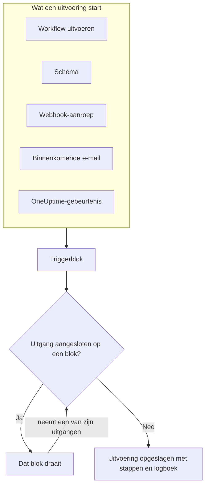
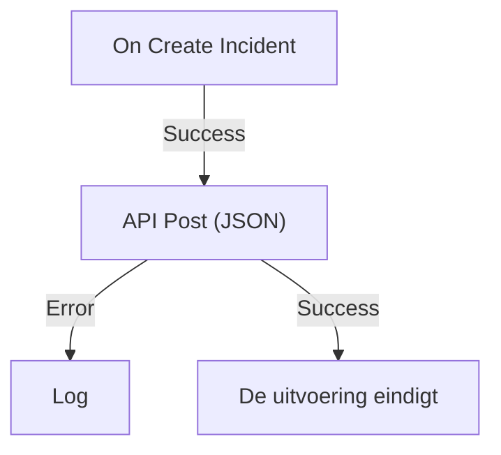

# Workflows – Overzicht

Met workflows automatiseer je werk in OneUptime zonder code. Je zet blokken op een canvas, verbindt ze, en de workflow draait vanzelf zodra de trigger afgaat: er wordt een incident aangemaakt, een schema is aan de beurt, een andere tool roept een URL aan of er komt een e-mail binnen. Gebruik ze om OneUptime aan de rest van je stack te koppelen en om routinematige opvolging af te handelen terwijl jij aan het probleem zelf werkt.

:::cards
- [Een workflow maken](/docs/workflows/authoring): Maak een workflow en voeg daarna blokken toe op het canvas, verbind ze en stel ze in.
- [Triggers](/docs/workflows/triggers): Start een workflow handmatig, volgens een schema, via een webhook, een e-mail of een OneUptime-gebeurtenis.
- [Componenten](/docs/workflows/components): Elk blok dat je kunt toevoegen, van API-aanroepen tot OneUptime-records.
- [Uitvoeringen](/docs/workflows/runs-and-logs): Zie wat elke uitvoering deed, stap voor stap.
:::

## Hoe een workflow werkt

Elke workflow heeft drie onderdelen:

1. **Een trigger** — wat de workflow start: een handmatige uitvoering, een schema, een webhook-aanroep, een binnenkomende e-mail of een gebeurtenis in OneUptime, zoals een nieuw incident. Elke workflow heeft er precies één.
2. **Componenten** — wat de workflow doet: een bericht sturen, een API aanroepen, een voorwaarde controleren, een OneUptime-record aanmaken of bijwerken.
3. **Verbindingen** — de lijnen die je van het ene blok naar het volgende trekt. Ze bepalen wat na wat draait.

Als de trigger afgaat, start OneUptime een **uitvoering**. Elk blok eindigt door een van zijn uitgangen te nemen, zoals **Success** of **Error**, **Yes** of **No**, en alleen de blokken die op die uitgang zijn aangesloten draaien daarna. Is er geen blok aangesloten op de uitgang die een blok nam, dan eindigt dat pad. De uitvoering wordt opgeslagen met haar status, het pad dat ze volgde en wat elk blok ontving en teruggaf.



Je bouwt dit allemaal visueel, op een canvas. De meeste workflows hebben helemaal geen code nodig; als er toch code nodig is, draait een **Run Custom JavaScript**-blok een paar regels JavaScript.

## Wat je met workflows kunt doen

- **OneUptime koppelen aan je andere tools** — posten in Slack, Microsoft Teams, Discord, Telegram of IRC, Jira-tickets aanmaken of een verzoek sturen naar elke API in je stack.
- **Reageren op wat er in OneUptime gebeurt** — als er een incident wordt aangemaakt, het juiste kanaal informeren en automatisch een ticket openen.
- **Taken volgens een schema uitvoeren** — elke vijf minuten, elke nacht, elke maandagochtend.
- **Gegevens van buitenaf ontvangen** — andere systemen een workflow laten starten door de URL ervan aan te roepen of naar het adres ervan te mailen.
- **Veelgebruikte automatisering hergebruiken** — één keer bouwen en vanuit elke andere workflow starten met een **Execute Workflow**-blok.

## Belangrijke begrippen

| Begrip                 | Wat het betekent                                                                                                   |
| ---------------------- | ------------------------------------------------------------------------------------------------------------------ |
| **Workflow**           | De hele automatisering: een naam, een canvas met blokken en een schakelaar om haar aan of uit te zetten.            |
| **Trigger**            | Het eerste blok. Het bepaalt wanneer de workflow draait. Elke workflow heeft er precies één.                       |
| **Component**          | Elk ander blok: het stuurt een bericht, doet een verzoek, controleert een voorwaarde of wijzigt een record.        |
| **Uitgang**            | Een punt onderaan een blok, zoals **Success** of **Error**. Lijnen vanuit dat punt leiden naar de volgende blokken. |
| **Uitvoering**         | Eén keer dat de workflow draait, opgeslagen met status, tijdstempels en wat elk blok deed.                         |
| **Globale variabele**  | Een waarde, zoals een API-sleutel, die je één keer opslaat en in elke workflow van het project gebruikt.           |

## Voordat je begint

- **Een abonnement met workflows.** In OneUptime Cloud hebben workflows het abonnement **Growth** of hoger nodig, en elk abonnement staat een aantal uitvoeringen per 30 dagen toe — zie [Planlimieten](/docs/workflows/configuration#planlimieten). Zelf gehoste installaties zonder facturering hebben geen van beide limieten.
- **Toestemming om te bouwen.** Workflows maken en wijzigen vereist **Workflow Admin**, **Project Admin** of **Project Owner**, of een aangepaste rol met de bijbehorende machtigingen. Een **Workflow Member** kan workflows openen en handmatig uitvoeren, maar niet wijzigen. Zie [Machtigingen](/docs/workflows/configuration#machtigingen).

## Waar je workflows vindt in OneUptime

Open **Producten** in de bovenbalk en kies **Workflows**, onder **Dashboards & automatisering**. Het menu bevat:

- **Workflows** — je lijst met workflows. Maak een nieuwe aan of open een bestaande.
- **Globale variabelen** — waarden die al je workflows delen.
- **Logboeken → Uitvoeringen** — de uitvoeringsgeschiedenis van alle workflows in je project.
- **Instellingen → Labelregels** en **Eigenaarsregels** — nieuwe workflows automatisch labelen en eigenaren toewijzen.
- **Geavanceerd → Gearchiveerd** — workflows die je hebt gearchiveerd. Ze draaien nooit en staan niet in de lijst; haal ze hier uit het archief. Zie [Een workflow archiveren](/docs/workflows/configuration#een-workflow-archiveren).
- **Ontwikkelaars** — hoe je workflows beheert met Terraform, de API of een AI-assistent.

Open één workflow, en het eigen menu daarvan bevat:

- **Overzicht** — naam, beschrijving, labels en de schakelaar **Ingeschakeld**.
- **Bouwer** — het canvas waarop je de workflow ontwerpt, met de schakelaar **Ingeschakeld** bovenaan.
- **Workflow-variabelen** — waarden die alleen voor deze ene workflow gelden.
- **Logboeken → Uitvoeringen** — elke uitvoering van deze workflow, met details.
- **Eigenaren** — de mensen en teams die verantwoordelijk zijn voor de workflow.
- **Ontwikkelaars** — hoe je deze workflow beheert met Terraform, de API of een AI-assistent.
- **Instellingen** — dupliceren, exporteren en archiveren.

**Instellingen** staat in de sectie **Geavanceerd** van het menu, samen met **Auditlogboeken** en **Workflow verwijderen**. **Geavanceerd** en **Ontwikkelaars** zijn eerst ingeklapt, in dit menu en in elk ander menu, zodat de pagina's die je dagelijks gebruikt vooraan staan. Klik op de naam van een sectie om de pagina's ervan te tonen. Ze klapt vanzelf open als je op een van die pagina's bent.

## Je eerste workflow bouwen

Elke workflow komt op dezelfde manier tot stand:

:::steps
1. **Maken** — kies een startpunt en geef je workflow daarna een naam. Zie [Een workflow maken](/docs/workflows/authoring).
2. **Een trigger kiezen** — handmatig, volgens schema, webhook, binnenkomende e-mail of een gebeurtenis uit OneUptime. Zie [Triggers](/docs/workflows/triggers).
3. **Componenten toevoegen** — zet acties op het canvas en verbind ze. Zie [Componenten](/docs/workflows/components).
4. **Inschakelen** — zet **Ingeschakeld** aan bovenaan de **Bouwer**. Een uitgeschakelde workflow kan helemaal niet draaien, ook niet handmatig.
5. **Testen** — klik op **Workflow uitvoeren** in de **Bouwer** en volg de uitvoering terwijl die gebeurt.
:::

Het voorbeeld hieronder doorloopt deze stappen voor een echte workflow.

## Voorbeeld: nieuwe incidenten naar een webhook sturen

Deze workflow stuurt een JSON-samenvatting van elk nieuw incident naar een URL van jou — een ticketsysteem, een datawarehouse, alles wat een webhook accepteert — en schrijft de reden in het logboek van de uitvoering als het verzoek mislukt.



> [!TIP]
> Het sjabloon **Forward new incidents to another system** bouwt dezelfde workflow voor je. Je vindt het onder **Incidenten** als je een workflow maakt.

:::steps
### De workflow maken

Open **Workflows** en klik op **Workflow maken**. Klik op **Vanaf nul beginnen**, noem de workflow `Send new incidents to a webhook` en klik op **Workflow maken**.

De nieuwe workflow opent in de **Bouwer**, uitgeschakeld.

### De trigger toevoegen

Klik op het gestippelde blok **Choose what starts this workflow** en klik daarna op **On Create Incident** onder **Popular** in het paneel **Add Trigger**.

De trigger neemt de plaats van het gestippelde blok in. De ID erop, `incident-on-create-1`, is hoe latere blokken ernaar verwijzen.

### De velden van het incident kiezen

Klik op de trigger. Vink onder **Select Fields** de velden aan die het verzoek moet meesturen, zoals de titel en de beschrijving, en klik op **Opslaan**.

De trigger geeft het nieuwe incident met deze velden door. Een veld dat je niet selecteert, komt leeg aan.

### Het API-blok toevoegen

Klik op **Component toevoegen** en daarna op **API Post (JSON)** onder **Popular**. Sleep van het punt **Success** van de trigger naar beneden naar het bovenste punt van het nieuwe blok.

### Het verzoek invullen

Klik op het API-blok, waarop **Click to set up** staat. Zet je endpoint in **URL**. Schrijf in **Request Body** de JSON die verstuurd moet worden, gebruik **{ }** om de velden van het incident in te voegen waar je ze nodig hebt, en klik op **Opslaan**.

```json title="Request Body"
{
  "id": "{{local.components.incident-on-create-1.returnValues.model._id}}",
  "title": "{{local.components.incident-on-create-1.returnValues.model.title}}",
  "description": "{{local.components.incident-on-create-1.returnValues.model.description}}"
}
```

Elke `{{…}}`-verwijzing wordt vervangen door de waarde van het incident als de workflow draait. Zie [Variabelen](/docs/workflows/variables) voor de syntaxis.

### Fouten opvangen

Klik op **Component toevoegen** en daarna op **Logboek**. Sluit het punt **Error** van het API-blok erop aan en stel de **Value** van het Log-blok in op `Could not send the incident: {{local.components.api-post-1.returnValues.error}}`.

Een verzoek dat mislukt — een onbereikbare URL of een antwoord dat geen 2xx is — volgt nu dit pad, en het logboek van de uitvoering zegt waarom.

### Inschakelen

Zet **Ingeschakeld** aan bovenaan de **Bouwer**.

### Testen

Klik op **Workflow uitvoeren**, vul de **Incident-ID** in van een incident in dit project, klik op **Run Workflow Manually** en bevestig met **Run**.

Er opent een paneel **Workflow-uitvoering** dat de uitvoering volgt. Open de stap **API Post (JSON)** om de body te zien die is verstuurd en het antwoord dat terugkwam.
:::

Vanaf nu start elk nieuw incident in het project een uitvoering. Je vindt ze allemaal onder de [Uitvoeringen](/docs/workflows/runs-and-logs) van de workflow.

> [!NOTE]
> Het verzoek gaat vanuit OneUptime de deur uit. In OneUptime Cloud moet de URL bereikbaar zijn vanaf internet. Een zelf gehoste installatie weigert privénetwerkadressen, tenzij een beheerder ze toestaat — zie [Uitgaande netwerktoegang](/docs/workflows/configuration#uitgaande-netwerktoegang).

## Hoe workflows passen bij de rest van OneUptime

- **Monitoren** zien het probleem. **Incidenten** en **waarschuwingen** leggen het vast. **Workflows** reageren erop.
- **Runbooks** zijn responsprocedures die je team doorloopt bij een incident, een waarschuwing of onderhoud: handmatige stappen, goedkeuringen en scripts, met mensen erbij. Workflows draaien zonder toezicht. Gebruik een [runbook](/docs/runbooks/index) als iemand onderweg beslissingen moet nemen, en een workflow als elke stap automatisch gaat.
- **Werkruimteverbindingen** koppelen een project aan Slack en Microsoft Teams voor incidentkanalen en meldingen. De Slack- en Microsoft Teams-blokken van workflows gebruiken die niet: elk blok post via een eigen incoming-webhook-URL.

## Volgende stappen

:::cards
- [Een workflow maken](/docs/workflows/authoring): Werk met het canvas, de blokken en hun instellingen.
- [Variabelen](/docs/workflows/variables): Geef gegevens door tussen blokken en houd geheimen buiten je workflows.
- [Configuratie en veiligheid](/docs/workflows/configuration): Machtigingen, limieten en beveiliging voordat je live gaat.
:::
