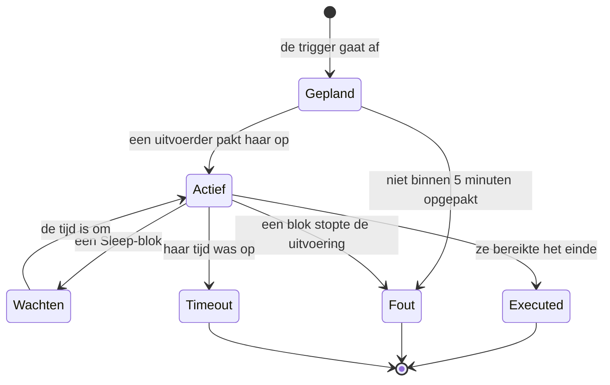

# Workflow-uitvoeringen

Elke keer dat een workflow draait, slaat OneUptime op wat er gebeurde — wanneer hij draaide, of het lukte en wat elk blok ontving en teruggaf. Dat verslag heet een **uitvoering**. Met uitvoeringen bevestig je dat een workflow werkte, spoor je fouten op in een workflow die niet werkte en kijk je terug op eerdere activiteit.

:::cards
- [Statussen van een uitvoering](#statussen-van-een-uitvoering): Wat Gepland, Wachten, Executed en de andere statussen betekenen.
- [Een uitvoering lezen](#een-uitvoering-lezen): Volg het pad dat een uitvoering nam, blok voor blok.
- [Problemen oplossen](#problemen-oplossen): Een workflow die niet draaide, een blok dat nooit draaide, een waarde die leeg binnenkwam.
:::

## Waar je ze vindt

| Pagina                                               | Wat je ziet                                                                                        |
| ---------------------------------------------------- | -------------------------------------------------------------------------------------------------- |
| **Workflows → Logboeken → Uitvoeringen**             | Elke uitvoering van elke workflow in het project. Filter op workflownaam, status en tijd.          |
| **Workflow → Logboeken → Uitvoeringen**              | Alleen de uitvoeringen van deze ene workflow. Deze heeft een filter **Uitvoerings-ID** in plaats van een workflowfilter. |
| **Eén uitvoering**                                   | Geopend met de knop **Logboeken bekijken** op een rij — de rijen zelf zijn niet klikbaar.          |

Als je een uitvoering vanuit de **Bouwer** start, opent dezelfde weergave **Workflow-uitvoering**, die de uitvoering al volgt, zodat je haar ziet gebeuren in plaats van haar achteraf te moeten zoeken.

## Statussen van een uitvoering

| Status                              | Wat het betekent                                                                                                                                                                                                                                                      |
| ----------------------------------- | --------------------------------------------------------------------------------------------------------------------------------------------------------------------------------------------------------------------------------------------------------------------- |
| **Gepland**                         | De trigger ging af en de uitvoering staat in de wachtrij voor een uitvoerder. Meestal een fractie van een seconde. Een uitvoering die na 5 minuten nog gepland is, mislukt: niets heeft haar opgepakt.                                                               |
| **Actief**                          | De workflow is bezig.                                                                                                                                                                                                                                                 |
| **Wachten**                         | De uitvoering staat geparkeerd op een **Sleep**-blok en gaat vanzelf verder. Tijdens het wachten bezet ze geen worker.                                                                                                                                              |
| **Executed**                        | De uitvoering bereikte het einde zonder te mislukken. Dit is de geslaagde status: het label zegt **Executed**, niet «Geslaagd».                                                                                                                                      |
| **Fout**                            | Een blok stopte de uitvoering. Wordt ook gebruikt als een uitvoering in de wachtrij nooit wordt opgepakt, als de hervatting van een slapende uitvoering verloren gaat, als een schema-expressie niet kan worden opgelost en als de workflow werd uitgezet of gearchiveerd terwijl de uitvoering op een **Sleep**-blok wachtte. |
| **Timeout**                         | De uitvoering duurde langer dan toegestaan: standaard 2 minuten. Zie [Hoe lang een run mag duren](/docs/workflows/configuration#hoe-lang-een-run-mag-duren).                                                                                                            |
| **Execution Exceeded Current Plan** | Het project heeft zijn workflow-uitvoeringen voor de laatste 30 dagen opgebruikt, of het abonnement is niet betaald. De uitvoering wordt vastgelegd maar niet uitgevoerd. Alleen OneUptime Cloud.                                                                   |

Een blok dat zijn uitgang **Error** neemt — een API-blok dat een 4xx kreeg, bijvoorbeeld — laat de uitvoering niet mislukken. De blokken die op **Error** zijn aangesloten draaien, en de uitvoering eindigt toch als **Executed**. De stap zelf wordt rood getekend, zodat je hem vindt.

## Een uitvoering lezen

Klik op **Logboeken bekijken** bij een uitvoering om haar te openen. De weergave **Workflow-uitvoering** heeft twee tabbladen, **Stappen** en **Full Log**.

### Het tabblad Stappen

Het pad dat de uitvoering nam, met één genummerde kaart per blok, in de volgorde waarin ze draaiden. Zonder iets te openen toont elke kaart:

- De titel en de ID van het blok, of het **Geslaagd** of **Mislukt** is, en hoe lang het duurde.
- Welke uitgang het nam, met de naam die het canvas eraan geeft, en waar die naartoe leidde: het nummer en de naam van de volgende stap, of een notitie dat er niets op is aangesloten, zodat de uitvoering of die tak daar eindigde. Een stap waar ze naartoe leidde maar die nooit draaide, zegt **(did not run)**. De uitgang Error wordt rood getekend; Yes en No zijn gewoon de weg die de uitvoering ging. Houd de muis boven de naam van de uitgang om te zien wat die betekent.
- De fout van de stap, als die mislukte, en eventuele waarschuwingen erover — bijvoorbeeld een `{{…}}`-verwijzing die tot niets werd opgelost.

Open een kaart voor twee blokken met details:

| Blok         | Wat het toont                                                                                                                                                                                                   |
| ------------ | --------------------------------------------------------------------------------------------------------------------------------------------------------------------------------------------------------------- |
| **Received** | De instellingen die het blok kreeg, op naam en in de volgorde van zijn instellingenlijst, nadat alle variabelen waren ingevuld. Een instelling die naar een andere stap of een variabele verwijst, toont de verwijzing naast de waarde die ze werd, en **Did not resolve** als ze niets werd. |
| **Returned** | Wat het opleverde, met de ID van elke waarde (het laatste deel van een `returnValues`-verwijzing). Lijsten en objecten worden ingesprongen getoond.                                                             |

Mislukte stappen, stappen met een waarschuwing en de enige stap van een uitvoering staan meteen open. De teller van het tabblad **Stappen** wordt rood als er iets mislukte en oranje als een stap een waarschuwing heeft.

Een paar uitvoeringen lezen anders:

- **Een test van één stap.** Een uitvoering die met **Run just this step** is gestart, zegt bovenaan **Only this step ran**. De stappen ervoor draaiden niet, dus waarden die ze daaruit leest ontbreken (verwacht daarvoor een waarschuwing **Did not resolve**), en de stappen erna zeggen **(not run in this test)**. Gebruik **Workflow uitvoeren** om het hele pad te proberen.
- **Een uitvoering die tussen stappen stopte.** Stopte de uitvoering om een reden die geen enkele stap verklaart — haar tijd liep tussen twee stappen af, of ze mislukte vóór haar eerste stap —, dan eindigt het pad met **The run stopped here** en de reden.
- **Een slapende uitvoering.** Een uitvoering die op een **Sleep**-blok wacht, eindigt met **Sleeping** en het moment waarop ze vanzelf verdergaat; de stappen na de Sleep zeggen **(not run yet)**.

De ID onder de titel van elke stap is precies wat er in een `{{local.components.<id>.returnValues.…}}`-verwijzing komt, wat dit de snelste manier maakt om een verwijzing goed te krijgen.

De getoonde waarden zijn wat het blok ontving, nadat de variabelen waren ingevuld en voordat het blok er iets mee deed, met twee uitzonderingen: geheimen en velden die het blok als gevoelig markeert, worden afgeschermd, en een waarde langer dan 4.000 tekens wordt ingekort met "… (truncated)". Een uitvoering bewaart haar laatste 100 stappen; een lange of vaak hervatte uitvoering toont een oranje notitie waar de eerdere zijn weggevallen. Uitvoeringen die zijn vastgelegd voordat de namen van uitgangen werden bewaard, tonen de uitgang met haar ID, zonder waar ze naartoe leidde.

### Het tabblad Full Log

Het ruwe logboek, regel voor regel, dat de uitvoerder schreef, inclusief alles wat de blokken zelf logden, zoals de waarde van een **Log**-blok of de `console.log` van een script. Gebruik het als het tabblad Stappen de fout niet verklaart.

## Een uitvoering kopiëren en downloaden

Bovenaan de weergave **Workflow-uitvoering**, naast de sluitknop, zet **Logboek kopiëren** het hele **Full Log** op je klembord, klaar om in een chat of een ticket te plakken. **Downloaden** slaat de uitvoering op als bestand:

| Download                                | Wat je krijgt                                                                                                                                                                                                                          |
| --------------------------------------- | -------------------------------------------------------------------------------------------------------------------------------------------------------------------------------------------------------------------------------------- |
| **Logboek downloaden**                  | Een `.txt`-bestand met het volledige logboek, precies zoals de uitvoerder het schreef, hoe lang ook, onder een korte kop: de naam en de ID van de workflow, de ID van de uitvoering, de status en wanneer ze was gepland, startte en eindigde. |
| **Uitvoering downloaden als JSON**      | Een `.json`-bestand met dezelfde feiten als gegevens, de stappen die het tabblad **Stappen** toont (wat elke stap ontving en teruggaf, en welke uitgang hij nam) en het logboek als lijst met regels. De stappen hebben dezelfde vorm waarin de API de `stepTrace` van een uitvoering teruggeeft en zijn, net als in het tabblad **Stappen**, de laatste 100 van de uitvoering. Het logboek is altijd volledig. |

Dezelfde twee downloads staan in het menu **⋯** van elke uitvoering in beide lijsten met uitvoeringen, zodat je een uitvoering kunt opslaan zonder haar te openen. Een uitvoering die je vanuit de **Bouwer** startte, kun je kopiëren of downloaden terwijl ze nog bezig is; je krijgt wat ze tot dan toe heeft gelogd.

Bestanden krijgen de naam van de workflow, de uitvoering en wanneer die startte, in UTC, zodat een map ermee sorteert op workflow en daarna op tijd: `nightly-sync-run-<run id>-2026-09-30T10-00-01.txt`.

Een download bevat niets wat je niet al in de uitvoering kon lezen. Geheimen en velden die een blok als gevoelig markeert, worden afgeschermd als de uitvoering wordt vastgelegd, dus ook in het bestand, en iedereen die een uitvoering kan openen, kan haar downloaden.

## Problemen oplossen

:::details Mijn workflow draaide niet
1. Controleer of de workflow **Ingeschakeld** is: de schakelaar staat bovenaan de **Bouwer**, die boven het canvas zegt dat de workflow uit staat als dat zo is. Nieuwe workflows beginnen uitgeschakeld, en een uitgeschakelde workflow weigert elke uitvoering — ook handmatige. Een webhook-aanroep ervan krijgt HTTP 400 met een melding die zegt hoe je hem inschakelt.
2. Controleer bij een OneUptime-gebeurtenistrigger of de gebeurtenis echt plaatsvond: open het record en bekijk de geschiedenis ervan. Een **On Update**-trigger met **Listen on** gaat alleen af als een van die velden veranderde.
3. Controleer bij een webhook-trigger of het andere systeem naar de juiste URL stuurt. De meeste tools loggen wanneer ze een webhook versturen — kijk daar.
4. Controleer bij een schematrigger of de cron-expressie overeenkomt met de tijd die je verwacht. Schema's draaien in UTC.

Verschijnt de uitvoering wel, met de status **Execution Exceeded Current Plan**, dan heeft het project al zijn workflow-uitvoeringen van de laatste 30 dagen gebruikt, of is het abonnement niet betaald. Het logboek van de uitvoering noemt het aantal en de limiet van je abonnement. Dit geldt alleen voor OneUptime Cloud.
:::

:::details Een later blok draaide nooit
Een blok dat niet draait, is meestal een aansluitprobleem. Open de **Bouwer** en controleer:

- Is de uitgang van het eerdere blok aangesloten op de ingang van dit blok?
- Nam het eerdere blok een andere uitgang dan je verwachtte — **Error** in plaats van **Success**, of **No** in plaats van **Yes**? Het tabblad **Stappen** zegt welke uitgang het nam en waar die naartoe leidde, of dat er niets op is aangesloten.
:::

:::details Een waarde kwam leeg binnen, of als {{…}}-tekst
Open de uitvoering en bekijk de stap. Een verwijzing die niet werd opgelost, wordt bij de stap zelf als waarschuwing gemeld, en de instelling ervan in het blok **Received** is gemarkeerd als **Did not resolve**.

- Zie je de letterlijke tekst `{{local.components.…}}`, dan werd de verwijzing niet opgelost. Meestal is dat een typfout in de component-ID of de ID van de retourwaarde — onthoud dat het de **Identifier** van het blok is, niet de naam die erop staat. Controleer ook de spelling van `local.components` zelf: `{{local.componets.api-get-1.returnValues.response-body}}` wordt als letterlijke tekst verstuurd en de uitvoering meldt nog steeds **Executed**. Was de uitvoering een test met **Run just this step**, dan draaide het eerdere blok helemaal niet — voer in plaats daarvan de hele workflow uit.
- Zie je **Empty text**, dan draaide het eerdere blok wel maar leverde het dat veld niet op.

Dezelfde waarschuwing staat in het tabblad **Full Log**, op een regel die begint met `Warning:`.
:::

:::details Het werkt als ik het handmatig uitvoer, maar niet vanuit de trigger
Open de **Bouwer**, klik op **Workflow uitvoeren** en vul de velden van de trigger met waarden die lijken op wat de echte trigger stuurt. Vergelijk daarna de waarden onder **Received** van die uitvoering naast elkaar met die van de echte uitvoering. Het verschil zit meestal in de naam of het type van één veld.
:::

## Een workflow opnieuw uitvoeren

Er is geen knop «deze uitvoering opnieuw proberen». Oude uitvoeringen worden nooit automatisch opnieuw gedaan, omdat hun neveneffecten — Slack-berichten, API-aanroepen, tickets — misschien niet veilig te herhalen zijn. Om het werk opnieuw te doen, repareer je de workflow en laat je de volgende echte trigger hem starten, of open je de **Bouwer** en klik je op **Workflow uitvoeren** met dezelfde waarden.

## Hoe lang worden uitvoeringen bewaard?

In OneUptime Cloud worden uitvoeringen **30 dagen** bewaard en daarna verwijderd — daarom zeggen beide lijsten met uitvoeringen dat ze de laatste 30 dagen beslaan. Zelf gehoste installaties bewaren uitvoeringen totdat je ze verwijdert; draait een workflow heel vaak en vervuilt hij je geschiedenis, zet hem dan uit of verwijder hem.

Uitvoeringen die zijn vastgelegd voordat het volgen van stappen bestond, hebben geen inhoud onder **Stappen** en tonen alleen hun **Full Log**.

## Volgende stappen

:::cards
- [Configuratie en veiligheid](/docs/workflows/configuration): Tijdslimieten, planlimieten en wat er in logboeken wordt afgeschermd.
- [Variabelen](/docs/workflows/variables): De syntaxis van de verwijzingen die je blokken gebruiken.
- [Componenten](/docs/workflows/components): Wat elk blok teruggeeft en wanneer het welke uitgang neemt.
:::
