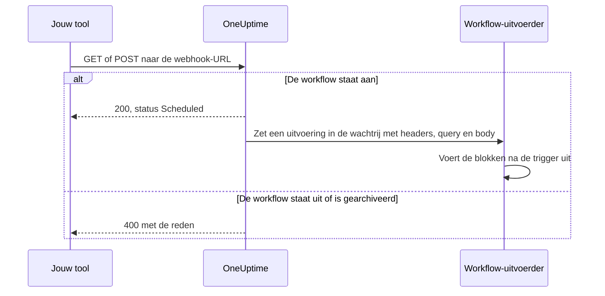
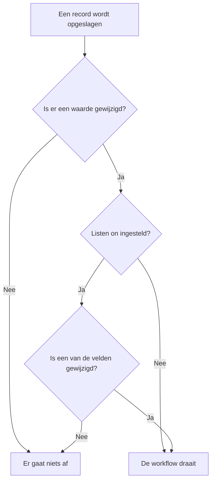

# Workflow-triggers

Een trigger is het eerste blok van een workflow: hij bepaalt wanneer de workflow draait. Elke workflow heeft precies één trigger. Je kiest uit vijf soorten.

:::cards
- [Handmatig](#manual): Start de workflow vanuit de Bouwer, of vanuit een andere workflow.
- [Schema](#schedule): Laat hem draaien volgens een terugkerend schema, geschreven als cron-expressie.
- [Webhook](#webhook): Laat een ander systeem hem starten door een URL aan te roepen.
- [Binnenkomende e-mail](#incoming-email): Start hem met elke e-mail die naar zijn eigen adres wordt gestuurd.
- [OneUptime-gebeurtenistriggers](#oneuptime-gebeurtenistriggers): Reageer als een record wordt aangemaakt, bijgewerkt of verwijderd.
:::

Om de trigger toe te voegen klik je op het gestippelde blok **Choose what starts this workflow** op het canvas van een nieuwe workflow. Om hem te wijzigen verwijder je het triggerblok, en het gestippelde blok komt terug. Zie [Een workflow maken](/docs/workflows/authoring#blokken-toevoegen).

## Welke trigger moet ik gebruiken?

| Als je wilt…                                   | Kies                        |
| ---------------------------------------------- | --------------------------- |
| Op een knop klikken om de workflow uit te voeren | **Manual**                |
| Volgens een terugkerend schema draaien         | **Schema**                  |
| Een ander systeem gegevens laten aanleveren    | **Webhook**                 |
| Starten vanuit een e-mail                      | **Incoming Email**          |
| Reageren op iets binnen OneUptime              | **OneUptime-gebeurtenis**   |

Een workflow kan maar één trigger hebben. Heb je twee manieren nodig om dezelfde automatisering te starten, bouw de gedeelde logica dan in een workflow met een **Manual**-trigger en start die vanuit twee lichte «omhulsel»-workflows met een **Execute Workflow**-blok.

## Manual

Voer de workflow uit wanneer je wilt: klik op **Workflow uitvoeren** op de pagina **Bouwer**, vul de **JSON** van de trigger in, klik op **Run Workflow Manually** en bevestig met **Run**. Een andere workflow kan hem ook starten, met een **Execute Workflow**-blok.

Handig voor: automatiseringen met één klik waarvoor je een knop wilt, zoals «deze sleutel vervangen» of «een testwaarschuwing sturen», en logica die je tussen workflows deelt.

**Returns**: **JSON** — waarmee de uitvoering is gestart.

- Vanuit **Workflow uitvoeren** is het de JSON die je typte, als tekst. Om één veld ervan te lezen, stuur je hem eerst door een **Text to JSON**-blok.
- Vanuit een **Execute Workflow**-blok is elke sleutel van de **Arguments** van het blok een eigen waarde. Met `{"customerId": "42"}` leest een later blok `{{local.components.manual-1.returnValues.customerId}}`, waarbij `manual-1` de ID van de Manual-trigger is.

## Schedule

Laat de workflow draaien volgens een terugkerend schema. Stel in **Schedule at** in hoe vaak: kies een van de **Common schedules**, schrijf een **Custom cron**-expressie of kies een **Variabele** die er een bevat. Onder het veld wordt het schema in woorden uitgelegd, met de **Next runs**.

Handig voor: nachtelijke opschoning, synchronisatie per uur, wekelijkse rapporten.

Tijden zijn in UTC, dus reken om vanuit je eigen tijdzone als je het uur kiest. De vijf delen van een cron-expressie zijn de minuut, het uur, de dag van de maand, de maand en de dag van de week:

| Expressie     | Draait                                 |
| ------------- | -------------------------------------- |
| `*/5 * * * *` | Elke 5 minuten.                        |
| `0 * * * *`   | Elk uur, op het hele uur.              |
| `0 0 * * *`   | Elke dag om middernacht UTC.           |
| `0 9 * * 1-5` | Elke werkdag om 9:00 UTC.              |
| `0 9 * * 1`   | Elke maandag om 9:00 UTC.              |

Zolang de workflow uit staat, wordt er niets ingepland. Een schema met **Variabele** leest een workflow- of globale variabele, zoals `{{local.variables.schedule}}`. Levert die geen geldige cron-expressie op, dan wordt de workflow niet ingepland, en een mislukte uitvoering in zijn lijst met uitvoeringen zegt waarom.

Om de workflow te testen zonder op het schema te wachten, klik je op **Workflow uitvoeren** in de **Bouwer**: dat start meteen een uitvoering.

## Webhook

OneUptime geeft de workflow een eigen URL. Alles wat die URL aanroept, start de workflow en geeft de headers, de queryparameters en de body van het verzoek door.

Handig voor: gegevens van een andere tool in OneUptime ontvangen — CI/CD-callbacks, waarschuwingen van andere monitoring, aanmeldingen in je CRM.

Om de URL te krijgen, klik je op de Webhook-trigger op het canvas. De URL staat bovenaan de instellingen, met een knop **URL kopiëren**, de methoden die hij accepteert en een `curl`-opdracht die je in een terminal kunt plakken om het te proberen:

```bash
curl -X POST "https://oneuptime.example.com/workflow/trigger/<secret key>" \
  -H "Content-Type: application/json" \
  -d '{"message": "Hello"}'
```

De URL accepteert zowel `GET` als `POST`. De aanroeper krijgt een snelle bevestiging, `{"status": "Scheduled"}` — de workflow zelf draait op de achtergrond, dus de aanroeper ziet nooit wat hij doet. Een aanroep van een workflow die uit staat of gearchiveerd is, wordt geweigerd met HTTP 400 en de reden.



**Returns**:

| Waarde                   | Wat erin zit                                                                                                          |
| ------------------------ | --------------------------------------------------------------------------------------------------------------------- |
| **Request Headers**      | Elke header van het verzoek, op naam in kleine letters, zoals `content-type`.                                         |
| **Request Query Params** | De queryparameters in de URL, op naam.                                                                                |
| **Request Body**         | De body die de aanroeper stuurde. Een JSON-body, verstuurd met `Content-Type: application/json`, kun je veld voor veld lezen. |

Lees één veld door de naam ervan aan de verwijzing toe te voegen, zoals in `{{local.components.webhook-1.returnValues.request-body.message}}`.

Zodra er een verzoek is binnengekomen, weet de waardekiezer in elk blok na de trigger wat erin zat: hij toont de velden van de body, de headers en de queryparameters, elk met de inhoud, zodat je `incident.title` kiest in plaats van een pad te typen. Tot die tijd zegt hij dat er nog geen verzoek is binnengekomen en biedt hij **Copy test request** aan, een `curl`-opdracht voor de URL; de velden verschijnen zodra de uitvoering die dat verzoek start klaar is. Zie [Waarden uit eerdere blokken gebruiken](/docs/workflows/authoring#waarden-uit-eerdere-blokken-gebruiken).

Om de workflow zonder de andere tool te testen, klik je op **Workflow uitvoeren** in de **Bouwer** en typ je headers, queryparameters en een body in.

### Houd de URL geheim

Het laatste deel van de URL is de geheime sleutel van de workflow, en iedereen met de URL kan de workflow starten. Daarom is de sleutel verborgen totdat je op **Tonen** klikt, en kopieert **URL kopiëren** de hele URL zonder hem te tonen.

Lekt de URL uit, klik dan op dezelfde plek op **URL opnieuw instellen**: de workflow krijgt een nieuwe URL en de oude werkt meteen niet meer, dus werk alles bij wat hem aanroept. Alleen mensen die de workflow mogen bewerken, kunnen de URL zien of opnieuw instellen — zie [Webhookbeveiliging](/docs/workflows/configuration#webhookbeveiliging).

> [!WARNING]
> Behandel de URL als een wachtwoord. Iedereen die hem heeft, kan je workflow starten, zonder in te loggen.

## Incoming Email

OneUptime geeft de workflow een eigen e-mailadres. Elke e-mail naar dat adres start de workflow en geeft de e-mail door: wie hem stuurde, voor wie hij was, het onderwerp, de tekst en de HTML, de headers en de namen van eventuele bijlagen.

Handig voor: handelen op e-mail van systemen die geen webhook kunnen aanroepen — waarschuwingen van oudere monitoringtools, statusmeldingen van een leverancier, het rapport dat een nachtelijke taak mailt.

Om het adres te krijgen, klik je op de Incoming Email-trigger op het canvas. Het adres staat bovenaan de instellingen, met een knop **Adres kopiëren**. Geef het aan wat de workflow moet starten: een tool die alleen e-mail kan sturen, de meldingsinstellingen van een leverancier of een doorstuurregel in je eigen mailbox.

Elke e-mail start een eigen uitvoering. E-mail bereikt de workflow of het adres nu in Aan of CC staat, als bcc wordt meegestuurd of via een doorstuurregel binnenkomt. Een e-mail die het adres twee keer noemt, start één uitvoering.

**Returns**:

| Waarde          | Wat erin zit                                                                                            |
| --------------- | ------------------------------------------------------------------------------------------------------- |
| **From**        | Het adres van de afzender.                                                                              |
| **To**          | Iedereen aan wie de e-mail was gericht, op één regel, zoals `ops@example.com, oncall@example.com`.      |
| **CC**          | Iedereen die een kopie kreeg, op één regel.                                                             |
| **Subject**     | De onderwerpregel.                                                                                      |
| **Body**        | De platte tekst van de e-mail.                                                                          |
| **HTML Body**   | De HTML van de e-mail, als die er is. Body en HTML Body worden elk op 1 MB afgekapt.                     |
| **Headers**     | Elke header van de e-mail, op naam in kleine letters, zoals `message-id`.                               |
| **Attachments** | De naam, het type en de grootte van elk bijgevoegd bestand. De bestanden zelf worden niet bewaard.      |
| **Received At** | Wanneer OneUptime de e-mail ontving.                                                                    |

Zodra er een e-mail is binnengekomen, weet de waardekiezer in elk blok na de trigger wat erin zat: hij toont elke header en elke bijlage van de e-mail, met de inhoud, zodat je `headers.message-id` kiest in plaats van een pad te typen. Tot die tijd zegt hij dat er nog geen e-mail op het adres is binnengekomen. Zie [Waarden uit eerdere blokken gebruiken](/docs/workflows/authoring#waarden-uit-eerdere-blokken-gebruiken).

Om de workflow te proberen zonder een e-mail te sturen, klik je op **Workflow uitvoeren** op de pagina **Bouwer** en vul je een afzender, een onderwerp en een body in. De waarden die je weglaat, komen leeg aan.

E-mail start de workflow alleen zolang hij aan staat. E-mail naar een workflow die uit staat, wordt genegeerd, net als e-mail naar een workflow waarvan de trigger niet langer Incoming Email is.

### Houd het adres geheim

Het deel van het adres vóór de `@` bevat de geheime sleutel van de workflow, en iedereen met het adres kan de workflow starten. Daarom is de sleutel verborgen totdat je op **Tonen** klikt, en kopieert **Adres kopiëren** het hele adres zonder het te tonen.

Lekt het adres uit, klik dan op dezelfde plek op **Adres opnieuw instellen**: de workflow krijgt een nieuw adres, en e-mail naar het oude wordt vanaf dan genegeerd, dus geef het nieuwe aan alles wat de workflow mailt. Alleen mensen die de workflow mogen bewerken, kunnen het adres zien of opnieuw instellen — zie [Beveiliging van binnenkomende e-mail](/docs/workflows/configuration#beveiliging-van-binnenkomende-e-mail).

> [!WARNING]
> Iedereen kan elke willekeurige afzender op een e-mail zetten, dus **From** bewijst niet wie hem stuurde. Controleer iets wat alleen de echte afzender weet voordat een stap iets belangrijks doet.

> [!NOTE]
> Op een zelf gehoste installatie ontvangt OneUptime e-mail via een provider voor inkomende e-mail die je beheerder instelt — zie [SendGrid Inbound Email](/docs/self-hosted/sendgrid-inbound-email). Tot die tijd heeft de trigger geen adres, en de instellingen ervan zeggen dat.

## OneUptime-gebeurtenistriggers

Bijna alles in OneUptime — monitoren, incidenten, waarschuwingen, gepland onderhoud, statuspagina's, bereikbaarheidsbeleid, teams — kan een workflow starten. Elk biedt tot drie gebeurtenissen:

- **On Create** — gaat af als er een nieuwe wordt toegevoegd.
- **On Update** — gaat af als er een wordt gewijzigd. Een record opslaan met de waarden die het al heeft, zoals een formulier dat zonder wijzigingen wordt opgeslagen of een schakelaar die wordt verstuurd zoals hij al stond, is geen wijziging en laat hem niet afgaan.
- **On Delete** — gaat af als er een wordt verwijderd.

Zo bouw je «als X gebeurt in OneUptime, doe dan Y» zonder dingen in een lus te hoeven controleren.

**On Update** kun je beperken tot sommige velden met **Listen on**: hij gaat dan alleen af als een update een van die velden wijzigt, naar welke waarde ook — een schakelaar uitzetten of een veld leegmaken telt mee.



**On Create** en **On Update** geven het record door aan het volgende blok, met de velden die je in **Select Fields** van de trigger kiest. Zo geeft de trigger **Incident → On Create** het nieuwe incident door, zodat het volgende blok de titel, de beschrijving, de ernst of elk ander geselecteerd veld kan lezen, zoals `{{local.components.incident-on-create-1.returnValues.model.title}}`. Een veld dat je niet selecteerde, komt leeg aan.

**On Delete** geeft alleen de ID van het verwijderde record door: het record is weg als de workflow draait, dus de andere velden ervan kunnen niet worden gelezen.

Om een gebeurtenistrigger te testen zonder op de gebeurtenis te wachten, klik je op **Workflow uitvoeren** in de **Bouwer** en vul je de ID in van een bestaand record, zoals een **Incident-ID**. De uitvoering leest dat record met de velden die je selecteerde.

### Meest gebruikte gebeurtenissen

| Resource                                  | Wat teams ermee doen                                                                      |
| ----------------------------------------- | ----------------------------------------------------------------------------------------- |
| **Incident**                              | Reageren als een incident wordt gemeld, bijgewerkt (bevestigd, opgelost) of verwijderd.   |
| **Waarschuwing**                          | Dezelfde drie gebeurtenissen, voor waarschuwingen.                                        |
| **Monitor**                               | Reageren als een monitor wordt toegevoegd, bewerkt of verwijderd.                         |
| **Gepland Onderhoud Gebeurtenis**         | Een onderhoudsvenster automatisch aankondigen zodra het is ingepland.                     |
| **Statuspagina Abonnee**                  | Iemand verwelkomen die zich abonneert op een statuspagina.                                |
| **Bereikbaarheidsbeleid**                 | Beleidswijzigingen synchroniseren met een ander roostersysteem.                           |

In het paneel **Add Trigger** staan ze onder **OneUptime resources**: klik op de resource en daarna op de trigger. **Browse all resources** bevat ze allemaal, en het zoekveld vindt een trigger aan de hand van een paar woorden, zoals `incident created`.

## Volgende stappen

:::cards
- [Componenten](/docs/workflows/components): De acties die je na de trigger toevoegt.
- [Variabelen](/docs/workflows/variables): Lees in latere blokken wat de trigger doorgaf.
- [Uitvoeringen](/docs/workflows/runs-and-logs): Controleer of je trigger afging, en wat hij meebracht.
:::
