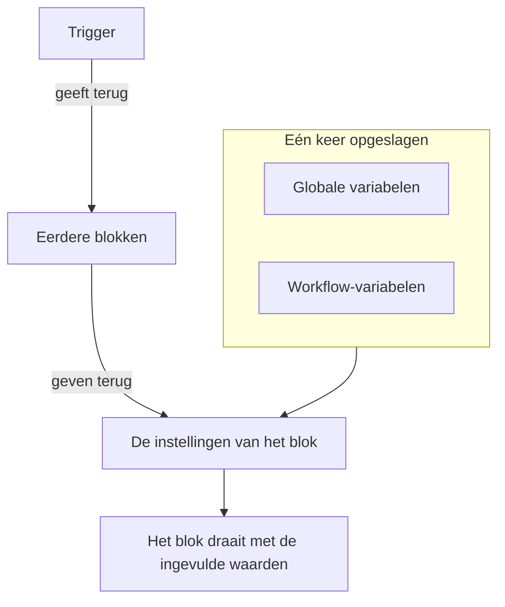
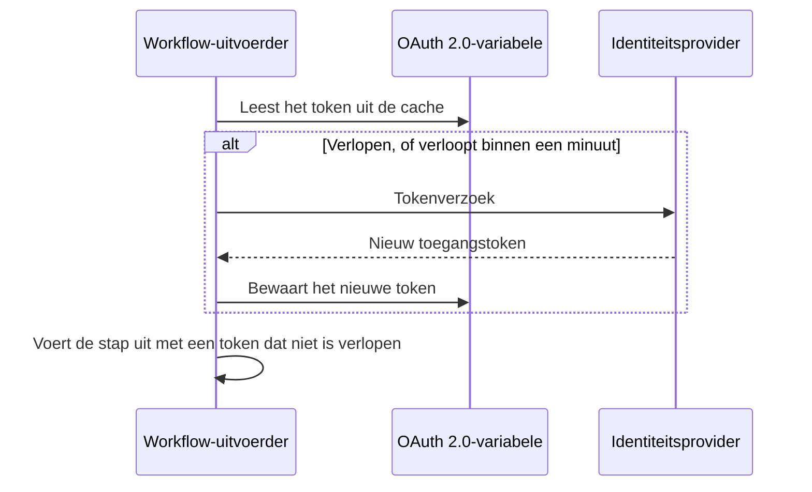

# Workflow-variabelen

Met variabelen bewegen gegevens door een workflow: van de trigger naar het eerste blok, van het ene blok naar het volgende, en van waarden die je één keer opslaat naar elk blok dat ze nodig heeft. De instelling van een blok leest een waarde met een verwijzing tussen dubbele accolades, en de uitvoerder vult die in vlak voordat het blok draait.

| Waarde                          | Waar ze vandaan komt                                             | Hoe een blok haar leest                               |
| ------------------------------- | ---------------------------------------------------------------- | ----------------------------------------------------- |
| **Globale variabele**           | Opgeslagen onder **Workflows → Globale variabelen**              | `{{global.variables.NAME}}`                          |
| **Workflow-variabele**          | Opgeslagen op de pagina **Workflow-variabelen** van één workflow | `{{local.variables.NAME}}`                           |
| **De waarde van een eerder blok** | Wat de trigger of een eerder blok in deze uitvoering teruggaf  | `{{local.components.BLOCK_ID.returnValues.VALUE_ID}}` |



Je typt zelden een verwijzing. Klik op **{ }** aan het eind van een instelling, of typ `{{` erin, en kies de waarde uit een lijst. Zie [Waarden uit eerdere blokken gebruiken](/docs/workflows/authoring#waarden-uit-eerdere-blokken-gebruiken).

## Globale variabelen

Waarden voor het hele project die je één keer opslaat en in elke workflow hergebruikt: API-sleutels, URL's, kanaalnamen — alles wat je niet in tien verschillende workflows wilt kopiëren.

:::steps
### Globale variabelen openen

Ga naar **Workflows → Globale variabelen** en klik op **Workflow Variabele aanmaken**.

### De variabele een naam geven

Vul bij de stap **Variabele** in:

- **Naam** — hoe je ernaar verwijst. Minstens twee tekens, geen spaties, en alleen letters, cijfers, koppeltekens en underscores. `UPPER_SNAKE_CASE` is een goede gewoonte, omdat het opvalt in je blokken.
- **Beschrijving** — optioneel, vrije tekst om je te herinneren waarvoor ze dient.

Klik op **Volgende**.

### Er een waarde aan geven

Vul bij de stap **Waarde** in:

- **Inhoud** — de waarde zelf. Het is een veld voor lange tekst, dus waarden over meerdere regels werken.
- **Geheim** — als dit aan staat, wordt de waarde weggepoetst uit de logboeken van uitvoeringen en de stappensporen.

Klik op **Workflow Variabele aanmaken**. Wil je daarvoor de naam of de beschrijving wijzigen, klik dan op **Variabele** in de lijst met stappen naast het formulier (zichtbaar op brede schermen); wat je in een van beide stappen typte, blijft bewaard.
:::

Gebruik een globale variabele in elke workflow met:

```text
{{global.variables.NAME}}
```

Heb je je PagerDuty-sleutel bijvoorbeeld opgeslagen als `PAGERDUTY_KEY`, dan kan elk blok die gebruiken als `{{global.variables.PAGERDUTY_KEY}}` — de editor slaat de verwijzing op, en de logging van de workflow poetst de opgeloste geheime waarde weg.

De lijst toont de naam en de beschrijving van elke variabele. Klik op **Bekijken** in een rij om de pagina van de variabele te openen. Die laat zien of de variabele statisch of OAuth 2.0 is, en daar doe je al het andere:

| Knop                                       | Wat hij doet                                                                                                                                     |
| ------------------------------------------ | ------------------------------------------------------------------------------------------------------------------------------------------------ |
| **Variabele bewerken**                     | Wijzigt de naam, de beschrijving en — bij een statische variabele die nog niet geheim is — de geheim-markering. Is een variabele eenmaal geheim, dan blijft ze geheim. |
| **Update Content**                         | Vervangt een statische waarde. De opgeslagen inhoud kan niet worden teruggelezen, dus je typt de nieuwe waarde helemaal.                         |
| **Use in Workflows**                       | Toont de exacte verwijzing om in je blokken te plakken, met een kopieerknop.                                                                     |
| **Workflow Variabele verwijderen**         | Verwijdert haar, nadat je hebt bevestigd. De bevestiging noemt de variabele, zodat je kunt controleren dat het de juiste is.                      |

Om in plaats daarvan een variabele voor een **OAuth 2.0-toegangstoken** te maken, open je het menu **Meer** (**⋯**) naast **Workflow Variabele aanmaken** en kies je **Create OAuth 2.0 Variable**. OAuth 2.0-variabelen hebben [een eigen sectie](#oauth-20-variabelen-tokens-die-zichzelf-vernieuwen) hieronder. Het type van een variabele kan na het opslaan niet meer worden gewijzigd.

Je kunt een variabele ook bijwerken via de API; dat wordt [aan het eind van deze pagina](#een-variabele-bijwerken-vanuit-een-workflow) uitgelegd. Globale variabelen en workflow-variabelen zijn een functie van het abonnement Growth.

## Lokale workflowvariabelen

Variabelen die bij één workflow horen, beheerd onder **Workflow-variabelen** in het menu van die workflow. Ze werken hetzelfde als globale variabelen: **Workflow Variabele aanmaken** maakt een statische variabele, het menu **Meer** (**⋯**) maakt een OAuth 2.0-variabele en **Bekijken** opent de pagina van een variabele. Verwijs ernaar met:

```text
{{local.variables.NAME}}
```

Gebruik er een voor een waarde die alleen die workflow nodig heeft, zoals de Slack-webhook-URL van een sjabloon. Sjablonen die om instellingen vragen, slaan die op als workflow-variabelen, zodat je ze later kunt wijzigen zonder de blokken te bewerken.

## OAuth 2.0-variabelen (tokens die zichzelf vernieuwen)

Een bearer-token dat in een statische variabele is geplakt, werkt tot het verloopt, meestal binnen het uur. Daarna mislukt elke uitvoering die het gebruikt met `401 Unauthorized` totdat iemand een nieuw token plakt. Een variabele voor een **OAuth 2.0-toegangstoken** slaat op wat de OAuth-tokenuitwisseling nodig heeft in plaats van het token zelf, en OneUptime houdt het token actueel.

Je gebruikt haar precies zoals elke andere variabele:

```http
Authorization: Bearer {{global.variables.CRM_API_TOKEN}}
```

### Hoe het token geldig blijft



- De eerste keer dat een workflow de variabele gebruikt, vraagt OneUptime een toegangstoken aan bij het tokenendpoint van je identiteitsprovider en bewaart het.
- Vóór elke stap die naar de variabele verwijst, controleert de uitvoerder het token. Is het verlopen, of verloopt het binnen de volgende minuut, dan wordt er een nieuw opgehaald voordat de stap draait. Het component krijgt altijd een token dat niet is verlopen, hoe lang de variabele ook ongebruikt bleef en hoe lang de uitvoering al loopt.
- Alleen stappen die echt naar de variabele verwijzen, zorgen voor een vernieuwing. Een uitvoering die een variabele nooit gebruikt, haalt het token ervan nooit op, en mislukt niet omdat die provider plat ligt.
- Als veel uitvoeringen op hetzelfde moment een nieuw token nodig hebben, haalt één ervan het op en gebruiken de andere dat.
- Zegt de provider niet wanneer een token verloopt (geen `expires_in`, en het token is geen JWT met een `exp`-claim), dan haalt OneUptime één keer per uitvoering een nieuw token op en deelt het tussen de stappen van die uitvoering.

### Granttypes

| Granttype                      | Gebruik het voor                                                                                                                                                                                                                                    |
| ------------------------------ | --------------------------------------------------------------------------------------------------------------------------------------------------------------------------------------------------------------------------------------------------- |
| **Client Credentials**         | OneUptime meldt zich aan als je applicatie. De gebruikelijke keuze voor server-naar-server-API's zoals Microsoft Graph, de API's van Auth0 of Okta, of een interne dienst achter Keycloak.                                                         |
| **Vernieuwingstoken**          | Gedelegeerde toegang namens een gebruiker. Autoriseer de applicatie één keer (bijvoorbeeld in de OAuth playground van je provider of met Postman) en plak het refresh token dat je krijgt. OneUptime wisselt het in voor toegangstokens, en slaat elk nieuw refresh token op als je provider ze roteert. Een publieke client zonder client-secret werkt ook. |

### Er een maken

**Create OAuth 2.0 Variable** vraagt één ding per stap:

1. **Variabele**: de naam waarmee workflows ernaar verwijzen, en een beschrijving.
2. **Provider**: kies je **Identiteitsprovider** en OneUptime vult de **Token-URL** ervan in:

   | Identiteitsprovider | Token-URL die wordt ingevuld |
   |---|---|
   | Microsoft Entra ID | `https://login.microsoftonline.com/{tenant-id}/oauth2/v2.0/token` |
   | Google | `https://oauth2.googleapis.com/token` |
   | Okta | `https://{your-domain}/oauth2/default/v1/token` |
   | Auth0 | `https://{your-domain}/oauth/token` |

   Vervang het deel tussen accolades door je eigen waarde, zoals je directory-ID (tenant) of je Okta-domein. Het formulier gaat niet verder zolang de URL er nog een bevat. Kies voor elke andere provider **Andere provider** en vul zelf het tokenendpoint in. Kies daarna het **Granttype**. Als je Google kiest, wordt **Vernieuwingstoken** geselecteerd, omdat de OAuth-clients van Google geen Client Credentials kunnen gebruiken. De provider vult alleen het formulier in; hij wordt niet met de variabele opgeslagen.
3. **Inloggegevens**: de **Client-ID** en het **Client-secret** van de applicatie die je bij de provider hebt geregistreerd en, voor het granttype Refresh Token, het **Vernieuwingstoken**. Een publieke client met het granttype Refresh Token mag het client-secret leeg laten.
4. **Geavanceerd**, allemaal optioneel:
   - **Bereik**: gescheiden door spaties. Laat het leeg om de standaard-scopes van de provider te krijgen. Voor Client Credentials heeft Microsoft Entra ID een scope nodig die eindigt op `/.default` (zoals `https://graph.microsoft.com/.default`) en heeft Okta een eigen scope nodig.
   - **Extra parameters**: extra formuliervelden voor het tokenverzoek, zoals `audience` voor Auth0 (nodig voor Client Credentials) of `resource` voor Azure AD v1. Iedereen die de variabele kan lezen, kan deze lezen, dus zet hier geen geheimen in.
   - **Clientauthenticatie**: of de client-ID en het secret in een HTTP Basic-header gaan (de standaard) of in de body van het verzoek. Antwoordt je provider `invalid_client`, probeer dan de andere optie.

Onder sommige velden voegt het formulier een regel hulp toe voor de provider die je koos, bijvoorbeeld waar Microsoft Entra ID je tenant-ID toont, en dat het client-secret daar de **Value** van het geheim is, niet de **Secret ID**.

Als je een nieuwe OAuth 2.0-variabele opslaat, haalt OneUptime meteen het eerste token op en vertelt je wat de provider antwoordde. Een typfout in het secret of de URL komt dan aan het licht, niet uren later in een mislukte uitvoering. Een token ophalen schrijft naar de variabele, dus daarvoor heb je toestemming nodig om workflow-variabelen te bewerken; kun je variabelen wel maken maar niet bewerken, dan haalt de eerste workflow-uitvoering die de variabele gebruikt het token op.

De pagina van de variabele (klik op **Bekijken** in de rij) heeft een kaart **OAuth 2.0 Settings**. **Instellingen bewerken** loopt door dezelfde stappen **Provider** (token-URL), **Inloggegevens** (client-ID) en **Geavanceerd** (scope, extra parameters, clientauthenticatie). **Volgende** gaat verder en **Wijzigingen opslaan** staat op de laatste stap. Elke stap is al ingevuld, dus de stappenlijst naast het formulier opent elke stap: wijzig een instelling op haar stap, open dan de laatste stap en sla op. Het granttype ligt vast zodra het is opgeslagen.

### De kaart Toegangstoken

De kaart **Toegangstoken** op de pagina van een OAuth 2.0-variabele toont een van deze statussen:

| Status                     | Wat het betekent                                                                                                                     |
| -------------------------- | ------------------------------------------------------------------------------------------------------------------------------------ |
| **Valid**                  | Het token in de cache is nog niet verlopen.                                                                                          |
| **Verlopen**               | Normaal voor een variabele die geen workflow onlangs heeft gebruikt. De volgende uitvoering die haar gebruikt, haalt een nieuw token op. |
| **Nog niet opgehaald**     | Er is geen token opgehaald sinds de variabele werd gemaakt of de instellingen werden gewijzigd.                                      |
| **No expiry reported**     | De provider zei niet wanneer het token verloopt, dus elke uitvoering haalt een nieuw token op.                                       |
| **Refresh failed**         | De laatste poging om een token op te halen mislukte. De reden van de provider staat er volledig, met het moment waarop het gebeurde. De volgende geslaagde vernieuwing wist het. |

**Nu vernieuwen**, onder de status, haalt meteen een nieuw token op. Gebruik het om nieuwe instellingen te controleren zonder een workflow uit te voeren. **Update Credentials**, op de kaart **OAuth 2.0 Settings**, vervangt het client-secret of het refresh token en haalt daarmee daarna een token op. Een instelling wijzigen (token-URL, client-ID, scope enzovoort) gooit het token in de cache weg, zodat de volgende uitvoering er een ophaalt met de nieuwe instellingen.

### Als de provider nee zegt

De stap die het token nodig had, mislukt voordat hij draait, en het logboek van de uitvoering noemt de variabele en citeert het antwoord van de provider, bijvoorbeeld `Could not get an OAuth 2.0 access token for {{global.variables.CRM_API_TOKEN}}: The token endpoint refused the request (HTTP 400): invalid_grant - Token has been expired or revoked.` Dezelfde reden staat op de kaart **Toegangstoken** van de variabele. `invalid_grant` bij een Refresh Token-variabele betekent bijna altijd dat het refresh token zelf is verlopen of ingetrokken, en **Update Credentials** is de oplossing.

Mislukt de vernieuwing terwijl het token in de cache nog niet echt is verlopen (het zat alleen binnen de marge van één minuut), dan gaat de stap door met het token uit de cache en zegt het logboek dat.

### Beveiliging

- OAuth 2.0-variabelen zijn altijd geheim. Het toegangstoken wordt vervangen door `[REDACTED]` in de logboeken van uitvoeringen en de stappensporen, ook een token dat halverwege een uitvoering is vervangen.
- Het client-secret, het refresh token en het toegangstoken zijn versleuteld in de database en kunnen nooit worden teruggelezen via de API of het dashboard. **Nu vernieuwen** meldt wanneer het nieuwe token verloopt, nooit het token.
- De token-URL moet `http` of `https` zijn. Verzoeken naar loopback-, link-local- en cloudmetadata-adressen worden geweigerd. In OneUptime Cloud worden ook privénetwerkadressen geweigerd. Zelf gehoste installaties kunnen een identiteitsprovider op hun eigen netwerk bereiken. OneUptime volgt geen omleidingen bij tokenverzoeken, dus richt de Token-URL op het adres waarop het endpoint echt antwoordt. Een tokenverzoek geeft het na 20 seconden op.

### Een bestaand statisch token omzetten naar OAuth 2.0

Het type van een variabele ligt vast zodra ze is opgeslagen. Verwijder de statische variabele en maak een OAuth 2.0-variabele met **dezelfde naam**. Workflows verwijzen naar variabelen op naam, dus ze pakken de nieuwe op zonder enige wijziging.

## Componentuitvoer (data uit eerdere blokken)

Elke trigger en elk component kan tijdens een uitvoering gegevens opleveren. Voeg een verwijzing in met de knop **{ }** in een instelling, of door `{{` erin te typen, in plaats van haar uit te typen — dat voegt de exacte ID's in die de uitvoerder verwacht, en toont de waarde als chip met de naam van het blok en de waarde.

Je kunt ook beginnen bij het blok dat de waarde oplevert: de instellingen ervan tonen elke uitvoer onder **Returns**, met de exacte verwijzing en een knop om die te kopiëren.

Verwijs zo naar de uitvoer van een eerder blok:

```text
{{local.components.COMPONENT_ID.returnValues.FIELD_ID}}
```

`COMPONENT_ID` is de **Identifier** van het blok — de korte ID op het blok, niet de naam die erop staat. Nieuwe blokken krijgen er een zoals `api-get-1`, en je kunt hem hernoemen in de sectie **ID** van het blok. Hernoemen breekt elke verwijzing die er al naar wijst, net als het hernoemen van een variabele. `FIELD_ID` is de ID van de waarde, en een pad erachter leest één veld van een JSON-waarde.

| Na een blok zoals…                                        | Lees                                                                                   |
| --------------------------------------------------------- | -------------------------------------------------------------------------------------- |
| Een **API**-blok met de ID `lookup-user`                  | De statuscode: `{{local.components.lookup-user.returnValues.response-status}}`. De body: `{{local.components.lookup-user.returnValues.response-body}}`. |
| Een **Run Custom JavaScript**-blok met de ID `transform`  | Wat het teruggaf: `{{local.components.transform.returnValues.returnValue}}`.           |
| Een **On Create Incident**-trigger met de ID `incident-on-create-1` | De titel van het incident: `{{local.components.incident-on-create-1.returnValues.model.title}}`. Recordtriggers geven één waarde terug, `model`, en daarin ga je dieper. |

Blokwaarden bestaan alleen tijdens de huidige uitvoering. Elke nieuwe uitvoering begint opnieuw.

## Waar variabelen werken

Bijna elk tekstveld accepteert variabelen:

- De URL van een API-blok.
- De berichttekst bij Slack, Teams, Discord, Telegram, IRC, Email.
- Het onderwerp en de body van een e-mail.
- Headers en velden in de body (binnen stringwaarden).
- Beide kanten van een **If / Else**-blok.

In JSON-velden — **Data (JSON Object)**, **Query** en **Select Fields** bij de recordcomponenten, de **Request Body** van een API-blok, de **Arguments** van **Run Custom JavaScript** — wordt een verwijzing ingevuld naargelang waar ze staat:

- **Tussen aanhalingstekens is het tekst.** `{"title": "Down: {{local.components.ci-webhook.returnValues.request-body.service}}"}` zet de waarde in de string. Aanhalingstekens, backslashes en regeleinden in de waarde worden ge-escaped, zodat de JSON geldig blijft en de waarde één string blijft.
- **Op zichzelf is het de waarde zelf.** `{"customFields": {{local.components.transform.returnValues.returnValue}}}` voegt het hele object in, een lijst blijft een lijst en een getal blijft een getal. Tekst die zelf JSON is — `5`, `true` of een object dat een blok als JSON-tekst teruggaf — gaat erin als die waarde. Alle andere tekst gaat erin als string.

Een verwijzing tussen de aanhalingstekens van een sleutel is ook tekst. Moet je een structuur dynamisch opbouwen, bouw haar dan in een **Run Custom JavaScript**-blok en geef de uitvoer ervan door aan het volgende blok.

Het **Run Custom JavaScript**-blok krijgt variabelen niet automatisch — er wordt niets in de sandbox geïnjecteerd. Zet `{{global.variables.NAME}}` (of een andere componentverwijzing) in het JSON-veld **Arguments** van het blok; die waarden worden ingevuld voordat het script draait en komen binnen als `args`.

## Over arrays itereren

In een tekstveld kun je een stuk tekst herhalen voor elk item van een lijst met `{{#each path}}…{{/each}}`. Binnen het blok leest `{{property}}` uit het huidige item, is `{{@index}}` de positie vanaf 0 en is `{{this}}` het item zelf bij lijsten met eenvoudige waarden. Namen binnen een `{{#each}}`-blok worden ontdaan van spaties, dus losse spaties kunnen daar geen kwaad — in tegenstelling tot overal elders.

Deze **Message Text** somt bijvoorbeeld elke waarschuwing op die een webhook stuurde:

```text title="Message Text"
{{#each local.components.ci-webhook.returnValues.request-body.alerts}}
- {{@index}}: {{name}} is {{status}}
{{/each}}
```

## Voorbeelden

### Een payload opbouwen uit een webhook

Er komt een webhook binnen met een body zoals `{ "service": "checkout", "status": "failed" }`. Om daar een OneUptime-incident van te maken:

1. Een **Webhook**-trigger met de ID `ci-webhook`.
2. Een **If / Else**-blok: **Value to check** is het veld `status` van de Request Body van de webhook (`{{local.components.ci-webhook.returnValues.request-body.status}}`), **Comparison** is **is equal to** en **Compare with** is `failed`.
3. Vanuit de tak **Yes** een **Create One Incident**-blok met:
   - Titel: `CI build failed: {{local.components.ci-webhook.returnValues.request-body.service}}`
   - Beschrijving: `See {{local.components.ci-webhook.returnValues.request-body.url}} for the logs.`

### Een geheim gebruiken in een API-aanroep

Een workflow die PagerDuty aanroept:

1. Sla `PAGERDUTY_KEY` op als geheime globale variabele.
2. Stel op het **API**-blok de header `Authorization` in op `Token token={{global.variables.PAGERDUTY_KEY}}`.

De sleutel blijft buiten de workflow en de logboeken.

### Twee API-aanroepen aan elkaar koppelen

De eerste aanroep levert een ID op die de tweede nodig heeft:

1. **API**-component `lookup-order`: gebruik in de **URL** ervan, na `/orders?email=`, **{ }** om de JSON van de handmatige trigger met het pad `email` in te voegen.
2. **API**-component `cancel-order`: `POST /orders/{{local.components.lookup-order.returnValues.response-body.id}}/cancel`.

Mislukt `lookup-order`, dan gaat de uitgang **Error** ervan af in plaats van **Success**. Sluit die aan op een Email- of Slack-blok, zodat fouten niet onopgemerkt blijven.

## Een variabele bijwerken vanuit een workflow

Een veelgebruikt patroon is een inloggegeven volgens een schema vervangen: een vers token ophalen bij een derde partij en het daarna terugschrijven in de variabele, zodat de volgende uitvoering het oppakt. Doe dat met een **API**-blok dat de OneUptime-API aanroept.

Is het inloggegeven een OAuth 2.0-toegangstoken, dan hoef je dit niet zelf te bouwen. Een [OAuth 2.0-variabele](#oauth-20-variabelen-tokens-die-zichzelf-vernieuwen) haalt het token zelf op en vernieuwt het.

Stuur `PUT /api/workflow-variable/<variable-id>` met een `ApiKey`-header en — hier struikelen mensen over — de velden die je wilt wijzigen **verpakt in een `data`-object**:

```json title="Request Body"
{
  "data": {
    "content": "{{local.components.get-token.returnValues.response-body.access_token}}"
  }
}
```

Een platte body zonder de `data`-verpakking wordt geweigerd met een 400. Stuur alleen de velden mee die je echt wilt wijzigen; `name` en `description` mogen buiten de payload blijven.

De API-sleutel heeft **Edit Workflow Variables** nodig. Er is geen leesrecht nodig — de update leest de rij niet terug.

Twee dingen om op te letten:

- **Hernoem geen variabele waarnaar je verwijst.** `name` is onderdeel van `{{local.variables.NAME}}`. Wijzig je die, dan blijft elke bestaande verwijzing onopgelost, en een onopgeloste verwijzing wordt doorgegeven als letterlijke tekst — zie [Valkuilen](#valkuilen).
- **Een variabele kan zo worden geschreven, maar nooit worden teruggelezen.** `content` is via de API voor elke variabele alleen-schrijven, geheim of niet. Dat maakt een variabele een veilige plek voor een token dat steeds wordt vervangen. Als je haar als geheim markeert, blijft de waarde bovendien buiten de logboeken van uitvoeringen en de stappensporen.

## Valkuilen

- **Gebruik { } (of typ `{{`).** Dat voegt de exacte ID's van componenten, retourwaarden en variabelen in die de uitvoerder verwacht, en biedt alleen waarden aan die bestaan als het blok draait.
- **Variabelenamen zijn hoofdlettergevoelig.** `{{global.variables.MyKey}}` en `{{global.variables.mykey}}` zijn verschillend.
- **Een verwijzing die niet wordt opgelost, blijft staan zoals ze is en wordt niet leeggemaakt.** Verwijzen naar iets wat niet bestaat is geen fout, en het levert ook geen lege string op: de accolades gaan gewoon door, dus `{{local.components.api-get-1.returnValues.body}}` met een verkeerd getypte stap-ID belandt letterlijk in je Slack-bericht, je URL of de body van je verzoek, en de uitvoering meldt nog steeds **Executed**. Het tabblad **Stappen** van de uitvoering toont bij de stap een waarschuwing die elke doorgeglipte verwijzing noemt, en markeert de instelling waarin die stond als **Did not resolve**; het logboek van de uitvoering bevat dezelfde waarschuwingsregel.
- **Het problemenpaneel kan geen variabelenamen controleren.** Het markeert componentverwijzingen die het niet kan koppelen — een onbekende stap-ID, een onbekende retourwaarde, een ongeldige root — voordat je opslaat. Het kan niet zien of een variabele bestaat. De instellingen van een blok kunnen dat wel: een verwijzing naar een ontbrekende variabele verschijnt daar als oranje chip. Verder valt een hernoemde variabele alleen op in het logboek van de uitvoering.
- **Spaties binnen de accolades worden niet weggehaald.** `{{ local.variables.NAME }}` is een andere opzoeking dan `{{local.variables.NAME}}` en wordt nooit opgelost. De enige uitzondering is binnen een `{{#each}}`-blok, waar namen van spaties worden ontdaan.

## Volgende stappen

:::cards
- [Componenten](/docs/workflows/components): Wat elk blok nodig heeft en teruggeeft.
- [Uitvoeringen](/docs/workflows/runs-and-logs): Zie bij een uitvoering welke waarde elke verwijzing werd.
- [Configuratie en veiligheid](/docs/workflows/configuration#geheimen): Houd geheimen buiten blokken, exports en logboeken.
:::
