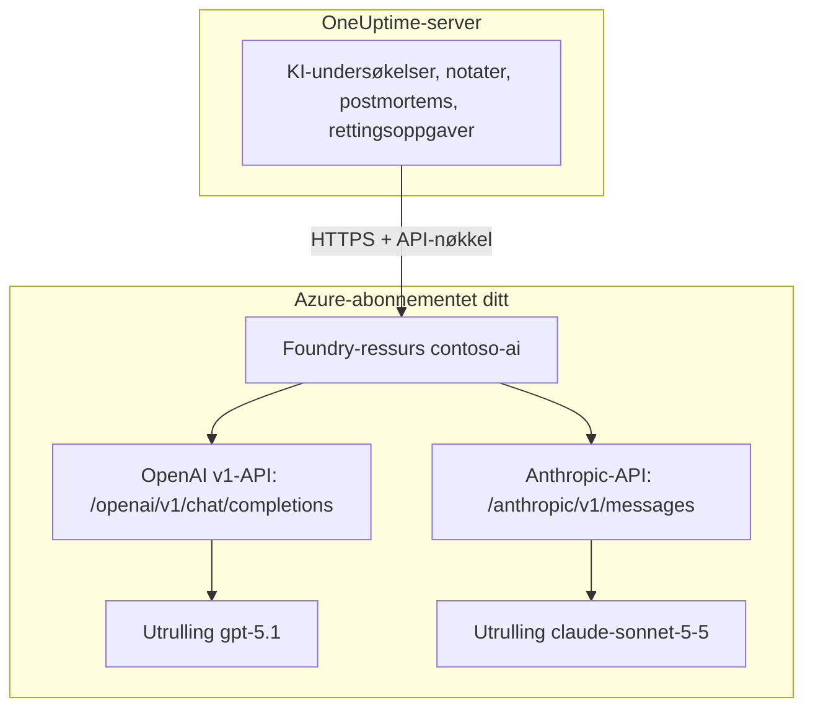

# Microsoft Foundry og Azure OpenAI

Kjør OneUptimes KI-funksjoner på modeller du ruller ut i Microsoft Foundry (tidligere Azure AI Foundry) eller Azure OpenAI. OneUptime sender hver forespørsel rett til ressursen din i Azure-abonnementet ditt, så prompter og svar behandles av utrullingen du valgte, der du valgte. Denne siden tar deg fra et tomt abonnement til en leverandør som virker: Azure-ressursen, utrullingen av modellen, endepunktet og nøkkelen, innstillingene i OneUptime, nettverket, og hva du gjør når en forespørsel mislykkes.

:::cards
- [Sett opp Azure](#sett-opp-microsoft-foundry): Opprett en ressurs, rull ut en modell, kopier endepunktet og nøkkelen.
- [Koble til OneUptime](#koble-til-oneuptime): Fire felt i prosjektinnstillingene, deretter knappen Test.
- [Selvhostet](#konfigurer-en-selvhostet-instans-med-miljøvariabler): Én leverandør for alle prosjekter, fra miljøvariabler.
- [Feilsøking](#feilsøking): 401, 403, en manglende utrulling, en api-version.
:::

## Slik fungerer det

OneUptime kaller Foundry-ressursen din over HTTPS fra OneUptime-serveren, aldri fra brukernes nettlesere. Hver forespørsel har med en av ressursens API-nøkler og navngir utrullingen som skal svare på den.



Én leverandørtype, **Azure OpenAI / Microsoft Foundry**, dekker alle utrullinger på ressursen. Basis-URL-en forteller OneUptime hvilket API som skal kalles:

| Modellen du ruller ut | API-et OneUptime kaller | Basis-URL |
| --- | --- | --- |
| OpenAI-modeller, for eksempel GPT-5.1 og GPT-4.1 | OpenAI v1 chat completions | `https://contoso-ai.openai.azure.com/openai/v1` |
| Foundry Models med chat completions, for eksempel DeepSeek og Grok | OpenAI v1 chat completions | `https://contoso-ai.services.ai.azure.com/openai/v1` |
| Claude | Anthropic Messages | `https://contoso-ai.services.ai.azure.com/anthropic` |

> [!IMPORTANT]
> OneUptimes KI-funksjoner kaller verktøy: mens de arbeider, spør de monitorene, hendelsene og telemetrien din. Rull ut en modell som støtter verktøykall (function calling). Leverandørens knapp **Test** sjekker dette for deg.

## Før du begynner

Du trenger et Azure-abonnement, en rolle som lar deg opprette og lese ressursen, og en OneUptime-rolle som kan legge til LLM-leverandører.

| For å | Dette trenger du i Azure |
| --- | --- |
| Opprette ressursen | **Owner** eller **Contributor** på ressursgruppen, eller **Foundry Account Owner** |
| Rulle ut en modell | **Owner** eller **Contributor** på ressursgruppen, eller **Foundry Owner** eller **Foundry Account Owner** på ressursen. Claude krever i tillegg tillatelse til å abonnere på tilbud i Azure Marketplace |
| Lese ressursens nøkler | En rolle med `Microsoft.CognitiveServices/accounts/listKeys/action`, for eksempel **Owner**, **Contributor** eller **Cognitive Services Contributor** |

OneUptime selv trenger ingen Azure-rolle. En nøkkel gir alene tilgang til alle utrullinger på ressursen uten rollesjekk, så behandle den som et passord.

I OneUptime krever det **Project Owner**, **Project Admin**, **Project Member**, **Settings Admin**, **Settings Member** eller **Create LLM** å legge til en leverandør i et prosjekt. En selvhostet instans kan i stedet registrere én leverandør for alle prosjekter fra miljøvariabler, noe som krever tilgang til serveren.

## Sett opp Microsoft Foundry

:::steps
### Opprett en ressurs

Opprett en Foundry-ressurs i [Foundry-portalen](https://ai.azure.com), eller velg en du allerede har. En Azure OpenAI-ressurs fungerer på samme måte. Noter navnet på ressursen: Det er første del av endepunktet, for eksempel `contoso-ai` i `https://contoso-ai.openai.azure.com`.

Velg en region som tilbyr modellen du vil ha. La nettverkstilgangen til ressursen stå åpen for alle nettverk inntil videre; [Nettverkskrav](#nettverkskrav) forklarer når og hvordan du stenger den.

### Rull ut en modell

Velg **Discover** i Foundry-portalen, deretter **Models**, og velg en modell, for eksempel `gpt-5.1` eller `claude-sonnet-5-5`. Velg **Deploy** og deretter **Custom settings**:

- **Deployment name**: Foundry fyller inn navnet på modellen. OneUptime ber om utrullingen med dette navnet, så noter det nøyaktig.
- **Deployment type**: bestemmer hvor prompter behandles. Se [Hvor dataene dine behandles](#hvor-dataene-dine-behandles).

Velg **Deploy**, og vent til statusen for utrullingen er **Succeeded**.

### Kopier endepunktet og en nøkkel

Åpne ressursen i [Azure-portalen](https://portal.azure.com) og deretter **Resource Management** > **Keys and Endpoint**. Kopier **Endpoint** og **KEY 1**. Ta vare på **KEY 2** til rotasjon: bytt OneUptime over til den, og generer deretter **KEY 1** på nytt.

I Foundry-portalen står den samme nøkkelen på utrullingens fane **Details**, ved siden av **Target URI**.
:::

:::details Foretrekker du kommandolinjen?
De samme trinnene med Azure CLI. `--model-version` skal være en versjon som modellkatalogen oppgir for modellen.

```bash
az cognitiveservices account create \
  --name contoso-ai --resource-group oneuptime-ai \
  --kind AIServices --sku S0 --location eastus2 \
  --custom-domain contoso-ai

az cognitiveservices account deployment create \
  --name contoso-ai --resource-group oneuptime-ai \
  --deployment-name gpt-5.1 \
  --model-name gpt-5.1 --model-version <version> --model-format OpenAI \
  --sku-name GlobalStandard --sku-capacity 50

# KEY 1
az cognitiveservices account keys list \
  --name contoso-ai --resource-group oneuptime-ai \
  --query key1 --output tsv
```

Med `--custom-domain contoso-ai` er endepunktet til ressursen `https://contoso-ai.openai.azure.com`.
:::

## Koble til OneUptime

:::steps
### Åpne LLM-leverandører

Gå til **Prosjektinnstillinger** > **KI** > **LLM-leverandører**, og klikk på **Opprett LLM-leverandør**.

### Gi leverandøren et navn

Under **Grunnleggende informasjon** skriver du inn et **Navn**, for eksempel `Azure gpt-5.1`, og eventuelt en **Beskrivelse**. Klikk på **Neste**.

### Fyll ut leverandørinnstillingene

| Felt | Hva du skriver inn |
| --- | --- |
| **LLM-leverandør** | **Azure OpenAI / Microsoft Foundry** |
| **API-nøkkel** | Ressursens **KEY 1** eller **KEY 2** |
| **Modellnavn** | Navnet på utrullingen, nøyaktig slik Foundry viser det, for eksempel `gpt-5.1` |
| **Basis-URL** | Ressursens endepunkt med `/openai/v1`, for eksempel `https://contoso-ai.openai.azure.com/openai/v1`. For Claude: `https://contoso-ai.services.ai.azure.com/anthropic` |

**Angi som standard**, under **Flere felt**, er slått på: KI-funksjoner bruker prosjektets standardleverandør. Klikk på **Opprett LLM-leverandør**.

### Test tilkoblingen

Klikk på **Test** i raden til leverandøren. En leverandør som virker, svarer "Connection successful. The LLM provider responded to a test prompt and used tool calling." Hvis testen mislykkes, sier meldingen hva Azure svarte og hva du bør endre; se [Feilsøking](#feilsøking).
:::

Den ferdige leverandøren som eksempel:

```text
Navn: Azure gpt-5.1
LLM-leverandør: Azure OpenAI / Microsoft Foundry
API-nøkkel: <KEY 1 fra contoso-ai>
Modellnavn: gpt-5.1
Basis-URL: https://contoso-ai.openai.azure.com/openai/v1
```

Fra nå av bruker prosjektets KI-funksjoner denne utrullingen. På OneUptime Cloud betales ikke forespørslene deres med prosjektets KI-kreditter: Azure fakturerer dem til abonnementet ditt.

## Formater for basis-URL

OneUptime godtar endepunktet i formene Azure-portalen og Foundry-portalen viser det i, og sender hver forespørsel til adressen ved siden av. Foretrekk de korte: Basis-URL-en rommer høyst 100 tegn.

| Basis-URL | Forespørsler går til |
| --- | --- |
| `https://contoso-ai.openai.azure.com` | `https://contoso-ai.openai.azure.com/openai/v1/chat/completions` |
| `https://contoso-ai.openai.azure.com/openai/v1` | `https://contoso-ai.openai.azure.com/openai/v1/chat/completions` |
| `https://contoso-ai.services.ai.azure.com/openai/v1` | `https://contoso-ai.services.ai.azure.com/openai/v1/chat/completions` |
| `https://contoso-ai.openai.azure.com/openai/deployments/gpt-4o` | `https://contoso-ai.openai.azure.com/openai/deployments/gpt-4o/chat/completions?api-version=2024-10-21` |
| `https://contoso-ai.services.ai.azure.com/anthropic` | `https://contoso-ai.services.ai.azure.com/anthropic/v1/messages` |

- **v1-API-et** (`/openai/v1`) er Microsofts nåværende API. Det trenger ingen `api-version`, tar navnet på utrullingen som modell og betjener både OpenAI-modeller og andre Foundry Models. Bruk det for nye leverandører.
- **En utrullings-URL** (`/openai/deployments/<name>`) navngir selv utrullingen, og Azure følger det navnet i stedet for **Modellnavn**. OneUptime legger til `api-version=2024-10-21`, med mindre basis-URL-en har sin egen `api-version`. Leverandører som er lagret slik, virker som før.
- **Target URI for en utrulling**, limt inn i sin helhet fra Foundry-portalen, virker også, så lenge den får plass i 100 tegn.
- **Claude**: Foundry leverer Claude bare gjennom Anthropic Messages API, på ressursens sti `/anthropic`. OneUptime kaller det med den samme nøkkelen. Leverandørtypen **Anthropic** når det også, med den samme basis-URL-en.

## Konfigurer en selvhostet instans med miljøvariabler

På en selvhostet instans registrerer variablene `GLOBAL_LLM_PROVIDER_*` ved oppstart én global LLM-leverandør, som alle prosjekter uten egen leverandør bruker, KI-rettingsoppgaver inkludert. Et prosjekts egen leverandør går alltid først.

```bash
GLOBAL_LLM_PROVIDER_TYPE=AzureOpenAI
GLOBAL_LLM_PROVIDER_NAME=Azure gpt-5.1
GLOBAL_LLM_PROVIDER_BASE_URL=https://contoso-ai.openai.azure.com/openai/v1
GLOBAL_LLM_PROVIDER_MODEL_NAME=gpt-5.1
GLOBAL_LLM_PROVIDER_API_KEY=<KEY 1 of contoso-ai>
```

:::tabs
@tab Docker Compose
Legg variablene til i `config.env`, og start OneUptime på nytt slik du startet det:

```bash
(export $(grep -v '^#' config.env | xargs) && docker compose up --remove-orphans -d)
```
@tab Kubernetes
Oppbevar nøkkelen i en Secret, og send variablene med chartets globale `extraEnv`:

```bash
kubectl create secret generic azure-foundry \
  --namespace oneuptime --from-literal=api-key='<KEY 1 of contoso-ai>'
```

```yaml title="values.yaml"
extraEnv:
  - name: GLOBAL_LLM_PROVIDER_TYPE
    value: AzureOpenAI
  - name: GLOBAL_LLM_PROVIDER_NAME
    value: Azure gpt-5.1
  - name: GLOBAL_LLM_PROVIDER_BASE_URL
    value: https://contoso-ai.openai.azure.com/openai/v1
  - name: GLOBAL_LLM_PROVIDER_MODEL_NAME
    value: gpt-5.1
  - name: GLOBAL_LLM_PROVIDER_API_KEY
    valueFrom:
      secretKeyRef:
        name: azure-foundry
        key: api-key
```

Kjør deretter `helm upgrade` med disse verdiene.
:::

Leverandøren følger variablene: Endrer du dem, oppdateres den ved neste oppstart, og fjerner du `GLOBAL_LLM_PROVIDER_TYPE`, slettes den. Mangler en nøkkel eller en basis-URL for denne typen, nevner oppstartsloggen det. Se [LLM-leverandører](/docs/ai/llm-provider) for alle variabler og leverandørtyper.

## Nettverkskrav

OneUptime-serveren åpner HTTPS-tilkoblinger, på port 443, til ressursens vertsnavn, for eksempel `contoso-ai.openai.azure.com` eller `contoso-ai.services.ai.azure.com`. Tillat denne utgående trafikken i brannmuren eller proxyen din.

- **OneUptime Cloud** når ressursen over internett, så ressursen må ta imot offentlig trafikk. For å holde ressursen unna internett må du selvhoste OneUptime.
- **Selvhostet, privat endepunkt**: Plasser ressursen bak et privat endepunkt i et virtuelt nettverk som OneUptime-serveren når, og koble de private DNS-sonene `privatelink.openai.azure.com`, `privatelink.services.ai.azure.com` og `privatelink.cognitiveservices.azure.com` til det, slik at ressursens vanlige vertsnavn slås opp til den private adressen. Basis-URL-en forblir den samme.
- **Private adresser**: En selvhostet instans kobler til private adresser, med mindre `DATA_SOURCE_BLOCK_PRIVATE_ADDRESSES=true` er satt. En global LLM-leverandør kobler til dem uansett.
- **Nettverksregler på ressursen**: Under ressursens **Networking** holder **Selected networks and private endpoints** alt annet ute. En forespørsel som en regel avviser, mislykkes med 403.

## Hvor dataene dine behandles

Utrullingstypen du velger når du ruller ut modellen, avgjør hvor Azure behandler OneUptimes prompter og modellens svar. Lagrede data blir værende i ressursens Azure-geografi.

| Utrullingstype | Prompter og svar behandles |
| --- | --- |
| Global Standard, Global Provisioned | I hvilken som helst Azure-region |
| Data Zone Standard, Data Zone Provisioned | Bare innenfor datasonen: USA, EU eller Asia og stillehavsområdet |
| Standard, Regional Provisioned | Innenfor ressursens Azure-geografi |

Claude-utrullinger er enten **Hosted on Azure** eller **Hosted on Anthropic**. Velg **Hosted on Azure** for å holde prompter og svar innenfor Azure. Se Microsofts [utrullingstyper](https://learn.microsoft.com/en-us/azure/foundry/foundry-models/concepts/deployment-types) for detaljer.

## Eksempel på forespørsel og svar

For å sjekke en utrulling utenfor OneUptime kan du sende den forespørselen OneUptime sender, med `curl`:

:::tabs
@tab OpenAI v1 API
```bash
curl https://contoso-ai.openai.azure.com/openai/v1/chat/completions \
  -H "Content-Type: application/json" \
  -H "api-key: $AZURE_API_KEY" \
  -d '{
    "model": "gpt-5.1",
    "messages": [
      { "role": "user", "content": "Reply with the word: OK" }
    ]
  }'
```

Svaret, forkortet:

```json
{
  "id": "chatcmpl-7R1nGnsXO8n4oi9UPz2f3UHdgAYMn",
  "object": "chat.completion",
  "model": "gpt-5.1",
  "choices": [
    {
      "index": 0,
      "finish_reason": "stop",
      "message": { "role": "assistant", "content": "OK" }
    }
  ],
  "usage": { "prompt_tokens": 12, "completion_tokens": 2, "total_tokens": 14 }
}
```
@tab Anthropic API
```bash
curl https://contoso-ai.services.ai.azure.com/anthropic/v1/messages \
  -H "Content-Type: application/json" \
  -H "x-api-key: $AZURE_API_KEY" \
  -H "anthropic-version: 2023-06-01" \
  -d '{
    "model": "claude-sonnet-5-5",
    "max_tokens": 1024,
    "messages": [
      { "role": "user", "content": "Reply with the word: OK" }
    ]
  }'
```

Svaret, forkortet:

```json
{
  "id": "msg_01XFDUDYJgAACzvnptvVoYEL",
  "type": "message",
  "role": "assistant",
  "model": "claude-sonnet-5-5",
  "content": [{ "type": "text", "text": "OK" }],
  "stop_reason": "end_turn",
  "usage": { "input_tokens": 14, "output_tokens": 4 }
}
```
:::

OneUptimes egne forespørsler inneholder mer: instruksjonene, samtalen, verktøyene modellen kan kalle og en tokengrense. Fra svaret leser det teksten, verktøykallene, hvorfor modellen stoppet og tokenbruken, som **Prosjektinnstillinger** > **KI** > **AI-logger** viser for hver forespørsel. Leverandørens **Ekstra parametere** legges til i hver forespørsel.

## Microsoft Entra ID og ressurser uten nøkler

OneUptime logger på ressursen med en av API-nøklene dens. Pålogging med Microsoft Entra ID, som tjenestekontohaver eller administrert identitet, støttes ikke ennå.

Hvis organisasjonen din slår av nøkkeltilgang for KI-ressurser (`disableLocalAuth`), mislykkes forespørsler med `AuthenticationTypeDisabled`. Tillat enten nøkkeltilgang på ressursen OneUptime bruker, eller sett Azure API Management foran den:

1. Importer utrullingen til ressursen i API Management som et Azure OpenAI-API. API Management logger da på ressursen med sin egen administrerte identitet.
2. Sett API-ets headernavn for abonnementsnøkkelen til `api-key`.
3. I OneUptime setter du **Basis-URL** til API-ets adresse i API Management for utrullingen, for eksempel `https://contoso-apim.azure-api.net/aoai/openai/deployments/gpt-5.1`, med `api-version` som utrullingen trenger, som for alle utrullings-URL-er. Sett **API-nøkkel** til en abonnementsnøkkel fra API Management.

Claude-modeller som bare godtar Microsoft Entra ID, for eksempel Claude Mythos, kan ikke brukes ennå.

## Feilsøking

OneUptime setter det du må endre først i feilen, og deretter Azures eget svar. Knappen **Test** viser hele feilen; **AI-logger** tar vare på de første 490 tegnene.

:::details "Azure did not accept the API key" (401)
Nøkkelen er feil, er generert på nytt eller tilhører en annen ressurs. Kopier **KEY 1** på nytt fra **Keys and Endpoint** for ressursen basis-URL-en peker på, og lim den inn i **API-nøkkel**.
:::

:::details "Key-based authentication is turned off for this resource" (403)
Azure svarte `AuthenticationTypeDisabled`: Ressursen godtar bare Microsoft Entra ID. Se [Microsoft Entra ID og ressurser uten nøkler](#microsoft-entra-id-og-ressurser-uten-nøkler).
:::

:::details "Azure refused the request" (403)
En nettverksregel på ressursen holdt forespørselen ute. Sjekk ressursens innstillinger under **Networking** mot [nettverkskravene](#nettverkskrav).
:::

:::details "This resource has no deployment named ..." (404)
Azure svarte `DeploymentNotFound`. Sett **Modellnavn** til navnet på utrullingen, nøyaktig slik Foundry-portalen viser det. En utrulling som ble opprettet de siste minuttene, er kanskje ikke klar ennå. Hvis basis-URL-en er en utrullings-URL, er det navnet etter `/openai/deployments/` du skal sjekke.
:::

:::details "Azure found nothing at this address" (404)
Basis-URL-en fører ikke til noe Azure OpenAI-API. Bruk ressursens endepunkt med `/openai/v1`, for eksempel `https://contoso-ai.openai.azure.com/openai/v1`. Modellinferensendepunktet til det avviklede Azure AI Inference SDK (`/models`) er ikke et slikt: Bruk `/openai/v1` på den samme ressursen.
:::

:::details "This model needs api-version ... or later" (400)
En utrullings-URL ber om `api-version=2024-10-21` med mindre den oppgir en annen, og nyere modeller, for eksempel o-serien og GPT-5, avviser så gamle versjoner. Bytt basis-URL-en til v1-API-et, `https://contoso-ai.openai.azure.com/openai/v1`, med navnet på utrullingen som **Modellnavn**. Eller legg versjonen Azure nevner, for eksempel `?api-version=2024-12-01-preview`, til basis-URL-en.
:::

:::details "Azure's v1 API takes no dated api-version" (400)
Basis-URL-en slutter på `/openai/v1` og har i tillegg en datert `api-version`. Fjern `api-version` fra basis-URL-en.
:::

:::details "Basis-URL kan ikke være lengre enn 100 tegn."
En Target URI med sin `api-version` er ofte lengre enn det. Bruk ressursens endepunkt med `/openai/v1`, og skriv navnet på utrullingen i **Modellnavn**.
:::

:::details "...could not be reached" eller "...host name could not be resolved"
OneUptime-serveren kunne ikke koble til ressursen. På OneUptime Cloud må ressursen kunne nås fra internett. På en selvhostet instans sjekker du at serveren kan slå opp ressursens vertsnavn, via den private DNS-sonen ved et privat endepunkt, og at utgående HTTPS er tillatt.
:::

:::details For mange forespørsler (429)
Utrullingens kvote av tokens per minutt er brukt opp. KI-funksjoner venter og prøver igjen, opptil ti forsøk i løpet av omtrent fem minutter, før de melder feilen; knappen **Test** gir opp tidligere. Øk kvoten til utrullingen i Foundry-portalen, eller flytt den til en annen utrullingstype.
:::

## Neste trinn

:::cards
- [LLM-leverandører](/docs/ai/llm-provider): Alle leverandørtyper, og hvordan et prosjekt velger én.
- [AI SRE](/docs/ai/ai-sre): Undersøkelser som kjører på denne leverandøren.
- [Ask AI](/docs/ai/ask-ai): Spørsmål om systemet ditt, besvart i dashbordet.
:::
