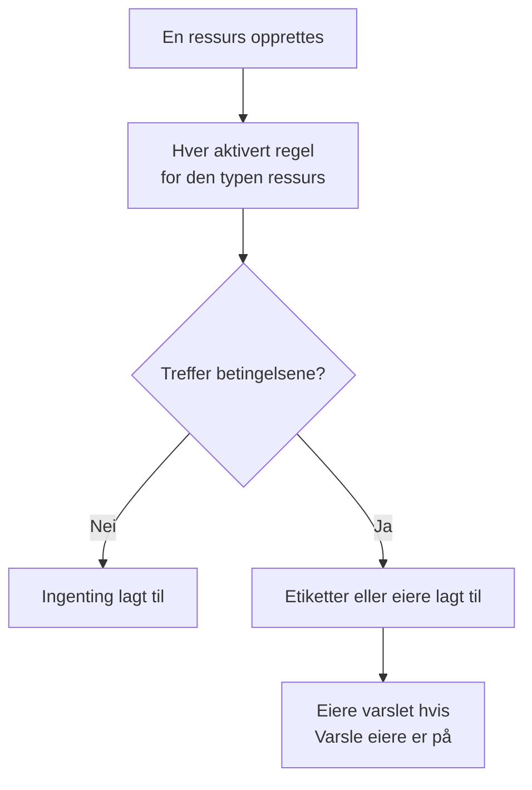

# Etikett- og eierregler

Etikettregler og eierregler holder orden på ressursene dine for deg. En **etikettregel** setter etiketter på hver ny ressurs den treffer, og en **eierregel** legger til brukere og team som eiere: slik får en ny databasehendelse etiketten _Database_ og eies av databaseteamet, uten at noen trenger å huske det.

:::cards
- [Opprett en regel](#opprett-en-regel): To trinn: hva regelen treffer, og deretter hva den legger til.
- [Arv etiketter og eiere](#arv-etiketter-og-eiere): Gi videre det en hendelses monitorer, verter og tjenester bærer.
- [Når regler kjører](#når-regler-kjører): Nye ressurser, og **Run Now** for dem du allerede har.
:::

## Slik fungerer det

Regler kjører når en ressurs opprettes. Hver aktivert regel sjekker betingelsene sine mot den nye ressursen, og hver regel som treffer, legger til det den legger til.

Etiketter og eiere er det du filtrerer og grupperer ressurser etter, de avgjør hvem OneUptime varsler om dem, og hva [tillatelser begrenset til etiketter eller egne ressurser](/docs/permissions/index) når. Regler holder dem konsekvente uten at noen trenger å huske det.

## Hvor du finner reglene

Hvert produkt med etiketter og eiere har begge typene under **Innstillinger** (for hendelser, varsler og planlagt vedlikehold under **Regler**): monitorer, hendelser og hendelsesepisoder, varsler og varselepisoder, planlagte vedlikeholdshendelser, statussider, tjenester, verter, Kubernetes-klynger, Docker-verter, Docker Swarm-klynger, Podman-verter, Proxmox-klynger, VMware vCentre, Ceph-klynger, lagringsmatriser, databaser, køer, IoT-flåter, serverløse funksjoner, skyressurser, RUM-applikasjoner, dashbord, vaktpolicyer, vaktplaner, policyer for innkommende anrop, arbeidsflyter, runbooks, nettverksenheter og SLO-er.

Etikettregler for monitorer ligger for eksempel under **Monitorer → Innstillinger → Etikettregler**, og etikettregler for hendelser under **Hendelser → Regler → Etikettregler**. **Innstillinger** og **Regler** er slått sammen i sidemenyen fra start: klikk på tittelen til delen for å åpne den. Sidene for hendelser og varsler har en fane **Incident Rules** (eller **Alert Rules**) og en fane **Episode Rules**.

## Opprett en regel

Alle etikett- og eierregler opprettes på samme måte, i to trinn.

:::steps
### Åpne listen over regler

Åpne produktets side **Etikettregler** eller **Eierregler**, og klikk på knappen for å opprette, som er oppkalt etter regelen, for eksempel **Opprett Monitor Label Rule**.

### Velg hva regelen treffer

I trinnet **Treff** klikker du på **Legg til betingelse** for hver betingelse ressursen må oppfylle. Med to eller flere velger du **Samsvar med alle** eller **Samsvar med én**. En regel uten betingelser treffer alle nye ressurser.

### Velg hva regelen legger til

I trinnet **Etiketter** velger du **Etiketter å legge til**. I en eierregel heter trinnet **Eiere**: **Legg til eier** åpner én liste med personer og team.

**Navn** fylles ut fra det du velger (_Legg til Production_, _Legg til Platform som eiere_), og følger valgene dine til du skriver et eget navn. En regel som bare arver, får i stedet navn etter det den arver fra (se nedenfor).

### Sjekk de sammenslåtte feltene

**Flere felt** inneholder den valgfrie **Beskrivelse** og, i en eierregel, **Varsle eiere**, som er på som standard: eierne en regel legger til, får det samme varselet «du er lagt til som eier» som en eier som legges til manuelt. Slå det av for å legge til eiere uten å varsle dem.

### Lagre regelen

I det siste trinnet klikker du igjen på knappen som er oppkalt etter regelen, for eksempel **Opprett Monitor Label Rule**. Regelen starter som aktivert, og listen viser den med et grønt merke **Aktivert**.
:::

En ny regel må legge til noe: minst én etikett (eller eier) eller, i en regel for hendelser, varsler eller planlagt vedlikehold, noe den arver (se nedenfor). For å sette en regel på pause uten å slette den slår du av **Aktivert** i redigeringsskjemaet; listen viser da et rødt merke **Deaktivert**.

### Uansett hvordan regelen opprettes

Det samme gjelder for en regel som opprettes via API-et, Terraform, en arbeidsflyt eller en [import av etikettregler](/docs/configuration/label-rule-import-export): OneUptime avviser en ny regel som ikke legger til noe, med én melding som nevner feltene som må fylles ut. Meldingene er på engelsk på alle språk.

| Regel | Melding |
| --- | --- |
| Etikettregel | This label rule adds nothing. Choose at least one label in Labels to Add. |
| Etikettregel for hendelser, varsler eller planlagt vedlikehold | This label rule adds nothing. Choose at least one label in Labels to Add, or turn on an Inherit Labels switch. |
| Eierregel | This owner rule adds nothing. Choose at least one user or team in Owner Users or Owner Teams. |
| Eierregel for hendelser, varsler eller planlagt vedlikehold | This owner rule adds nothing. Choose at least one user or team in Owner Users or Owner Teams, or turn on an Inherit Owners switch. |

- **API**: sett `labelsToAdd` (eller `ownerUsers` / `ownerTeams`) til minst én post i prosjektet, eller en av regelens brytere `inheritLabelsFrom…` (`inheritOwnersFrom…`) til `true`, en JSON-boolean.
- **Terraform**: en ressurs for en etikett- eller eierregel som ikke legger til noe, feiler ved `terraform apply` med meldingen over. Gi den `labels_to_add` (eller `owner_users` / `owner_teams`), eller slå på en av arvebryterne.

Regler du allerede har, røres ikke: se [Rediger en regel](#rediger-en-regel).

## Arv etiketter og eiere

Regler for hendelser, varsler og planlagt vedlikehold kan også gi videre det ressursene en hendelse berører, bærer. Under **Etiketter å legge til** (eller **Eiere**) inneholder den sammenslåtte delen **Arv etiketter** (eller **Arv eiere**) seks brytere:

- **Arv etiketter fra overvåkere**: hver etikett på hendelsens monitorer settes også på hendelsen. Et varsel har én monitor, så i en varselregel heter bryteren **Arv etiketter fra overvåking** (og i en eierregel for varsler **Arv eiere fra overvåking**).
- **Arv etiketter fra verter**, **Arv etiketter fra Kubernetes-klynger**, **Arv etiketter fra Docker-verter**, **Inherit Labels From Podman Hosts** og **Arv etiketter fra tjenester** gjør det samme for de ressursene.

Eierregler har de samme seks bryterne for eiere (**Arv eiere fra overvåkere** og så videre). Så lenge ingen bryter er på, forteller den sammenslåtte delen hva den er til; i en regel som arver, åpner den seg av seg selv. Episoderegler har ingen arvebrytere.

En regel som arver, kan la **Etiketter å legge til** (eller **Eiere**) stå tom: den legger til det den arver. En slik regel får navn etter det den arver fra:

| Brytere slått på | Navn |
| --- | --- |
| **Arv etiketter fra overvåkere** | _Arv etiketter fra: monitorer_ |
| **Arv etiketter fra overvåkere** og **Arv etiketter fra verter** | _Arv etiketter fra: monitorer, verter_ |
| **Arv etiketter fra overvåking**, i en varselregel | _Arv etiketter fra: overvåking_ |

Navnet følger bryterne til du velger en etikett (da får regelen navn etter etikettene sine) eller skriver et eget navn.

## Rediger en regel

Redigeringsskjemaet til en regel har de samme to trinnene og legger til bryteren **Aktivert**. Det krever ikke det regelen legger til: en regel som ble lagret før OneUptime spurte (via API-et, Terraform, en import eller det gamle skjemaet), legger kanskje ikke til noe i det hele tatt, og en redigering kan fjerne alt en regel legger til.

En slik regel kan fortsatt gis nytt navn, slås av eller slettes, også via API-et og Terraform. Listen merker en regel som ikke legger til noe, med **Legger ikke til noe** ved siden av statusen, og det samme gjør regelens egen side. Rediger den for å velge hva den legger til, eller slett den.

## Når regler kjører

Hver aktivert regel kjører når en ressurs opprettes, fra dashbordet eller via API-et, og hver regel som treffer, legger til det den legger til:

- Treffer flere regler, legger alle til sine etiketter og eiere.
- En regel fjerner aldri noe: verken etiketter eller eiere noen har lagt til manuelt, eller dem den selv har lagt til.
- En deaktivert regel gjør ingenting.

En regel du skriver i dag, gjelder ressursene som opprettes etterpå. For å bruke den på dem du allerede har, bruker du **Run Now**: se [Kjøre regler på eksisterende ressurser](/docs/configuration/run-rules-now). Etikettregler kan også kopieres mellom prosjekter: se [Importere og eksportere etikettregler](/docs/configuration/label-rule-import-export).

## Neste steg

:::cards
- [Kjøre regler på eksisterende ressurser](/docs/configuration/run-rules-now): Bruk en regel på ressursene du allerede har.
- [Importere og eksportere etikettregler](/docs/configuration/label-rule-import-export): Kopier etikettregler mellom prosjekter som JSON.
- [Hendelsesinnstillinger og automatisering](/docs/incidents/settings): De andre reglene en hendelse kan kjøre.
- [Etikett- og eierregler for SLO-er](/docs/slo/label-and-owner-rules): Hva SLO-regler treffer på.
:::
