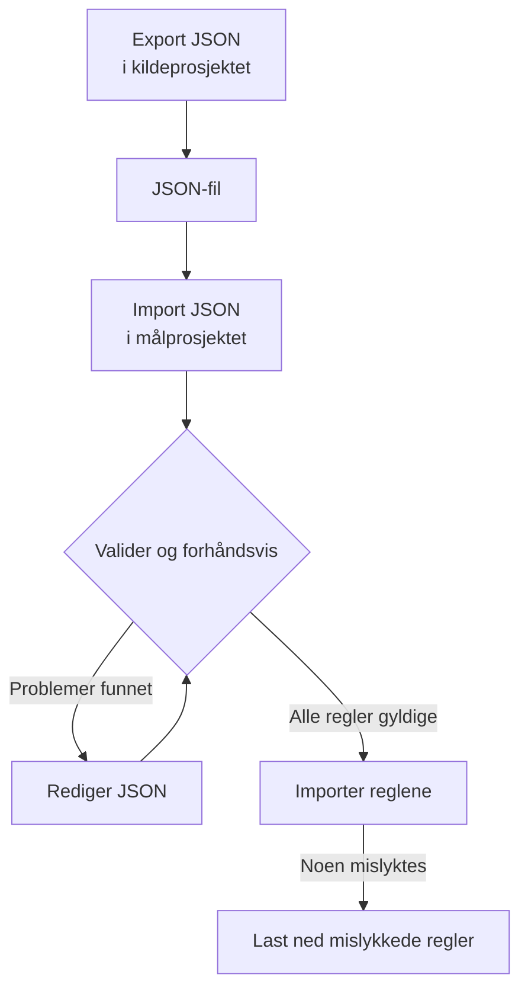

# Importere og eksportere etikettregler

Kopier etikettregler mellom prosjekter, eller opprett mange på én gang, som en JSON-fil. Hver side **Etikettregler** har handlingene **Export JSON** og **Import JSON** i menyen **Flere alternativer** (**⋯**), også for hendelser, varsler, monitorer og nettverksenheter. Det eneste unntaket er VMware: etikettreglene for vCentre har ingen av dem.



## Eksportere regler

Åpne **Flere alternativer** og velg **Export JSON** for å laste ned alle regler av den typen i det gjeldende prosjektet. Eksporten tar med regler på andre sider av tabellen og ser bort fra tabellfiltre.

Filen beholder hver regels status (aktivert eller ikke), betingelser, etiketter som skal legges til, og innstillinger for arv av etiketter. Prosjekt-ID-er, regel-ID-er og revisjonsfelt utelates.

Tilknyttede etiketter, monitorer og alvorlighetsgrader skrives med det nøyaktige navnet. En import oppretter dem ikke: de må allerede finnes i målprosjektet.

## Importere regler

:::steps
### Åpne Import JSON

Åpne målprosjektets side **Etikettregler** og velg **Flere alternativer → Import JSON**.

### Legg til filen

Last opp en JSON-eksportfil, eller lim inn innholdet.

### Valider og forhåndsvis

Velg **Validate and preview**. Hver regel kontrolleres før noen opprettes, og ressursene det vises til, må finnes i målprosjektet med entydige, samsvarende navn.

### Gå gjennom forhåndsvisningen

Kontroller regelnavn, status, etiketter og betingelser. En stor batch vises én side om gangen. For å rette noe velger du **Edit JSON** og validerer på nytt.

### Importer

Velg importknappen, som teller reglene (for eksempel **Import 2 rules**), og hold vinduet åpent til resultatene vises.
:::

Importer legger til nye regler og beholder de eksisterende, så hvis du importerer samme fil igjen, opprettes enda en kopi. De vanlige tillatelsene for å opprette og valideringen på serveren gjelder for hver regel.

Hvis noen regler mislykkes, velger du **Download failed rules** for å lagre bare de radene, retter dem og importerer den filen på nytt. Hvis en forespørsel får tidsavbrudd, sjekk regellisten før du prøver igjen: serveren kan ha lagret regelen før svaret gikk tapt.

## Opprette en batch i JSON

Eksporter en eksisterende regel for å få et eksempel for ressurstypen din, og rediger eller legg deretter til oppføringer i matrisen `items`. Dette eksempelet oppretter to etikettregler for monitorer. Etikettene `Production` og `Infrastructure` må allerede finnes i målprosjektet.

```json title="monitor-label-rules.json"
{
  "fileType": "oneuptime-label-rules",
  "schemaVersion": 1,
  "resourceType": "MonitorLabelRule",
  "items": [
    {
      "name": "Production API monitors",
      "description": "Label production API monitors automatically",
      "isEnabled": true,
      "monitorNamePattern": "^api-prod-",
      "monitorLabels": [],
      "labelsToAdd": ["Production"]
    },
    {
      "name": "Database monitors",
      "isEnabled": false,
      "monitorNamePattern": "^database-",
      "labelsToAdd": ["Infrastructure"]
    }
  ]
}
```

| Felt | Hva det inneholder |
| --- | --- |
| `fileType` | Alltid `oneuptime-label-rules`. |
| `schemaVersion` | Alltid `1`. |
| `resourceType` | Typen regel filen inneholder, for eksempel `MonitorLabelRule`. |
| `items` | Reglene, ett objekt hver. En fil trenger minst én. |

Bruk JSON-booleans for `isEnabled`, tekst for mønstre og matriser med navn for tilknyttede ressurser.

Dette stopper hele batchen før importtrinnet: ugyldige mønstre, ukjente felt, manglende navn og tvetydige henvisninger. Det gjør også en regel som ikke legger til noe (en tom `labelsToAdd` og, i en regel for hendelser, varsler eller planlagt vedlikehold, ingen bryter `inheritLabelsFrom…` satt til `true`), fordi OneUptime nekter å opprette en slik regel (se [Etikett- og eierregler](/docs/configuration/label-and-owner-rules#uansett-hvordan-regelen-opprettes)). En eksport kan inneholde en slik regel hvis den ble lagret før denne kontrollen; gi den en etikett eller fjern den fra filen før du importerer.

> [!NOTE]
> Filer og innlimt JSON er begrenset til 10 MB.

## Kopiere mellom ressurstyper

Behold den opprinnelige `resourceType` i filen, og åpne **Import JSON** på målsiden. Kompatible mønstre for primærnavn eller tittel, beskrivelsesmønstre og forutsatte etiketter knyttes til feltene i målet, og forhåndsvisningen viser disse koblingene slik at du kan gå gjennom dem. Henvisninger til alvorlighetsgrader for hendelser og varsler sammenlignes med navnene på alvorlighetsgradene i målet.

Betingelser eller handlinger som målet ikke støtter, blokkerer importen. For eksempel kan en hendelsesregel som er begrenset til bestemte monitorer, ikke kopieres til regler for nettverksenheter uten å redigere de betingelsene.

> [!WARNING]
> Etikettregler for nettverksenheter og SLO-er støtter jokertegn i tillegg til regulære uttrykk. En overføring mellom disse reglene og andre regeltyper avviser mønstre som inneholder `*` eller omsluttende mellomrom, fordi de treffer annerledes der. Rediger disse mønstrene for målet, eller hold regelen innenfor samme ressurstype. Etikettregler for nettverksenheter og SLO-er kan utveksle hvilket som helst mønster med hverandre, fordi de treffer på samme måte.

## Neste steg

:::cards
- [Etikett- og eierregler](/docs/configuration/label-and-owner-rules): Hva en etikettregel treffer, og hva den legger til.
- [Kjøre regler på eksisterende ressurser](/docs/configuration/run-rules-now): Bruk importerte regler på ressursene du allerede har.
:::
