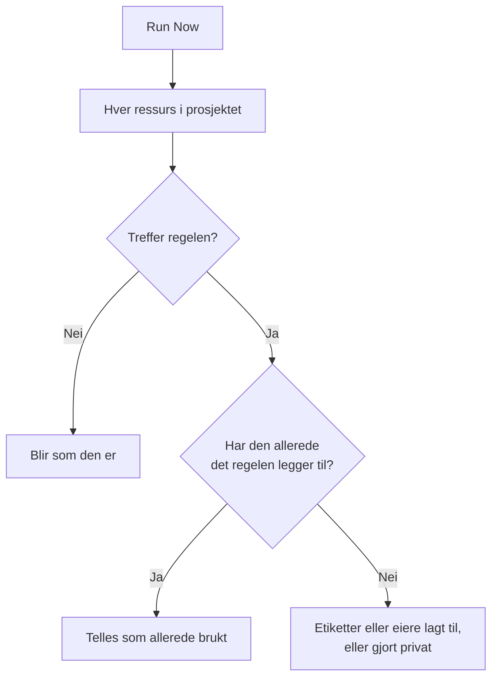

# Kjøre regler på eksisterende ressurser

Etikettregler, eierregler og personvernregler kjører automatisk når en ressurs **opprettes**. En regel du skriver i dag, gjør derfor ingenting med monitorene, hendelsene eller vertene du allerede har. **Run Now** tetter det hullet: den bruker én regel på hver ressurs som allerede finnes i prosjektet.

## Hvilke regler kan kjøres

- **Etikettregler** og **Eierregler**, for hver ressurs som har dem: monitorer, hendelser, hendelsesepisoder, varsler, varselepisoder, planlagte vedlikeholdshendelser, statussider, tjenester, verter, Kubernetes-klynger, Docker-verter, Docker Swarm-klynger, Podman-verter, Proxmox-klynger, VMware vCentre, Ceph-klynger, lagringsmatriser, databaser, køer, IoT-flåter, serverløse funksjoner, skyressurser, RUM-applikasjoner, dashbord, vaktpolicyer, vaktplaner, policyer for innkommende anrop, arbeidsflyter, runbooks, nettverksenheter og SLO-er.
- **Personvernregler**, for hendelser, varsler, hendelsesepisoder og varselepisoder.
- **Monitor Rules** på en statusside. De synkroniserer allerede siden på nytt hver gang en regel lagres; å kjøre en synkroniserer den med en gang.
- **Monitor Rules** på en SLO. De synkroniserer allerede SLO-en på nytt hver gang en regel lagres; å kjøre en synkroniserer SLO-ens monitorer med en gang. Se [Monitorer og monitorregler](/docs/slo/monitor-rules).

Regler som utfører en handling i stedet for å beskrive en ressurs (**Vaktregler**, **Runbook-regler**, **Regler for automatisk utbedring** og **Grupperingsregler**), kan ikke kjøres på eksisterende poster. Å kjøre dem ville tilkalle folk, kjøre runbooks, starte rettinger eller omorganisere episoder for hendelser som allerede er over.

## Før du begynner

For å kjøre en regel trenger du tillatelse til å redigere regelen **og** til å redigere ressursene den endrer: en etikettregel for monitorer krever for eksempel både redigeringstillatelsen for etikettregler for monitorer og den for monitorer. Eierregler krever i tillegg tillatelse til å legge til eiere. Monitorregler på en statusside eller en SLO krever bare tillatelse til å redigere regelen.

> [!IMPORTANT]
> En tillatelse som er begrenset til bestemte etiketter, eller til ressurser du eier, er ikke nok: en kjøring kan endre alle ressursene i prosjektet. Teamenes blokkeringslister gjelder som overalt ellers, og en blokkering begrenset til noen etiketter teller også: en kjøring ville endre ressursene som har de etikettene, så en blokkering med etiketter på redigering av ressursene en regel endrer, avviser kjøringen.

Et nettverks regler krever det samme når du kjører dem på enhetene du allerede har. **Run Now** for en regel for stedstildeling eller enhetsetiketter krever tillatelse til å redigere regelen og **Edit Network Device**. **Dry Run** og **Run Rule** for en regel for automatisk import krever tillatelse til å redigere regelen, **Create Network Device** og, når regelen har en monitormal, **Create Monitor**. Hver av dem må nå hele prosjektet. Se [Automatisk import med regler for automatisk import](/docs/monitor/network-device-monitor#importing-automatically-with-auto-import-rules).

## Kjøre én regel

:::steps
### Åpne listen over regler

Åpne siden med regler, for eksempel **Monitorer → Innstillinger → Etikettregler**.

### Velg Run Now

Åpne menyen **⋯** på slutten av raden til regelen og velg **Run Now**, eller velg **Vis** og deretter **Run Now** på regelens egen side. En dialogboks forteller hva kjøringen kommer til å gjøre.

### Velg om nye eiere skal varsles

For en eierregel velger du om du vil **Notify the owners this run adds**. Det er av som standard og virker bare når regelen selv har **Varsle eiere** slått på. En eier varsles én gang for hver ressurs vedkommende legges til på.

### Start regelen

Velg **Run Rule** og hold dialogboksen åpen. I et stort prosjekt viser dialogboksen hvor langt kjøringen har kommet.

### Les rapporten

Når kjøringen er ferdig, forteller dialogboksen hvor mange ressurser regelen traff, hvor mange den endret, og hvor mange som allerede hadde det regelen legger til.
:::

## Kjøre flere regler

Velg regler i tabellen, åpne menyen med massehandlinger og velg **Run Now**. De valgte reglene kjører etter hverandre.

- Eiere som legges til av en massekjøring, varsles aldri. Kjør i stedet én enkelt regel for å varsle dem.
- En regel som ikke kan kjøre (for eksempel fordi den er deaktivert), vises med årsaken, og de andre reglene kjører likevel.

## Hva en kjøring gjør

- **Den legger bare til.** Etiketter settes på, eiere legges til, ressurser gjøres private. Ingenting fjernes og ingenting gjøres offentlig, så det er trygt å kjøre en regel på nytt: den andre kjøringen melder at alt allerede var brukt.
- **Hver ressurs i prosjektet vurderes**, også løste hendelser og varsler.
- **Eksisterende eiere hoppes over**, de legges aldri til to ganger.
- **Bare prosjektets egne etiketter legges til.** En etikett regelen nevner, som ikke lenger er en av prosjektets etiketter, hoppes over, og regelens andre etiketter legges til likevel. Det samme gjelder når en regel kjører på en ny ressurs.
- **Regelen brukes på samme måte som ved opprettelse**, inkludert etiketter og eiere som arves fra en hendelses monitorer, verter og tjenester. Der ressursen har en aktivitetsfeed, registrerer feeden hvilken regel som endret den.
- **Deaktiverte regler kjører ikke.** Aktiver regelen først.
- **Monitorregler for statussider** legger til monitorene de treffer, og fjerner monitorene de la til tidligere, men ikke lenger treffer. Monitorer som er lagt til siden manuelt, røres aldri.
- **Én kjøring omfatter opptil 100 000 ressurser.** I et større prosjekt stopper kjøringen og sier fra; kjør regelen på nytt for å fortsette.

## Neste steg

:::cards
- [Etikett- og eierregler](/docs/configuration/label-and-owner-rules): Skriv reglene en kjøring bruker.
- [Importere og eksportere etikettregler](/docs/configuration/label-rule-import-export): Hent først etikettregler fra et annet prosjekt.
- [Hendelsesinnstillinger og automatisering](/docs/incidents/settings): Regler for hendelser, inkludert personvernregler.
:::
