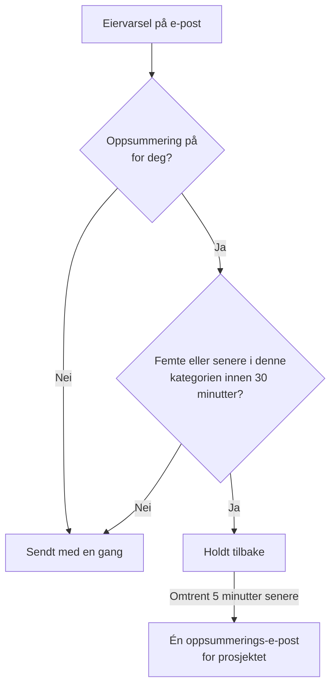

# Varseloppsummering

Når noe går skikkelig galt, går det sjelden galt bare én gang. En ustabil oppstrømsforbindelse slår ut førti monitorer, førti hendelser blir erklært, bekreftet og løst, og hver eier får en e-post for hvert steg: to hundre meldinger i én innboks, og ingen leser dem lenger.

OneUptime samler automatisk slike bølger i én e-post. Det er slått på for alle, og det er ingenting å konfigurere — men vil du heller ha hvert varsel som en egen e-post, kan du [slå av oppsummeringen for deg selv](#slå-av-oppsummeringen-for-deg-selv), ett prosjekt om gangen.

:::cards
- [Slik fungerer det](#slik-fungerer-det): Fire e-poster går ut med en gang; resten kommer samlet.
- [Det som aldri oppsummeres](#det-som-aldri-oppsummeres): Vaktvarsling, sikkerhets-, fakturerings- og abonnent-e-post.
- [Slå av oppsummeringen](#slå-av-oppsummeringen-for-deg-selv): Få hvert varsel som en egen e-post igjen.
- [Færre rutine-e-poster](#skru-enda-mer-ned): Slå av de informative e-postene i én operasjon.
:::

## Slik fungerer det

Hvert eiervarsel på e-post du mottar, telles mot et lite budsjett som holdes per prosjekt, per mottaker, per e-postadresse og per **kategori** av ressurs — hendelser, varsler, monitorer, planlagt vedlikehold, statussider, prober, SLO-er og så videre.



- De **fire første** e-postene i en kategori innenfor et vilkårlig tretti minutters vindu sendes med en gang, akkurat som før. Samme emne, samme mal, samme lenker.
- Den **femte og hver senere** e-posten i det vinduet holdes tilbake.
- Omtrent fem minutter senere kommer alt som er holdt tilbake for deg i prosjektet — på tvers av alle kategorier — som **én** e-post som lister opp hva som skjedde, med en lenke til hver ressurs.

Oppsummeringen tar med varslene du fortsatt abonnerer på når den sendes. Slår du av e-posten for en hendelsestype mens varslene står i kø, utelates de varslene fra oppsummeringen. Slår du e-posten på igjen senere, sendes ikke de hoppede oppdateringene på nytt.

Under terskelen gjør funksjonen ingenting. Et prosjekt som lager tre eier-e-poster om dagen, sender fortsatt de tre e-postene hver for seg.

## Slik ser oppsummerings-e-posten ut

Emnelinjen forteller deg omfanget _og typen_ storm før du åpner den:

```text
[Acme Production] 112 notifications: 63 Monitors, 41 Incidents, 6 Alerts +2 more
```

Inni gir et sammendragskort totalen, tidsrommet oppsummeringen dekker og fordelingen per kategori. Under det er varslene gruppert i én seksjon per kategori, den mest presserende først — hendelser, så varsler, så monitorene og probene som oppdaget dem — slik at det første under sammendraget også er det første som er verdt et klikk.

Hver seksjon har én rad per ressurs i stedet for én rad per hendelse:

- **Radene viser hvor en ressurs endte.** Ble en hendelse opprettet, så bekreftet og så løst, er det én enkelt rad i den nyeste tilstanden, noe som gjør oppsummeringen _mer_ oppdatert enn tre separate e-poster ville vært.
- **Tallene går opp.** Hver rad har tidspunktet for siste oppdatering, og en rad som har tatt opp flere, sier hvor mange, slik at seksjonene og sammendragskortet alltid gir samme total.
- **Alvorlighetsgrad og tilstand vises.** Kort for varsler og hendelser viser alvorlighetsgrad og tilstand fra det siste varselet, inkludert egne navn. Eldre varsler i kø uten disse opplysningene vises fortsatt, bare uten etikettene som mangler.

Klokkeslett vises i UTC, også med dato når en oppsummering strekker seg over mer enn én dag.


## Det som aldri oppsummeres

Oppsummeringen berører bare varsler til eiere og medlemmer — familien «noe du er ansvarlig for, har endret seg». Den kan ikke nå noe annet, fordi den ligger i den ene kodestien disse varslene tar, og ingen andre.

Aldri forsinket og aldri talt med:

| Kategori | Eksempler |
| ----------------------------------------- | ---------------------------------------------------------------------------------------------------- |
| Vaktvarsling | Hvert varsel fra en eskaleringspolicy og hver forespørsel om bekreftelse |
| Vakttider | «Du har vakt nå», «du har vakt som neste», «vakten din begynner snart», «vakten din ble tildelt på nytt» |
| Kontosikkerhet | Tilbakestilling av passord, bekreftelse av e-post, passord endret, reservekode for tofaktor brukt eller generert på nytt |
| Administrative meldinger om kontoen din | En administrator har endret varslingsmetodene eller vaktreglene dine |
| Fakturering og saldo | Fakturaer, forfalt abonnement, «vi kunne ikke varsle noen fordi kortet ble avvist» |
| Instansens helse | Advarsler om Postgres, Valkey og ClickHouse til instansens administratorer |
| Abonnenter på statussider | Hver e-post statussiden din sender til dine egne abonnenter |
| SLA-brudd | Sendes med en gang, selv om de gjenbruker varseltypen for opprettede hendelser |

Bare e-post påvirkes. SMS, telefonsamtaler, push-varsler, WhatsApp, Telegram, Slack, Microsoft Teams og webhooks leveres med en gang, akkurat som før — også for varslene der e-posten ble holdt tilbake.

## Grenser

| Grense | Verdi |
| --- | --- |
| Varsler i én oppsummerings-e-post | Høyst **500**. Resten blir stående i køen og sendes med neste oppsummering, høyst fem minutter senere. |
| Viste rader i én oppsummerings-e-post | Høyst **100**. Rader slås sammen per ressurs, så det er 100 forskjellige ressurser; utover det oppgir e-posten de fulle totalene og lenker til prosjektet. |
| Oppsummerings-e-poster til én mottaker fra ett prosjekt | Høyst **12** i timen. |
| Ekstra forsinkelse for et tilbakeholdt varsel | Omtrent seks minutter i verste fall. |

Taket per time håndheves av databasen, ikke av en tidtaker, så det holder også under en storm som varer i timevis.

## Slå av oppsummeringen for deg selv

Noen vil ha samlingen. Andre arkiverer hvert varsel når det kommer, eller lar noe annet gjøre det med innboksen, og en oppsummerings-e-post ødelegger det. Derfor kan oppsummeringen slås av, per person og per prosjekt.

:::steps
### Åpne E-postinnstillinger

Gå i prosjektet til **Brukerinnstillinger → E-postinnstillinger** — den samme siden hver oppsummerings-e-post lenker til nederst.

### Slå av Email Rollup

Slå av bryteren i kortet **Email Rollup**. Det lagres av seg selv, og kortet viser deretter "Off: every notification arrives as its own email, immediately."
:::

Når den er slått av, sendes hvert eier- og medlemsvarsel på e-post i det prosjektet til deg enkeltvis og med en gang igjen: samme emne, samme mal, samme lenker, ingen terskel og ingen ventetid på fem minutter. Det som allerede står i kø for deg når du slår den av, kommer likevel som en siste oppsummering noen minutter senere; alt etter det kommer ett om gangen.

Bryteren er **bare din og gjelder ett prosjekt**. Å slå den av endrer ikke hva kollegene dine får, og den gjelder ikke på tvers av prosjekter — så det støyende produksjonsprosjektet kan fortsette å samle mens det rolige interne prosjektet sender alt enkeltvis, eller omvendt. Den er slått på for alle til de slår den av.

Hva den **ikke** berører:

- **Hvilke varsler du får.** Det er innstillingen per hendelsestype og per kanal under **Brukerinnstillinger → Varselinnstillinger**, én side bortenfor. Oppsummeringen og denne bryteren endrer bare hvor mange e-poster varslene pakkes i.
- **Vaktvarsling og vakt-e-post**, **e-post om kontosikkerhet**, **fakturerings-e-post**, advarsler om instansens helse og e-post til statusside-abonnenter. Ingenting av dette oppsummeres noen gang, så det endrer ingenting for dem å slå av oppsummeringen — se [Det som aldri oppsummeres](#det-som-aldri-oppsummeres).
- **Alle andre kanaler.** SMS, telefonsamtaler, push, WhatsApp, Telegram, Slack, Microsoft Teams og webhooks er allerede umiddelbare.

## Skru enda mer ned

Oppsummeringen pakker rutineoppdateringer sammen; du kan også slutte å få de fleste av dem.

:::steps
### Åpne innstillingene fra en oppsummerings-e-post

Åpne lenken til innstillingene nederst i en oppsummerings-e-post, eller gå til **Brukerinnstillinger → E-postinnstillinger**.

### Velg Reduce routine emails

Velg **Reduce routine emails** i kortet **Fewer routine emails**. Når endringen er lagret, viser kortet **Rutine-e-poster slått av.**
:::

Dette slår av disse informative e-postene for deg i det gjeldende prosjektet:

- Notater på hendelser, varsler, episoder og planlagt vedlikehold.
- Meldinger om at du er lagt til som eier av en ressurs.
- Nye monitorer og statussider.
- Hendelser eller varsler som er lagt til i eksisterende episoder.
- Å bli lagt til i eller fjernet fra en vaktpolicy.

Valgene dine for opprettelse av hendelser og varsler, tilstandsendringer, påminnelser, tildeling av hendelser, monitorhelse og vakter beholdes, og ingen e-post du hadde slått av, slås på. Vaktvarsling, andre leveringskanaler, konto-e-post, fakturerings-e-post og e-post til statusside-abonnenter påvirkes ikke.

Endringene lagres samlet. Se over bryterne per hendelse under **Brukerinnstillinger → Varselinnstillinger** for å slå på en enkelt e-post igjen. Disse innstillingene gjelder også varsler som venter på en oppsummering; en e-post som allerede er sendt, kan ikke hentes tilbake. E-postoppsummeringen er fortsatt en egen innstilling som styrer samlingen av hendelsene du beholder.

## Feilsøking

:::details En varsel-e-post kom noen minutter for sent
Den var den femte eller en senere e-posten i kategorien innen tretti minutter, så den ble holdt tilbake og sendt i en oppsummering omtrent fem minutter senere. Se etter en oppsummerings-e-post fra samme prosjekt: Varselet er en rad i den. Vaktvarsling og de andre kanalene ble ikke forsinket.
:::

:::details Jeg slo av oppsummeringen og fikk likevel en oppsummerings-e-post
Varsler som allerede sto i kø for deg da du slo den av, kommer som en siste oppsummering noen minutter senere. Alt etter det kommer som én e-post om gangen.
:::

:::details En oppdatering jeg ventet på, mangler i en oppsummerings-e-post
Hver rad viser en ressurs i den nyeste tilstanden, så en hendelse som ble opprettet, bekreftet og løst, er én rad med antallet oppdateringer den har tatt opp. Et varsel utelates også hvis du slo av e-posten for den hendelsestypen under **Brukerinnstillinger → Varselinnstillinger** mens det sto i kø.
:::

## Neste steg

:::cards
- [SMTP-konfigurasjon](/docs/emails/smtp): Send e-post fra OneUptime gjennom din egen e-postserver.
- [Eskaleringsregler](/docs/on-call/escalation-rules): Slik når vaktvarsling frem til folk, aldri oppsummert.
:::
