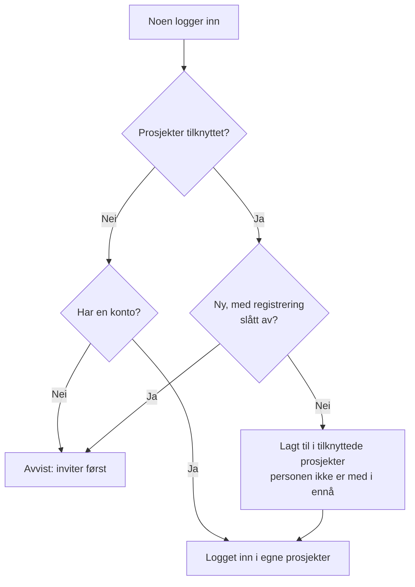

# Global SSO

Med global SSO setter en **instansadministrator** i OneUptime (master-admin) opp en SAML 2.0- eller OpenID Connect-identitetsleverandør (OIDC) **én gang**, på instansnivå, og kobler den til hvilket som helst prosjekt på serveren. I stedet for at hver prosjekteier setter opp sin egen identitetsleverandør, setter en master-admin opp én som betjener hele instansen.

> [!NOTE]
> Global SSO, inkludert den instansomfattende bryteren "Require SSO for Login", er en del av alle OneUptime-utgaver: alle selvhostede instanser har det, også Community Edition, og det krever ingen lisens. Det hører til instansadministrasjonen og gjelder derfor ikke for OneUptime Cloud. Se [Enterprise Edition](/docs/self-hosted/enterprise) for hva hver utgave inneholder.

:::cards
- [Sett opp en leverandør](#sette-opp-global-sso): Opprett den, gi identitetsleverandøren din URL-ene til OneUptime, og test den.
- [Slik logger brukere inn](#slik-logger-brukere-inn): Bare eksisterende medlemmer, eller nye personer lagt til i prosjektene du knytter til.
- [Håndhev SSO](#håndhev-sso): Krev SSO for ett prosjekt eller for hele instansen.
- [Slå av en leverandør](#slå-av-eller-slette-en-leverandør): Hva som opphører, og hvilke endringer OneUptime avviser.
:::

## Global SSO og prosjekt-SSO

|                     | Prosjekt-SSO                                       | Global SSO                                          |
| ------------------- | -------------------------------------------------- | --------------------------------------------------- |
| Settes opp av       | Prosjekteier/-administrator (Prosjektinnstillinger) | Instansens master-admin (Admin Dashboard)          |
| Omfang              | Ett enkelt prosjekt                                | Hele instansen, kan kobles til alle prosjekter      |
| Resultat av pålogging | Tilgang til det ene prosjektet                   | Tilgang til alle prosjekter brukeren kan nå         |

Se [SSO](/docs/identity/sso) for et enkelt prosjekts egen leverandør.

## Sette opp global SSO

:::steps
### Åpne listen over leverandører

:::tabs
@tab SAML
Logg inn som master-admin, og åpne Admin Dashboard med **Admin-innstillinger** i brukermenyen. Gå deretter til **Innstillinger** > **Autentisering** > **Global SSO**.
@tab OpenID Connect
Logg inn som master-admin, og åpne Admin Dashboard med **Admin-innstillinger** i brukermenyen. Gå deretter til **Innstillinger** > **Autentisering** > **Global OIDC**.
:::

### Opprett leverandøren

:::tabs
@tab SAML
- Klikk på **Create Global SSO**.
- Skriv inn et **Navn**, **Sign On URL** og **Issuer** fra identitetsleverandøren din, og lim inn **Public Certificate**. Resten er allerede fylt ut under **Flere felt**: **Signature Method** (`RSA-SHA256`), **Digest Method** (`SHA256`) og en beskrivelse (`Sign in with` og navnet). Endre dem bare hvis IdP-en din krever det. Når du lagrer, åpnes siden til leverandøren.
@tab OpenID Connect
- Klikk på **Create Global OIDC**.
- Skriv inn et **Navn**, **Issuer URL** og **Client ID** og **Client Secret** for appen du registrerte i IdP-en din. Det fungerer også å lime inn oppdagelses-URL-en til IdP-en i **Issuer URL**. Resten er allerede fylt ut under **Flere felt**: **Discovery URL** (utstederen etterfulgt av `/.well-known/openid-configuration`), **Scopes** (`openid email profile`), kravnavnene `email` og `name` og en beskrivelse (`Sign in with` og navnet). Endre dem bare hvis IdP-en din krever det. Når du lagrer, åpnes siden til leverandøren.
:::

### Kopier URL-ene til OneUptime inn i identitetsleverandøren din

:::tabs
@tab SAML
På siden til leverandøren viser kortet **Identity Provider URLs** **ACS URL (Assertion Consumer Service / Reply URL)** og **Issuer (Entity ID)**. Lim inn begge i identitetsleverandøren din (Okta, Microsoft Entra ID, OneLogin, JumpCloud og andre).
@tab OpenID Connect
På siden til leverandøren viser kortet **Identity Provider URL** **Redirect URI (Callback URL)**. Legg den til i identitetsleverandørens tillatte redirect-URI-er.
:::

### Slå på leverandøren

En ny leverandør starter avslått. Klikk på **Edit Configuration** på siden til leverandøren, og slå på **Aktivert**.

Å slå på en global leverandør legger bare til et valg "Sign in with SSO" på påloggingssiden — den håndhever aldri SSO og stenger ingen ute, så det er trygt å slå den på, teste den og slå den av igjen om nødvendig.

### Test leverandøren

Bruk lenken i kortet **Test this SSO provider** (**Test this OIDC provider** for OpenID Connect) til å gjennomføre en fullstendig pålogging via identitetsleverandøren din. Du trenger ikke knytte til prosjekter først: testen logger deg inn i prosjektene du allerede er med i. Leverandøren må være slått på for at lenken skal virke.
:::

## Slik logger brukere inn

Hvordan en global leverandør oppfører seg, avhenger av om du knytter prosjekter til den:

- **Ingen prosjekter tilknyttet (alle prosjekter / invitasjon først):** Brukere kan logge inn med leverandøren og nå **alle prosjekter de allerede er medlem av**. Nye brukere opprettes **ikke** automatisk — en bruker må først inviteres til et prosjekt. Bruk dette for SSO i hele virksomheten når medlemskap styres et annet sted.

- **Prosjekter knyttet til (automatisk klargjøring):** Åpne leverandøren og bruk tabellen **Attached Projects** for å knytte til ett eller flere prosjekter, hvert med et sett standardteam. Brukere som logger inn blir **automatisk klargjort** inn i disse prosjektene og lagt til i standardteamene ved første innlogging. Et prosjekt du knytter til, starter med medlemsteamet sitt; velg andre team hvis nye brukere skal starte med annen tilgang. Legg til ett prosjekt + team om gangen for å bygge listen; for å endre en tilknytning, slett den og legg den til på nytt.

En person som allerede er medlem av et tilknyttet prosjekt, beholder teamene sine der.

To brytere på leverandøren endrer dette. Begge starter avslått, foldet sammen under **Flere felt**:

| Bryter | Hva den gjør når den er slått på |
| --- | --- |
| **Disable Sign Up with SSO** | Personer må være invitert til et prosjekt før de kan logge inn med denne leverandøren, også når prosjekter er tilknyttet. Ingen nye opprettes ved første pålogging. |
| **Restrict to Attached Projects** | Pålogging med denne leverandøren oppfyller SSO-kravet bare i prosjektene som er knyttet til den, så personer som allerede er logget inn, kan miste tilgangen til andre prosjekter. Når den er slått av, oppfyller påloggingen kravet i alle prosjekter personen hører til, og tilknyttede prosjekter avgjør bare hvor nye personer legges til. |

## Håndhev SSO

Å sette opp en global leverandør tvinger ingen til å bruke den; pålogging med passord fungerer fortsatt. For å kreve SSO slår du på kravet for et prosjekt eller for hele instansen:

- **Per prosjekt:** et prosjekt kan kreve SSO, og eventuelt kreve en *bestemt* leverandør (prosjekt eller global). Se [Krev SSO for prosjektet ditt](/docs/identity/sso#krev-sso-for-prosjektet-ditt).
- **Hele instansen:** **Admin** > **Innstillinger** > **Autentisering** har en bryter **Krev SSO for innlogging** som håndhever SSO for alle brukere på instansen. Den ber om bekreftelse før den slås på, og lagres så snart du bekrefter. Master-admins forblir unntatt, slik at de ikke kan bli utestengt.

Å slå på **Krev SSO for innlogging** krever en SSO-leverandør som logger personer inn, slik at ingen blir utestengt av det:

- For hele instansen trenger hvert prosjekt som ikke selv krever SSO, én: en av prosjektets egne SAML- eller OIDC-leverandører som er slått på, eller en global leverandør som er slått på og logger personer inn i det. Så lenge et prosjekt ikke har noen, avvises det å slå på bryteren, og meldingen nevner prosjektene (eller, når det er mange, de første og hvor mange). Slå først på en global leverandør, eller en leverandør i disse prosjektene. Et prosjekt som krever en bestemt leverandør, trenger akkurat den: så lenge den er slått av, slettet eller ikke logger personer inn i prosjektet, nevner meldingen prosjektet for seg — slå først på den leverandøren, eller krev en annen der.
- For et prosjekt stilles det samme kravet til prosjektet, og til leverandøren det krever, hvis det krever en.
- En lagring som sender **Krev SSO for innlogging** som slått på mens det allerede er slått på — sammen med andre innstillinger eller fra API-et — kontrolleres på samme måte, for instansen eller for et prosjekt, og det samme gjelder en lagring som nevner leverandøren et prosjekt allerede krever.
- For et nytt prosjekt, som ennå ikke har sin egen leverandør: så lenge instansen krever SSO, krever det å opprette et prosjekt en global leverandør som er slått på og logger personer inn i alle prosjekter, ellers kunne ingen, heller ikke den som oppretter det, åpne det. Uten en slik avvises opprettelsen av et prosjekt, og meldingen ber en serveradministrator slå på en. Master-admins kan fortsatt opprette prosjekter. Et prosjekt som opprettes med **Krev SSO for innlogging** allerede slått på, trenger det samme, uansett hvem som oppretter det.

Å slå det av avvises aldri.

## Slå av eller slette en leverandør

Å slå av en global leverandør, slette den eller begrense den til prosjektene som er knyttet til den, avslutter påloggingene den har gitt der den ikke lenger logger personer inn. Der SSO kreves, må personer som logget inn med den, logge inn med SSO på nytt ved neste forespørsel, sidene de har åpne, slutter umiddelbart å få liveoppdateringer, og en MCP-klient som noen koblet til etter å ha logget inn med den, slutter å virke i prosjektet.

Å slå på leverandøren igjen henter ikke tilbake disse påloggingene: personene logger inn med den på nytt. En leverandør som allerede var slått av da du oppgraderte, regnes som slått av ved oppgraderingen.

Et nytt sertifikat eller klienthemmelighet, andre URL-er eller et nytt navn holder alle innlogget.

### Alle prosjekter som krever SSO, beholder en vei inn

Et prosjekt som krever SSO, selv eller fordi hele instansen gjør det, beholder alltid en leverandør personer kan logge inn i det med. Derfor avvises disse endringene så lenge de ville etterlate et slikt prosjekt helt uten leverandør, eller ta fra det leverandøren det krever:

- å slå av en global leverandør, slette den eller begrense den til prosjektene som er knyttet til den;
- for en leverandør som er begrenset til prosjektene som er knyttet til den: å knytte til det første prosjektet (inntil da logger den personer inn i alle prosjekter), slå av en tilknytning, flytte den til et annet prosjekt eller en annen leverandør, eller fjerne den.

Meldingen nevner prosjektene, eller de første og hvor mange det er. Slå først på en annen leverandør for dem, en av deres egne eller en global, eller slå av **Krev SSO for innlogging** der. Et prosjekt som krever akkurat denne leverandøren, nevnes for seg: krev først en annen leverandør der, eller slå av **Krev SSO for innlogging**.

Endringer som lar en leverandør logge inn flere personer — å slå den eller en tilknytning på, å oppheve begrensningen — avvises aldri. De når alle appservere med en gang, akkurat som det å slå av **Krev SSO for innlogging**: personer kan logge inn med leverandøren umiddelbart. Bare når en annen endring av samme leverandør lagres i akkurat det øyeblikket, kan en appserver bruke opptil ett minutt på å følge etter.

To endringer i hvem som kan logge inn, kontrolleres etter hverandre. Lagres en annen i samme øyeblikk og tar lengre tid enn vanlig — å slå på **Krev SSO for innlogging** for hele instansen leser alle prosjekter —, avvises en endring med "Another change to who can sign in with SSO is being saved. Try again in a moment.": lagre den på nytt. Et prosjekt som opprettes i det øyeblikket, venter også på endringen, og venter det for lenge, avvises det med "The server's SSO settings are being changed. Create the project again in a moment."

## Feilsøking

:::details "You must be invited to a project on this OneUptime instance before you can sign in with SSO"
Personen har ennå ingen OneUptime-konto, og leverandøren oppretter ingen: enten er ingen prosjekter knyttet til den, eller **Disable Sign Up with SSO** er slått på. Inviter personen til et prosjekt, eller knytt et prosjekt til leverandøren.
:::

:::details "This SSO provider does not grant access to any project you are a member of"
**Restrict to Attached Projects** er slått på, og personen er ikke medlem av noe prosjekt som er knyttet til leverandøren. Knytt til et av personens prosjekter, eller legg personen til i et tilknyttet prosjekt.
:::

:::details "You are not a member of any project on this OneUptime instance"
Personen har en konto, men hører ikke til noe prosjekt, og leverandøren har ingenting å legge vedkommende til i. Inviter personen til et prosjekt, eller knytt et prosjekt med standardteam til leverandøren.
:::

:::details "Issuer URL does not match"
For en SAML-leverandør er issuer i svaret fra identitetsleverandøren din ikke den **Issuer** som er lagret på leverandøren. Kopier den på nytt fra identitetsleverandøren din; de to må samsvare nøyaktig.
:::

## Neste steg

:::cards
- [SSO](/docs/identity/sso): Sett opp et prosjekts egen SAML- eller OIDC-leverandør.
- [SCIM](/docs/identity/scim): La identitetsleverandøren din legge til og fjerne personer automatisk.
- [Brukere, team og tillatelser](/docs/permissions/index): Hva teamene nye personer blir med i, gir dem lov til.
:::
