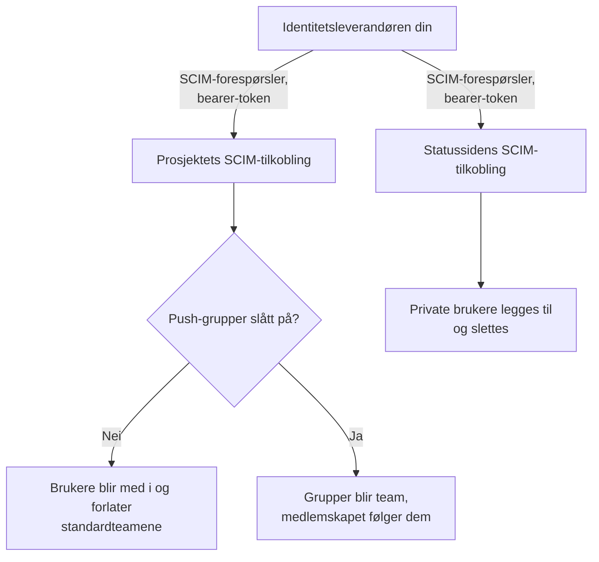
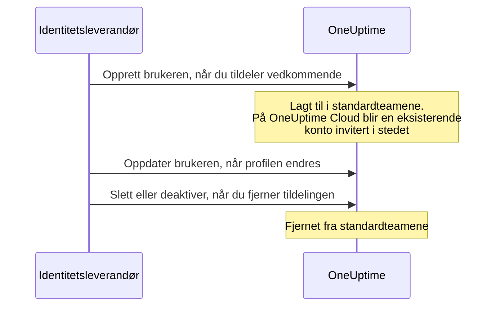
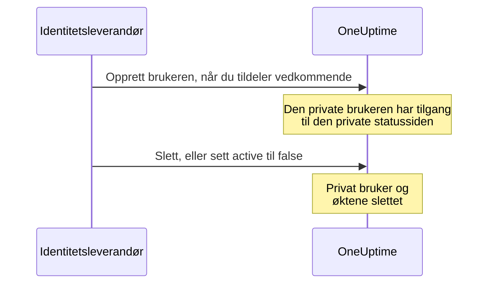

# SCIM

SCIM (System for Cross-domain Identity Management) klargjør personer og fjerner tilgangen deres automatisk. Identitetsleverandøren din (IdP) — Microsoft Entra ID, Okta eller et hvilket som helst annet SCIM 2.0-system — legger personer til i OneUptime-prosjektene og de private statussidene dine når du tildeler dem, og fjerner dem når du fjerner tildelingen.

> [!NOTE]
> **Utgave:** SCIM er en del av OneUptime Enterprise Edition. På OneUptime Cloud er det tilgjengelig fra planen **Scale** og oppover. Selvhostede installasjoner trenger Enterprise Edition-imaget og en lisens. Se [Enterprise Edition](/docs/self-hosted/enterprise). Uten en gyldig lisens (etter prøveperioden på 14 dager, eller 30 dager etter at en lisens utløper) avvises SCIM-forespørsler til en lisens aktiveres.

:::cards
- [Sett opp prosjekt-SCIM](#sette-opp-prosjekt-scim): Opprett en tilkobling, og gi IdP-en din URL-en og tokenet.
- [Sett opp SCIM for statussider](#sette-opp-scim-for-statussider): Klargjør de private brukerne til en statusside.
- [Koble til identitetsleverandøren din](#sett-opp-identitetsleverandøren-din): Steg for steg for Microsoft Entra ID og Okta.
- [Vanlige spørsmål](#vanlige-spørsmål): Eksisterende brukere, fjerning av tilgang, endrede e-postadresser.
:::

## Slik fungerer det

Identitetsleverandøren din kaller SCIM-endepunktet til OneUptime, autentisert med et bearer-token, hver gang du tildeler, endrer eller fjerner tildelingen av noen. Hva forespørselen endrer, avhenger av hvor tilkoblingen er:



SCIM-integrasjonen gir disse fordelene:

- **Automatisk klargjøring av brukere**: brukere opprettes i OneUptime når de tildeles i IdP-en din.
- **Automatisk fjerning av brukere**: brukere fjernes fra OneUptime når tildelingen deres fjernes i IdP-en din.
- **Synkronisering av brukerattributter**: brukerinformasjonen holdes lik i IdP-en din og OneUptime.
- **Sentral tilgangsstyring**: tilgangen til OneUptime styres fra det eksisterende systemet ditt for identitetsstyring.

SCIM og [SSO](/docs/identity/sso) er uavhengige: SCIM avgjør hvem som er med i et prosjekt, SSO hvordan de logger inn. De fleste organisasjoner bruker begge.

## SCIM for prosjekter

Med prosjekt-SCIM styrer identitetsleverandører teammedlemmene i OneUptime-prosjekter.

### Sette opp prosjekt-SCIM

Bare en prosjekteier kan legge til eller endre SCIM-tilkoblingen til et prosjekt, eller se eller tilbakestille bearer-tokenet: via SCIM kan identitetsleverandøren din legge personer til i hvilket som helst team i prosjektet.
:::steps
1. **Gå til prosjektinnstillingene**

   - Åpne OneUptime-prosjektet ditt
   - Gå til **Prosjektinnstillinger** > **Sikkerhet** > **SCIM**

2. **Konfigurer SCIM-innstillingene**

   - Skriv inn et **Navn**. **Standardteam** starter med medlemsteamet i prosjektet: nye brukere legges til i disse teamene
   - Under **Flere felt** er **Automatisk klargjøring av brukere** (legg til brukere når de tildeles i IdP-en din) og **Automatisk avvikling av brukere** (fjern brukere når tildelingen deres fjernes i IdP-en din) slått på, og **Aktiver push-grupper** er slått av. Endre dem der hvis du trenger det
   - Lagre. Dialogen med **SCIM Base URL** og **Bearer Token** for IdP-konfigurasjonen din åpnes med en gang

3. **Konfigurer identitetsleverandøren din**

   - Bruk **SCIM Base URL** fra dialogen. På OneUptime Cloud er den `https://oneuptime.com/identity/scim/v2/<scim-id>`; en selvhostet installasjon viser sin egen vert
   - Sett opp autentisering med bearer-token med **Bearer Token** fra dialogen
   - Tilordne brukerattributtene (e-post er påkrevd). [Sett opp identitetsleverandøren din](#sett-opp-identitetsleverandøren-din) har detaljene for Microsoft Entra ID og Okta
:::

For å se URL-ene igjen velger du **Vis SCIM-URL-er** i raden for tilkoblingen. **Tilbakestill bærertoken** erstatter tokenet; oppdater identitetsleverandøren din med det nye.

### Slik klargjøres en prosjektbruker



En person som allerede hadde en OneUptime-konto, blir med når vedkommende godtar invitasjonen på OneUptime Cloud (se [vanlige spørsmål](#vanlige-spørsmål)). Tilgang gitt gjennom andre team enn tilkoblingens standardteam berøres ikke.

## SCIM for statussider

Med SCIM for statussider klargjør identitetsleverandører private brukere av statussider og fjerner dem igjen; disse brukerne har tilgang til private statussider.

### Sette opp SCIM for statussider

:::steps
1. **Gå til innstillingene for statussiden**

   - Åpne **Statussider**, og velg statussiden din
   - Gå til **Sikkerhet** > **SCIM**

2. **Konfigurer SCIM-innstillingene**

   - Skriv inn et **Navn**. Under **Flere felt** er **Automatisk klargjøring av brukere** (legg til private brukere når de tildeles i IdP-en din) og **Automatisk avvikling av brukere** (slett private brukere når tildelingen deres fjernes i IdP-en din) slått på. Endre dem der hvis du trenger det
   - Lagre. Dialogen med **SCIM Base URL** og **Bearer Token** for IdP-konfigurasjonen din åpnes med en gang

3. **Konfigurer identitetsleverandøren din**

   - Bruk **SCIM Base URL** fra dialogen. På OneUptime Cloud er den `https://oneuptime.com/identity/status-page-scim/v2/<scim-id>`
   - Sett opp autentisering med bearer-token med tokenet som vises
   - Tilordne brukerattributtene (e-post er påkrevd)
:::

For å se URL-ene igjen velger du **Vis SCIM-endepunkt-URL-er** i raden for tilkoblingen.

SCIM for statussider støtter bare brukere. Grupper og klargjøring av grupper støttes ikke.

### Slik klargjøres en privat bruker



> [!WARNING]
> Fjerning sletter statussidens private bruker og alle øktene vedkommende har for statussiden, permanent. Tildeles brukeren igjen senere, klargjøres vedkommende som en ny privat bruker. Når **Automatisk avvikling av brukere** er slått av, ignoreres oppdateringer som setter `active` til `false`, og DELETE-forespørsler avvises.

## Sett opp identitetsleverandøren din

Hver leverandør nedenfor starter med å opprette en SCIM-tilkobling for prosjektet i OneUptime, og kobler deretter identitetsleverandøren din til den.

### Microsoft Entra ID (tidligere Azure AD)

Microsoft Entra ID gir identitetsstyring på bedriftsnivå med SCIM-klargjøring. Du trenger:

- En Microsoft Entra ID-leietaker med en Premium P1- eller P2-lisens (påkrevd for automatisk klargjøring).
- Et OneUptime-prosjekt på planen **Scale** eller høyere på OneUptime Cloud.
- Administratortilgang til både Microsoft Entra ID og OneUptime.

:::steps
#### Opprett SCIM-tilkoblingen for Entra ID

1. Logg inn i OneUptime-dashbordet ditt
2. Gå til **Prosjektinnstillinger** > **Sikkerhet** > **SCIM**
3. Klikk på **Opprett SCIM**
4. Skriv inn et gjenkjennelig navn (f.eks. "Microsoft Entra ID Provisioning")
5. Kontroller innstillingene:
   - **Standardteam**: starter med medlemsteamet i prosjektet; nye brukere legges til i disse teamene
   - **Automatisk klargjøring av brukere** og **Automatisk avvikling av brukere**: slått på, under **Flere felt**
   - **Aktiver push-grupper**: under **Flere felt**; slå det på hvis du vil styre teammedlemskap via grupper i Entra ID
6. Lagre konfigurasjonen
7. Kopier **SCIM Base URL** og **Bearer Token** fra dialogen som åpnes — du trenger dem i Entra ID

#### Opprett en bedriftsapplikasjon i Entra ID

1. Logg inn i [Microsoft Entra admin center](https://entra.microsoft.com)
2. Gå til **Identity** > **Applications** > **Enterprise applications**
3. Klikk på **+ New application** og deretter på **+ Create your own application**
4. Skriv inn et navn (f.eks. "OneUptime")
5. Velg **Integrate any other application you don't find in the gallery (Non-gallery)**, og klikk på **Create**

#### Koble Entra ID til OneUptime

1. Gå til **Provisioning** i OneUptime-bedriftsapplikasjonen din, og klikk på **Get started**
2. Sett **Provisioning Mode** til **Automatic**
3. Under **Admin Credentials** setter du **Tenant URL** til **SCIM Base URL** fra OneUptime (f.eks. `https://oneuptime.com/identity/scim/v2/<scim-id>`) og **Secret Token** til **Bearer Token**
4. Klikk på **Test Connection** for å kontrollere konfigurasjonen, og klikk deretter på **Save**

#### Tilordne brukerattributter i Entra ID

1. Klikk på **Mappings** i delen Provisioning og deretter på **Provision Azure Active Directory Users**
2. Sett opp følgende attributtilordninger, fjern dem du ikke trenger, og klikk på **Save**:

| Azure AD-attributt                                            | OneUptime SCIM-attributt       | Påkrevd    |
| ------------------------------------------------------------- | ------------------------------ | ---------- |
| `userPrincipalName`                                           | `userName`                     | Ja         |
| `mail`                                                        | `emails[type eq "work"].value` | Anbefalt   |
| `displayName`                                                 | `displayName`                  | Anbefalt   |
| `givenName`                                                   | `name.givenName`               | Valgfritt  |
| `surname`                                                     | `name.familyName`              | Valgfritt  |
| `Switch([IsSoftDeleted], , "False", "True", "True", "False")` | `active`                       | Anbefalt   |

#### Tilordne grupper i Entra ID (valgfritt)

Hvis du slo på **Aktiver push-grupper** i OneUptime:

1. Gå tilbake til **Mappings**, og klikk på **Provision Azure Active Directory Groups**
2. Sett **Enabled** til **Yes**
3. Sett opp følgende attributtilordninger, og klikk på **Save**:

| Azure AD-attributt | OneUptime SCIM-attributt |
| ------------------ | ------------------------ |
| `displayName`      | `displayName`            |
| `members`          | `members`                |

#### Tildel brukere og grupper i Entra ID

1. Gå til **Users and groups** i OneUptime-bedriftsapplikasjonen din
2. Klikk på **+ Add user/group**, velg brukerne og gruppene som skal klargjøres i OneUptime, og klikk på **Assign**

#### Start klargjøringen i Entra ID

1. Gå til **Provisioning** > **Overview**, og klikk på **Start provisioning**
2. Den første klargjøringssyklusen starter; den første synkroniseringen kan ta opptil 40 minutter
3. Se etter feil i **Provisioning logs**. Personene du tildelte, vises i prosjektets team i OneUptime
:::

### Okta

Okta gir fleksibel identitetsstyring med støtte for SCIM. Du trenger:

- En Okta-leietaker med klargjøring (funksjonen Lifecycle Management).
- Et OneUptime-prosjekt på planen **Scale** eller høyere på OneUptime Cloud.
- Administratortilgang til både Okta og OneUptime.

:::steps
#### Opprett SCIM-tilkoblingen for Okta

1. Logg inn i OneUptime-dashbordet ditt
2. Gå til **Prosjektinnstillinger** > **Sikkerhet** > **SCIM**
3. Klikk på **Opprett SCIM**
4. Skriv inn et gjenkjennelig navn (f.eks. "Okta Provisioning")
5. Kontroller innstillingene:
   - **Standardteam**: starter med medlemsteamet i prosjektet; nye brukere legges til i disse teamene
   - **Automatisk klargjøring av brukere** og **Automatisk avvikling av brukere**: slått på, under **Flere felt**
   - **Aktiver push-grupper**: under **Flere felt**; slå det på hvis du vil styre teammedlemskap via grupper i Okta
6. Lagre konfigurasjonen
7. Kopier **SCIM Base URL** og **Bearer Token** fra dialogen som åpnes — du trenger dem i Okta

#### Opprett eller åpne Okta-applikasjonen

Gå til **Applications** > **Applications** i Okta Admin Console:

- Bruker du allerede Okta til SSO i OneUptime, åpner du den applikasjonen.
- Ellers klikker du på **Create App Integration**, velger **SAML 2.0**, kaller den "OneUptime" og fullfører SAML-oppsettet (se [SSO](/docs/identity/sso)).

#### Slå på SCIM-klargjøring i Okta

1. Gå til fanen **General** i OneUptime-applikasjonen din
2. Klikk på **Edit** i delen **App Settings**, velg **SCIM** under **Provisioning**, og klikk på **Save**
3. En ny fane **Provisioning** vises

#### Koble Okta til OneUptime

1. Klikk på **Integration** på fanen **Provisioning**, deretter på **Configure API Integration**, og merk av for **Enable API integration**
2. Sett opp følgende:
   - **SCIM connector base URL**: **SCIM Base URL** fra OneUptime (f.eks. `https://oneuptime.com/identity/scim/v2/<scim-id>`)
   - **Unique identifier field for users**: `userName`
   - **Supported provisioning actions**: Import New Users and Profile Updates, Push New Users, Push Profile Updates og, hvis du bruker gruppebasert klargjøring, Push Groups
   - **Authentication Mode**: **HTTP Header**
   - **Authorization**: **Bearer Token** fra OneUptime. OneUptime forventer headeren `Authorization: Bearer <token>`; viser Okta allerede ordet Bearer foran feltet, skriver du bare inn tokenet
3. Klikk på **Test API Credentials** for å kontrollere tilkoblingen, og klikk deretter på **Save**

#### Velg hva Okta klargjør

1. Klikk på **To App** på fanen **Provisioning** og deretter på **Edit**
2. Slå på **Create Users**, **Update User Attributes** og **Deactivate Users**, og klikk på **Save**

#### Tilordne brukerattributter i Okta

Bla ned til **Attribute Mappings**, og kontroller disse tilordningene. Fjern dem du ikke trenger:

| Okta-attributt     | OneUptime SCIM-attributt        | Retning       |
| ------------------ | ------------------------------- | ------------- |
| `userName`         | `userName`                      | Okta til app  |
| `user.email`       | `emails[primary eq true].value` | Okta til app  |
| `user.firstName`   | `name.givenName`                | Okta til app  |
| `user.lastName`    | `name.familyName`               | Okta til app  |
| `user.displayName` | `displayName`                   | Okta til app  |

#### Push grupper fra Okta (valgfritt)

Hvis du slo på **Aktiver push-grupper** i OneUptime:

1. Gå til fanen **Push Groups**, og klikk på **+ Push Groups**
2. Velg **Find groups by name** eller **Find groups by rule**
3. Søk etter og velg gruppene som skal pushes, og klikk på **Save**

#### Tildel personer i Okta

1. Gå til fanen **Assignments**
2. Klikk på **Assign** > **Assign to People** eller **Assign to Groups**, velg hvem som skal klargjøres, klikk på **Assign** for hver, og deretter på **Done**

#### Kontroller klargjøringen i Okta

1. Gå til **Reports** > **System Log** i Okta Admin Console, og filtrer på OneUptime-applikasjonen din
2. Kontroller at klargjøringshendelsene lyktes, og at personene vises i prosjektets team i OneUptime
:::

### Andre identitetsleverandører

SCIM-implementeringen i OneUptime følger SCIM v2.0-spesifikasjonen og fungerer med alle kompatible identitetsleverandører:

| Innstilling | Verdi |
| --- | --- |
| SCIM Base URL | **SCIM Base URL** fra OneUptime: `https://oneuptime.com/identity/scim/v2/<scim-id>` for et prosjekt, eller `https://oneuptime.com/identity/status-page-scim/v2/<scim-id>` for en statusside |
| Autentisering | HTTP-bearer-token |
| Unik brukeridentifikator | `userName`, som må være en gyldig e-postadresse |
| Operasjoner | GET, POST, PUT, PATCH og DELETE for Users, i prosjekt-SCIM og SCIM for statussider. Groups støttes bare i prosjekt-SCIM. |

## SCIM API-referanse

Stiene er relative til tilkoblingens **SCIM Base URL**.

| Endepunkt                | Metoder                 | Beskrivelse                                              |
| ------------------------ | ----------------------- | -------------------------------------------------------- |
| `/ServiceProviderConfig` | GET                     | SCIM-serverens muligheter                                |
| `/Schemas`               | GET                     | Tilgjengelige ressursskjemaer                            |
| `/ResourceTypes`         | GET                     | Tilgjengelige ressurstyper                               |
| `/Users`                 | GET, POST               | List og opprett brukere                                  |
| `/Users/{id}`            | GET, PUT, PATCH, DELETE | Administrer enkeltbrukere                                |
| `/Groups`                | GET, POST               | List og opprett grupper/team (bare prosjekt-SCIM)        |
| `/Groups/{id}`           | GET, PUT, PATCH, DELETE | Administrer enkeltgrupper (bare prosjekt-SCIM)           |
| `/Bulk`                  | POST                    | Flere operasjoner i én forespørsel                       |

Hva `/ServiceProviderConfig` rapporterer:

| Mulighet | Støttet |
| --- | --- |
| PATCH | Ja |
| Bulk | Ja, opptil 1 000 operasjoner og 1 MB per forespørsel |
| Filter | Ja, opptil 200 resultater |
| Sortering | Ja |
| Endre passord | Nei |
| ETag | Nei |
| Autentisering | HTTP-bearer-token |

En gruppe som identitetsleverandøren din oppretter, blir et team med samme navn i prosjektet; et team som allerede har det navnet, brukes i stedet for et nytt.

:::details SCIM-brukerskjema
```json
{
  "schemas": ["urn:ietf:params:scim:schemas:core:2.0:User"],
  "userName": "user@example.com",
  "name": {
    "givenName": "John",
    "familyName": "Doe",
    "formatted": "John Doe"
  },
  "displayName": "John Doe",
  "emails": [
    {
      "value": "user@example.com",
      "type": "work",
      "primary": true
    }
  ],
  "active": true
}
```
:::

:::details SCIM-gruppeskjema
```json
{
  "schemas": ["urn:ietf:params:scim:schemas:core:2.0:Group"],
  "displayName": "Engineering Team",
  "members": [
    {
      "value": "user-id-here",
      "display": "user@example.com"
    }
  ]
}
```
:::

## Planer og lisenser

På OneUptime Cloud krever SCIM planen **Scale**. En selvhostet installasjon krever Enterprise Edition og en lisens, slik merknaden øverst på siden sier.

### Under planen Scale

På OneUptime Cloud fungerer SCIM-klargjøring bare fullt ut så lenge prosjektet er på **Scale** eller høyere. Under den — etter at en Scale-prøveperiode slutter, eller planen nedgraderes — fjerner prosjektets SCIM-tilkoblinger, og statussidenes, bare personer, slik at alle som slutter, fortsatt mister tilgangen sin:

- **Fungerer fortsatt:** å deaktivere en bruker (`active` satt til `false`, på en tilkobling som er satt til å fjerne personene den deaktiverer), å slette en bruker, å fjerne medlemmer fra en gruppe (Entra IDs `Remove` på `members` med medlemmene som verdi, Oktas `remove` på `members[value eq "..."]`, eller å erstatte medlemmene med noen av dem gruppen allerede har), å slette en gruppe, og en `Bulk`-forespørsel som bare består av `DELETE`-er. Oppslag besvares også — å liste og filtrere brukere og grupper, som identitetsleverandører gjør før de fjerner noen —, men under planen oppretter et oppslag aldri noen.
- **Avvist:** å opprette en bruker eller en gruppe, å reaktivere en bruker (`active` satt til `true` for noen tilkoblingen ville lagt tilbake i et av teamene sine), å legge noen til i en gruppe de ikke er med i, og å endre bare e-posten eller navnet til en bruker eller navnet til en gruppe. En forespørsel som legger til noen, avvises i sin helhet, også når den samtidig fjerner personer, fordi en SCIM-`PATCH` er alt eller ingenting. Avvisningen er en `402` med en feil i SCIM-formatet, som identitetsleverandøren din viser: `SCIM provisioning needs the Scale plan. This project's plan does not include it, so its SCIM connections can only remove people: requests that add or change people or groups are refused. The connections are kept: upgrade the project to Scale in Project Settings > Billing and they work fully again.` Hver avvisning står også i tilkoblingens SCIM-logger.
- **En fjerning som også endrer en profil** — en deaktivering som sender en ny e-post eller et nytt navn, eller en gruppeoppdatering som fjerner medlemmer og gir gruppen nytt navn — går gjennom, og lar e-posten, navnet eller gruppenavnet være som før. Identitetsleverandører sender på nytt det de ser er annerledes, så en endring som er avvist én gang, kommer tilbake med de senere forespørslene deres, og en fjerning venter aldri på planen. En deaktivering på en tilkobling som ikke fjerner personene den deaktiverer (automatisk fjerning slått av, eller grupper pushet i stedet), fjerner ingen, så en ny e-post eller et nytt navn som sendes med den, avvises som en egen endring.
- **En forespørsel som ikke endrer noe, besvares som vanlig** — Oktas `PUT` av en bruker slik vedkommende er, med `active` satt til `true`, for noen som allerede er i alle tilkoblingens team; å legge noen til i en gruppe de allerede er med i; en e-post som sendes på nytt med andre store og små bokstaver; attributter OneUptime ikke lagrer, som en tittel eller en avdeling. En statussides private bruker er på siden eller ikke i det hele tatt, så `active` satt til `true` endrer aldri en slik bruker.

Ingenting slettes. Oppgrader til **Scale**, så fungerer tilkoblingene fullt ut igjen slik de er, med det samme bearer-tokenet og ingenting å sette opp på nytt i identitetsleverandøren din; en planendring trer i kraft innen ett minutt. Identitetsleverandører fortsetter å kalle etter sin egen tidsplan: Okta viser avvisningene blant klargjøringsfeilene sine, og Entra ID viser dem i klargjøringsloggene sine og kan sette en jobb som stadig mislykkes i karantene, noe som senker synkroniseringene — også fjerninger — til omtrent én om dagen. Start klargjøringen på nytt der etter oppgraderingen, slik at personene som er lagt til i mellomtiden, blir klargjort.

Under **Scale** viser **Prosjektinnstillinger** > **Sikkerhet** > **SCIM** og siden **SCIM** for en statusside tilkoblingene under planens oppgraderingstilbud (**SCIM-tilkoblinger som fortsatt er satt opp**) og sier at de bare fjerner personer. Slett en tilkobling for å fjerne den. Å legge til en tilkobling, endre en eller erstatte bearer-tokenet krever **Scale**. Listen viser ikke bearer-tokener, og bare prosjekteiere kan lese et token, på alle planer.

## Feilsøking

Start med fanen **Logger** under **Prosjektinnstillinger** > **Sikkerhet** > **SCIM** (eller på statussidens side **SCIM**). Den viser SCIM-forespørslene identitetsleverandøren din har sendt, med status, og **Vis detaljer** viser forespørselen og hva OneUptime svarte.

:::details Entra ID: Test Connection mislykkes
Kontroller at **Tenant URL** er nøyaktig den **SCIM Base URL** som OneUptime viser, og at **Secret Token** er det gjeldende **Bearer Token**. Etter **Tilbakestill bærertoken** virker ikke det gamle tokenet lenger.
:::

:::details Okta: testen av API-påloggingsinformasjonen mislykkes, eller forespørsler får 401 Unauthorized
Kontroller **SCIM connector base URL** og tokenet. OneUptime leser headeren `Authorization: Bearer <token>`, så sørg for at ordet Bearer sendes nøyaktig én gang. Har tokenet gått tapt eller lekket, velger du **Tilbakestill bærertoken** i OneUptime og oppdaterer Okta.
:::

:::details Brukere blir ikke klargjort
Kontroller at brukerne er tildelt applikasjonen i identitetsleverandøren din, at klargjøringen er slått på der, og at attributtilordningene er riktige. I Entra ID viser **Provisioning logs** hver feil; i Okta gjør **System Log** det.
:::

:::details Dupliserte brukere i Okta
Sørg for at `userName` er unik og tilsvarer brukerens e-postadresse.
:::

:::details Feil ved push av grupper
Kontroller at gruppene finnes i identitetsleverandøren din og har de riktige medlemmene, og at **Aktiver push-grupper** er slått på i OneUptime.
:::

:::details Endringer fra Entra ID tar tid før de kommer
Entra ID klargjør etter sin egen tidsplan: den første synkroniseringen kan ta opptil 40 minutter, og senere synkroniseringer kjører omtrent hvert 40. minutt. En jobb som Entra ID har satt i karantene, synkroniserer sjeldnere; rett feilene i **Provisioning logs**, og start jobben på nytt.
:::

## Vanlige spørsmål

:::details Hva skjer når tilgangen til en bruker fjernes?
Fjerning kan bes om med en DELETE-forespørsel eller ved å sette `active` til `false` i en PUT/PATCH-oppdatering:

- **Prosjekt-SCIM**: Med **Automatisk avvikling av brukere** slått på fjernes brukeren fra standardteamene som er satt opp i SCIM-innstillingene, mens OneUptime-kontoen beholdes. Tilgang gjennom andre team påvirkes ikke. Når push-grupper er slått på, styres teammedlemskapet gjennom klargjøring av grupper.
- **SCIM for statussider**: Med **Automatisk avvikling av brukere** slått på slettes statussidens private bruker og alle øktene vedkommende har for statussiden, permanent. Det sletter ikke en separat OneUptime-brukerkonto i et prosjekt.
:::

:::details Kan jeg bruke SCIM uten SSO?
Ja, SCIM og SSO er uavhengige funksjoner. Du kan bruke SCIM til å klargjøre brukere og la dem logge inn med OneUptime-passordet sitt eller en annen autentiseringsmetode.
:::

:::details Hvordan håndterer jeg brukere som allerede finnes i OneUptime?
Når SCIM prøver å opprette en bruker som allerede finnes (matchet på e-post), oppretter ikke OneUptime en duplikatbruker. Hva som skjer videre, avhenger av hvor OneUptime kjører:

- **Selvhostet**: Den eksisterende brukeren legges straks til i de konfigurerte standardteamene (eller, med push-grupper, i gruppens team).
- **OneUptime Cloud**: En OneUptime-konto tilhører personen, ikke et bestemt prosjekt, så SCIM kan ikke på egen hånd gjøre noen til medlem av prosjektet ditt. Den eksisterende brukeren blir i stedet **invitert** til teamene og mottar den vanlige invitasjons-e-posten. Vedkommende blir med når invitasjonene godtas under **Prosjektinvitasjoner** i OneUptime, eller når prosjektets single sign-on (SSO) bekreftes fra e-posten OneUptime sender ved første SSO-pålogging. Inntil da vises brukeren som ventende. Det samme gjelder når en gruppe legger til en eksisterende bruker som ennå ikke er medlem av prosjektet ditt.

Brukere som SCIM oppretter selv, og brukere som er medlemmer av prosjektet ditt, legges straks til i begge tilfeller. Å bekrefte prosjektets SSO gjør en person til medlem, så vedkommende legges også straks til; den som siden har forlatt prosjektet ditt, blir invitert på nytt.
:::

:::details Kan SCIM endre e-postadressen eller navnet til en bruker?
E-postadressen til en OneUptime-konto er den personen logger inn med i alle prosjektene vedkommende er medlem av, og den lenker for tilbakestilling av passord sendes til. Derfor:

- **OneUptime Cloud**: SCIM endrer aldri en e-postadresse. En forespørsel som ville endret en, avvises med en SCIM-feil `400` av typen `mutability`, og ingenting i forespørselen blir utført; identitetsleverandøren din viser årsaken. Be brukeren endre adressen selv fra sin egen OneUptime-profil. En forespørsel som gjentar adressen kontoen allerede har, er ingen endring og lykkes.
- **Selvhostet**: SCIM endrer bare e-postadressen til en bruker som har blitt med i dette prosjektet, ikke hører til noe annet prosjekt og ikke er OneUptime-administrator. Alle andre endringer avvises på samme måte.

Navn følger samme regel overalt: SCIM oppdaterer bare navnet til en bruker som har blitt med i dette prosjektet, ikke hører til noe annet prosjekt og ikke er OneUptime-administrator. For alle andre forblir navnet uendret, og resten av forespørselen lykkes likevel.
:::

:::details Hva er forskjellen på standardteam og push-grupper?
- **Standardteam**: alle brukere som klargjøres via SCIM, legges til i de samme forhåndsdefinerte teamene
- **Push-grupper**: teammedlemskapet styres av identitetsleverandøren din, slik at ulike brukere kan være i ulike team ut fra gruppene sine i IdP-en
:::

:::details Hvor ofte synkroniseres det?
Det avhenger av identitetsleverandøren din:

- **Microsoft Entra ID**: den første synkroniseringen kan ta opptil 40 minutter; senere synkroniseringer skjer hvert 40. minutt
- **Okta**: nesten i sanntid for de fleste operasjoner, med periodiske fullstendige synkroniseringer
:::

## Neste steg

:::cards
- [SSO](/docs/identity/sso): La personene SCIM klargjør, logge inn med identitetsleverandøren din.
- [Brukere, team og tillatelser](/docs/permissions/index): Hva standardteamene gir nye brukere lov til.
- [Global SSO](/docs/identity/global-sso): Én identitetsleverandør for alle prosjekter på en selvhostet instans.
:::
