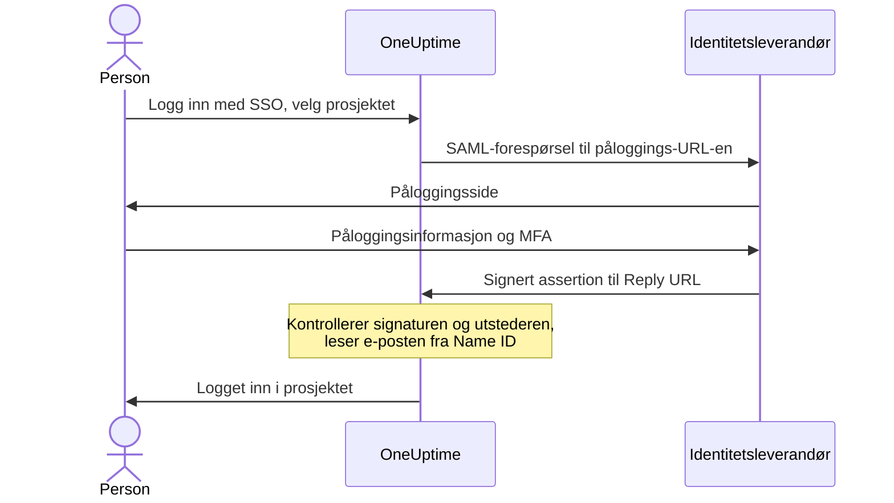

# SSO

Med single sign-on (SSO) logger personene i prosjektet ditt inn i OneUptime gjennom organisasjonens identitetsleverandør (IdP), via SAML 2.0 eller OpenID Connect. Du styrer tilgang, passord og flerfaktorautentisering på ett sted, og du kan kreve SSO for alle i prosjektet.

> [!NOTE]
> **Utgave:** SSO, inkludert "Require SSO for login", er en del av alle OneUptime-utgaver: selvhostede installasjoner får det i Community Edition, uten at det trengs lisens. På OneUptime Cloud er det tilgjengelig fra planen **Scale** og oppover. Se [Enterprise Edition](/docs/self-hosted/enterprise) for hva hver utgave inneholder.

:::cards
- [Sett opp en SAML-leverandør](#sette-opp-sso): Opprett den i OneUptime, og gi IdP-en din to URL-er.
- [Veiledninger for identitetsleverandører](#veiledninger-for-identitetsleverandører): Keycloak, Microsoft Entra ID og Okta, steg for steg.
- [OpenID Connect](#openid-connect-oidc): Logg inn via en OIDC-app i stedet.
- [Krev SSO](#krev-sso-for-prosjektet-ditt): Gjør SSO til den eneste veien inn i prosjektet.
:::

## Slik fungerer SAML-pålogging

En SAML-leverandør kobler ett prosjekt til én applikasjon i identitetsleverandøren din. Den som logger inn, velger prosjektet på OneUptime-siden **Logg inn med SSO**, logger inn hos IdP-en din og kommer tilbake innlogget.



OneUptime leser bare noen få ting fra assertionen som IdP-en din sender:

| Fra assertionen | Hva OneUptime gjør med det |
| --- | --- |
| Signatur | Kontrollerer den mot leverandørens **Offentlig sertifikat**. Svaret må være signert og må ikke være kryptert. |
| Issuer | Må samsvare nøyaktig med leverandørens **Utsteder**. |
| Name ID | Personens e-postadresse. Den må være en gyldig e-postadresse. |
| `http://schemas.microsoft.com/identity/claims/displayname` | Personens navn, som brukes når OneUptime oppretter kontoen. Valgfritt. |

Personer som logger inn for første gang, blir med i leverandørens **Team**, og de avgjør hva personen kan gjøre: se [Roller og team for SSO-brukere](#roller-og-team-for-sso-brukere).

> [!NOTE]
> På OneUptime Cloud logger ikke OneUptime inn en person som logger inn i prosjektet for første gang med en av prosjektets SAML- eller OIDC-leverandører; i stedet sender OneUptime en lenke på e-post. Personen åpner lenken, bekrefter at prosjektets single sign-on får logge vedkommende inn, og fortsetter påloggingen. Lenken gjelder i 24 timer. Dette skjer én gang per prosjekt, og på nytt hvis personen forlater prosjektet og kommer tilbake. Selvhostede installasjoner logger personer inn med en gang.

## Sette opp SSO

Du trenger tillatelse til å legge til SSO-leverandører — **Project Owner**, **Project Admin** eller **Create Project SSO** — og på OneUptime Cloud planen **Scale**. Se [veiledningene for identitetsleverandører](#veiledninger-for-identitetsleverandører) for siden hos identitetsleverandøren din.

:::steps
1. **Gå til prosjektinnstillingene**

   - Åpne OneUptime-prosjektet ditt
   - Gå til **Prosjektinnstillinger** > **Sikkerhet** > **SSO**

2. **Opprett SSO-konfigurasjonen**

   - Klikk på **Opprett SSO**
   - Skriv inn et **Navn** for SSO-konfigurasjonen (f.eks. "Keycloak SAML" eller "Okta SAML")
   - Skriv inn **Påloggings-URL** fra identitetsleverandøren din
   - Skriv inn **Utsteder** (Entity ID) fra identitetsleverandøren din
   - Lim inn **Offentlig sertifikat** fra identitetsleverandøren din
   - I steget **Pålogging** starter **Team** med medlemsteamet i prosjektet: personer som logger inn for første gang, blir med i disse teamene. Bare team du selv kunne invitert noen til, godtas: et team som gir mer tilgang enn du har, nevnes under **Team**
   - Resten er allerede fylt ut under **Flere felt**: **Signaturmetode** (`RSA-SHA256`), **Digest-metode** (`SHA256`) og en beskrivelse ("Sign in with" og navnet). Endre dem bare hvis identitetsleverandøren din krever det

3. **Hent SSO-metadataene fra OneUptime**
   - Når du lagrer, åpnes dialogen **SSO Configuration**. Du kan åpne den igjen med knappen **Vis SSO-konfigurasjon**
   - Kopier **Identifier (Entity ID)**, for eksempel `https://oneuptime.com/<project-id>/<provider-id>` — den trengs i IdP-konfigurasjonen din
   - Kopier **Reply URL (Assertion Consumer Service URL)**, for eksempel `https://oneuptime.com/identity/idp-login/<project-id>/<provider-id>` — den trengs i IdP-konfigurasjonen din
   - En ny leverandør starter avslått. Når IdP-en din har disse to verdiene, redigerer du leverandøren og slår på **Aktivert**

4. **Test leverandøren**
   - Åpne lenken i kortet **Test Single Sign On (SSO)**, og velg leverandøren på siden som åpnes. Du sendes til påloggingssiden til identitetsleverandøren din og tilbake til OneUptime, innlogget
   - Når det fungerer, kan du [kreve SSO](#krev-sso-for-prosjektet-ditt) for prosjektet
:::

## Veiledninger for identitetsleverandører

Velg identitetsleverandøren din. Hver veiledning henter verdiene fra IdP-en, oppretter leverandøren i OneUptime og gir deretter IdP-en OneUptimes **Identifier (Entity ID)** og **Reply URL**.

:::tabs
@tab Keycloak
Keycloak er en populær åpen kildekode-løsning for identitets- og tilgangsstyring. Du trenger en kjørende Keycloak-instans med et realm, og administratortilgang til både Keycloak og OneUptime.

:::steps
1. **Samle verdiene fra realmet ditt**

   - **Påloggings-URL**: `https://<your-keycloak-domain>/auth/realms/<your-realm>/protocol/saml`
   - **Utsteder**: `https://<your-keycloak-domain>/auth/realms/<your-realm>`
   - **Sertifikat**: signeringssertifikatet til realmet. Åpne `https://<your-keycloak-domain>/auth/realms/<your-realm>/protocol/saml/descriptor` og kopier verdien `X509Certificate`, eller åpne **Realm settings** > **Keys** og klikk på **Certificate** ved RS256-nøkkelen

   Keycloak 17 og nyere leverer disse URL-ene uten prefikset `/auth`. Sett sertifikatet mellom sine egne linjer, slik:

   ```text
   -----BEGIN CERTIFICATE-----
   MIICnzCCAYcCBgFyPZ8QFzANBgkqhkiG.......
   -----END CERTIFICATE-----
   ```

2. **Opprett leverandøren i OneUptime**

   Gå til **Prosjektinnstillinger** > **Sikkerhet** > **SSO**, klikk på **Opprett SSO**, og fyll ut:
   - **Navn**: et beskrivende navn (f.eks. `my-project-oneuptime`)
   - **Påloggings-URL** og **Utsteder**: verdiene ovenfor
   - **Offentlig sertifikat**: sertifikatet, mellom sine egne linjer `BEGIN CERTIFICATE` og `END CERTIFICATE`
   - **Signaturmetode** og **Digest-metode**: allerede angitt under **Flere felt** (`RSA-SHA256` og `SHA256`)

   Lagre, og kopier **Identifier (Entity ID)** og **Reply URL (Assertion Consumer Service URL)** fra dialogen som åpnes.

3. **Opprett Keycloak-klienten**

   Åpne **Clients** i realmet ditt i Keycloak, og opprett en klient eller rediger en eksisterende:
   - **Client Protocol** (klienttype): `saml`
   - **Client ID**: **Identifier (Entity ID)** fra OneUptime
   - **Root URL** og **Valid Redirect URIs**: OneUptime-URL-en din
   - **Assertion Consumer Service POST Binding URL**: **Reply URL (Assertion Consumer Service URL)** fra OneUptime

4. **Juster klientinnstillingene**

   - Sett **Name ID Format** til `email`, og slå på **Force Name ID Format**, slik at Keycloak alltid sender e-posten som Name ID
   - Slå av **Client signature required** (under **Signing keys config**) på klientens fane **Keys**: OneUptime signerer ikke forespørslene sine

5. **Slå på leverandøren, og test den**

   Rediger leverandøren i OneUptime og slå på **Aktivert**, åpne deretter lenken i kortet **Test Single Sign On (SSO)**, og velg leverandøren. Du skal bli sendt til påloggingssiden til Keycloak og tilbake til OneUptime.
:::
@tab Microsoft Entra ID
Microsoft Entra ID (tidligere Azure AD / Active Directory) er Microsofts skybaserte identitetstjeneste. Du trenger en leietaker som støtter bedriftsapplikasjoner med SAML-SSO, og administratortilgang til både Entra ID og OneUptime.

:::steps
1. **Opprett en bedriftsapplikasjon i Entra ID**

   - Logg inn i [Microsoft Entra admin center](https://entra.microsoft.com)
   - Gå til **Identity** > **Applications** > **Enterprise applications**, klikk på **+ New application** og deretter på **+ Create your own application**
   - Skriv inn et navn (f.eks. "OneUptime"), velg **Integrate any other application you don't find in the gallery (Non-gallery)**, og klikk på **Create**

2. **Kopier SAML-verdiene fra Entra ID**

   - Gå til **Single sign-on** i applikasjonen, og velg **SAML**
   - Last ned **Certificate (Base64)** under **SAML Certificates**, åpne filen i et tekstredigeringsprogram, og kopier innholdet
   - Kopier **Login URL** og **Microsoft Entra Identifier** (**Azure AD Identifier** i eldre leietakere) under **Set up OneUptime**

3. **Opprett leverandøren i OneUptime**

   Gå til **Prosjektinnstillinger** > **Sikkerhet** > **SSO**, klikk på **Opprett SSO**, og fyll ut:
   - **Navn**: et beskrivende navn (f.eks. `Azure AD SAML`)
   - **Påloggings-URL**: **Login URL**
   - **Utsteder**: **Microsoft Entra Identifier**
   - **Offentlig sertifikat**: Base64-sertifikatet, inkludert linjene `BEGIN CERTIFICATE` og `END CERTIFICATE`
   - **Signaturmetode** og **Digest-metode**: allerede angitt under **Flere felt** (`RSA-SHA256` og `SHA256`)

   Lagre, og kopier **Identifier (Entity ID)** og **Reply URL (Assertion Consumer Service URL)** fra dialogen som åpnes.

4. **Gi Entra ID URL-ene til OneUptime**

   Klikk på **Edit** under **Basic SAML Configuration**, og angi:
   - **Identifier (Entity ID)**: **Identifier (Entity ID)** fra OneUptime
   - **Reply URL (Assertion Consumer Service URL)**: **Reply URL** fra OneUptime

   Klikk på **Save**.

5. **Send e-posten som Name ID**

   Klikk på **Edit** under **Attributes & Claims**:
   - Sett **Unique User Identifier (Name ID)** til brukerens e-postadresse: `user.mail`, eller `user.userprincipalname` der det er e-postadressen
   - Sett **Name identifier format** til `Email address`
   - Legg eventuelt til et krav med navnet `http://schemas.microsoft.com/identity/claims/displayname` og kildeattributtet `user.displayname`, slik at nye kontoer får personens navn. OneUptime ignorerer de andre kravene

6. **Tildel brukere og grupper**

   Klikk på **+ Add user/group** under applikasjonens **Users and groups**, velg brukerne og gruppene som skal få SSO-tilgang, og klikk på **Assign**.

7. **Slå på leverandøren, og test den**

   Rediger leverandøren i OneUptime og slå på **Aktivert**, åpne deretter lenken i kortet **Test Single Sign On (SSO)**, og velg leverandøren. Du skal bli sendt til påloggingssiden til Microsoft og tilbake til OneUptime.
:::
@tab Okta
Okta er en mye brukt identitetsplattform med SAML-SSO. Du trenger en Okta-organisasjon med administratortilgang, og administratortilgang til OneUptime.

:::steps
1. **Opprett en SAML-applikasjon i Okta**

   - Gå til **Applications** > **Applications** i Okta Admin Console, og klikk på **Create App Integration**
   - Velg **SAML 2.0**, og klikk på **Next**, skriv inn "OneUptime" som **App name**, og klikk på **Next**
   - Okta ber om URL-ene til OneUptime før den viser sine egne. Skriv inn OneUptime-adressen din (for eksempel `https://oneuptime.com`) som **Single sign-on URL** og som **Audience URI (SP Entity ID)** inntil videre: begge erstatter du i steg 4
   - Sett **Name ID format** til `EmailAddress` og **Application username** til `Email`
   - Klikk på **Next**, velg **I'm an Okta customer adding an internal app**, og klikk på **Finish**

2. **Kopier SAML-verdiene fra Okta**

   Finn det aktive sertifikatet under **SAML Signing Certificates** på applikasjonens fane **Sign On**:
   - Klikk på **Actions** > **View IdP metadata**, og kopier **Påloggings-URL** (Identity Provider Single Sign-On URL) og **Utsteder** (Identity Provider Issuer)
   - Klikk på **Actions** > **Download certificate**, åpne filen `.cert` i et tekstredigeringsprogram, og kopier innholdet

3. **Opprett leverandøren i OneUptime**

   Gå til **Prosjektinnstillinger** > **Sikkerhet** > **SSO**, klikk på **Opprett SSO**, og fyll ut:
   - **Navn**: et beskrivende navn (f.eks. `Okta SAML`)
   - **Påloggings-URL** og **Utsteder**: verdiene fra Okta
   - **Offentlig sertifikat**: sertifikatet, inkludert linjene `BEGIN CERTIFICATE` og `END CERTIFICATE`
   - **Signaturmetode** og **Digest-metode**: allerede angitt under **Flere felt** (`RSA-SHA256` og `SHA256`)

   Lagre, og kopier **Identifier (Entity ID)** og **Reply URL (Assertion Consumer Service URL)** fra dialogen som åpnes.

4. **Gi Okta URL-ene til OneUptime**

   Klikk på **Edit** under **SAML Settings** på applikasjonens fane **General** og deretter på **Next**, og angi:
   - **Single sign-on URL**: **Reply URL (Assertion Consumer Service URL)** fra OneUptime
   - **Audience URI (SP Entity ID)**: **Identifier (Entity ID)** fra OneUptime

   Legg eventuelt til en attribute statement med navnet `http://schemas.microsoft.com/identity/claims/displayname` og verdien `user.firstName + " " + user.lastName`, slik at nye kontoer får personens navn. Klikk på **Next** og deretter på **Finish**.

5. **Tildel personer**

   Klikk på **Assign** > **Assign to People** eller **Assign to Groups** på fanen **Assignments**, velg hvem som skal få SSO-tilgang, klikk på **Assign** for hver, og deretter på **Done**.

6. **Slå på leverandøren, og test den**

   Rediger leverandøren i OneUptime og slå på **Aktivert**, åpne deretter lenken i kortet **Test Single Sign On (SSO)**, og velg leverandøren. Du skal bli sendt til påloggingssiden til Okta og tilbake til OneUptime.
:::
@tab Andre
SSO i OneUptime bruker SAML 2.0 og fungerer med alle kompatible identitetsleverandører:

:::steps
1. Hent **Påloggings-URL** (SSO-endepunktet), **Utsteder** (Entity ID) og **Offentlig sertifikat** (X.509-signeringssertifikatet) fra identitetsleverandøren din. Viser IdP-en din dem først når det finnes en applikasjon, oppretter du applikasjonen med OneUptime-adressen din som midlertidige URL-er.
2. Opprett leverandøren i OneUptime med disse verdiene, og kopier **Identifier (Entity ID)** og **Reply URL (Assertion Consumer Service URL)** fra dialogen **SSO Configuration** (eller via **Vis SSO-konfigurasjon**).
3. Sett **Assertion Consumer Service URL / Reply URL** og **Entity ID / Audience URI** til verdiene fra OneUptime i SAML-applikasjonen hos identitetsleverandøren din, og sett **Name ID Format** til e-postadresse.
4. **Signaturmetode** (`RSA-SHA256`) og **Digest-metode** (`SHA256`) er allerede angitt under **Flere felt**; endre dem bare hvis identitetsleverandøren din signerer på en annen måte
5. Slå på **Aktivert** for leverandøren, og test den med lenken i kortet **Test Single Sign On (SSO)**.
:::
:::

## OpenID Connect (OIDC)

Et prosjekt kan også logge inn via en OpenID Connect-leverandør, for eksempel Google Workspace, Okta, Microsoft Entra ID, Auth0 eller Keycloak. Du trenger tillatelse til å legge til OIDC-leverandører (**Project Owner**, **Project Admin** eller **Create Project OIDC**) og på OneUptime Cloud planen **Scale**.

:::steps
1. Registrer en app (en OIDC-klient) hos identitetsleverandøren din som får bruke authorization code-flyten med PKCE, og kopier **Utsteder-URL**, **Klient-ID** og **Klienthemmelighet**.
2. Gå til **Prosjektinnstillinger** > **Sikkerhet** > **OIDC** i OneUptime, og klikk på **Opprett OIDC**.
3. Skriv inn et **Navn** (det personer ser på påloggingssiden), **Utsteder-URL**, **Klient-ID** og **Klienthemmelighet**. Du kan også lime inn oppdagelses-URL-en til leverandøren i **Utsteder-URL** i stedet.
4. I steget **Pålogging** starter **Team** med medlemsteamet i prosjektet: personer som logger inn for første gang, blir med i disse teamene. Resten er allerede fylt ut under **Flere felt**: **Oppdagelses-URL** (utstederen etterfulgt av `/.well-known/openid-configuration`), **Omfang** (`openid email profile`), kravnavnene `email` og `name` og en beskrivelse ("Sign in with" og navnet). Endre dem bare hvis leverandøren din krever det. Bare team du selv kunne invitert noen til, godtas: et team som gir mer tilgang enn du har, nevnes under **Team**.
5. Lagre. Dialogen **OIDC Configuration** åpnes med **Redirect URI**: legg den til i appens tillatte redirect-URI-er. En ny leverandør starter avslått, så rediger den etterpå og slå på **Aktivert**.
6. Bruk lenken i kortet **Test OpenID Connect (OIDC)** til å logge inn via leverandøren før du krever SSO for prosjektet.
:::

## Roller og team for SSO-brukere

OneUptime overtar ikke roller eller grupper fra identitetsleverandøren din. Hva en person kan gjøre, følger av teamene vedkommende er med i: en leverandør legger nye personer til i sine **Team**, og du administrerer team og tillatelsene deres i OneUptime, slik [Brukere, team og tillatelser](/docs/permissions/index) beskriver. Bruk [SCIM](/docs/identity/scim) for å holde teammedlemskap i takt med identitetsleverandøren din.

Teamene til en leverandør avgjør hva personene som logger inn med den, kan gjøre, så en leverandør lagres bare med team som den som lagrer den, kunne invitert noen til. Hver lagring kontrollerer dem på nytt: en leverandør der teamene gir mer tilgang enn du har, kan bare endres av noen som har tilgang som dekker dem, for eksempel en prosjekteier. Leverandører som ble lagret før denne kontrollen, fortsetter å logge personer inn i teamene sine. Alle som får redigere en leverandør, kan fortsatt slå den av, slik at den kan stoppes umiddelbart.

## Krev SSO for prosjektet ditt

En oppsatt leverandør hindrer ingen i å logge inn med passord. For å gjøre SSO til den eneste veien inn i prosjektet bruker du bryteren **Krev SSO for innlogging** under **Prosjektinnstillinger** > **Sikkerhet** > **SSO**, under leverandørene dine:

:::steps
1. Test leverandøren din først med lenken i kortet **Test Single Sign On (SSO)**.
2. Slå på **Krev SSO for innlogging**. OneUptime spør før noe lagres: fra da av må alle i prosjektet, også du, logge inn med SSO for å åpne det, og alle som er logget inn med passord, er utestengt fra prosjektet til de logger inn med SSO.
3. Klikk på **Krev SSO** for å bekrefte. Bryteren lagres med en gang; det finnes ingen egen lagreknapp.
:::

For å slå på **Krev SSO for innlogging** trengs en leverandør som logger personer inn i prosjektet: en av prosjektets egne SAML- eller OIDC-leverandører som er slått på, eller en global leverandør som er slått på og logger personer inn i prosjektet. Uten en slik avviser OneUptime og ber deg først slå på en leverandør for prosjektet og teste den. Velger du en leverandør som prosjektet krever, må det være en av disse, og det samme spørres om når du senere krever en annen leverandør.

En lagring som sender **Krev SSO for innlogging** som slått på mens det allerede er slått på, eller som nevner leverandøren prosjektet allerede krever, kontrolleres på samme måte — API-et, Terraform og andre verktøy sender ofte alle innstillingene ved hver lagring. Så lenge prosjektet ikke har noen leverandør som logger personer inn, eller den påkrevde leverandøren er slått av siden, avvises en slik lagring derfor med de samme ordene, uansett hva annet den endrer: slå først på en leverandør, krev en annen, eller slå av **Krev SSO for innlogging**.

Et nytt prosjekt følger samme regel. Det har ingen egen leverandør ennå, så å opprette det med **Krev SSO for innlogging** allerede slått på — det kan bare en master-admin — krever en global leverandør som er slått på og logger personer inn i alle prosjekter, og uten en slik avvises det med de samme ordene. Opprett prosjektet, sett opp og test leverandøren, og slå deretter på bryteren.

Så lenge hele serveren krever SSO (**Admin** > **Innstillinger** > **Autentisering** > **Krev SSO for innlogging**), krever det å opprette et hvilket som helst prosjekt også en slik global leverandør, ellers kunne ingen, heller ikke den som oppretter det, åpne prosjektet. Uten en slik avvises opprettelsen av et prosjekt, og meldingen ber en serveradministrator slå på en. Master-admins kan fortsatt opprette prosjekter.

Å slå av **Krev SSO for innlogging** lagres så snart du slår om bryteren, og slipper medlemmer inn med passordet sitt med en gang — med mindre noen slår den på igjen i akkurat det øyeblikket; da kan en appserver bruke opptil ett minutt på å følge etter. Prosjekteiere, prosjektadministratorer og medlemmer med tillatelsen **Edit Project** kan endre den; alle andre ser bryteren låst, sammen med tillatelsen de ville trengt.

> [!NOTE]
> På OneUptime Cloud krever det planen **Scale** å kreve SSO, mens det fungerer på alle planer å slå det av. Under Scale viser **Prosjektinnstillinger** > **Sikkerhet** > **SSO** planens oppgraderingstilbud; et prosjekt som en Scale-prøveperiode etterlot med krav om SSO, finner også **Krev SSO for innlogging** der, under tilbudet, slik at det kan slås av. Å slå det på igjen krever **Scale**.

## Slå av eller slette en leverandør

| Hva du endrer | Personer som logget inn med leverandøren |
| --- | --- |
| Slå den av eller slette den | Logger inn med SSO på nytt ved neste forespørsel, der SSO kreves |
| Et nytt sertifikat eller klienthemmelighet, andre URL-er, et nytt navn eller andre team | Forblir innlogget |
| Slå den på | Kan logge inn med den med en gang |

Å slå av eller slette en SAML- eller OIDC-leverandør avslutter påloggingene den har gitt. I et prosjekt som krever SSO, selv eller fordi hele serveren gjør det:

- Alle som logget inn med den, må logge inn med SSO på nytt ved neste forespørsel, og sidene de har åpne, slutter umiddelbart å få liveoppdateringer.
- En MCP-klient som noen koblet til etter å ha logget inn med den, slutter å virke i prosjektet. Koble den til igjen etter å ha logget inn med SSO.
- Å slå på leverandøren igjen henter ikke tilbake disse påloggingene: personene logger inn med den på nytt.

Å endre alt annet ved en leverandør holder alle innlogget: et nytt sertifikat eller klienthemmelighet, andre URL-er, et nytt navn eller andre team. Påloggingene ble kontrollert da de ble gitt, og neste pålogging bruker de nye innstillingene.

Så lenge prosjektet krever SSO, holder OneUptime en vei inn åpen: du kan ikke slå av eller slette den siste leverandøren personer kan logge inn i prosjektet med — globale leverandører som logger personer inn i det, medregnet — eller leverandøren prosjektet krever. Slå først av **Krev SSO for innlogging**.

Å slå på en leverandør lar personer logge inn med den med en gang.

Når hele serveren krever SSO (**Admin** > **Innstillinger** > **Autentisering** > **Krev SSO for innlogging**), beholder hvert prosjekt en vei inn på samme måte, også et prosjekt som ikke selv krever SSO: slå først på en annen leverandør for det.

Globale leverandører følger samme regel: en endring av en global leverandør eller prosjektene som er knyttet til den, som ville etterlate et prosjekt som krever SSO uten leverandør, avvises og nevner prosjektet. Se [Global SSO](/docs/identity/global-sso#slå-av-eller-slette-en-leverandør).

Der verken prosjektet eller serveren krever SSO, stopper det nye pålogginger med leverandøren å slå den av. Personer som allerede er logget inn, forblir innlogget, akkurat som personer som logget inn med passord.

## Leverandører under planen Scale

En SAML- eller OIDC-leverandør som et prosjekt fortsatt har, fortsetter å logge personer inn etter at en Scale-prøveperiode slutter eller planen nedgraderes. Derfor viser sidene **SSO** og **OIDC** under Scale prosjektets leverandører under oppgraderingstilbudet (**SAML-leverandører som fortsatt er satt opp**, **OIDC-leverandører som fortsatt er satt opp**):

- **Slå av** stopper en leverandør med en gang. OneUptime spør først.
- **Slett** fjerner den.

Å legge til en leverandør, endre en eller slå den på igjen krever **Scale**. Hvem som kan gjøre hva, er det samme som med Scale: å slå av en leverandør krever tillatelse til å redigere den, å slette den krever tillatelse til å slette den.

Så lenge prosjektet fortsatt krever SSO, viser sidene **SSO** og **OIDC** også **Krev SSO for innlogging**: slå det av før du slår av den siste leverandøren. Inntil da kan ikke den siste leverandøren personer kan logge inn med, slås av eller slettes, slik at ingen blir utestengt fra prosjektet.

Sidene **SSO** og **OIDC** for en statusside viser statussidens egne leverandører på samme måte. Så lenge statussiden fortsatt krever SSO, viser begge sidene også **Krev SSO for innlogging**: slå det av før du slår av leverandørene, ellers kan de private brukerne ikke logge inn i det hele tatt.

## Feilsøking

:::details "SSO Config not found"
Leverandøren er slått av, eller lenken gjelder en leverandør som ikke finnes lenger. En ny leverandør starter avslått: rediger den og slå på **Aktivert**.
:::

:::details "No teams added."
Personen er ikke med i prosjektet ennå, og leverandøren har ingen **Team** å legge vedkommende til i. Rediger leverandøren og velg minst ett team, for eksempel medlemsteamet i prosjektet.
:::

:::details "Issuer URL does not match"
Issuer i assertionen fra IdP-en din er ikke leverandørens **Utsteder**. Kopier den på nytt fra IdP-en — realm-URL-en i Keycloak, **Microsoft Entra Identifier** eller Identity Provider Issuer i Okta — slik at de to samsvarer nøyaktig.
:::

:::details Påloggingen mislykkes med en signatur- eller sertifikatfeil
Lim inn IdP-ens gjeldende signeringssertifikat i **Offentlig sertifikat**, inkludert linjene `BEGIN CERTIFICATE` og `END CERTIFICATE`. For Entra ID laster du ned sertifikatet i formatet **Base64**, ikke det rå; for Okta det aktive signeringssertifikatet; for Keycloak sertifikatet fra riktig realm.
:::

:::details "Encrypted SAML Responses are not supported"
OneUptime dekrypterer ikke assertions. Slå av kryptering av assertions for applikasjonen i IdP-en din, slik at den sender en ukryptert, signert assertion.
:::

:::details "SAML response did not include a valid email address"
OneUptime leser e-postadressen fra Name ID. Sett Name ID til brukerens e-post: **Name ID Format** `email` med **Force Name ID Format** i Keycloak, **Unique User Identifier (Name ID)** i Entra ID, eller **Name ID format** `EmailAddress` og **Application username** `Email` i Okta. Adressen må samsvare med personens OneUptime-konto.
:::

:::details Entra ID: AADSTS700016
**Identifier (Entity ID)** i Entra ID samsvarer ikke med OneUptimes. Kopier den på nytt fra **Vis SSO-konfigurasjon**; de to verdiene må være identiske.
:::

:::details Okta: 404 eller en audience som ikke samsvarer
**Single sign-on URL** i Okta må være nøyaktig OneUptimes **Reply URL**, og **Audience URI** nøyaktig OneUptimes **Identifier (Entity ID)**. Kontroller at begge har erstattet de midlertidige verdiene.
:::

:::details Brukeren er ikke tildelt applikasjonen
Entra ID og Okta logger bare inn personer som er tildelt applikasjonen. Tildel brukeren eller en gruppe vedkommende er med i.
:::

:::details Keycloak: omdirigeringsløkke
Kontroller at **Valid Redirect URIs** og **Assertion Consumer Service POST Binding URL** er angitt som ovenfor, på klienten i riktig realm.
:::

## Neste steg

:::cards
- [Global SSO](/docs/identity/global-sso): Én identitetsleverandør for alle prosjekter på en selvhostet instans.
- [SCIM](/docs/identity/scim): La identitetsleverandøren din legge til og fjerne personer automatisk.
- [Brukere, team og tillatelser](/docs/permissions/index): Hva teamene nye personer blir med i, gir dem lov til.
:::
