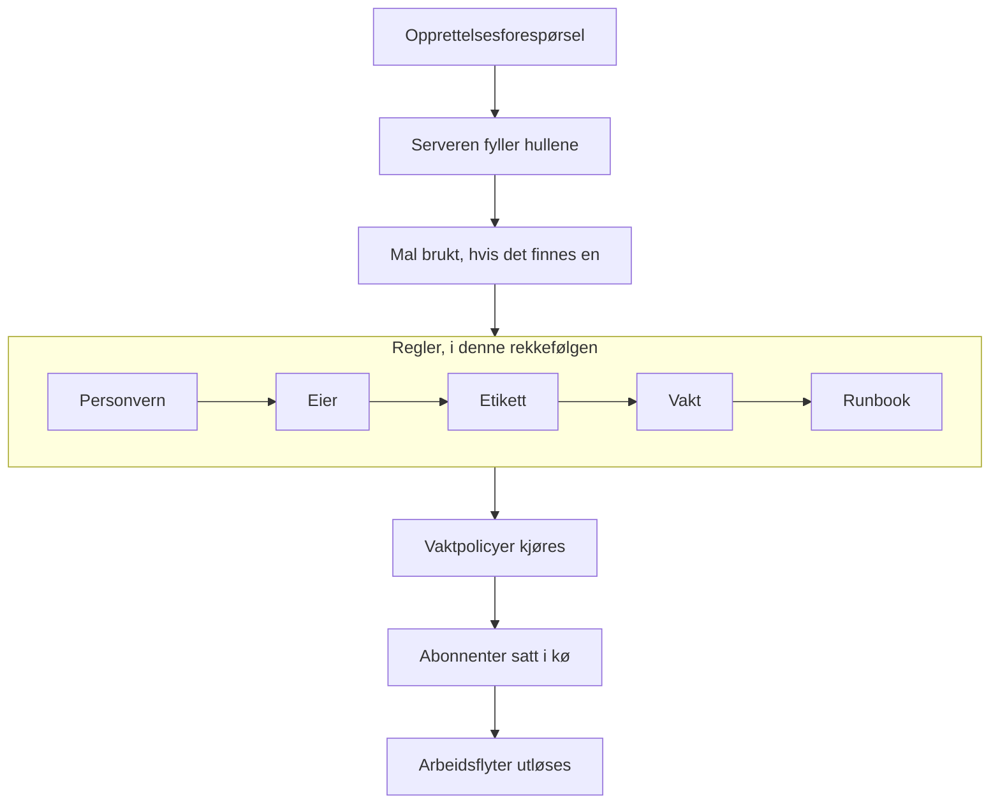

# Opprette en hendelse

Å erklære en hendelse oppretter posten teamet ditt jobber ut fra: den får et nummer, en alvorlighetsgrad og en starttilstand, vaktpolicyene tilkaller folk, og — med mindre du sier noe annet — statussidens abonnenter får høre om den. Denne siden går gjennom de fem måtene å erklære en på, felt for felt, og hva som skjer i det øyeblikket den finnes.

:::cards
- [Erklær en for hånd](#erklær-en-for-hånd): Skjemaet i tre trinn, felt for felt.
- [Erklær fra en mal](#erklær-fra-en-mal): Samme slags hendelse, forhåndsutfylt hver gang.
- [Erklær fra monitorkriterier](#erklær-automatisk-fra-monitorkriterier): La en feilende kontroll åpne den for deg.
- [Erklær via API-et](#erklær-via-api-et): Fra din egen kode, et skript eller et annet verktøy.
:::

## Fem måter en hendelse blir erklært på

Det er fem måter en hendelse kommer inn i OneUptime på, og alle ender på samme sted: en rad i tabellen `Incident` med en alvorlighetsgrad, en gjeldende tilstand og en liste over berørte ressurser. Forskjellen er bare hvem som fyller ut feltene — du klokken tre om natten, en lagret mal, kriteriene til en monitor, din egen kode som kaller API-et, eller noen utenfor teamet ditt som fyller ut et skjema.

| Hvis du vil …                                                | Velg                                                                        |
| ------------------------------------------------------------ | --------------------------------------------------------------------------- |
| Åpne en hendelse for hånd og fylle ut alt                    | Veiviseren **Erklær hendelse**                                              |
| Åpne en tilbakevendende type hendelse med feltene forhåndsutfylt | **Opprett fra mal**                                                     |
| Åpne en automatisk når kontrollene til en monitor feiler     | Et kriteriefilter på en monitor med **Når filtre samsvarer, erklær en hendelse.** |
| Åpne en fra din egen kode, et skript eller et annet verktøy  | `POST /api/incident`                                                        |
| La folk utenfor teamet ditt melde et problem via en lenke    | Et [skjema](/docs/forms/index)                                              |

Alle fem skriver den samme modellen, så en hendelse som en probe åpnet, ser nøyaktig ut som en som en vakthavende åpnet for hånd — bortsett fra noen få administrative kolonner serveren setter på de automatiske. Integrasjoner skriver den også: [Huntress](/docs/integrations/huntress) åpner én hendelse for hver hendelsesrapport som SOC-en sender.

> [!TIP]
> Du kan også erklære en hendelse fra varsler: **Erklær hendelse** på en varselliste, i overskriften til et varsel eller på siden **Tilknyttede hendelser** til et varsel åpner den samme veiviseren, forhåndsutfylt fra varslene, og knytter dem til den nye hendelsen. En avkrysningsboks på skjemaet, avkrysset som standard, bekrefter også varslene, slik at de slutter å eskalere. Se [Koblede varsler](/docs/incidents/linked-alerts).

## Erklær en for hånd

Skjemaet **Erklær ny hendelse** spør om en hendelse i tre trinn — **Hendelsesdetaljer**, **Berørte ressurser** og **Vakt og roller** — og viser deretter et sammendrag du kan gå gjennom. Når prosjektet ditt spør om noen av de egendefinerte hendelsesfeltene ved opprettelsen, kommer et fjerde trinn, **Detaljer**, rett etter **Berørte ressurser**.

:::steps
1. Åpne **Hendelser → Alle hendelser**, og klikk på **Erklær hendelse** øverst til høyre i listen **Hendelser**. Skjemaet åpner på **Hendelsesdetaljer**.
2. Skriv inn en **Tittel**, og velg en **Hendelsesalvor**. Resten av skjemaet er valgfritt.
3. Klikk deg gjennom de resterende trinnene med **Neste**, og fyll ut det du vet nå: monitorer og andre ressurser, vaktpolicyer, roller.
4. Les sammendraget, og klikk på **Erklær hendelse**. Du havner på den nye hendelsen, og **Hendelse Feed** begynner å registrere.
:::

Bare det første trinnet har påkrevde felt, pluss ethvert egendefinert felt administratorene dine har merket som **Påkrevd ved opprettelse**, som trinnet **Detaljer** spør om. Hvert trinn før sammendraget har en vanlig **Neste**, og **Erklær hendelse** står på sammendraget, det siste trinnet. Har du det travelt, fyller du ut **Hendelsesdetaljer** og trykker **Neste** gjennom de andre trinnene uten å fylle dem ut: å legge til ressurser, legge til vaktpolicyer og tildele roller kan også vente til hendelsens egne sider. Trykker du på **Enter** i et felt, går det også videre; det erklærer aldri før sammendraget.

> [!TIP]
> Alternativene de fleste hendelser aldri trenger, venter brettet sammen under en overskrift **Flere felt** på slutten av trinnet; klikk på den for å åpne dem. Mens den er brettet sammen, nevner overskriften hva som er inni og viser hvert alternativ som er satt, med verdien — satt av en mal for eksempel, eller av et privat varsel du erklærer fra — og den åpner seg av seg selv når noe i den må rettes. Sammendraget nevner bare et slikt alternativ når det er satt — unntatt **Varsle statussideabonnenter**, som det alltid nevner, med hvem som får beskjed.

**Fra en ressurs' egen side.** **Erklær hendelse** på fanen **Hendelser** for en monitor, en vert, en tjeneste, en klynge eller de fleste andre ressurser åpner det samme skjemaet med den ressursen allerede valgt på **Berørte ressurser**, så en tittel og en alvorlighetsgrad er alt som trengs, og hendelsen vises på fanen du startet fra.

:::details Hvilke ressurssider som tilbyr det, og hva de velger
**Erklær hendelse** på fanen **Hendelser** for en monitor, en vert, en Kubernetes-, Proxmox-, Ceph- eller Docker Swarm-klynge, en Docker- eller Podman-vert, en vCenter, et lagringsarray, en IoT-flåte, en database eller en tjeneste åpner den samme veiviseren med den ressursen allerede valgt på **Berørte ressurser** (en monitor under **Monitorer**, alt annet under **Andre berørte ressurser**), foran alt en mal legger til. **Opprett fra mal** på den fanen beholder også ressursen. Brødsmulestien fører tilbake via ressursens fane, og når hendelsen er erklært, havner du på den nye hendelsen, som fra listen over hendelser.

Fanen **Hendelser** for et lagerelement velger verten, tjenesten eller Kubernetes-klyngen elementet peker på, og brødsmulestien fører tilbake via den ressursens fane. **Opprett varsel** på fanen **Varsler** for en ressurs fungerer på samme måte: fra en monitor fyller den ut varselets **Overvåking**, fra alt annet **Andre berørte ressurser**.

Ressursen slås opp med dine egne tillatelser: kan du ikke lese den, eller er den slettet, åpner skjemaet ganske enkelt uten at noe er valgt.
:::

### Trinn 1 — Hendelsesdetaljer

- **Tittel** — påkrevd. Sammendraget på én linje som alle ser i listen, i Slack og (hvis hendelsen er synlig) på statussiden din. Plassholder: `Incident Title`.
- **Hendelsesalvor** — påkrevd. En av alvorlighetsgradene som er satt opp for prosjektet ditt; nye prosjekter får **Critical Incident**, **Major Incident** og **Minor Incident** på forhånd.
- **Beskrivelse** — valgfritt, skrevet i Markdown. Det er dette feltet som vises på statussiden, så skriv det for kundene og ikke for teamet ditt. Et bilde du legger inn i det, vises for alle mens hendelsen er synlig på statussider, og bare for medlemmene av prosjektet ditt mens den er skjult. Du kan redigere det senere fra **Beskrivelse** i hendelsens sidemeny.

Under **Flere felt**:

- **Erklært den** — starter på tidspunktet da du åpnet siden. Det er tidspunktet hver varighet på hendelsen måles fra, så sett det tilbake hvis du registrerer noe som begynte tidligere.
- **Innledende tilstand** — valgfritt og tomt til å begynne med. Lar du det stå tomt, starter hendelsen i tilstanden med flagget `isCreatedState`, som nye prosjekter oppretter som **Identified** — eller i malens starttilstand når du erklærer fra en mal. Velg bare en senere tilstand når du registrerer en hendelse som allerede var forbi det punktet, bekreftet eller løst. En slik hendelse tilkaller ingen — se [Erklært allerede bekreftet eller løst](#erklært-allerede-bekreftet-eller-løst).
- **Etiketter** — valgfritt. Etiketter samler beslektede hendelser slik at du kan filtrere på dem, og et team med tillatelser som er begrenset til etiketter, ser bare hendelsene som har en av etikettene.
- **Privat hendelse** — avkrysningsboks, slått av som standard (`isPrivate`). En privat hendelse er bare synlig for brukerne som eier den, medlemmene av teamene som eier den, prosjektadministratorer og prosjekteiere — og den er skjult for alle statussider, uansett enhver annen innstilling, også statussidene den er begrenset til. Listen over hendelser merker dem med et rødt merke **Private**.

> [!NOTE]
> **Varsler og episoder starter også i tilstanden du velger.** **Opprett varsel**, og **Opprett episode** i listene over hendelses- og varselepisoder, har den samme **Innledende tilstand** under **Flere felt**. Lar du den stå tom, starter varselet eller episoden i prosjektets opprettelsestilstand. Velg en senere tilstand for å registrere et som allerede var bekreftet eller løst: det starter i den tilstanden, tilstandstidslinjen begynner med den, og en episode som registreres som løst, teller som løst med en gang. Eierne får ikke beskjed om den første tilstanden for seg, og abonnentene på statussiden til en hendelsesepisode får høre om den én gang, når episoden opprettes. Et varsel eller en episode som registreres slik, tilkaller ingen, akkurat som en hendelse: se [Erklært allerede bekreftet eller løst](#erklært-allerede-bekreftet-eller-løst). Via API-et er det samme valget `currentAlertStateId` eller `currentIncidentStateId` — se [OneUptime API-referanse](/docs/api-reference/api-reference).

:::details Skrive i Markdown-redigeringsverktøyet
Beskrivelsen — som notater, rotårsak, utbedring og egendefinerte felt med formatert tekst — skrives i Markdown-redigeringsverktøyet. Det åpner i visuell modus, som viser teksten formatert; **Markdown** på verktøylinjen bytter til Markdown-modus, som viser Markdown-kilden, og **Visual** bytter tilbake. I en liste rykker **Øk innrykk** og **Reduser innrykk** på verktøylinjen, eller Tab og Shift+Tab, et punkt inn under punktet over og ut igjen; der det ikke er noe å rykke inn under, og utenfor en liste, går Tab som vanlig videre til neste felt. I visuell modus deler **Kodeblokk**, **Tabell** og **Oppgaveliste** midt i eller på slutten av en linje linjen ved markøren og legger den nye blokken på egne linjer — også i kanten av et uthevet ord, en lenke eller innebygd kode, uten å etterlate tom formatering — og **Oppgaveliste** i et listepunkt legger oppgaven til i det punktets liste i stedet for som en deloppgave. I Markdown-modus settes **Kodeblokk** og **Tabell** inn ved markøren, så start en ny linje for dem først, **Oppgaveliste** gjør markørens linje til en oppgave, og **Nummerert liste** nummererer hvert nivå i en nestet liste fra 1. Verktøylinjen holder seg på én linje: skjemaer med redigeringsverktøyet åpner i en bred dialog, så på de fleste skjermer får alle knappene plass, og der de ikke gjør det — på en telefon eller i et smalt vindu — ligger knappene som ikke får plass, under **Mer formatering** (**⋯**) på slutten av verktøylinjen, i samme rekkefølge, og hver du velger der, settes inn der markøren sto. På de smaleste skjermene flytter bryteren **Markdown** også inn dit.

**Angre.** I visuell modus angrer Ctrl+Z (Cmd+Z på en Mac) endringene dine én om gangen, den nyeste først — det du skrev og redigeringsverktøyets egne redigeringer: et økt eller redusert innrykk, en blokk det satte inn i en linje, en formatert eller blokkvis innliming — og Ctrl+Shift+Z (Cmd+Shift+Z) eller Ctrl+Y setter dem tilbake i samme rekkefølge. I Markdown-modus angrer Ctrl+Z et innrykk, endringen fra en listeknapp og en formatert innliming, men ikke det knappene **Kodeblokk**, **Tabell** og **Vannrett linje** setter inn.

**Lime inn i det.** Innliming fra Word, Google Docs eller en OneUptime-side — beskrivelsen av en annen hendelse for eksempel — beholder listene og nestingen, lenkene og formateringen, og innlimte `•`-punkttegn blir en ekte liste. Lenker som bare er et ikon, som ankeret ved siden av en overskrift på GitHub, utelates. I visuell modus blir kode eller et sitat som limes inn i en linje, en egen blokk som deler linjen, og en liste som limes inn i et listepunkt, slutter seg til det punktets liste i stedet for å nestes inni det — limt inn i det tomme punktet Enter etterlater, tar den det punktets plass — mens en kodeblokk, et sitat eller en tabell som limes inn i et punkt, blir værende i det. I Markdown-modus havner det innlimingen gjør om til blokker — kode, et sitat, en liste, en overskrift, flere avsnitt — på egne linjer, med en tom linje på hver side, når det lander midt i en linje, og en liste som limes inn på slutten av linjen til et listepunkt, eller etter en bar `- `, slutter seg til den listen ved punktets innrykk; Markdown du kopierte som ren tekst, settes inn ved markøren nøyaktig som den er. Det du limer inn i en kodeblokk, forblir nøyaktig slik du kopierte det. Innliming over en markering som spenner over flere punkter, avsnitt eller tabellceller, erstatter den, slik skriving ville gjort. I visuell modus beholder en innliming eller knappen **Kode** over tabellceller hver celle og kolonne, en innliming etterlater ingenting som et tomt punkttegn, sitat eller kodeblokk, og når markeringen slutter inne i en kodeblokk, er det bare resten av den kodelinjen som slutter seg til teksten.

**Kopiere ut av et notat.** En kodeblokk som kopieres fra et notat eller en beskrivelse, limes inn igjen som en kodeblokk i sitt språk, og det gjør også en linje av den som kopieres med linjeskiftet, slik et trippelklikk kopierer den i Chrome, Edge og Safari. Et ord eller en del av en linje som kopieres ut av en kodeblokk, limes inn som innebygd kode. I Chrome, Edge og Safari limes linjer som kopieres fra en kodevisning tegnet som en tabell — YAML-fanen for en Kubernetes-ressurs, rammene i stakksporet til et unntak — inn som ren tekst, med innrykket beholdt.
:::

### Trinn 2 — Berørte ressurser

Monitorene kommer først, for seg selv, fordi statussider ser en hendelse gjennom monitorene, og statusen monitorene endres til, står rett under dem.

- **Monitorer** — et søkefelt som legger til monitorene hendelsen berører; fanen **Etiketter** legger til alle monitorer med en etikett på én gang. En statusside viser en hendelse, og gir abonnentene beskjed om den, når den viser en av hendelsens monitorer, så det er de som avgjør hvilke statussider som får høre om den (`monitors` på hendelsen).
- **Endre overvåkingsstatus til** — valgfritt, og bare vist når minst én monitor er valgt. Velger en monitorstatus som brukes på hver monitor som er knyttet til denne hendelsen, slik at det å erklære hendelsen og merke monitorene som redusert er én handling i stedet for to. Erklærer du fra en mal som setter en, starter feltet med malens status, vist så snart du velger en monitor. Uten valgt monitor lagres ingen status, heller ikke malens; fjerner du den siste monitoren, forsvinner feltet til du velger en annen, noe som bringer valget ditt tilbake. En monitors status deles av alle statussider som viser den, så med statussider valgt under **Flere felt** minner skjemaet deg om at endringen også vises på sidene du ikke valgte.
- **Andre berørte ressurser** — et andre søkefelt for alt annet hendelsen berører: verter, Kubernetes-klynger, Docker- og Podman-verter, Proxmox-, Ceph- og Docker Swarm-klynger, vCentere, lagringsarrayer, IoT-flåter, databaser og tjenester — alt utenom monitorer som hendelsens eget kort **Berørte ressurser** tilbyr. Under panseret er dette separate relasjoner på hendelsen (`hosts`, `kubernetesClusters`, `dockerHosts`, `podmanHosts`, `services` og flere), men skjemaet slår dem sammen i én velger.

En monitor kan si hva den overvåker — **Overvåking → Oversikt → Tilkoblede ressurser**, de samme typene ressurser som **Andre berørte ressurser**. Velg en slik monitor, og det den er knyttet til, legges straks til i **Andre berørte ressurser**, og en linje under feltet nevner hva som ble lagt til. Fjern det du ikke vil ha før du erklærer: ingenting legges til på nytt for den monitoren mens du blir på skjemaet, og fjerner du monitoren, blir det den la til, stående. Det samme skjer når en monitor kommer fra en mal eller fra siden du erklærte fra, og på **Opprett varsel** og **Schedule Maintenance**.

Hendelsens kort **Berørte ressurser** spør på samme måte når du redigerer det senere: **Monitorer**, **Endre overvåkingsstatus til** så snart det er en monitor, og deretter **Andre berørte ressurser**. Lagres en hendelse uten monitor, beholder den statusen den hadde.

Under **Flere felt**:

- **Begrens til disse statussidene** — valgfritt. Lar du det stå tomt, vises hendelsen på, og gir den beskjed til abonnentene på, hver statusside som viser monitorene. Velg sider her, og bare de valgte sidene blant dem brukes; fanen **Etiketter** legger til alle sider med en etikett på én gang. Skjemaet advarer deg når en valgt side ikke viser noen av hendelsens monitorer, og når hendelsen er privat, noe som skjuler den for alle statussider. Se [Én statusside per målgruppe](/docs/status-pages/one-status-page-per-audience).
- **Varsle statussideabonnenter** — avkrysningsboks, slått på som standard. Styrer om abonnentene får beskjed om at hendelsen er opprettet (`shouldStatusPageSubscribersBeNotifiedOnIncidentCreated`). Å brette den sammen under **Flere felt** endrer ingenting ved hva den gjør: den starter fortsatt avkrysset, og sammendraget nevner den alltid. Under den, og igjen på sammendraget før du sender, viser **Will notify** statussidene som får beskjed, med et «opptil»-antall abonnenter per kanal, og sidene som ikke får beskjed, og hvorfor. Får ingen beskjed (ingen monitor er knyttet til, ingen statusside viser monitorene, eller sidene har ingen abonnenter ennå), viser den ingenting, og den advarer bare når hendelsens statussideomfang er årsaken. På sammendraget viser **Forhåndsvisning**, ved siden av **Ja**, e-posten abonnentene på hver av de statussidene får, og **Send test til meg** sender den til e-postadressen til din egen konto; se [Abonnenter og kunngjøringer](/docs/status-pages/subscribers#hendelser). Slå den av for intern støy du likevel vil ha registrert. Hendelsen forblir da stille som standard: nye offentlige notater på den, og dialogen for tilstandsendringer på oversiktssiden (**Bekreft**, **Løs** eller valg av en annen tilstand), starter med sin egen avkrysningsboks **Varsle statussideabonnenter** slått av. Det manuelle skjemaet på siden **Tilstandstidslinje** og massehandlingen **Endre tilstand** i listen over hendelser starter fortsatt med den slått på.

> [!IMPORTANT]
> **Knytt til monitorer, også når det føles overflødig.** Koblingen mellom en hendelse og en statusside går gjennom hendelsens monitorer: en statusside viser en hendelse, og gir abonnentene beskjed om den, når en av ressursene er en av hendelsens monitorer. **Begrens til disse statussidene** kan bare snevre inn den listen, aldri utvide den, og en statusside med **Vis bare hendelser som er begrenset til denne siden** slått på viser bare hendelsene som er begrenset til den. En hendelse uten monitorer gir ingen abonnent på noen statusside beskjed. Se [Statusside – ressurser og grupper](/docs/status-pages/resources-and-groups).

Flagget **Should be visible on status page?** (`isVisibleOnStatusPage`) er ikke med i veiviseren; det er sant som standard. Endre det i etterkant fra **Innstillinger** i hendelsens sidemeny, der det heter **Synlig på statussiden**.

**Erklær skjult, og publiser senere.** En hendelse som er skjult for statussider når den opprettes, gir ingen abonnent beskjed, og varselstatusen lyder **Hoppet over: skjult på statussider**. Når du senere slår på **Synlig på statussiden**, tilbyr redigeringsskjemaet **Varsle abonnenter om at denne hendelsen er opprettet**, slik at rutinen med å erklære skjult, finne ut hvem som er berørt, og så publisere, fortsatt gir dem beskjed. Den starter avkrysset mens hendelsen ikke er løst, og uten hake når den er løst, slik at det å publisere en gammel hendelse for ordens skyld ikke kunngjør den som ny. Den tilbys bare når hendelsen ble erklært med **Varsle statussideabonnenter** slått på og ikke er privat — altså ikke for en hendelse som er meldt via et [skjema](/docs/forms/on-submit), som erklæres skjult og med den slått av. Via API-et sender du `"miscDataProps": {"notifySubscribersOfIncidentCreatedOnPublish": true}` med oppdateringen som setter `isVisibleOnStatusPage` til `true`, eller setter selv `subscriberNotificationStatusOnIncidentCreated` tilbake til `Pending`. En etteranalyse som ble publisert mens hendelsen var skjult, trenger ingen avkrysningsboks: å slå på **Synlig på statussiden** sender den én gang, som beskrevet i [Abonnenter og kunngjøringer](/docs/status-pages/subscribers#hendelser).

### Detaljer — dine egendefinerte hendelsesfelt

Dette trinnet vises bare når minst ett egendefinert hendelsesfelt har **Vis ved opprettelse** slått på under **Hendelser → Innstillinger → Egendefinerte felt** — eller, når du erklærer fra en mal, når malens **Egendefinerte felt ved opprettelse** spør om et. Det spør om de feltene, i deres **Rekkefølge** — rekkefølgen de er dratt i på den innstillingssiden — med inndataene typen krever: en nedtrekksliste, et tall, en dato, en ja/nei-bryter, lang tekst eller formatert tekst i Markdown-redigeringsverktøyet. Det utelates også for noen som ikke kan lese prosjektets egendefinerte hendelsesfelt: på OneUptime Cloud krever det abonnementet **Growth** eller høyere og en rolle som kan se egendefinerte hendelsesfelt.

- Et felt som er merket **Påkrevd ved opprettelse**, må fylles ut før du kan erklære. Et påkrevd ja/nei-felt — en bekreftelse for eksempel — må være slått på.
- En 0 eller en bryter som er slått av, er et svar og lagres som det.
- Et felt der verdien kopieres fra et egendefinert monitorfelt, spørres det ikke om når hendelsen har en monitor, fordi verdien kopieres fra monitoren når hendelsen opprettes.
- Å erklære fra en mal starter trinnet med malens verdier, og malens verdier for felt trinnet ikke spør om, beholdes som de er. En verdi du tømmer i trinnet, forblir tom. En malverdi som ikke lenger passer til feltet — et alternativ i en nedtrekksliste som er fjernet siden — utelates i stedet for å avvise hendelsen.
- Å erklære fra en mal følger også malens **Egendefinerte felt ved opprettelse**. Et felt den merker som **Påkrevd** eller **Valgfritt**, spørres det om, også når prosjektet ikke viser det ved opprettelse; et felt den merker som **Skjult**, spørres det ikke om — malens verdi for det gjelder fortsatt — og et felt som står på **Standard**, følger sine egne **Vis ved opprettelse** og **Påkrevd ved opprettelse**. Se [Egendefinerte felt ved opprettelse](/docs/incidents/settings#egendefinerte-felt-ved-opprettelse).

**Påkrevd ved opprettelse** kontrolleres bare av dashbordet, og det samme gjelder en mals **Egendefinerte felt ved opprettelse**. Hendelser som opprettes av monitorer, API-et, Slack, Microsoft Teams eller KI, kan la et felt stå tomt, og hvert felt forblir valgfritt på hendelsens side **Egendefinerte felt** i etterkant, slik at det å rette én verdi midt i et avbrudd aldri krever alle de andre. Se [Egendefinerte felt](/docs/incidents/settings#egendefinerte-felt) for felttypene og innstillingene.

### Trinn 3 — Vakt og roller

- **Vaktpolicy** — et flervalg av vaktpolicyene som skal kjøres når denne hendelsen opprettes. Det tilsvarer `onCallDutyPolicies` på hendelsen.
- **Tildel hendelsesroller** — hvem som tar hver rolle prosjektet ditt definerer, ett kort per rolle. En rolle med merket **Primær** som du lar stå tom, er din: du tar den når hendelsen erklæres, og sammendraget sier det. En rolle for én person sier det når den har en; en rolle for flere beholder velgeren sin.

Dette er det eneste stedet der en vaktpolicy knyttes direkte til en hendelse. Alvorlighetsgrader har ingen vaktpolicy — alvorlighetsgraden er en etikett, og den påvirker bare tilkalling som *treffkriterium* i en vaktregel. Regler som er satt opp under **Hendelser → Regler → Vaktregler**, legger policyene sine til på toppen av det du velger her; det endelige settet som kjører, er foreningen av begge uten duplikater. En hendelse som erklæres i en senere tilstand, kjører ingen av dem — se [Erklært allerede bekreftet eller løst](#erklært-allerede-bekreftet-eller-løst).

Selve rollene settes opp under **Hendelser → Innstillinger → Hendelsesroller**. Et nytt prosjekt har én, Hendelsesleder; legg til Responder, Communications Lead eller det prosessen din ellers trenger der. Velger du ingen som Hendelsesleder, blir du det når hendelsen erklæres.

## Erklær fra en mal

Fortsetter du å erklære den samme typen hendelse — det samme tittelmønsteret, den samme alvorlighetsgraden, den samme vaktpolicyen — lagrer du den én gang som en mal og erklærer deretter fra den:

:::steps
1. Klikk på **Opprett fra mal** i listen **Hendelser** (den omrissede knappen ved siden av **Erklær hendelse**). En dialog **Opprett hendelse fra mal** åpner, med en nedtrekksliste **Velg hendelsesmal**.
2. Velg en mal. Opprettelsesskjemaet åpner forhåndsutfylt.
3. Endre det som er annerledes denne gangen, gå deretter gjennom trinnene, og erklær som vanlig.
:::

Har prosjektet ditt ingen maler ennå, får du i stedet en dialog **No Incident Templates** med en knapp **Create Template** som tar deg til **Hendelser → Innstillinger → Hendelsesmaler**.

Maler bygges med en egen veiviser i fire trinn — **Malinformasjon**, **Hendelsesdetaljer**, **Berørte ressurser**, **Vakt** — pluss trinnene **Egendefinerte felt** og **Egendefinerte felt ved opprettelse** etter **Berørte ressurser** når prosjektet ditt har egendefinerte hendelsesfelt. Malens **Innledende hendelsestilstand**, **Eiere** og **Etiketter** ligger under **Flere felt** på slutten av **Hendelsesdetaljer**. **Berørte ressurser** spør som erklæringsskjemaet gjør — **Monitorer**, deretter **Endre overvåkingsstatus til**, deretter **Andre berørte ressurser**, med **Begrens til disse statussidene** under **Flere felt** — bortsett fra at en mal alltid spør om monitorstatusen: den gjelder også monitorene som velges når en hendelse erklæres fra malen. Dette er feltene:

| Felt                            | Formål                                                 |
| ------------------------------- | ------------------------------------------------------ |
| **Malnavn**                     | Hvordan malen kjennes igjen i velgeren.                |
| **Malbeskrivelse**              | Et notat til ditt fremtidige jeg om når den skal brukes. |
| **Tittel**                      | Tittelen som forhåndsutfylles på hendelsen.            |
| **Beskrivelse**                 | Markdown-beskrivelsen som forhåndsutfylles på hendelsen. |
| **Hendelsesalvor**              | Alvorlighetsgraden som forhåndsutfylles på hendelsen.  |
| **Innledende hendelsestilstand** | Tilstanden hendelser fra denne malen starter i. Tom betyr den vanlige starttilstanden. En hendelse som starter bekreftet eller løst, tilkaller ingen. |
| **Monitorer**                   | Monitorene som skal knyttes til.                       |
| **Endre overvåkingsstatus til** | Monitorstatusen som brukes på hendelsens monitorer, også dem som velges når den erklæres. |
| **Andre berørte ressurser**     | Vertene, klyngene og tjenestene som skal knyttes til.  |
| **Begrens til disse statussidene** | Statussidene hendelsen begrenses til.               |
| **Vaktpolicy**                  | Policyene som kjøres når hendelsen opprettes.          |
| **Eiere**                       | Personer og team som eier hendelser som opprettes fra denne malen, valgt fra én liste. |
| **Etiketter**                   | Etikettene som settes på hendelsen.                    |
| **Egendefinerte felt**          | Verdier for hendelsens egendefinerte felt.             |
| **Egendefinerte felt ved opprettelse** | Hvilke egendefinerte felt trinnet **Detaljer** spør om, og hvilke som må fylles ut. |

Noen raske regler:

- Maler kan ikke redigeres fra listen over maler — du oppretter en og åpner den deretter for å endre den.
- En mal fyller bare ut et felt du lot stå tomt. På opprettelsessiden brukes malen som en forhåndsutfylling du kan overskrive; på serveren — for et skjema som erklærer fra en mal — fylles et felt bare fra malen når forespørselen lot feltet være `undefined`. Det kalleren oppga, vinner alltid.
- Trinnet **Detaljer** følger malens **Egendefinerte felt ved opprettelse**, som [beskrevet ovenfor](#detaljer-dine-egendefinerte-hendelsesfelt).
- Verdier i egendefinerte felt slås sammen ett felt om gangen. En mals verdier fyller ut de egendefinerte feltene hendelsen erklæres uten; en verdi som er satt i trinnet **Detaljer** eller sendt i forespørselens `customFields`, vinner alltid — `0`, `false` og `null` inkludert. Et felt som kopieres fra et egendefinert monitorfelt, får fortsatt monitorens verdi.
- En eksisterende mals verdier i egendefinerte felt står på kortet **Egendefinerte felt**, ved siden av de andre kortene.
- Malens **Eiere** legges til når hendelsens Slack- og Microsoft Teams-kanaler finnes, slik at en varselregel som inviterer hendelsens eiere til en ny kanal, også inviterer dem. Å erklære fra en mal i dashbordet legger dem til uten varselet «du er lagt til»; et [skjema](/docs/forms/on-submit) med en mal gir dem beskjed og holder hendelsens varsel **Hendelse opprettet** tilbake til de er lagt til, slik at det går til dem og ikke til prosjektets eiere.

## Erklær automatisk fra monitorkriterier

De fleste hendelser burde ikke kreve at et menneske skriver dem inn. Kriteriene til en monitor kan erklære en i det øyeblikket et filter samsvarer:

:::steps
1. Åpne monitoren, velg **Kriterier** i sidemenyen, og klikk på **Edit Monitoring Criteria**. (En ny monitor spør om de samme kriteriene mens du oppretter den.)
2. Slå på **Når filtre samsvarer, erklær en hendelse.** i kriteriefilteret som skal erklære. En seksjon **Opprett hendelse** vises med en knapp **Legg til hendelse** — ett kriteriefilter kan erklære mer enn én hendelse.
3. Fyll ut hendelsens felt (se nedenfor), og lagre. Neste gang filteret samsvarer, erklæres hendelsen og tilkaller vaktpolicyene sine.
:::

Hver hendelsesoppføring har:

- **Hendelsestittel** — støtter maler; plassholderen foreslår noe som `{{monitorName}} is down`.
- **Alvorlighetsgrad** — påkrevd.
- **Hendelsesbeskrivelse** — også med maler.
- **Vakt → Vaktretningslinjer** — policyene som kjøres når denne hendelsen opprettes.
- **Hendelsesroller** — hvem som tar hver rolle på hendelsen, valgt på de samme kortene som **Tildel hendelsesroller** på erklæringsskjemaet, ett per rolle. Vises når prosjektet ditt har hendelsesroller.
- **Eierskap og etiketter → Eiere** (personer og team, valgt fra én liste), **Etiketter**.
- **Flere felt → Løs hendelse automatisk** (løser hendelsen automatisk når kriteriene slutter å samsvare), **Vis hendelse på statussiden**, **Privat hendelse** og **Utbedringsnotater**.

For den fullstendige listen over `{{variable}}`-plassholdere du kan bruke i tittelen, beskrivelsen og utbedringsnotatene, se [Hendelse- og varslingsmaler](/docs/monitor/incident-alert-templating).

Hendelser som opprettes på denne måten, merkes av serveren: `isCreatedAutomatically` settes, `createdCriteriaId` registrerer hvilket kriteriefilter som utløste, og `createdByProbe` registrerer hvilken probe som så det. Alt annet ved dem oppfører seg nøyaktig som en hendelse som er erklært for hånd.

En hendelse en monitor erklærer, knyttes til det monitoren overvåker: alt konfigurasjonen nevner (verten for en vertsmonitor, klyngen for en Kubernetes-monitor, tjenestene for en loggmonitor) og alt under **Tilkoblede ressurser**. Konfigurasjonen til en nettsted- eller API-monitor nevner ingen infrastruktur, så knytt den til klyngen, vertene eller databasen bak nettstedet: hendelsene havner da på de ressursenes sider, OneUptime AI kan undersøke dem der, og KI-rettingen til klyngen eller ressursen kan handle på dem (se [AI SRE](/docs/ai/ai-sre#which-incidents-a-clusters-fixes-act-on)). Varsler en monitor oppretter, knyttes på samme måte.

## Erklær via API-et

Hendelsesmodellen eksponerer et standard CRUD-endepunkt, så `POST /api/incident` oppretter en. Autentiser med en API-nøkkel som er opprettet under **Prosjektinnstillinger → Avansert → API-nøkler**, sendt i headeren `apikey` — nøkkelen identifiserer prosjektet, så du trenger ikke å oppgi en prosjekt-ID separat.

```bash
curl -X POST https://oneuptime.com/api/incident \
  -H "apikey: $ONEUPTIME_API_KEY" \
  -H "Content-Type: application/json" \
  -d '{
    "data": {
      "title": "Checkout latency above SLO",
      "description": "Investigating elevated p99 latency on the checkout service.",
      "incidentSeverityId": "<incident-severity-id>"
    }
  }'
```

Nyttige felt i forespørselens body:

| Felt                     | Påkrevd | Merknader                                                                                                                                                                                                                                   |
| ------------------------ | ------- | ------------------------------------------------------------------------------------------------------------------------------------------------------------------------------------------------------------------------------------------- |
| `title`                  | Ja      | Hendelsens tittel.                                                                                                                                                                                                                          |
| `incidentSeverityId`     | Ja      | En av prosjektets alvorlighetsgrader. Serveren kontrollerer at den hører til samme prosjekt som API-nøkkelen, og avviser forespørselen hvis ikke.                                                                                          |
| `declaredAt`             | Nei     | Valgfritt her, selv om skjemaet krever det. Utelater du det, bruker serveren gjeldende tidspunkt.                                                                                                                                           |
| `currentIncidentStateId` | Nei     | Tilstanden det skal startes i; utelatt opprettelsestilstanden. Kontrolleres mot API-nøkkelens prosjekt, som alvorlighetsgraden. Den samme kontrollen gjelder monitorstatusen bak **Endre overvåkingsstatus til**.                          |
| `statusPages`            | Nei     | ID-ene til statussidene hendelsen begrenses til, alle fra samme prosjekt. Utelat det for å nå hver statusside som viser hendelsens monitorer. `isScopedToStatusPages` utledes av det, og en verdi du sender for det, ignoreres. Se [Én statusside per målgruppe](/docs/status-pages/one-status-page-per-audience). |
| `customFields`           | Nei     | Hendelsens verdier i egendefinerte felt med hvert felts navn som nøkkel. Hver verdi du sender, må passe til feltet — et tall for et felt **Antall**, et av alternativene for en **Nedtrekksliste (enkeltvalg)** — ellers avvises forespørselen med en feil `400` som nevner feltet. **Påkrevd ved opprettelse** kontrolleres ikke her. Se [Verdier i egendefinerte felt via API-et](/docs/incidents/settings#verdier-i-egendefinerte-felt-via-api-et). |

En API-nøkkel kan ikke erklære fra en mal: en forespørsel som sender `createdIncidentTemplateId`, avvises. OneUptime setter den kolonnen selv, for hendelser som meldes via et [skjema](/docs/forms/on-submit), og for trinnet **Create One Incident** i en arbeidsflyt, som erklærer fra malen som er valgt under innstillingen **Incident Template** (se [Arbeidsflyt-komponenter](/docs/workflows/components)). For å erklære fra en mal via API-et leser du malen fra `/api/incident-templates` og sender verdiene i forespørselen.

Relaterte endepunkter er `/api/incident-state`, `/api/incident-severity` og `/api/incident-state-timeline`. Den genererte [API-referansen](/reference) har den nøyaktige formen på forespørsel og svar for hvert av dem, også hvordan relasjonsfelt som monitorer uttrykkes.

## Meld via et skjema

Den femte veien inn er for folk utenfor teamet ditt. Et skjema er en side du deler som en lenke: alle som har den, kan melde et problem uten en OneUptime-konto, og hver innsending erklærer en hendelse. Du bestemmer hva skjemaet spør om — en tittel, en beskrivelse, en alvorlighetsgrad, monitorer, egendefinerte felt, egne spørsmål — og hvordan svarene blir til hendelsen: en standard alvorlighetsgrad, en hendelsesmal å erklære fra, og monitorer, etiketter, vaktpolicyer og eiere som alltid legges til.

Hendelser som meldes på denne måten, erklæres skjult for statussider, med **Varsle statussideabonnenter** slått av, slik at en vakthavende vurderer dem før noe blir offentlig, og et privat notat registrerer hvem som meldte dem. Skjemaer er et eget produkt, under **Skjemaer** i menyen **Produkter**, og kan også planlegge vedlikeholdshendelser; se [Skjemaer](/docs/forms/index).

## Hendelsesnumre og prefikser

Hver hendelse får et fortløpende nummer fra en teller per prosjekt, som serveren tildeler ved opprettelsen. To kolonner inneholder det: `incidentNumber` (det rå heltallet) og `incidentNumberWithPrefix` (det du faktisk ser). Uten prefiks er den viste verdien `#42`.

:::steps
1. Gå til **Hendelser → Innstillinger → Nummerprefiks**, og klikk på **Oppdater**.
2. Skriv prefikset i **Nummerprefiks for hendelse**. Feltet forhåndsviser nummeret mens du skriver: `INC-` gjør det til `INC-42`. La det stå tomt for å beholde standarden `#`.
3. Klikk på **Lagre endringer**. Hendelser som erklæres fra nå av, får det nye prefikset; eksisterende hendelser beholder numrene sine.
:::

Den samme dialogen har **Nummerprefiks for hendelsesepisode** for nummerering av episoder. [Nummerprefikser](/docs/incidents/settings#nummerprefikser) nevner reglene et prefiks følger.

Nummeret vises som den første kolonnen i listen over hendelser, lenker til hendelsen og vises som **Hendelsesnummer** på hendelsens **Oversikt**.

## Hva som skjer i det øyeblikket en hendelse erklæres

Opprettelseskallet gjør mer enn å skrive en rad:



I rekkefølge:

1. **Serveren fyller hullene.** `declaredAt` er som standard nå, den gjeldende tilstanden er som standard prosjektets tilstand med `isCreatedState`, og hendelsesnummeret og nummeret med prefiks tildeles fra prosjektets teller.
2. **En mal brukes** når et skjema eller trinnet **Create One Incident** i en arbeidsflyt erklærer hendelsen fra en (`createdIncidentTemplateId`) — og fyller bare ut felt kalleren lot være undefined; en tilstand kalleren nevner, vinner over malens. Dashbordet bruker i stedet en mal i skjemaet, før forespørselen sendes.
3. **Personvernregler kjører** og gjør hendelsen privat når en samsvarende regel sier det. Det er den første regelmotoren som kjører, så alt etter den ser riktig personverninnstilling.
4. **Eierregler kjører** og legger til brukerne og teamene som samsvarende regler nevner som eiere.
5. **Etikettregler kjører** og legger til etikettene som passer til hendelsen.
6. **Vaktregler kjører.** Hver aktivert regel under **Hendelser → Regler → Vaktregler** der kriteriene samsvarer, legger policyene sine til hendelsen. Det finnes ingen prioritetsrekkefølge og ingen kortslutning — alle samsvarende regler utløses, og policyene fjernes for duplikater.
7. **Runbook-regler kjører** og knytter til og starter samsvarende runbooks. Se [Runbooks](/docs/runbooks/index).
8. **Vaktpolicyer kjøres.** Hver policy på hendelsen — valgt i veiviseren, arvet fra en mal eller lagt til av en regel — kjøres parallelt med hendelsestypen `IncidentCreated`. Feiler én policy, stopper ikke det de andre. En arkivert policy tilkaller ingen: kjøringsloggen på hendelsen sier at den ikke ble kjørt fordi policyen er arkivert. En hendelse som erklæres allerede bekreftet eller løst, kjører ingen av dem; se [Erklært allerede bekreftet eller løst](#erklært-allerede-bekreftet-eller-løst) nedenfor.
9. **Abonnenter settes i kø** hvis **Varsle statussideabonnenter** ble stående slått på og hendelsen er synlig på statussiden. Leveringen håndteres av en bakgrunnsjobb, ikke innenfor forespørselen din, og går til statussidene hendelsen når: de som viser monitorene, snevret inn av **Begrens til disse statussidene**, og uten sidene som bare viser hendelser som er begrenset til dem, når den ikke er begrenset. En arkivert statusside sender ingenting. Fremdriften vises som **Abonnentvarselsstatus** på hendelsens **Oversikt**: hva som ble sendt og hva som feilet på hver statusside, og **Prøv på nytt** eller **Send på nytt** når det er avsluttet. Se [Abonnenter og kunngjøringer](/docs/status-pages/subscribers).
10. **Arbeidsflyter utløses.** Utløseren **On Create Incident** starter enhver arbeidsflyt som er bygget på den. Se [Oversikt over arbeidsflyter](/docs/workflows/index).

Derfra er hendelsen live: den teller med i merket **Aktive hendelser** i sidemenyen til Hendelser (enhver tilstand over den løste tilstanden din teller som aktiv), den vises på statussidene som viser en av monitorene (bare de valgte, hvis du begrenset den), og **Tilstandstidslinje** begynner å registrere.

### Erklært allerede bekreftet eller løst

Å velge en senere **Innledende tilstand** — på skjemaet, via en mals **Innledende hendelsestilstand** eller med `currentIncidentStateId` fra API-et, Terraform eller en arbeidsflyt — registrerer en hendelse som noen allerede håndterer, eller som allerede er over. Den behandles ikke som en ny nødsituasjon:

```mermaid title="Hva en ny hendelse setter i gang, etter tilstanden den starter i"
flowchart TB
    start{"Starttilstand"} -->|"Opprettelsestilstanden, standarden"| live["Behandlet som ny: tilkaller vakten"]
    start -->|"Ved eller etter bekreftet"| acked["Registrert: tilkaller ingen"]
    start -->|"Ved eller etter løst"| over["Registrert som over"]
    over --> quiet["Ingen gruppering, runbooks, KI, kanal eller SLA"]
```

- **Ved eller etter den bekreftede tilstanden din** — **Bekreftet**, eller enhver tilstand som står under den i **Hendelser → Innstillinger → Hendelsesstatus** — kjører ingen vaktpolicy, så ingen tilkalles. Hendelsen nevner fortsatt policyene sine, dem du valgte og dem vaktregler legger til, og feeden sier hvorfor på én linje: _No one was paged. This incident was created already acknowledged, so its on-call policy **Primary** was not run._ SLA-en, hvis en regel gir den en, starter allerede som besvart. Alt annet nedenfor kjører som for enhver ny hendelse.
- **Ved eller etter den løste tilstanden din** — **Løst**, eller enhver tilstand som står under den — er hendelsen over, så i tillegg kjører ingenting som reagerer på en live hendelse:
  - den grupperes ikke i en episode, som kunne tilkalle igjen;
  - ingen runbook-regel og ingen regel for automatisk utbedring handler på den;
  - OneUptime AI undersøker den ikke — kortet **AI Investigation** sier at den ble opprettet allerede løst, og **Ask OneUptime AI** under det svarer fortsatt på spørsmål om den;
  - det opprettes ingen Slack- eller Microsoft Teams-kanal for den;
  - monitorene beholder statusen sin og fortsetter å bli overvåket, uansett hva **Endre overvåkingsstatus til** sier;
  - det startes ingen SLA for den.
- **Hva som fortsatt skjer:** personvern-, eier-, etikett- og vaktregler kjører, eierne legges til og får beskjed om at den er opprettet, oppføringen **Hendelse opprettet** skrives i feeden og publiseres i Slack- og Microsoft Teams-kanalene reglene dine nevner, og statussidens abonnenter får beskjed når **Varsle statussideabonnenter** er slått på og hendelsen vises på statussiden deres. En hendelse som allerede er over, er fortsatt nytt for dem.

Varsler, varselepisoder og hendelsesepisoder følger samme regel: en som opprettes allerede bekreftet, tilkaller ingen, og en som opprettes løst, blir heller ikke gruppert, utbedret eller undersøkt av KI og får ingen egen kanal. En hendelse eller et varsel i opprettelsestilstanden — standarden, og hver en som en monitor åpner — setter i gang alt som før.

## Feilsøking

:::details Erklæringen feiler og ber om en opprettelsestilstand for hendelser
Har prosjektet ditt ingen tilstand med flagget `isCreatedState`, feiler opprettelseskallet og ber deg legge til en opprettelsestilstand for hendelser fra innstillingene. Det skjer normalt bare i et prosjekt der tilstandene er kraftig redigert — se [Hendelsestilstander og alvorlighetsgrader](/docs/incidents/states-and-severities).
:::

:::details Hendelsen ble erklært, men ingen abonnent på statussiden fikk høre om den
Kontroller i denne rekkefølgen: **Varsle statussideabonnenter** var slått på; hendelsen har minst én monitor knyttet til seg, og en statusside viser den monitoren; hendelsen er synlig på statussider og ikke privat; og siden er ikke utelatt av **Begrens til disse statussidene**. **Abonnentvarselsstatus** på hendelsens **Oversikt** sier hvilken av dem som stoppet den.
:::

:::details Trinnet Detaljer med de egendefinerte feltene våre vises ikke
Trinnet vises bare når et felt har **Vis ved opprettelse** slått på, eller en mals **Egendefinerte felt ved opprettelse** spør om et, og bare for noen som kan lese prosjektets egendefinerte hendelsesfelt — på OneUptime Cloud krever det abonnementet **Growth** eller høyere.
:::

## Hva du kan lese videre

:::cards
- [Hendelsestilstander og alvorlighetsgrader](/docs/incidents/states-and-severities): Hva tilstandsflaggene gjør, og hvordan du legger til dine egne.
- [Hendelsesnotater, eiere og feed](/docs/incidents/notes-owners-and-feed): Offentlige notater, private notater, eiere og aktivitetsfeeden.
- [Hendelsesinnstillinger og automatisering](/docs/incidents/settings): Maler, egendefinerte felt, roller, regler og utløsere for arbeidsflyter.
- [Abonnenter og kunngjøringer](/docs/status-pages/subscribers): Hvem som får høre om hendelsen du nettopp erklærte.
:::
