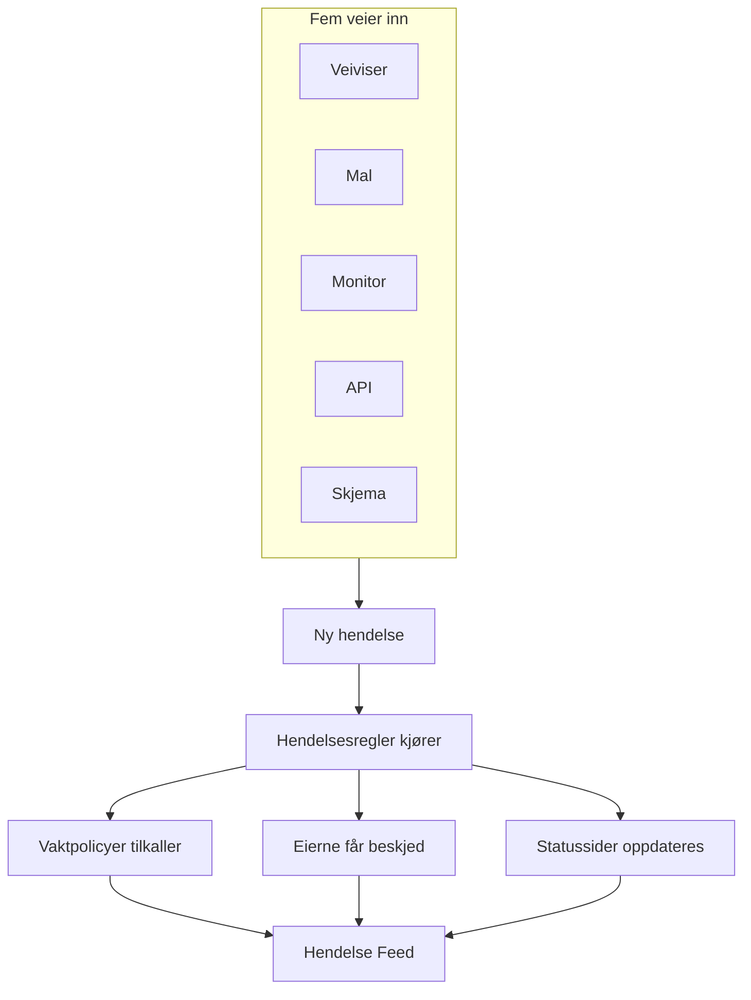
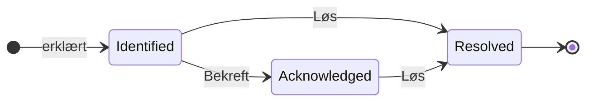

# Hendelser – Oversikt

En hendelse er posten teamet ditt jobber ut fra når noe ryker: hva som er berørt, hvor ille det er, hvor langt responsen har kommet, hvem som eier den, og alt som skrives ned underveis. Å erklære én tilkaller riktig vaktrotasjon, gir eierne beskjed og — hvis du vil — legger avbruddet ut på statussiden din, slik at kundene vet at du jobber med saken.

:::cards
- [Opprette en hendelse](/docs/incidents/declaring-incidents): For hånd, fra en mal, fra en monitor, via API-et eller via et skjema.
- [Hendelsestilstander og alvorlighetsgrader](/docs/incidents/states-and-severities): Livssyklusen, og hva bekreftelse og løsning gjør.
- [Hendelsesnotater, eiere og feed](/docs/incidents/notes-owners-and-feed): Oppdateringer til kunder og til teamet ditt, og hvem som får høre om dem.
- [Koblede varsler](/docs/incidents/linked-alerts): Knytt varslene et avbrudd utløste til hendelsen som forklarer dem.
- [Hendelsesinnstillinger og automatisering](/docs/incidents/settings): Maler, egendefinerte felt, roller, målinger og regler.
:::

## Kort fortalt

- **Et eget produkt** — åpne **Hendelser** fra menyen **Produkter** i topplinjen; listen ligger på `/dashboard/{projectId}/incidents`.
- **Tre forhåndsopprettede tilstander** — **Identified**, **Bekreftet** og **Løst** opprettes for hvert nytt prosjekt. Du kan legge til dine egne; de tre forhåndsopprettede kan gis nytt navn og ny farge, men aldri slettes.
- **Tre forhåndsopprettede alvorlighetsgrader** — **Critical Incident**, **Major Incident** og **Minor Incident**. En alvorlighetsgrad er en etikett med en farge og en rekkefølge — den har ingen egen atferd.
- **Fem veier inn** — veiviseren **Erklær hendelse**, **Opprett fra mal**, en kriterieregel på en monitor, `POST /api/incident` eller et [skjema](/docs/forms/index) som alle med lenken kan fylle ut.
- **Nummerert per prosjekt** — hver hendelse får et hendelsesnummer fra en teller per prosjekt, vist med prosjektets prefiks: `INC-42` i et nytt prosjekt, eller `#42` uten prefiks.
- **To slags notater** — private notater (interne notater) for teamet ditt, offentlige notater for statussidens abonnenter.
- **Varsler knyttes til hendelser** — knytt varslene som hører til en hendelse, eller erklær en hendelse rett fra varsler — fra en varselliste eller fra et varsels egen side — og bekreft dem samtidig. Se [Koblede varsler](/docs/incidents/linked-alerts).
- **Innstillingene ligger under Hendelser, ikke under Prosjektinnstillinger** — tilstander, alvorlighetsgrader, maler, egendefinerte felt og regelmotorene ligger alle under **Hendelser → Innstillinger** og **Hendelser → Regler**.

## Slik fungerer det

Du kan erklære en hendelse for hånd klokken tre om natten, eller la en monitor erklære den i det øyeblikket kriteriene samsvarer. Uansett er hendelsen det samme objektet, med den samme livssyklusen og det samme papirsporet til slutt.

### 1. Den blir erklært

Fem veier fører til det samme objektet:

- **For hånd** — klikk på **Erklær hendelse** i listen over hendelser. Det åpner veiviseren **Erklær ny hendelse**, som har tre trinn: **Hendelsesdetaljer**, **Berørte ressurser**, **Vakt og roller**. Det første trinnet spør om en tittel, en alvorlighetsgrad og en beskrivelse, og det de fleste hendelser aldri trenger, er brettet sammen under **Flere felt**. Bare det første trinnet spør om noe du må svare på: **Neste** går gjennom resten, og **Erklær hendelse** står på sammendraget til slutt.
  - **Fra varsler** — **Erklær hendelse** på et utvalg varsler, eller i overskriften til ett varsel, åpner den samme veiviseren, forhåndsutfylt fra varslene, knytter dem til den nye hendelsen og bekrefter dem, med mindre du fjerner haken, slik at de slutter å eskalere — se [Koblede varsler](/docs/incidents/linked-alerts).
- **Fra en mal** — klikk på **Opprett fra mal** og velg en lagret **Hendelse Mal**. Maler forhåndsutfyller tittel, beskrivelse, alvorlighetsgrad, starttilstand, ressurser, vaktpolicyer, eiere og etiketter.
- **Fra en monitor** — en kriterieregel på en monitor med bryteren «erklær en hendelse» slått på oppretter hendelsen automatisk i det øyeblikket filtrene samsvarer. Titler og beskrivelser støtter der `{{variable}}`-maler.
- **Via API-et** — `POST /api/incident` med en API-nøkkel. Serveren fyller ut `declaredAt`, opprettelsestilstanden og hendelsesnummeret for deg.
- **Via et skjema** — noen utenfor teamet ditt fyller ut et skjema du har delt som en lenke, uten en OneUptime-konto. Hendelsen erklæres skjult for statussider, fra skjemaets hendelsesmal hvis det har en. Se [Skjemaer](/docs/forms/index).

Integrasjoner åpner også hendelser: [Huntress](/docs/integrations/huntress) gjør hver hendelsesrapport som SOC-en sender, til én hendelse, som tilkaller vaktpolicyene du velger. Se [Opprette en hendelse](/docs/incidents/declaring-incidents) for gjennomgangen felt for felt.

### 2. De riktige personene får vite det

Ved opprettelsen kjører OneUptime automatiseringen du har satt opp: personvernregler, eierregler, etikettregler, vaktregler og runbook-regler. Alle vaktpolicyer som er knyttet til hendelsen — for hånd, fra en mal eller lagt til av en vaktregel som samsvarer — kjøres parallelt.

Eierne får beskjed via kanalene hver av dem har slått på under **Brukerinnstillinger → Varselinnstillinger**: e-post, SMS, taleanrop, push, WhatsApp, Telegram, Slack, Microsoft Teams eller webhook. Har en hendelse ingen eiere i det hele tatt, går varselet til prosjektets eiere i stedet for å gå tapt.

Er hendelsen synlig på en statusside, og er varsler til abonnenter slått på, får abonnentene også beskjed: abonnentene på hver statusside som viser en av monitorene, eller bare dem på sidene du har begrenset den til. Se [Én statusside per målgruppe](/docs/status-pages/one-status-page-per-audience) for å gi hver målgruppe sin egen statusside.

> [!NOTE]
> Varsler sendes av en planlagt jobb som kjører hvert minutt, så regn med opptil omtrent ett minutts forsinkelse i stedet for en umiddelbar sending.

### 3. Teamet ditt jobber med den

De som responderer, bekrefter hendelsen, legger til berørte ressurser, knytter varslene som hører til den, kjører runbooks, tildeler hendelsesroller og skriver ned det de finner ut — private notater til teamet, offentlige notater til kundene, pluss sidene **Rotårsak** og **Utbedring** når bildet blir klarere. Alt de gjør, havner i **Hendelse Feed** på siden **Oversikt**.

### 4. Den blir løst

Et klikk på **Løs** flytter hendelsen til den løste tilstanden, registrerer det i tilstandstidslinjen, stopper varighetsklokken, gir fra seg monitorene den holder, og fjerner hendelsen fra den aktive delen av enhver statusside den ble vist på. Ingenting annet trenger å endres — en statusside viser bare hendelser i en tilstand over den løste tilstanden. Se [Hva løsning gjør](/docs/incidents/states-and-severities#hva-løsning-gjør).

Deretter kan du skrive en etteranalyse og eventuelt publisere den på statussiden.

## Nøkkelbegreper

En håndfull ord går igjen på hver annen side i denne delen. Få dem på plass først.

| Begrep                 | Hva det betyr                                                                                                                                       |
| ---------------------- | --------------------------------------------------------------------------------------------------------------------------------------------------- |
| **Hendelse**           | Selve posten — tittel, beskrivelse, alvorlighetsgrad, gjeldende tilstand, berørte ressurser og alt som skrives på den under responsen.              |
| **Hendelsestilstand**  | Hvor hendelsen er i livssyklusen sin. En rad i prosjektet med navn, farge og `order`, pluss flaggene som gir den mening.                            |
| **Hendelsens alvorlighetsgrad** | Hvor ille det er. En rad i prosjektet med navn, farge og `order`. Ren klassifisering — ingenting i produktet behandler én alvorlighetsgrad spesielt. |
| **Hendelsesnummer**    | En teller per prosjekt, vist som `#42`, eller med et prefiks du setter opp, som `INC-42`.                                                           |
| **Berørte ressurser**  | Monitorene, vertene, Kubernetes-klyngene, Docker-vertene, tjenestene og annen infrastruktur du knytter til hendelsen.                              |
| **Offentlig notat**    | En oppdatering skrevet for statussidens lesere og abonnenter. Den vises på statussidens tidslinje.                                                  |
| **Privat notat**       | Et internt notat (modellen `IncidentInternalNote`) for teamet som responderer. Det når aldri en statusside.                                         |
| **Eier**               | En bruker eller et team med ansvar for hendelsen. Eierne får beskjed når den opprettes, når det publiseres notater, og når tilstanden endres.         |
| **Hendelse Feed**      | Aktivitetstidslinjen du bare kan legge til i, på hendelsens **Oversikt**, med tilstandsendringer, notater, eierendringer, regelkjøringer og varsler. |
| **Tilstandstidslinje** | Oversikten over hvilken tilstand hendelsen var i, når og hvor lenge — med abonnentenes varselstatus for hver overgang.                              |
| **Tilknyttet varsel**  | Et varsel som er knyttet til hendelsen som en del av responsen. Et varsel kan være knyttet til mer enn én hendelse og beholder sin egen tilstand.    |

## De tre tilstandene OneUptime oppretter for hvert prosjekt

Når et prosjekt opprettes, oppretter OneUptime nøyaktig tre hendelsestilstander, i denne rekkefølgen:

| Tilstand         | Rekkefølge | Farge              | Hva den betyr                                                             |
| ---------------- | ---------- | ------------------ | ------------------------------------------------------------------------- |
| **Identified**   | 1          | Rød (`#fd625e`)    | Tilstanden en helt ny hendelse havner i. Dette er opprettelsestilstanden. |
| **Bekreftet**    | 2          | Gul (`#ffbf53`)    | Noen har tatt hendelsen og jobber med den.                                |
| **Løst**         | 3          | Grønn (`#2ab57d`)  | Hendelsen er over. Det er løsningen som tar den bort fra statussiden din. |

Navnene er bare etiketter — det som faktisk styrer atferden, er tre booleans på tilstandens rad: `isCreatedState`, `isAcknowledgedState` og `isResolvedState`. Det forventes bare én tilstand per prosjekt med hvert flagg.

Det skillet betyr mer enn det høres ut som:

- `isCreatedState` avgjør hvor en ny hendelse starter. Velges ingen tilstand uttrykkelig ved opprettelsen, finner OneUptime prosjektets opprettelsestilstand og bruker den.
- `isAcknowledgedState` og `isResolvedState` markerer den bekreftede og den løste tilstanden. Hvor en hendelses tilstand står i forhold til dem, styrer knappene **Bekreft** og **Løs** i hendelsens overskrift, de to statistikkflisene på hendelsens **Oversikt** og telleren **Aktive hendelser** i sidemenyen: en hendelse i den bekreftede tilstanden eller en senere tilstand er bekreftet, og en hendelse i den løste tilstanden eller en senere tilstand er løst.
- **Aktive hendelser** er utelukkende definert som «den gjeldende tilstanden står over den løste tilstanden». En egen tilstand du legger til over den løste tilstanden, er derfor aktiv; en du plasserer etter den, teller som løst, slik den løste tilstanden selv gjør.

> [!NOTE]
> Den første forhåndsopprettede tilstanden heter **Identified**, selv om flere beskrivelser i produktet fortsatt kaller den opprettelsestilstanden («created»). Ser du etter «Created» i prosjektets liste over tilstander, er det raden som heter **Identified**.

Du kan legge til dine egne tilstander under **Hendelser → Innstillinger → Hendelsesstatus**. En ny tilstand legges til rett over den løste tilstanden, og du drar radene for å endre rekkefølgen; kolonnen **Teller som** viser hva en hendelse i hver tilstand teller som — ikke bekreftet, bekreftet eller løst. De tre tilstandene med flagg har merket **Innebygd**: de beholder rekkefølgen sin og kan ikke slettes, men du kan gi dem nytt navn og ny farge og flytte dem, og derfor leser grensesnittet tilstandsnavn dynamisk.

Rekkefølgen håndheves og er ikke kosmetisk: en hendelse kan ikke gå til en tilstand som står tidligere i rekkefølgen enn den nåværende. Alle detaljer står i [Hendelsestilstander og alvorlighetsgrader](/docs/incidents/states-and-severities).

## De tre alvorlighetsgradene OneUptime oppretter for hvert prosjekt

Hvert nytt prosjekt får også tre alvorlighetsgrader:

| Alvorlighetsgrad      | Rekkefølge | Farge                    | Hva den betyr                                               |
| --------------------- | ---------- | ------------------------ | ----------------------------------------------------------- |
| **Critical Incident** | 1          | Mørkerød (`#b70400`)     | Svært stor påvirkning på kundene, som krever umiddelbar respons. |
| **Major Incident**    | 2          | Rød (`#fd625e`)          | Betydelig påvirkning, som vanligvis krever umiddelbar respons. |
| **Minor Incident**    | 3          | Gul (`#ffbf53`)          | Liten påvirkning, vanligvis håndtert i arbeidstiden.        |

Alvorlighetsgrader har `name`, `description`, `color` og `order` og ingenting annet. Det finnes ingen flagg, og ingen kodebane behandler «Critical Incident» annerledes enn noen annen rad. Alvorlighetsgraden er hvordan mennesker prioriterer, og den kan brukes som treffkriterium når du skriver vaktregler — men å velge en alvorlighetsgrad tilkaller ikke i seg selv noen.

Rediger eller legg til alvorlighetsgrader under **Hendelser → Innstillinger → Hendelsesalvor**. De fullstendige forhåndsopprettede beskrivelsene står i [Hendelsestilstander og alvorlighetsgrader](/docs/incidents/states-and-severities).

## Hvor hendelsene ligger i dashbordet

Åpne **Hendelser** fra menyen **Produkter** i topplinjen. Sidemenyen er delt inn i seksjoner:

| Seksjon       | Hva du gjør der                                                                                                                                                            |
| ------------- | -------------------------------------------------------------------------------------------------------------------------------------------------------------------------- |
| **Oversikt**  | **Alle hendelser** og **Aktive hendelser** — sistnevnte har et rødt merke med antallet hendelser i en tilstand over den løste tilstanden.                                   |
| **Episoder**  | Hendelsesepisoder, en egen grupperingsfunksjon med egne sider.                                                                                                            |
| **KI**        | **Innsikt**, **Logger**, **Innstillinger**: hva OneUptime AI har lært av hendelsene dine og alt den har gjort for dem, og hva den kan gjøre på egen hånd — med reglene for hvilke hendelser den undersøker og retter. Se [AI SRE](/docs/ai/ai-sre). |
| **Arbeidsområde** | Chatarbeidsområdene prosjektet har koblet til: **Slack**, **Microsoft Teams** eller begge, hver med sine varselregler for hendelser. Er ingen av dem koblet til, inneholder den **Koble til Slack eller Teams**, en side som viser begge og hvordan de kobles til. |
| **Integrasjoner** | Verktøy som selv åpner hendelser: **Huntress**, der hendelsesrapportene blir hendelser som tilkaller vakten. Se [Huntress](/docs/integrations/huntress). |
| **Regler**    | Regelmotorene: **Grupperingsregler**, **Vaktregler**, **Eierregler**, **Runbook-regler**, **Personvernregler**, **Etikettregler**, **SLA-regler**, **Reminder Rules**. |
| **Innstillinger** | **Hendelsesstatus**, **Hendelsesalvor**, **Hendelsesmaler**, **Notatmaler**, **Postmortem-maler**, **Egendefinerte felt**, **Hendelsesroller**, **Målinger**, **Tilknyttede varsler**, **Nummerprefiks**. |

**Oversikt** og **Episoder** er åpne; **KI**, **Arbeidsområde**, **Integrasjoner**, **Regler**, **Innstillinger** og **Utvikler** er brettet sammen som standard, slik at menyen åpner på listene du bruker hver dag. Klikk på tittelen til en seksjon for å brette den ut og finne sidene resten av denne dokumentasjonen viser til; en seksjon åpner seg også av seg selv når du er på en av sidene i den. Konfigurasjonen av hendelser ligger ikke under prosjektinnstillingene; den ligger helt her.

Selve listen over hendelser viser **Hendelsesnummer**, **Tittel**, **Tilstand**, **Alvorlighetsgrad**, **Berørte ressurser**, **Erklært**, **Varighet**, **Etiketter** og **Eiere**, med en massehandling **Endre tilstand** for å lukke flere på én gang.

## Hva hver side på en hendelse viser

Åpne en hendelse, og den egne sidemenyen grupperer sidene slik:

| Seksjon i sidemenyen | Sider                                                                                     |
| -------------------- | ----------------------------------------------------------------------------------------- |
| **Oversikt**         | **Oversikt**, **Tilstandstidslinje**, **SLA**                                             |
| **Undersøkelse**     | **Beskrivelse**, **Rotårsak**, **Utbedring**, **Runbooks**, **Etteranalyse**, **Tilknyttede varsler** |
| **Team**             | **Roller**, **Vaktutførelser**, **Eiere**                                                 |
| **Varsler**          | **Varsellogger**, **AI-logger** — brettet sammen til du klikker på **Varsler**            |
| **Notater**          | **Private notater**, **Offentlige notater**                                               |
| **Utvikler**         | **Terraform**, **API**, **AI-assistenter** — brettet sammen til du klikker på **Utvikler** |
| **Avansert**         | **Egendefinerte felt**, **Innstillinger**, **Revisjonslogger**, **Slett hendelse** — brettet sammen til du klikker på **Avansert** |

Hva hver side inneholder:

- **Oversikt** — responsen med ett blikk. Under overskriften viser statistikkfliser tiden til bekreftelse, tiden til løsning og den samlede **Varighet**. Kortet **AI Investigation** står øverst på siden — hva OneUptime AI fant, eller hvorfor den ikke startet — med **Hendelse Feed** under seg. Ved siden av står kortet **Video Call**, kortet **Hendelsesdetaljer** (tittel, alvorlighetsgrad, etiketter, hendelsesnummer, erklært den, erklært av, vaktpolicyer og hendelsens ID på en liten linje **ID** nederst, ett klikk fra utklippstavlen), **Hendelsesroller**, et kort **Berørte ressurser** og hendelsens egendefinerte felt. Har prosjektet ditt [målinger](/docs/incidents/settings#målinger), sier et kort **Målinger** under **Hendelsesdetaljer** hva hver måling viser for denne hendelsen: **12 minutter**, **Har pågått i 5 minutter**, **Ikke nådd**.
- **Tilstandstidslinje** — hver tilstand hendelsen har vært i, med **Begynner den**, **Slutter den**, **Varighet** og abonnentenes varselstatus for hver overgang. **Vis årsak** og **Vis logger** forklarer hvorfor hver endring skjedde.
- **SLA** — oppfølging av SLA for denne hendelsen.
- **Beskrivelse**, **Rotårsak**, **Utbedring** — tre Markdown-sider. Beskrivelsen er den som vises på statussiden din.
- **Runbooks** — runbook-kjøringene som er knyttet til denne hendelsen.
- **Etteranalyse** — rapporten og vedleggene, som du eventuelt kan publisere på statussiden. **Rediger evalueringsnotat** spør om notatet og vedleggene, og deretter om **Publiser på statussiden**; bare mens det er slått på, spør den om **Varsle abonnenter** og **Etteranalyse publisert**, som settes til nå når du slår på publisering. **Generate with AI** skriver et utkast til notatet for deg, og **Bruk mal** — vist når prosjektet har en mal for etteranalyse — starter det fra en mal. Abonnentene får beskjed én gang, når etteranalysen publiseres: første gang statussiden viser den, noe som krever **Publiser på statussiden** slått på og et skrevet notat. Lagres den på nytt, eller redigeres den mens den er publisert, oppdateres statussiden, og ingen får beskjed; publiseres den på nytt etter å ha blitt tatt av statussiden, får de beskjed igjen. En etteranalyse som publiseres mens hendelsen er skjult, sendes når hendelsen gjøres synlig. Se [Etteranalysen](/docs/status-pages/subscribers#hendelser).
- **Tilknyttede varsler** — varslene som er knyttet til denne hendelsen, med hvert varsels gjeldende tilstand, og hvem som knyttet det og når. Varsler har en tilsvarende side **Tilknyttede hendelser**. Se [Koblede varsler](/docs/incidents/linked-alerts).
- **Roller**, **Vaktutførelser**, **Eiere** — hvem som jobber med den, hvilke policyer som ble kjørt, og hvem som får beskjed.
- **Varsellogger**, **AI-logger**, **Revisjonslogger** — hva som ble sendt, og hva som ble endret.
- **Private notater** og **Offentlige notater** — hva teamet ditt og kundene dine fikk vite. Se [Hendelsesnotater, eiere og feed](/docs/incidents/notes-owners-and-feed).
- **Egendefinerte felt**, **Innstillinger**, **Slett hendelse** — siden **Innstillinger** inneholder **Synlig på statussiden** og **Privat hendelse**, kortet **Statussideomfang** som begrenser hendelsen til noen statussider, og kortet **Reminders**, der bryteren **Send påminnelser** lagres så snart du slår den om og viser når neste påminnelse sendes.

## Slik passer hendelser inn i resten av OneUptime

- **Monitorer oppdager problemet; hendelser registrerer det.** En kriterieregel på en monitor kan erklære en hendelse automatisk og forhåndsutfylle tittel, alvorlighetsgrad, vaktpolicyer, eiere, etiketter og utbedringsnotater. Se [Hendelse- og varslingsmaler](/docs/monitor/incident-alert-templating) for variablene som er tilgjengelige der.
- **Varsler er signalene; hendelser er responsen.** Knytt varslene en hendelse forklarer til den, fra begge sider, og to prosjektbrytere, som er slått på i nye prosjekter, bekrefter og løser de varslene sammen med hendelsen. Se [Koblede varsler](/docs/incidents/linked-alerts).
- **Vaktpolicyer står for tilkallingen.** Knytt policyer på trinnet **Vakt og roller** i veiviseren for å erklære, på en mal eller via **Hendelser → Regler → Vaktregler**. Hver regel som samsvarer, utløses — det som kjøres, er foreningen av alle treff pluss alt som er knyttet direkte, uten duplikater.
- **Runbooks forteller folk hva de skal gjøre.** Runbook-regler knytter automatisk til en prosedyre når en samsvarende hendelse opprettes, og de som responderer, kan starte en for hånd fra hendelsen. Se [Runbooks – Oversikt](/docs/runbooks/index).
- **Statussider informerer kundene.** En hendelse vises i en statussides aktive liste når siden viser en av monitorene, siden har hendelser slått på, hendelsen er merket som synlig på statussiden, og den gjeldende tilstanden står over den løste tilstanden. En hendelse som er begrenset til noen statussider, vises bare på dem. Private hendelser er alltid skjult for alle statussider. Se [Statussider – Oversikt](/docs/status-pages/index) og [Én statusside per målgruppe](/docs/status-pages/one-status-page-per-audience).
- **Arbeidsflyter automatiserer rundt den.** Med utløserne **On Create Incident**, **On Update Incident** og **On Delete Incident** bygger du automatisering uten kode på toppen av hendelsens livssyklus. Se [Oversikt over arbeidsflyter](/docs/workflows/index).

## Neste steg

:::cards
- [Opprette en hendelse](/docs/incidents/declaring-incidents): Gå gjennom veiviseren felt for felt, eller erklær fra en mal, en monitor eller API-et.
- [Hendelsestilstander og alvorlighetsgrader](/docs/incidents/states-and-severities): Legg til dine egne tilstander, og se nøyaktig hva hver av dem gjør.
- [Statussider – Oversikt](/docs/status-pages/index): Hvordan hendelser når kundene dine.
- [Abonnenter og kunngjøringer](/docs/status-pages/subscribers): Hvem som får beskjed når en hendelse beveger seg.
:::
