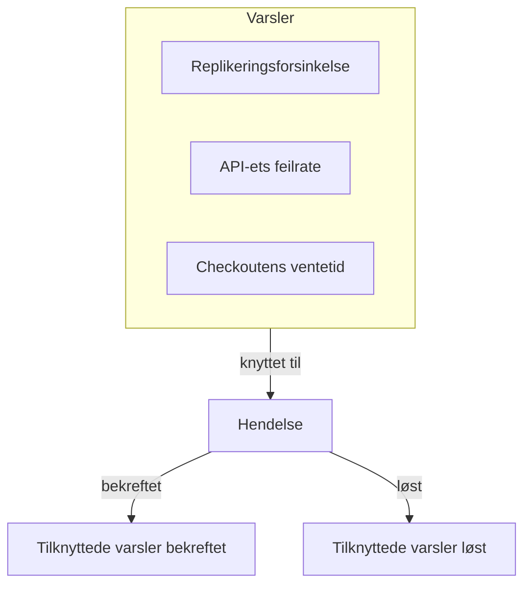
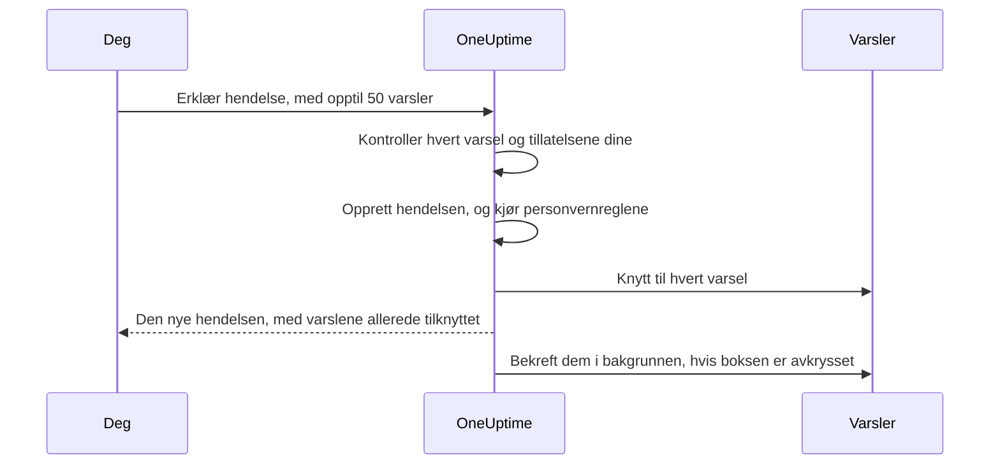

# Koblede varsler

Et avbrudd utløser sjelden bare ett varsel. Når primærdatabasen faller ut, slår monitoren for replikeringsforsinkelse ut, monitoren for API-ets feilrate slår ut, og SLO-en for checkoutens ventetid begynner å brenne — tre varsler, ett problem. Å knytte de varslene til hendelsen sier nettopp det: hendelsen er der responsen skjer, og hvert varsel viser hvilken hendelse som forklarer det.

En tilknytting er bare en tilknytting. Varselet beholder sin egen tilstand, sine eiere, vaktpolicyer, notater og sin feed; hendelsen beholder sine. Tilknytting slår ikke sammen og kopierer ingenting, og bekrefter, løser eller demper aldri i seg selv et varsel. (Å erklære en ny hendelse fra varsler er annerledes: den nye hendelsen forhåndsutfylles fra dem, som [beskrevet nedenfor](#erklær-en-hendelse-fra-varsler), og med mindre du fjerner haken på skjemaet, bekreftes varslene mens du erklærer den, noe som stopper eskaleringen deres — se [Bekreft varslene mens du erklærer](#bekreft-varslene-mens-du-erklærer).) To prosjektbrytere, slått på i nye prosjekter, tar de tilknyttede varslene med seg etter hvert som hendelsen bekreftes og løses — se [lenger ned](#hold-varslenes-tilstander-i-takt-med-hendelsen).

:::cards
- [Knytt varsler til en hendelse](#knytt-varsler-fra-en-hendelse): Fra hendelsen, fra et varsel eller mange på én gang.
- [Erklær en hendelse fra varsler](#erklær-en-hendelse-fra-varsler): En ny hendelse, forhåndsutfylt og tilknyttet i én operasjon.
- [Hold varslenes tilstander i takt](#hold-varslenes-tilstander-i-takt-med-hendelsen): Bekreft og løs varslene sammen med hendelsen.
- [Tillatelser](#tillatelser): Hvem som kan knytte til, og hva tilknytting lar dem gjøre.
:::

> [!TIP]
> Kommer du fra Opsgenie, er dette OneUptimes versjon av å knytte varsler til en hendelse.

## Kort fortalt

- **Mange-til-mange** — en hendelse kan ha et hvilket som helst antall tilknyttede varsler, og ett varsel kan være knyttet til flere hendelser.
- **Tre steder å knytte til** — hendelsens side **Tilknyttede varsler**, varselets side **Tilknyttede hendelser** og massehandlingen **Knytt til en hendelse** på hovedlistene over varsler, for opptil **50** varsler om gangen.
- **Erklær en hendelse fra varsler** — **Erklær hendelse** på en varselliste, i overskriften til et varsel eller på siden **Tilknyttede hendelser** forhåndsutfyller en ny hendelse fra varslene og knytter dem til mens den opprettes. En avkrysningsboks på skjemaet, avkrysset som standard, bekrefter dem også, noe som stopper deres egen eskalering fra vakten.
- **Registrert på begge sider** — hver tilknytting og frakobling skriver en feedoppføring på hendelsen og på varselet, bortsett fra at en hendelse som erklæres fra varsler, får én oppføring som nevner alle. Bare hendelsens oppføringer publiseres i Slack og Microsoft Teams, og tittelen på et privat varsel eller en privat hendelse skrives aldri på den andre siden.
- **Varslenes tilstander følger hendelsen** — to prosjektbrytere, begge slått på i nye prosjekter, bekrefter og løser tilknyttede varsler når hendelsen bekreftes og løses. Slå av en av dem under **Hendelser → Innstillinger → Tilknyttede varsler**.
- **Kan automatiseres** — tilknyttinger er en vanlig API-ressurs, `/api/incident-alert`.

## Slik fungerer det

Varsler er signaler: kriteriene til en monitor samsvarte, en SLO begynte å brenne budsjettet sitt, en sikkerhetsregel slo ut. En hendelse er den koordinerte responsen på et problem (se [Hendelser – Oversikt](/docs/incidents/index)). De fleste problemer gir flere signaler, og uten tilknyttinger er det eneste som binder dem til responsen, noens hukommelse.



Med varslene tilknyttet:

- Ser de som responderer på hendelsen, i én liste hvilke varsler som hører til den, og hvilken tilstand hvert er i.
- Ser noen som åpner et av de varslene, at det allerede håndteres, under hvilken hendelse, i stedet for å erklære en ny hendelse for det samme avbruddet.
- Registrerer hendelsens feed når hvert varsel ble knyttet til og av hvem, slik at tidslinjen viser hvordan bildet tok form.
- Stopper bekreftelsen av hendelsen, med bryterne slått på, vaktens eskaleringer for varslene, slik at de som jobber med hendelsen, ikke tilkalles igjen av symptomene.

## Slik fungerer tilknyttinger

En tilknytting forbinder ett varsel med én hendelse. Tilknyttinger går begge veier — den samme tilknyttingen vises på hendelsens side **Tilknyttede varsler** og på varselets side **Tilknyttede hendelser**.

- **Et varsel kan være knyttet til flere hendelser.** En delt avhengighet som feiler, kan være et symptom på to separate hendelser. Hver hendelse viser varselet, og varselet viser begge hendelsene.
- **Hvert par knyttes én gang.** Å knytte et varsel til en hendelse det allerede er knyttet til, avvises med "This alert is already linked to this incident." — også når to personer knytter det samme paret i samme øyeblikk.
- **Tilknyttinger opprettes eller fjernes, de redigeres aldri.** En tilknytting har ingen egne felt utover hendelsen, varselet, når den ble laget og av hvem. For å flytte et varsel til en annen hendelse knytter du det til den nye og kobler det fra den gamle.
- **Tilknyttinger blir innenfor et prosjekt.** Varselet og hendelsen må høre til samme prosjekt.

## Knytt varsler fra en hendelse

:::steps
### Åpne hendelsens side Tilknyttede varsler

Åpne hendelsen, og velg **Tilknyttede varsler** i seksjonen **Undersøkelse** i sidemenyen. Tabellen viser hvert varsel som allerede er knyttet til den.

### Velg varselet

Klikk på **Knytt til varsel**, og velg det i nedtrekkslisten **Varsel**. Nedtrekkslisten viser de nyeste varslene først, hvert med nummeret sitt — som `ALT-63: Checkout API is offline` — slik at varsler med samme tittel, som de gjentatte varslene til en monitor, kan skilles fra hverandre. For å finne et eldre varsel skriver du: nedtrekkslisten søker i alle varsler etter tittel.

### Lagre tilknyttingen

Klikk på **Knytt til varsel** i dialogen. Varselet vises i tabellen, og begge feedene registrerer tilknyttingen. Avvises tilknyttingen, for eksempel fordi varselet allerede er tilknyttet, blir dialogen stående åpen og sier hvorfor.
:::

| Kolonne           | Hva den viser                                    |
| ----------------- | ------------------------------------------------ |
| **Varsel nr.**    | Varselets nummer, som `#17` eller `ALT-17`.      |
| **Tittel**        | Varselets tittel, med en lenke til varselet.     |
| **Nåværende tilstand** | Varselets egen tilstand, som **Bekreftet**. |
| **Koblet til**    | Når varselet ble knyttet til.                    |
| **Tilknyttet av** | Hvem som knyttet det til.                        |

Hver rad har **Vis varsel** for å åpne varselet og **Koble fra** for å fjerne tilknyttingen.

## Knytt hendelser fra et varsel

Varselets side speiler hendelsens. Åpne et varsel, og velg **Tilknyttede hendelser** i seksjonen **Grunnleggende** i sidemenyen. Tabellen viser hver hendelse varselet er knyttet til, med hendelsesnummer, tittel og gjeldende tilstand, og når og av hvem den ble knyttet til.

- **Knytt til hendelsen** knytter dette varselet til en eksisterende hendelse. Nedtrekkslisten fungerer som den på hendelsens side: de nyeste hendelsene først, hver med nummeret sitt — som `INC-42: Checkout is down` — og når du skriver, søkes det i alle hendelser etter tittel.
- **Vis hendelse** åpner en tilknyttet hendelse.
- **Koble fra** fjerner en tilknytting.
- **Erklær hendelse** starter en ny hendelse fra dette varselet. Den samme knappen står i varselets overskrift, ved siden av **Bekreft** og **Løs**. Se [Erklær en hendelse fra varsler](#erklær-en-hendelse-fra-varsler).

## Knytt mange varsler på én gang

Hovedlistene over varsler har to massehandlinger for dette: **Alle varsler** og **Aktive varsler**, de aktive varslene på startsiden og siden **Varsler** for en monitor, en tjeneste, en vert, en Kubernetes-klynge, en SLO eller en hvilken som helst annen ressurs som har en. Listen **Medlemsvarsler** for en varselepisode har dem ikke — velg i stedet varslene på en av hovedlistene. Velg varslene, og velg deretter:

- **Knytt til en hendelse** — velg hendelsen i nedtrekkslisten **Hendelse**, og klikk på **Knytt til varsler**. De nyeste hendelsene står først, med numrene sine, og når du skriver, søkes det i alle hendelser etter tittel. OneUptime knytter til hvert valgte varsel og viser fremdriften underveis. Et varsel som allerede er knyttet til den hendelsen, teller som fullført og ikke som feilet, så det er trygt å kjøre handlingen to ganger.
- **Erklær hendelse** — åpner erklæringsskjemaet for en ny hendelse som er forhåndsutfylt fra de valgte varslene. Se neste seksjon.

Begge handlingene tar opptil **50** varsler om gangen. Velger du flere, deaktiveres de, med et verktøytips som sier hvorfor. Grensen finnes fordi hver tilknytting skriver til begge feedene, og hver tilknytting som lages med **Knytt til en hendelse**, også publiseres i hendelsens Slack- og Microsoft Teams-kanaler — et utvalg på tusen varsler ville oversvømme dem.

## Erklær en hendelse fra varsler

Viser en mengde varsler seg å være en hendelse som ingen har erklært ennå, erklærer du den fra varslene. Det er tre veier inn:

- Velg varslene på en av hovedlistene over varsler, og velg **Erklær hendelse**.
- Åpne et varsel, og klikk på **Erklær hendelse** i overskriften, ved siden av **Bekreft** og **Løs**. Den blir stående når varselet er bekreftet eller løst, så du fortsatt kan erklære en hendelse for et varsel i ettertid — for å gjøre en etteranalyse av det, for eksempel.
- Åpne siden **Tilknyttede hendelser** til ett varsel, og klikk på **Erklær hendelse**.

Alle tre krever tillatelse til å opprette hendelser og til å knytte varsler til dem. Uten den er knappen låst, og verktøytipset nevner den manglende tillatelsen.

Uansett hvilken du bruker, havner du på det vanlige skjemaet **Erklær ny hendelse**, med varslene oppført som dem som vil bli knyttet til, og disse feltene forhåndsutfylt:

| Felt                   | Forhåndsutfylt med                                                                                                                                                                                                                                                                     |
| ---------------------- | -------------------------------------------------------------------------------------------------------------------------------------------------------------------------------------------------------------------------------------------------------------------------------------- |
| **Tittel**             | Ett varsel: tittelen. Flere: tittelen på det mest alvorlige varselet.                                                                                                                                                                                                                  |
| **Beskrivelse**        | Ett varsel: beskrivelsen. Flere: en liste med én linje per varsel, med nummer og tittel.                                                                                                                                                                                               |
| **Hendelsesalvor**     | Alvorlighetsgraden til det mest alvorlige varselet, oversatt til en alvorlighetsgrad for hendelser. En alvorlighetsgrad for hendelser med samme navn, uten hensyn til store og små bokstaver, vinner. Ellers tar OneUptime alvorlighetsgraden for hendelser på samme plass i rekkefølgen av alvorlighetsgrader, eller den siste hvis du har færre alvorlighetsgrader for hendelser. |
| **Berørte ressurser**  | Hver monitor, vert, Kubernetes-klynge, Docker-vert, Podman-vert og tjeneste fra de valgte varslene, slått sammen. Monitorene havner under **Monitorer**, resten under **Andre berørte ressurser**. Andre ressurser, som SLO-er eller VMware-, Proxmox- og Ceph-klynger, kopieres ikke — legg dem til selv hvis hendelsen berører dem. |
| **Etiketter**          | Hver etikett fra hvert valgte varsel.                                                                                                                                                                                                                                                  |
| **Privat hendelse**    | Slått på hvis noen av varslene er private. Skjemaet sier det, og eierne av varslene blir eiere av hendelsen — se nedenfor.                                                                                                                                                              |

"Mest alvorlig" følger rekkefølgen av alvorlighetsgradene for varsler: den første alvorlighetsgraden for varsler i listen er den mest alvorlige. Med alvorlighetsgradene hvert prosjekt starter med, blir et varsel **High** til en **Critical Incident** og et varsel **Low** til en **Major Incident**.

Alt kan redigeres før du sender. **Etiketter** og **Privat hendelse** ligger under **Flere felt** på skjemaets første trinn, der den sammenbrettede overskriften viser hver av dem mens den er satt.

**Et varsel som allerede har en hendelse, merkes.** Med **Erklær hendelse** på siden til hvert varsel kan to vakthavende som tilkalles av det samme avbruddet, hver erklære det. Derfor merker banneret som viser varslene, hvert varsel som allerede er knyttet til en hendelse — "(already linked to Incident INC-42)", med en lenke til den hendelsen — og legger til en merknad, formulert etter hvor mange av varslene som er tilknyttet:

- Alle varslene, og det er ett: "This alert is already linked to an incident. If it is the same problem, update that incident instead of declaring another one."
- Alle varslene, og det er flere: "These alerts are already linked to incidents. If it is the same problem, update that incident instead of declaring another one."
- Bare noen av dem: "Some of these alerts are already linked to an incident. If it is the same problem, link the other alerts to that incident from the alerts list instead of declaring another one."

Hendelseslenkene åpnes i en ny fane, så du kan sjekke den eksisterende hendelsen uten å miste det du har fylt ut på skjemaet. Merknaden er en påminnelse, ikke en blokkering, og bare hendelser du har lov til å se, nevnes.

**Vaktpolicyer kopieres ikke.** Varslene kjørte sine egne vaktpolicyer da de ble opprettet, så å kopiere dem over på hendelsen ville tilkalle de samme personene en gang til. Hendelsens vaktpolicyer er det du velger på trinnet **Vakt og roller**, pluss det vaktreglene dine for hendelser legger til — nøyaktig som for enhver annen hendelse.

**Varslenes monitorer forhåndsutfylles som berørte monitorer.** Som med enhver hendelse som erklæres for hånd, settes den aktive overvåkingen av hendelsens monitorer på pause til hendelsen er løst. Fjern en monitor fra **Monitorer** på trinnet **Berørte ressurser** før du sender, hvis den skal fortsette å bli kontrollert.

**Et privat varsel gir en privat hendelse.** Er noen av varslene private, starter **Privat hendelse** slått på, og banneret som viser varslene, sier det. En privat hendelse er bare synlig for eierne sine, Project Owners og Project Admins, så OneUptime sørger for at personene som kunne se varslene, kan se hendelsen: når den er erklært, legges eierne av hvert varsel det ble erklært fra — brukere og team — til som eiere av hendelsen, uten å få beskjed. De legges til rett etter at hendelsens Slack- og Microsoft Teams-kanaler er opprettet, så de inviteres til de kanalene som enhver annen eier. Du er også eier, som med enhver hendelse du erklærer. Det samme skjer når en personvernregel for hendelser gjør den nye hendelsen privat. Slår du av **Privat hendelse** før du sender, og ingen personvernregel gjelder, er hendelsen ikke privat, og ingen eiere kopieres.



Når du sender, kontrollerer serveren varslene før den oppretter noe: høyst 50 av dem, hvert et varsel i dette prosjektet som du har lov til å se, og du må ha lov til å knytte varsler til hendelser. Feiler en kontroll, avvises forespørselen, og ingen hendelse opprettes — så en feil varsel-ID bruker aldri opp et hendelsesnummer. Når hendelsen finnes — og når personvernreglene har kjørt, slik at tilknyttingene vet om den er privat — knyttes hvert varsel til før forespørselen returnerer, så hendelsens side **Tilknyttede varsler** allerede viser dem. Feiler en enkelt tilknytting — fordi varselet ble slettet et øyeblikk før, for eksempel — erklæres hendelsen likevel, og de andre varslene knyttes likevel til.

Hendelsens feed får én oppføring **Varsel tilknyttet** som nevner varslene, skrevet etter **Hendelse opprettet**, i stedet for én per varsel — se [Feeden, Slack og Microsoft Teams](#feeden-slack-og-microsoft-teams).

### Bekreft varslene mens du erklærer

Å erklære en hendelse stopper ikke i seg selv varslene i å tilkalle: et varsels eskalering fra vakten stopper først når selve varselet er bekreftet. Når noen av varslene ikke er bekreftet ennå, har banneret på skjemaet derfor en avkrysningsboks, avkrysset som standard — **Acknowledge this alert to stop its escalation** for ett varsel, **Acknowledge these 3 alerts to stop their escalation** for flere. Er noen av dem allerede bekreftet, nevner den bare de andre og sier at resten blir som de er.

La den være avkrysset, og når hendelsen er erklært og varslene er tilknyttet:

- **Bekreftes varslene som deg.** Hvert varsel går til varseltilstanden din **Bekreftet**, som om du selv hadde klikket på **Bekreft** på det: varselets **Tilstandstidslinje** og feed nevner deg, varselets eiere får beskjed, og endringen publiseres i varselets Slack- og Microsoft Teams-kanaler som enhver annen tilstandsendring for et varsel. Årsaken lyder "Acknowledged because Incident INC-42 was declared from this alert." — eller, for en privat hendelse, "Acknowledged because a private incident was declared from this alert.", slik at en privat hendelse aldri nevnes der varselets publikum kan lese det.
- **Stopper deres egen eskalering fra vakten innen omtrent ett minutt.** Det neste eskaleringstrinnet ser et bekreftet varsel og stopper. Tilkallinger som allerede er sendt, kalles ikke tilbake.
- **Stopper påminnelser bare hvis påminnelsesregelen sier det.** Et varsels påminnelser stopper ved bekreftelse bare når påminnelsesregelen har **Stop Reminders When** satt til **Bekreftet**; ellers fortsetter de til varselet er løst.
- **Fortsetter en varselepisode å eskalere.** Hører et varsel til en episode som tilkaller via sin egen vaktpolicy, fortsetter episoden å eskalere til selve episoden er bekreftet.
- **Lar varsler som allerede er bekreftet eller løst, være i fred.** Som overalt ellers sammenlignes tilstander etter rekkefølgen, så et varsel i en egen tilstand etter **Bekreftet** teller som bekreftet, og ingenting flyttes noen gang bakover.

Fjern haken for å erklære uten å bekrefte. Når varsler vil forbli ubekreftede — boksen er uten hake eller låst — sier skjemaet det: "Declaring the incident does not acknowledge the alert: it keeps escalating until it is acknowledged." Og bekrefter du varslene uten å velge en vaktpolicy for hendelsen, påpeker sammendraget for trinnet **Vakt og roller**: "The alerts it is declared from are acknowledged too, so their own escalation stops. An alert episode they belong to keeps escalating until the episode is acknowledged, and an incident on-call rule, if any, may still page."

**Du trenger tillatelse til å bekrefte varslene.** Å bekrefte dem mens du erklærer krever **Create Alert State Timeline** og **Edit Alert** (å bekrefte et varsel på dets egen side krever bare den første: se [Endre en tilstand](/docs/permissions/index#endre-en-tilstand)): Project Owner, Project Admin, Project Member, Alert Admin og Alert Member har begge, mens Incident Admin og Incident Member, som kan erklære hendelser fra varsler, ikke har noen av dem. Etikett- og eieromfanget ditt på varsler må også omfatte hvert varsel som skal bekreftes — bare de som ikke er bekreftet ennå, kontrolleres. Varsler som allerede er bekreftet eller løst, krever ingen tillatelse og blokkerer aldri erklæringen. Uten tillatelsene er boksen låst, med et verktøytips som nevner den manglende, og du kan fortsatt erklære hendelsen. Serveren kontrollerer på nytt før den oppretter noe, for hvert varsel den skal bekrefte: har du ikke lov til å bekrefte ett av dem, opprettes ingen hendelse, og skjemaet sier hvorfor — fjern haken og send på nytt.

**Prosjektet trenger en varseltilstand Bekreftet.** Hvert prosjekt starter med en. Har ditt ingen, tilbys ikke boksen.

Varslene bekreftes i bakgrunnen, rett etter at de er tilknyttet, noen få om gangen — opptil 5 samtidig — så hendelsens side kan åpne et øyeblikk før de er det, og å erklære fra mange varsler ikke lar de siste vente bak alle de andre. Et varsel som ikke kan bekreftes — fordi det ble slettet i mellomtiden, for eksempel — logges og stopper aldri de andre eller hendelsen, og et varsel som noen andre bekrefter eller løser i mellomtiden, blir latt være slik de etterlot det.

**Med prosjektets brytere for tilknyttede varsler slått på kan bryterne flytte varslene i stedet.** Erklæres hendelsen rett inn i en bekreftet eller løst tilstand, og en av [bryterne for tilknyttede varsler](#hold-varslenes-tilstander-i-takt-med-hendelsen) virker på den tilstanden, flytter bryteren de tilknyttede varslene mens de knyttes til, og boksen overlater de varslene til den, slik at hvert varsel har én skriver. De bekreftes eller løses slik bryteren gjør det — med bryterens årsak, som "Acknowledged because linked Incident INC-42 was acknowledged.", som nevner hendelsen ved nummeret selv når den er privat — de tilskrives ikke deg, og eierne deres får ikke beskjed. Å erklære i den første hendelsestilstanden din, som vanlig, eller med bryterne slått av, overlater hvert varsel til boksen.

### Erklær via API-et

`POST /api/incident` tar imot ID-ene til varslene som skal knyttes til, i `miscDataProps` under `alertIdsToLink`, og om de varslene skal bekreftes, under `acknowledgeAlertsToLink`:

```bash
curl -X POST https://oneuptime.com/api/incident \
  -H "apikey: $ONEUPTIME_API_KEY" \
  -H "Content-Type: application/json" \
  -d '{
    "data": {
      "title": "Primary database unavailable",
      "incidentSeverityId": "<incident-severity-id>"
    },
    "miscDataProps": {
      "alertIdsToLink": ["<alert-id>", "<another-alert-id>"],
      "acknowledgeAlertsToLink": true
    }
  }'
```

`alertIdsToLink` er en matrise med 1 til 50 varsel-ID-er. Duplikater ignoreres, og de samme kontrollene gjelder som i dashbordet, før hendelsen opprettes. Ingenting forhåndsutfylles via API-et — send tittelen, alvorlighetsgraden og ressursene du vil ha. API-nøkkelen trenger tillatelse til å opprette hendelser og knytte varsler til dem, og den må kunne lese varslene. En API-nøkkel er ikke en bruker, så tilknyttinger som lages med en, har ingen **Tilknyttet av**. For resten av forespørselens body, se [Opprette en hendelse](/docs/incidents/declaring-incidents).

`acknowledgeAlertsToLink` er valgfri og slått av med mindre du sender den. Sett den til `true` for å bekrefte varslene når de er tilknyttet, slik skjemaets boks gjør — varsler som allerede er bekreftet eller løst, blir latt være og krever ingen tillatelse. Utelat den, eller send `false`, for å erklære uten å bekrefte dem. Den kontrolleres sammen med varsel-ID-ene, før hendelsen opprettes, og forespørselen avvises med en 400 når:

- den er noe annet enn `true` eller `false`;
- den sendes uten `alertIdsToLink`;
- prosjektet ikke har noen varseltilstand Bekreftet;
- API-nøkkelen ikke har lov til å bekrefte hvert varsel som ikke er bekreftet ennå — det krever **Create Alert State Timeline** og **Edit Alert**, med et etikettomfang som omfatter hvert av de varslene.

En API-nøkkel er ikke en bruker, så varsler som bekreftes med en, tilskrives ingen, akkurat som tilknyttingene ikke har noen **Tilknyttet av**.

## Knytt til og koble fra via API-et

Tilknyttinger er en standard CRUD-ressurs på `/api/incident-alert`. For å knytte et varsel til en hendelse oppretter du en:

```bash
curl -X POST https://oneuptime.com/api/incident-alert \
  -H "apikey: $ONEUPTIME_API_KEY" \
  -H "Content-Type: application/json" \
  -d '{
    "data": {
      "incidentId": "<incident-id>",
      "alertId": "<alert-id>"
    }
  }'
```

For å liste opp de tilknyttede varslene til en hendelse spør du etter `incidentId`. Spør i stedet etter `alertId` for å finne hendelsene et varsel er knyttet til:

```bash
curl -X POST https://oneuptime.com/api/incident-alert/get-list \
  -H "apikey: $ONEUPTIME_API_KEY" \
  -H "Content-Type: application/json" \
  -d '{
    "query": { "incidentId": "<incident-id>" },
    "select": { "_id": true, "alertId": true, "createdAt": true },
    "limit": 50,
    "skip": 0
  }'
```

For å koble fra sletter du tilknyttingen etter dens egen ID — tilknyttingens `_id`, ikke varselets eller hendelsens:

```bash
curl -X DELETE https://oneuptime.com/api/incident-alert/<link-id> \
  -H "apikey: $ONEUPTIME_API_KEY"
```

Begge ID-ene er påkrevd. En forespørsel om tilknytting avvises også når varselet eller hendelsen hører til et annet prosjekt eller er en du ikke kan se. Feilen lyder likt enten varselet eller hendelsen ikke finnes eller bare er skjult for deg, så den aldri avslører at en privat finnes.

Den samme ressursen driver de genererte arbeidsflytkomponentene — **On Create Incident Alert** utløses når et varsel knyttes til, og **On Delete Incident Alert** når det kobles fra — og MCP-serverens Incident Alert-verktøy. [API-referansen](/reference) har den fullstendige formen på forespørsel og svar.

## Koble fra

Koble fra fra begge sider: **Koble fra** på en rad på hendelsens side **Tilknyttede varsler** eller varselets side **Tilknyttede hendelser**, og bekreft. For å koble fra flere på én gang velger du radene og velger massehandlingen **Koble fra**. Den fjerner bare tilknyttingene — selve varslene og hendelsene slettes ikke.

Frakobling fjerner tilknyttingen og ingenting annet. Varselet og hendelsen beholder tilstandene sine, og et varsel som ble bekreftet eller løst på grunn av hendelsen, forblir slik — varslers tilstander går aldri bakover. Begge feedene registrerer frakoblingen.

## Tillatelser

Tilknytting har fire egne finkornede tillatelser, i gruppen **Incident** i [Tillatelsesreferanse](/docs/permissions/reference):

| Tillatelse                | Hva den tillater                                                                                                       | Roller som har den                                                                                       |
| ------------------------- | ---------------------------------------------------------------------------------------------------------------------- | -------------------------------------------------------------------------------------------------------- |
| **Create Incident Alert** | Å knytte et varsel til en hendelse, også når en hendelse erklæres fra varsler. Du må også kunne lese begge.            | Project Owner, Project Admin, Project Member, Incident Admin, Incident Member, Alert Admin, Alert Member |
| **Delete Incident Alert** | Å koble fra.                                                                                                           | Project Owner, Project Admin, Project Member, Incident Admin, Incident Member, Alert Admin, Alert Member |
| **Read Incident Alert**   | Å se listene **Tilknyttede varsler** og **Tilknyttede hendelser**.                                                     | Alle de ovennevnte, pluss Viewer, Incident Viewer og Alert Viewer                                        |
| **Edit Incident Alert**   | I praksis ingenting — en tilknytting har ingen felt du kan endre.                                                      | Project Owner, Project Admin, Project Member, Incident Admin, Incident Member, Alert Admin, Alert Member |

Varselroller er med slik at de som jobber med varsler, kan knytte dem til, og hendelsesroller slik at de som jobber med hendelser, kan det. Ingen av dem er nok alene, fordi en tilknytting bare opprettes når du kan lese begge sider:

- **En varselrolle trenger også lesetilgang til hendelser** — legg til Viewer, Incident Viewer eller Read Incident.
- **En hendelsesrolle trenger også lesetilgang til varsler** — legg til Viewer, Alert Viewer eller Read Alert.

Tre regler til gjelder i tillegg:

- **Du må kunne se begge sider.** En tilknytting opprettes bare når du kan lese både varselet og hendelsen. Private varsler og hendelser og etikettbegrensninger gjelder som vanlig.
- **En tilknytting hører til hendelsen sin.** Om du kan se en tilknytting, følger tilgangen din til hendelsen: etikettbegrensninger og eieromfang på hendelser gjelder også tilknyttingen.
- **Tilknytting krever lesetilgang til et varsel, ikke redigeringstilgang.** Med prosjektets brytere for tilknyttede varsler slått på, som de er i nye prosjekter, er det nok til at en tilknytting kan bekrefte eller løse varselet — se [Hvem flytter et tilknyttet varsel](#hvem-flytter-et-tilknyttet-varsel).

Å erklære en hendelse fra varsler krever også tillatelse til å opprette hendelser, og å bekrefte varslene mens du erklærer krever **Create Alert State Timeline** og **Edit Alert** på hvert av dem som ikke er bekreftet ennå — se [Bekreft varslene mens du erklærer](#bekreft-varslene-mens-du-erklærer). I dashbordet er en handling du mangler en tillatelse for, låst, og verktøytipset nevner den manglende tillatelsen. Det gjelder også lesetilgang til den andre siden: **Knytt til varsel** er låst hvis du ikke kan lese varsler, og **Knytt til hendelsen** og **Knytt til en hendelse** hvis du ikke kan lese hendelser. For hvordan roller, finkornede tillatelser, etiketter og eieromfang spiller sammen, se [Brukere, team og tillatelser](/docs/permissions/index).

## Feeden, Slack og Microsoft Teams

Hver tilknytting og frakobling skrives til begge feedene og tilskrives den som gjorde endringen:

| Endring     | Hendelsens feed                              | Varselets feed                                      |
| ----------- | -------------------------------------------- | --------------------------------------------------- |
| Tilknytting | **Varsel tilknyttet** (`AlertLinked`)        | **Tilknyttet hendelse** (`LinkedToIncident`)        |
| Frakobling  | **Varsel frakoblet** (`AlertUnlinked`)       | **Frakoblet hendelse** (`UnlinkedFromIncident`)     |

Hver oppføring nevner den andre siden ved nummeret og lenker til den, så du kan hoppe fra hendelsens feed til varselet og tilbake. Den gir også den andre sidens tittel, med mindre den siden er privat:

- **Tittelen på et privat varsel holdes utenfor hendelsens oppføring**, og dermed utenfor Slack og Microsoft Teams. Oppføringen lyder for eksempel "Linked Alert #12 (private alert) to Incident #5".
- **Tittelen på en privat hendelse holdes utenfor varselets oppføring**, som lyder "Linked to Incident #5 (private incident)".

Dette gjelder også når begge er private, fordi et privat varsel og en privat hendelse kan ha forskjellige eiere. Å åpne det tilknyttede varselet eller hendelsen er som vanlig underlagt dens eget personvern.

**Bare hendelsens oppføringer når Slack og Microsoft Teams.** **Varsel tilknyttet** og **Varsel frakoblet** publiseres der hendelsens andre feedoppdateringer går. Oppføringene på varselets side blir i dashbordet, så en tilknytting gir én melding i stedet for to. Se [Slack](/docs/workspace-connections/slack) og [Microsoft Teams](/docs/workspace-connections/microsoft-teams) for å sette opp de kanalene.

**Å erklære en hendelse fra varsler skriver én oppføring, ikke én per varsel.** Tilknyttingene som lages mens hendelsen erklæres, skriver ingen egne oppføringer **Varsel tilknyttet**. I stedet får hendelsen, når oppføringen **Hendelse opprettet** er ute — og hendelsens egne Slack- og Microsoft Teams-kanaler, hvis du bruker dem, er opprettet — én oppføring **Varsel tilknyttet**: "Declared from 3 alerts:", etterfulgt av én linje per varsel med nummer og tittel (et privat varsel uten tittelen). Det er den ene meldingen som publiseres i Slack og Microsoft Teams. Hvert varsel får fortsatt sin egen oppføring **Tilknyttet hendelse**.

Begge feedenes dialoger **Filtrer etter hendelsestype**, i menyen **⋯** for hver feed, viser disse hendelsestypene, så du kan vise eller skjule tilknyttingsaktivitet som enhver annen type oppføring. Mer om hendelsens feed i [Hendelsesnotater, eiere og feed](/docs/incidents/notes-owners-and-feed).

## Hold varslenes tilstander i takt med hendelsen

To prosjektbrytere lar hendelsen ta de tilknyttede varslene med seg. Begge er slått på i nye prosjekter. Et prosjekt som ble opprettet før de var slått på som standard, beholder innstillingen det hadde, og den er slått av med mindre noen slo dem på. De har sin egen innstillingsside, **Hendelser → Innstillinger → Tilknyttede varsler**, der hver er en bryter på kortet **Tilknyttede varsler** som lagres så snart du slår den om. Bare Project Owners og Project Admins kan endre dem; for alle andre er bryterne låst og sier hvilken tillatelse de krever:

- **Bekreft tilknyttede varsler når hendelsen bekreftes** — når hendelsen når den bekreftede tilstanden din, går hvert tilknyttet varsel som ikke er bekreftet ennå, til varseltilstanden din **Bekreftet**. Det er dette som stopper vaktens eskaleringer for de varslene: det neste eskaleringstrinnet ser et bekreftet varsel og stopper innen omtrent ett minutt. Tilkallinger som allerede er sendt, kalles ikke tilbake. Påminnelser for varsler stopper også når varselets påminnelsesregel har **Stop Reminders When** satt til **Bekreftet**; ellers fortsetter de til varselet er løst.
- **Løs tilknyttede varsler når hendelsen løses** — når hendelsen når den løste tilstanden din, går hvert tilknyttet varsel som ikke er løst ennå, til varseltilstanden din **Løst**, unntatt et varsel som fortsatt er knyttet til en annen hendelse som ikke er løst. Det varselet blir stående åpent for den andre hendelsen — bekreftet, hvis bekreftelsesbryteren også er slått på — og løses når den siste av hendelsene er løst.

Med begge bryterne slått av endrer tilknytting ingenting ved tilstanden til et varsel. Et tilknyttet varsel blir værende der det er til noen flytter det, vaktpolicyen fortsetter å eskalere, og påminnelsene fortsetter å komme. Det eneste unntaket er å erklære en hendelse fra varsler med skjemaets boks avkrysset, noe som bekrefter dem mens du erklærer — se [Bekreft varslene mens du erklærer](#bekreft-varslene-mens-du-erklærer).

### Hvordan bryterne oppfører seg

- **Rekkefølge, ikke navn.** "Når" betyr at hendelsens gjeldende tilstand står ved eller etter den bekreftede eller løste tilstanden i rekkefølgen av tilstandene dine. En egen tilstand mellom Bekreftet og Løst, som en tilstand **Overvåking**, teller som bekreftet. Varsler sammenlignes på samme måte, så et varsel i en egen tilstand etter **Bekreftet** teller allerede som bekreftet.
- **Aldri bakover.** Bare varsler som ligger bak måltilstanden, flyttes. Et varsel som allerede er bekreftet, blir latt være av bekreftelsesbryteren, og et løst varsel røres aldri.
- **Å løse med bare bekreftelsesbryteren slått på** bekrefter de tilknyttede varslene, fordi løst ligger etter bekreftet.
- **Å knytte til en hendelse som allerede er bekreftet eller løst,** bruker bryterne på det nye varselet med en gang, som om hendelsen nettopp hadde skiftet tilstand.
- **Å gjenåpne en hendelse gjenåpner ikke varslene.** Varsler kan ikke gå til en tidligere tilstand.
- **Bare den gjeldende tilstanden teller.** Å legge til en tidligere oppføring i hendelsens **Tilstandstidslinje** — en med en **Slutter den** — flytter ikke noe varsel.
- **Tilknytting alene endrer aldri tilstanden til et varsel.** Med begge bryterne slått av flytter hendelsen aldri varslene sine.

Varslene skifter tilstand i bakgrunnen, rett etter at hendelsen gjør det. Hver endring går gjennom varselets egen tilstandstidslinje med en årsak som "Acknowledged because linked Incident INC-42 was acknowledged.", slik at varselets **Tilstandstidslinje** og feed viser hvorfor det ble flyttet. Varselets eiere får ikke et varsel om tilstandsendringen for det, men tilstandsendringen publiseres i Slack og Microsoft Teams som enhver annen tilstandsendring for et varsel. Kan ett varsel ikke flyttes, stopper ikke det de andre.

### Hvem flytter et tilknyttet varsel

Å slå på en bryter overlater med vilje de tilknyttede varslenes tilstander til hendelsen: hendelsen er der responsen ledes, så den som leder hendelsen, leder også varslene. Fra da av:

- **Den som kan endre tilstanden til en hendelse, flytter de tilknyttede varslene.** Å bekrefte eller løse hendelsen bekrefter eller løser dem.
- **Den som kan knytte til et varsel, kan flytte det.** Å knytte et varsel til en hendelse som allerede er bekreftet eller løst, flytter varselet mens det knyttes til.

Ingen av dem krever tillatelse til å redigere varslene. OneUptime flytter dem selv, og tilknytting krever bare lesetilgang til et varsel. Så med bekreftelsesbryteren slått på kan alle som kan knytte til varsler eller endre tilstanden til hendelser, bekrefte — og stoppe vaktens eskalering av — ethvert varsel de kan se; med løsningsbryteren slått på kan de løse det. Derfor kan bare Project Owners og Project Admins endre bryterne. De er slått på i et nytt prosjekt, så slå dem av hvis tilstandene til varsler bare noen gang skal endres av personer som kan redigere varsler.

### Løs varsler som kommer fra monitorer

Å bekrefte er alltid trygt for varselet til en monitor: et bekreftet varsel teller fortsatt som åpent, så monitoren fortsetter å bruke det i stedet for å åpne et nytt.

> [!WARNING]
> Å løse er annerledes. Feiler monitoren fortsatt når varselet løses, åpner monitorens neste kontroll et nytt varsel — og det nye varselet er ikke knyttet til hendelsen. Blir hendelsene dine ofte løst før monitorene har kommet seg, slår du av løsningsbryteren og beholder bare bekreftelsesbryteren slått på, eller løser hendelser først når monitorene er friske.

## Slett varsler og hendelser

- **Å slette et varsel** fjerner det fra hver hendelse det var knyttet til. Hendelsene er ellers uendret.
- **Å slette en hendelse** fjerner tilknyttingene. Varslene er ellers uendret og beholder tilstandene sine.
- **Å slette et prosjekt** fjerner alle tilknyttingene sammen med alt annet.

Ingen av dem skriver feedoppføringer **Varsel frakoblet** eller **Frakoblet hendelse** — det gjør bare en uttrykkelig frakobling.

## Neste steg

:::cards
- [Opprette en hendelse](/docs/incidents/declaring-incidents): Erklæringsskjemaet, maler, monitorkriterier og API-et.
- [Hendelsestilstander og alvorlighetsgrader](/docs/incidents/states-and-severities): Rekkefølgen av tilstander bryterne sammenligner med.
- [Hendelsesinnstillinger og automatisering](/docs/incidents/settings): Innstillingssidene for hendelser, blant dem Tilknyttede varsler.
- [Brukere, team og tillatelser](/docs/permissions/index): Roller, finkornede tillatelser og omfang.
:::
