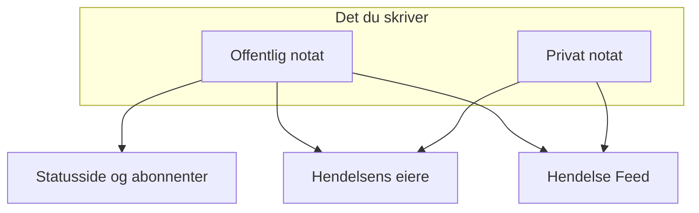

# Hendelsesnotater, eiere og feed

Hver hendelse samler en skriftlig oversikt mens du jobber med den: oppdateringer til kundene dine, arbeidsnotater til teamet ditt og en aktivitetsfeed over alt som skjedde. Denne siden dekker hvordan du skriver offentlige og private notater, hvem hvert av dem når, hendelsens feed og eierne som får beskjed om hver endring.

:::cards
- [Publiser et offentlig notat](#publiser-et-offentlig-notat): Fortell kundene hva du vet, på statussiden og med et varsel.
- [Når abonnentene får beskjed](#når-et-offentlig-notat-faktisk-når-abonnentene): Kontrollene et offentlig notat passerer, og merket.
- [Hendelsens feed](#hendelsens-feed): Tidslinjen over alt som skjedde.
- [Eiere](#eiere): Hvem som har ansvaret, og hva de får vite.
:::

## Slik fungerer det

Noe av det du skriver, er til kundene dine — oppdateringen som går ut på statussiden klokken 02:14 og sier at du har funnet den dårlige utrullingen. Resten er til teamet ditt — stakksporet noen limte inn, grafen som endelig ga mening, beslutningen om å bytte over. OneUptime holder de to målgruppene adskilt og registrerer begge på hendelsen.



**Offentlige notater** publiseres på statussiden din og kan gi abonnentene beskjed. **Private notater** (modellen `IncidentInternalNote`) blir værende inne i dashbordet. Under begge ligger **Hendelse Feed**, en tidslinje du bare kan legge til i, som registrerer alt som skjedde med hendelsen, og listen **Eiere**, som avgjør hvem som får beskjed.

Alt henger på hendelsens sidemeny: **Notater → Offentlige notater**, **Notater → Private notater** og **Team → Eiere**. Feeden ligger på hendelsens side **Oversikt**.

## Offentlige notater mot private notater

De to typene notater ser like ut i dashbordet og oppfører seg svært forskjellig.

|                          | Offentlig notat                                                     | Privat notat                                                    |
| ------------------------ | ------------------------------------------------------------------- | --------------------------------------------------------------- |
| Modell                   | `IncidentPublicNote`                                                | `IncidentInternalNote`                                          |
| Vises på statussider     | Ja, som en del av hendelsens tidslinje                              | Aldri — ingenting i statussideappen leser dem                   |
| Publiseringstidspunkt    | `postedAt`, som du kan sette selv                                   | Ingen: stemplet og sortert etter `createdAt`                    |
| Gir abonnenter beskjed   | Når **Notify status page subscribers** er slått på                  | Aldri: det har ingen felt for abonnenter i det hele tatt        |
| Vedlegg tilgjengelige for | Statussidens besøkende, via en rute på statussiden                 | Bare det autentiserte dashbord-API-et                           |
| Gir eiere beskjed        | Ja                                                                  | Ja                                                              |

**Hva "privat" faktisk betyr.** Det betyr "ikke publisert på statussiden" — ikke "begrenset til en mindre gruppe personer". De innebygde rollene som kan lese en hendelse, leser begge typer notater, så alle som kan lese hendelsen, kan vanligvis også lese de private notatene; i en egendefinert rolle er det separate tillatelser, **Read Incident Status Page Note** og **Read Incident Internal Note**. Må du begrense hvem som i det hele tatt kan se en hendelse, bruker du flagget **Privat hendelse** (`isPrivate`) på selve hendelsen, som skjuler hendelsen for alle statussider og begrenser den til brukerne som eier den, medlemmene av teamene som eier den, og prosjektadministratorer og prosjekteiere.

**Eierne ser begge.** Jobben som gir eierne beskjed, henter offentlige og private notater sammen. Et privat notat er privat for abonnentene dine, ikke for dem som responderer.

| Hvis du vil …                                          | Velg             |
| ------------------------------------------------------ | ---------------- |
| Fortelle kundene hva du vet, og når du vet mer         | **Offentlig notat** |
| Tilbakedatere en oppdatering du allerede har sendt et annet sted | **Offentlig notat** |
| Registrere en hypotese, en kommando du kjørte, eller en blindvei | **Privat notat** |
| Legge ved en heap dump eller et skjermbilde av et internt dashbord | **Privat notat** |

## Publiser et offentlig notat

:::steps
### Åpne de offentlige notatene

Åpne hendelsen, og velg **Notater → Offentlige notater** i sidemenyen. Redigeringsverktøyet over notatene sier hvem som leser notatet før du publiserer det: **Public · Visible on your status page**.

### Skriv oppdateringen

Skriv notatet i Markdown, eller start fra en av **Maler** eller fra **Draft with AI**. Legg til filer med **Attach** hvis abonnentene skal se dem.

### Bestem hvem som får beskjed

La **Notify status page subscribers** være avkrysset for å gi abonnentene beskjed, eller fjern haken for å publisere stille. **Will notify** under den viser hvilke statussider notatet når, og **Forhåndsvisning** viser e-posten de får.

### Publiser det

Klikk på **Post update**, eller trykk Ctrl+Enter (⌘+Enter på en Mac). Notatet vises øverst i listen, med et merke som følger varselet.
:::

Det samme redigeringsverktøyet åpner i en dialog fra **Add Public Note** i menyen **Handlinger** i hendelsens feed (se [Hendelsens feed](#hendelsens-feed)), så et notat skrives på samme måte fra begge steder.

| Element                            | Formål                                                                                                                                        |
| ---------------------------------- | --------------------------------------------------------------------------------------------------------------------------------------------- |
| Notatet                            | Teksten, i Markdown. Påkrevd.                                                                                                                 |
| **Maler**                          | Setter en av notatmalene dine inn i notatet, etter det du allerede har skrevet. Se [Notatmaler](#notatmaler).                             |
| **Draft with AI**                  | Skriver et utkast til notatet ut fra hendelsen, som du redigerer. Se [Generer et notat med KI](#generer-et-notat-med-ki).                    |
| **Attach**                         | Filer som deles med abonnentene på statussiden. Valgfritt.                                                                                    |
| **Posted now**                     | Når notatet sier at det ble publisert: øyeblikket du publiserer det, med mindre du velger et tidligere tidspunkt her, i din gjeldende tidssone. |
| **Notify status page subscribers** | Avkrysningsboks. Slått på som standard, med mindre hendelsen ble erklært uten å gi abonnentene beskjed — da starter den slått av. Slå den av for å publisere stille. |

**Stille hendelser forblir stille.** Ble en hendelse erklært med **Varsle statussideabonnenter** slått av (eller som en privat hendelse), har abonnentene aldri fått beskjed om den, så et offentlig notat bør ikke være det første de hører. På en slik hendelse starter avkrysningsboksen slått av, med en linje under som forklarer hvorfor. Du kan fortsatt krysse av for å gi abonnentene beskjed om det notatet. Notater som publiseres uten et uttrykkelig valg, følger samme regel: notater fra Slack og Microsoft Teams, arbeidsflyter og API-forespørsler som utelater `shouldStatusPageSubscribersBeNotifiedOnNoteCreated`. En uttrykkelig `true` eller `false` beholdes alltid. Offentlige notater på [planlagte vedlikeholdshendelser](/docs/status-pages/subscribers#planlagte-vedlikeholdshendelser) og [hendelsesepisoder](/docs/status-pages/subscribers) følger en lignende regel, basert på om hendelsen eller episoden selv ga abonnentene beskjed da den ble opprettet; å gjøre en episode privat påvirker det ikke.

**Se hvem notatet når.** Mens **Notify status page subscribers** er avkrysset, viser en linje **Will notify** under den statussidene notatet går til, med et «opptil»-antall abonnenter per kanal, og sidene som viser hendelsens monitorer, men ikke får beskjed, med årsaken. Får ingen beskjed, viser den ingenting, med mindre hendelsen er skjult for statussider eller statussideomfanget er årsaken. Den følger hendelsens statussideomfang, så et notat på en hendelse som er begrenset til to lokasjonssider, sier at det når de to. Se [Én statusside per målgruppe](/docs/status-pages/one-status-page-per-audience).

**Se hva de får.** Ved siden av den samme avkrysningsboksen viser **Forhåndsvisning** e-posten abonnentene på hver av de statussidene får for notatet du skriver, og hvilken mal den bruker og hvorfor. Den forblir grå til notatet har litt tekst. **Send test til meg** sender den e-posten til e-postadressen til din egen konto, og til ingen andre. Se [Abonnenter og kunngjøringer](/docs/status-pages/subscribers#hendelser).

> [!TIP]
> **Publiseringstidspunktet er notatets egentlige tidsstempel.** Statussider sorterer og viser offentlige notater etter `postedAt`, ikke etter når du skrev dem — så hvis du oppdaterer statussiden med en oppdatering du sendte for 40 minutter siden, velger du **Posted now** og setter når det faktisk skjedde. Kommer et notat inn via API-et (`/api/incident-public-note`) uten et tidspunkt, stempler OneUptime gjeldende tidspunkt.

Hvert notat viser hvem som skrev det, publiseringstidspunktet, den gjengitte Markdown-en med vedleggene og, i overskriften, hvordan det står til med varselet til abonnentene. **Search notes…** finner notater etter hva de sier, og feeden kan leses med de nyeste eller de eldste først.

## Publiser et privat notat

**Notater → Private notater** er bevisst enklere. Det er det samme redigeringsverktøyet, som sier **Private · Only your team can see this**, med notatet, **Maler**, **Draft with AI** og **Attach** for filer som er ment for teamet som responderer på hendelsen. **Legg til privat notat** i menyen **Handlinger** i hendelsens feed åpner det i en dialog. Via API-et er private notater `/api/incident-internal-note`.

Ikke noe publiseringstidspunkt, ingen avkrysningsboks for abonnenter — notatet stemples når det opprettes.

Begge typer notater skrives i Markdown-redigeringsverktøyet, som nester listepunkter med **Øk innrykk** og **Reduser innrykk** — eller Tab og Shift+Tab — og beholder listene, lenkene og formateringen fra det du limer inn fra Word, Google Docs eller en annen OneUptime-side. Ctrl+Z angrer et innrykk, og i visuell modus også blokkene og innlimingene redigeringsverktøyet satte inn, i rekkefølge med det du skrev. En kodeblokk som kopieres fra et notat, limes inn igjen som en kodeblokk, og et ord som kopieres ut av en, som innebygd kode. Se [Opprette en hendelse](/docs/incidents/declaring-incidents#trinn-1-hendelsesdetaljer).

## Vedlegg på notater

Begge typer notater tar imot vedlegg via redigeringsverktøyets knapp **Attach**, og begge viser en liste over vedlegg under notatets tekst med en lenke **Download attachment** per fil.

Der de skiller lag, er hvem som kan hente filen:

- **Vedlegg på offentlige notater** kan lastes ned av statussidens besøkende via en rute på statussiden, sammen med selve notatet.
- **Vedlegg på private notater** kan bare nås via det autentiserte dashbord-API-et. Det finnes ingen rute på statussiden for dem.

Det gjør vedlegg til det samme valget mellom offentlig og privat som notatets tekst. Et bilde til tidslinjen som kundene ser, hører hjemme på et offentlig notat; en konfigurasjonsdump på et privat.

Bilder følger det samme valget. Et bilde du limer inn eller drar inn i et notat, eller legger til med **Last opp bilde**, lagres i hendelsens prosjekt og vises inne i notatet, og hvem som kan se det, følger notatet:

- **I et privat notat** — eller i et offentlig notat før det er publisert — vises et bilde bare for prosjektets medlemmer, pålogget slik prosjektet krever. Alle andre som åpner adressen, ser ingenting, som om det ikke fantes noe bilde der.
- **I et offentlig notat** vises et bilde for alle som kan se notatet: på statussiden og i e-postene abonnentene får. Et offentlig notat vises med hendelsen sin, aldri uten: mens hendelsen er skjult for statussider eller privat, vises bildene i notatene også bare for prosjektets medlemmer.

Hver opplasting starter privat, fra dashbordet og fra API-et. Et bilde kan bare ses av alle så lenge noe statussidene dine viser, har det i seg: et offentlig notat mens hendelsen, episoden eller den planlagte vedlikeholdshendelsen vises på statussider, en kunngjøring fra tidspunktet den begynner å vises, hendelsens beskrivelse mens hendelsen er **Synlig på statussiden** og ikke privat, etteranalysen når den også er publisert der, beskrivelsen av en episode eller en planlagt vedlikeholdshendelse mens den vises på statussider (aldri mens episoden er privat), og statussidens egne beskrivelser av oversikt, grupper og ressurser. Når det opphører — hendelsen skjules eller gjøres privat, bildet redigeres ut, notatet eller hendelsen slettes — er bildet privat igjen, med mindre noe annet statussidene dine viser, fortsatt har det i seg. Beskrivelsen og takkemeldingen til et skjema viser bildene sine for alle på samme måte, mens skjemaet tar imot innsendinger.

Å lese et notat via API-et, Terraform eller en arbeidsflyt viser bare vedleggene leseren kan åpne: filer fra notatets prosjekt og offentlige filer. Et vedlegg som et notat nevner fra et annet prosjekt, utelates fra listen, som om notatet ikke hadde det.

## Generer et notat med KI

Redigeringsverktøyet har en knapp **Draft with AI**, på begge notatsidene og i feedens dialoger **Add Public Note** og **Legg til privat notat**. Den sender hendelsen til prosjektets KI-leverandør og setter den genererte Markdown-en inn i notatet, der du redigerer den før du publiserer — ingenting publiseres automatisk.

| Dialog                             | Hva den skriver                                                      | Maler                                                             |
| ---------------------------------- | -------------------------------------------------------------------- | ----------------------------------------------------------------- |
| **Generate Public Note with AI**   | Et notat til kundene, ut fra en analyse av hendelsens data.          | **Status Update**, **Resolution Notice**, **Maintenance Update**  |
| **Generate Private Note with AI**  | Et internt teknisk notat.                                            | **Investigation Update**, **Technical Analysis**, **Shift Handoff** |

Bak knappen sender dashbordet en forespørsel til `/incident/generate-note-from-ai/{incidentId}` med den valgte malen og en notattype `public` eller `internal`.

Det som sendes, er hendelsens tekst. Et bilde eller en fil som er innebygd i den — et skjermbilde limt inn i beskrivelsen for eksempel — erstattes av en kort merknad som `[image omitted: PNG, 340 KB]`, og hvert tekstfelt kortes ned til 16 000 tegn, slik at én stor innliming aldri fortrenger resten. Selve hendelsen beholder bildene sine.

## Notatmaler

Skriver teamet ditt de samme tre oppdateringene ved hvert avbrudd, lagrer du dem én gang. Redigeringsverktøyets meny **Maler** viser dem, på begge notatsidene og i feedens notatdialoger, og velger du en, settes den inn i notatet.

Maler deles mellom offentlige og private notater: én liste over maler dekker begge, og den samme malen kan settes inn i begge typer notater.

Plassholdere i en mal — `{{incident.title}}`, `{{incident.state}}`, `{{incident.customFields.impact}}` og de andre som er oppført under [Notatmaler](/docs/incidents/settings#notatmaler) — fylles ut med hendelsens gjeldende verdier når du velger den, både på notatsidene og i dialogene **Bekreft** og **Løs**. Det du allerede hadde skrevet, endres aldri, og en plassholder uten verdi blir stående slik den er skrevet.

> [!IMPORTANT]
> Les det utfylte notatet før du publiserer et offentlig: `{{incident.affectedStatusPages}}` nevner hver statusside hendelsen når, og abonnentene på alle sammen leser det.

Du administrerer dem under **Hendelser → Innstillinger → Notatmaler** — kortet heter **Maler for offentlige eller private notater for hendelser**, og skjemaet er én side: **Malnavn** og **Malbeskrivelse**, begge påkrevd, og deretter teksten. Før du har noen, sier menyen **Maler** det og lenker dit.

## Publiser notater fra Slack eller Microsoft Teams

Har du koblet til et arbeidsområde, trenger de som responderer, aldri å forlate kanalen. Både Slack og Microsoft Teams har en handling for å legge til et notat som åpner en dialog med en nedtrekksliste **Note Type** — **Public Note** (publisert på statussiden) eller **Private Note** (bare synlig for teammedlemmer) — og et tekstfelt **Note**, og som skriver resultatet rett på hendelsen.

Tre detaljer det er verdt å kjenne til:

- **Beskyttelse mot duplikater** — hvert notat registrerer Slack-meldingen det kom fra (`postedFromSlackMessageId`, i formatet `channel_id:message_ts`), så flere personer som reagerer på den samme meldingen, gir ett notat, ikke fem.
- **Notater kommer tilbake** — å publisere begge typer notater sender også en melding inn i den tilkoblede hendelseskanalen, fordi notatets feedoppføring opprettes med varsling til arbeidsområdet slått på.
- **Publisert som den som spurte** — et notat fra dialogen eller fra en reaksjon publiseres med den personens OneUptime-tillatelser, så det krever vedkommendes tillatelse til å publisere den typen notat på hendelsen. Avvises det, får vedkommende vite hvorfor — i en direktemelding i Slack, og i samtalen i Microsoft Teams (i meldingens tråd, for en reaksjon) — og ingenting publiseres.

## Når et offentlig notat faktisk når abonnentene

Å opprette et offentlig notat med **Varsle statussideabonnenter** slått på garanterer ikke i seg selv at en e-post går ut. Notatet må gjennom en kjede av kontroller, og hver feil registrerer en bestemt årsak i stedet for å gi en feil:

```mermaid title="Kontrollene et offentlig notat passerer før abonnentene får høre om det"
flowchart TB
    note["Offentlig notat publisert"] --> box{"Varselboksen slått på?"}
    box -->|Nei| skipped["Abonnenter ikke varslet"]
    box -->|Ja| incident{"Hendelse på statussider?"}
    incident -->|Nei| skipped
    incident -->|Ja| pages{"Side innenfor omfanget?"}
    pages -->|Nei| skipped
    pages -->|Ja| prefs{"Abonnent påmeldt?"}
    prefs -->|Ja| sent["Melding sendt"]
```

1. **Varsle statussideabonnenter** må være slått på. Er den ikke det, stemples notatet som hoppet over i det øyeblikket det opprettes. Den starter slått av på hendelser som ble erklært uten å gi abonnentene beskjed.
2. Notatet må høre til en hendelse som fortsatt finnes.
3. Hendelsen må ha minst én monitor knyttet til seg — uten monitorer finnes det ingen ressurs på en statusside å sende notatet til.
4. Hendelsens flagg **Synlig på statussiden** (`isVisibleOnStatusPage`) må være sant, og hendelsen må ikke være privat (`isPrivate`). En privat hendelse er skjult for alle statussider, uansett hva flagget sier — se [Hold en hendelse borte fra statussiden](/docs/incidents/states-and-severities#hold-en-hendelse-borte-fra-statussiden).
5. Hver statusside hendelsen når, må ha **Vis hendelser** (`showIncidentsOnStatusPage`) slått på. Sidene den når, er de som viser monitorene, snevret inn til sidene hendelsen er begrenset til, hvis det finnes noen. En hendelse som ikke er begrenset til noen side, hopper over sidene som bare viser hendelser som er begrenset til dem. Se [Én statusside per målgruppe](/docs/status-pages/one-status-page-per-audience).
6. Hver abonnent må komme gjennom sine egne preferanser — ikke avmeldt, og påmeldt denne ressursen og hendelsestypen `Incident` der siden lar abonnentene velge.

> [!NOTE]
> **Varsler er ikke umiddelbare.** Jobben som sender dem, kjører én gang i minuttet, så regn med opptil omtrent ett minutt mellom lagring av notatet og at e-posten går. Det er det **Notifying subscribers soon** betyr på et notat, og **Sending Soon** på hendelsens egne varsler.

Overskriften til et offentlig notat følger hele reisen med et merke. Klikk på det for varselets statusmelding, som sier hva som skjedde:

| Merke                          | Hva det betyr                                                                                                                                     |
| ------------------------------ | ------------------------------------------------------------------------------------------------------------------------------------------------- |
| **Subscribers not notified**   | Ingenting ble sendt: notatet ble publisert med **Varsle statussideabonnenter** uten hake, eller en av portene ovenfor stengte. Årsaken er registrert. |
| **Notifying subscribers soon** | I kø, venter på neste kjøring av sendejobben.                                                                                                     |
| **Notifying subscribers**      | Jobben arbeider seg gjennom listen over abonnenter.                                                                                               |
| **Subscribers notified**       | Meldingen til hver abonnent ble sendt. Statusmeldingen viser per statusside hvor mange som gikk på hver kanal.                                    |
| **Notification failed**        | Ikke alle abonnentene fikk den sendt, eller jobben stoppet med en feil. Statusmeldingen sier hvilken.                                             |

**Sendt betyr sendt.** Jobben venter på hver melding: en e-post eller en SMS teller som sendt når e-postserveren eller SMS-leverandøren har tatt imot den, og en melding til Slack, Microsoft Teams eller en webhook når den andre siden har svart. En melding som avvises, gir en feil eller ikke får svar innen 4 minutter, teller som feilet, og én feil setter merket til **Notification failed**; de andre abonnentene får den fortsatt sendt. Statusmeldingen lyder da for eksempel `Not every subscriber was sent this notification: 2 of 61 messages failed. Site 03: 41 email sent. Site 07: 16 email, 2 SMS sent; 2 email failed.` "Sendt" er så langt OneUptime kan se: en e-postserver kan fortsatt returnere en e-post senere.

:::details Store sider og lange sendinger
Abonnentene til en statusside leses 10 000 om gangen til alle er nådd, og 20 meldinger er underveis samtidig. Ett varsel slutter å starte nye meldinger etter 20 minutter: det som ikke ble nådd innen da, listes opp, og varselet merkes som **Notification failed**. En sending som ble avbrutt underveis — serveren startet på nytt eller sluttet å svare — merkes også som **Notification failed**, med en melding som begynner med `Interrupted:`, når den har stått på **Notifying subscribers** i 40 minutter, slik at den aldri blir hengende for alltid. Se [Abonnenter og kunngjøringer](/docs/status-pages/subscribers).
:::

### Send varselet for et notat på nytt

Klikk på varselmerket til et notat for å se hva som skjedde. Et notat der varselet feilet, tilbyr **Prøv varsel på nytt**, og et der varselet gikk ut, tilbyr **Send varsel på nytt**. Begge spør først: bekreftelsen viser statussidene notatet ville nådd nå, med et «opptil»-antall per kanal, eller sier at det ikke ville nådd noen, og sier hva som skjer. Begge setter notatet tilbake i ventende tilstand slik at neste kjøring plukker det opp, og sender det til hver statusside hendelsen når nå, også til abonnentene som allerede har fått det. Har du endret sidene hendelsen er begrenset til siden notatet ble publisert, går det til sidene den er begrenset til nå. Et notat som ble publisert med **Varsle statussideabonnenter** uten hake, tilbyr ingen av dem, fordi det aldri var ment å bli sendt, og ingen av dem tilbys mens et varsel fortsatt står i kø eller blir sendt. Offentlige notater på planlagte vedlikeholdshendelser og hendelsesepisoder beholder bare **Prøv varsel på nytt** etter en feil.

Å sende varselet for et notat på nytt forteller hver abonnent hva notatet sier, slik publiseringen gjorde, så det krever tillatelsen til å publisere offentlige notater som gir abonnentene beskjed, i tillegg til tillatelsen til å redigere offentlige notater. Via API-et er det den samme oppdateringen dashbordet gjør, som setter `subscriberNotificationStatusOnNoteCreated` tilbake til `Pending`; den avvises for en kaller uten de tillatelsene, for et notat som ble publisert uten å gi abonnentene beskjed, og mens varselet for notatet blir sendt.

:::details Hvordan hendelsens varsel 'opprettet' fortsetter
Bare hendelsens varsel 'opprettet' fortsetter der det stoppet: det holder rede på statussidene det er sendt fullt ut til, og **Prøv på nytt** på hendelsens **Oversikt** hopper over dem. Det registreres per statusside, ikke per abonnent, så en side det stoppet midt i, får det sendt fullt ut på nytt, også abonnentene på den siden som allerede har fått det. Bekreftelsen for **Prøv på nytt** tilbyr **Send det på nytt til alle statussider, også sidene som allerede er nådd**, som gjør det til **Send på nytt til alle sider**, og **Send på nytt** etter et vellykket utfall sender det til hver side igjen. Se [Én statusside per målgruppe](/docs/status-pages/one-status-page-per-audience#adding-status-pages).
:::

### Rediger et offentlig notat

**Å redigere et offentlig notat skjer stille, med mindre du ber om noe annet.** Notatets redigeringsskjema har en avkrysningsboks **Varsle abonnenter om denne oppdateringen**, uten hake hver gang. Kryss av for en endring abonnentene trenger å vite om, så får de det redigerte notatet, merket som en oppdatering; notatet viser da et andre merke for oppdateringen ved siden av det opprinnelige, med sitt eget **Prøv varsel på nytt** etter en feil:

| Merke for oppdateringen        | Hva det betyr                                       |
| ------------------------------ | --------------------------------------------------- |
| **Oppdatering i kø**           | Venter på neste kjøring av sendejobben.             |
| **Sender oppdatering**         | Jobben arbeider seg gjennom listen over abonnenter. |
| **Oppdatering sendt**          | Hver abonnent fikk det redigerte notatet sendt.     |
| **Oppdatering mislyktes**      | Ikke alle abonnentene fikk det sendt.               |
| **Oppdatering ikke sendt**     | En av portene ovenfor stoppet den.                  |

En sendt oppdatering tilbys ikke igjen: rediger notatet med avkrysningsboksen avkrysset for å sende den nyeste teksten, eller send selve notatet på nytt. Er det opprinnelige varselet ikke sendt ennå, går det ingen separat oppdatering ut — det opprinnelige tar med seg redigeringen. Blir det sendt akkurat da, venter oppdateringen til det er ferdig, og går deretter ut. Avkrysningsboksen og oppdateringens **Prøv varsel på nytt** krever de samme tillatelsene som å sende varselet for notatet på nytt; uten dem kan du fortsatt redigere notatet uten å gi noen beskjed. Se [Abonnenter og kunngjøringer](/docs/status-pages/subscribers).

Den faktiske meldingen abonnentene får, bygges med en mal per statusside og per kanal — e-post, SMS, Slack og Microsoft Teams har hver sin mal for hendelsen **Subscriber Incident Note Created**, med variabler for statussidens navn og URL, lenken til detaljene, de berørte ressursene, hendelsens alvorlighetsgrad og tittel, notatets tekst, hendelsens etiketter, berørte statussider og egendefinerte felt, og en avmeldingslenke per abonnent. Standardmeldingene per e-post, i Slack og i Microsoft Teams viser også hendelsens egendefinerte felt som er merket med **Ta med i abonnentvarsler**, med gjeldende verdier. Se [Abonnenter og kunngjøringer](/docs/status-pages/subscribers) for hvordan de malene og kanalene settes opp.

## Hendelsens feed

Kortet **Hendelse Feed** står nederst i venstre kolonne på hendelsens side **Oversikt**. Det er hendelsens historie i rekkefølge: hver oppføring er et ikon, avataren og navnet til den som forårsaket den, et relativt tidsstempel med nøyaktig lokal tid når du holder musen over, og en tekst i Markdown. Som standard står de nyeste oppføringene øverst.

Noen oppføringer har ekstra detaljer — et varsel til eierne viser for eksempel alle som fikk e-post, og et varsel til abonnentene viser hver statusside det gikk til, med antallet sendte og feilede meldinger på hver kanal og emnet e-posten gikk ut med, etterfulgt, når det sendte noen, av verdiene i egendefinerte felt det satte inn i en melding, under **Custom fields sent**. De viser en knapp **More Information** som åpner et panel **More Information**.

Kortets overskrift har også en meny **Handlinger**, så du kan handle uten å forlate tidslinjen:

- **Execute Runbook** — start et [runbook](/docs/runbooks/index) for denne hendelsen.
- **Kjør vakttjenesteretningslinje** — tilkall en policy ved behov. En arkivert policy tilkaller ingen: kjøringsloggen på hendelsen sier at den ikke ble kjørt fordi policyen er arkivert.
- **Add Public Note** — redigeringsverktøyet fra siden **Offentlige notater**, i en dialog: skriv notatet, og deretter **Post update**. Maler, **Draft with AI**, vedlegg, **Notify status page subscribers** med hvem det når, og **Forhåndsvisning** er der alle sammen. Notatet publiseres nå; for å tilbakedatere det velger du **Posted now**.
- **Legg til privat notat** — redigeringsverktøyet fra siden **Private notater**, i en dialog: skriv notatet, og deretter **Add note**.

Begge notathandlingene er låst, med navnet på den manglende tillatelsen, for noen som ikke kan skrive notater. Når et notat er publisert, lukkes dialogen, og feeden viser det.

Alt annet ligger bak knappen **⋯** ved siden av, den samme knappen **Flere alternativer** som overskriften på et tabellkort har, slik at overskriften viser så få knapper som mulig:

- **Nyeste først** / **Eldste først** — rekkefølgen feeden leses i. En hake markerer den som brukes, og nettleseren husker valget for feeden til hver hendelse.
- **Filtrer etter hendelsestype** — en dialog med feedens hendelsestyper, hver med ikonet oppføringene har, og et søkefelt når listen er lang. Kryss av for dem som skal vises, og velg **Bruk filtre**; uten noe avkrysset vises hver hendelsestype. Mens feeden er filtrert, sier en boks over den hvor mange hendelsestyper den viser, med et merke for hver, **Rediger filtre** og **Tøm filtre**. Filteret lagres ikke: forlat hendelsen, så viser feeden alt igjen.
- **Oppdater** — henter feeden på nytt.

> [!NOTE]
> **Feeden kan bare legges til i, og den er ikke revisjonsloggen din.** API-et tillater å opprette og lese feedoppføringer, men ikke å oppdatere eller slette dem, så ingen kan stille omskrive historikken til en hendelse. Den er heller ikke permanent: på installasjoner med fakturering fjernes feedrader som er eldre enn tre år. For en varig oversikt over hvem som endret hva, bruker du **Avansert → Revisjonslogger** i hendelsens sidemeny.

## Hva feeden registrerer

Feedoppføringer skrives av selve hendelsestjenesten, av begge notattjenestene, av tilstandstidslinjen, av endringer i eiere og medlemmer, av tilknytting og frakobling av varsler, av regelmotorene, av vaktens kjøring, av kjøringene av KI-undersøkelsen og etteranalysen og av cronjobbene for varsler. Hendelsestypene dekker:

- **Selve hendelsen** — `IncidentCreated`, `IncidentUpdated`, `IncidentStateChanged`. En oppføring `IncidentUpdated` registrerer hva en redigering endret: tittelen, beskrivelsen, rotårsaken, utbedringsnotatene, etikettene, alvorlighetsgraden, monitorene og statusen som ble satt på dem, og statussidene som ble lagt til i eller fjernet fra hendelsens omfang. Den har en linje for hver verdi som endret seg, og ingen for en verdi som ble lagret slik den var, så å lagre et kort uten endringer, eller en API-klient eller en arbeidsflyt som skriver hendelsen tilbake slik den er, legger ikke til noen oppføring i det hele tatt. Tekst som leses likt, er lik (linjeskift og mellomrommene rundt den unntatt), og etiketter er det samme settet i enhver rekkefølge; en verdi som ble tømt, leses som fjernet, og å fjerne alle etiketter som "All labels removed.". Et varsels oppføringer **Alert updated** fungerer på samme måte.
- **Notater og rapporter** — `PublicNote`, `PrivateNote`, `RootCause`, `RemediationNotes`, `PostmortemNote`. En oppføring `PostmortemNote` skrives når notatet i etteranalysen endres, ikke hver gang etteranalysen lagres.
- **Personer** — `OwnerUserAdded`, `OwnerTeamAdded`, `OwnerUserRemoved`, `OwnerTeamRemoved`, `IncidentMemberAdded`, `IncidentMemberRemoved`.
- **Tilknyttede varsler** — `AlertLinked` og `AlertUnlinked`, vist som **Varsel tilknyttet** og **Varsel frakoblet**.
- **Varsler** — `OwnerNotificationSent`, `SubscriberNotificationSent`, `OnCallPolicy`, `OnCallNotification`.
- **Automation** — `LabelRuleExecuted`, `OwnerRuleExecuted`, `PrivacyRuleExecuted`, `OnCallRuleExecuted`, `AutoRemediation`.
- **Videosamtaler** — `VideoCallStarted` og `VideoCallFailed`: en samtale som ble startet for hendelsen, med lenken for å bli med, eller årsaken til at en leverandør ikke kunne starte en. Se [Videosamtaler](/docs/workspace-connections/video-calls).

Hver type får sitt eget ikon, så du kan skumme en lang feed og plukke ut tilstandsendringene fra pratet. KI-generert analyse av rotårsaken merkes særskilt og gjengis i en begrenset Markdown-modus. Oppføringen **Hendelse opprettet**, oppføringen som registrerer en ny tittel, og oppføringene for å gå inn i eller ut av en episode viser en tittel nøyaktig slik den er skrevet: de escaper `\`, `[`, `]`, `*`, `_`, `~`, backticks og \< i den, så en tittel ikke kan bli et bilde, rå HTML, en Slack-omtale som \<!here\>, en lenke der teksten skjuler hvor den går, eller fet, kursiv eller kode. En adresse i en tittel vises fortsatt som en lenke til den samme adressen.

Å knytte til et varsel registreres også på varselet. Varsler har sin egen feed, der den samme endringen vises som **Tilknyttet hendelse** (`LinkedToIncident`) eller **Frakoblet hendelse** (`UnlinkedFromIncident`), med hendelsens navn. Bare hendelsens oppføringer **Varsel tilknyttet** og **Varsel frakoblet** publiseres i Slack og Microsoft Teams, så hver tilknytting kunngjøres én gang. En hendelse som erklæres fra varsler, får én oppføring **Varsel tilknyttet** som nevner alle sammen i stedet for én per varsel, og tittelen på et privat varsel eller en privat hendelse utelates fra oppføringen på den andre siden. Se [Koblede varsler](/docs/incidents/linked-alerts).

Feeder respekterer hendelsens personvern: for private hendelser filtreres feeden på samme måte som hendelsen.

## Eiere

Eiere er personene og teamene som har ansvaret for en hendelse. De er mottakerne av varslene om alt som skjer med den — og de er grunnen til at en hendelse ikke går ubemerket hen mens alle tror at noen andre tar seg av den.

Åpne **Team → Eiere** i hendelsens sidemeny. Kortet **Eiere** viser et merke med et antall og beskriver eiere som personene og teamene som har ansvaret for denne hendelsen og får beskjed om endringer, med en løpende opptelling som "2 people · 1 team". Eiere vises som overlappende avatarer; holder du musen over en, vises personens e-postadresse, eller oppføringen merkes som et **Team**.

- Klikk på **Legg til eier** for å åpne en velger med et søkefelt for personer eller team.
- Klikk på fjerningselementet på en avatar for å åpne bekreftelsen **Fjern eier**, og deretter på **Fjern**.
- Finnes det ingen eiere ennå, sier kortet det og inviterer deg til å legge til en kollega eller et team, slik at de får beskjed om endringer.

Brukere som eier og team som eier, er separate poster — å legge til et team gjør hvert medlem av teamet til eier når det gjelder varsler, uten å liste dem opp enkeltvis. Via API-et er de `/api/incident-owner-user` og `/api/incident-owner-team`.

Bare prosjektets egne team og medlemmer kan være eiere. Velgeren tilbyr bare dem, og eiere som legges til via API-et, Terraform eller en arbeidsflyt, holdes til det samme: et team fra et annet prosjekt, eller noen som ikke er medlem av prosjektet, avvises.

## Hvordan eiere tildeles

Det er fire veier inn på listen over eiere:

- **Fra en hendelsesmal** — maler har et felt **Eiere**: personene og teamene som eier hendelsen og får beskjed når den opprettes eller oppdateres, valgt fra den samme listen som **Legg til eier**. Å opprette en hendelse fra malen forhåndsutfyller dem, og de legges til når hendelsens Slack- og Microsoft Teams-kanaler finnes, slik at en varselregel som inviterer hendelsens eiere til en ny kanal, også inviterer dem. Dashbordet, og trinnet **Create One Incident** i en arbeidsflyt med en valgt **Hendelse Mal**, legger dem til uten varselet «du er lagt til»; et [skjema](/docs/forms/on-submit) med en mal gir dem beskjed og holder hendelsens varsel **Hendelse opprettet** tilbake til de er lagt til. Se [Opprette en hendelse](/docs/incidents/declaring-incidents).
- **Fra Eierregler for hendelse** — samsvarende regler legger til eiere automatisk ved opprettelsen.
- **Ved opprettelse via API-et** — brukere og team som oppgis som eiere med opprettelseskallet, legges til på samme måte, når kanalene finnes, og uten varselet «du er lagt til».
- **For hånd** — elementet **Legg til eier** på siden **Eiere**, når som helst under hendelsen.

Å legge til den samme personen to ganger er trygt; eiere som allerede er tildelt, dupliseres ikke.

## Eierregler for hendelser

**Eierregler for hendelse** tildeler automatisk brukere og team som eiere når samsvarende hendelser opprettes — rutingslaget som gjør at en databasehendelse havner hos databaseteamet uten at noen trenger å tenke på det. Du finner dem under **Hendelser → Regler → Eierregler**, og resten av automatiseringen av hendelser dekkes i [Hendelsesinnstillinger og automatisering](/docs/incidents/settings).

Regelskjemaet har to trinn — **Treff**, betingelsene en hendelse må oppfylle, og deretter **Eiere**, det regelen legger til:

- **Eiere** — **Legg til eier** åpner én liste med personer og team; klikk på hver for å legge den til, og fjern et valg med **×** på merket. Når regelen samsvarer, legges hver valgt person og hvert valgt team til som eier, og eiere som allerede er tildelt, dupliseres ikke.
- **Arv eiere**, brettet sammen under **Eiere** — tildel eiere fra relaterte enheter i stedet for å nevne dem. **Arv eiere fra overvåkere** gjør hver eier av hendelsens monitorer til eier av hendelsen, og **Arv eiere fra verter**, **Arv eiere fra Kubernetes-klynger**, **Arv eiere fra Docker-verter**, **Inherit Owners From Podman Hosts** og **Arv eiere fra tjenester** gjør det samme for de ressursene.

En ny regel må legge til noen: velg minst én eier, eller slå på en bryter under **Arv eiere**. API-et og Terraform avviser også en ny regel som ikke legger til noen. **Navn** fylles ut fra eierne du velger — eller, på en regel som bare arver, fra bryterne (_Inherit owners from monitors_) — til du skriver et eget navn. Å redigere en regel krever aldri eiere, så en eldre regel som ikke legger til noe, kan fortsatt få nytt navn eller slås av; listen merker den med **Legger ikke til noe**. Se [Etikett- og eierregler](/docs/configuration/label-and-owner-rules).

**Varsle eiere**, under **Flere felt**, styrer om folk får vite det. La den være slått på for ekte ruting; slå den av for å legge til eiere stille — nyttig når en regel er en administrativ bekvemmelighet og ikke en tilkalling.

Hver kjøring av en regel skrives i hendelsens feed, så du alltid kan se om en person ble lagt til av en regel eller av et menneske.

## Hva eierne får beskjed om

Fem jobber gir eierne beskjed, og hver kjører én gang i minuttet:

| Varsel                     | Når                                                          | Emne på e-posten                                               |
| -------------------------- | ------------------------------------------------------------ | -------------------------------------------------------------- |
| **Hendelse opprettet**     | Hendelsen erklæres.                                          | `[New Incident {number}] - {title}`                            |
| **Et notat ble publisert** | Et offentlig *eller* privat notat publiseres.                | `[Update Incident {number}] - {title}`                         |
| **Tilstanden endret seg**  | Hendelsen går til en annen tilstand.                         | `[{State} Incident {number}] - {title}`                        |
| **Du ble lagt til**        | Du legges til som eier.                                      | `You have been added as the owner of Incident {number} - {title}` |
| **Fortsatt ikke løst**     | En påminnelse, styrt av tidspunktet for hendelsens neste påminnelse. | `[Reminder] Incident {number} is still {state} - {title}` |

Hvert varsel går ut på kanalene personen har slått på under **Brukerinnstillinger → Varselinnstillinger** — e-post, SMS, taleanrop, push, WhatsApp, Telegram, Slack, Microsoft Teams eller webhook — som avgjør hva som faktisk sendes. Hver mottaker kan slå av hvert av dem enkeltvis — innstillingene per bruker handler om å sende deg varslene om opprettet hendelse, publisert notat, endret tilstand, lagt til eier, tildelt medlem og påminnelse om at den fortsatt er åpen. Noen som bare vil ha et anrop ved tilstandsendringer, kan få nøyaktig det. Se [Hendelsestilstander og alvorlighetsgrader](/docs/incidents/states-and-severities) for hva en tilstandsendring betyr.

**Hendelser uten eier er ikke tause.** Har en hendelse ingen eiere i det hele tatt, faller varseljobbene tilbake på prosjektets eiere, så ingenting går tapt. Varselet **Hendelse opprettet** for en hendelse som er meldt via et skjema der malen har eiere, venter i stedet på de eierne. Hver person som får beskjed, legges også til i den tilhørende feedoppføringen, så du i ettertid kan se nøyaktig hvem som fikk beskjed, og på hvilken adresse.

## Neste steg

:::cards
- [Hendelsesinnstillinger og automatisering](/docs/incidents/settings): Eierregler, notatmaler og resten av automatiseringen.
- [Abonnenter og kunngjøringer](/docs/status-pages/subscribers): Hvor offentlige notater havner, og hvem som mottar dem.
- [Én statusside per målgruppe](/docs/status-pages/one-status-page-per-audience): Hvilke statussider notatene til en hendelse når.
- [Hendelsestilstander og alvorlighetsgrader](/docs/incidents/states-and-severities): Tilstandsmaskinen som driver halvparten av feeden.
:::
