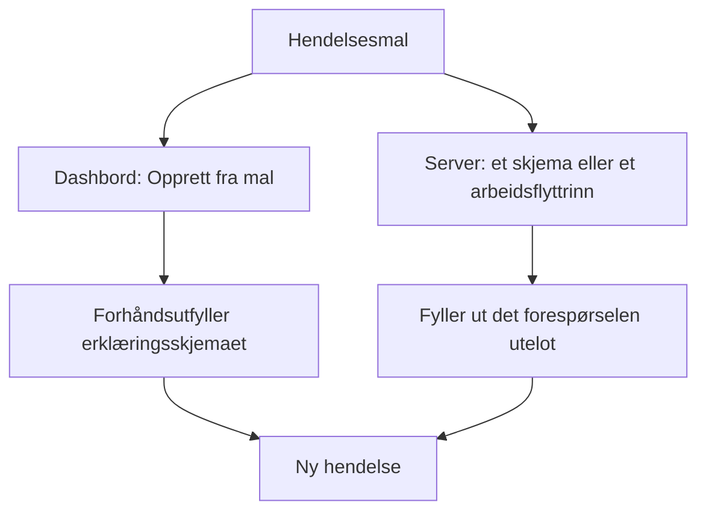
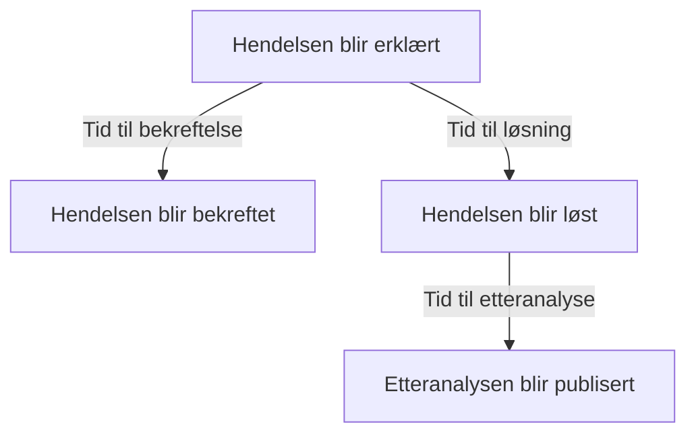
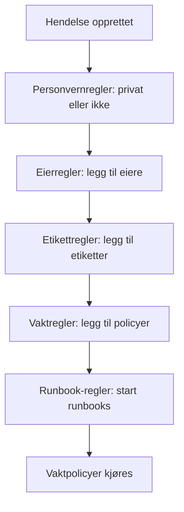

# Hendelsesinnstillinger og automatisering

Konfigurasjonen av hendelser ligger under **Hendelser**, ikke under **Prosjektinnstillinger**: tilstander og alvorlighetsgrader, maler, egendefinerte felt, roller, målinger og nummerprefikser, og reglene som virker på hver ny hendelse. Denne siden er oppslagsverket for hver av de sidene, og for det som kjører av seg selv i det øyeblikket en hendelse erklæres.

:::cards
- [Hendelsesmaler](#hendelsesmaler): Erklær samme type hendelse, forhåndsutfylt, hver gang.
- [Egendefinerte felt](#egendefinerte-felt): Dine egne felt på hver hendelse, spurt om når den erklæres.
- [Målinger](#målinger): Tiden til bekreftelse, løsning eller avbøting, regnet ut for hver hendelse.
- [Regler](#regler-som-kjører-når-en-hendelse-opprettes): Eiere, etiketter, tilkalling og episoder, satt automatisk.
:::

## Hvor hendelsesinnstillingene ligger

Åpne **Hendelser** fra menyen **Produkter** i topplinjen, og brett deretter ut **Innstillinger** nederst i sidemenyen. **Regler** og **Innstillinger** starter begge sammenbrettet, så brett dem ut før sidene nedenfor vises. Alt her hører til prosjektet: maler, roller, egendefinerte felt og regler hører til ett prosjekt og gjelder for hver hendelse som erklæres i det, på ruter som begynner med `/dashboard/{projectId}/incidents/settings/`.

| Side                         | Hva du gjør der                                                                              |
| ---------------------------- | -------------------------------------------------------------------------------------------- |
| **Hendelsesstatus**          | Legge til, gi nytt navn, gi ny farge og endre rekkefølgen på tilstandene en hendelse går gjennom. |
| **Hendelsesalvor**           | Legge til, gi nytt navn, gi ny farge og endre rekkefølgen på alvorlighetsgradene.            |
| **Hendelsesmaler**           | Forhåndsutfylle en hel hendelse — tittel, beskrivelse, ressurser, vaktpolicyer, eiere, etiketter. |
| **Notatmaler**               | Gjenbrukbar tekst for offentlige og private notater.                                         |
| **Postmortem-maler**         | Gjenbrukbare strukturer for etteranalyser.                                                   |
| **Egendefinerte felt**       | Definere ekstra felt som vises på hver hendelse.                                             |
| **Hendelsesroller**          | Definere rollene du tildeler dem som responderer, som Hendelsesleder.                        |
| **Målinger**                 | Måle hvor lang tid ting tar, som tiden til bekreftelse eller til løsning, på hver hendelse.  |
| **Tilknyttede varsler**      | Velge om varslene som er knyttet til en hendelse, bekreftes og løses sammen med den. Begge er slått på i nye prosjekter. |
| **Nummerprefiks**            | Teksten foran hendelses- og episodenumre, som `INC-` i `INC-42`.                             |

Det OneUptime AI gjør på egen hånd, settes ikke her: det har en egen seksjon, **Hendelser → KI**, på ruter som begynner med `/dashboard/{projectId}/incidents/ai/`. Siden **Innstillinger** der slår av eller på undersøkelse av nye hendelser, automatisk retting av dem (slått av til du slår den på), med pull requestene for rettinger og manglende telemetri som hører til rettingen, samlet under den, og utkast til etteranalyser, og hver lagres så snart du slår den om; undersøkelsesreglene og reglene for automatisk utbedring som snevrer inn hvilke hendelser som undersøkes og rettes, og de valgfrie grensene KI jobber under, er brettet sammen under **Flere innstillinger**, og ingen av dem gjelder før du setter dem. **Innsikt** og **Logger** står ved siden av: hva KI har lært av hendelsene dine, og alt den har gjort. Se [AI SRE](/docs/ai/ai-sre).

**Hendelsesstatus** og **Hendelsesalvor** gjennomgås grundig i [Hendelsestilstander og alvorlighetsgrader](/docs/incidents/states-and-severities) — resten av denne siden fortsetter fra **Hendelsesmaler**. Skjemaer som lar folk utenfor teamet ditt melde hendelser, er et eget produkt: se [Skjemaer](/docs/forms/index). Verktøy som selv åpner hendelser, som [Huntress](/docs/integrations/huntress), settes opp under **Hendelser → Integrasjoner**.

Brett ut **Regler**, så får du åtte sider til: **Grupperingsregler**, **Vaktregler**, **Eierregler**, **Runbook-regler**, **Personvernregler**, **Etikettregler**, **SLA-regler** og **Reminder Rules**. De gjennomgås lenger ned.

## Hendelsesmaler

En hendelsesmal er et lagret skjelett av en hendelse. I stedet for å skrive den samme tittelen, den samme listen over monitorer og den samme vaktpolicyen på nytt hver gang betalingsklyngen vakler, lagrer du den én gang og erklærer fra den.

:::steps
1. Gå til **Hendelser → Innstillinger → Hendelsesmaler** (`/dashboard/{projectId}/incidents/settings/templates`). Kortet heter **Hendelsesmaler**.
2. Klikk på **Opprett Hendelse Mal**. Gi malen et navn på **Malinformasjon**, og fyll deretter ut hendelsen den erklærer, på **Hendelsesdetaljer**: en **Tittel**, en **Hendelsesalvor** og en **Beskrivelse**.
3. Trykk **Neste** gjennom de valgfrie trinnene — ressursene den berører, de egendefinerte feltene og vaktpolicyene — og fyll ut det hver hendelse av denne typen har felles.
4. Klikk på **Opprett Hendelse Mal** på det siste trinnet. Fra nå av tilbys malen av **Opprett fra mal** i listen over hendelser.
:::

Opprettelsen tar deg gjennom en veiviser i fire trinn, med to trinn til når prosjektet ditt har egendefinerte hendelsesfelt. Bare de to første spør om noe du må svare på: **Neste** går gjennom de valgfrie trinnene etter dem, og **Opprett Hendelse Mal** står på det siste trinnet.

- **Malinformasjon** — **Malnavn** og **Malbeskrivelse**. De gir selve malen et navn; de vises aldri på hendelsen.
- **Hendelsesdetaljer** — **Tittel**, **Beskrivelse** (Markdown) og **Hendelsesalvor**. Under **Flere felt**, der den sammenbrettede overskriften nevner de tre og viser hver som er satt:
  - **Innledende hendelsestilstand** — tilstanden hendelser som erklæres fra malen, starter i. Den starter tom, som på erklæringsskjemaet, og alternativene står i tilstandenes rekkefølge. Lar du den stå tom, som plassholderen sier, starter de i den vanlige starttilstanden: prosjektets opprettelsestilstand, den hver ny hendelse starter i. En mal som er lagret med en tilstand, beholder den.
  - **Eiere** — personene og teamene som eier hendelser som erklæres fra malen. **Legg til eier** åpner én liste med begge, den samme listen som siden **Eiere** for en hendelse; hvert valg vises som et merke du kan fjerne. En eksisterende mal viser dem på et kort **Eiere**.
  - **Etiketter** — etikettene hendelser som erklæres fra malen, starter med.
- **Berørte ressurser** — som på erklæringsskjemaet: **Monitorer**, deretter **Endre overvåkingsstatus til**, deretter **Andre berørte ressurser** for vertene, klyngene og tjenestene, med **Begrens til disse statussidene** under **Flere felt**. En mal spør alltid om **Endre overvåkingsstatus til**, uansett om monitorer er valgt: den gjelder også monitorene som velges når en hendelse erklæres fra malen, der erklæringsskjemaet viser den så snart den første monitoren er valgt. Kortet **Berørte ressurser** for en eksisterende mal spør på samme måte og viser statusen malen velger, eller **Monitorer beholder statusen sin.** når den ikke velger noen. **Begrens til disse statussidene** begrenser hendelser som erklæres fra malen, til noen av statussidene som viser monitorene deres — en mal `Region East outage` kan ta med sidene for lokasjonen Øst. En eksisterende mal viser det på et kort **Statussideomfang**, med **Rediger statussideomfang**. Se [Én statusside per målgruppe](/docs/status-pages/one-status-page-per-audience).
- **Egendefinerte felt** — bare når prosjektet ditt har egendefinerte hendelsesfelt: verdiene hendelser som erklæres fra denne malen, starter med. Hvert felt tilbys her, ikke bare dem trinnet **Detaljer** spør om, og ingen er påkrevd. En eksisterende mal har et kort **Egendefinerte felt** for å endre dem.
- **Egendefinerte felt ved opprettelse** — også bare når prosjektet ditt har egendefinerte hendelsesfelt: hvilke av dem trinnet **Detaljer** spør om når en hendelse erklæres fra denne malen, og hvilke som må fylles ut. En eksisterende mal har et kort **Egendefinerte felt ved opprettelse** for å endre dem. Se [Egendefinerte felt ved opprettelse](#egendefinerte-felt-ved-opprettelse).
- **Vakt** — **Vaktpolicy**, policyene som skal kjøres når en hendelse som er opprettet fra denne malen, erklæres.

Noen raske regler:

- Listen over maler viser bare **Navn** og **Beskrivelse**. Rader kan ikke redigeres eller slettes fra listen — åpne en mal (`/dashboard/{projectId}/incidents/settings/templates/{modelId}`) for å endre den.
- Alle som kan redigere en mal, kan endre detaljene og de berørte ressursene, **Innledende hendelsestilstand** og **Endre overvåkingsstatus til** inkludert: Project Owners, Project Admins og Project Members, Incident Admins og Incident Members, og en rolle med **Edit Incident Template**.
- Maler støtter import og eksport i JSON, så du kan flytte en mellom prosjekter.
- Uten maler sier listen **Ingen hendelsesmaler funnet** med **Opprett Hendelse Mal** rett under.
- Også uten maler åpner **Opprett fra mal** i listen over hendelser en dialog **No Incident Templates** som sier hvor maler lages, og knappen **Create Template** åpner **Hendelser → Innstillinger → Hendelsesmaler**.

### Slik brukes en mal

Det er to veier, og de slår sammen på samme måte.



- **I dashbordet** — knappen **Opprett fra mal** i listen over hendelser åpner en velger **Velg hendelsesmal**, og erklæringssiden leser malen fra spørreparameteren `incidentTemplateId` og forhåndsutfyller deretter skjemaet med malen pluss eierteamene og eierbrukerne. Trinnet **Detaljer** følger malens [egendefinerte felt ved opprettelse](#egendefinerte-felt-ved-opprettelse). Eierne blir hendelsens eiere uten å få beskjed, når hendelsens Slack- og Microsoft Teams-kanaler finnes, slik at en varselregel som inviterer hendelsens eiere til en ny kanal, også inviterer dem.
- **På serveren** — et [skjema](/docs/forms/on-submit#the-incident-template) som har en **Hendelse Mal**, og trinnet **Create One Incident** i en arbeidsflyt med en valgt **Incident Template**, erklærer hendelsen fra malen på serveren. Trinnet leser malen som Project Admin for arbeidsflytens prosjekt, så en mal fra et annet prosjekt, eller en som er slettet, avvises, og på et abonnement som ikke omfatter hendelsesmaler, avvises trinnet med abonnementet det krever. Malens eiere blir hendelsens eiere, som i dashbordet. Se [Arbeidsflyt-komponenter](/docs/workflows/components).

En hendelse som erklæres på serveren, registrerer malen i `createdIncidentTemplateId`. Bare OneUptime setter den kolonnen, for et skjema eller et arbeidsflyttrinn som nevner en mal: en API-nøkkel eller en pålogget bruker kan ikke, og en forespørsel som sender `createdIncidentTemplateId`, avvises. For å erklære fra en mal via API-et leser du den fra `/api/incident-templates` og sender verdiene i forespørselen.

> [!IMPORTANT]
> Det viktige er sammenslåingsregelen: **en mal fyller bare ut et felt du ikke har satt**. Tittel, beskrivelse, hendelsens alvorlighetsgrad, innledende hendelsestilstand, monitorstatusen bak **Endre overvåkingsstatus til**, monitorer, verter, Kubernetes-klynger, Docker-verter, Podman-verter, tjenester, vaktpolicyer, etiketter og statussider kopieres bare fra malen når kalleren eller skjemaet ikke oppga noe. Det du setter uttrykkelig, vinner alltid, også en tilstand: en hendelse som nevner tilstanden sin, starter i den og tar fortsatt alt annet fra malen, som i dashbordet. Verdier i egendefinerte felt slås sammen ett felt om gangen: malen fyller ut feltene hendelsen ble erklært uten, og en verdi du setter — `0`, `false` og `null` inkludert — vinner over malens.

### Egendefinerte felt ved opprettelse

Prosjektets innstillinger avgjør hva trinnet **Detaljer** spør om når en hendelse erklæres: **Vis ved opprettelse** spør om et felt, og **Påkrevd ved opprettelse** gjør det obligatorisk. En mal kan endre begge for hendelsene som erklæres fra den. Kortet **Egendefinerte felt ved opprettelse** — og veiviserens trinn med samme navn — viser hvert egendefinerte hendelsesfelt i **Rekkefølge**, med én innstilling hver:

| Innstilling      | Når en hendelse erklæres fra denne malen                                                                                            |
| ---------------- | ----------------------------------------------------------------------------------------------------------------------------------- |
| **Standard**     | Feltet følger sine egne **Vis ved opprettelse** og **Påkrevd ved opprettelse**. Alternativet sier hvilken, som **Standard (Påkrevd)**. |
| **Påkrevd**      | Trinnet **Detaljer** spør om feltet, og det må fylles ut. Et ja/nei-felt må være slått på.                                          |
| **Valgfritt**    | Trinnet spør om feltet, og det kan stå tomt — også når prosjektet krever det.                                                       |
| **Skjult**       | Trinnet spør ikke om feltet, også når prosjektet viser eller krever det. Malens egen verdi for det brukes fortsatt.                |

På kortet viser et felt som malen setter til **Påkrevd**, **Valgfritt** eller **Skjult**, også under typen hva prosjektet gjør med det: **Prosjektets standard: Påkrevd**, **Prosjektets standard: Valgfritt** eller **Prosjektets standard: Vises ikke**. Alle som kan se malen, ser det.

Bruk det når hendelsene fra én mal trenger et svar andre ikke trenger — et kundenivå på en mal `Customer data exposure`, for eksempel — eller for å holde et spørsmål prosjektet stiller overalt, utenfor en mal der det ikke passer.

- **Lagret per malvariabel.** Hver innstilling lagres under feltets **Malvariabel**, som aldri endres, så et nytt navn på et felt beholder innstillingen. Et felt som slettes og opprettes på nytt med samme navn, får innstillingen tilbake — i motsetning til spørsmålene i et skjema, som nevner et felt etter ID-en, slik at et felt som slettes og opprettes på nytt, ikke spørres om før det er lagt til igjen.
- **Rediger og Lagre leser dem på nytt.** **Rediger** på kortet leser feltene og malens innstillinger på nytt, med en lasteindikator i dialogen i mellomtiden, og **Lagre** leser dem én gang til og skriver bare feltene du endret i den. Så en endring en annen administrator gjorde i andre felt i mellomtiden, beholdes — også en innstilling vedkommende ga et felt som ble opprettet mens dialogen din var åpen — og en endring du gjorde i et felt som ble slettet i mellomtiden, skrives ikke. Kortet viser deretter feltene slik de er. Kan de ikke leses når du trykker på **Rediger**, sier dialogen hvorfor og tilbyr **Prøv igjen** i stedet for **Lagre**; trykker du på **Lagre**, sier den hvorfor, lagrer ingenting og beholder valgene dine.
- **Bare dashbordet bruker dem.** Som **Påkrevd ved opprettelse** former innstillingene skjemaet **Erklær hendelse** og ingenting annet. Hendelser som erklæres via API-et, av en arbeidsflyt, en monitor, Slack, Microsoft Teams eller KI, er ikke bundet av dem, og [skjemaer](/docs/forms/building) stiller sine egne spørsmål. Se [Påkrevd ved opprettelse kontrolleres bare av dashbordet](#påkrevd-ved-opprettelse-kontrolleres-bare-av-dashbordet).
- **Et felt som kopieres fra et egendefinert monitorfelt,** spørres det fortsatt ikke om når hendelsen har en monitor, uansett hva malen sier.
- **Alle som kan redigere hendelsesmaler, kan endre dem** — Project Members og Incident Members inkludert — også for et felt en Project Admin har gjort **Påkrevd ved opprettelse** for hele prosjektet. Selve innstillingene for hele prosjektet krever en Project Owner, en Project Admin eller tillatelsen **Edit Incident Custom Field**.
- **De følger med malen.** En mals JSON-eksport inneholder dem, og i prosjektet du importerer den til, gjelder de for feltene med samme **Malvariabel**.

Via API-et er de malens `customFieldSettings`: et objekt med hvert felts **Malvariabel** som nøkkel, og `Required`, `Optional`, `Hidden` eller `Default` for hvert felt.

```json title="customFieldSettings"
{
  "customFieldSettings": {
    "impact": "Required",
    "affected_location": "Optional",
    "additional_information": "Hidden"
  }
}
```

Et felt som ikke står i listen, følger sine egne innstillinger, som med `Default`. En forespørsel avvises med en feil `400` når en nøkkel ikke er en gyldig **Malvariabel** — små bokstaver, sifre og understreker — eller en verdi ikke er en av de fire. En nøkkel som ikke samsvarer med noe felt, beholdes og ignoreres.

## Notatmaler

Notatmaler gir dem som responderer, ferdig tekst til oppdateringer om hendelsen, slik at en oppdatering på statussiden klokken tre om natten ikke skrives fra bunnen av av noen som er halvveis i søvne.

:::steps
1. Gå til **Hendelser → Innstillinger → Notatmaler** (`/dashboard/{projectId}/incidents/settings/note-templates`). Kortet heter **Maler for offentlige eller private notater for hendelser** — ett bibliotek dekker begge typer notater.
2. Klikk på **Opprett Hendelse Notat Mal**, og fyll ut den ene siden: **Malnavn** og **Malbeskrivelse**, begge påkrevd, og deretter selve **Notat**, i Markdown, påkrevd: teksten et notat starter med når malen velges.
3. Lagre den. Malen tilbys av **Maler** på begge notatsidene, og av **Velg notatmal** i dialogene **Bekreft hendelse** og **Løs hendelse**.
:::

Som med hendelsesmaler opprettes og vises radene i stedet for å redigeres i listen; åpne en mal for å endre den.

**Variabler.** En notatmal kan inneholde variabler som fylles ut med hendelsens verdier når malen velges, slik at forfatteren ser — og fortsatt kan endre — den ferdige teksten før den publiseres:

| Variabel                            | Fylles ut med                                                      |
| ----------------------------------- | ------------------------------------------------------------------ |
| `{{incident.title}}`                | Hendelsens tittel.                                                 |
| `{{incident.number}}`               | Nummeret, for eksempel `INC-42` eller `#42`.                       |
| `{{incident.severity}}`             | Alvorlighetsgraden.                                                |
| `{{incident.state}}`                | Den gjeldende tilstanden.                                          |
| `{{incident.startedAt}}`            | Når den ble erklært, i forfatterens tidssone, med tidssonen nevnt. |
| `{{incident.labels}}`               | Etikettene, adskilt med komma.                                     |
| `{{incident.affectedStatusPages}}`  | Statussidene den vises på og gir beskjed til, som forfatteren kan se. |
| `{{incident.customFields.<key>}}`   | Verdien til et egendefinert felt, etter feltets **Malvariabel**, som redigeringsverktøyet **Notat** viser under **Malvariabler** etter feltets navn. |

Egendefinerte felt ble tidligere skrevet `{{customFields.<key>}}`; maler som fortsatt bruker det, fylles ut på samme måte. En variabel som ikke har noen verdi, eller som ikke står på listen, blir stående nøyaktig slik den er skrevet, slik at forfatteren kan fylle den ut. Verdier settes inn som tekst: tittelen på en hendelse kan ikke bli et bilde, HTML eller en lenke der teksten skjuler hvor den går, i det publiserte notatet, selv om en adresse i den fortsatt vises som en lenke til den adressen. Et egendefinert felt **Formatert tekst (Markdown)** settes inn som Markdown-en det er.

> [!IMPORTANT]
> Variablene for egendefinerte felt, etiketter og statussider fyller ut teamets egne poster, hvert egendefinert felt, uansett om det er merket med **Ta med i abonnentvarsler** eller ikke, og ett bibliotek dekker også offentlige notater, som vises på hendelsens statussider og sendes på e-post til abonnentene deres. Les den utfylte teksten før du publiserer et offentlig notat.

**Sett inn en variabel.** Du trenger aldri å skrive navnet på en variabel. Redigeringsverktøyet **Notat** tilbyr variablene på tre måter, og hver setter variabelen der markøren står:

- **Malvariabler**, brettet sammen under redigeringsverktøyet: åpne det for å se hver variabel med det den fylles ut med — prosjektets egendefinerte hendelsesfelt etter navn — og klikk på en.
- **Sett inn variabel**, på slutten av redigeringsverktøyets verktøylinje: den samme listen, med et søkefelt.
- Å skrive `{{` i notatet åpner listen under markøren. Skriv videre for å snevre den inn, velg med piltastene, og trykk Enter eller Tab for å sette inn variabelen; Escape lukker listen.

Den samme listen, knappen og `{{` følger med de andre malene som har variabler: notatpåminnelsene i en SLA-regel, episodetittelen og -beskrivelsen i en grupperingsregel for hendelser eller varsler, hendelses- og varselbeskrivelsen og utbedringsnotatene i en monitorregel, malene i en SLO-forbruksrateregel og de egendefinerte malene for abonnentvarsler på en statusside.

Notatmaler dukker opp der du faktisk trenger dem: bekreftelsesdialogene **Bekreft hendelse** og **Løs hendelse** tilbyr begge **Velg notatmal** over feltet **Offentlig notat**, brettet sammen under **Legg til et offentlig notat**. Se [Hendelsesnotater, eiere og feed](/docs/incidents/notes-owners-and-feed) for hvordan offentlige og private notater skiller seg.

## Maler for etteranalyse

En mal for etteranalyse er skjelettet til rapporten du lager etter en hendelse — overskriftene, oppfordringene, de faste spørsmålene — slik at hver gjennomgang i prosjektet følger samme form.

:::steps
1. Gå til **Hendelser → Innstillinger → Postmortem-maler** (`/dashboard/{projectId}/incidents/settings/postmortem-templates`). Kortet heter **Postmortem-maler**.
2. Klikk på **Opprett Hendelse Postmortem Mal**, og fyll ut den ene siden: **Malnavn** og **Malbeskrivelse**, begge påkrevd, og deretter **Mal for etteranalyse**, selve teksten, i Markdown, påkrevd.
3. Lagre den. Siden **Etteranalyse** for hver hendelse tilbyr nå **Bruk mal**.
:::

Du bruker en fra hendelsen, ikke fra innstillingene. Åpne en hendelse, velg **Etteranalyse** i sidemenyen (`/dashboard/{projectId}/incidents/{incidentId}/postmortem`), og bruk **Bruk mal**. Det åpner en dialog **Bruk obduksjonsmal** med en nedtrekksliste **Velg mal**; velger du en, lastes malens tekst inn i redigeringsverktøyet **Notat om etteranalyse**, der du redigerer den før du lagrer. Hendelsesepisoder har den samme siden **Etteranalyse** og henter fra det samme malbiblioteket. **Bruk mal** vises bare når prosjektet har en mal for etteranalyse; finnes det bare én, er den allerede valgt. Redigeringsverktøyet åpner på hendelsens etteranalyse slik den er, med malen som notat, så om den er på statussiden, når den ble publisert og vedleggene forblir som de var.

## Egendefinerte felt

Med egendefinerte felt bærer du dine egne metadata på hver hendelse — navnet på en intern tjeneste, en referanse til en endringssak, et kundenivå — og stiller de samme spørsmålene hver gang en hendelse erklæres, som påvirkningen og når den forventes løst.

:::steps
1. Gå til **Hendelser → Innstillinger → Egendefinerte felt** (`/dashboard/{projectId}/incidents/settings/custom-fields`). Siden heter **Egendefinerte hendelsesfelt** og viser feltene i **Rekkefølge**, hvert bare med **Feltnavn** og **Felttype**.
2. Klikk på **Opprett Hendelse Egendefinert Felt**, og fyll ut **Feltnavn**, **Feltbeskrivelse** og **Felttype** — og, for en nedtrekkslistetype, alternativene, rett under typen.
3. For å spørre om feltet hver gang en hendelse erklæres åpner du **Flere felt** og slår på **Vis ved opprettelse**, og **Påkrevd ved opprettelse** hvis det må besvares.
4. Lagre det, og dra deretter raden i grepet dit feltet skal stå. **Rediger** på raden til et felt åpner resten av innstillingene.
:::

Å opprette et felt spør om **Feltnavn**, **Feltbeskrivelse** og **Felttype** på én side — og, for en nedtrekkslistetype, alternativene, rett under typen. Verdiene til et nytt felt skrives inn. Alt annet ligger under **Flere felt**, som starter sammenbrettet uansett om du oppretter eller redigerer et felt; sammenbrettet nevner overskriften hva som er der, og viser hva som er satt. For å lage et felt som kopierer verdien fra et egendefinert monitorfelt i stedet, åpner du menyen **Mer** (**⋯**) ved siden av **Opprett Hendelse Egendefinert Felt** og velger **Opprett tilordnet egendefinert felt** — se [Felt som kopieres fra en monitor](#felt-som-kopieres-fra-en-monitor).

Hver definisjon har:

- **Feltnavn** — påkrevd, minst to tegn. Plassholderen foreslår et slug-aktig navn som `internal-service`.
- **Feltbeskrivelse** — valgfritt.
- **Felttype** — påkrevd. Den avgjør hvordan data legges inn; typene står nedenfor. Nedtrekkslistetyper trenger også alternativene sine.
- **Nedtrekksalternativer** — verdiene som vises i nedtrekkslisten, hver med en valgfri farge: den lille knappen ved siden av et alternativ viser fargen og åpner de samme navngitte fargene som hvert annet fargefelt, med **Ingen farge** først og **Egendefinert farge** for en nøyaktig kode. Dra et alternativ i grepet i starten av raden for å endre hvor det står. Alternativer kan legges til, gis nytt navn og tas ut etter at hendelser har verdier; se [Endre alternativene i en nedtrekksliste](#endre-alternativene-i-en-nedtrekksliste).
- **Rekkefølge** — hvor feltet vises blant hendelsens egendefinerte felt: på hendelsens side **Egendefinerte felt**, i trinnet **Detaljer** og i meldinger til abonnenter. Det er ikke noe tall å skrive inn: dra et felt i grepet i starten av raden for å flytte det opp eller ned, og et nytt felt legges til på slutten. Dragning er slått av mens et filter eller et søk snevrer inn listen.
- **Vis ved opprettelse** — under **Flere felt**. Spør om feltet i trinnet **Detaljer** når en hendelse erklæres fra dashbordet (se [Opprette en hendelse](/docs/incidents/declaring-incidents)). En hendelsesmal kan gi ethvert felt en startverdi, vist ved opprettelse eller ikke, og kan spørre om et felt eller utelate det for hendelsene som erklæres fra den — se [Egendefinerte felt ved opprettelse](#egendefinerte-felt-ved-opprettelse). [Skjemaer](/docs/forms/building#custom-fields) følger det ikke: et skjema spør bare om feltene som er lagt til i det.
- **Påkrevd ved opprettelse** — under **Flere felt**, tilbudt så snart **Vis ved opprettelse** er slått på. Trinnet **Detaljer** lar deg ikke erklære hendelsen før feltet er fylt ut, og et felt **Boolsk** må være slått på. Dashbordet er det eneste stedet dette kontrolleres; se [Påkrevd ved opprettelse kontrolleres bare av dashbordet](#påkrevd-ved-opprettelse-kontrolleres-bare-av-dashbordet).
- **Ta med i abonnentvarsler** — under **Flere felt**. Sender feltet og verdien til statussidens abonnenter med hendelsens meldinger: standardmeldingene på e-post, i Slack og i Microsoft Teams og webhooks, men ikke SMS. Abonnenter er vanligvis utenfor teamet ditt, så slå det bare på for felt som trygt kan deles. Se [Abonnenter og kunngjøringer](/docs/status-pages/subscribers#hendelser).
- **Malvariabel** — nøkkelen en mal når feltet med, `{{incident.customFields.<key>}}`, i notatmaler og egendefinerte maler for abonnentvarsler. Den dannes fra feltets navn når feltet opprettes — små bokstaver, sifre og understreker, så `Expected Resolution` blir `expected_resolution`, med `_2`, `_3` og så videre lagt til når et annet felt allerede har nøkkelen — og den endres ikke når feltet får nytt navn. Ingen setter den for hånd: API-et ignorerer en verdi som sendes for den. Maler som er skrevet med det eldre `{{customFields.<key>}}`, fortsetter å fungere. Du trenger aldri å slå den opp: redigeringsverktøyene som setter den inn — **Notat** i en notatmal og de egendefinerte malene for abonnentvarsler for hendelseshendelser på en statusside — viser hvert felts variabel under **Malvariabler**, etter feltets navn. Skjemaet **Rediger** for et felt viser den også, skrivebeskyttet, nederst i **Flere felt**, med en knapp som kopierer den.

**Rekkefølge**, **Vis ved opprettelse**, **Påkrevd ved opprettelse**, **Ta med i abonnentvarsler** og **Malvariabel** finnes bare på egendefinerte hendelsesfelt. De egendefinerte feltene på monitorer, varsler, planlagte vedlikeholdshendelser og de andre ressursene har dem ikke.

Definisjonene ligger i en egen modell; verdiene ligger på selve hendelsen i kolonnen `customFields`. På en enkelt hendelse fyller du dem ut fra **Egendefinerte felt** i hendelsens sidemeny (`/dashboard/{projectId}/incidents/{incidentId}/custom-fields`), der feltene står i **Rekkefølge**. Hendelsesmaler beholder verdier for de samme feltene i sine egne `customFields`.

**Ett hull det er verdt å kjenne til.** Definisjoner av egendefinerte hendelsesfelt er den eneste delen av hendelsesfamilien uten utløsere for arbeidsflyter — se seksjonen om arbeidsflyter nedenfor.

### Felttyper

| Felttype                                   | Legges inn som                                        | Godt for                                           |
| ------------------------------------------ | ----------------------------------------------------- | -------------------------------------------------- |
| **Tekst**                                  | Én linje tekst                                        | En referanse til en endringssak, navnet på en intern tjeneste |
| **Antall**                                 | Et tall                                               | Anslått varighet i minutter, berørte brukere       |
| **Boolsk**                                 | En ja/nei-bryter                                      | En bekreftelse, «kunderettet»                      |
| **Nedtrekksliste (enkeltvalg)**            | Ett alternativ fra en liste                           | Påvirkning, region                                 |
| **Nedtrekksliste (flervalg)**              | Flere alternativer fra en liste                       | Berørte systemer                                   |
| **Dato**                                   | En dato                                               | En dato for fornyelse av en kontrakt               |
| **Dato og klokkeslett**                    | En dato og et klokkeslett                             | Forventet løsning                                  |
| **Lang tekst**                             | Flere linjer ren tekst                                | Berørte brukere eller systemer, tilleggsinformasjon |
| **Formatert tekst (Markdown)**             | Formatert tekst, i Markdown-redigeringsverktøyet med visuell modus | En midlertidig løsning med lenker og lister |

**Lang tekst** og **Formatert tekst (Markdown)** er tilgjengelige for de egendefinerte feltene på hver ressurs, ikke bare hendelser. En verdi med formatert tekst lagres som Markdown-en den ble skrevet i. Det finnes ingen type med alternativknapper eller en gruppe avkrysningsbokser: bruk en **Nedtrekksliste (enkeltvalg)**, en **Nedtrekksliste (flervalg)** eller en **Boolsk**.

### Påkrevd ved opprettelse kontrolleres bare av dashbordet

**Påkrevd ved opprettelse** holder skjemaet **Erklær hendelse** tilbake, og ingenting annet. Hendelser som en monitor, API-et, Slack, Microsoft Teams eller KI åpner, kan ikke fylle ut et skjema, så de opprettes med feltet tomt. Når en hendelse finnes, forblir hvert felt valgfritt på siden **Egendefinerte felt**, slik at noen som retter én verdi midt i et avbrudd, aldri blir bedt om alle de andre. Se det som en påminnelse til dem som erklærer hendelser, ikke som et løfte om at hver hendelse har en verdi.

En mals [egendefinerte felt ved opprettelse](#egendefinerte-felt-ved-opprettelse) er det samme: de former skjemaet **Erklær hendelse** og ingenting annet. [Skjemaer](/docs/forms/building#required-questions) er unntaket, fordi serveren kontrollerer spørsmålene **Påkrevd** i et skjema når skjemaet sendes.

### Felt som kopieres fra en monitor

Et egendefinert felt kan ta verdien fra et egendefinert felt på hendelsens monitorer i stedet for å få den skrevet inn — en region eller et kundenivå monitorene dine allerede registrerer, for eksempel. For å lage et åpner du menyen **Mer** (**⋯**) ved siden av **Opprett Hendelse Egendefinert Felt** og velger **Opprett tilordnet egendefinert felt**. Det spør om tre ting:

- **Monitorfelt** — det egendefinerte monitorfeltet som skal kopieres. Hvert tilbys, hvert med typen under navnet. Det nye feltet får den typen, og alternativene til en nedtrekksliste, slik at de to alltid passer sammen.
- **Feltnavn** — starter som navnet på monitorfeltet, til du skriver et annet.
- **Feltbeskrivelse** — valgfritt.

Verdien fylles ut når en hendelse opprettes med en monitor, og holdes oppdatert når monitorens verdi endres. Når monitorene til en hendelse har forskjellige verdier, blir et felt med én verdi stående som det er, og et flervalgsfelt får alle. Kopiering tømmer aldri en verdi: en hendelse uten monitor beholder det som er skrevet på den, og å tømme monitorens verdi lar kopiene være. Trinnet **Detaljer** spør ikke om et kopiert felt når hendelsen har en monitor.

For å kopiere verdien til et eksisterende felt fra en monitor, endre hvilket monitorfelt det kopierer, eller gå tilbake til å skrive den inn, åpner du **Rediger** på feltets rad og bruker **Hent verdi fra** under **Flere felt**. Egendefinerte felt på varsler og planlagt vedlikehold kan kopiere fra monitorene sine på samme måte.

### Verdier i egendefinerte felt via API-et

På `POST /api/incident` og ved oppdateringer av en hendelse er `customFields` et objekt med hvert felts **Feltnavn** som nøkkel:

```json title="customFields"
{
  "customFields": {
    "Impact": "Major",
    "Estimated Duration": 90,
    "Acknowledgement": true,
    "Expected Resolution": "2026-10-01T14:30:00.000Z"
  }
}
```

Når en bruker eller en API-nøkkel oppretter eller oppdaterer en hendelse, må hver verdi forespørselen setter eller endrer, passe til feltet, ellers avvises forespørselen med en feil `400` som nevner feltet og verdien det fikk:

| Felttype                                                           | Godtar                                                         |
| ------------------------------------------------------------------ | -------------------------------------------------------------- |
| **Tekst**, **Lang tekst**, **Formatert tekst (Markdown)**          | Tekst. Et tall, `true` eller `false` lagres slik det ble sendt. |
| **Antall**                                                         | Et tall, eller tekst som er et, som `"42"`.                    |
| **Boolsk**                                                         | `true` eller `false`, eller teksten `"true"` eller `"false"`.  |
| **Dato**, **Dato og klokkeslett**                                  | En dato, helst som ISO 8601-tekst.                             |
| **Nedtrekksliste (enkeltvalg)**                                    | Et av alternativene.                                           |
| **Nedtrekksliste (flervalg)**                                      | En liste over alternativene, eller ett enkelt alternativ alene. |

For en **Nedtrekksliste (flervalg)** nevner avvisningen de første 10 oppføringene som ikke er blant alternativene, og deretter hvor mange flere det er.

Hva som ikke kontrolleres, slik at eksisterende integrasjoner fortsetter å fungere:

- **Verdier forespørselen lar være som de er.** Kortet **Egendefinerte felt** sender hver verdi tilbake når du lagrer en av dem, så en verdi som ble lagret før disse kontrollene fantes, eller et alternativ i en nedtrekksliste som er fjernet siden, aldri hindrer deg i å lagre de andre. Et flervalgsfelt beholder oppføringene det allerede hadde.
- **Nøkler som ikke er navnet på et egendefinert hendelsesfelt**, som `jiraIssueKey` som [Jira-integrasjonen](/docs/integrations/jira) skriver.
- **Tomme verdier.** `null` eller en tom streng tømmer et felt.
- **Verdier som kopieres fra et egendefinert monitorfelt**, og skrivinger OneUptime gjør selv.
- **Påkrevd ved opprettelse.** API-et spør aldri om et felt.

En hendelse som et skjema eller trinnet **Create One Incident** i en arbeidsflyt erklærer fra en mal (`createdIncidentTemplateId`), starter med malens verdier i egendefinerte felt, slått sammen ett felt om gangen under dem den sender (se [Slik brukes en mal](#slik-brukes-en-mal)). En API-nøkkel kan ikke erklære fra en mal: en forespørsel som sender `createdIncidentTemplateId`, avvises.

### Gi et felt nytt navn

Verdier lagres under feltets navn, så et nytt navn på et felt må flytte dem. Når du lagrer et nytt **Feltnavn**, flytter OneUptime feltets verdi til det nye navnet på hver hendelse og hver hendelsesmal i prosjektet, og oppdaterer de lagrede visningene av listen over hendelser som viser feltet eller filtrerer på det. Flyttingen starter ingen arbeidsflyt **On Update Incident**, og den endrer ikke tidspunktet for siste oppdatering på noen hendelse. Feltets **Malvariabel** blir som den var, så notatmaler, egendefinerte maler for abonnentvarsler og webhook-integrasjoner som bruker den, fortsetter å fungere.

To nye navn avvises: ett til et navn et annet egendefinert hendelsesfelt allerede har (sammenlignet uten hensyn til store og små bokstaver), og en API-forespørsel som ville gi flere felt nytt navn på én gang. Arbeidsflyter og API-klienter som leser eller skriver en verdi etter feltets gamle navn, må endres til det nye.

Etter et nytt navn inneholder feltet bare sine egne verdier. Å slette et felt etterlater verdiene på hendelsene som hadde dem, så hendelser kan fortsatt ha verdier under det nye navnet fra et felt som ble slettet; det nye navnet tømmer dem i stedet for å vise dem som dette feltets svar eller sende dem til abonnenter. Hver hendelse og mal flyttes samlet: feiler flyttingen, endres ingen av dem, feltet beholder det gamle navnet, og lagringen melder en feil, slik at du bare kan prøve igjen. Et felt som **opprettes** med navnet på et slettet felt, er annerledes: det viser verdiene det feltet etterlot, og sender dem til abonnentene så snart **Ta med i abonnentvarsler** er slått på.

Å slette et felt etterlater spørsmålene som spør om det, på hvert [skjema](/docs/forms/building#custom-fields) i prosjektet, men de stilles ikke lenger: skjemabyggeren merker hvert av dem slik at du kan slette det. Et felt som opprettes på nytt med samme navn, er et nytt felt og spørres ikke om på et skjema før noen legger det til der. Hendelsesmaler beholder innstillingen **Egendefinerte felt ved opprettelse** for det.

### Endre alternativene i en nedtrekksliste

Alternativene i et felt **Nedtrekksliste (enkeltvalg)** eller **Nedtrekksliste (flervalg)** kan endres når som helst: åpne **Rediger** på feltets rad. En hendelse lagrer teksten til alternativet den fikk, så hva en endring gjør med hendelsene som har et alternativ, avhenger av endringen:

| Hva du gjør med et alternativ            | Hva som skjer med hendelsene som har det                                                                           |
| ---------------------------------------- | ------------------------------------------------------------------------------------------------------------------ |
| **Legger til** et                        | Ingenting. Det tilbys fra nå av.                                                                                   |
| **Gir det nytt navn** (endrer teksten)   | De viser det nye navnet. Under alternativet sier skjemaet hvor mange hendelser som vil gjøre det.                  |
| **Tar det ut** (søppelkassen ved siden av) | De beholder det, vist som _ikke lenger et alternativ_, med mindre du velger et annet alternativ for dem under **Ikke lenger alternativer**. |
| **Drar** det i grepet                    | Ingenting. Bare rekkefølgen alternativene står i, endres.                                                          |

Når skjemaet åpnes, teller det hvor mange hendelser som har hver verdi. **Ikke lenger alternativer** viser hvert alternativ du tar ut som en hendelse fortsatt har, og hver verdi hendelser har som aldri var et alternativ (en som ble skrevet via API-et, for eksempel), hver med hvor mange hendelser som har den. For hver kan du beholde den som den er, eller velge alternativet de hendelsene skal ha i stedet. **Angre** setter tilbake et alternativ du tok ut ved en feil.

Når du lagrer, flyttes et alternativ med nytt navn og en verdi du velger et alternativ for: på hver hendelse og hendelsesmal i prosjektet, i de lagrede visningene av listen over hendelser som filtrerer på dem, og i svarene [skjemamaler](/docs/forms/building) gir for feltet. Som med et felt med nytt navn starter flyttingen ingen arbeidsflyt **On Update Incident** og endrer ikke tidspunktet for siste oppdatering på noen hendelse; feiler den, flyttes ingenting, og feltet beholder de gamle alternativene. Arbeidsflyter, API-klienter og Terraform-konfigurasjoner som skriver et alternativ etter den gamle teksten, trenger den nye teksten.

En hendelse der feltet ikke lenger tilbyr verdien, viser verdien, merket som _ikke lenger et alternativ_, på sin side **Egendefinerte felt** og i listen over hendelser. Å redigere de andre feltene beholder den; velg et annet alternativ for å endre den.

De egendefinerte feltene på alle andre ressurser fungerer på samme måte: monitorer, varsler, planlagte vedlikeholdshendelser, statussider, vaktpolicyer, team, teammedlemmer og lagerelementer. Å gi et alternativ i et monitorfelt nytt navn, eller legge til et, gjør det samme med hendelses-, varsel- og vedlikeholdsfeltene som kopierer det (se [Felt som kopieres fra en monitor](#felt-som-kopieres-fra-en-monitor)), slik at de fortsetter å tilby hver verdi de kopierer.

Via API-et sender du den nye listen som `dropdownOptions` og de nye navnene i `miscDataProps`:

```json
{
  "data": { "dropdownOptions": "Facility Alpha\nFacility B" },
  "miscDataProps": {
    "renamedDropdownOptions": [{ "from": "Facility A", "to": "Facility Alpha" }]
  }
}
```

Hver `to` må være et av feltets alternativer når det er lagret, og hver `from` kan bare få nytt navn én gang. Uten `renamedDropdownOptions` endres listen, og hver lagrede verdi blir som den er, noe som også er det som skjer når du endrer `dropdown_options` i Terraform.

### Terraform

Innstillingene ligger på ressursen `oneuptime_incident_custom_field` som `sort_order`, `show_on_create`, `is_required_on_create` og `include_in_subscriber_notifications`. `variable_key` er skrivebeskyttet: nøkkelen OneUptime dannet da feltet ble opprettet.

Utelat `sort_order`, så havner et nytt felt nederst i listen. Gi det tallet et annet felt allerede har, så tar det den plassen, mens feltene i veien flytter én plass. Et tall ingen andre felt har, beholdes slik du skrev det.

## Målinger

En måling er tiden mellom to øyeblikk i en hendelse. **Tid til bekreftelse** er tiden fra en hendelse erklæres til noen bekrefter den; **tid til løsning** går fra den erklæres til den er løst. Du setter opp en måling én gang, og OneUptime regner den ut for hver hendelse, også tidligere hendelser, og viser den i et diagram, slik at du kan se om teamet ditt blir raskere.

Gå til **Hendelser → Innstillinger → Målinger** (`/dashboard/{projectId}/incidents/settings/measurements`), og velg **Opprett Incident Measurement**. Hver definisjon har et **navn**, et **startpunkt** og et **sluttpunkt**. Den permanente **nøkkelen** dannes fra navnet mens du skriver det — "Time to Detect" får `time-to-detect` — så det er ingenting å fylle ut. For å velge en egen nøkkel velger du **Rediger** ved siden av den før du oppretter målingen.



Varsler og planlagte vedlikeholdshendelser har den samme funksjonen, under **Varsler → Innstillinger → Målinger** og **Planlagt vedlikehold → Innstillinger → Målinger**. Alt nedenfor gjelder for alle tre, hver med sine egne øyeblikk.

### Ferdige målinger

Skjemaet åpner på **Hva vil du måle?**. Velg en av disse, og navnet, beskrivelsen og begge øyeblikkene fylles ut: **Neste** viser øyeblikkene, og målingen opprettes fra det siste trinnet.

| Hvor                      | Måling                                 | Starter når                                       | Slutter når                            |
| ------------------------- | -------------------------------------- | ------------------------------------------------- | -------------------------------------- |
| Hendelser                 | **Tid til bekreftelse**                | Hendelsen blir erklært                            | Hendelsen blir bekreftet               |
| Hendelser                 | **Tid til løsning**                    | Hendelsen blir erklært                            | Hendelsen blir løst                    |
| Hendelser                 | **Tid til etteranalyse**               | Hendelsen blir løst                               | Etteranalysen blir publisert           |
| Varsler                   | **Tid til bekreftelse**                | Varselet blir opprettet                           | Varselet blir bekreftet                |
| Varsler                   | **Tid til løsning**                    | Varselet blir opprettet                           | Varselet blir løst                     |
| Planlagt vedlikehold      | **Startforsinkelse**                   | Vedlikeholdet skal etter planen starte            | Vedlikeholdet starter                  |
| Planlagt vedlikehold      | **Overskridelse**                      | Vedlikeholdet skal etter planen slutte            | Vedlikeholdet slutter                  |
| Planlagt vedlikehold      | **Varighet på vedlikeholdet**          | Vedlikeholdet starter                             | Vedlikeholdet slutter                  |

Velg **Noe annet** for å velge de to øyeblikkene selv. Et navn du har skrevet, beholdes når du velger en av disse.

### Velg de to øyeblikkene

Det andre trinnet, **Start og slutt**, har **Starter når** og **Slutter når**. Hver viser med vanlige ord øyeblikkene en måling kan starte eller slutte ved. En ny måling starter når hendelsen erklæres, så som oftest velger du bare hvor den slutter.

| Øyeblikk                                          | Når det skjer                                                                | Lagret i API-et som                                   |
| ------------------------------------------------- | ---------------------------------------------------------------------------- | ----------------------------------------------------- |
| **Hendelsen blir erklært**                        | Når hendelsen startet i OneUptime: når den ble opprettet, med mindre noen satte et tidligere tidspunkt. | `Declared At` (`Timeline Start` er det samme øyeblikket) |
| **Hendelsen blir bekreftet**                      | Når den når den bekreftede tilstanden din, eller en tilstand etter den (en løsning rett fra starten teller også). | `State Role Entered`, rolle `Acknowledged` |
| **Hendelsen blir løst**                           | Når den når den løste tilstanden din.                                        | `State Role Entered`, rolle `Resolved`                |
| **Etteranalysen blir publisert**                  | Når hendelsens etteranalyse publiseres.                                      | `Postmortem Posted At`                                |
| **Hendelsen går over i en tilstand du velger**    | En av hendelsestilstandene dine. Skjemaet spør deretter hvilken.             | `State Entered`, med tilstanden                       |
| **Påvirkningen starter**                          | Når kundene først ble berørt — se nedenfor.                                  | `Impact Started At`                                   |
| **Hendelsen går over i sin første tilstand**      | Når den når tilstanden nye hendelser starter i, som Identified.              | `State Role Entered`, rolle `Created`                 |
| **Hendelsen blir opprettet i OneUptime**          | Vanligvis samme øyeblikk som den erklæres.                                   | `Created At`                                          |

Varsler starter fra **Varselet blir opprettet** og har ingen etteranalyse; planlagt vedlikehold legger til **Vedlikeholdet skal etter planen starte** og **Vedlikeholdet skal etter planen slutte**, det planlagte vinduet, ved siden av **Vedlikeholdet starter**, **Vedlikeholdet slutter** og **Vedlikeholdet blir fullført**.

Å nå **bekreftet** eller **løst** følger tilstanden som spiller den rollen, så det fortsetter å fungere hvis du gir tilstanden nytt navn eller erstatter den. **En tilstand du velger** er bundet til den ene tilstanden.

### Flere felt

Noen få alternativer de fleste målinger aldri endrer, er brettet sammen under **Flere felt** på slutten av trinnet **Start og slutt**, satt til standardene API-et også bruker. Sammenbrettet nevner overskriften dem og viser dem som er endret.

- **Hvis starten skjer mer enn én gang** og **Hvis slutten skjer mer enn én gang** vises for et øyeblikk som når en tilstand. En gjenåpnet hendelse kan nå den samme tilstanden igjen. **Bruk første gang** er standarden og samsvarer med de innebygde tidene for hendelser; **Bruk siste gang** følger en gjenåpnet hendelse til den siste gjennomgangen.
- **Vis varigheter i** er enheten målingens diagrammer bruker. **Automatisk** er standarden: den registrerer sekunder, som diagrammene viser som sekunder, minutter, timer eller dager etter hvert som tallene vokser. **Minutter**, **Timer** eller **Dager** holder et diagram i én enhet. Hvert punkt skrives i enheten du velger, og å endre den skriver målingens punkter på nytt i den nye.
- **Diagramsammendrag** er hvordan **Vis diagram** oppsummerer mange hendelser: **Gjennomsnitt** som standard, eller **Median**, 90., 95. eller 99. persentil, **Lengste** eller **Korteste**.
- **Vis på hendelsessider** setter målingen på kortet **Målinger** på hver hendelses side (se nedenfor). Den er slått på som standard; slå den av for en måling du bare vil ha i et diagram. Varsler og planlagt vedlikehold kaller den **Vis på varselsider** og **Vis på sider for vedlikeholdshendelser**.

Å redigere en måling legger til en bryter **Aktivert**: slå den av for å slutte å måle hendelser. Tallene som allerede er registrert, beholdes.

### Hva en måling rapporterer

| Status             | Betydning                                                                                 |
| ------------------ | ----------------------------------------------------------------------------------------- |
| **Recorded**       | Begge øyeblikkene har skjedd. Varigheten står på hendelsen og i diagrammet.               |
| **Venter**         | Et øyeblikk har ikke skjedd ennå, men kan fortsatt skje — hendelsen er fortsatt åpen.     |
| **Not Applicable** | Et øyeblikk kan aldri skje — tilstanden ble hoppet over, eller tidspunktet ble aldri registrert. |
| **Invalid**        | Begge øyeblikkene har skjedd, men slutten ligger før starten. De registrerte tidene dine motsier hverandre. |

Bare verdier **Recorded** blir punkter i diagrammet. Et øyeblikk som ble hoppet over, skriver ingenting i stedet for en null, så det kan ikke trekke et gjennomsnitt mot seg.

**Invalid** er statusen det er verdt å følge med på. Det er det en måling sier når tidslinjen den ble regnet ut fra, er feil — for eksempel en slutt 17 minutter før starten. Det er med vilje mer iøynefallende enn et troverdig tall ingen stiller spørsmål ved.

### På hver hendelses side

Hver hendelses side viser sine egne målinger på et kort **Målinger**, rett under **Hendelsesdetaljer**, i rekkefølgen fra listen på denne innstillingssiden. Hver sier hva den måler — **Erklært → Bekreftet** — og hva den viser for denne hendelsen:

| Den viser                             | Når                                                                                                                              |
| ------------------------------------- | -------------------------------------------------------------------------------------------------------------------------------- |
| En varighet, som **4 minutter**       | Begge øyeblikkene har skjedd (**Recorded**). Den står i målingens enhet: **Automatisk** leses som sidens andre tider, **1 time og 5 minutter**, og **Timer** leses **1,5 timer**. |
| **Har pågått i 12 minutter**          | Klokken har startet, og slutten har ikke skjedd ennå. Den teller oppover mens siden er åpen.                                     |
| **Ikke startet ennå**                 | Starten har ikke skjedd ennå, eller er et tidspunkt som fortsatt ligger foran, som den planlagte starten på en vedlikeholdshendelse. |
| **Ikke nådd**                         | Hendelsen er løst, og øyeblikket målingen ventet på, kom aldri — en hendelse som ble løst uten å bli bekreftet.                   |
| **Ikke målt**                         | Et øyeblikk kan aldri skje (**Not Applicable**), med årsaken, som en tilstand som ble hoppet over.                               |
| **Slutter før den starter**           | De registrerte tidene motsier hverandre (**Invalid**), med hvor langt fra hverandre de ligger.                                   |
| **Ikke regnet ut ennå**               | OneUptime har ikke regnet den ut for denne hendelsen ennå, som rett etter at målingen ble opprettet.                             |

En måling der du endrer starten eller slutten, fortsetter å vise den gamle verdien på hver hendelse til OneUptime har regnet den ut på nytt, slik diagrammet også gjør. Rett etter en tilstandsendring fra hendelsens overskrift viser kortet de nye verdiene så snart OneUptime har regnet dem ut, vanligvis med en gang.

Varsler og planlagte vedlikeholdshendelser har det samme kortet på sidene sine. For en vedlikeholdshendelse kommer **Ikke nådd** når hendelsen er avsluttet. Kortet utelates når ingen aktivert måling har **Vis på hendelsessider** slått på, og for noen som ikke har lov til å lese målinger.

### Påvirkning startet, og hvorfor det er tomt

**Påvirkning startet** er et felt på hendelsen og på varselet. Det er tomt som standard, og OneUptime fyller det aldri ut. Det registreres av et hendelsesskjema som spør når påvirkningen begynte (se [Skjemaer](/docs/forms/index)), eller via API-et. Til det er registrert, har en måling som starter eller slutter ved **Påvirkningen starter**, ikke noe tall for den hendelsen.

Det er nettopp poenget. `Declared At` registrerer når OneUptime fikk vite om det, noe som for en hendelse som utløses av en monitor, er når kriteriene ble behandlet — ikke når påvirkningen begynte. Hvis "Time to Detect" som standard lot starten være det samme tidspunktet som slutten bruker, ville hver hendelse rapportere null, og diagrammet ville si "vi oppdager umiddelbart". Et tomt felt og en måling **Not Applicable** sier det som er sant: ingen har registrert når dette begynte.

### Rett et feil tidsstempel

Hver måling regnes ut på nytt fra bunnen av hver gang dataene under den endres — en oppføring i tilstandstidslinjen som opprettes, redigeres eller slettes, eller `Impact Started At`, `Declared At` eller `Postmortem Posted At` som rettes på hendelsen. Ingenting lappes trinnvis, så det finnes ingen utdatert verdi å reparere.

Feltet **Begynner den** på en oppføring i tilstandstidslinjen kan redigeres. Ble en hendelse bekreftet klokken 09:12, men oppføringen sier 09:29, retter du oppføringen, og hver måling som er avledet av den, flytter seg med.

### Diagrammer, API og Terraform

Velg **Vis diagram** på en måling for å åpne diagrammet i metrikkutforskeren, over den siste måneden, oppsummert på dens måte. Hver aktiverte måling skriver en metrikk med navnet `oneuptime.incident.measurement.<key>`, som du også kan legge til på et hvilket som helst dashbord. Varsler bruker `oneuptime.alert.measurement.<key>`, og planlagt vedlikehold bruker `oneuptime.scheduled-maintenance.measurement.<key>`. Listens kolonne **Nøkkel**, skjult som standard, viser nøkkelen til hver måling.

Definisjoner er vanlige API-ressurser, så Terraform-leverandøren administrerer dem som `oneuptime_incident_measurement`, `oneuptime_alert_measurement` og `oneuptime_scheduled_maintenance_measurement`. Beregnede verdier er skrivebeskyttede og vises som datakilder. Utelatt tar alternativene under **Flere felt** de samme standardene som i dashbordet: `unit` er `seconds` (eller `minutes`, `hours`, `days`), `aggregation_type` er `Avg` (eller `P50`, `P90`, `P95`, `P99`, `Max`, `Min`), og `start_state_occurrence` og `end_state_occurrence` er `First` (eller `Last`). `show_on_incident_view` (`show_on_alert_view`, `show_on_scheduled_maintenance_view`) er `true`.

**Nøkkelen** er permanent fordi den er en del av metrikkens navn — å endre den ville etterlate serien foreldreløs. Gi målingen nytt navn så mye du vil; nøkkelen blir.

Via API-et og i Terraform kan nøkkelen også utelates: den dannes fra navnet, med `-2`, `-3` og så videre lagt til når en annen måling i prosjektet allerede har den. En nøkkel du sender, beholdes slik du skrev den. Den må bestå av små bokstaver, tall og bindestreker, starte med en bokstav eller et tall, være høyst 50 tegn lang, og ingen annen måling i prosjektet kan ha den.

### Bytte fra en annen hendelsesplattform

Kommer du fra et verktøy med deklarative definisjoner av målinger, kan de overføres direkte:

| Deres måling            | Sett den opp her som                                                                                |
| ----------------------- | --------------------------------------------------------------------------------------------------- |
| Time to Detect          | **Noe annet**: **Påvirkningen starter** → **Hendelsen blir erklært**                                |
| Time to Acknowledge     | Den ferdige **Tid til bekreftelse**                                                                 |
| Time to Mitigate        | **Noe annet**: **Hendelsen blir erklært** → **Hendelsen går over i en tilstand du velger**, en tilstand **Mitigated** du legger til mellom Bekreftet og Løst |
| Time to Resolve         | Den ferdige **Tid til løsning**                                                                     |

Time to Mitigate trenger en tilstand som ikke finnes som standard. Legg den til under **Hendelser → Innstillinger → Hendelsesstatus** — en ny tilstand legges til rett over den løste tilstanden, og du kan dra den hvor som helst mellom de andre.

> [!NOTE]
> **Én ting å vite om historikken.** En måling du oppretter i dag, regnes også ut for tidligere hendelser, i bakgrunnen: verdien på hver hendelse og punktet i diagrammet. Å endre hvor en måling starter eller slutter, eller enheten, regner den ut på nytt for hver hendelse. Vil du beholde de gamle tallene, oppretter du en ny måling i stedet.

## Hendelsesroller

Hendelsesroller er de navngitte oppgavene du tildeler folk under en respons. Definer dem under **Hendelser → Innstillinger → Hendelsesroller** (`/dashboard/{projectId}/incidents/settings/roles`). Tabellen viser navnet og beskrivelsen til hver rolle.

Et nytt prosjekt starter med én rolle, **Hendelsesleder**, personen som har ansvaret for responsen. OneUptime fyller den ut for deg: erklærer du en hendelse fra dashbordet uten å velge noen til rollen, blir du dens Hendelsesleder, og en hendelse som fortsatt ikke har en, får den første personen som endrer tilstanden, med mindre vedkommende allerede har en annen rolle på den. Hendelsesleder kan få nytt navn, men ikke slettes, og den har alltid én person. **Slett** for den er låst og sier hvorfor.

Legg til de andre rollene teamet ditt bruker, som Responder, Communications Lead eller Scribe, med **Opprett Hendelse Rolle**. Skjemaet er én side: et navn og en beskrivelse, og deretter **Flere felt**, sammenbrettet, med **Tillat flere brukere**, rollens ikon og farge. En ny rolles farge er allerede valgt, en farge rollene i listen ikke bruker ennå, og ikonet er valgfritt, så du åpner bare **Flere felt** for å endre dem. En rolle har én person per hendelse, med mindre du slår på **Tillat flere brukere**. Prosjekter som ble opprettet av tidligere versjoner av OneUptime, startet også med Responder, Communications Lead og Observer. De beholder dem til du sletter dem.

Roller er bare definisjoner. Du tildeler folk til dem per hendelse — erklæringsveiviseren spør på trinnet **Vakt og roller**, med et felt **Tildel hendelsesroller**, og hver hendelse har en side **Roller** i sidemenyen. Kriteriene til en monitor og en grupperingsregel for hendelser kan velge folk til dem på forhånd. Hvert av disse skjemaene spør med de samme kortene, ett per rolle: en rolle med merket **Primær** er Hendelsesleder eller en annen primær rolle, og en rolle for én person fjerner velgeren når den har en. På kortet **Roller** for en hendelse tilbyr en rolle for flere personer **Add More**.

## Nummerprefikser

Hver hendelse får et nummer fra en teller per prosjekt. Uten prefiks vises det som `#42`; med et vises det som `INC-42`. Sier teamet ditt "INC-42" høyt, få produktet til å si det samme. Nye prosjekter starter med `INC-` for hendelser og `IE-` for hendelsesepisoder.

Gå til **Hendelser → Innstillinger → Nummerprefiks** (`/dashboard/{projectId}/incidents/settings/number-prefix`). Kortet **Nummerprefiks** har en rad for **Hendelser** og en for **Hendelse Episoder**. Hver viser prefikset og et eksempel på nummeret det danner: `INC-`, og deretter **Eksempel:** `INC-42`. Et prosjekt uten prefiks viser **Ingen prefiks** og `#42`.

:::steps
1. Klikk på **Oppdater**. Dialogen **Rediger nummerprefiks** åpner, med to felt: **Nummerprefiks for hendelse** (plassholder `INC-`) og **Nummerprefiks for hendelsesepisode** (plassholder `IE-`).
2. Skriv prefikset. Under hvert felt viser **Forhåndsvisning:** nummeret mens du skriver, så du ser `OPS-42` før du lagrer `OPS-`. La et felt stå tomt for å gå tilbake til `#`.
3. Klikk på **Lagre endringer**. Hendelser og episoder som opprettes fra nå av, får det nye prefikset.
:::

Et prefiks:

- har opptil 20 tegn;
- bruker bokstaver (fra et hvilket som helst alfabet), sifre og `-` `_` `.` `/` `:` `#` — ingen mellomrom, og ingenting Markdown, Slack eller HTML ville lese som formatering;
- slutter ikke med et siffer, som ville flyte sammen med nummeret: `SEV1` ville gjøre hendelse 42 til `SEV142`.

Dialogen sier hva som er galt før du lagrer, og API-et avviser de samme prefiksene. Mellomrom rundt et prefiks fjernes.

**Hva et nytt prefiks endrer.** Bare hendelser og episoder som opprettes etter at du har lagret, får det nye prefikset. Hver eksisterende beholder nummeret den fikk: verdien med prefiks lagres på hendelsen som `incidentNumberWithPrefix`, som er det listen over hendelser, hendelsens overskrift, varsler og navnene på hendelsens Slack- og Microsoft Teams-kanaler bruker. Telleren fortsetter: var den siste hendelsen `INC-41`, og bytter du til `OPS-`, er den neste `OPS-42`.

Project Owners, Project Admins og alle med **Edit Project** kan endre prefiksene. Alle andre ser dem med knappen **Oppdater** låst.

Varsler og planlagte vedlikeholdshendelser har den samme siden: **Varsler → Innstillinger → Nummerprefiks** for numrene til varsler og varselepisoder (`ALT-` og `AE-` i nye prosjekter), og **Planlagt vedlikehold → Innstillinger → Nummerprefiks** for numrene til hendelser (`SM-`). I alle tre fungerer den gamle adressen for **Flere innstillinger** (`…/settings/more`) fortsatt og åpner **Nummerprefiks**.

## Brytere for tilknyttede varsler

Å knytte varsler til en hendelse endrer aldri i seg selv tilstanden deres. To prosjektbrytere, på kortet **Tilknyttede varsler** under **Hendelser → Innstillinger → Tilknyttede varsler** (`/dashboard/{projectId}/incidents/settings/linked-alerts`), lar hendelsen ta de tilknyttede varslene med seg:

- **Bekreft tilknyttede varsler når hendelsen bekreftes** — å bekrefte hendelsen bekrefter hvert tilknyttet varsel som ikke er bekreftet ennå, noe som stopper vaktens eskaleringer for de varslene.
- **Løs tilknyttede varsler når hendelsen løses** — å løse hendelsen løser hvert tilknyttet varsel som ikke er løst ennå, unntatt et varsel som fortsatt er knyttet til en annen hendelse som ikke er løst.

Begge er slått på i nye prosjekter; et prosjekt som ble opprettet før de var slått på som standard, beholder innstillingen det hadde. Hver er en bryter som lagres så snart du slår den om. Bare Project Owners og Project Admins kan endre dem; for alle andre er bryterne låst og sier hvilken tillatelse de krever. Tilstander sammenlignes etter rekkefølgen, så egne tilstander teller med; varsler går aldri bakover, å gjenåpne en hendelse gjenåpner ikke varslene, og et varsel som knyttes til en hendelse som allerede er bekreftet eller løst, bringes i takt mens det knyttes til. Å slå på en bryter overlater de tilknyttede varslenes tilstander til hendelsen: den som kan endre tilstanden til en hendelse, eller knytte et varsel til en hendelse som allerede er bekreftet eller løst, flytter også varslene, uten å trenge tillatelse til å redigere varsler. [Koblede varsler](/docs/incidents/linked-alerts) har de fullstendige reglene, også hvorfor det å løse et varsel der monitoren fortsatt feiler, får monitoren til å åpne et nytt.

## Regler som kjører når en hendelse opprettes

**Hendelser → Regler** inneholder åtte regelmotorer, og **Hendelser → KI → Innstillinger** to til, under **Flere innstillinger**: **Regler for automatisk utbedring** og **Undersøkelsesregler**. De gjør alle den samme jobben — ser på en hendelse i det øyeblikket den opprettes, og handler hvis den samsvarer — men de skiller seg i hva de gjør, og i hvordan flere samsvarende regler avgjøres.



Grupperings-, SLA-, påminnelses-, undersøkelses- og utbedringsregler virker også på den nye hendelsen, hver for seg: se hver regel nedenfor.

- **Grupperingsregler** — samler beslektede hendelser i episoder. Reglene evalueres fra toppen av listen og nedover; dra en regel for å endre plassen. Gjennomgås i detalj nedenfor.
- **Vaktregler** — kjører vaktpolicyer for samsvarende hendelser. Gjennomgås i detalj nedenfor.
- **Eierregler** — tildeler eiere automatisk.
- **Runbook-regler** — starter et [runbook](/docs/runbooks/index) når en hendelse samsvarer.
- **Regler for automatisk utbedring**, under **KI** → **Innstillinger** — hvilke nye hendelser som rettes mens **Rett nye hendelser automatisk** er slått på, og hvordan: av OneUptime AI eller med regelens runbooks, med eller uten å spørre først. Uten noen regel rettes hver ny hendelse. Står en KI-undersøkelse i kø for hendelsen, kjører de når den er ferdig, med analysen for hånden.
- **Undersøkelsesregler**, under **KI** → **Innstillinger** — hvilke nye hendelser OneUptime AI undersøker. Uten noen regel undersøkes alle. Se [AI SRE](/docs/ai/ai-sre).
- **Personvernregler** — avgjør om en samsvarende hendelse er privat.
- **Etikettregler** — setter etiketter automatisk.
- **SLA-regler** — følger svar- og løsningstider. Reglene evalueres fra toppen av listen og nedover; dra en regel for å endre plassen.
- **Reminder Rules** — minner jevnlig eierne av en hendelse på den mens den fortsatt er åpen. Reglene evalueres fra toppen av listen og nedover, og den første samsvarende regelen vinner; dra en regel for å endre plassen. Regelen for en hendelse samsvares på nytt, og ventetiden til neste påminnelse starter på nytt, når alvorlighetsgraden eller etikettene endres, eller bryteren **Send påminnelser** slås om. Å lagre alvorlighetsgraden og etikettene den allerede har — hver lagring av kortet **Hendelsesdetaljer** sender dem — lar neste påminnelse bli der den var. Varsler fungerer på samme måte.

> [!IMPORTANT]
> **Betydningen av rekkefølge er ikke lik overalt.** Grupperingsregler, SLA-regler og Reminder Rules evalueres i rekkefølge, og listene deres ordnes ved å dra: en ny regel legges til på slutten. Vaktregler gjør ikke det — hver samsvarende regel utløses. Ikke gå ut fra at én modell gjelder for alle ti.

Sidene **Vaktregler**, **Eierregler**, **Etikettregler** og **Personvernregler** har faner — en fane **Incident Rules** og en fane **Episode Rules**, hver med sin egen tabell. Sett opp fanen **Incident Rules** med mindre du spesifikt mener episoder. **Grupperingsregler**, **Runbook-regler**, **Regler for automatisk utbedring**, **Undersøkelsesregler**, **SLA-regler** og **Reminder Rules** er enkle tabeller.

Eier-, etikett- og personvernregler virker bare på hendelser og episoder som opprettes etter at regelen finnes. For å bruke en av dem på hendelser som allerede finnes, bruker du **Run Now** på regelens rad, på dens egen side eller fra tabellens massehandlinger — se [Kjøre regler på eksisterende ressurser](/docs/configuration/run-rules-now). Vakt-, runbook-, utbedrings-, undersøkelses-, grupperings-, SLA- og påminnelsesregler kan ikke kjøres mot eksisterende hendelser.

**En ny regel starter slått på.** Å opprette en regel spør ikke om den skal være aktivert: den starter aktivert, nøyaktig som en som opprettes via API-et eller Terraform, og hver annen bryter på skjemaet starter slik API-et ville lagret den — **Varsle eiere** på en eierregel er slått på, for eksempel. For å sette en regel på pause uten å slette den slår du av **Aktivert** på redigeringsskjemaet; listen viser et grønt merke **Aktivert** eller et rødt merke **Deaktivert** for hver regel. Grupperingsregler er unntaket: opprettelsesskjemaet deres viser bryteren **Aktivert**, allerede slått på.

**En regel nevner bare prosjektets egne poster.** Monitorene, etikettene, alvorlighetsgradene, vaktpolicyene, rollene og teamene en regel velger, er prosjektets, og personene er medlemmene — skjemaets velgere tilbyr ingenting annet. Regler som lagres via API-et, Terraform eller en arbeidsflyt, holdes til det samme: en regel som nevner en post fra et annet prosjekt, en post som ikke finnes, eller noen som ikke er medlem av prosjektet, avvises, og feilen nevner feltet og ID-en. Å redigere en regel kontrollerer bare det redigeringen legger til, så en regel som nevner noen som senere har forlatt prosjektet, fortsatt kan lagres. Når en regel kjører, legger den bare til prosjektets egne team som eiere og tilkaller bare prosjektets egne vaktpolicyer.

## Etikett- og eierregler for hendelser

**Hendelser → Regler → Etikettregler** setter etiketter på nye hendelser som samsvarer, og **Eierregler** legger til brukere og team som eiere på dem. **Varsler → Regler** og **Planlagt vedlikehold → Regler** har de samme to sidene og fungerer på samme måte. Å opprette en regel tar to trinn: **Treff**, betingelsene en hendelse må oppfylle, og deretter **Etiketter** (eller **Eiere**), det regelen legger til. **Navn** fylles ut fra det du velger til du skriver et eget navn, og den valgfrie **Beskrivelse** (og **Varsle eiere** for en eierregel) venter under **Flere felt**.

**En regel kan arve.** Under **Etiketter å legge til** (eller **Eiere**) inneholder den sammenbrettede seksjonen **Arv etiketter** (eller **Arv eiere**) seks brytere som også gir videre etikettene (eller eierne) til hendelsens monitorer, verter, Kubernetes-klynger, Docker-verter, Podman-verter og tjenester. En regel som arver, kan la **Etiketter å legge til** stå tom og får da navn etter det den arver fra (_Inherit labels from monitors, hosts_); en ny regel som verken nevner eller arver noe, kan ikke lagres — verken fra skjemaet, API-et eller Terraform. Episoderegler, på fanen **Episode Rules**, har ingen brytere for arv.

**Eldre regler som ikke legger til noe** — lagret før OneUptime spurte hva de legger til — kan fortsatt få nytt navn, slås av eller slettes, og listen merker hver av dem med **Legger ikke til noe**. [Etikett- og eierregler](/docs/configuration/label-and-owner-rules) gjennomgår skjemaet trinn for trinn.

## Grupperingsregler for hendelser

**Hendelser → Regler → Grupperingsregler** (`/dashboard/{projectId}/incidents/settings/grouping-rules`) samler beslektede hendelser i én episode. Går en database ned og 20 monitorer åpner hendelser innen fem minutter, kan en regel legge alle 20 i én episode som teamet ditt bekrefter og løser samlet. **Varsler → Regler → Grupperingsregler** gjør det samme for varsler.

**Start fra en mal.** Et prosjekt uten grupperingsregler ser fire ferdige regler i stedet for den tomme listen; når det finnes regler, åpner **Opprett fra mal** på kortet de samme fire. **Legg til regel** lagrer en med ett klikk — aktivert, nederst i listen og gjeldende for hver ny hendelse. Rediger den etterpå som enhver annen regel.

| Mal                                                  | Grupperer                                                  | Tidsvindu   |
| ---------------------------------------------------- | ---------------------------------------------------------- | ----------- |
| **Grupper hendelser fra samme overvåking**           | Én episode per monitor                                     | 30 minutter |
| **Grupper hendelser som skjer samtidig**             | Én felles episode, uansett monitor                         | 10 minutter |
| **Grupper hendelser etter alvorlighetsgrad**         | Én episode per alvorlighetsgrad                            | 30 minutter |
| **Grupper gjentakelser av samme hendelse**           | Én episode per hendelsestittel, tall og store og små bokstaver ignorert | 1 time |

**Eller svar på to spørsmål.** **Opprett egendefinert regel**, eller kortets opprettingsknapp, åpner et skjema som starter som en fungerende regel:

- **Gruppering** — **Grupper hendelser etter**: **Overvåking**, **Alt samlet**, **Alvorlighetsgrad**, **Tittel** eller **Egendefinert**. Egendefinert legger til et trinn **Grupper etter** med de fem bryterne bak svarene (monitor, alvorlighetsgrad, hendelsestittel, hendelsesetiketter og monitoretiketter; etiketter grupperer etter sitt nøyaktige sett). **Grupper bare hendelser som kommer tett etter hverandre** er slått på som standard: en hendelse går bare inn i en episode hvis den kommer innenfor tidsvinduet fra episodens forrige hendelse. Slått av fortsetter samsvarende hendelser å gå inn i den åpne episoden til den er løst. **Navn** følger svaret til du skriver ditt eget, og **Aktivert** er slått på.
- **Hvilke hendelser** — betingelser som snevrer inn regelen. La det stå tomt for å gruppere hver ny hendelse.

Alt annet en regel kan gjøre, er brettet sammen under **Flere felt**, på slutten av trinnet **Gruppering**, i tre grupper: **Vakt og eierskap** (vaktpolicyene som kjøres når regelen åpner en episode, **Episodeeiere** og episodens rolletildelinger), **Episodens livssyklus** (gjenåpne nylig løste episoder, vente før en episode løses, og løse stille episoder — hver en bryter med sine minutter) og **Detaljer** (regelens beskrivelse, malene for episodens tittel og beskrivelse, visning av episoder på statussider og episodens etiketter). Sammenbrettet nevner overskriften hva det inneholder, og hver innstilling en regel bruker, er et merke som sier hva den er satt til — "On-Call Duty Policies: 2", "Reopen recently resolved episodes: 30 minutes" — så å redigere en regel skjuler aldri hva den gjør. Å åpne det legger ikke til noe trinn: **Opprett grupperingsregel for hendelser** står på **Hvilke hendelser**, det siste trinnet. Skjemaet for varsler har ingen innstillinger for statussider eller episoderoller.

Listens kolonne **Gruppering** sier hva hver regel gjør — "One episode per monitor", "New incidents join while they arrive within 30 minutes of the last one" — med en merknad for hver livssyklusinnstilling som er slått på, for vaktpolicyene den kjører, og for visning av episoder på statussider. **Treffkriterier** viser hvilke hendelser den gjelder for, og **Status** om den er slått på.

**Episodeeiere** er én velger for personer og team, åpnet med **Legg til eier**. Hver du velger, blir eier av hver episode regelen åpner: oppført på episodens side **Eiere** og varslet som enhver annen eier. Bare prosjektets team og medlemmer kan velges, og API-et avviser en regel som nevner et team fra et annet prosjekt eller noen som ikke er medlem. Noen som forlater prosjektet senere, hoppes over, og noen med en invitasjon som fortsatt venter, blir eier av episodene som åpnes etter at vedkommende har blitt med. Eiere gjelder for episoder regelen åpner etter at du har lagret; episoder den åpnet før, beholder eierne de har.

:::details Regler som er lagret med en standard tilordnet
Regler som ble lagret før skjemaet spurte om eiere, kan fortsatt ha et standardteam og en standardbruker, som skjemaet tidligere spurte om som Default Assign To Team og Default Assign To User. Ingenting i OneUptime viste den standard tilordnede, så den gjorde ingen ansvarlig. Å redigere en slik regel sier det på den sammenbrettede overskriften **Flere felt** — et merke **Standard tilordnet**, og en setning under det som ber deg avklare det — og å åpne brettingen viser en linje **Standard tilordnet** under **Episodeeiere** som nevner dem: **Legg til som eiere** gjør dem til eiere av episodene regelen åpner fra da av, og **Fjern** dropper den gamle innstillingen. Begge trer i kraft når du lagrer. Til noen gjør det, beholder regelen den: API-et returnerer den fortsatt som `defaultAssignToUser` og `defaultAssignToTeam`, og hver ny episode bærer den fortsatt som `assignedToUser` og `assignedToTeam` så lenge den nevner et medlem og et av prosjektets team, men den gjør ingen til eier og sender ingen et varsel.
:::

## Vaktregler for hendelser

**Hendelser → Regler → Vaktregler** (`/dashboard/{projectId}/incidents/settings/on-call-rules`) er der du gjør tilkalling automatisk. Kortet, **Hendelsesvaktregler**, beskriver regler som automatisk kjører vaktpolicyer når samsvarende hendelser opprettes. Siden har to faner: **Incident Rules** og **Episode Rules**.

Opprettelsesskjemaet har tre trinn:

:::steps
1. **Grunnleggende informasjon** — **Navn** (plassholderen foreslår noe som å tilkalle databaseteamet ved enhver DB-hendelse) og **Beskrivelse**. Regelen starter aktivert; redigeringsskjemaet legger til bryteren **Aktivert**, og listen viser et grønt merke **Aktivert** eller et rødt merke **Deaktivert** per regel.
2. **Treffkriterier** — regelens **Betingelser**. Hver betingelse velger et kriterium — **Monitorer**, **Hendelse Alvorligheter**, **Hendelsesetiketter**, **Overvåkingsetiketter**, **Hendelsestittel**, **Hendelsesbeskrivelse**, **Overvåkingsnavn** eller **Overvåkingsbeskrivelse** — en operator og en verdi, og leses som en setning: «Hvis **Hendelsestittel** inneholder `database`», «Og **Overvåkingsetiketter** har en av _Production_».
3. **Vaktretningslinjer** — policyene denne regelen kjører.
:::

### Slik avgjøres samsvar

Reglene siden selv har med, er verdt å gjøre til dine egne:

- Med to eller flere betingelser velger du **Samsvar med alle** (hver betingelse må være sann) eller **Samsvar med én** (én er nok). En regel uten betingelser samsvarer med hver hendelse.
- Et listekriterium — **Monitorer**, **Hendelse Alvorligheter**, **Hendelsesetiketter**, **Overvåkingsetiketter** — bruker **Har en av**, **Har alle** eller **Har ingen av** verdiene du velger.
- Et tekstkriterium — hendelsens tittel og beskrivelse, monitorenes navn og beskrivelser — bruker **Inneholder**, **Inneholder ikke**, **Er lik**, **Er ikke lik**, **Starter med** eller **Slutter med**, uten hensyn til store og små bokstaver, eller **Samsvarer med mønster** / **Samsvarer ikke med mønster** for et regulært uttrykk uten forskjell på store og små bokstaver eller et jokertegn `*`. En ny tekstbetingelse starter på **Inneholder**.
- **Alle samsvarende regler utløses.** Det finnes ingen prioritet og ingen kortslutning.
- Settet med policyer som faktisk kjøres, er foreningen av policyene til hver samsvarende regel pluss alle policyer som er knyttet til hendelsen for hånd eller av en mal, uten duplikater, slik at hver policy kjører høyst én gang.

> [!NOTE]
> Alvorlighetsgraden er et treffkriterium her og ingen andre steder. Det finnes ikke noe vaktfelt på en alvorlighetsgrad for hendelser — å velge «Critical Incident» tilkaller ikke i seg selv noen. Vil du at alvorlighetsgraden skal styre tilkallingen, skriver du en vaktregel som samsvarer med den.

## Knytt vaktpolicyer direkte

Regler er ikke den eneste veien. Hver hendelse har sin egen liste over vaktpolicyer, som vises som feltet **Vaktpolicy** på trinnet **Vakt og roller** i erklæringsveiviseren og på trinnet **Vakt** i en hendelsesmal. Feltets beskrivelse sier det rett ut: dette er vaktpolicyene som skal kjøres når denne hendelsen opprettes.

Når en hendelse opprettes, kjører OneUptime etikettreglene, deretter vaktreglene (som slår sammen sine samsvarende policyer med hendelsens liste), deretter runbook-reglene — og er den resulterende listen ikke tom, kjøres hver policy i den. Kjøringene går parallelt og avgjøres uavhengig, så feiler én policy, stopper ikke det de andre. Hver kjøring merkes med hendelsen som utløste den, og med varselhendelsestypen for en opprettet hendelse.

For å se hva som skjedde, åpner du hendelsen og velger **Vaktutførelser** i sidemenyen (`/dashboard/{projectId}/incidents/{incidentId}/on-call-policy-execution-logs`).

## Styr hendelser fra arbeidsflyter

Utløsere for arbeidsflyter for hendelser er ikke håndskrevne — OneUptime genererer dem fra datamodellene, så hver modell i hendelsesfamilien får komponentene **On Create X**, **On Update X** og **On Delete X**, navngitt etter modellens navn i entall. De tre viktigste er **On Create Incident**, **On Update Incident** og **On Delete Incident**. Du finner dem i panelet **Add Trigger** på `/dashboard/{projectId}/workflows`, under **OneUptime resources** → **Incident**; de to første står også under **Popular**.

Den samme genereringen gir deg utløsere for selve konfigurasjonen: **On Create Incident State**, **On Update Incident Severity**, **On Create Incident Template**, **On Create Incident Note Template**, **On Create Incident State Timeline**, **On Create Incident Public Note**, **On Create Incident Internal Note**, **On Create Incident On-Call Rule**, **On Create Incident Role**, **On Create Incident Member** og flere. Hver modell får også tilsvarende handlingskomponenter — **Find One Incident**, **Create One Incident**, **Update One Incident**, **Delete One Incident** og deres motstykker for mange rader — så en utløser og en handling med lignende navn står side om side i samme kategori. **On Create Incident** starter en arbeidsflyt; **Create One Incident** åpner en hendelse.

Noen detaljer som betyr noe når du kobler dem sammen:

- **On Update X** tar et valgfritt argument **Listen on** som snevrer inn utløseren til oppdateringer som endrer bestemte felt, uansett hva de endres til: en bryter som slås av eller et felt som tømmes, teller også. Et felt som lagres med verdien det allerede har, er ikke en endring, så et redigeringsskjema som sender det tilbake ved hver lagring, vekker ikke arbeidsflyten. La det stå tomt for å utløse ved enhver endring. Kommer en oppdatering inn uten en oversikt over hvilke felt som endret seg, hoppes filteret over, og arbeidsflyten kjører likevel.
- **On Create X** og **On Update X** tar begge et påkrevd argument **Select Fields**; **On Delete X** tar ingen argumenter.
- Alle tre har én enkelt utgangsport **Success**, og hver godtar et ID-argument slik at du kan kjøre arbeidsflyten for hånd mot én post.
- Navnene kommer fra modellens navn i entall, ikke fra tabellnavnet — derfor ser du **On Create Incident Team Owner** og **On Create Incident User Owner** i stedet for navn i tabellform.
- Det finnes ingen utløsere for definisjoner av egendefinerte hendelsesfelt. Den modellen er det eneste medlemmet av hendelsesfamilien der arbeidsflyter er slått av.

For å bygge resten av arbeidsflyten, se [Opprette en arbeidsflyt](/docs/workflows/authoring) og [Arbeidsflyt-variabler](/docs/workflows/variables).

## Hva du kan lese videre

:::cards
- [Opprette en hendelse](/docs/incidents/declaring-incidents): Hvor maler, egendefinerte felt og roller dukker opp mens du erklærer.
- [Hendelsestilstander og alvorlighetsgrader](/docs/incidents/states-and-severities): Innstillingssidene for tilstander og alvorlighetsgrader, og hva flaggene gjør.
- [Koblede varsler](/docs/incidents/linked-alerts): Hva bryterne for tilknyttede varsler gjør med varslene til en hendelse.
- [Oversikt over arbeidsflyter](/docs/workflows/index): Automatiser på toppen av utløserne for hendelser.
:::
