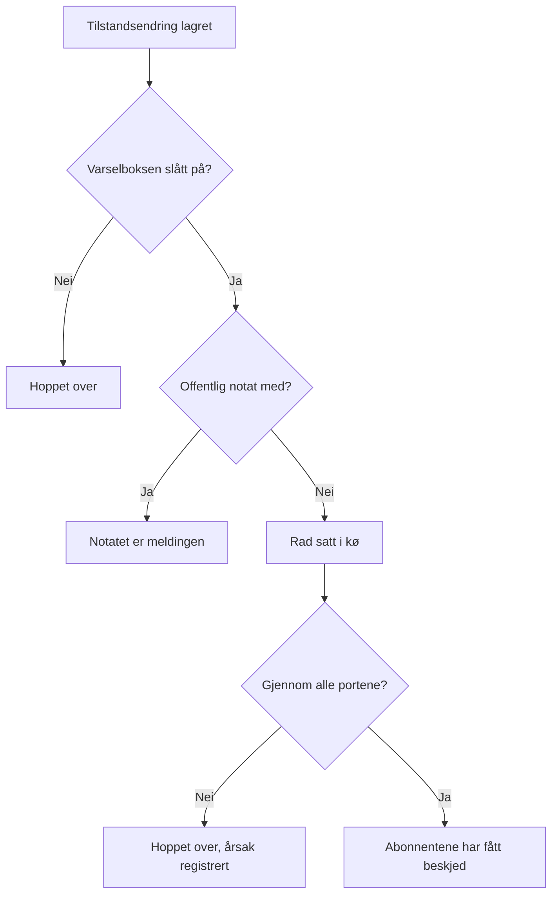

# Hendelsestilstander og alvorlighetsgrader

Hver hendelse har to klassifiseringer: en **tilstand** som sier hvor den er i responsen din, og en **alvorlighetsgrad** som sier hvor mye det gjør vondt. Denne siden forklarer hva hver tilstand gjør, hvordan du legger til dine egne, og hvordan alvorlighetsgrader rangeres — for alle som setter opp hendelser, eller som vil vite hvorfor en hendelse tilkalte eller ikke, ble løst eller ikke, eller ble vist på en statusside eller ikke.

:::cards
- [Legg til dine egne tilstander](#legg-til-dine-egne-tilstander): Form responsen din, og se hva hver tilstand teller som.
- [Hva bekreftelse gjør](#hva-bekreftelse-gjør): Tilkallingen stopper, og SLA-en merkes som besvart.
- [Hva løsning gjør](#hva-løsning-gjør): Monitorene gis fra seg, og SLA-en lukkes.
- [Gi abonnentene beskjed](#gi-statussideabonnenter-beskjed-om-en-tilstandsendring): Portene en tilstandsendring passerer før en statusside får høre om den.
:::

## Slik fungerer det

I dashbordet ligner tilstander og alvorlighetsgrader på hverandre — begge vises som fargede merker i listen over hendelser og som en farget prikk foran navnet overalt der du velger en, og begge er lister i prosjektet som du kan gi nytt navn og ny farge. De gjør svært forskjellige jobber.

Tilstander styrer atferd. Tre boolske flagg på tilstandenes rader avgjør, sammen med tilstandenes rekkefølge, hvilke hendelser som teller som aktive, hvilke knapper som vises i hendelsens overskrift, når SLA-klokken stopper, og når hendelsen forsvinner fra statussiden din. Alvorlighetsgrader styrer ingenting i seg selv — de er etiketter som beskriver påvirkningen, og som andre regler kan samsvare med.

```mermaid title="Hendelser går bare nedover i listen; hvor en tilstand står, avgjør hva den teller som"
flowchart TB
    subgraph open["Teller som ikke bekreftet"]
        identified["Identified"]
    end
    subgraph working["Teller som bekreftet"]
        acknowledged["Bekreftet"]
        mitigated["Mitigated (egen)"]
    end
    subgraph done["Teller som løst"]
        resolved["Løst"]
        closed["Closed (egen)"]
    end
    identified --> acknowledged
    acknowledged --> mitigated
    mitigated --> resolved
    resolved --> closed
    identified -. "hopp over" .-> resolved
```

Modellen `IncidentState` har `name`, `description`, `color` og `order`, pluss tre booleans: `isCreatedState`, `isAcknowledgedState` og `isResolvedState`. Alt produktet gjør med tilstander, tar utgangspunkt i de booleans og i `order` — aldri i tilstandens navn. Derfor kan du gi **Løst** navnet "Closed" uten at noe går i stykker: flagget følger med raden.

Modellen `IncidentSeverity` har `name`, `description`, `color` og `order` og ingenting annet. Det finnes ingen flagg. Ingenting i OneUptime behandler av seg selv **Critical Incident** annerledes enn **Minor Incident** — alvorlighetsgraden betyr bare noe der du peker noe på den, som treffkriteriet **Hendelse Alvorligheter** i en vaktregel.

Noen raske regler:

- **Velg alvorlighetsgrad for å formidle påvirkningen** — den vises i listen over hendelser og på hendelsens **Oversikt**, og den er et påkrevd felt når du erklærer en hendelse.
- **Velg tilstander for å forme prosessen din** — trinnene i responsen du faktisk går gjennom, i den rekkefølgen du går gjennom dem.
- **Ikke legg hastegrad inn i tilstander** — en tilstand med navnet "Critical" tilkaller ingen. Det gjør alvorlighetsgraden sammen med en vaktregel.

> [!TIP]
> Begge listene opprettes når prosjektet ditt opprettes, og begge redigeres under **Hendelser → Innstillinger**. Den seksjonen av sidemenyen til Hendelser er brettet sammen som standard, så brett ut **Innstillinger** før du leter etter dem.

## De forhåndsopprettede tilstandene

Tre tilstander opprettes med prosjektet, i denne rekkefølgen. Opprettelsen er idempotent — en tilstand legges bare til når det ikke allerede finnes en med det navnet.

| Tilstand         | `order` | Flagg                 | Farge     | Hva den betyr                                      |
| ---------------- | ------- | --------------------- | --------- | -------------------------------------------------- |
| **Identified**   | `1`     | `isCreatedState`      | `#fd625e` | Tilstanden nye hendelser havner i.                 |
| **Bekreftet**    | `2`     | `isAcknowledgedState` | `#ffbf53` | Noen har tatt hendelsen.                           |
| **Løst**         | `3`     | `isResolvedState`     | `#2ab57d` | Hendelsen er over og slutter å telle som aktiv.    |

> [!NOTE]
> Den første tilstanden heter **Identified**, selv om flere beskrivelser i produktet fortsatt kaller den "created"-tilstanden. Når et dokument eller et verktøytips sier "opprettelsestilstand", mener det tilstanden som har `isCreatedState` — i et nytt prosjekt er det **Identified**.

## Hva hvert tilstandsflagg faktisk gjør

| Flagg                 | Formål                                                                                                                                                                                               |
| --------------------- | ---------------------------------------------------------------------------------------------------------------------------------------------------------------------------------------------------- |
| `isCreatedState`      | Tilstanden en hendelse får når ingen har valgt en. Har ingen tilstand i prosjektet dette flagget, feiler opprettelsen av en hendelse med en feil som ber deg legge til en opprettelsestilstand for hendelser fra innstillingene. |
| `isAcknowledgedState` | Markerer prosjektets bekreftede tilstand: den **Bekreft** flytter en hendelse til, og som statistikkflisen for bekreftelse er oppkalt etter. En hendelse i den, i en senere tilstand, eller løst, er bekreftet — **Bekreft** tilbys ikke lenger for den, vakten slutter å tilkalle for den, og SLA-en merkes som besvart. |
| `isResolvedState`     | Markerer prosjektets løste tilstand: den **Løs** flytter en hendelse til, og som statistikkflisen for løsning viser. En hendelse i den, eller i en senere tilstand, er løst — den forsvinner fra **Aktive hendelser** og fra den aktive delen av en statusside, og SLA-en merkes som løst. |

Det forventes bare én tilstand per prosjekt med hvert flagg — oppslagene henter den første i rekkefølgen. De tre tilstandene med flagg har merket **Innebygd** på innstillingssiden; hold musen over det (eller gå til det med Tab) for å lese hva OneUptime gjør med tilstanden. De kan få nytt navn, ny farge og dras, men:

- **De beholder rekkefølgen sin.** Opprettelsestilstanden kommer før den bekreftede, og den bekreftede før den løste. En dragning som ville bryte det — **Løst** over **Bekreftet** for eksempel — avvises, radene går tilbake, og siden sier hvorfor.
- **De kan ikke slettes.** **Slett** blir værende i radens meny, låst, med årsaken. En massesletting hopper over dem og nevner dem som ikke slettet. API-et nekter også å slette et prosjekts siste opprettelses-, bekreftede eller løste tilstand.

Fordi grensesnittet leser tilstandsnavn dynamisk, endrer et nytt navn det du ser overalt — statistikkflisene (**Acknowledged in** og **Resolved in** med de forhåndsopprettede navnene), bekreftelsen **Merk hendelse som …** for en egen tilstand og merket i listen over hendelser følger alle navnet du ga raden.

## Legg til dine egne tilstander

En tilstand du legger til, er et trinn i responsen din som de tre forhåndsopprettede ikke nevner: "Investigating", "Mitigated", "Monitoring", "Closed".

:::steps
### Åpne listen over tilstander

Gå til **Hendelser → Innstillinger → Hendelsesstatus**. Kortet **Hendelse Tilstander** viser tilstandene dine i rekkefølge, én rad hver: et grep å dra den i, fargen og navnet, hva en hendelse i den **Teller som**, og beskrivelsen. Setningen under tittelen sier det rett ut: hendelser beveger seg bare nedover i denne listen.

### Opprett tilstanden

Klikk på **Opprett Hendelsesstatus** i kortets overskrift, og fyll ut skjemaet (feltene nedenfor). Den nye tilstanden legges til **rett over den løste tilstanden** — der de fleste tilstander hører hjemme, og aldri under den, der den stille ville telle som løst.

### Dra den på plass

Dra en rad i grepet for å flytte den. Den nye rekkefølgen lagres når du slipper; det er ikke noe rekkefølgenummer å skrive. Med tastaturet setter du fokus på grepet, trykker mellomromstasten, flytter med piltastene og trykker mellomromstasten igjen. Kolonnen **Teller som** oppdateres når du slipper raden.
:::

**Rediger** åpner det samme skjemaet som opprettelsen. Tilstandens ID står under **Vis ID** i radens meny.

| Felt            | Påkrevd | Hva det gjør                                                                                                                                                                                                                                                       |
| --------------- | ------- | ------------------------------------------------------------------------------------------------------------------------------------------------------------------------------------------------------------------------------------------------------------------ |
| **Navn**        | Ja      | Minst to tegn. Plassholderen foreslår noe som "Investigating".                                                                                                                                                                                                     |
| **Beskrivelse** | Nei     | Fri tekst som forklarer når en hendelse står i denne tilstanden.                                                                                                                                                                                                   |
| **Farge**       | Ja      | Allerede valgt når skjemaet åpner: en farge ingen av tilstandene i listen bruker ennå, slik at en ny tilstand aldri får samme røde farge som den over. Velg en annen fra raden med navngitte farger (Rød, Oransje, Limegrønn, Grønn, Blågrønn, Blå, Indigo, Lilla, Magenta, Rosa), eller bruk **Egendefinert farge** for en nøyaktig merkevarefarge som `#fd625e`. |

Fargen farger tilstandens merke og prikken foran navnet i hver tilstandsvelger: erklærings- og malskjemaene, massehandlingen **Endre tilstand**, overskriftens tilstandsmeny og betingelsene i regler og filtre. Hver av de velgerne viser tilstandene i rekkefølgen denne siden setter dem i.

Du kan ikke sette de tre flaggene fra dette skjemaet — de hører til de forhåndsopprettede radene. En tilstand du legger til, er derfor en tilstand uten flagg, noe som har tre konsekvenser det er verdt å planlegge etter:

- **Hvor den står, avgjør hva den teller som.** Kolonnen **Teller som** viser det og endres mens du drar: over den bekreftede tilstanden er en hendelse i den **Ikke bekreftet**; fra den bekreftede tilstanden og nedover teller den som **Bekreftet**, så vaktpolicyene slutter å eskalere den; fra den løste tilstanden og nedover teller den som **Løst**, så statussider slutter å vise den som aktiv.
- **Over den løste tilstanden holder den hendelsen aktiv.** **Aktive hendelser** inneholder hendelsene der den gjeldende tilstanden står over den løste tilstanden, så en tilstand du legger til der, holder hendelsen i den aktive listen og i telleren i sidepanelet. En tilstand som er dratt under den løste tilstanden, teller som løst overalt — i de aktive listene, på statussider, i påminnelser og for SLA-en — og å flytte en hendelse inn i den fra **Løst** er ikke en ny løsning.
- **Du flytter en hendelse inn i den fra menyen i overskriften.** Knappene i overskriften er bare **Bekreft** og **Løs**; en egen tilstand ligger under **Change state to** i menyen **⋯** ved siden av dem, som viser hver tilstand etter den gjeldende. Bekreftelsen heter **Merk hendelse som `<state name>`**, med en sendeknapp **Merk som `<state name>`**.

> [!TIP]
> En vanlig form er et avbøtingstrinn mellom den bekreftede og den løste tilstanden — opprett "Mitigated", og den havner rett over **Løst**, etter **Bekreftet**, og teller som bekreftet. For et triagetrinn før noen har bekreftet hendelsen, drar du den over **Bekreftet**.

## Rekkefølgen er en reell begrensning, ikke en visningspreferanse

Rekkefølgen håndheves når en tilstandsendring skrives, ikke bare når listen tegnes:

- **Overganger bakover avvises.** Å flytte en hendelse til en tilstand som står tidligere i rekkefølgen enn den nåværende, feiler med en feil som nevner begge tilstandene.
- **Å velge den gjeldende tilstanden på nytt avvises.** Å sette en hendelse i tilstanden den allerede er i, feiler med "Incident state cannot be same as previous state."
- **En tilbakedatert rad kan ikke gjenta naboen.** Å sette inn en tidslinjerad der tilstanden er den samme som raden etter, avvises også.
- **Knappene i overskriften følger plasseringen til de flaggede tilstandene i rekkefølgen.** **Bekreft** og **Løs** tilbys ut fra hvor den gjeldende tilstanden står i den sorterte listen. En egen tilstand som er plassert *etter* den løste tilstanden, viser aldri en knapp **Løs**, fordi en hendelse i den allerede teller som løst.

Så når du legger til en tilstand, plasser den der en hendelse faktisk ville passert den. Å ordne den feil ser ikke bare rart ut — det gjør overganger umulige. Å flytte en tilstand lenger ned endrer hva hendelsene som allerede er i den, teller som, i det øyeblikket du slipper den.

Via API-et og Terraform er rekkefølgen kolonnen `order`: lavere tall kommer først. En tilstand som opprettes uten, havner rett over den løste tilstanden; en som opprettes eller oppdateres med et tall, tar den plassen, og tilstandene i veien flytter én plass ned. Tall ingen andre har, beholdes slik de er skrevet, så en tilstand som styres av Terraform, leser tilbake tallet den fikk.

## De forhåndsopprettede alvorlighetsgradene

Tre alvorlighetsgrader opprettes med prosjektet, i denne rekkefølgen, den mest alvorlige først:

| Alvorlighetsgrad      | `order` | Farge     | Forhåndsopprettet beskrivelse                                                                                                                                                             |
| --------------------- | ------- | --------- | ----------------------------------------------------------------------------------------------------------------------------------------------------------------------------------------- |
| **Critical Incident** | `1`     | `#b70400` | Issues causing very high impact to customers. Immediate response is required. Examples include a full outage, or a data breach.                                                          |
| **Major Incident**    | `2`     | `#fd625e` | Issues causing significant impact. Immediate response is usually required. We might have some workarounds that mitigate the impact on customers. Examples include an important sub-system failing. |
| **Minor Incident**    | `3`     | `#ffbf53` | Issues with low impact, which can usually be handled within working hours. Most customers are unlikely to notice any problems. Examples include a slight drop in application performance. |

Alvorlighetsgraden er påkrevd når du erklærer en hendelse, og den er påkrevd i hver hendelsesspesifikasjon i kriteriene til en monitor, så hver hendelse — manuell eller automatisk — kommer med en. Se [Opprette en hendelse](/docs/incidents/declaring-incidents) for erklæringsflyten og [Hendelse- og varslingsmaler](/docs/monitor/incident-alert-templating) for veien via monitorer.

## Rediger alvorlighetsgrader

Gå til **Hendelser → Innstillinger → Hendelsesalvor**. Samme form som tilstandssiden — én rad per alvorlighetsgrad, den mest alvorlige først, dra en rad for å endre rangen, **Opprett Hendelsesalvor** legger til en på slutten (den minst alvorlige), med **Navn**, **Beskrivelse** og **Farge** på skjemaet, fargen allerede valgt som på tilstandsskjemaet.

Rangen betyr noe overalt der OneUptime sammenligner alvorlighetsgrader: en episode tar alvorlighetsgraden til den mest alvorlige hendelsen sin, og Critical og Warning i en anbefaling for en monitor tilsvarer den første og andre alvorlighetsgraden din.

To forskjeller fra tilstander:

- **Det finnes ingen beskyttelse mot sletting.** Enhver alvorlighetsgrad kan slettes, også de tre forhåndsopprettede.
- **Det finnes ingen flagg å arve og ingen "Teller som".** En ny alvorlighetsgrad oppfører seg nøyaktig som de forhåndsopprettede — den er en etikett med en farge og en rang.

Der alvorlighetsgraden gjør mer enn å beskrive: under **Hendelser → Regler → Vaktregler** er feltet **Hendelse Alvorligheter** i en regel et treffkriterium. Å oppgi **Critical Incident** der er hvordan "tilkall databaseteamet ved alt kritisk" uttrykkes — vaktpolicyen sitter på regelen, ikke på alvorlighetsgraden.

**Å endre alvorlighetsgraden til en hendelse** — under **Rediger** på hendelsens kort **Hendelsesdetaljer**, via API-et eller Terraform (`incidentSeverityId`), med en arbeidsflyt eller med KI-verktøyene — gjør de samme fire tingene uansett hvordan det sendes: hendelsens feed får en oppføring **Incident updated** som nevner den nye alvorlighetsgraden, hendelsens SLA-frister regnes ut på nytt, påminnelsesregelen samsvares på nytt, og hendelsesmetrikkene teller én endring av alvorlighetsgrad. Å lagre alvorlighetsgraden hendelsen allerede har, gjør ingen av dem, så redigerer du bare tittelen på en hendelse, blir SLA-fristene, påminnelsene og antallet endringer av alvorlighetsgrad som de var. Alvorlighetsgraden til et varsel fungerer på samme måte for feedoppføringen og påminnelsene.

## Flytt en hendelse gjennom tilstandene

Det er fire måter en hendelse skifter tilstand på:

| Måte                | Hvor                                                                                        | Hva den spør om                                                                                                                                                                                              |
| ------------------- | ------------------------------------------------------------------------------------------- | ------------------------------------------------------------------------------------------------------------------------------------------------------------------------------------------------------------ |
| **Knapper i overskriften** | Hendelsens overskrift: **Bekreft** og **Løs**, og **Change state to** i menyen **⋯** | En kort bekreftelse — **Bekreft hendelse** eller **Løs hendelse** — med **Varsle statussideabonnenter** og, brettet sammen under **Legg til et offentlig notat**, det valgfrie **Offentlig notat** med velgeren **Velg notatmal** (når prosjektet har notatmaler). |
| **Tilstandstidslinje** | **Tilstandstidslinje** i hendelsens sidemeny                                             | En rad som legges til for hånd, med **Hendelsesstatus**, **Begynner den** og **Varsle statussideabonnenter**.                                                                                               |
| **Masseendring**    | **Endre tilstand** på et utvalg i listen over hendelser                                     | Én side med tilstanden, **Varsle statussideabonnenter** og det samme sammenbrettede **Legg til et offentlig notat**.                                                                                        |
| **Automatisk**      | Et monitorkriterium eller din egen kode                                                     | Et kriterium med **Løs hendelse automatisk** slått på løser hendelsen når kriteriet ikke lenger er oppfylt. API-et endrer tilstanden ved å opprette en rad på `/api/incident-state-timeline`.               |

Står den gjeldende tilstanden før den bekreftede tilstanden, tilbyr overskriften **Bekreft** og **Løs**; står den mellom de to, bare **Løs**. Bekreftelse stopper også enhver eskalering fra vakten for hendelsen.

Hver av dem skriver en tidslinjerad. En tilstandsendring gjør også noen ting du ikke trenger å be om: den skriver en oppføring i hendelsens feed, tildeler en Hendelsesleder hvis hendelsen ikke har en ennå, og oppdaterer SLA-klokken. Å gjenåpne en løst hendelse starter en ny SLA-post fra tidspunktet for gjenåpningen.

## Hva bekreftelse gjør

En hendelse er bekreftet fra det øyeblikket den går inn i den bekreftede tilstanden din, i en senere tilstand — en tilstand **Mitigated** eller **Investigating** du har plassert under **Bekreftet** — eller i en løst tilstand, uansett hvilken av de fire måtene ovenfor som flytter den. Kolonnen **Teller som** på innstillingssiden for tilstander viser hvilke tilstander det er. Når den er bekreftet:

- **Bekreft tilbys ikke lenger.** Ikke i hendelsens overskrift, ikke i mobilappen (knappen og sveipet), ikke i Slack eller Microsoft Teams og ikke via `acknowledge_incident` på OneUptime MCP-serveren. Å bekrefte den likevel — fra en tilkallingsside, Slack eller Teams — avvises med "Incident is already acknowledged." (eller "Incident is already resolved."), i stedet for å flytte den opp i listen igjen.
- **Vakten slutter å tilkalle for den.** En vakthavende som bekrefter tilkallingen sin etter at en kollega har bekreftet hendelsen eller flyttet den videre, får tilkallingen sin bekreftet, og hendelsen blir værende der den er.
- **SLA-en merkes som besvart** ved den første slike flyttingen; å gå videre gjennom senere tilstander beholder det tidspunktet.
- **Tiden til bekreftelse løper til den første flyttingen** — statistikkflisen på hendelsens **Oversikt**, metrikken **Time to Acknowledge**, en måling som slutter når **Hendelsen blir bekreftet**, og MTTA i sammendragene i Slack og Microsoft Teams. En hendelse som gikk rett fra **Identified** til **Investigating**, ble bekreftet da; en som ble løst med en gang, ble bekreftet da den ble løst.
- **Et filter Bekreftet** — på widgeten med en hendelsesliste på et dashbord for eksempel — viser hendelsene i den bekreftede tilstanden din og i enhver senere tilstand, opp til løst.

Varsler og episoder følger samme regel, med varseltilstandene dine.

## Hva løsning gjør

En hendelse er løst når den går fra en tilstand over den løste tilstanden din inn i den løste tilstanden, eller inn i en senere tilstand — uansett hvilken av de fire måtene ovenfor som flytter den. Hver løsning:

- **Gir fra seg monitorene hendelsen holder.** En hendelse som erklæres åpen, holder monitorene sine: den satte dem i statusen fra **Endre overvåkingsstatus til**, når den nevner en, og satte, når den ble erklært for hånd, overvåkingen deres på pause. En redigering mens den er åpen — å legge til monitorer eller endre den statusen — får den også til å holde dem. Løsningen gjenopptar overvåkingen og setter dem tilbake til operativ, med mindre en annen åpen hendelse fortsatt ligger på dem, og fra da av holder hendelsen ingenting. Så en hendelse som erklæres allerede løst, gir ingenting fra seg, og det gjør heller ikke en ny løsning etter en gjenåpning: en status monitorene fikk i mellomtiden — fra probene, fra vedlikehold eller satt for hånd — blir stående.
- **Merker SLA-en som løst** og skriver, når OneUptime AIs utkast til etteranalyser er slått på, et utkast til en etteranalyse.

Å gå videre fra **Løst** til en senere tilstand — **Closed** for eksempel — er ikke en ny løsning: ingenting av dette kjører igjen, og ingen ny SLA starter. En hendelse som ble erklært før OneUptime begynte å registrere dette, gir fra seg monitorene ved neste løsning, som før.

## Tilstandstidslinjen

Hendelsens side **Tilstandstidslinje** i hendelsens sidemeny er revisjonssporet for hver tilstand hendelsen har vært i. Kortet på den siden heter **Statustidslinje**, og det er sortert med de nyeste først.

| Kolonne                            | Hva den viser                                                                                                                                                                                                                                                  |
| ---------------------------------- | -------------------------------------------------------------------------------------------------------------------------------------------------------------------------------------------------------------------------------------------------------------- |
| **Hendelsesstatus**                | Et farget merke med tilstandens navn og farge.                                                                                                                                                                                                                 |
| **Begynner den**                   | Når hendelsen gikk inn i denne tilstanden.                                                                                                                                                                                                                     |
| **Slutter den**                    | Når den forlot den. Den gjeldende tilstanden viser `Currently Active`.                                                                                                                                                                                         |
| **Varighet**                       | Tiden i tilstanden, for den gjeldende talt frem til nå.                                                                                                                                                                                                        |
| **Abonnentvarselsstatus**          | Om statussidens varsel for denne endringen ble sendt, hoppet over eller fortsatt venter, med en lenke **flere detaljer**, og — når sendingen feilet — en handling **Prøv på nytt**. **Prøv på nytt** sender tilstandsendringen på nytt til hver statusside hendelsen når nå, også til abonnentene som allerede har fått den. |

Hver rad har to handlinger:

- **Vis årsak** — åpner en dialog **Rotårsak** som viser Markdown-en som ble registrert med tilstandsendringen.
- **Vis logger** — åpner en dialog som forklarer hvorfor statusen endret seg, med en visning **Hendelsestilstandslogg**.

I dashbordet kan tidslinjerader legges til og slettes, men ikke redigeres; en hendelse beholder alltid minst én rad. Via API-et kan `startsAt` for en rad rettes, og hver måling som regnes ut fra tidslinjen, følger med.

> [!WARNING]
> Å slette feil rad omskriver hendelsens historikk, så bruk det som et verktøy for rettelser og ikke som en vane for opprydding.

## Listen Aktive hendelser

**Hendelser → Aktive hendelser** er listen du følger med på under en vakt. Definisjonen er nøyaktig én betingelse: hendelsens gjeldende tilstand står over den løste tilstanden din — den første tilstanden i rekkefølgen med flagget `isResolvedState`. Ingenting annet tas med i betraktningen — ikke alvorlighetsgraden, ikke alderen, ikke om noen har bekreftet den.

Punktet i sidemenyen har et rødt merke med en teller som bruker den samme spørringen, så merket og listen er alltid enige. Er det ingenting å se, sier siden det.

Den praktiske konsekvensen: en egen tilstand du legger til over den løste tilstanden, holder hendelser i denne listen — "Mitigated" er ikke "ferdig" — og en du plasserer etter den, tar dem ut, slik den løste tilstanden gjør. Varsler og episoder følger samme regel med egne tilstander, og tellerne i sidemenyen, påminnelsene, statussidene og mobilappen leser den alle.

## Gi statussideabonnenter beskjed om en tilstandsendring

En tilstandsendring kan gi abonnentene på statussiden din beskjed, men den går gjennom flere porter. Å forstå dem sparer mye feilsøking av typen "hvorfor fikk ingen beskjed".



Varsling bestilles per tidslinjerad med **Varsle statussideabonnenter** (`shouldStatusPageSubscribersBeNotified`), avkrysningsboksen i dialogen for tilstandsendringer og på det manuelle tidslinjeskjemaet. I dialogen for tilstandsendringer starter den slått av når hendelsen ble erklært uten å gi abonnentene beskjed. Den samme avkrysningsboksen avgjør også om dialogens offentlige notat gir noen beskjed. Når den er slått av, lagres raden med status hoppet over og en forklaring. Når den er slått på, settes raden i kø, og en bakgrunnsjobb plukker den opp — jobben kjører hvert minutt, så leveringen er rask, men ikke umiddelbar.

**Raden i køen hoppes deretter over når noe av dette gjelder:**

- **Den nye tilstanden er opprettelsestilstanden.** Abonnentene fikk allerede beskjed da hendelsen ble erklært, så den første tidslinjeraden sender bevisst ikke en ny melding.
- **Hendelsen har ingen monitorer knyttet til seg.** Uten ressurser finnes det ingen statusside å koble hendelsen til.
- **Hendelsen er ikke synlig på statussiden** (`isVisibleOnStatusPage` er slått av).
- **Statussiden har slått av hendelser** (`showIncidentsOnStatusPage` er slått av). Dette gjelder per statusside — andre sider som viser den samme monitoren, får fortsatt beskjed.
- **Statussiden ligger utenfor hendelsens omfang.** En hendelse som med **Begrens til disse statussidene** er begrenset til noen statussider, gir bare de sidene beskjed blant dem som viser monitorene, og en side med **Vis bare hendelser som er begrenset til denne siden** slått på får aldri beskjed om en hendelse som ikke er begrenset til den. Også dette gjelder per statusside. Se [Én statusside per målgruppe](/docs/status-pages/one-status-page-per-audience).

**Én ting til som endrer utfallet.** Skriver du et **Offentlig notat** i dialogen for tilstandsendringer (under **Legg til et offentlig notat**) eller i massehandlingen **Endre tilstand** mens **Varsle statussideabonnenter** er slått på, merkes tidslinjeraden som allerede varslet i stedet for å bli satt i kø, og statusmeldingen sier at notatet bar den. Det er selve notatet som når abonnentene, så de får én melding i stedet for to. Et notat med bare mellomrom publiseres ikke, og raden settes i kø som vanlig. Tilstandsendringer for planlagt vedlikehold fungerer på samme måte. Hendelsestypen bak den vanlige meldingen om en tilstandsendring er `Subscriber Incident State Changed`.

**Notatet sier hva hendelsen er nå.** Fordi notatet er den ene meldingen, nevner det den nye tilstanden på hver kanal, slik meldingen om tilstandsendringen ville gjort: e-postens emne lyder `[Resolved Incident] <title>`, og detaljene viser en rad **Status** i tilstandens farge, SMS-en sier `Incident <title> on <status page> is Resolved.`, meldinger i Slack og Microsoft Teams har en linje `**Status:** Resolved`, og webhookens payload `IncidentNoteCreated` har `incidentState` i `data`. Et notat som publiseres for seg selv, beholder sin vanlige melding, og det gjør også oppdateringsvarselet for en redigering.

**Å publisere notatet krever sin egen tillatelse.** Å endre tilstanden og å publisere et offentlig notat er separate tillatelser (**Create Incident State Timeline** og **Create Incident Status Page Note** i en egendefinert rolle; de innebygde hendelses- og prosjektrollene har begge). Å endre tilstanden krever ingen tillatelse til å redigere hendelsen: se [Endre en tilstand](/docs/permissions/index#endre-en-tilstand). Noen som kan endre tilstanden til en hendelse, men ikke publisere offentlige notater, får ikke tilbudt **Legg til et offentlig notat** i dialogen eller i massehandlingen **Endre tilstand**. En tilstandsendring de sender med et notat via API-et, avvises i sin helhet med en melding som sier at tilstanden ikke ble endret, og hvorfor, slik at en endring aldri registreres som meddelt av et notat som aldri ble publisert. Utelat notatet, så går endringen gjennom. Varsler, varselepisoder og hendelsesepisoder tilbyr i stedet et privat notat med en tilstandsendring (**Legg til et privat notat**), og det fungerer på samme måte: å publisere det krever notatets egen tillatelse (**Create Alert Internal Note**, **Create Alert Episode Internal Note** eller **Create Incident Episode Internal Note** i en egendefinert rolle; de innebygde varsel-, hendelses- og prosjektrollene har dem), og en tilstandsendring som sendes med et privat notat av noen uten den tillatelsen, avvises i sin helhet, så tilstanden ikke endres.

**Sendt betyr at hver abonnent fikk den sendt.** Jobben venter på hver melding og teller den som sendt eller feilet, per statusside og kanal, og radens statusmelding nevner de tallene. Én feilet melding, eller en sending som gikk tom for tid eller ble avbrutt, gjør raden til **Mislyktes**. Se [Abonnenter og kunngjøringer](/docs/status-pages/subscribers).

For hvem som mottar dem, og hvordan malene velges, se [Abonnenter og kunngjøringer](/docs/status-pages/subscribers).

## Hold en hendelse borte fra statussiden

Fire separate ting avgjør om en hendelse i det hele tatt står på en offentlig side, og alle fire må være sanne:

- **Vis hendelser** (`showIncidentsOnStatusPage`) på selve statussiden.
- **Synlig på statussiden** (`isVisibleOnStatusPage`) på hendelsen — en bryter på hendelsens side **Innstillinger**. Den er sann som standard og er ikke med i veiviseren for å erklære; et monitorkriterium kan sette den med **Vis hendelse på statussiden**. En hendelse som erklæres skjult, gir ingen abonnent beskjed når den opprettes; slår du bryteren på senere, tilbyr redigeringsskjemaet **Varsle abonnenter om at denne hendelsen er opprettet**. Se [Opprette en hendelse](/docs/incidents/declaring-incidents).
- **Siden er innenfor hendelsens rekkevidde.** Siden viser en av hendelsens monitorer og er, hvis hendelsen er begrenset til noen statussider, en av dem. En side med **Vis bare hendelser som er begrenset til denne siden** slått på viser bare hendelsene som er begrenset til den. Se [Én statusside per målgruppe](/docs/status-pages/one-status-page-per-audience).
- **Den gjeldende tilstanden står over den løste tilstanden.** Det er dette som fjerner en hendelse fra den aktive delen: statussidens spørring henter hendelser der den gjeldende tilstanden står over den løste tilstanden din, så den løste tilstanden og enhver senere tilstand tar hendelsen bort. Du arkiverer eller lukker ingenting — du løser den, og den går over i historikken.

**Private hendelser vises aldri.** Å slå på **Privat hendelse** skjuler hendelsen for alle statussider, uansett bryterne ovenfor, og begrenser den til eierne pluss prosjektadministratorer og prosjekteiere. Ingenting om den når heller en abonnent på en statusside: ikke opprettelsen, ikke tilstandsendringene, ikke de offentlige notatene og ikke etteranalysen. Bildene i beskrivelsen, etteranalysen, de egendefinerte feltene og de offentlige notatene kan ikke ses av alle mens den er privat.

De to bryterne holdes i takt, så hendelsens side **Innstillinger** alltid viser hva statussidene gjør:

- Å gjøre en hendelse privat slår av **Synlig på statussiden** samtidig.
- Å slå på **Synlig på statussiden** mens hendelsen forblir privat, lar den stå slått av. For å publisere en privat hendelse slår du av **Privat hendelse** og på **Synlig på statussiden** — i én lagring eller den ene etter den andre.

Dette gjelder uansett hvordan hendelsen skrives: dashbordet, API-et, Terraform, en arbeidsflyt, en monitor, en hendelsesmal eller en personvernregel. En verdi som sendes som tekst, som `"true"`, teller som `true`. Én skriving til mange hendelser som slår på **Synlig på statussiden** — **Update Many** i en arbeidsflyt for eksempel — viser dem som ikke er private, og lar hver private forbli skjult. Hver hendelse avgjøres slik den er når skrivingen når den, så en endring av personvernet som lander i samme øyeblikk, aldri blir forbigått: en hendelse lagres aldri som både privat og synlig. En hendelse som opprettes privat, opprettes skjult og gir ingen abonnent beskjed om at den er opprettet.

**Episoder følger samme regel.** En privat hendelsesepisode er skjult for alle statussider, uansett hva bryteren **Synlig på statussiden** sier, og abonnentene hører ingenting om den. På episodens side **Innstillinger** sier bryteren det og forblir slått av mens episoden er privat. En privat hendelse bringer aldri episoden sin inn på en statusside: en episode når bare en side gjennom hendelser som ikke er private.

:::details Oppgradering fra en versjon uten disse reglene
Hendelser og episoder som er lagret som private med **Synlig på statussiden** fortsatt slått på fra før disse reglene, får den slått av når du oppgraderer. Ingenting sendes til noen. Bildene en slik hendelse eller episode hadde gjort synlige for alle, gjøres private igjen, med mindre noe statussidene dine viser, fortsatt har dem i seg. Det samme gjelder bildene i offentlige notater på hendelser, episoder og planlagte vedlikeholdshendelser som statussidene dine ikke viser, og som før forble synlige for alle.
:::

Hvor mye løst historikk siden beholder, er en innstilling på statussiden, ikke på hendelsen. Se [Statusside – ressurser og grupper](/docs/status-pages/resources-and-groups) for hvordan monitorer på siden avgjør hvilke hendelser som i det hele tatt vises.

## Neste steg

:::cards
- [Opprette en hendelse](/docs/incidents/declaring-incidents): Velg en starttilstand og en alvorlighetsgrad når du erklærer.
- [Hendelsesnotater, eiere og feed](/docs/incidents/notes-owners-and-feed): Publiser det offentlige notatet som følger med en tilstandsendring.
- [Hendelsesinnstillinger og automatisering](/docs/incidents/settings): Mål tiden mellom tilstander, og samsvar med alvorlighetsgrader i regler.
- [Abonnenter og kunngjøringer](/docs/status-pages/subscribers): Hvem som får meldingene en tilstandsendring sender.
:::
