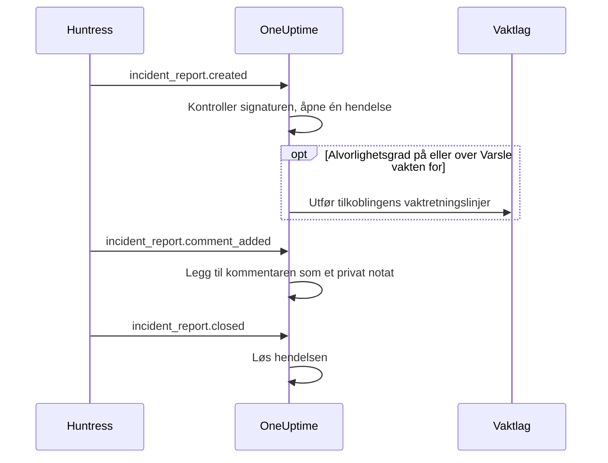

# Huntress-integrasjon

Varsle vaktlaget ditt for Huntress-hendelsesrapporter. Når Huntress' SOC sender en hendelsesrapport om et endepunkt eller en identitet, åpner OneUptime én hendelse for den, med alvorlighetsgraden du velger, varsler vaktretningslinjene du velger, og løser hendelsen når rapporten lukkes i Huntress.

Denne integrasjonen er **innkommende**: Huntress sender hver begivenhet om en hendelsesrapport til en webhook-URL du får fra OneUptime, signert med endepunktets signeringshemmelighet. OneUptime kaller aldri Huntress og trenger derfor ingen Huntress-API-nøkkel.

:::cards
- [Slik fungerer det](#slik-fungerer-det): Hva OneUptime gjør med hver begivenhet om en rapport.
- [Oppsett](#sett-opp-integrasjonen): Koble til i OneUptime, legg til endepunktet i Huntress, lagre signeringshemmeligheten, send en test.
- [Innstillinger](#innstillinger): Varsling, alvorlighetsgrader, organisasjoner, etiketter og løsing.
- [Feilsøking](#feilsøking): Hva feilene på tilkoblingen betyr, og hva du bør endre.
:::

## Slik fungerer det

Huntress sender en begivenhet om en hendelsesrapport når rapporten sendes, når noen kommenterer den og når den lukkes. Hver begivenhet inneholder hele rapporten.

1. **Kontroller.** En forespørsel må være signert med endepunktets signeringshemmelighet, høyst fem minutter før den kommer. Alt annet avvises, og tilkoblingens side forteller hvorfor.
2. **Åpne én hendelse.** Den første begivenheten om en rapport åpner en hendelse oppkalt etter rapporten, for eksempel `Huntress: Incident on DESKTOP-01 (Acme Corp)`. Beskrivelsen inneholder rapportens sammendrag, alvorlighetsgraden i Huntress, organisasjonen, den berørte verten eller identiteten, indikatorene Huntress fant og en lenke til rapporten i Huntress. Senere begivenheter om samme rapport, og leveranser Huntress sender på nytt, finner den hendelsen: En rapport åpner aldri to.
3. **Varsle.** Hendelsen åpnes med hendelsesalvorlighetsgraden som tilkoblingen gir rapportens Huntress-alvorlighetsgrad. Når den alvorlighetsgraden er på eller over **Varsle vakten for**, utføres tilkoblingens **Vaktretningslinjer**.
4. **Følg rapporten.** En kommentar lagt til i Huntress blir et privat notat på hendelsen. Når rapporten lukkes eller avvises, løses hendelsen.

Hendelser som åpnes slik, vises aldri på en statusside. Hendelsesreglene dine (vakt-, eier-, etikett- og personvernregler) gjelder for dem som for alle andre hendelser.

## Før du begynner

- I OneUptime rollen **Project Owner** eller **Project Admin**. Medlemmer, lesere og hendelsesrollene ser tilkoblingen og rapportene den har mottatt, men kan ikke endre den.
- I Huntress rollen **Account Admin**: Bare kontoadministratorer kan legge til webhooks.
- En vaktretningslinje å varsle. Uten en åpner rapporter hendelser og varsler ingen, med mindre en vaktregel for hendelser passer på dem.
- På en selvdriftet installasjon en OneUptime som Huntress når fra internett over HTTPS: Huntress sender bare webhooks til `https://`-URL-er.

## Sett opp integrasjonen

:::steps
### Koble til Huntress i OneUptime

Åpne **Hendelser → Integrasjoner → Huntress** (`/dashboard/{projectId}/incidents/integrations/huntress`). Delen **Integrasjoner** i sidemenyen for hendelser er lukket som standard, så åpne den først. Klikk **Koble til Huntress**.

Velg **Vaktretningslinjer** som skal varsles. **Varsle vakten for** spør deretter hvilke rapporter som varsler dem, og starter på **Høye og kritiske rapporter**. Alt annet venter under **Flere felt** med en standardverdi (se [Innstillinger](#innstillinger)). Klikk **Koble til Huntress**. Tilkoblingens side åpnes, med et kort **Koble til Huntress** som leder deg gjennom de neste tre trinnene.

### Legg til et webhook-endepunkt i Huntress

Klikk **Kopier webhook-URL** på tilkoblingens side. URL-en ser ut som `https://oneuptime.com/api/huntress/webhook/<connection-id>`; på en selvdriftet installasjon begynner den med din egen vert.

Åpne menyen øverst til høyre i Huntress og velg **Integrations**. Klikk **Add an Integration**, velg **Webhooks** og klikk **Add Endpoint**. Lim inn URL-en, slå på **Incident Reports** og lagre. La **Escalations**, **Platform Actions** og **Account Notices** være av: OneUptime tar imot de begivenhetene og gjør ingenting med dem.

### Lagre endepunktets signeringshemmelighet

Åpne endepunktets meny (⋯) i Huntress og velg **View Signing Secret**. Kopier hele: Den starter med `whsec_`. Klikk **Lagre signeringshemmelighet** på tilkoblingens side, lim den inn og klikk **Lagre signeringshemmelighet**. Hemmeligheten krypteres og vises aldri igjen.

Til hemmeligheten er lagret, avviser OneUptime alle forespørsler til URL-en. Huntress sender en avvist begivenhet på nytt senere, så en begivenhet som avvises nå, kommer likevel frem.

### Send en test

Åpne endepunktets meny (⋯) i Huntress og velg **Send Test**. I løpet av noen sekunder blir kortet på tilkoblingens side til **Tilkobling**, med tilstanden **Mottar rapporter**.

> [!NOTE]
> Uansett hva testen inneholder, viser tilkoblingen at den kom frem. En test med en hendelsesrapport åpner en hendelse som enhver annen rapport, og varsler vakten hvis den er alvorlig nok.
:::

## Innstillinger

**Koble til Huntress** spør bare hvem som varsles, og for hvilke rapporter. Alt annet venter under **Flere felt**, med en standardverdi som passer de fleste team. For å endre en innstilling senere klikker du **Rediger innstillinger** på tilkoblingens kort **Innstillinger**.

| Innstilling | Hva den gjør | Standard |
| --- | --- | --- |
| **Vaktretningslinjer** | Retningslinjene som utføres når en rapport er alvorlig nok. La stå tomt for å åpne hendelser uten å varsle noen. | Ingen |
| **Varsle vakten for** | Hvilke rapporter som varsler retningslinjene: **Bare kritiske rapporter**, **Høye og kritiske rapporter** eller **Alle rapporter**. Hver rapport åpner en hendelse uansett. | **Høye og kritiske rapporter** |
| **Navn** | Hva tilkoblingen heter i OneUptime. | `Huntress` |
| **Alvorlighetsgrad for kritiske rapporter**, **Alvorlighetsgrad for høye rapporter**, **Alvorlighetsgrad for lave rapporter** | Hendelsesalvorlighetsgraden hver Huntress-alvorlighetsgrad åpnes med. | De tre høyeste hendelsesalvorlighetsgradene dine, i rekkefølge |
| **Bare disse organisasjonene** | Huntress-organisasjonene der rapportene åpner hendelser, ett organisasjonsnavn eller én ID per linje. Navn skiller ikke mellom store og små bokstaver. | Tomt: alle organisasjoner |
| **Etiketter** | Etiketter som legges til hver hendelse, i tillegg til den som er oppkalt etter rapportens organisasjon. | Ingen |
| **Løs når Huntress lukker rapporten** | Løs hendelsen når rapporten lukkes eller avvises i Huntress. Når dette er av, sier et privat notat på hendelsen det i stedet. | På |

### Alvorlighetsgrader

Huntress gir hver hendelsesrapport én av tre alvorlighetsgrader. Med mindre du velger en hendelsesalvorlighetsgrad for en av dem, åpnes rapporten etter rekkefølgen på hendelsesalvorlighetsgradene dine, slik **Hendelser → Innstillinger → Hendelsesalvor** viser dem:

| Alvorlighetsgrad i Huntress | Hva Huntress mener med den | Hendelsesalvorlighetsgrad |
| --- | --- | --- |
| Critical | Angripere ved tastaturet, farlig skadevare eller aktiv kompromittering, som må begrenses umiddelbart. | Den høyeste |
| High | Bekreftet skadevare som krever rask utbedring, eller kompromittering av en identitet som må håndteres. | Den andre |
| Low | Potensielt uønskede programmer, rester av skadevare og eldre funn om identiteter. | Den tredje |

Et prosjekt med færre alvorlighetsgrader bruker den laveste for resten. En rapport uten alvorlighetsgrad behandles som høy. Hvis en alvorlighetsgrad du har valgt, slettes, avgjør rekkefølgen igjen.

### Organisasjoner

Hver hendelse får en etikett oppkalt etter rapportens Huntress-organisasjon, for eksempel _Acme Corp_. Én tilkobling mottar rapportene fra alle organisasjoner i Huntress-kontoen din, og **Bare disse organisasjonene** snevrer det inn.

> [!TIP]
> For å varsle hver kundes eget team lar du tilkoblingens **Vaktretningslinjer** stå tomme og legger til en vaktregel for hendelser per organisasjon, for eksempel «Hvis **Hendelsesetiketter** har en av _Acme Corp_», som utfører kundens retningslinje. Se [Vaktregler for hendelser](/docs/incidents/settings#vaktregler-for-hendelser).

## Rapporter på tilkoblingens side

Tilkoblingens liste **Hendelsesrapporter** viser hver rapport Huntress har sendt, den nyeste først: den berørte verten eller identiteten, alvorlighetsgraden og statusen i Huntress, og **Resultat**.

| Resultat | Hva som skjedde |
| --- | --- |
| **Hendelse åpnet** | Rapporten åpnet en hendelse. **Se hendelse** åpner den; **Vakten varslet** sier at tilkoblingen varslet retningslinjene sine. |
| **Hendelse løst** | Huntress lukket rapporten, og hendelsen ble løst. |
| **Hoppet over: organisasjonen overvåkes ikke** | Rapportens organisasjon står ikke i **Bare disse organisasjonene**. |
| **Hoppet over: allerede lukket i Huntress** | Rapporten var allerede lukket første gang OneUptime hørte om den. |

En rapport som ble hoppet over, forblir hoppet over når du endrer innstillingene senere. Når **Løs når Huntress lukker rapporten** er av, beholder en lukket rapport resultatet **Hendelse åpnet**.

## Sikkerhet

- **Bare signerte forespørsler.** OneUptime kontrollerer hodene `svix-id`, `svix-timestamp` og `svix-signature` som Huntress sender, mot forespørselens innhold akkurat slik det kom. En forespørsel som ikke er signert med den lagrede hemmeligheten, eller som ble signert mer enn fem minutter før eller etter, avvises.
- **Hemmeligheten forblir hemmelig.** Den lagres kryptert, returneres aldri av API-et og vises aldri igjen. **Erstatt signeringshemmelighet** på tilkoblingens side lagrer en annen, for eksempel hemmeligheten til et nytt endepunkt.
- **URL-en er en adresse, ikke et passord.** Den navngir tilkoblingen; bare en forespørsel signert med endepunktets hemmelighet behandles.
- **Ett endepunkt per tilkobling.** Hver tilkobling har sin egen URL og hemmelighet. For å motta rapportene fra en annen Huntress-konto kobler du til på nytt.

## Bruk e-post i stedet

Huntress sender også hendelsesrapporter på e-post, og en [overvåker for innkommende e-post](/docs/monitor/incoming-email-monitor) kan åpne hendelser fra de e-postene, for eksempel når emnet inneholder `Critical Incident Report`. Den behandler likevel e-postene som én overvåkers status: Mens hendelsen er åpen, åpner neste rapport ingen, og hendelsen løses av overvåkerens kriterier i stedet for når Huntress lukker rapporten. Huntress-tilkoblingen åpner én hendelse per rapport og løser hver av dem med rapporten sin, så velg den. Så snart tilkoblingen mottar rapporter, slutter du å sende e-postene til overvåkeren, ellers varsler hver rapport to ganger.

## Feilsøking

Når OneUptime avviser en forespørsel, viser tilkoblingens side årsaken under **Den siste forespørselen ble avvist**. I Huntress viser **View Delivery Attempts** i endepunktets meny (⋯) hver leveranse med svaret fra OneUptime.

:::details "A request arrived but was refused, because no signing secret is saved for this connection yet"
Lagre endepunktets signeringshemmelighet: se [Sett opp integrasjonen](#sett-opp-integrasjonen). Huntress sender den avviste forespørselen på nytt.
:::

:::details "The request's signature does not match the signing secret"
Den lagrede hemmeligheten tilhører ikke dette endepunktet. Hvert endepunkt har sin egen: Åpne endepunktets meny (⋯) i Huntress, velg **View Signing Secret**, kopier hele og lagre den med **Erstatt signeringshemmelighet**.
:::

:::details "The request was signed more than five minutes from now"
Klokkene hos Huntress og på OneUptime-serveren din går mer enn fem minutter fra hverandre, eller forespørselen er en gjentakelse. På en selvdriftet installasjon bør du kontrollere at serverens klokke går riktig.
:::

:::details "No Huntress connection has this address."
Tilkoblingen er slettet, eller endepunktets URL i Huntress er ikke tilkoblingens. Klikk **Kopier webhook-URL** på tilkoblingens side og lim inn URL-en i endepunktet i Huntress på nytt.
:::

:::details "This project has no incident severities, so a Huntress report cannot open an incident"
Legg til en under **Hendelser → Innstillinger → Hendelsesalvor**. Huntress sender rapporten på nytt.
:::

:::details Ingen ble varslet
En rapport under **Varsle vakten for** åpner en hendelse uten å varsle noen. I listen **Hendelsesrapporter** sier **Vakten varslet** under en rapports resultat at tilkoblingen varslet. Hendelsens side **Vaktutførelser** viser hva hver retningslinje gjorde.
:::

## Neste steg

:::cards
- [Vaktregler for hendelser](/docs/incidents/settings#vaktregler-for-hendelser): Varsle hver organisasjons eget team via etiketten.
- [Hendelsestilstander og alvorlighetsgrader](/docs/incidents/states-and-severities): Ordne alvorlighetsgradene Huntress-rapporter åpnes med.
- [Eskaleringsregler](/docs/on-call/escalation-rules): Bestem hvem som varsles, og når varslingen går videre.
- [Oversikt over integrasjoner](/docs/integrations/index): De andre verktøyene du kan koble til.
:::
