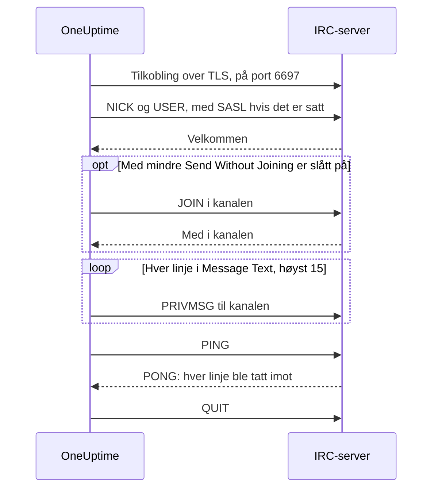

# IRC-integrasjon

Post hendelsesoppdateringer i en kanal på et hvilket som helst IRC-nettverk: Libera.Chat, OFTC eller din egen server.

IRC har ingen webhooks, så OneUptimes arbeidsflyttrinn **Send Message to IRC** kobler seg selv til serveren, som enhver IRC-klient. Det er ingenting å installere og ingen app å registrere. Denne integrasjonen er **utgående**: OneUptime poster i kanalen og leser ikke det som blir sagt der.

:::cards
- [Slik fungerer det](#slik-fungerer-det): Hva én kjøring av trinnet sier til serveren.
- [Oppsett](#sett-opp-integrasjonen): Server og kanal, passord og så arbeidsflyten: fra malen eller fra bunnen.
- [Tips](#tips): Poste uten å bli med i kanalen, SASL, lange meldinger og byger.
- [Feilsøking](#feilsøking): Hva feilene fra trinnet betyr, og hva du bør endre.
:::

## Slik fungerer det

Hver kjøring av trinnet fører en kort samtale med IRC-serveren, slik en IRC-klient ville gjort, og legger så på.

1. **Koble til.** Trinnet kobler til over TLS på port `6697` og kontrollerer serverens sertifikat.
2. **Registrere.** Det registrerer seg som `OneUptime`, med mindre du setter et annet **Nickname**, og logger inn med SASL når **SASL Username** og **SASL Password** er fylt ut.
3. **Bli med.** Det blir med i kanalen, med mindre **Send Without Joining** er slått på, med **Channel Key** hvis kanalen har en.
4. **Sende.** Hver linje i **Message Text** går ut som en egen IRC-melding, en `PRIVMSG`.
5. **Bekrefte.** IRC sier aldri «levert», så trinnet sender en `PING` og venter på serverens `PONG`. En server svarer i rekkefølge, så innen da har enhver avvisning av meldingen kommet.
6. **Avslutte.** Det forlater serveren.

Trinnet tar utgangen **Suksess** så snart serveren har tatt imot hver linje. Det tar **Feil**, med årsaken med serverens egne ord der den ga noen, når serveren ikke kan nås, eller når den avviser tilkoblingen, nicknamet, et passord, kanalen eller meldingen.

## Før du begynner

- På OneUptime Cloud planen **Growth** eller en høyere: arbeidsflyter og variablene deres er en del av den. Selvhostede installasjoner uten fakturering har ingen plangrenser.
- En rolle som bygger arbeidsflyter: **Project Owner**, **Project Admin** eller **Workflow Admin**.
- En konto på IRC-nettverket, hvis det vil at du skal være logget inn. Det vil Libera.Chat for tilkoblinger fra noen sky- og VPN-adresser.

## Sett opp integrasjonen

:::steps
### Velg en server og en kanal

Bestem hvor meldingene skal: serverens vertsnavn, for eksempel `irc.libera.chat`, og kanalen, for eksempel `#your-channel`.

- **IRC Server** tar vertsnavnet og ingenting annet: ingen `ircs://` og ingen port. Trinnet kobler til over TLS på port `6697`. Tar serveren din imot TLS på en annen port, setter du den i **Port**, under **Flere felt**.
- **Channel** må være en kanal. Et nickname skrevet der blir avvist, så trinnet sender aldri noen en privat melding ved en feil.

Serveren må være en som OneUptime har lov til å koble til. Loopback-adresser (`localhost`, `127.0.0.1`), link-local-adresser og sky-metadataadresser avvises alltid. På OneUptime Cloud avvises også en server på en privat nettverksadresse. En selvhostet installasjon kan nå en IRC-server i sitt eget nettverk, med mindre `DATA_SOURCE_BLOCK_PRIVATE_ADDRESSES` er satt til `true`.

### Lagre passord som hemmelige variabler

Hopp over dette trinnet hvis serveren, nettverket og kanalen din ikke trenger passord. Ellers lagrer du hvert passord som en hemmelig [global variabel](/docs/workflows/variables#globale-variabler). Arbeidsflyten inneholder da variabelens navn i stedet for passordet, og du endrer passordet på ett sted.

| Innstilling         | Fyll den ut når                                                                                | Variabel, for eksempel |
| ------------------- | ---------------------------------------------------------------------------------------------- | ---------------------- |
| **Server Password** | Serveren eller bounceren din ber om et passord når du kobler til.                              | `IRC_SERVER_PASSWORD`  |
| **SASL Password**   | Nettverket vil at du skal være logget inn på kontoen din. **SASL Username** tar kontoens navn. | `IRC_SASL_PASSWORD`    |
| **Channel Key**     | Kanalen har en nøkkel (modus `+k`).                                                            | `IRC_CHANNEL_KEY`      |

For å lagre et passord åpner du **Arbeidsflyter → Globale variabler** og klikker på **Opprett Workflow Variabel**. Skriv navnet i **Navn** og klikk på **Neste**. Lim inn passordet i **Innhold**, slå på **Hemmelighet** og klikk på **Opprett Workflow Variabel**. Kjøringslogger viser `[REDACTED]` i stedet for verdien til en hemmelig variabel.

### Bygg arbeidsflyten

Start fra malen, som bygger hele arbeidsflyten for deg, eller fra bunnen.

:::tabs
@tab Fra malen
1. Åpne **Arbeidsflyter** og klikk på **Opprett arbeidsflyt**.
2. Skriv `IRC` i **Søk i maler…**, klikk på **Tell IRC when an incident opens** og deretter på **Bruk denne malen**.
3. Behold navnet **Notify IRC on new incident** eller endre det, og klikk på **Neste**.
4. Skriv inn **IRC Server** og **IRC Channel**, og klikk på **Opprett arbeidsflyt**.

Arbeidsflyten åpnes i **Bygger** med tre trinn: **On Create Incident**; **Send Message to IRC**, som poster hendelsens nummer, tittel, alvorlighetsgrad og tilstand på to linjer; og et **Logg**-trinn på utgangen **Feil**, som noterer hvorfor en melding ikke ble levert. Serveren og kanalen lagres som arbeidsflytens variabler `ircServer` og `ircChannel`. Har du lagret passord i forrige trinn, klikker du på **Send Message to IRC**, åpner **Flere felt** og velger hver variabel med **{ }**-knappen i innstillingen.
@tab Fra bunnen
1. Åpne **Arbeidsflyter**, klikk på **Opprett arbeidsflyt**, velg **Start fra bunnen**, gi arbeidsflyten et navn og klikk på **Opprett arbeidsflyt**.
2. Klikk på **Choose what starts this workflow** i **Bygger**, og velg **On Create Incident** under **Popular**. Klikk på triggeren, og velg i **Select Fields** feltene fra hendelsen som meldingen din viser, for eksempel tittelen.
3. Klikk på **Legg til komponent**, søk etter `irc` og klikk på **Send Message to IRC**. Koble triggerens utgang **Suksess** til trinnet.
4. Klikk på det nye trinnet og fyll ut **IRC Server**, **Channel** og **Message Text**. **{ }**-knappen i **Message Text** setter inn felter fra hendelsen, for eksempel tittelen.
5. Har du lagret passord i forrige trinn, åpner du **Flere felt**. Klikk på **{ }** i **Server Password**, **SASL Password** eller **Channel Key**, og velg variabelen under **Global variables**. Skriv navnet på kontoen din i **SASL Username**.
:::

### Slå den på og test den

Slå på bryteren **Aktivert** øverst i **Bygger**. Fra nå av blir hver ny hendelse postet i kanalen.

For å teste uten å åpne en hendelse klikker du på **Kjør arbeidsflyt** og setter ID-en til en hendelse du allerede har, i **Hendelse-ID**. Hendelsens side viser ID-en. Klikk på **Run Workflow Manually** og bekreft med **Run**. Panelet **Arbeidsflytkjøring** følger kjøringen: IRC-trinnets logg sier hvor mange linjer det sendte, for eksempel `Sent 2 lines to #your-channel.`, og meldingen dukker opp i kanalen. Tar trinnet **Feil** i stedet, sier loggen hvorfor: se [Feilsøking](#feilsøking).
:::

## Tips

- **Post uten å bli med.** De fleste kanaler tar bare imot meldinger fra medlemmene sine (modus `+n`), så trinnet blir med i kanalen før det poster og forlater den rett etterpå. En kanal med `-n` tar imot meldinger utenfra: Slå på **Send Without Joining** under **Flere felt**, så ser ikke kanalen trinnet komme og gå.
- **Logg inn med SASL.** På nettverk som bruker SASL, som Libera.Chat, fyller du ut **SASL Username** og **SASL Password** for å logge inn på kontoen din. Libera.Chat krever det for tilkoblinger fra noen sky- og VPN-adresser. Se [Libera.Chats veiledning for SASL](https://libera.chat/guides/sasl).
- **Pass på grensen på 15 linjer.** Hver linje i **Message Text** er en egen IRC-melding, en lang linje deles så den får plass, og tomme linjer utelates. En melding sendes som høyst 15 IRC-linjer: En lengre blir kortet ned, og den siste linjen sier fra om det. De fire første linjene går ut med en gang og resten én i sekundet, i takten IRC-klienter holder, så 15 linjer tar omtrent 11 sekunder.
- **Samle byger i én melding.** Hver kjøring er en egen tilkobling, og IRC-nettverk begrenser hvor ofte én adresse kan koble til. En byge av kjøringer kan bli avvist med en årsak som `Reconnecting too fast`, og tar **Feil** som enhver annen avvisning. For en arbeidsflyt som kan kjøre mange ganger i minuttet, samler du det den har å si, i én melding, eller sender den gjennom din egen server.
- **Formater med IRCs egne koder.** IRC har ikke Markdown, så teksten sendes slik den er skrevet. IRCs formateringskoder, som fet skrift og farger, fungerer.
- **En server uten TLS.** Slå bare på **Disable TLS** for en server som ikke tilbyr TLS: Trinnet kobler da til på port `6667`, og ethvert passord sendes ukryptert. For å stole på et serversertifikat fra din egen sertifikatutsteder setter en selvhostet installasjon heller `NODE_EXTRA_CA_CERTS`.
- **Et annet nickname.** Meldinger kommer fra `OneUptime` med mindre du setter **Nickname**. Er nicknamet opptatt, legger trinnet til et understrekingstegn eller et tall.

## Feilsøking

Når trinnet tar **Feil**, sier kjøringsloggen hvorfor, i en setning som begynner som en av disse.

:::details "The IRC server refused the connection"
Serveren, eller bounceren din, avviste tilkoblingen, og meldingen slutter med årsaken. Når serveren vil ha et passord, sier meldingen det: Fyll ut **Server Password**, eller kontroller det.
:::

:::details "SASL sign-in failed"
Nettverket avviste kontoen eller passordet. Kontroller **SASL Username** og **SASL Password**.
:::

:::details "Could not join #your-channel"
Kanalen avviste trinnet, av årsaken meldingen oppgir. En kanal med en nøkkel trenger den i **Channel Key**.
:::

:::details "Could not send to #your-channel"
Serveren avviste meldingen, av årsaken feilmeldingen oppgir. Med **Send Without Joining** slått på tar kanalen kanskje bare imot meldinger fra medlemmene sine: Slå det av.
:::

:::details "The TLS certificate of the IRC server … is not trusted"
Serverens sertifikat er ikke et som OneUptime stoler på. En selvhostet installasjon kan stole på sin egen sertifikatutsteder med `NODE_EXTRA_CA_CERTS`. Slå bare på **Disable TLS** for en server som ikke tilbyr TLS.
:::

## Neste steg

:::cards
- [Komponenter → IRC](/docs/workflows/components#irc): Hver innstilling i trinnet, og hva utgangene betyr.
- [Variabler](/docs/workflows/variables#globale-variabler): Hemmelige globale variabler, og hvordan trinn bruker dem.
- [Kjøringer](/docs/workflows/runs-and-logs): Les hva hver kjøring av arbeidsflyten gjorde.
- [Oversikt over integrasjoner](/docs/integrations/index): Det utgående mønsteret og de andre verktøyene du kan koble til.
:::
