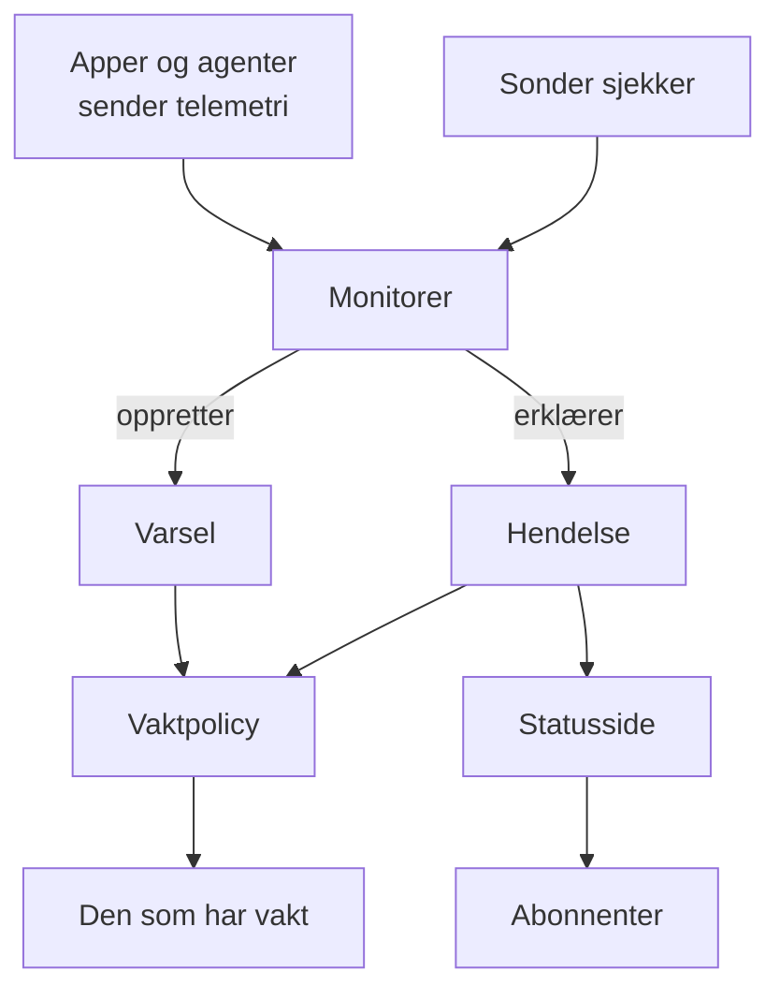

# Grunnbegreper

OneUptime har mange produkter, men de hviler på en håndfull ideer: prosjekter, monitorer, hendelser og varsler, vakt, statussider og telemetri. Denne siden forklarer hver idé med noen få setninger, viser hvordan de henger sammen, og lenker til sidene som dekker dem i detalj. Les den én gang, så blir alle de andre sidene i dokumentasjonen lettere å lese.

:::cards
- [Prosjekter og personer](#prosjekter-og-personer): Hvor alt ligger, og hvem som kan gjøre hva.
- [Monitorer og sonder](#monitorer-og-sonder): Hvordan OneUptime merker at noe er galt.
- [Hendelser og varsler](#hendelser-og-varsler): Oppføringen teamet ditt jobber ut fra.
- [Vakt](#vakt): Hvem som varsles, hvordan, og hvem som er neste.
:::

## Slik henger delene sammen

Et problem beveger seg i én retning gjennom OneUptime. Sonder og din egen telemetri mater monitorene. En monitors kriterier avgjør når noe er galt, og hva som åpnes: en hendelse, et varsel eller begge. Vaktpolicyer varsler folk om dem, og statussider forteller kundene dine om hendelser.

## Prosjekter og personer

Et **prosjekt** inneholder alt: monitorer, hendelser, vaktpolicyer, statussider, telemetri og innstillinger. De fleste bedrifter trenger ett, og noen har ett per miljø eller forretningsområde. Ingenting du oppretter i ett prosjekt, er synlig i et annet.

**Kontoen** din er atskilt fra prosjektene dine. Én konto, med én e-post og ett passord, kan høre til så mange prosjekter du vil; bytt mellom dem med prosjektvelgeren øverst til venstre. Se [Kontoen din](/docs/introduction/your-account).

Folk er med i et prosjekt gjennom **team**, og et teams tillatelser avgjør hva medlemmene kan gjøre. Hvert nytt prosjekt starter med tre team: Owners, med deg i, Admin og Members. På OneUptime Cloud har hvert prosjekt sin egen plan.

:::cards
- [Brukere, team og tillatelser](/docs/permissions/index): Inviter folk, og bestem hva de kan gjøre.
:::

## Monitorer og sonder

En **monitor** sjekker én ting du kjører, og avgjør om den virker. De fleste monitorer sjekkes av **sonder**: maskiner som kjører sjekken etter en tidsplan, for eksempel ved å hente en side, kalle et API, pinge en vert eller spørre en database. OneUptime Cloud kjører sonder i flere regioner, en selvhostet installasjon kjører sine egne, og du kan legge til egendefinerte sonder i nettverket ditt. Andre monitorer leser i stedet det du sender: telemetrien fra appene dine, eller dataene en agent rapporterer fra serverne, Kubernetes-klyngene og resten av infrastrukturen din.

En monitors **kriterier** avgjør hva hvert resultat betyr. De sjekkes i rekkefølge, og det første som treffer, kan endre monitorens status, erklære en hendelse, opprette et varsel eller alle tre. Hvert nytt prosjekt har tre monitorstatuser: **I drift**, **Redusert** og **Frakoblet**.

:::cards
- [Opprett en monitor](/docs/monitor/create-monitor): Velg en type, si hva som skal sjekkes, og hvor ofte.
- [Egendefinerte probes](/docs/probe/custom-probe): Sjekk det bare ditt eget nettverk kan nå.
:::

## Hendelser og varsler

Begge registrerer et problem, og begge kan varsle den som har vakt. Forskjellen er hvem problemet rammer.

| | Hendelse | Varsel |
| --- | --- | --- |
| **Hva det er** | Et problem som rammer brukerne dine, for eksempel et brudd eller en treghet | Et problem teamet ditt bør se på før brukerne blir rammet |
| **På statussider** | Kan vises, og gir abonnenter beskjed | Aldri |
| **Startstatuser** | **Identified**, **Bekreftet**, **Løst** | **Identified**, **Bekreftet**, **Løst** |
| **Startalvorlighetsgrader** | Critical Incident, Major Incident, Minor Incident | **High**, **Low** |

Å bekrefte sier at noen tar seg av det, og hindrer vaktpolicyene i å varsle neste nivå. Å løse avslutter det. Du kan legge til egne statuser og alvorlighetsgrader, og koble varsler til hendelsen de viste seg å høre til.

En **episode** samler relaterte hendelser, eller relaterte varsler, slik at teamet ditt jobber med dem som én. Grupperingsregler avgjør hva som hører sammen.

:::cards
- [Hendelser – Oversikt](/docs/incidents/index): Hvordan hendelser erklæres, håndteres og løses.
- [Koblede varsler](/docs/incidents/linked-alerts): Koble varslene et brudd utløste, til hendelsen.
:::

## Vakt

En **vaktpolicy** avgjør hvem som varsles om en hendelse eller et varsel, og hvem som er neste hvis ingen svarer. **Eskaleringsreglene** er nivåene: hvert nivå varsler sine personer og venter så på at noen bekrefter før neste nivå varsles. Et nivå kan varsle personer, team eller en **vaktplan**, en rotasjon som til enhver tid vet hvem som har vakt.

Hvordan hver person nås, bestemmer de selv. I **Brukerinnstillinger** lagrer hver person måtene OneUptime kan nå dem på, som e-post, SMS, anrop, push-varsler, Slack eller Microsoft Teams, og hvilke som brukes når de varsles.

:::cards
- [Eskaleringsregler](/docs/on-call/escalation-rules): Varsle folk nivå for nivå til noen svarer.
- [Vaktplaner](/docs/on-call/schedules): Rotasjoner, lag og vaktbytter.
:::

## Statussider og vedlikehold

En **statusside** viser kundene dine om tjenestene virker. Du velger hvilke monitorer den viser, under navn kundene forstår. Mens en hendelse på en av de monitorene er aktiv, viser siden den, og **abonnentene** får beskjed på e-post, SMS, Slack, Microsoft Teams eller webhook. En statusside kan være offentlig, eller privat for dem du slipper inn.

**Planlagt vedlikehold** kunngjør planlagt arbeid på forhånd. En hendelse går gjennom **Planlagt**, **Pågående**, **Avsluttet** og **Fullført**, og statussidene du viser den på, forteller besøkende og abonnenter om den.

:::cards
- [Statussider – Oversikt](/docs/status-pages/index): Opprett en statusside, og bestem hva den viser.
- [Abonnenter og kunngjøringer](/docs/status-pages/subscribers): Hvem som får beskjed, og når.
:::

## Telemetri

**Telemetri** er det systemene dine sender til OneUptime: logger, metrikker, spor, unntak og profiler. Apper sender den med OpenTelemetry, og agentene til OneUptime sender den fra verter, Kubernetes-klynger, Docker-verter og resten av infrastrukturen. Hver avsender bruker en **inntaksnøkkel**, opprettet under **Prosjektinnstillinger → Telemetri og APM → Inntaksnøkler**. Du søker i telemetrien, viser den på dashbord og følger med på den med telemetrimonitorer, som åpner hendelser og varsler som alle andre monitorer.

:::cards
- [OpenTelemetry](/docs/telemetry/open-telemetry): Send logger, metrikker og spor fra appene dine.
- [Logg-overvåking](/docs/monitor/logs-monitor): Få beskjed når et mønster dukker opp i loggene dine.
:::

## Automatisering og AI

- **Arbeidsflyter** utfører handlinger når noe skjer, for eksempel en melding i Slack når en hendelse erklæres.
- **Runbooks** gjør en beredskapsprosedyre til trinn teamet ditt kan kjøre for hånd eller automatisk.
- **OneUptime AI** undersøker nye hendelser og varsler og legger det den fant ut på tidslinjen deres, og **Ask AI** svarer på spørsmål om prosjektet ditt. Et nytt prosjekt starter med AI slått på; bryteren **Aktiver AI** under **Prosjektinnstillinger → KI → AI Features** slår alt sammen av.

:::cards
- [Oversikt over arbeidsflyter](/docs/workflows/index): Automatiser handlinger med utløsere og komponenter.
- [AI SRE](/docs/ai/ai-sre): Hvordan OneUptime AI undersøker hendelser og varsler.
:::

## Etiketter og eiere

**Etiketter** er merker du setter på monitorer, hendelser, statussider og de fleste andre ressurser, for å filtrere og gruppere dem. Et teams tillatelser kan begrenses til ressurser med bestemte etiketter. **Eiere** er personene og teamene som har ansvaret for én ressurs: de får beskjed når noe skjer med den. Etikettregler og eierregler legger til etiketter og eiere på nye ressurser for deg.

:::cards
- [Etikett- og eierregler](/docs/configuration/label-and-owner-rules): Gi nye ressurser etiketter og eiere automatisk.
:::

## Neste steg

:::cards
- [Hurtigstart](/docs/introduction/quickstart): Ta ideene i bruk på femten minutter.
- [Startside og snarveier](/docs/introduction/home): Finn hvert produkt i dashbordet.
- [Opprett en monitor](/docs/monitor/create-monitor): Din første monitor, felt for felt.
- [Hendelser – Oversikt](/docs/incidents/index): Hva som skjer etter at en monitor erklærer en hendelse.
:::
