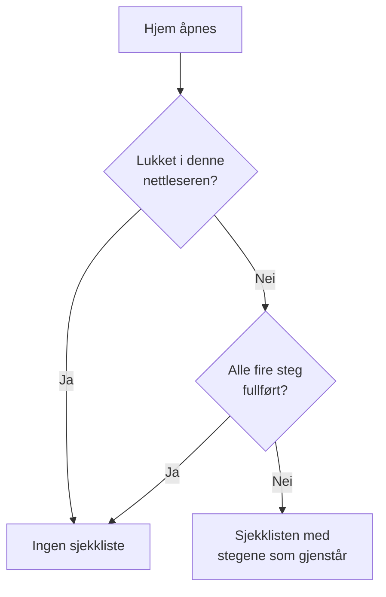

# Startside og snarveier

Hjem er den første siden du ser i et prosjekt. Den viser med et blikk om noe trenger deg akkurat nå, og leder et nytt prosjekt gjennom det første oppsettet. Denne siden forklarer hva Hjem viser, hvordan du finner ethvert produkt, enhver side og handling i dashbordet, og hurtigtastene som sparer deg for turer gjennom menyene.

:::cards
- [Hva Hjem viser](#hva-hjem-viser): Velkomstsjekklisten, de fem flisene og de aktive hendelsene.
- [Finn frem](#finn-frem): Menyen Produkter og linjene øverst på hver side.
- [Søk](#søk-etter-en-side-en-innstilling-eller-en-handling): Finn enhver side, innstilling eller handling ved å skrive navnet.
- [Hurtigtaster](#hurtigtaster): Gå til Hjem, Overvåkere eller Hendelser med to taster.
:::

## Hva Hjem viser

Åpne **Hjem** i linjen øverst, eller trykk `g` og deretter `h` hvor som helst. Fra topp til bunn viser Hjem:

1. **Velkommen til OneUptime 👋**, en sjekkliste for et nytt prosjekt, til den er fullført.
2. Fem fliser som teller det som trenger oppmerksomhet.
3. **Aktive hendelser**, alle hendelser som ikke er løst ennå.

### Velkomstsjekklisten

Sjekklisten leder deg gjennom de fire tingene et prosjekt trenger før det er nyttig. Hvert steg åpner siden der du gjør det, og krysser seg selv av når prosjektet har det steget ber om.

| Steg | Fullført når | Åpner |
| --- | --- | --- |
| **Opprett din første overvåker** | Prosjektet har en monitor. | Skjemaet **Opprett monitor**, eller listen **Monitorer** for den som ikke kan opprette monitorer. |
| **Publiser en statusside** | Prosjektet har en statusside. | **Statussider** |
| **Inviter teamet ditt** | Noen andre enn deg er i prosjektet, eller invitert til det. | **Brukere** |
| **Sett opp en vaktpolicy** | Prosjektet har en vaktpolicy. | **Vakttjeneste** |

Under stegene viser **Slik fungerer OneUptime** de fire kjerneproduktene i rekkefølgen et problem går gjennom dem: **Monitorer**, **Hendelser og varsler**, **Vakttjeneste** og **Statussider**. Klikk på ett for å åpne det.

Sjekklisten forsvinner når alle fire steg er fullført. Klikk på **Lukk** for å skjule den før. Det huskes i denne nettleseren, for dette prosjektet; alt stegene åpner, ligger fortsatt i menyen **Produkter**.

### Flisene

Hver flis teller noe, sier om det trenger deg, og åpner listen bak tallet.

| Flis | Hva den teller | Når tallet er null |
| --- | --- | --- |
| **Aktive hendelser** | Hendelser som ikke er løst | **Alt er i orden** |
| **Aktive varsler** | Varsler som ikke er løst | **Alt er i orden** |
| **Ikke-operative monitorer** | Monitorer med en status som ikke er en driftsstatus. Arkiverte monitorer telles ikke. | **Alle i drift** |
| **Pågående vedlikehold** | Planlagte vedlikehold som pågår | **Ingen pågår** |
| **SLO-er i faresonen** | Påslåtte SLO-er som er i faresonen eller har brukt opp feilbudsjettet | **Budsjettene er sunne** |

Et tall over null viser **Krever oppmerksomhet**, eller **Pågår** og **Budsjettet brukes opp** på flisene for vedlikehold og SLO-er. Et prosjekt uten monitorer ser **Ingen monitorer ennå** på monitorflisen, og ett uten SLO-er ser **Ingen SLO-er ennå**: et tomt prosjekt er ikke det samme som et sunt. De to flisene åpner da listene **Monitorer** og **SLOs**, der du oppretter en.

### Sidemenyen til Hjem

Sidemenyen ved siden av Hjem har de samme listene, hver med et tall:

| Del | Sider |
| --- | --- |
| **Hendelser** | **Aktive hendelser** og **Aktive episoder** |
| **Varsler** | **Aktive varsler** og **Aktive episoder** |
| **Monitorer** | **Ikke operativ** |
| **Planlagte hendelser** | **Pågående** |

En episode samler relaterte hendelser eller varsler, så du jobber med dem som én. Se [Grunnbegreper](/docs/introduction/core-concepts#hendelser-og-varsler).

## Finn frem

Alt i OneUptime ligger under **Produkter** i topplinjen. Menyen viser gruppene sine som radene i én liste, og åpner alltid med den første av dem, det grunnleggende, utvidet: Overvåkere, Hendelser, Varsler, Vakttjeneste, Statussider, Planlagt vedlikehold og SLOs. Hver annen gruppe (Observerbarhet, AI, Kode, Ressurser, Infrastruktur, Dashbord og automatisering og Innstillinger) er slått sammen til en rad i den samme listen. Hver rad nevner produktene i gruppen og sier hvor mange det er. Klikk på en rad for å utvide eller slå den sammen, eller gå til den med piltastene og trykk **Enter**.

- **Søk finner alt.** Skriv i menyens søkefelt for å finne ethvert produkt etter navn, etter hva det gjør, eller etter et kjent ord som `k8s` eller `RUM`. Søket ser også inni de sammenslåtte gruppene.
- **Du starter der du er.** Gruppen til siden du er på, utvides av seg selv, og produktene du nylig har åpnet, står øverst.
- **Valgene dine blir værende.** Menyen husker i nettleseren din hvilke av de andre gruppene du har utvidet eller slått sammen. Det grunnleggende er utvidet igjen hver gang du åpner menyen, selv om du slo det sammen.
- **På en telefon** viser menyknappen produktene på samme måte: det grunnleggende utvidet øverst, og hver annen gruppe som én rad som åpnes med et trykk.

### Linjene øverst

To linjer går over toppen av hver side.

| Hvor | Hva som er der |
| --- | --- |
| Øverst til venstre | Prosjektvelgeren: bytt til et annet av prosjektene dine, eller opprett et nytt. |
| Øverst til høyre | **Søk** og **Ask AI**, varselklokken med det som trenger deg nå (aktive hendelser og varsler, vaktpolicyene du har vakt i, ventende invitasjoner), **Hjelp**, og bildet ditt, som åpner menyen for [kontoen](/docs/introduction/your-account) din. |
| Under dem | **Hjem** og **Produkter** til venstre, **Brukerinnstillinger** til høyre: hvordan OneUptime når deg i dette prosjektet. |

**Hjelp** åpner denne dokumentasjonen (**Dokumentasjon**) og listen **Keyboard shortcuts**, og tilbyr støtte på e-post og på Slack. På en smal skjerm, som en telefon, er **Søk**, **Ask AI** og **Hjelp** utelatt for å spare plass; klokken og bildet ditt blir værende.

## Søk etter en side, en innstilling eller en handling

Trykk **Cmd+K** (Mac) eller **Ctrl+K** (Windows og Linux), eller klikk på søkeikonet i topplinjen, og begynn å skrive. Søket finner:

- **Hver side i menyene**, under navnet menyen gir den: API-nøkler, Faresone, Vaktplaner, Hendelsesalvor, dine egne Varselmetoder. Hvert resultat sier hvor det ligger, for eksempel *Prosjektinnstillinger › Avansert*, slik at sider med samme navn (Egendefinerte felt under Hendelser, Varsler og Monitorer) er lette å skille fra hverandre.
- **Handlinger**, etter hva du vil gjøre: Erklær hendelse, Opprett monitor eller Delete Project, som åpner Faresone. En handling som endrer noe, tilbys bare dem som har lov til å utføre den.
- **Monitorene, hendelsene, varslene, statussidene og vaktpolicyene dine**, etter navn.

Søket leser det du skriver slik du mener det:

- Store og små bokstaver, aksenter, mellomrom og bindestreker spiller ingen rolle: *on-call*, *on call* og *oncall* finner de samme sidene, og ordene kan stå i hvilken som helst rekkefølge.
- Det kjenner andre ord for mange sider, på engelsk: *pager* eller *escalation* for Vaktretningslinjer, *rota* for Vaktplaner, *2fa* for totrinnsbekreftelse, *delete project* for Faresone.
- Legg til produktets navn for å snevre inn et søk: *incident custom fields* finner siden Egendefinerte felt under Hendelser.
- En liten skrivefeil, som *incidnet*, finner likevel det du mente når ingenting treffer slik det er skrevet.

Med tomt søkefelt viser søket sidene du nylig har åpnet, handlingene og produktene.

## Hurtigtaster

Trykk `?` hvor som helst i dashbordet for å se alle hurtigtastene, eller åpne **Hjelp** og velg **Keyboard shortcuts**. På en Mac er `Mod` Command-tasten; på Windows og Linux er det Ctrl.

| Taster | Hva de gjør |
| --- | --- |
| `Mod` + `K` | Åpne kommandopaletten: søk etter enhver side, innstilling eller handling. |
| `Mod` + `I` | Spør AI om det du ser på. |
| `/` | Søk i listen på denne siden. |
| `?` | Vis hurtigtastene. |
| `Esc` | Lukk en dialog eller et panel. |

### Gå til et produkt

Trykk `g` og deretter en bokstav for å gå rett til et produkt. Trykk bokstaven innen halvannet sekund etter `g`.

| Taster | Går til |
| --- | --- |
| `g` deretter `h` | Hjem |
| `g` deretter `m` | Overvåkere |
| `g` deretter `i` | Hendelser |
| `g` deretter `a` | Varsler |
| `g` deretter `o` | Vakttjeneste |
| `g` deretter `s` | Statussider |
| `g` deretter `e` | Planlagt vedlikehold |
| `g` deretter `d` | Dashbord |
| `g` deretter `l` | Logger |
| `g` deretter `t` | Spor |

Hurtigtastene står ikke i veien for deg. `?`, `/` og `g` gjør ingenting mens du skriver i et felt, og ingenting navigerer bort mens en dialog er åpen, så et feiltrykk kan ikke koste deg et halvutfylt skjema. Alle andre produkter er ett søk unna med `Mod` + `K`.

## Neste steg

:::cards
- [Hurtigstart](/docs/introduction/quickstart): Gå gjennom velkomstsjekklisten, steg for steg.
- [Kontoen din](/docs/introduction/your-account): Profilen din, sikkerheten rundt innloggingen, språk og tema.
- [Spør AI](/docs/ai/ask-ai): Hva Ask AI kan svare på og gjøre for deg.
- [Grunnbegreper](/docs/introduction/core-concepts): Hva monitorer, hendelser, varsler og vakt er.
:::
