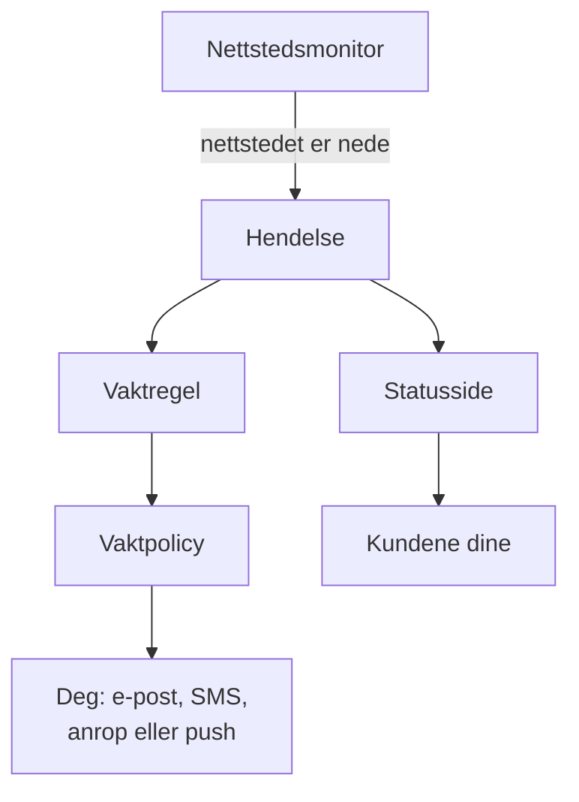

# Hurtigstart

Denne guiden tar deg fra en ny konto til et oppsett som virker, på omtrent femten minutter: en monitor som sjekker nettstedet ditt hvert femte minutt, en vaktpolicy som varsler deg når nettstedet går ned, og en statusside som informerer kundene dine. Den følger sjekklisten **Velkommen til OneUptime 👋** på prosjektets startside.

## Før du begynner

- **En konto.** På OneUptime Cloud registrerer du deg på [oneuptime.com](https://oneuptime.com/accounts/register) og åpner lenken i e-posten du får. På din egen installasjon åpner du den i nettleseren og registrerer deg: den første kontoen blir hovedadministrator. Se [Docker Compose](/docs/installation/docker-compose) for å installere en.
- **Et nettsted å følge med på.** Enhver adresse som svarer over HTTP eller HTTPS, for eksempel forsiden til bedriften din.

## Opprett et prosjekt

I OneUptime ligger alt i et prosjekt: monitorene, hendelsene, vaktpolicyene, statussidene og folkene som jobber med dem.

:::steps
### Start et nytt prosjekt

Første gang du logger inn, viser OneUptime **Ingen prosjekter**. Klikk på **Opprett nytt prosjekt**. Har noen allerede invitert deg til et prosjekt, godtar du heller invitasjonen på samme side.

### Gi det et navn

Skriv inn et **Prosjektnavn**, for eksempel navnet på bedriften din. På OneUptime Cloud ber neste steg deg velge en plan.

### Opprett det

Klikk på **Opprett prosjekt**. Prosjektets startside åpnes, med sjekklisten **Velkommen til OneUptime 👋** øverst.
:::

## Overvåk nettstedet ditt

:::steps
### Åpne opprettelse av monitor

Klikk på **Opprett din første overvåker** i sjekklisten. Du kan også åpne **Monitorer** fra menyen **Produkter** og klikke på **Opprett monitor**.

### Velg Nettsted

Under **Monitortype** velger du **Nettsted**. Skriv inn et **Navn**, for eksempel `Website`, og klikk på **Neste**.

### Skriv inn adressen

Skriv inn hele adressen til nettstedet ditt i **Nettsted-URL**, for eksempel `https://example.com`. OneUptime legger til kriteriene for deg: monitoren blir **Frakoblet** og erklærer en hendelse når nettstedet ikke svarer, eller svarer med en feil. Klikk på **Neste**.

### Opprett monitoren

Behold de valgte **Sonder** og **Overvåkingsintervall** **Hvert 5. minutt**, og klikk på **Opprett monitor**. Monitorens side åpnes, og sondene begynner å sjekke nettstedet ditt.
:::

For å prøve sjekken før du lagrer, klikker du på **Test monitor** i det andre steget. Alle andre monitortyper er beskrevet i [Opprett en monitor](/docs/monitor/create-monitor).

## Bli varslet når det går ned

Slik det er nå, sendes en hendelse uten eiere på e-post til prosjektets eiere, og det inkluderer deg. For å bli varslet til noen svarer, oppretter du en vaktpolicy og lar hver hendelse utløse den.

:::steps
### Opprett en vaktpolicy

Klikk på **Sett opp en vaktpolicy** i sjekklisten, eller åpne **Vakttjeneste** fra menyen **Produkter**. Klikk på **Opprett Vaktpolicy**, og skriv inn et **Navn**. Under **Hvem varsles først?** klikker du på **Legg til mottaker** og velger deg selv. Klikk på **Opprett Vaktpolicy**.

### Utløs den for hver hendelse

Åpne **Hendelser** fra menyen **Produkter**, utvid **Regler** i sidemenyen, og velg **Vaktregler**. Klikk på **Opprett Incident On-Call Rule**, skriv inn et **Navn**, og klikk på **Neste**. La **Treffkriterier** stå tomt, så regelen gjelder alle hendelser, og klikk på **Neste**. Velg policyen din under **Vaktpolicyer**, og klikk på **Opprett Incident On-Call Rule**.

### Velg hvordan du nås

E-posten du logger inn med, er allerede en måte å nå deg på. For også å få SMS eller anrop åpner du **Brukerinnstillinger** i linjen under topplinjen, går til **Varselmetoder** og legger på fanen **Direct Contact** til nummeret ditt under **Telefonnumre for SMS-varsler** eller **Telefonnumre for anropsvarsler**. Klikk på **Verifiser**, og skriv inn koden OneUptime sender deg. Et verifisert nummer brukes til vaktvarsler med en gang.
:::

> [!NOTE]
> SMS og telefonanrop er slått av i et nytt prosjekt. En prosjekteier, en Billing Admin eller noen med Manage Billing slår dem på i kortet **Varslingskanaler** under **Prosjektinnstillinger → Varsler → Varselinnstillinger**.

Se [Eskaleringsregler](/docs/on-call/escalation-rules) og [Vaktplaner](/docs/on-call/schedules) for flere nivåer, rotasjoner og hvor lenge hvert nivå venter.

## Publiser en statusside

:::steps
### Opprett statussiden

Klikk på **Publiser en statusside** i sjekklisten, eller åpne **Statussider** fra menyen **Produkter**. Klikk på **Opprett statusside**, skriv inn et **Navn**, for eksempel `Acme Status`, og klikk på **Opprett statusside**.

### Legg til monitoren din

Åpne den nye statussiden. I sidemenyen, under **Ressurser**, velger du **Monitorer**; i prosjekter med monitorgrupper slått på heter punktet **Ressurser**. Klikk på **Legg til monitor**, velg nettstedsmonitoren din, og klikk på **Legg til monitor**. Raden viser monitorens navn til besøkende; endre det under **Visningsnavn** om du vil.

### Åpne siden

Velg **Oversikt** i sidemenyen. Kortet **Status Page Preview URL** lenker til statussiden din: åpne den, og nettstedet ditt vises som i drift.
:::

En ny statusside er offentlig: alle med adressen kan åpne den. Se [Statusside – merkevare og domener](/docs/status-pages/branding-and-domains) for å gi den ditt eget domene, logo og farger.

## Inviter teamet ditt

Klikk på **Inviter teamet ditt** i sjekklisten, eller åpne **Brukere** fra menyen **Produkter**, under **Innstillinger**. Klikk på **Inviter bruker**, skriv inn personens **E-post**, og velg et **Team**: medlemsteamet er valgt fra start. Klikk på **Inviter**. OneUptime sender invitasjonen på e-post, og teamet avgjør hva personen kan gjøre. Se [Brukere, team og tillatelser](/docs/permissions/index).

## Prøv det

Erklær en testhendelse for å se hele kjeden virke.

:::steps
### Erklær en testhendelse

Åpne **Hendelser**, og klikk på **Erklær hendelse**. Skriv inn en **Tittel**, for eksempel `Test incident`, velg en **Hendelsesalvor**, og klikk på **Neste**. Under **Monitorer** velger du nettstedsmonitoren din, slik at hendelsen vises på statussiden din. Klikk på **Neste** til du kommer til sammendraget, og deretter på **Erklær hendelse**.

### Se hva som skjer

I løpet av et minutt eller to varsler vaktpolicyen deg, og hendelsen vises på statussiden din.

### Løs den

Klikk på **Løs** på hendelsens side. Varslingen stopper, og hendelsen forsvinner fra statussiden din.
:::

> [!WARNING]
> Alle som åpner statussiden din, ser testhendelsen til du løser den. Kjør testen før du deler adressen til siden.

## Feilsøking

:::details Jeg ble ikke varslet
Åpne hendelsen, og velg **Vaktutførelser** i sidemenyen: der ser du om policyen din kjørte, og hvem den varslet. Kjørte den ikke, sjekk at vaktregelen din er slått på og nevner policyen. Kjørte den, sjekk at metodene dine under **Brukerinnstillinger → Varselmetoder** er verifisert.
:::

:::details Hendelsen vises ikke på statussiden min
En statusside viser en hendelse når en av hendelsens monitorer er på siden. Sjekk at hendelsen har monitoren din blant de berørte ressursene, og at monitoren er på statussiden.
:::

:::details Monitoren sier frakoblet, men nettstedet mitt virker
Åpne monitoren, og se hva sondene mottok. Se feilsøkingsdelen i [Nettsted-overvåking](/docs/monitor/website-monitor).
:::

## Neste steg

:::cards
- [Grunnbegreper](/docs/introduction/core-concepts): Ideene bak det du nettopp satte opp.
- [Vaktplaner](/docs/on-call/schedules): Del vaktene med teamet ditt.
- [Statusside – merkevare og domener](/docs/status-pages/branding-and-domains): Gjør statussiden til din egen.
- [OpenTelemetry](/docs/telemetry/open-telemetry): Send logger, metrikker og spor fra appene dine.
:::
