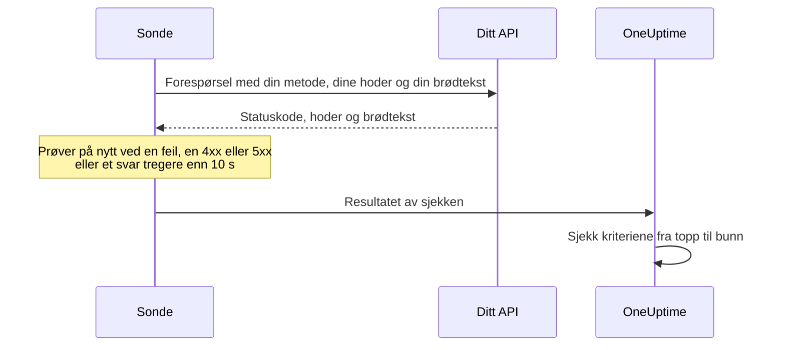

# API-overvåking

En API-monitor kaller et HTTP-endepunkt etter en tidsplan, med metoden, hodene og brødteksten du velger, og sjekker det som kommer tilbake: statuskoden, svartiden, hodene og brødteksten. Bruk den for REST-, JSON- og GraphQL-endepunkter, helsesjekker og alle kall brukerne dine er avhengige av.

:::cards
- [Opprett monitoren](#opprett-en-api-monitor): Seks trinn i dashbordet.
- [Konfigurasjonsalternativer](#konfigurasjonsalternativer): Metode, hoder, brødtekst, omdirigeringer, sertifikater, tidsavbrudd og nye forsøk.
- [Overvåkingskriterier](#overvåkingskriterier): Hva som fra start regnes som oppe eller nede.
- [Feilsøking](#feilsøking): Når en sjekk feiler som burde ha bestått.
:::

## Slik fungerer det

Ved hver sjekk sender en sonde forespørselen, følger omdirigeringer og registrerer statuskoden, svartiden, hodene og brødteksten. En forespørsel som feiler, får tidsavbrudd, svarer med status `4xx` eller `5xx` eller tar lenger enn 10 sekunder, prøves på nytt, opptil antallet nye forsøk du tillater. Deretter kjører OneUptime resultatet gjennom monitorens kriterier.



En sonde som har mistet sin egen nettverkstilkobling, rapporterer ikke noe resultat, så den kan ikke merke API-et ditt som frakoblet.

## Før du starter

- **En rolle som kan opprette monitorer**: Project Owner, Project Admin, Project Member, Monitor Admin eller Monitor Member, eller en egendefinert rolle med tillatelsen Create Monitor.
- **En sonde som når API-et.** Prosjektets standardsonder velges for hver nye monitor. Står det en brannmur foran API-et, tillater du [OneUptime Clouds sonde-IP-adresser](/docs/configuration/ip-addresses). Et API på et privat nettverk trenger en [egendefinert sonde](/docs/probe/custom-probe) i det nettverket, som får nå private adresser: se [Tilgang til privat nettverk](/docs/self-hosted/private-network-access).
- **Påloggingsdata som overvåkingshemmeligheter.** Trenger API-et en nøkkel eller et token, lagrer du det først som en [overvåkingshemmelighet](/docs/monitor/monitor-secrets), så monitoren bare har en referanse til den.

## Opprett en API-monitor

:::steps
### Start en ny monitor

Gå til **Monitorer**, og klikk på **Opprett monitor**. Velg **API** under **Monitortype**.

### Gi den et navn

Angi et **Navn**, som `Orders API`, og klikk så på **Neste**.

### Angi forespørselen

Angi endepunktets fullstendige URL under **API-URL**, som `https://api.example.com/health`. Velg **API-forespørselstype** (**GET** med mindre du endrer den). For å legge til hoder eller en brødtekst åpner du **Flere felt** og fyller ut **Forespørselshoder** og **Forespørselstekst (i JSON)**.

### Test den

Klikk på **Test monitor**, velg en sonde under **Velg sonde**, og klikk på **Kjør test**. **Resultat av overvåkingstest** viser hva API-et svarte.

### Gå gjennom kriteriene

**Monitorkriterier** starter med [standardkriteriene](#standardkriterier): frakoblet når API-et ikke svarer eller svarer med en feil, tilkoblet ved enhver status `2xx` eller `3xx`. For også å sjekke hva API-et returnerer, legger du til et filter og klikker så på **Neste**.

### Velg sonder og opprett

Behold eller endre **Sonder** og **Overvåkingsintervall** (det starter på **Hvert 5. minutt**), og klikk så på **Opprett monitor**. Monitorens side åpner.
:::

## Konfigurasjonsalternativer

### API-URL

Endepunktet som skal kalles, som fullstendig URL med skjema, som `https://api.example.com/v1/health`. Du kan sette en [overvåkingshemmelighet](/docs/monitor/monitor-secrets) inn i URL-en som `{{monitorSecrets.NAME}}`.

### Dynamiske URL-plassholdere

Når et CDN eller en hurtigbuffer-proxy står foran API-et, kan en sonde få svar fra hurtigbufferen i stedet for fra serveren din. For å komme forbi hurtigbufferen legger du til en plassholder i URL-en; sonden erstatter den med en ny verdi ved hver sjekk.

| Plassholder | Erstattes med | Eksempelverdi |
| --- | --- | --- |
| `{{timestamp}}` | Gjeldende Unix-tid i sekunder | `1719500000` |
| `{{random}}` | En tilfeldig, unik streng på 32 heksadesimale tegn | `3f2b8c1d9e7a4b6c8d0e1f2a3b4c5d6e` |

En URL med en plassholder:

```text
https://api.example.com/health?cb={{timestamp}}
```

Hva sonden ber om ved to sjekker med fem minutters mellomrom:

```text
https://api.example.com/health?cb=1719500000
https://api.example.com/health?cb=1719500300
```

Bruk `{{random}}` på samme måte: `https://api.example.com/health?nocache={{random}}`.

### API-forespørselstype

HTTP-metoden som sendes. **GET** er standard; de andre er **POST**, **PUT**, **PATCH**, **DELETE** og **HEAD**. Får en forespørsel **HEAD** svar med status `4xx` eller `5xx`, gjentar sonden den som `GET`.

### Flere felt

Disse innstillingene er brettet sammen under **Flere felt**. Den sammenbrettede overskriften nevner dem og viser hvilke du har endret.

| Felt | Standard | Hva det gjør |
| --- | --- | --- |
| **Forespørselshoder** | Ingen | Hoder som sendes, som par av navn og verdi. Klikk på **Legg til Request Header** for hvert av dem. |
| **Forespørselstekst (i JSON)** | Ingen | Et JSON-objekt som sendes som brødtekst, som regel med **POST**, **PUT** eller **PATCH**. Det må være gyldig JSON. |
| **Ikke følg omdirigeringer** | Av | Vurder det første svaret i stedet for å følge omdirigeringer. Se [nedenfor](#ikke-følg-omdirigeringer). |
| **Tillat selvsignerte sertifikater** | Av | Hopp over valideringen av TLS-sertifikatet for monitorens eget vertsnavn. |
| **Bruk klientsertifikat (mTLS)** | Av | Presenter et klientsertifikat og en privat nøkkel. Se [Klientsertifikat (mTLS)](#klientsertifikat-mtls). |
| **Tidsavbrudd for forespørsel (sekunder)** | `60` | Hvor lenge det ventes på hvert forsøk. Maksimum er 60 sekunder. |
| **Nye forsøk ved feil** | Sondens standard, som regel `3` | Hvor mange ganger et mislykket forsøk gjentas. Maksimum er 3. Se [Nye forsøk og tidsavbrudd](#nye-forsøk-og-tidsavbrudd). |

Forespørselshoder og forespørselens brødtekst kan bruke [overvåkingshemmeligheter](/docs/monitor/monitor-secrets), for eksempel et hode `Authorization` med verdien `Bearer {{monitorSecrets.ApiKey}}`.

#### Ikke følg omdirigeringer

Som standard følger sonden omdirigeringer (`301`, `302`, `303`, `307` og `308`), opptil 10 av dem, og vurderer svaret den havner på. Slå på **Ikke følg omdirigeringer** for i stedet å vurdere selve omdirigeringssvaret. [Standardkriteriene](#standardkriterier) regner et omdirigeringssvar som tilkoblet.

Når den følger en omdirigering:

- En `303`, eller en `301` eller `302` som svar på en `POST`, gjør forespørselen om til en `GET` uten brødtekst, slik nettlesere gjør.
- Forespørselshodene dine går bare til URL-ens egen opprinnelse (samme skjema, vert og port). En omdirigering til en annen opprinnelse sendes uten dem.
- En omdirigering til en annen opprinnelse får sjekken til å feile hvis forespørselen fortsatt har en brødtekst eller en annen metode enn `GET` eller `HEAD`.
- **Tillat selvsignerte sertifikater** følger omdirigeringer som blir på monitorens eget vertsnavn. En omdirigering til et annet vertsnavn verifiseres som vanlig.

#### Klientsertifikat (mTLS)

Krever API-et gjensidig TLS, slår du på **Bruk klientsertifikat (mTLS)** og fyller ut:

| Felt | Hva du angir |
| --- | --- |
| **Klientsertifikat (PEM)** | Det PEM-kodede klientsertifikatet som presenteres. |
| **Klientens private nøkkel (PEM)** | Den tilhørende PEM-kodede private nøkkelen. |
| **Passordfrase for klientens private nøkkel** | Valgfritt. Passordfrasen, bare hvis den private nøkkelen er kryptert. |

Det tilsvarer curls flagg `--cert` og `--key`:

```bash
curl --cert client.crt --key client.key https://api.example.com/health
```

For å holde nøkkelen utenfor monitorens innstillinger lagrer du sertifikatet og nøkkelen som [overvåkingshemmeligheter](/docs/monitor/monitor-secrets) og angir `{{monitorSecrets.NAME}}` i disse feltene. Hemmeligheter fylles inn på serveren, og verdiene deres vises aldri i dashbordet.

Klientsertifikatet presenteres bare så lenge forespørselen blir på URL-ens opprinnelse. Etter en omdirigering til en annen opprinnelse fortsetter sonden uten det.

#### Nye forsøk og tidsavbrudd

**Nye forsøk ved feil** teller nye forsøk _etter_ det første forsøket, så `0` kjører sjekken én gang og `2` opptil tre ganger. Står feltet tomt, brukes sondens standard: 3, med mindre sondens `PROBE_MONITOR_RETRY_LIMIT` sier noe annet. Sonden venter ett sekund mellom forsøkene, og hvert forsøk får hele **Tidsavbrudd for forespørsel (sekunder)**.

Disse feilene prøves på nytt: tilkoblingsfeil, tidsavbrudd, svar `4xx` og `5xx`, og svar som er tregere enn 10 sekunder. Disse gjør ikke det, fordi et nytt forsøk ikke kan endre dem: en ugyldig eller blokkert URL, mer enn 10 omdirigeringer og et svar større enn 512 KiB.

## Overvåkingskriterier

Kriterier avgjør når API-et regnes som tilkoblet, redusert eller frakoblet, og om det erklærer en hendelse eller oppretter et varsel. Hvert kriterium sjekker ett eller flere filtre:

| Filter | Betingelser | Hva det sjekker |
| --- | --- | --- |
| **Is Online** | **Sann**, **Usann** | Om API-et svarte i det hele tatt, uansett statuskode. |
| **Statuskode for svar** | **Equal To**, **Not Equal To**, **Greater Than**, **Less Than**, **Greater Than Or Equal To**, **Less Than Or Equal To** | HTTP-statuskoden. |
| **Svartid (i ms)** | **Greater Than**, **Less Than**, **Greater Than Or Equal To**, **Less Than Or Equal To** | Hvor lang tid forespørselen tok, omdirigeringer medregnet. |
| **Svartekst** | **Inneholder**, **Not Contains** | Tekst i svarets brødtekst. Det skilles mellom store og små bokstaver. |
| **Response Header** | **Inneholder**, **Not Contains** | Om svaret har et hode med dette navnet. Angi navnet med små bokstaver, som `x-request-id`. |
| **Response Header Value** | **Inneholder**, **Not Contains** | Om et hode har nøyaktig denne verdien, sammenlignet med små bokstaver, som `application/json`. |
| **JavaScript Expression** | **Evaluates To True** | Et uttrykk over svaret. Se [JavaScript-uttrykk](/docs/monitor/javascript-expression). |
| **Is Request Timeout** | **Sann**, **Usann** | Om forespørselen fikk tidsavbrudd ved hvert forsøk. |

Et JSON-svar sjekkes i sin kompakte form, uten mellomrom mellom nøkler og verdier. For å finne `"status": "ok"` med **Svartekst** angir du `"status":"ok"`.

**Legg til kriterier** legger til et kriterium som allerede har navn etter filteret sitt, for eksempel _Response Time (in ms) is above 3000_. Navnet endres med filtrene til du skriver inn ditt eget. En beskrivelse er valgfri: for å legge til en åpner du kriteriets **Innstillinger**.

Med to eller flere filtre avgjør **Samsvarsbetingelse** om **Alle** må samsvare, eller om **Hvilken som helst** av dem holder. Et kriteriums **Handlinger** avgjør hva det gjør: endrer monitorstatusen, oppretter et varsel, erklærer en hendelse, eller flere av disse.

### Standardkriterier

En ny API-monitor starter med to kriterier, så den fungerer uten at du endrer noe:

- **Frakoblet** — API-et svarer ikke, eller svarer med en statuskode på `400` eller høyere (eller under `200`). Monitoren merkes som **Frakoblet**, og en hendelse opprettes. Hendelsen løser seg selv når API-et er tilbake.
- **Oppe** — API-et svarer med en hvilken som helst statuskode `2xx` eller `3xx`, som `200`, `201`, `202` eller `204`. Monitoren merkes som **I drift**.

I listen over kriterier har de navn etter monitoren: _Check if (name) is offline_ og _Check if (name) is online_.

Et endepunkt som svarer `201 Created` eller `204 No Content`, regnes altså som oppe. Hvis bare én statuskode betyr frisk for deg, endrer du begge kriteriene på monitorens side **Konfigurasjon → Kriterier**: for eksempel **Statuskode for svar** / **Equal To** / `200` i det tilkoblede kriteriet og **Not Equal To** / `200` i det frakoblede, i stedet for de to statuskodefiltrene hvert av dem har. For også å sjekke hva API-et returnerer, legger du til et filter **Svartekst** eller **JavaScript Expression** i det frakoblede kriteriet.

Kriterier sjekkes fra topp til bunn, og det første som samsvarer, avgjør hva som skjer.

Når ingen samsvarer, faller monitoren tilbake til standardstatusen sin: **I drift**, med mindre du velger en annen under **Flere felt** under kriteriene. Den sammenbrettede overskriften på **Flere felt** viser hvilken status det er.

Monitorer som ble opprettet før OneUptime endret disse standardene, beholder kriteriene de ble opprettet med, og regner bare `200` som tilkoblet. Monitorer som opprettes via API-et eller Terraform, bruker kriteriene du sender.

### Evaluering over en tidsperiode

**Evaluer disse kriteriene over en tidsperiode** er en avkrysningsboks under et filter, som tilbys for **Is Online**, **Statuskode for svar** og **Svartid (i ms)**. Slå den på for å vurdere et vindu av tidligere sjekker i stedet for bare den siste: velg en aggregering under **Evaluer** og et vindu fra 2 til 60 minutter under **For de siste (i minutter)**.

| Aggregering | Samsvarer når |
| --- | --- |
| **Gjennomsnitt**, **Sum**, **Maximum Value**, **Minimum Value** | Den verdien over vinduet oppfyller betingelsen. Bare numeriske filtre. |
| **All Values** | Hver sjekk i vinduet oppfyller betingelsen. |
| **Any Value** | Minst én sjekk i vinduet oppfyller betingelsen. |

**All Values** samsvarer først når vinduet faktisk er dekket av data. En monitor som nettopp er opprettet, eller en der sjekkene sluttet å bli registrert, har ikke nok historikk til å si noe om de siste N minuttene, så kriteriet venter i stedet for å samsvare på den ene målingen det har. **Any Value** er innstillingen for "si fra med en gang én enkelt sjekk overskrider grensen" og utløses fortsatt umiddelbart.

**Hvis ingen data** avgjør hva som skjer så lenge vinduet ikke kan underbygge kriteriet:

| Alternativ | Hva som skjer | Bruk det til |
| --- | --- | --- |
| **Ignore** (standard) | Kriteriet samsvarer ikke. | Vanlige terskelvarsler. |
| **Trigger** | De manglende dataene regnes som problemet. | Sjekker der stillhet i seg selv er en feil. |
| **Treat As Zero** | Vinduet sammenlignes som én enkelt null. | Tellere der ingen hendelser virkelig betyr null. |

### Eksempelkriterier

| Mål | Filter | Betingelse | Verdi |
| --- | --- | --- | --- |
| Merk API-et som redusert når det er tregt | **Svartid (i ms)** | **Greater Than** | `1000` |
| Frakoblet når helsesjekken melder et problem | **Svartekst** | **Not Contains** | `"status":"ok"` |
| Det samme, lest fra den tolkede JSON-en | **JavaScript Expression** | **Evaluates To True** | `"{{responseBody.status}}" !== "ok"` |
| Godta bare `201` fra en `POST` | **Statuskode for svar** | **Equal To** | `201` |

## Feilsøking

:::details API-et svarer på forespørslene mine, men monitoren er frakoblet
Sonden fikk et annet svar enn deg. Hendelsens rotårsak og **Overvåkingslogger** på monitoren viser hva sonden så. Sjekk at sonden sender det API-et forventer: metoden, hodet `Authorization`, brødteksten. En brannmur eller en hastighetsbegrenser foran API-et kan også blokkere sondene: tillat [OneUptime Clouds sonde-IP-adresser](/docs/configuration/ip-addresses).
:::

:::details Monitoren sender `{{monitorSecrets.NAME}}` bokstavelig
Monitoren får ikke bruke hemmeligheten, eller navnet stemmer ikke. Se [Overvåkingshemmeligheter](/docs/monitor/monitor-secrets) for hvem som får bruke en hemmelighet.
:::

:::details Sjekken feiler med "unsafe cross-origin redirect"
API-et omdirigerte en forespørsel med en brødtekst, eller med en annen metode enn `GET` eller `HEAD`, til en annen opprinnelse, og sonden videresender ikke slike. Pek monitoren mot URL-en API-et omdirigerer til, eller slå på **Ikke følg omdirigeringer** og sjekk selve omdirigeringen.
:::

:::details Sjekken feiler med "Remote response exceeded the allowed size."
Sonden leser høyst 512 KiB av et svar, og dette er større. Kall et endepunkt som returnerer mindre, for eksempel med en mindre sidestørrelse.
:::

## Neste steg

:::cards
- [JavaScript-uttrykk](/docs/monitor/javascript-expression): Sjekk felt dypt inne i et JSON-svar.
- [Overvåkingshemmeligheter](/docs/monitor/monitor-secrets): Hold API-nøkler og tokener utenfor monitorinnstillingene.
- [Nettsted-overvåking](/docs/monitor/website-monitor): Sjekk en nettside i stedet for et endepunkt.
- [Hendelse- og varslingsmaler](/docs/monitor/incident-alert-templating): Sett detaljer fra svaret inn i titlene på hendelser og varsler.
:::
