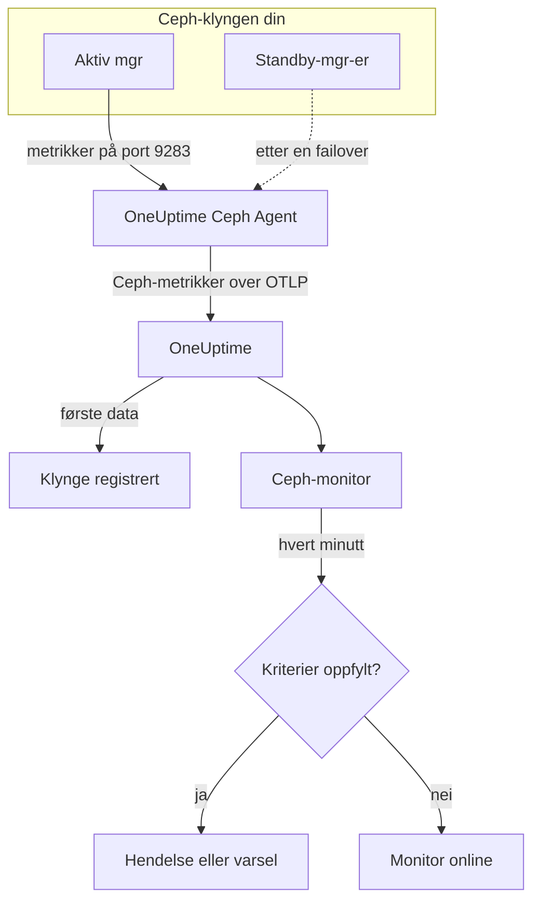

# Ceph-overvåking

En Ceph-monitor følger med på én Ceph-klynge — helsen, health checks, monitorenes quorum, OSD-er, pooler og placement groups — og gir deg beskjed i det øyeblikket helsen blir dårligere, en OSD går ned eller kapasiteten blir knapp. Den leser `ceph_*`-metrikkene som Ceph-mgr-ens `prometheus`-modul eksporterer, og som OneUptime Ceph Agent samler inn, så ingenting blir sjekket utenfra.

:::cards
- [Opprett monitoren](#opprett-en-ceph-monitor): Seks steg i dashbordet.
- [Maler](#ferdige-varselmaler): 23 ferdige varsler for helse, OSD-er, placement groups og kapasitet.
- [Health checks](#serier-for-health-checks): Varsle på et hvilket som helst Ceph-health check etter navn.
- [Metrikker](#innsamlede-metrikker): Hver `ceph_*`-serie monitoren kan varsle på.
:::

## Slik fungerer det

Ceph-mgr-ens `prometheus`-modul gjør klyngens metrikker tilgjengelige på port 9283. OneUptime Ceph Agent henter fra hver mgr-daemon hvert 30. sekund — den aktive svarer, standby-ene returnerer ingenting før de tar over —, beholder Cephs egne etiketter (`ceph_daemon`, `pool_id`) og sender metrikkene til OneUptime over OTLP, merket med klyngens navn, `ceph.cluster.name`. De første dataene registrerer klyngen.

En Ceph-monitor hører til én klynge. Hvert minutt kjører den spørringen sin mot den klyngens metrikker og sammenligner resultatet med kriteriene sine.



## Før du begynner

- **Aktiver mgr-ens `prometheus`-modul** på klyngen:

  ```bash
  ceph mgr module enable prometheus
  ```

- **Installer Ceph Agent** på en maskin som når hver mgr-daemon på port 9283, og før opp alle i `CEPH_MGR_ENDPOINTS`. [Veiledningen for Ceph Agent](/docs/telemetry/ceph) beskriver installasjonen.
- **Sjekk at klyngen er registrert.** Den vises under **Produkter → Infrastruktur → Ceph → Alle klynger**, med navnet fra agentens `CEPH_CLUSTER_NAME`, omtrent ett minutt etter første innhenting.
- **For varsler på health checks** må du kjøre Ceph Quincy eller nyere. Eldre versjoner eksporterer ikke `ceph_health_detail`.

## Opprett en Ceph-monitor

:::steps
### Start en ny monitor

Gå til **Monitorer** og klikk på **Opprett monitor**.

### Velg Ceph

Klikk på **Flere monitortyper** under **Monitortype** og velg **Ceph** under **Infrastruktur**, eller skriv `ceph` i søkefeltet. Skriv inn et **Navn** — det brukes i titlene på hendelser og varsler — og klikk på **Neste**.

### Velg klyngen

Velg klyngen i **Ceph Cluster** under **Ceph Monitor Configuration**. Alle klynger som har sendt data, står i listen.

### Velg hva som skal overvåkes

Velg én av de tre fanene:

- **Quick Setup** — klikk på en [mal](#ferdige-varselmaler). Den setter metrikker, filtre, aggregering, tidsintervall og terskler, og erstatter kriteriene nedenfor med sine egne. Du kan fortsatt endre **Tidsintervall**.
- **Custom Metric** — velg én metrikk i **Ceph Metric**, og angi deretter **Aggregering** og **Tidsintervall**. **OSD** og **Pool ID** snevrer den inn til én daemon eller pool.
- **Avansert** — bygg spørringer og formler selv under **Velg målinger**, for eksempel et forhold for brukt kapasitet fra `ceph_cluster_total_used_bytes / ceph_cluster_total_bytes`. Bruk **Group by** `ceph_daemon` eller `pool_id` for å vurdere hver daemon eller pool for seg.

### Sjekk kriteriene

Åpne hvert kriterium under **Monitorkriterier** og sjekk **Metrikk**, **Aggregering**, **Betingelse** og **Threshold**. En mal fyller dem ut. Med **Custom Metric** eller **Avansert** starter monitoren med [standardkriteriene](#standardkriterier), som bare legger merke til at en metrikk faller til null, så sett din egen terskel.

### Opprett monitoren

Klikk på **Opprett monitor**. OneUptime åpner monitorens side og evaluerer den hvert minutt. Hendelser og varsler den oppretter, vises også på klyngens sider **Hendelser** og **Varsler**.
:::

> [!TIP]
> For å sette opp flere maler på én gang åpner du klyngen fra **Produkter → Infrastruktur → Ceph** og går til **Recommendations**. Velg malene du vil ha og hvem som skal varsles, så oppretter OneUptime én monitor per mal.

## Monitorinnstillinger

| Felt | Fane | Hva det gjør |
| --- | --- | --- |
| **Ceph Cluster** | Alle | Påkrevd. Begrenser hver spørring til `resource.ceph.cluster.name`. |
| **OSD** | Custom Metric, Avansert | Valgfritt. Eksakt treff på etiketten `ceph_daemon`, for eksempel `osd.3`. |
| **Pool ID** | Custom Metric, Avansert | Valgfritt. Eksakt treff på etiketten `pool_id`, for eksempel `2`. |
| **Ceph Metric** | Custom Metric | Én metrikk fra [katalogen](#innsamlede-metrikker). |
| **Aggregering** | Custom Metric | Hvordan målinger slås sammen: **Gjennomsnitt**, **Maksimum**, **Minimum**, **Sum** eller **Antall**. Starter med metrikkens vanlige aggregering. |
| **Tidsintervall** | Alle | Det glidende vinduet spørringen leser, fra **Past 1 Minute** til **Past 365 Days**. En ny monitor starter på **Past 1 Minute**; maler setter sitt eget. |
| **Velg målinger** | Avansert | Spørringsbyggeren: **Metrikk**, **Aggregate by**, **Filter by attributes**, **Group by**, pluss **Legg til metrikk** og **Legg til formel** for å kombinere spørringer. |

Pooldataserier har bare etiketten `pool_id`: Poolens navn finnes bare på `ceph_pool_metadata`. Filtrer og grupper poolserier etter `pool_id`, og slå opp navnet i `ceph_pool_metadata` når du trenger det.

### Serier for health checks

`ceph_health_detail` eksporterer **én serie per aktivt health check**, med etikettene `name` (for eksempel `OSD_NEARFULL` eller `RECENT_CRASH`) og `severity`. En serie finnes bare mens checken utløses, så ingen serie betyr frisk. For å varsle på et hvilket som helst Ceph-health check filtrerer du på `name`, utløser på **Maksimum** over `0` og gjenoppretter ved `0` med **Hvis ingen data** satt til **Treat As Zero** — akkurat slik malene for health checks er bygget. `ceph_daemon_health_metrics` fungerer på samme måte per daemon, med en `type`-etikett (for eksempel `SLOW_OPS`) og `ceph_daemon`.

## Ferdige varselmaler

**Quick Setup** tilbyr 23 maler som dekker klyngens helse, OSD-er, placement groups og kapasitet. Hver bygger en komplett monitor — spørringer, etikettfiltre, en gruppering, et kriterium som utløses og et som gjenoppretter. Tersklene er startpunkter du kan endre.

Maler leser de siste 5 minuttene med mindre tabellen sier noe annet. Et kriterium utløses bare når betingelsen gjelder i hvert minutt av vinduet, og et terskelkriterium gjenoppretter først 10 % forbi terskelen, slik at en verdi som svinger rundt grensen, ikke flagrer. **Alvorlighetsgrad** er etiketten velgeren viser; hendelsen og varselet en mal oppretter, starter på prosjektets høyeste alvorlighetsgrad for hendelser og varsler.

### Maler for klyngens helse

| Mal | Alvorlighetsgrad | Overvåker | Utløses når | Gjenoppretter når |
| --- | --- | --- | --- | --- |
| Cluster Health Error | Kritisk | `ceph_health_status`, Max, siste minutt | 2 eller mer: `HEALTH_ERR` | Under 1,8: `HEALTH_WARN` eller bedre |
| Cluster Health Warning | Warning | `ceph_health_status`, Max | 1 eller mer: `HEALTH_WARN` eller verre | Under 0,9: `HEALTH_OK` |
| Monitor Quorum Degraded | Kritisk | `ceph_mon_quorum_status`, Min per `ceph_daemon`, siste minutt | En monitor faller under 1, ute av quorum. Én hendelse per monitor | Tilbake på 1 |
| Slow Operations | Warning | `ceph_healthcheck_slow_ops`, Max | Over 0: Klyngens `SLOW_OPS`-check er aktiv | På 0 |
| Daemon Slow Operations | Warning | `ceph_daemon_health_metrics` for `type = SLOW_OPS`, Max per `ceph_daemon` | Over 0. Én hendelse per OSD eller monitor | Serien forsvinner |
| Daemon Crash | Kritisk | `ceph_health_detail` for `name = RECENT_CRASH`, Max | Checken er aktiv: Det finnes ikke-arkiverte daemonkrasj. Mgr-en har ingen `ceph_crash_*`-metrikk, så dette er det eneste krasjsignalet | Krasjene arkiveres |
| Monitor Clock Skew | Warning | `ceph_health_detail` for `name = MON_CLOCK_SKEW`, Max | Checken er aktiv: Monitorenes klokker avviker mer enn tillatt (standard 0,05 s) | Checken forsvinner |
| Monitor Disk Critically Low | Kritisk | `ceph_health_detail` for `name = MON_DISK_CRIT`, Max | Checken er aktiv: Databasedisken til en monitor har under 5 % ledig (standard) | Checken forsvinner |
| Monitor Disk Space Low | Warning | `ceph_health_detail` for `name = MON_DISK_LOW`, Max | Checken er aktiv: under 30 % ledig (standard) | Checken forsvinner |

### OSD-maler

| Mal | Alvorlighetsgrad | Overvåker | Utløses når | Gjenoppretter når |
| --- | --- | --- | --- | --- |
| OSD Down | Kritisk | `ceph_osd_up`, Min per `ceph_daemon` | En OSD faller under 1. Én hendelse per OSD | Tilbake på 1 |
| OSD Out | Warning | `ceph_osd_in`, Min per `ceph_daemon` | En OSD faller under 1: tatt ut av datafordelingen | Tilbake på 1 |
| OSD High Latency | Warning | `ceph_osd_apply_latency_ms`, Avg per `ceph_daemon` | Over 100 ms. Én hendelse per OSD | På eller under 90 ms |
| OSD Slow Heartbeats | Warning | `ceph_health_detail` for `name = OSD_SLOW_PING_TIME_FRONT` og `name = OSD_SLOW_PING_TIME_BACK`, Max | En av checkene er aktiv: Heartbeats på det offentlige nettet eller klyngenettet er trege. Mgr-en eksporterer ingen måling av pingtid | Begge checkene forsvinner |

### Maler for placement groups

| Mal | Alvorlighetsgrad | Overvåker | Utløses når | Gjenoppretter når |
| --- | --- | --- | --- | --- |
| Inactive Placement Groups | Kritisk | `ceph_pg_total` − `ceph_pg_active`, Max per `pool_id` | Over 0: PG-er kan ikke betjene I/O, så klientforespørsler til dem henger. Én hendelse per pool | På 0 |
| Degraded Placement Groups | Warning | `ceph_pg_degraded`, Max per `pool_id` | Over 0: Objekter har færre replikaer enn konfigurert | På 0 |
| Undersized Placement Groups | Warning | `ceph_pg_undersized`, Max per `pool_id` | Over 0: PG-er ligger på færre OSD-er enn antallet replikaer | På 0 |
| Damaged Placement Groups | Kritisk | `ceph_health_detail` for `name = PG_DAMAGED` og `name = OSD_SCRUB_ERRORS`, Max | En av checkene er aktiv: Scrubbing har funnet skader eller lesefeil | Begge checkene forsvinner |

### Kapasitetsmaler

| Mal | Alvorlighetsgrad | Overvåker | Utløses når | Gjenoppretter når |
| --- | --- | --- | --- | --- |
| Cluster Near Full | Warning | `ceph_cluster_total_used_bytes` ÷ `ceph_cluster_total_bytes` × 100 | Over 85 %, Cephs standard nearfull-forhold | På eller under 76,5 % |
| Cluster Full | Kritisk | Samme forhold | Over 95 %, Cephs standard full-forhold, der skriving stopper i hele klyngen | På eller under 85,5 % |
| Pool Near Full | Warning | `ceph_pool_stored` ÷ (`ceph_pool_stored` + `ceph_pool_max_avail`) × 100, per `pool_id` | Over 85 % av det poolen kan romme. Én hendelse per pool | På eller under 76,5 % |
| OSD Nearfull | Warning | `ceph_health_detail` for `name = OSD_NEARFULL`, Max | Checken er aktiv: En OSD har passert nearfull-terskelen (standard 85 %). Enkelt-OSD-er fylles lenge før klyngens gjennomsnitt | Checken forsvinner |
| OSD Backfillfull | Warning | `ceph_health_detail` for `name = OSD_BACKFILLFULL`, Max | Checken er aktiv: Backfill til OSD-en avvises (standard 90 %), og gjenopprettingen stopper opp | Checken forsvinner |
| OSD Full | Kritisk | `ceph_health_detail` for `name = OSD_FULL`, Max, siste minutt | Checken er aktiv: En OSD har nådd full-terskelen (standard 95 %), og skriving avvises | Checken forsvinner |

- **Maler for nedetid og quorum bruker minimum**, slik at én OSD som er nede eller én monitor utenfor quorum utløser dem i stedet for å skjules av det friske flertallet.
- **Telle- og health check-maler bruker maksimum**, slik at én dårlig innhenting er nok.
- **PG- og poolserier er per pool**: Det finnes ingen måling for hele klyngen, så disse malene grupperer etter `pool_id` og åpner én hendelse per pool.
- **Kapasitetsforhold** tar **Sum** av begge sider. Begge kommer fra samme innhenting fra mgr-en, så resultatet er en ekte prosentandel. **Inactive Placement Groups** bruker i stedet **Maksimum** per pool, fordi en sum ville lagt sammen innhentingene i en subtraksjon.
- **Health check-maler** gjenoppretter når checken forsvinner: Gjenopprettingskriteriene deres teller en manglende serie som 0.

Noen varsler har ingen mal. Skjevfordelte PG-er krever statistikk på tvers av serier som kriterier ikke kan beregne. Kapasitetsprognoser krever en vekstkurve, som klyngens dashbord tegner i stedet. Forutsigelse av diskfeil og forsinket scrubbing har ingen mgr-metrikk, og NVMe-oF, RBD-speiling og cephadm krever andre eksportører.

## Innsamlede metrikker

Agenten henter fra hver mgr-daemon hvert 30. sekund og beholder Cephs egne etiketter, så serier per daemon har `ceph_daemon` (`osd.3`, `mon.a`), og serier per pool har `pool_id`.

### Metrikker for klyngens helse

| Metrikk | Enhet | Beskrivelse |
| --- | --- | --- |
| `ceph_health_status` | — | Samlet helse: 0 = `HEALTH_OK`, 1 = `HEALTH_WARN`, 2 = `HEALTH_ERR`. |
| `ceph_health_detail` | antall | Én serie per **aktivt** health check, med etikettene `name` og `severity`. Bare fra Quincy. |
| `ceph_healthcheck_slow_ops` | antall | Trege OSD- og monitoroperasjoner som checken `SLOW_OPS` rapporterer. |
| `ceph_daemon_health_metrics` | antall | Helsemetrikker per daemon, med `type` (for eksempel `SLOW_OPS`) og `ceph_daemon`. |
| `ceph_mon_quorum_status` | antall | 1 når monitoren er i quorum, per `ceph_daemon` (for eksempel `mon.a`). |
| `ceph_mon_metadata` | antall | Monitorens metadata, alltid 1. Summer dem for å telle monitorer. |
| `ceph_cluster_total_bytes` | byte | Samlet rå kapasitet. |
| `ceph_cluster_total_used_bytes` | byte | Rå kapasitet i bruk. |

### OSD-metrikker

| Metrikk | Enhet | Beskrivelse |
| --- | --- | --- |
| `ceph_osd_up` | antall | 1 når OSD-en kjører, per `ceph_daemon` (for eksempel `osd.3`). |
| `ceph_osd_in` | antall | 1 når OSD-en er med i datafordelingen. |
| `ceph_osd_apply_latency_ms` | ms | Tid for å bruke en operasjon på den underliggende lagringen. |
| `ceph_osd_commit_latency_ms` | ms | Tid for å lagre en operasjon i journalen eller WAL. |
| `ceph_osd_stat_bytes` | byte | Rå kapasitet for OSD-ens enhet. |
| `ceph_osd_stat_bytes_used` | byte | Rå byte brukt på OSD-en. Sammenlign med totalen for å finne skjevt fylte eller nesten fulle OSD-er. |
| `ceph_osd_numpg` | antall | Placement groups på OSD-en. |
| `ceph_osd_metadata` | antall | OSD-ens metadata (vertsnavn, enhetsklasse, versjon), alltid 1. Summer dem for å telle OSD-er. |

### Poolmetrikker

| Metrikk | Enhet | Beskrivelse |
| --- | --- | --- |
| `ceph_pool_stored` | byte | Brukerdata lagret i poolen. |
| `ceph_pool_max_avail` | byte | Byte som fortsatt kan skrives til poolen, gitt replikerings- eller erasure coding-profilen. |
| `ceph_pool_objects` | antall | Objekter i poolen. |
| `ceph_pool_rd` | ops | Leseoperasjoner på poolen. En teller over hele levetiden. |
| `ceph_pool_wr` | ops | Skriveoperasjoner på poolen. En teller over hele levetiden. |
| `ceph_pool_rd_bytes` | byte | Byte lest fra poolen. En teller over hele levetiden. |
| `ceph_pool_wr_bytes` | byte | Byte skrevet til poolen. En teller over hele levetiden. |
| `ceph_pool_metadata` | antall | Poolens metadata, alltid 1 — den eneste serien som kobler `pool_id` til et navn. |

### Metrikker for placement groups

Hver `ceph_pg_*`-serie er per pool, med etiketten `pool_id`; summer på tvers av pooler for et tall for hele klyngen.

| Metrikk | Enhet | Beskrivelse |
| --- | --- | --- |
| `ceph_pg_total` | antall | Placement groups i poolen. |
| `ceph_pg_active` | antall | PG-er i tilstanden `active`, som kan betjene I/O. |
| `ceph_pg_clean` | antall | PG-er i tilstanden `clean`, fullt replikert. |
| `ceph_pg_degraded` | antall | PG-er i tilstanden `degraded`. |
| `ceph_pg_undersized` | antall | PG-er i tilstanden `undersized`. |
| `ceph_num_objects_degraded` | antall | Objekter med færre replikaer enn konfigurert. |
| `ceph_num_objects_misplaced` | antall | Objekter som ikke ligger der CRUSH vil ha dem. Dataene er trygge; bare plasseringen er feil. |

## Overvåkingskriterier

Et kriterium sammenligner en av monitorens spørringer eller formler med en terskel. Kriteriene til en Ceph-monitor har ingen **Filtertype**: Hver regel sjekker metrikkverdien, med disse feltene.

| Felt | Hva det gjør |
| --- | --- |
| **Metrikk** | Spørringen eller formelen som sjekkes, etter variabelnavnet. |
| **Aggregering** | Hvordan verdiene i vinduet blir til ett svar: **Gjennomsnitt**, **Sum**, **Maximum Value**, **Minimum Value**, **All Values** (hver verdi må stemme) eller **Any Value** (én er nok). |
| **Betingelse** | **Greater Than**, **Less Than**, **Greater Than Or Equal To**, **Less Than Or Equal To** eller **Equal To** — eller en anomalibetingelse: **Anomalously High**, **Anomalously Low** eller **Anomalous**. |
| **Threshold** | Verdien det sammenlignes med. Ved siden av står en enhetsliste når metrikken har en enhet. Vises ikke for anomalibetingelser. |
| **Følsomhet** | Bare for anomalibetingelser. **Low** (4σ), **Medium** (3σ, standard) eller **High** (2σ). |
| **Grunnlinjevindu** | Bare for anomalibetingelser. 14 dager (standard), 28, 60 eller 90 dager historikk. |
| **Hvis ingen data** | Under **Flere felt**. Hva som skjer når vinduet ikke har målinger: **Ignore** (standard), **Treat As Zero** eller **Trigger**. |

Anomalibetingelser sammenligner hver verdi med samme time i uken i grunnlinjen. De blir værende i tilstanden "Learning" og varsler ikke før grunnlinjevinduet har nok historikk.

Hvert kriterium sier også hva som skal skje når det treffer: endre monitorstatusen, opprette et varsel eller erklære en hendelse. Kriteriene sjekkes ovenfra og ned, og det første som treffer, avgjør.

### Standardkriterier

En monitor du ikke bygger fra en mal, starter med to kriterier:

| Rekkefølge | Kriterium | Treffer når | Deretter |
| --- | --- | --- | --- |
| 1 | Check if _monitornavn_ is offline | En verdi i den første spørringen er `0` | Setter monitoren til **Frakoblet** og erklærer hendelsen "_monitornavn_ is offline", som løser seg selv når monitoren kommer seg. |
| 2 | Check if _monitornavn_ is online | En verdi er over `0` | Setter monitoren til **I drift**. |

Disse standardene passer for få Ceph-metrikker: `ceph_health_status` er 0 når klyngen er frisk. Velg en mal, eller sett dine egne kriterier.

> [!IMPORTANT]
> Stillhet treffer ingen av kriteriene: En klynge som slutter å sende data, lar monitoren stå som den var. For å få beskjed når data stopper, setter du **Hvis ingen data** til **Trigger** på et kriterium.

## Feilsøking

:::details Klyngen står ikke i listen Ceph Cluster
Klynger registrerer seg selv ut fra agentens data. Sjekk at agenten kjører og sender data (se [veiledningen for Ceph Agent](/docs/telemetry/ceph)), og at `CEPH_CLUSTER_NAME` er satt.
:::

:::details Metrikkene stoppet etter en mgr-failover
Agenten må hente fra **hver** mgr-daemon, ikke bare den aktive: Standby-er returnerer ingenting før de tar over. Før opp hver mgr i `CEPH_MGR_ENDPOINTS`.
:::

:::details ceph_health_status er 1, men ingenting utløses
Sjekk at kriteriet bruker **Greater Than Or Equal To** `1` og ikke **Greater Than**, og at monitorens **Tidsintervall** dekker minst én innhenting på 30 sekunder.
:::

:::details Health check-maler utløses aldri
Malene som overvåker `ceph_health_detail` — Daemon Crash, Monitor Clock Skew, OSD Nearfull, OSD Backfillfull, OSD Full, de to malene for monitordisker, Damaged Placement Groups og OSD Slow Heartbeats — trenger mgr-ens `prometheus`-modul fra Quincy eller nyere. Bekreft mens en check er aktiv at serien finnes:

```bash
curl http://ACTIVE_MGR:9283/metrics | grep ceph_health_detail
```

Serier for health checks, også `ceph_daemon_health_metrics`, finnes bare mens en check utløses, så det er forventet å ikke finne noen mens klyngen er frisk.
:::

:::details Tellere som ceph_pool_wr_bytes bare vokser
Poolenes I/O-serier er tellere over hele levetiden, og kriterier sammenligner råverdier: Det finnes ingen rate-operator, og **Convert to per-second rate** i spørringsbyggeren endrer bare diagrammet. Vis dem som rate, eller varsle på veksten deres med en formel, for eksempel en **Maksimum**-spørring minus en **Minimum**-spørring av samme teller.
:::

## Neste steg

:::cards
- [Ceph Agent](/docs/telemetry/ceph): Installer og oppgrader agenten denne monitoren leser.
- [Proxmox-overvåking](/docs/monitor/proxmox-monitor): Overvåk Proxmox VE-klyngen som bruker lagringen.
- [Lagringsmatrise-overvåking](/docs/monitor/storage-array-monitor): Samme type monitor for Pure Storage-matriser.
- [Hendelser](/docs/incidents/index): Hva som skjer etter at et kriterium har erklært en hendelse.
:::
