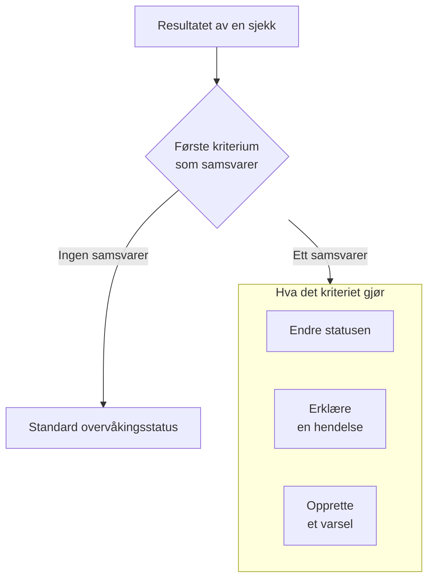

# Opprett en monitor

En monitor sjekker noe du drifter, som et nettsted, et API, en vert eller en Kubernetes-klynge, og gir deg beskjed når det slutter å virke. **Opprett monitor** spør først hva som skal overvåkes, så hva som skal sjekkes, og deretter hvor ofte. Alt unntatt typen, navnet og hva som skal sjekkes, starter med standardverdier som passer for de fleste monitorer.

> [!NOTE]
> For å opprette en monitor trenger du rollen Project Owner, Project Admin, Project Member, Monitor Admin eller Monitor Member, eller en egendefinert rolle med tillatelsen Create Monitor.

## Overvåkingsinfo

Første trinn spør hva som skal overvåkes, og hva monitoren skal hete.

:::steps
### Åpne Opprett monitor

Gå til **Monitorer**, og klikk på **Opprett monitor**. Skjemaet åpner på første trinn, **Overvåkingsinfo**.

### Velg monitortypen

Det første spørsmålet er **Monitortype**: hva vil du overvåke?

- De seks typene folk oppretter oftest, kommer først: **Nettsted**, **API**, **Ping**, **Port**, **SSL Certificate** og **Incoming Request**, for heartbeats fra cron-jobber og webhooks.
- **Flere monitortyper** viser alle andre typer under kategorien sin, som **Infrastruktur** (Kubernetes, Docker, vert) og **Telemetri** (logger, målinger, spor). **Manual**, en monitor der du selv setter statusen, ligger under **Annet**.
- Eller skriv i søkefeltet. Det kjenner ordene du allerede bruker, som `k8s`, `postgres`, `heartbeat` eller `tls`, og **Enter** velger det første treffet.

Den valgte typen krymper til én linje. Klikk på **Endre** for å velge en annen; trykk på **Escape** mens du velger for å beholde typen du hadde.

### Gi monitoren et navn

Fyll ut **Navn**. Det brukes i varsler og i titlene på hendelser. **Beskrivelse** og **Etiketter** er valgfrie og venter under **Flere felt**.

En **Manual**-monitor trenger ikke noe mer, så **Opprett monitor** ligger på dette trinnet. For alle andre typer klikker du på **Neste**.
:::

## Kriterier

Andre trinn spør hva som skal sjekkes, og avgjør hva som regnes som et problem.

:::steps
### Angi hva som skal sjekkes

Dette trinnet åpner på det som skal sjekkes. For et nettsted er det URL-en, med et eksempel i feltet; andre typer ber om en vert, en spørring, en klynge eller et loggfilter. Innstillinger de fleste monitorer aldri endrer, som tidsavbrudd og nye forsøk, er brettet sammen under **Flere felt**.

For en monitor som sonder sjekker, kjører **Test monitor** sjekken én gang før du lagrer: velg en sonde under **Velg sonde**, og klikk på **Kjør test**. Svaret åpner i **Resultat av overvåkingstest**.

### Gå gjennom kriteriene

Nedenfor avgjør **Monitorkriterier** når monitoren endrer status, erklærer en hendelse eller oppretter et varsel. En ny monitor starter med kriterier som passer for de fleste monitorer, hvert brettet sammen til én linje som sier hva det sjekker og hva det gjør. En ny nettstedsmonitor blir for eksempel merket som frakoblet og erklærer en hendelse når nettstedet ikke svarer eller svarer med en feilstatuskode.

Klikk på et kriterium for å åpne og endre det. **Legg til kriterier** legger til ett, åpent og klart til å fylles ut. For å endre rekkefølgen drar du et kriterium i håndtaket til venstre for det.

### Gå til neste trinn

Klikk på **Neste**. Ingenting på dette trinnet merkes som manglende før du klikker på **Neste**.
:::

### Slik evalueres kriterier

Resultatet av hver sjekk går gjennom kriteriene fra topp til bunn, og det første som samsvarer, avgjør hva som skjer. Det kriteriet kan endre monitorens status, erklære en hendelse, opprette et varsel eller en hvilken som helst kombinasjon av de tre. Når ingenting samsvarer, viser monitoren sin **Standard overvåkingsstatus**, som settes under **Flere felt** under kriteriene (**I drift**, med mindre du velger en annen).

Hendelser og varsler som er satt til å løses automatisk, slik standardkriterienes er, løser seg selv så snart kriteriet deres ikke lenger samsvarer. En monitor som sjekkes av mer enn én sonde, endres bare når sondene er enige: som standard må hver sonde som er slått på og tilkoblet, komme til samme resultat. For å kreve færre setter du **Sondeenighet** på monitorens side **Konfigurasjon → Sonder og intervall**.

## Sonder og intervall

Monitorer som sonder sjekker, avsluttes med dette trinnet: Nettsted, API, Ping, IP, Port, SSL Certificate, DNS, DNSSEC, NTP, Domene, SQL Query, Database Health, Synthetic Monitor, Custom JavaScript Code og External Status Page. **Sonder** er maskinene som kjører sjekkene, og prosjektets standardsonder er valgt fra start. **Overvåkingsintervall** starter på **Hvert 5. minutt**.

:::steps
### Velg sondene

Behold de valgte **Sonder**, eller velg andre. En monitor uten sonder blir aldri sjekket. For å sjekke noe på et privat nettverk kjører du en [egendefinert sonde](/docs/probe/custom-probe) i det nettverket og velger den her.

### Velg hvor ofte det skal sjekkes

Velg et **Overvåkingsintervall**, fra **Hvert minutt** til **Hver uke**. Monitorer av typen Synthetic Monitor, Custom JavaScript Code og SSL Certificate får tilbud om intervaller på 5 minutter eller mer.

### Opprett monitoren

Klikk på **Opprett monitor**. Siden til den nye monitoren åpner. For å endre sondene eller intervallet senere åpner du **Konfigurasjon → Sonder og intervall** på den siden.
:::

Alle andre typer unntatt Manual opprettes fra trinnet **Kriterier**.

## Start fra en mal eller en lenke

En monitormal, og lenkene som oppretter en monitor andre steder i OneUptime (på et metrikkdiagram, en nettverksenhet eller en deteksjonsregel), åpner **Opprett monitor** med typen valgt og resten fylt ut. Klikk på **Endre** for å velge en annen type. Skjemaet til en mal bruker den samme typevelgeren: se [Monitormaler](/docs/monitor/monitor-templates).

Hver monitortype har sin egen side med innstillingene sine, standardkriteriene og eksempler. Gode steder å gå videre:

:::cards
- [Nettsted-overvåking](/docs/monitor/website-monitor): Sjekk at en side lastes, og hva den svarer.
- [API-overvåking](/docs/monitor/api-monitor): Kall et endepunkt med en metode, hoder og en brødtekst.
- [Monitormaler](/docs/monitor/monitor-templates): Opprett mange monitorer fra én konfigurasjon, og hold dem like.
- [Hendelser](/docs/incidents/index): Hva som skjer etter at en monitor har erklært en hendelse.
:::
