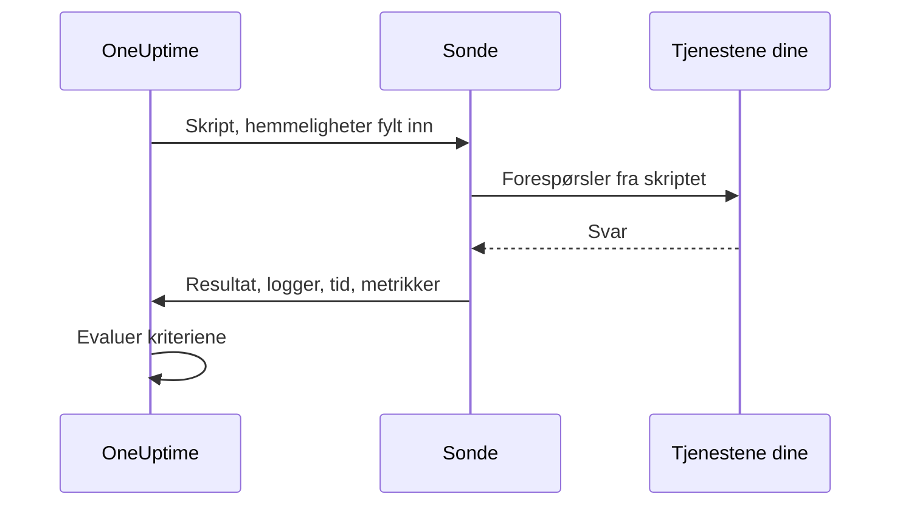

# Egendefinert kode-overvåking

En monitor med egendefinert kode kjører et JavaScript-skript du skriver selv, fra en sonde, etter en tidsplan. Bruk den til kontroller som de andre monitortypene ikke kan uttrykke — en pålogging etterfulgt av et autentisert API-kall, en transaksjon i flere trinn eller en verdi du regner ut fra flere svar. Hvis skriptet kaster en feil, mislykkes kontrollen; det skriptet returnerer, er tilgjengelig for kriteriene og hendelsesmalene dine.

:::cards
- [Opprett monitoren](#opprett-en-monitor-med-egendefinert-kode): Skriv et skript, og velg sondene som kjører det.
- [Skriv skriptet](#skriv-skriptet): En kjørbar API-kontroll i flere trinn å starte fra.
- [Bruk hemmeligheter](#bruk-av-overvåkingshemmeligheter): Hold passord og tokener utenfor skriptet.
- [Samle egendefinerte metrikker](#egendefinerte-metrikker): Vis ethvert tall skriptet ditt regner ut, i en graf.
:::

## Slik fungerer det

Ved hver kontroll kjører en sonde skriptet ditt i en isolert JavaScript-sandkasse, med overvåkingshemmelighetene dine allerede fylt inn. Skriptet kaller det det trenger, og returnerer deretter et resultat eller kaster en feil. Sonden rapporterer resultatet, skriptets loggmeldinger, hvor lenge det kjørte og metrikkene det samlet inn, og OneUptime evaluerer kriteriene dine mot dem.



Sandkassen er ikke Node.js: det finnes ingen `require`, `process`, `fetch` eller filsystem, bare [modulene som er listet nedenfor](#moduler-som-er-tilgjengelige-i-skriptet).

## Før du begynner

- En **sonde** som når alle endepunktene skriptet kaller. Bruk en [egendefinert sonde](/docs/probe/custom-probe) for endepunkter inne i nettverket ditt.
- For å kalle en privat adresse (som `10.0.0.5`) må sonden tillate det: sett `PROBE_ALLOW_PRIVATE_NETWORK_MONITORS=true` på den sonden. Loopback-, link-local- og skymetadata-adresser avvises alltid. Se [Tilgang til privat nettverk](/docs/self-hosted/private-network-access).
- Alle passord, API-nøkler og tokener skriptet trenger, lagret som [overvåkingshemmeligheter](/docs/monitor/monitor-secrets).

## Opprett en monitor med egendefinert kode

:::steps
### Start en ny monitor

Gå til **Monitorer**, og klikk på **Opprett monitor**. Under **Monitortype** klikker du på **Flere monitortyper** og velger **Custom JavaScript Code** under **Synthetic Monitoring**, eller skriver `script` i søkefeltet. Skriv inn et **Navn**, og klikk deretter på **Neste**.

### Legg til skriptet

Skriv skriptet ditt i redigeringsprogrammet **JavaScript-kode**. Start fra [eksempelet nedenfor](#skriv-skriptet).

### Test det

Klikk på **Test monitor** for å kjøre skriptet én gang fra en sonde, og sjekk resultatet.

### Gå gjennom kriteriene

Monitoren starter med to kriterier: den er frakoblet og erklærer en hendelse når skriptet mislykkes, og online når det ikke gjør det. Endre dem, eller legg til dine egne — se [Kriterier](#kriterier) — og klikk deretter på **Neste**.

### Velg sonder, og opprett

Velg **Sonder** som når endepunktene dine, og et **Overvåkingsintervall** — monitorer med egendefinert kode tilbys hvert 5. minutt eller sjeldnere — og klikk deretter på **Opprett monitor**.
:::

## Skriv skriptet

Skriptet er kroppen til en `async`-funksjon: du kan bruke `await` på øverste nivå, returnere et resultat med `return` og få kontrollen til å mislykkes med `throw`. Dette eksempelet logger på, kaller et endepunkt med tokenet det fikk tilbake, og mislykkes hvis svaret ikke er det det forventer:

```javascript title="Custom code monitor script"
// 1. Log in. axios rejects a 4xx or 5xx response, which fails the check.
const login = await axios.post("https://api.example.com/v1/login", {
  username: "monitoring@example.com",
  password: "{{monitorSecrets.ApiPassword}}",
});

// 2. Call an endpoint that needs the token.
const orders = await axios.get("https://api.example.com/v1/orders?limit=10", {
  headers: { Authorization: `Bearer ${login.data.token}` },
  timeout: 10000,
});

// 3. Fail the check when the data is wrong, not only when the request fails.
if (!Array.isArray(orders.data.items)) {
  throw new Error("The orders endpoint returned no items");
}

console.log(`Fetched ${orders.data.items.length} orders`);

// 4. Return what the criteria and incident templates should see.
return {
  data: orders.data.items.length,
};
```

| For å | Gjør dette | Hva OneUptime registrerer |
| --- | --- | --- |
| Rapportere et resultat | `return { data: ... }` med en hvilken som helst JSON-verdi | **Resultat**. Bare egenskapen `data` beholdes: `return 5` registrerer ikke noe resultat. |
| Få kontrollen til å mislykkes | `throw new Error("...")` | **Skriptfeil**, som standardkriteriene gjør om til en hendelse. |
| Legge igjen et spor | `console.log(...)` | **Loggmeldinger**, opptil 1 000 per kjøring. |

For å se en kjøring åpner du monitorens **Oversikt**: kortet **Monitor-sammendrag** viser sonden, kjøretiden og feilen, og **Vis flere detaljer** viser resultatet, skriptfeilen og loggmeldingene. **Overvåkingslogger** har det samme sammendraget for tidligere kontroller.

> [!NOTE]
> `axios` i denne sandkassen følger ikke omdirigeringer, og forespørslene går ikke gjennom en proxy som er konfigurert på sonden. Be om den endelige URL-en.

## Bruk av overvåkingshemmeligheter

Henvis til en hemmelighet som `{{monitorSecrets.NAME}}` hvor som helst i skriptet. OneUptime erstatter henvisningen med verdien til hemmeligheten, som ren tekst, før skriptet når sonden. Sett derfor en hemmelighet i anførselstegn for å bruke den som en streng, og la den stå uten anførselstegn for å bruke den som et tall eller en boolsk verdi:

```javascript
// Used as a string: wrap it in quotes.
const apiKey = "{{monitorSecrets.ApiKey}}";

// Used as a number or a boolean: leave it bare.
const retryLimit = {{monitorSecrets.RetryLimit}};
const verbose = {{monitorSecrets.Verbose}};

// Check the secret was filled in without logging the secret itself.
console.log(apiKey.length > 0);
```

En hemmelig verdi som inneholder et anførselstegn, ødelegger strengen rundt den. En henvisning som monitoren ikke kan bruke, blir stående i skriptet slik den er skrevet. Se [Overvåkingshemmeligheter](/docs/monitor/monitor-secrets) for å opprette en hemmelighet og velge hvilke monitorer som kan bruke den.

## Egendefinerte metrikker

Du kan samle inn egendefinerte metrikker fra skriptet ditt med funksjonen `oneuptime.captureMetric()`. Disse metrikkene lagres i OneUptime og kan vises i grafer på dashbord med Metric Explorer.

```javascript
oneuptime.captureMetric(name, value, attributes);
```

| Parameter | Type | Beskrivelse |
| --- | --- | --- |
| `name` | string, påkrevd | Navnet på metrikken (f.eks. `"api.response.time"`). Det lagres automatisk med prefikset `custom.monitor.`. |
| `value` | number, påkrevd | Den numeriske verdien til metrikken. En verdi som ikke er et tall, ignoreres. |
| `attributes` | object, valgfritt | Nøkkel-verdi-par med ekstra kontekst. Strenger, tall og boolske verdier registreres (tall og boolske verdier lagres som tekst, fordi metrikkattributter er dimensjoner og ikke målinger). Verdier av alle andre typer ignoreres. |

### Eksempel

```javascript
const response = await axios.get("https://api.example.com/health");

// Capture a simple metric
oneuptime.captureMetric("api.response.time", response.data.latency);

// Capture a metric with attributes
oneuptime.captureMetric("api.queue.depth", response.data.queueDepth, {
  region: "us-east-1",
  environment: "production",
});

return {
  data: response.data,
};
```

Når de er samlet inn, vises disse metrikkene i Metric Explorer under navn som `custom.monitor.api.response.time`, og på monitorens side **Målinger** under **Egendefinerte metrikker**. OneUptime legger til monitoren og sonden på hvert datapunkt, slik at du kan vise dem i grafer, varsle på dem og filtrere etter monitor, sonde eller egendefinerte attributter du har oppgitt.

### Grenser

| Grense | Verdi | Over grensen |
| --- | --- | --- |
| Metrikker per skriptkjøring | 100 | Flere kall ignoreres. |
| Lengde på metrikknavn | 200 tegn | Navnet kuttes. |
| Attributter per metrikk | 50 | Flere attributter forkastes. |
| Lengde på attributtnøkkel | 200 tegn | Nøkkelen kuttes. |
| Lengde på attributtverdi | 1000 tegn | Verdien kuttes. |

### Reserverte attributtnøkler

Noen attributtnavn tilhører OneUptime selv, og et skript kan ikke skrive dem. Hvis skriptet ditt setter et av dem, forkastes attributtet — selve metrikken registreres likevel — og en advarsel med navnet på nøkkelen skrives til serverloggene til OneUptime. Det gjelder:

- Monitorens identitet: `monitorId`, `projectId`, `monitorName`, `probeName`, `probeId`, `isCustomMetric`.
- Alt i navnerommene `oneuptime.` eller `resource.` — de bærer identifikatorene OneUptime setter på ved inntak.
- Attributter for ressursidentitet: `service.name`, `host.name`, `k8s.cluster.name`, `iot.fleet.name`, `proxmox.cluster.name`, `vmware.vcenter.name`, `ceph.cluster.name`, `storage.array.name` og `docker.swarm.cluster.name`.

Disse navnene er ikke bare etiketter — OneUptime leser dem tilbake som en påstand om hvilken ressurs et datapunkt tilhører. En metrikk merket `service.name: payments-api` ville dukke opp på fanen Målinger for den tjenesten, og hvis du senere bygde en metrikkmonitor gruppert etter `service.name`, ville varslene den gir, bli knyttet til den tjenesten, tilkalle eierne av tjenesten og tie under et vedlikeholdsvindu på den. Bruk i stedet monitorens egne etiketter for å knytte en monitor til en tjeneste eller en vert.

## Kriterier

Kriteriene til en monitor med egendefinert kode kan sjekke:

| Filtertype | Hva den sjekker | Filtervilkår |
| --- | --- | --- |
| **Feil** | Feilen skriptet kastet, hvis noen. | Inneholder, Not Contains, Equal To, Not Equal To, Is Empty, Is Not Empty |
| **Result Value** | `data` som skriptet returnerte. Sammenlignes som et tall når det er et. | De samme, pluss Greater Than, Less Than, Greater Than Or Equal To, Less Than Or Equal To, Sann og Usann |
| **Kjøretid (i ms)** | Hvor lenge skriptet kjørte. | Numeriske sammenligninger |

Standardkriteriene markerer monitoren som online når **Feil** er tom, og som frakoblet — med en hendelse som løser seg selv når skriptet lykkes igjen — når den ikke er det. I hendelses- og varslingsmaler er kjøringen tilgjengelig som `{{result}}`, `{{scriptError}}`, `{{logMessages}}` og `{{executionTimeInMs}}`: se [Hendelse- og varslingsmaler](/docs/monitor/incident-alert-templating).

### Varsling på de returnerte dataene

Det skriptet returnerer som `data`, er monitorens **Result Value**, og et kriterium kan sammenligne det — for eksempel _Result Value is Equal To `UP`_.

Når `data` er et objekt eller en matrise, fyller du inn **Feltsti (valgfritt)** på Result Value-filteret for å sammenligne ett felt i stedet for hele verdien. Bruk punktum for nestede felt og `[n]` for elementer i en matrise:

```javascript
const response = await axios.get("https://api.example.com/health");

return {
  data: {
    status: response.data.status, // "UP"
    cpu_busy_percent: response.data.cpu, // 42
    healthy: response.data.healthy, // true
    checks: response.data.checks, // [{ name: "db", latency: 12 }]
  },
};
```

| Feltsti | Sammenligner | Eksempel på vilkår |
| --- | --- | --- |
| `status` | `"UP"` | Not Equal To `UP` |
| `cpu_busy_percent` | `42` | Greater Than `90` |
| `healthy` | `true` | Usann |
| `checks[0].latency` | `12` | Greater Than `500` |

Legg til ett filter per felt du vil sjekke; hvert filter kan ha sitt eget vilkår og sin egen verdi.

- La feltstien stå tom for å sammenligne hele verdien, som for et skript som returnerer ett enkelt tall eller én enkelt streng.
- Greater Than, Less Than og de andre tallvilkårene samsvarer bare med et tall, så returner et felt som `42`, ikke `"42"`. Sann og Usann samsvarer bare med en boolsk verdi.
- Et felt som ikke finnes i de returnerte dataene — en manglende nøkkel eller en matriseindeks forbi slutten — sammenlignes som tomt: **Is Empty** samsvarer med det, og ingen andre vilkår gjør det.
- Et felt med punktum i navnet kan ikke nås med en sti.
- I Terraform setter filterets `custom_code_monitor_options` feltstien: se [Monitortrinn](/docs/terraform/monitor-steps#comparing-one-field-of-a-scripts-result).

## Moduler som er tilgjengelige i skriptet

| Navn | Hva det er |
| --- | --- |
| `axios` | En promise-basert HTTP-klient: kall `axios(...)`, eller `axios.get`, `post`, `put`, `patch`, `delete`, `head`, `options`, `request` og `create`. Størrelsen på forespørsler og svar er begrenset (10 MB hver), omdirigeringer følges ikke, og en sondes proxy brukes ikke. |
| `crypto` | `createHash` og `createHmac` (kall `update()` én gang, deretter `digest()`), `randomBytes`, `randomInt` og `randomUUID`. Det er ikke `crypto`-modulen i Node.js: det finnes ingen chiffer eller signaturer. |
| `http`, `https` | Bare klassen `Agent`, til å gi videre til `axios` — for eksempel `httpsAgent: new https.Agent({ rejectUnauthorized: false })`. Det finnes ingen `request` eller `get`. |
| `console.log` | Logger data for feilsøking. Bare `console.log` finnes; `console.error` og de andre gjør ikke det. |
| `oneuptime.captureMetric` | Samler inn en egendefinert metrikk. Se [Egendefinerte metrikker](#egendefinerte-metrikker). |
| `setTimeout`, `clearTimeout`, `sleep(ms)` | Vent inne i skriptet. En forsinkelse varer aldri lenger enn skriptets tidsavbrudd. |

## Ting å tenke på

- **Tidsavbrudd.** Et skript som kjører lenger enn 60 sekunder, stoppes, og kontrollen mislykkes med "Script execution timed out". På en selvhostet sonde endrer `PROBE_CUSTOM_CODE_MONITOR_SCRIPT_TIMEOUT_IN_MS` grensen.
- **Minne.** Hver kjøring får sin egen sandkasse med en minnegrense på 128 MB.
- **Omdirigeringer.** `axios` følger dem ikke, så en URL som omdirigerer, får forespørselen til å mislykkes. Bruk den endelige URL-en.

## Feilsøking

:::details Kontrollen mislykkes med "Script execution timed out"
Skriptet kjørte lenger enn tidsgrensen. Gi hver forespørsel sin egen `timeout` (i millisekunder), slik at et tregt endepunkt feiler raskt, med en feil som navngir det.
:::

:::details En forespørsel mislykkes med status 301 eller 302
`axios` følger ikke omdirigeringer her. Endre URL-en til adressen den omdirigerer til.
:::

:::details En forespørsel til en intern adresse avvises
Sonden tillater ikke adresser i private nettverk. Sett `PROBE_ALLOW_PRIVATE_NETWORK_MONITORS=true` på en sonde inne i nettverket ditt, og kjør monitoren fra den — se [Tilgang til privat nettverk](/docs/self-hosted/private-network-access).
:::

:::details En hemmelighet fylles ikke inn
Monitoren kan ikke bruke hemmeligheten, eller navnet i henvisningen samsvarer ikke nøyaktig med navnet på hemmeligheten. Se [Overvåkingshemmeligheter](/docs/monitor/monitor-secrets).
:::

## Neste trinn

:::cards
- [Syntetisk overvåking](/docs/monitor/synthetic-monitor): Styr en ekte nettleser i stedet for å kalle API-er.
- [Overvåkingshemmeligheter](/docs/monitor/monitor-secrets): Lagre påloggingsinformasjonen skriptet ditt bruker.
- [Hendelse- og varslingsmaler](/docs/monitor/incident-alert-templating): Sett skriptets resultat og logger inn i hendelser.
:::
