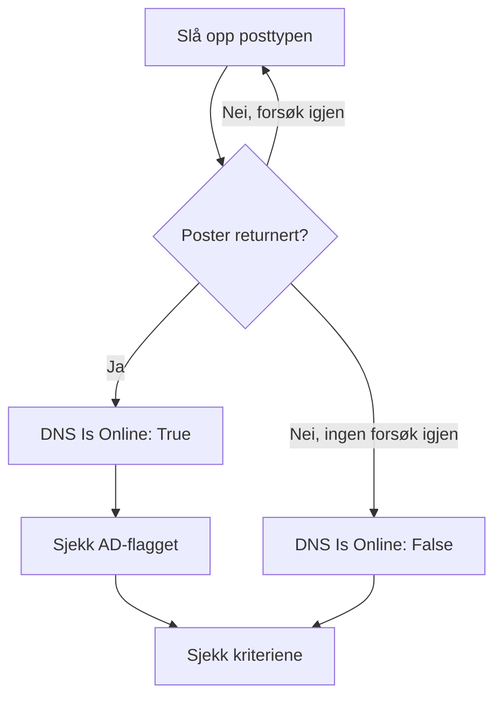

# DNS-overvåking

En DNS-monitor slår opp en DNS-post etter en tidsplan og sjekker svaret: at navnet kan slås opp, hvor raskt, og hva postene sier. Bruk den til å fange opp et DNS-brudd, en post som er endret eller forsvunnet, eller en treg løser, før brukerne merker det.

:::cards
- [Opprett monitoren](#opprett-en-dns-monitor): Seks trinn i dashbordet.
- [Konfigurasjonsalternativer](#konfigurasjonsalternativer): Navnet, posttypen og DNS-serveren.
- [Overvåkingskriterier](#overvåkingskriterier): Oppslag, poster, svartid og DNSSEC.
- [Feilsøking](#feilsøking): Når monitoren og `dig` er uenige.
:::

## Slik fungerer det

Ved hver sjekk ber en sonde en DNS-server om én posttype for ett navn, for eksempel `A`-postene for `example.com`. Navnet er tilkoblet når serveren svarer med minst én post av den typen. En spørring som feiler, får tidsavbrudd eller ikke returnerer noen post, prøves på nytt et sekund senere, opptil antallet nye forsøk du angir. Deretter spør sonden en validerende løser om svaret har DNSSECs authenticated-data-flagg (AD), og OneUptime kjører resultatet gjennom monitorens kriterier.



En sonde som har mistet sin egen nettverkstilkobling, rapporterer ikke noe resultat, så den kan ikke merke DNS-en din som frakoblet.

## Før du starter

- **En rolle som kan opprette monitorer**: Project Owner, Project Admin, Project Member, Monitor Admin eller Monitor Member, eller en egendefinert rolle med tillatelsen Create Monitor.
- **En sonde som når DNS-serveren.** Prosjektets standardsonder velges for hver nye monitor. For å spørre en DNS-server på et privat nettverk, for eksempel en intern løser, bruker du en [egendefinert sonde](/docs/probe/custom-probe) i det nettverket.

## Opprett en DNS-monitor

:::steps
### Start en ny monitor

Gå til **Monitorer**, og klikk på **Opprett monitor**. Klikk på **Flere monitortyper** under **Monitortype**, og velg **DNS** under **DNS Monitoring**.

### Gi den et navn

Angi et **Navn**, som `example.com A records`, og klikk så på **Neste**.

### Angi spørringen

Angi **Domenenavn** som skal slås opp, som `example.com`, og velg **Posttype**. For å spørre en bestemt server angir du den i **DNS-server (valgfritt)**; la feltet stå tomt for å bruke sondens egen løser.

### Test den

Klikk på **Test monitor**, velg en sonde under **Velg sonde**, og klikk på **Kjør test**. **Resultat av overvåkingstest** viser postene sonden fikk tilbake.

### Gå gjennom kriteriene

**Monitorkriterier** starter med [standardkriteriene](#standardkriterier): frakoblet når navnet ikke kan slås opp, tilkoblet når det kan. For å sjekke hva postene sier, legger du til et filter **DNS Record Value**, og klikker så på **Neste**.

### Velg sonder og opprett

Behold eller endre **Sonder** og **Overvåkingsintervall** (det starter på **Hvert 5. minutt**), og klikk så på **Opprett monitor**. Monitorens side åpnes.
:::

## Konfigurasjonsalternativer

| Felt | Standard | Hva du angir |
| --- | --- | --- |
| **Domenenavn** | Ingen | Navnet som slås opp, som `example.com` eller `_sip._tcp.example.com`. For en `PTR`-post det omvendte navnet, som `34.216.184.93.in-addr.arpa`. |
| **Posttype** | `A` | Posttypen som slås opp. Se [Posttyper](#posttyper). |
| **DNS-server (valgfritt)** | Sondens løser | En DNS-server som spørres i stedet, som `8.8.8.8` eller `ns1.example.com`. Alle posttyper, også `CAA`, spørres hos den. |
| **Port** (under **Flere felt**) | `53` | Porten til serveren i **DNS-server (valgfritt)**. DNSSEC-sjekken spør på den samme porten. |
| **Tidsavbrudd (ms)** (under **Flere felt**) | `5000` | Hvor lenge det ventes på et svar, i millisekunder. |
| **Nye forsøk** (under **Flere felt**) | `3` | Nye forsøk etter at det første forsøket har feilet. `0` betyr ett enkelt forsøk. |

### Posttyper

Et kriterium med **DNS Record Value** sammenligner teksten din med hver post slik sonden skriver den, så følg dette formatet:

| Posttype | Hva den inneholder | Verdiformat, for kriterier |
| --- | --- | --- |
| `A` | IPv4-adresser | `93.184.216.34` |
| `AAAA` | IPv6-adresser | `2606:2800:220:1:248:1893:25c8:1946` |
| `CNAME` | Navnet som dette er et alias for | `example.net` |
| `MX` | E-postservere | `10 mail.example.com` (prioritet, deretter serveren) |
| `NS` | Navneservere | `ns1.example.com` |
| `TXT` | Tekst, som SPF- og verifiseringsposter | `v=spf1 include:_spf.example.com ~all` |
| `SOA` | Sonens start of authority | `ns1.example.com hostmaster.example.com 2024010101 7200 3600 1209600 3600` (server, kontakt, serienummer, refresh, retry, expire, minimum-TTL) |
| `PTR` | Navnet en adresse peker tilbake til (omvendt DNS) | `server1.example.com` |
| `SRV` | Tjenester | `10 5 5060 sip.example.com` (prioritet, vekt, port, mål) |
| `CAA` | Sertifikatutstederne som har lov til å utstede for navnet | `0 letsencrypt.org` (flagg, deretter utstederen) |

En `TXT`-post som er delt opp i flere strenger, slås sammen til én verdi.

## Overvåkingskriterier

Kriterier avgjør når navnet regnes som tilkoblet, redusert eller frakoblet, og om det erklærer en hendelse eller oppretter et varsel. Hvert kriterium sjekker ett eller flere filtre:

| Filter | Betingelser | Hva det sjekker |
| --- | --- | --- |
| **DNS Is Online** | **Sann**, **Usann** | Om spørringen returnerte minst én post av typen. |
| **DNS Response Time (in ms)** | **Greater Than**, **Less Than**, **Greater Than Or Equal To**, **Less Than Or Equal To** | Hvor lang tid spørringen tok. |
| **DNS Record Exists** | **Sann**, **Usann** | Om det kom tilbake noen post av typen. |
| **DNS Record Value** | **Inneholder**, **Not Contains**, **Starts With**, **Ends With**, **Equal To**, **Not Equal To** | Postenes verdier. Filteret samsvarer når én enkelt post samsvarer. |
| **DNSSEC Is Valid** | **Sann**, **Usann** | Om en validerende løser setter AD-flagget på svaret. |

**DNS Record Value** samsvarer når _hvilken som helst_ av postene samsvarer. Med flere `A`-poster samsvarer **Equal To** `93.184.216.34` når én av dem er den adressen, og **Not Equal To** samsvarer når én av dem ikke er det.

**DNSSEC Is Valid** spør serveren i **DNS-server (valgfritt)**, på dens **Port**, eller Google Public DNS (`8.8.8.8`) når feltet er tomt, så serveren du angir, bør være en som validerer DNSSEC. Filteret har ingen verdi og samsvarer verken den ene eller den andre veien når sonden ikke kan kjøre den sjekken. For en full sjekk av en signert sone bruker du en [DNSSEC-monitor](/docs/monitor/dnssec-monitor).

Med to eller flere filtre avgjør **Samsvarsbetingelse** om **Alle** må samsvare, eller om **Hvilken som helst** av dem holder. Et kriteriums **Handlinger** avgjør hva det gjør: endrer monitorstatusen, oppretter et varsel, erklærer en hendelse, eller flere av disse.

### Standardkriterier

En ny DNS-monitor starter med to kriterier:

- **Frakoblet** — navnet kan ikke slås opp, eller har ingen post av typen, etter alle nye forsøk. Monitoren merkes som **Frakoblet**, og det opprettes en hendelse med navnet "_monitor name_ is offline". Hendelsen løser seg selv når navnet kan slås opp igjen.
- **Oppe** — navnet kan slås opp. Monitoren merkes som **I drift**.

Kriterier sjekkes fra topp til bunn, og det første som samsvarer, avgjør hva som skjer. Når ingen samsvarer, viser monitoren standardstatusen sin: **I drift**, med mindre du velger en annen under **Flere felt** under kriteriene.

### Evaluering over en tidsperiode

**Evaluer disse kriteriene over en tidsperiode** er en avkrysningsboks under et filter, som tilbys for **DNS Is Online** og **DNS Response Time (in ms)**. Slå den på for å vurdere et vindu av tidligere sjekker i stedet for den siste: velg en aggregering under **Evaluer** og et vindu, fra 2 til 60 minutter, under **For de siste (i minutter)**.

| Aggregering | Samsvarer når |
| --- | --- |
| **Gjennomsnitt**, **Sum**, **Maximum Value**, **Minimum Value** | Den verdien over vinduet oppfyller betingelsen. Bare **DNS Response Time (in ms)**. |
| **All Values** | Hver sjekk i vinduet oppfyller betingelsen. |
| **Any Value** | Minst én sjekk i vinduet oppfyller betingelsen. |

**All Values** samsvarer først når vinduet faktisk er dekket av data. En monitor som nettopp er opprettet, eller en der sjekkene sluttet å bli registrert, har ikke nok historikk til å si noe om de siste N minuttene, så kriteriet venter i stedet for å samsvare på den ene målingen det har. **Any Value** er innstillingen for "si fra med en gang én enkelt sjekk overskrider grensen" og utløses fortsatt umiddelbart.

**Hvis ingen data** avgjør hva som skjer så lenge vinduet ikke kan underbygge kriteriet:

| Alternativ | Hva som skjer | Bruk det til |
| --- | --- | --- |
| **Ignore** (standard) | Kriteriet samsvarer ikke. | Vanlige terskelvarsler. |
| **Trigger** | De manglende dataene regnes som problemet. | Sjekker der stillhet i seg selv er en feil. |
| **Treat As Zero** | Vinduet sammenlignes som én enkelt null. | Tellere der ingen hendelser virkelig betyr null. |

### Eksempelkriterier

| Mål | Filter | Betingelse | Verdi |
| --- | --- | --- | --- |
| Frakoblet når navnet slutter å kunne slås opp | **DNS Is Online** | **Usann** | — |
| Varsle når et navns eneste `A`-post endres | **DNS Record Value** | **Not Equal To** | `93.184.216.34` |
| Varsle når en `MX`-post peker utenfor domenet ditt | **DNS Record Value** | **Not Contains** | `example.com` |
| Merk DNS som redusert når det er tregt | **DNS Response Time (in ms)** | **Greater Than** | `500` |
| Varsle når DNSSEC-valideringen feiler | **DNSSEC Is Valid** | **Usann** | — |

## Feilsøking

:::details Monitoren sier frakoblet, men navnet kan slås opp hos meg
Sonden spurte en annen server, eller etter en annen posttype. Sjekk **Posttype**: et navn med bare en `CNAME`, eller bare `AAAA`-poster, har ingen `A`-post. Sammenlign med `dig` mot den samme serveren:

```bash
dig @8.8.8.8 example.com A
```
:::

:::details Et kriterium med Not Equal To utløses selv om riktig adresse er der
**DNS Record Value** samsvarer når én enkelt post samsvarer. Med flere poster utløses **Not Equal To** så snart én av dem avviker. For å sjekke at én bestemt verdi er blant postene, støtter du deg på rekkefølgen av kriteriene, siden det første som samsvarer, vinner:

1. Behold standardkriteriet for frakoblet øverst: **DNS Is Online** / **Usann**.
2. Under det legger du til et kriterium med **DNS Record Value** / **Equal To** / verdien du forventer, som merker monitoren som **I drift**.
3. Under det igjen legger du til et kriterium med **DNS Is Online** / **Sann**, som merker monitoren som **Frakoblet** og erklærer en hendelse. Det samsvarer bare med svar som ikke har verdien.
:::

:::details DNSSEC Is Valid samsvarer aldri
Serveren i **DNS-server (valgfritt)** validerer ikke DNSSEC og setter derfor aldri AD-flagget, eller sonden kunne ikke kjøre sjekken. La feltet stå tomt for å validere med `8.8.8.8`, eller bruk en [DNSSEC-monitor](/docs/monitor/dnssec-monitor).
:::

## Neste steg

:::cards
- [DNSSEC-overvåking](/docs/monitor/dnssec-monitor): Valider tillitskjeden til en signert sone.
- [Domene-overvåking](/docs/monitor/domain-monitor): Følg med på domenets registrering og utløp.
- [Egendefinerte probes](/docs/probe/custom-probe): Spør interne DNS-servere fra ditt eget nettverk.
- [Hendelser – Oversikt](/docs/incidents/index): Hva som skjer etter at monitoren har erklært en.
:::
