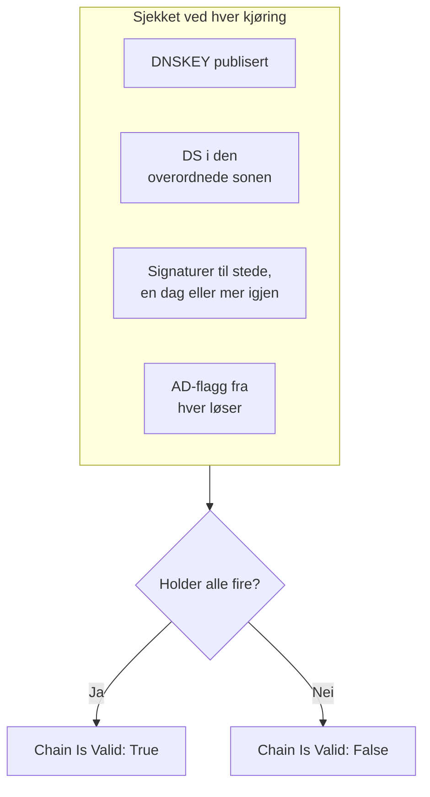

# DNSSEC-overvåking

En DNSSEC-monitor sjekker at en signert DNS-sone fortsatt validerer: at den publiserer nøklene sine, at den overordnede sonen går god for den, at signaturene ikke har utløpt, og at validerende løsere godtar den. Bruk den til å fange opp en brutt tillitskjede før løsere begynner å svare `SERVFAIL` for domenet ditt.

:::cards
- [Opprett monitoren](#opprett-en-dnssec-monitor): Seks trinn i dashbordet.
- [Hva som sjekkes](#slik-fungerer-det): Sjekkene bak en gyldig kjede.
- [Overvåkingskriterier](#overvåkingskriterier): Kjedens gyldighet, nøkler, DS-poster, signaturer, løsere og navneservere.
- [Beste praksis](#beste-praksis): Terskler og løsere som fungerer.
:::

## Slik fungerer det

Ved hver sjekk kjører en sonde et sett med DNS-spørringer mot sonen:

| Spørring | Spørres hos | Hva den forteller deg |
| --- | --- | --- |
| `DNSKEY` | Den første løseren i **Løsere** | Om sonen publiserer signeringsnøklene sine. |
| `DS` | Den første løseren i **Løsere** | Om den overordnede sonen publiserer en delegation signer-post for sonen. |
| `SOA`, med DNSSEC-poster | Den første løseren i **Løsere** | Om sonens poster er signert (den `RRSIG` som signerer `SOA`-posten), og når signaturen som utløper først, utløper. |
| `A`, med DNSSEC-validering | Hver løser i **Løsere** | Om hver validerende løser godtar sonen, noe den viser med authenticated-data-flagget (AD). |
| `NS`, deretter `SOA` | Den første løseren, deretter hver autoritative navneserver den nevner | Om hver navneserver leverer det samme SOA-serienummeret. Bare når **Sjekk navneserverkonsistens** er slått på. |

Validerende løsere sjekker tillitskjeden fra roten og nedover, så AD-flagget forteller deg at hele kjeden holder. Kjeden regnes som gyldig når alt dette holder:

En signatur med mindre enn en dag igjen regnes allerede som brutt, så du får vite om det opptil en dag før løsere begynner å avvise sonen. En sjekk som finner kjeden brutt, eller navneserverne ute av takt, kjøres på nytt et sekund senere, opptil antallet nye forsøk du angir, før OneUptime kjører resultatet gjennom monitorens kriterier. Alle spørringene i ett forsøk deler en frist på tre ganger **Tidsavbrudd (ms)**; et forsøk som går tom for tid, rapporterer et tidsavbrudd, ikke en dom over sonen.

## Før du starter

- **En rolle som kan opprette monitorer**: Project Owner, Project Admin, Project Member, Monitor Admin eller Monitor Member, eller en egendefinert rolle med tillatelsen Create Monitor.
- **En signert sone.** Sonen må være signert, og DS-posten dens publisert i den overordnede sonen via registraren din.
- **Utgående DNS fra sonden** til løserne du angir, og, for sjekken av navneserverkonsistens, til sonens autoritative navneservere. Prosjektets standardsonder velges for hver nye monitor.

## Opprett en DNSSEC-monitor

:::steps
### Start en ny monitor

Gå til **Monitorer**, og klikk på **Opprett monitor**. Klikk på **Flere monitortyper** under **Monitortype**, og velg **DNSSEC** under **DNS Monitoring**.

### Gi den et navn

Angi et **Navn**, som `example.com DNSSEC`, og klikk så på **Neste**.

### Angi sonen

Angi sonen som skal valideres, i **Sone (domenenavn)**, som `example.com`. Behold standardverdien for **Løsere**, eller angi dine egne, atskilt med komma. La **Sjekk navneserverkonsistens** være slått på, med mindre nettverket ditt blokkerer DNS til vilkårlige servere.

### Test den

Klikk på **Test monitor**, velg en sonde under **Velg sonde**, og klikk på **Kjør test**. **Resultat av overvåkingstest** viser hva hver sjekk fant.

### Gå gjennom kriteriene

**Monitorkriterier** starter med [standardkriteriene](#standardkriterier): frakoblet når kjeden er brutt, tilkoblet når den er gyldig. For å bli varslet før signaturer utløper, legger du til et kriterium (se [Beste praksis](#beste-praksis)), og klikker så på **Neste**.

### Velg sonder og opprett

Behold eller endre **Sonder** og **Overvåkingsintervall** (det starter på **Hvert 5. minutt**), og klikk så på **Opprett monitor**. Monitorens side åpnes.
:::

## Konfigurasjonsalternativer

| Felt | Standard | Hva du angir |
| --- | --- | --- |
| **Sone (domenenavn)** | Ingen | Sonen som valideres, som `example.com`. |
| **Løsere** | `1.1.1.1, 8.8.8.8, 9.9.9.9` | Validerende løsere som spørres, atskilt med komma. Hver av dem må returnere AD-flagget for at kjeden skal regnes som gyldig. |
| **Sjekk navneserverkonsistens** | På | Spør hver autoritative navneserver direkte, og sammenlign SOA-serienumrene deres. Slå det av hvis nettverket ditt blokkerer utgående DNS til vilkårlige servere. |
| **Varsel om signaturutløp (dager)** (under **Flere felt**) | `7` | Lagres med monitoren. Filteret **DNSSEC Signature Expires In Days** bruker verdien du gir det i kriteriet, så angi terskelen din der. |
| **Tidsavbrudd (ms)** (under **Flere felt**) | `10000` | Hvor lenge det ventes på hver DNS-spørring, i millisekunder. Ett forsøk kan til sammen ta opptil tre ganger så lang tid. |
| **Nye forsøk** (under **Flere felt**) | `3` | Nye forsøk etter at det første forsøket har feilet. `0` betyr ett enkelt forsøk. |

## Overvåkingskriterier

Kriterier avgjør når sonen regnes som tilkoblet, redusert eller frakoblet, og om det erklærer en hendelse eller oppretter et varsel. Hvert kriterium sjekker ett eller flere filtre:

| Filter | Betingelser | Hva det sjekker |
| --- | --- | --- |
| **DNSSEC Chain Is Valid** | **Sann**, **Usann** | Alle fire sjekkene ovenfor holder: nøkler publisert, DS i den overordnede sonen, signaturer til stede med en dag eller mer igjen, og AD-flagget fra hver løser. |
| **DNSSEC DNSKEY Record Exists** | **Sann**, **Usann** | Sonen publiserer minst én DNSKEY-post. |
| **DNSSEC DS Record Exists At Parent** | **Sann**, **Usann** | Den overordnede sonen publiserer en DS-post for sonen. |
| **DNSSEC Signature Expires In Days** | **Greater Than**, **Less Than**, **Greater Than Or Equal To**, **Less Than Or Equal To** | Hele dager til signaturen (RRSIG) som utløper først, utløper. |
| **DNSSEC Resolver Consensus (AD Flag)** | **Sann**, **Usann** | Hver løser i **Løsere** returnerer AD-flagget. |
| **DNSSEC Nameservers Are Consistent** | **Sann**, **Usann** | Hver autoritative navneserver svarer med det samme SOA-serienummeret. Alltid **Sann** så lenge **Sjekk navneserverkonsistens** er slått av. |

Med to eller flere filtre avgjør **Samsvarsbetingelse** om **Alle** må samsvare, eller om **Hvilken som helst** av dem holder. Et kriteriums **Handlinger** avgjør hva det gjør: endrer monitorstatusen, oppretter et varsel, erklærer en hendelse, eller flere av disse.

### Standardkriterier

En ny DNSSEC-monitor starter med to kriterier:

- **Kjeden er brutt** — **DNSSEC Chain Is Valid** er **Usann**. Monitoren merkes som **Frakoblet**, og det opprettes en hendelse med navnet "_monitor name_ DNSSEC chain is broken". Hendelsen løser seg selv når kjeden er gyldig igjen.
- **Kjeden er gyldig** — monitoren merkes som **I drift**.

Kriterier sjekkes fra topp til bunn, og det første som samsvarer, avgjør hva som skjer. Når ingen samsvarer, viser monitoren standardstatusen sin: **I drift**, med mindre du velger en annen under **Flere felt** under kriteriene.

Standardkriteriene følger ikke selv med på signaturutløp eller navneserverkonsistens. Legg til kriterier for dem, som nedenfor.

### Eksempelkriterier

| Mål | Filter | Betingelse | Verdi |
| --- | --- | --- | --- |
| Frakoblet når kjeden er brutt (et standardkriterium) | **DNSSEC Chain Is Valid** | **Usann** | — |
| Varsle før signaturer utløper | **DNSSEC Signature Expires In Days** | **Less Than** | `7` |
| Fang opp en delegering som har mistet DS-posten sin | **DNSSEC DS Record Exists At Parent** | **Usann** | — |
| Fang opp løsere som er uenige | **DNSSEC Resolver Consensus (AD Flag)** | **Usann** | — |
| Fang opp navneservere som er ute av takt | **DNSSEC Nameservers Are Consistent** | **Usann** | — |

## Beste praksis

1. **Velg løsere som alltid kan nås.** Hver løser må returnere AD-flagget for at kjeden skal regnes som gyldig, så en løser sonden ikke kan nå, får sjekken til å feile når de nye forsøkene er brukt opp. Standardverdiene, `1.1.1.1`, `8.8.8.8` og `9.9.9.9`, drives av tre forskjellige operatører, noe som også fanger opp en sone som validerer hos én løser, men ikke hos en annen.
2. **Bli varslet før signaturer utløper.** Signeringsprogrammer signerer en sone på nytt før signaturene går ut, så en signatur nær utløp betyr at nysigneringen har stoppet. Legg til et kriterium med **DNSSEC Signature Expires In Days** / **Less Than** / `7` som oppretter et varsel, og et til på `2` som erklærer en hendelse. Dra begge over kriteriet som merker kjeden som gyldig, med `2`-dagerskriteriet først, fordi det første kriteriet som samsvarer, vinner. Velg terskler som er lavere enn tiden signeringsprogrammet ditt vanligvis lar en signatur ha igjen før det signerer på nytt, så de holder seg stille så lenge nysigneringen fungerer.
3. **Overvåk hver signert sone.** Ta med apex-domenet, signerte underdomener og alle soner som er delegert til en annen operatør.
4. **La sjekken av navneserverkonsistens være slått på,** og legg til et kriterium for den. Den fanger opp en sekundærserver som har sluttet å hente overføringer fra primærserveren, noe DNSSEC-validering alene kan overse.

## Feilsøking

:::details Kjeden rapporteres som brutt, men sonen validerer med `dig`
En av løserne i **Løsere** returnerte ikke AD-flagget: den kunne ikke nås fra sonden, eller den validerer ikke DNSSEC. Tabellen **Resolver Checks**, i **Resultat av overvåkingstest** og i oppsummeringen av hver sjekk, viser hver løsers svar og feil. Fjern løsere sonden ikke kan nå, og angi bare validerende løsere.
:::

:::details Navneservere rapporteres som inkonsistente rett etter en endring
Sekundærservere kan henge etter primærserveren en stund etter at sonen er endret. Tabellen **Nameserver Consistency** i sjekkens oppsummering viser hver navneservers SOA-serienummer. Hvis én blir hengende etter, har den sekundærserveren sluttet å hente overføringer. Hvis hver navneserver viser en feil, kan sonden være blokkert fra å spørre dem direkte: slå av **Sjekk navneserverkonsistens**.
:::

:::details Sjekken rapporterer et tidsavbrudd
Alle spørringene i ett forsøk deler tre ganger **Tidsavbrudd (ms)**. En treg eller utilgjengelig løser bruker opp den tiden; fjern den fra **Løsere**, eller øk tidsavbruddet.
:::

## Neste steg

:::cards
- [DNS-overvåking](/docs/monitor/dns-monitor): Sjekk at et navn kan slås opp, og hva postene sier.
- [Domene-overvåking](/docs/monitor/domain-monitor): Følg med på domenets registrering og utløp.
- [SSL-sertifikat-overvåking](/docs/monitor/ssl-certificate-monitor): Følg med på sertifikatene som leveres på domenet.
- [Hendelser – Oversikt](/docs/incidents/index): Hva som skjer etter at monitoren har erklært en.
:::
