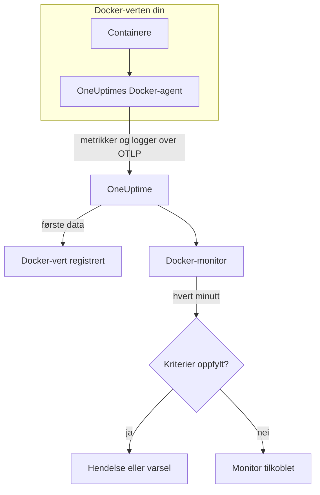

# Docker-overvåking

En Docker-monitor overvåker containerne på én Docker-vert og sier fra når en container går varm, går tom for minne eller sitter fast i en krasjløkke. Den leser metrikkene som OneUptimes Docker-agent sender fra verten, så ingenting undersøkes utenfra: installer agenten, og opprett deretter monitoren fra en mal eller din egen spørring.

:::cards
- [Opprett monitoren](#opprett-en-docker-monitor): Seks trinn i dashbordet.
- [Maler](#ferdige-varslingsmaler): Seks ferdige varsler, én hendelse per container.
- [Metrikker](#innsamlede-metrikker): Hva agenten samler inn, og hva hver metrikk betyr.
- [Logger](#innsamlede-logger): Containerlogger og loggdriveren de trenger.
:::

## Slik fungerer det

OneUptimes Docker-agent kjører som en container på verten. Hvert 30. sekund leser den containerstatistikk fra Docker Engine-API-et, følger containernes loggfiler og sender begge deler til OneUptime over OTLP. De første dataene fra en vert registrerer den i OneUptime.

En Docker-monitor er knyttet til én vert. Hvert minutt kjører den spørringen sin over vertens containermetrikker og sammenligner resultatet med kriteriene sine.



## Før du begynner

- **Installer Docker-agenten** på verten. [Veiledningen for Docker-agenten](/docs/telemetry/docker-host) dekker installasjon, oppgradering og kontroll.
- **Kontroller at verten er registrert.** Den vises under **Produkter → Infrastruktur → Docker → Alle verter**, oppkalt etter agentens `DOCKER_HOST_NAME`, så snart de første dataene kommer.
- **For containerlogger** må containerne kjøre med Dockers loggdriver `json-file`. Se [Krav til loggdriveren](#krav-til-loggdriveren).

## Opprett en Docker-monitor

:::steps
### Start en ny monitor

Gå til **Monitorer** og klikk på **Opprett monitor**.

### Velg Docker Container

Klikk på **Flere monitortyper** under **Monitortype**, og velg **Docker Container** under **Infrastruktur**, eller skriv `docker` i søkefeltet. Skriv inn et **Navn** – det brukes i titler på hendelser og varsler – og klikk på **Neste**.

### Velg verten

Velg verten i **Docker-vert** under **Docker-monitorkonfigurasjon**. Hver vert som har sendt data, står i listen.

### Velg hva som skal overvåkes

Velg en av de tre fanene:

- **Quick Setup** – klikk på en [mal](#ferdige-varslingsmaler). Den angir metrikken, aggregeringen, tidsintervallet og tersklene, og erstatter kriteriene nedenfor med sine egne. Du kan fortsatt endre **Tidsintervall**.
- **Custom Metric** – velg én metrikk i **Docker-måling**, og angi deretter **Aggregering** og **Tidsintervall**. **Containernavn** og **Container-bilde** snevrer den inn til bestemte containere.
- **Avansert** – bygg spørringer og formler selv under **Velg målinger**. Bruk **Group by** `resource.container.name` for å vurdere hver container for seg.

### Kontroller kriteriene

Åpne hvert kriterium under **Monitorkriterier** og kontroller **Metrikk**, **Aggregering**, **Betingelse** og **Threshold**. En mal fyller inn disse. Med **Custom Metric** eller **Avansert** starter monitoren med [standardkriteriene](#standardkriterier), som bare merker at en metrikk faller til null, så angi din egen terskel.

### Opprett monitoren

Klikk på **Opprett monitor**. OneUptime åpner monitorens side og evaluerer den hvert minutt. Hendelser og varsler den åpner, vises også på vertens sider **Hendelser** og **Varsler**.
:::

> [!TIP]
> For å sette opp flere maler samtidig åpner du verten fra **Produkter → Infrastruktur → Docker** og går til **Recommendations**. Velg malene du vil ha og hvem som skal varsles, så oppretter OneUptime én monitor per mal.

## Monitorinnstillinger

| Felt | Fane | Hva det gjør |
| --- | --- | --- |
| **Docker-vert** | Alle | Påkrevd. Avgrenser hver spørring til vertens `resource.host.name`. OneUptime legger også til `resource.container.runtime = docker` i hver spørring. |
| **Docker-måling** | Custom Metric | Én metrikk fra agentens katalog, gruppert som CPU, minne, nettverk, blokk-I/O og container. |
| **Containernavn** | Custom Metric, Avansert | Valgfritt. Nøyaktig samsvar med `resource.container.name`, for eksempel `my-container`. |
| **Container-bilde** | Custom Metric, Avansert | Valgfritt. Nøyaktig samsvar med `resource.container.image.name`, for eksempel `nginx:latest`. |
| **Aggregering** | Custom Metric | Hvordan målinger kombineres: **Gjennomsnitt**, **Maksimum**, **Minimum**, **Sum** eller **Antall**. Starter på metrikkens vanlige aggregering. |
| **Tidsintervall** | Alle | Det glidende vinduet spørringen leser, fra **Past 1 Minute** til **Past 365 Days**. En ny monitor starter på **Past 1 Minute**; maler angir sitt eget. |
| **Velg målinger** | Avansert | Spørringsbyggeren: **Metrikk**, **Aggregate by**, **Filter by attributes**, **Group by**, pluss **Legg til metrikk** og **Legg til formel** for å kombinere spørringer. |

## Ferdige varslingsmaler

**Quick Setup** tilbyr seks maler. Hver bygger en komplett monitor: en spørring gruppert etter `resource.container.name`, et kriterium som utløses, og et som gjenoppretter. Hver container vurderes for seg, så én travel container skjuler ikke en annen, og hver container over terskelen får sin egen hendelse og sitt eget varsel. Tersklene er utgangspunkter du kan redigere.

Med mindre tabellen sier noe annet, utløses et kriterium bare når betingelsen gjelder i hvert minutt av vinduet, og det gjenoppretter 10 % forbi terskelen, slik at en verdi som svever ved grensen, ikke blafrer.

| Mal | Alvorlighetsgrad | Overvåker | Utløses når | Gjenoppretter når |
| --- | --- | --- | --- | --- |
| High Container CPU Usage | Warning | `container.cpu.utilization`, Max per container, siste 5 minutter | Over 80 (% av én kjerne) | På eller under 72 |
| High Container Memory Usage | Warning | `container.memory.percent`, Max per container, siste 5 minutter | Over 85 % | På eller under 76,5 % |
| Container Restart Loop | Kritisk | Vekst i `container.restarts` per container, siste 15 minutter | Mer enn 3 omstarter i vinduet (Sum) | 2,7 eller færre |
| Container CPU Throttling | Warning | Vekst i `container.cpu.throttling_data.throttled_time` i ms per container, siste 5 minutter | Mer enn 1000 ms i vinduet (Sum) | 900 ms eller mindre |
| High Container Process Count | Warning | `container.pids.count`, Max per container, siste 5 minutter | Over 2000 | På eller under 1800 |
| Container Down (Low Uptime) | Kritisk | `container.uptime`, Min per container, siste 1 minutt | Lik 0 | Over 0 |

**Alvorlighetsgrad** er etiketten velgeren viser. Hendelsen og varselet en mal oppretter, starter på prosjektets mest alvorlige hendelses- og varslingsgrad; endre dem i kriteriene.

> [!NOTE]
> `container.cpu.utilization` er tallet `docker stats` skriver ut: 100 % er én hel CPU-kjerne, ikke hele verten, så en container som bruker to kjerner, viser 200. På en vert med flere kjerner er terskelen på 80 et CPU-budsjett, ikke en andel av maskinen.

> [!NOTE]
> `container.memory.percent` deler på containerens minnegrense når en er satt, og ellers på **vertens** totale minne. Kontroller om containeren ble startet med `--memory` før du behandler en overskridelse som et nært forestående drap på grunn av minnemangel.

> [!WARNING]
> `container.restarts` og `container.cpu.throttling_data.throttled_time` bare vokser, så de to malene varsler på hvor mye de vokste i vinduet: en Maksimum- og en Minimum-spørring per minutt, trukket fra hverandre av en formel og summert. Ved agentens innsamling hvert 30. sekund ser det omtrent halvparten av den faktiske aktiviteten, og tersklene tar allerede høyde for det. Hvis du øker agentens `collection_interval` til 60 sekunder eller mer, inneholder hvert minutt én måling, og begge malene slutter å varsle.

> [!CAUTION]
> **Container Down (Low Uptime)** kan ikke fange en container som stopper og forblir stoppet. Agenten rapporterer bare kjørende containere, så en stoppet container sender ingen data i det hele tatt, og oppetiden viser aldri 0. For en tjeneste som må holde seg oppe, bør du også overvåke det den leverer – for eksempel med en [API-overvåking](/docs/monitor/api-monitor).

## Innsamlede metrikker

Agenten bruker OpenTelemetry-mottakeren `docker_stats` mot Docker-socketen hvert 30. sekund. Hver containers metrikker bærer identiteten dens som ressursattributter: `resource.container.name`, `resource.container.image.name`, `resource.container.id`, `resource.container.runtime` (`docker`) og `resource.host.name`.

### CPU

| Metrikk | Beskrivelse |
| --- | --- |
| `container.cpu.utilization` | CPU-utnyttelse, der 100 % er én hel CPU-kjerne (kolonnen CPU% i `docker stats`). |
| `container.cpu.usage.total` | Brukt CPU-tid siden containeren startet, i nanosekunder. En teller over hele levetiden. |
| `container.cpu.throttling_data.throttled_time` | Nanosekunder containeren har blitt strupet av CPU-grensen sin siden den startet. En teller over hele levetiden. |
| `container.cpu.throttling_data.throttled_periods` | Struperioder siden containeren startet. En teller over hele levetiden. |

### Minne

| Metrikk | Beskrivelse |
| --- | --- |
| `container.memory.usage.total` | Minne i bruk, i byte. |
| `container.memory.usage.limit` | Minnegrense, i byte. |
| `container.memory.percent` | Minnebruk som prosentandel av containerens grense, eller av vertens totale minne når containeren ikke har noen grense. |

### Nettverk

| Metrikk | Beskrivelse |
| --- | --- |
| `container.network.io.usage.rx_bytes` | Mottatte byte. En teller over hele levetiden. |
| `container.network.io.usage.tx_bytes` | Sendte byte. En teller over hele levetiden. |

### Blokk-I/O

| Metrikk | Beskrivelse |
| --- | --- |
| `container.blockio.io_service_bytes_recursive.read` | Byte lest fra blokkenheter. |
| `container.blockio.io_service_bytes_recursive.write` | Byte skrevet til blokkenheter. |

### Container

| Metrikk | Beskrivelse |
| --- | --- |
| `container.uptime` | Sekunder siden containeren startet. Bare kjørende containere rapporterer den. |
| `container.restarts` | Antall ganger containeren har startet på nytt siden den ble opprettet. En teller over hele levetiden. |
| `container.pids.count` | Oppgaver i containeren. Cgroup-ens pids-kontroller teller tråder så vel som prosesser. |

Listen **Docker-måling** tilbyr også `container.cpu.usage.percpu`, `container.memory.rss`, `container.memory.cache` og tellerne for nettverkspakker. Den medfølgende agentkonfigurasjonen slår dem ikke på, så kontroller vertens side **Målinger** før du bygger på dem. `container.cpu.throttling_data.throttled_periods` står ikke i listen; spør etter den fra **Avansert**.

## Overvåkingskriterier

Et kriterium sammenligner en av monitorens spørringer eller formler med en terskel. Kriteriene til en Docker-monitor har ingen **Filtertype**: hver regel kontrollerer metrikkverdien, med disse feltene.

| Felt | Hva det gjør |
| --- | --- |
| **Metrikk** | Spørringen eller formelen som kontrolleres, etter variabelnavnet. |
| **Aggregering** | Hvordan verdiene i vinduet blir til ett svar: **Gjennomsnitt**, **Sum**, **Maximum Value**, **Minimum Value**, **All Values** (hver verdi må samsvare) eller **Any Value** (én er nok). |
| **Betingelse** | **Greater Than**, **Less Than**, **Greater Than Or Equal To**, **Less Than Or Equal To** eller **Equal To** – eller en avviksbetingelse: **Anomalously High**, **Anomalously Low** eller **Anomalous**. |
| **Threshold** | Verdien det sammenlignes med. En liste over enheter står ved siden av når metrikken har en enhet. Vises ikke for avviksbetingelser. |
| **Følsomhet** | Bare avviksbetingelser. **Lav** (4σ), **Middels** (3σ, standard) eller **Høy** (2σ). |
| **Grunnlinjevindu** | Bare avviksbetingelser. 14 dager (standard), 28, 60 eller 90 dager med historikk. |
| **Hvis ingen data** | Under **Flere felt**. Hva som skjer når vinduet ikke har noen målinger: **Ignore** (standard), **Treat As Zero** eller **Trigger**. |

Avviksbetingelser sammenligner hver verdi med samme time i uken i grunnlinjen. De blir værende i en «Learning»-tilstand og gir ingenting før grunnlinjevinduet inneholder nok historikk.

Hvert kriterium sier også hva som skal skje når det samsvarer: endre monitorstatusen, opprette et varsel eller erklære en hendelse. Kriterier kontrolleres ovenfra og ned, og det første som samsvarer, avgjør.

### Standardkriterier

En monitor du ikke bygger fra en mal, starter med to kriterier:

| Rekkefølge | Kriterium | Samsvarer når | Deretter |
| --- | --- | --- | --- |
| 1 | Check if _monitor name_ is offline | En hvilken som helst verdi i den første spørringen er `0` | Markerer monitoren som **Frakoblet** og erklærer hendelsen «_monitor name_ is offline», som løser seg selv når monitoren kommer seg. |
| 2 | Check if _monitor name_ is online | En hvilken som helst verdi er over `0` | Markerer monitoren som **I drift**. |

> [!IMPORTANT]
> Stillhet samsvarer med ingen av kriteriene: en vert som slutter å sende data, etterlater monitoren slik den var. For å få beskjed når data stopper, setter du **Hvis ingen data** til **Trigger** på et kriterium. Tid der OneUptime selv ikke mottok data, er aldri manglende data: en kontroll der vinduet inneholder slik tid, venter i stedet, slik [Når OneUptime ikke mottar data](/docs/monitor/when-oneuptime-is-not-receiving) forklarer.

## Innsamlede logger

Agenten følger også hver containers fil `*-json.log` og sender hver linje som en OpenTelemetry-loggpost med:

| Felt | Verdi |
| --- | --- |
| `resource.host.name` | Verten, fra `DOCKER_HOST_NAME`. |
| `resource.container.id` | Den fullstendige container-ID-en. |
| `resource.container.runtime` | Alltid `docker`. |
| `attributes["log.iostream"]` | `stdout` eller `stderr`. |
| `severityText` / `severityNumber` | Lest fra et nivånøkkelord der et nivå står i linjen (`[ERROR]`, `app.INFO:`, `{"level":"warn"}`, `level=error`). En linje uten nivå faller tilbake på strømmen sin: `stderr` er `ERROR`, `stdout` er `INFO`. |
| `body` | Linjen containeren skrev. Linjer som starter med mellomrom eller en avsluttende parentes, som linjer i en stakksporing, føyes til linjen før. |
| `time` | Docker-daemonens tidsstempel for linjen. |

Logger vises på vertens side **Logger** og på hver containers side.

### Krav til loggdriveren

Agenten kan bare lese logger fra containere som bruker Dockers loggdriver `json-file`. Det er Dockers standard, men en container eller hele daemonen kan bruke en annen:

| Driver | Hva agenten ser |
| --- | --- |
| `json-file` | Hver linje. |
| `local` | Ingenting: filen er binær, og agenten kan ikke tolke den. |
| `journald`, `syslog`, `fluentd`, `gelf`, `awslogs`, `splunk`, … | Ingenting: loggene går et annet sted, så det finnes ingen fil å følge. |
| `none` | Ingenting: loggene forkastes. |

Kontroller driveren til en container, og daemonens standard:

```bash
docker inspect <container> --format '{{.HostConfig.LogConfig.Type}}'
docker info --format '{{.LoggingDriver}}'
```

Bytt til `json-file`. Docker fastsetter en containers loggdriver når containeren opprettes, så opprett hver container på nytt etter endringen – en omstart beholder den gamle driveren.

:::tabs
@tab Docker Compose
Angi driveren på hver tjeneste, med rotasjon:

```yaml title="docker-compose.yml"
services:
  my-app:
    image: my-app:latest
    logging:
      driver: "json-file"
      options:
        max-size: "100m"
        max-file: "5"
```

Opprett deretter tjenesten på nytt:

```bash
docker compose up -d --force-recreate <service>
```
@tab Docker-daemon
Gjør `json-file` til standard for hver container som opprettes etterpå:

```json title="/etc/docker/daemon.json"
{
  "log-driver": "json-file",
  "log-opts": {
    "max-size": "100m",
    "max-file": "5"
  }
}
```

Start Docker-daemonen på nytt, og fjern og opprett deretter hver container på nytt:

```bash
docker rm -f <container>
docker run ... <image>
```
:::

## Feilsøking

:::details Verten står ikke i listen Docker-vert
Verter registrerer seg selv fra agentens data. Kontroller at agentcontaineren kjører, og at verten står under **Produkter → Infrastruktur → Docker → Alle verter**. [Veiledningen for Docker-agenten](/docs/telemetry/docker-host) har kontrollene du kan kjøre på verten.
:::

:::details Metrikker kommer, men siden Logger er tom
Containerne bruker nesten helt sikkert ikke loggdriveren `json-file`. Kontroller dem med kommandoene i [Krav til loggdriveren](#krav-til-loggdriveren), bytt driver på dem du vil ha logger fra, og opprett dem på nytt.
:::

:::details Agenten logger «no files match the configured criteria»
Agenten ser etter `/var/lib/docker/containers/*/*-json.log` og fant ingenting. Enten bruker ingen container på verten `json-file`, eller agentens montering av `/var/lib/docker/containers` (`-v /var/lib/docker/containers:/var/lib/docker/containers:ro`) mangler eller er tom, eller agenten kjører på Docker Desktop for macOS, der containerfilene ligger inne i Linux-VM-en.
:::

:::details Data kommer under feil vertsnavn
OneUptime identifiserer en vert etter `resource.host.name`, som agenten tar fra `DOCKER_HOST_NAME`. Endrer du `DOCKER_HOST_NAME` etter de første dataene, opprettes en ny vert i stedet for at den første får nytt navn, og en monitor forblir knyttet til navnet den ble opprettet med.
:::

:::details Et CPU-varsel utløses aldri
Grupper spørringen etter `resource.container.name` og aggreger med **Maksimum**, slik malen **High Container CPU Usage** gjør. Et gjennomsnitt over alle containere på en travel vert trekkes ned av de inaktive. Husk at 100 % betyr én hel kjerne, så en container som får bruke flere kjerner, trenger en høyere terskel.
:::

:::details Malen for omstartsløkker eller struping sluttet å varsle
Begge måler hvor mye en teller vokste mellom to målinger i samme minutt. Hvis agentens `collection_interval` er 60 sekunder eller mer, inneholder hvert minutt én måling, veksten viser alltid 0, og ingen av malene utløses. Behold agentens standard på 30 sekunder.
:::

## Neste trinn

:::cards
- [Docker-agent](/docs/telemetry/docker-host): Installer, oppgrader og feilsøk agenten denne monitoren leser.
- [Podman-overvåking](/docs/monitor/podman-monitor): Den samme monitoren for Podman-verter.
- [Docker Swarm-overvåking](/docs/monitor/docker-swarm-monitor): Overvåk oppgavene i en Swarm-klynge.
- [Hendelser – Oversikt](/docs/incidents/index): Hva som skjer etter at et kriterium har erklært en hendelse.
:::
