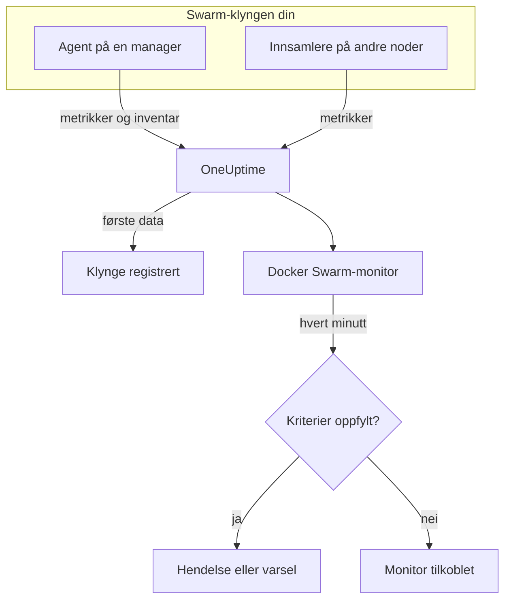

# Docker Swarm-overvåking

En Docker Swarm-monitor overvåker containerne bak tjenesteoppgavene i en Swarm-klynge og sier fra når en oppgave starter på nytt, går varm eller går tom for minne. Den leser containermetrikkene som OneUptimes Docker Swarm-agent sender, så ingenting undersøkes utenfra: installer agenten, og opprett deretter monitoren fra en mal eller din egen spørring.

:::cards
- [Opprett monitoren](#opprett-en-docker-swarm-monitor): Seks trinn i dashbordet.
- [Maler](#ferdige-varslingsmaler): Fire ferdige varsler, én hendelse per oppgave.
- [Metrikker](#innsamlede-metrikker): Containermetrikkene du kan varsle på.
- [Filtre](#monitorinnstillinger): Snevre inn en monitor til en tjeneste, en oppgave eller et bilde.
:::

## Slik fungerer det

OneUptimes Docker Swarm-agent kjører på en managernode. Innsamleren leser containerstatistikk fra nodens Docker-daemon hvert 30. sekund og stempler hver bunke med klyngens navn, `docker.swarm.cluster.name`. En liten inventarpoller ved siden av leser klyngens noder, tjenester og oppgaver fra Swarm-API-et hvert 5. minutt. De første dataene registrerer klyngen i OneUptime.

Innsamleren ser bare containere på noden den kjører på. For å få metrikker fra hver node kjører du innsamleren på hver node med samme `DOCKER_SWARM_CLUSTER_NAME`.

En Docker Swarm-monitor er knyttet til én klynge. Hvert minutt kjører den spørringen sin over klyngens containermetrikker og sammenligner resultatet med kriteriene sine.

## Før du begynner

- **Installer Docker Swarm-agenten** på en managernode. [Veiledningen for Docker Swarm-agenten](/docs/telemetry/docker-swarm) dekker installasjon og oppgradering, og hvordan du kjører innsamleren på de andre nodene.
- **Kontroller at klyngen er registrert.** Den vises under **Produkter → Infrastruktur → Docker Swarm → Alle klynger**, oppkalt etter agentens `DOCKER_SWARM_CLUSTER_NAME`, så snart de første dataene kommer.

## Opprett en Docker Swarm-monitor

:::steps
### Start en ny monitor

Gå til **Monitorer** og klikk på **Opprett monitor**.

### Velg Docker Swarm

Klikk på **Flere monitortyper** under **Monitortype**, og velg **Docker Swarm** under **Infrastruktur**, eller skriv `swarm` i søkefeltet. Skriv inn et **Navn** – det brukes i titler på hendelser og varsler – og klikk på **Neste**.

### Velg klyngen

Velg klyngen i **Docker Swarm Cluster** under **Docker Swarm Monitor Configuration**. Hver klynge som har sendt data, står i listen.

### Velg hva som skal overvåkes

Velg en av de tre fanene:

- **Quick Setup** – klikk på en [mal](#ferdige-varslingsmaler). Den angir metrikken, aggregeringen, tidsintervallet og tersklene, og erstatter kriteriene nedenfor med sine egne. Du kan fortsatt endre **Tidsintervall**.
- **Custom Metric** – velg én metrikk i **Docker Swarm Metric**, og angi deretter **Aggregering** og **Tidsintervall**. [Filtrene](#monitorinnstillinger) snevrer den inn til bestemte oppgaver.
- **Avansert** – bygg spørringer og formler selv under **Velg målinger**. Bruk **Group by** `resource.container.name` for å vurdere hver oppgave for seg.

### Kontroller kriteriene

Åpne hvert kriterium under **Monitorkriterier** og kontroller **Metrikk**, **Aggregering**, **Betingelse** og **Threshold**. En mal fyller inn disse. Med **Custom Metric** eller **Avansert** starter monitoren med [standardkriteriene](#standardkriterier), som bare merker at en metrikk faller til null, så angi din egen terskel.

### Opprett monitoren

Klikk på **Opprett monitor**. OneUptime åpner monitorens side og evaluerer den hvert minutt. Hendelser og varsler den åpner, vises også på klyngens sider **Hendelser** og **Varsler**.
:::

> [!TIP]
> For å sette opp flere maler samtidig åpner du klyngen fra **Produkter → Infrastruktur → Docker Swarm** og går til **Recommendations**. Velg malene du vil ha og hvem som skal varsles, så oppretter OneUptime én monitor per mal.

## Monitorinnstillinger

| Felt | Fane | Hva det gjør |
| --- | --- | --- |
| **Docker Swarm Cluster** | Alle | Påkrevd. Avgrenser hver spørring til `resource.docker.swarm.cluster.name`. Dette er den eneste ressursattributten agenten stempler, så monitoren legger ikke til noe filter på `container.runtime` eller `host.name`. |
| **Tjenestenavn** | Custom Metric, Avansert | Valgfritt. Nøyaktig samsvar med `docker.swarm.service.name`, for eksempel `web`. |
| **Nodenavn** | Custom Metric, Avansert | Valgfritt. Nøyaktig samsvar med `docker.swarm.node.name`, for eksempel `swarm-node-1`. |
| **Containernavn** | Custom Metric, Avansert | Valgfritt. Nøyaktig samsvar med `resource.container.name`. En oppgaves container heter `<service>.<slot>.<taskid>`, for eksempel `web.1.abc123`. |
| **Container-bilde** | Custom Metric, Avansert | Valgfritt. Nøyaktig samsvar med `resource.container.image.name`, for eksempel `nginx:latest`. |
| **Docker Swarm Metric** | Custom Metric | Én metrikk fra [katalogen](#innsamlede-metrikker). |
| **Aggregering** | Custom Metric | Hvordan målinger kombineres: **Gjennomsnitt**, **Maksimum**, **Minimum**, **Sum** eller **Antall**. Starter på metrikkens vanlige aggregering. |
| **Tidsintervall** | Alle | Det glidende vinduet spørringen leser, fra **Past 1 Minute** til **Past 365 Days**. En ny monitor starter på **Past 1 Minute**; maler angir sitt eget. |
| **Velg målinger** | Avansert | Spørringsbyggeren: **Metrikk**, **Aggregate by**, **Filter by attributes**, **Group by**, pluss **Legg til metrikk** og **Legg til formel** for å kombinere spørringer. |

> [!WARNING]
> Den medfølgende agenten angir ennå ikke `docker.swarm.service.name` eller `docker.swarm.node.name`, så en monitor med **Tjenestenavn** eller **Nodenavn** fylt ut finner ingen data. Snevre inn med **Container-bilde** i stedet, eller grupper etter `resource.container.name`.

## Ferdige varslingsmaler

**Quick Setup** tilbyr fire maler. Hver bygger en komplett monitor: en spørring gruppert etter `resource.container.name`, et kriterium som utløses, og et som gjenoppretter. Hver oppgave vurderes for seg og får sin egen hendelse og sitt eget varsel, der rotårsaken lister de berørte oppgavene og verdiene deres. Tersklene er utgangspunkter du kan redigere.

Med mindre tabellen sier noe annet, utløses et kriterium bare når betingelsen gjelder i hvert minutt av vinduet, og det gjenoppretter 10 % forbi terskelen, slik at en verdi som svever ved grensen, ikke blafrer.

| Mal | Alvorlighetsgrad | Overvåker | Utløses når | Gjenoppretter når |
| --- | --- | --- | --- | --- |
| Task Down (Low Uptime) | Kritisk | `container.uptime`, Min per oppgave, siste 1 minutt | En hvilken som helst verdi er under 60 sekunder | Hver verdi er på eller over 66 sekunder |
| High Task CPU Usage | Warning | `container.cpu.utilization`, Avg per oppgave, siste 5 minutter | Over 80 (% av én kjerne) | På eller under 72 |
| High Task Memory Usage | Warning | `container.memory.percent`, Avg per oppgave, siste 5 minutter | Over 85 % | På eller under 76,5 % |
| High Task Process Count | Warning | `container.pids.count`, Max per oppgave, siste 5 minutter | Over 500 | På eller under 450 |

**Alvorlighetsgrad** er etiketten velgeren viser. Hendelsen og varselet en mal oppretter, starter på prosjektets mest alvorlige hendelses- og varslingsgrad; endre dem i kriteriene.

> [!NOTE]
> **Task Down (Low Uptime)** utløses på én enkelt ung måling, fordi en omstart er en hendelse, ikke et nivå. Swarm gir en erstatningsoppgave en ny container, og dermed en ny serie, og derfor ser malen etter en oppetid under ett minutt i stedet for en 0. En utrulling eller en oppskalering utløser den også, og den opphører så snart de nye oppgavene har passert ett minutts oppetid. En oppgave som dør og ikke erstattes, sender ingenting, så den fanges ikke.

## Innsamlede metrikker

Agentens innsamler bruker OpenTelemetry-mottakeren `docker_stats`, så metrikkene er de vanlige containermetrikkene, én serie per oppgavecontainer. Det finnes ingen metrikker `docker_swarm_*`: noder, tjenester og oppgaver spores som inventar, på klyngens sider **Tjenester**, **Oppgaver**, **Noder** og relaterte sider.

### CPU

| Metrikk | Enhet | Beskrivelse |
| --- | --- | --- |
| `container.cpu.utilization` | % | CPU-utnyttelse for en oppgaves container, der 100 % er én hel CPU-kjerne. |

### Minne

| Metrikk | Enhet | Beskrivelse |
| --- | --- | --- |
| `container.memory.usage.total` | byte | Minne brukt av en oppgaves container. |
| `container.memory.percent` | % | Brukt minne som prosentandel av containerens grense, eller av nodens totale minne når tjenesten ikke angir noen grense. |

### Nettverk

| Metrikk | Enhet | Beskrivelse |
| --- | --- | --- |
| `container.network.io.usage.rx_bytes` | byte | Byte mottatt av en oppgaves container. En teller over hele levetiden. |
| `container.network.io.usage.tx_bytes` | byte | Byte sendt av en oppgaves container. En teller over hele levetiden. |

### Container

| Metrikk | Enhet | Beskrivelse |
| --- | --- | --- |
| `container.pids.count` | antall | Prosesser i en oppgaves container. En plutselig økning kan bety en forkbombe eller en lekkasje. |
| `container.uptime` | sekunder | Hvor lenge en oppgaves container har kjørt. En oppgave som planlegges på nytt eller startes på nytt, starter en ny container på 0. |

Hver serie bærer containerens identitet som ressursattributter: `resource.container.name` (`<service>.<slot>.<taskid>`), `resource.container.image.name` og `resource.docker.swarm.cluster.name`.

## Overvåkingskriterier

Et kriterium sammenligner en av monitorens spørringer eller formler med en terskel. Kriteriene til en Docker Swarm-monitor har ingen **Filtertype**: hver regel kontrollerer metrikkverdien, med disse feltene.

| Felt | Hva det gjør |
| --- | --- |
| **Metrikk** | Spørringen eller formelen som kontrolleres, etter variabelnavnet. |
| **Aggregering** | Hvordan verdiene i vinduet blir til ett svar: **Gjennomsnitt**, **Sum**, **Maximum Value**, **Minimum Value**, **All Values** (hver verdi må samsvare) eller **Any Value** (én er nok). |
| **Betingelse** | **Greater Than**, **Less Than**, **Greater Than Or Equal To**, **Less Than Or Equal To** eller **Equal To** – eller en avviksbetingelse: **Anomalously High**, **Anomalously Low** eller **Anomalous**. |
| **Threshold** | Verdien det sammenlignes med. En liste over enheter står ved siden av når metrikken har en enhet. Vises ikke for avviksbetingelser. |
| **Følsomhet** | Bare avviksbetingelser. **Lav** (4σ), **Middels** (3σ, standard) eller **Høy** (2σ). |
| **Grunnlinjevindu** | Bare avviksbetingelser. 14 dager (standard), 28, 60 eller 90 dager med historikk. |
| **Hvis ingen data** | Under **Flere felt**. Hva som skjer når vinduet ikke har noen målinger: **Ignore** (standard), **Treat As Zero** eller **Trigger**. |

Avviksbetingelser sammenligner hver verdi med samme time i uken i grunnlinjen. De blir værende i en «Learning»-tilstand og gir ingenting før grunnlinjevinduet inneholder nok historikk.

Hvert kriterium sier også hva som skal skje når det samsvarer: endre monitorstatusen, opprette et varsel eller erklære en hendelse. Kriterier kontrolleres ovenfra og ned, og det første som samsvarer, avgjør.

### Standardkriterier

En monitor du ikke bygger fra en mal, starter med to kriterier:

| Rekkefølge | Kriterium | Samsvarer når | Deretter |
| --- | --- | --- | --- |
| 1 | Check if _monitor name_ is offline | En hvilken som helst verdi i den første spørringen er `0` | Markerer monitoren som **Frakoblet** og erklærer hendelsen «_monitor name_ is offline», som løser seg selv når monitoren kommer seg. |
| 2 | Check if _monitor name_ is online | En hvilken som helst verdi er over `0` | Markerer monitoren som **I drift**. |

> [!IMPORTANT]
> Stillhet samsvarer med ingen av kriteriene: en klynge som slutter å sende data, etterlater monitoren slik den var. For å få beskjed når data stopper, setter du **Hvis ingen data** til **Trigger** på et kriterium. Tid der OneUptime selv ikke mottok data, er aldri manglende data: en kontroll der vinduet inneholder slik tid, venter i stedet, slik [Når OneUptime ikke mottar data](/docs/monitor/when-oneuptime-is-not-receiving) forklarer.

## Feilsøking

:::details Klyngen står ikke i listen Docker Swarm Cluster
Klynger registrerer seg selv fra agentens data. Kontroller at agenten kjører på en managernode, at `DOCKER_SWARM_CLUSTER_NAME` er angitt, og at klyngen står under **Produkter → Infrastruktur → Docker Swarm → Alle klynger**. [Veiledningen for Docker Swarm-agenten](/docs/telemetry/docker-swarm) har kontrollene du kan kjøre på noden.
:::

:::details Bare noen oppgaver har metrikker
Innsamleren leser Docker-daemonen på noden den kjører på, så den ser bare oppgavene på den noden. Kjør innsamleren på hver node med samme `DOCKER_SWARM_CLUSTER_NAME`.
:::

:::details En monitor filtrert på tjeneste eller node finner ingen data
**Tjenestenavn** og **Nodenavn** samsvarer med `docker.swarm.service.name` og `docker.swarm.node.name`, som den medfølgende agenten ikke angir. Tøm dem og snevre inn med **Container-bilde**, eller grupper etter `resource.container.name`.
:::

:::details Hver oppgave vises som én serie
Grupper etter ressursattributten `resource.container.name`, slik malene gjør. Den nakne `container.name` samsvarer med ingenting, så alle oppgavene slås sammen til én serie med et tomt navn.
:::

## Neste trinn

:::cards
- [Docker Swarm-agent](/docs/telemetry/docker-swarm): Installer og oppgrader agenten denne monitoren leser.
- [Docker-overvåking](/docs/monitor/docker-monitor): Overvåk containerne på én Docker-vert.
- [Hendelser – Oversikt](/docs/incidents/index): Hva som skjer etter at et kriterium har erklært en hendelse.
- [Vaktplaner](/docs/on-call/schedules): Bestem hvem som varsles når en oppgave går i stykker.
:::
