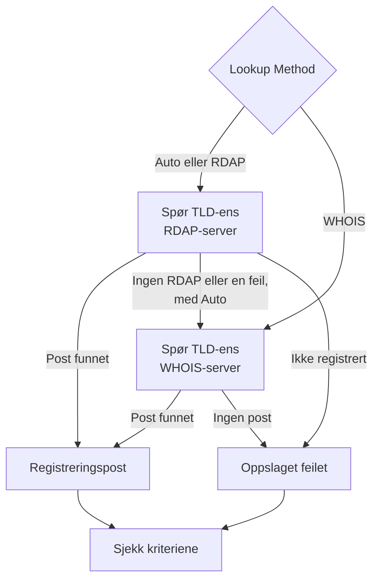

# Domene-overvåking

En domenemonitor leser domenets registreringspost etter en tidsplan for å følge utløpsdatoen, registraren, navneserverne og statuskodene, og varsler deg før det utløper. Bruk den for hvert domene som nettstedene, API-ene og e-posten din er avhengige av: en utløpt registrering tar ned alle på én gang.

:::cards
- [Opprett monitoren](#opprett-en-domenemonitor): Seks trinn i dashbordet.
- [Oppslagsmetoder](#oppslagsmetoder): RDAP, WHOIS, og hvorfor **Auto** er standard.
- [Standardkriterier](#standardkriterier): Et utløpsvarsel 30 dager i forveien, uten oppsett.
- [Feilsøking](#feilsøking): Nedlagte WHOIS-servere, proxyer og manglende datoer.
:::

## Slik fungerer det

Ved hver sjekk slår en sonde opp domenets registreringspost via RDAP eller WHOIS, avhengig av **Lookup Method**, og normaliserer det den finner: utløpsdatoen, registraren, navneserverne og statuskodene. Et oppslag som feiler, prøves på nytt, opptil antallet nye forsøk du angir. Deretter kjører OneUptime posten gjennom monitorens kriterier.

Hvis et oppslag ikke kan gi registreringsdata — fordi TLD-ens tjeneste er lagt ned, eller domenet ikke er registrert — rapporteres monitoren som **frakoblet** med årsaken vist i monitorens sondesvar, i stedet for å bli rapportert som frisk med en tom utløpsdato. Et register som svarer "dette domenet er ledig" (for eksempel `Status: free` hos DENIC), behandles som **ikke registrert**, ikke som en frisk post.

Internasjonaliserte domenenavn godtas i begge former: `münchen.de` konverteres til A-labelen sin (`xn--mnchen-3ya.de`) før oppslaget.

## Før du starter

- **En rolle som kan opprette monitorer**: Project Owner, Project Admin, Project Member, Monitor Admin eller Monitor Member, eller en egendefinert rolle med tillatelsen Create Monitor.
- **Utgående tilgang fra sonden** til registrene. Prosjektets standardsonder velges for hver nye monitor; en [egendefinert sonde](/docs/probe/custom-probe) må nå:

| Mål | Protokoll | Brukes til |
| --- | --- | --- |
| `https://data.iana.org/rdap/dns.json` | HTTPS, port 443 | IANAs RDAP-bootstrapregister, som forteller hvor hver TLDs RDAP-server er. Hentes én gang og bufres i 24 timer. |
| Registrenes RDAP-servere | HTTPS, port 443 | RDAP-oppslag. |
| WHOIS-servere | TCP-port 43 | WHOIS-oppslag. |

RDAP-forespørsler respekterer sondens innstillinger `HTTP_PROXY_URL` / `HTTPS_PROXY_URL` / `NO_PROXY`. WHOIS går over en rå socket og gjør det ikke. Hvis en sonde ikke når `data.iana.org`, faller **Auto** tilbake til WHOIS og prøver IANA igjen etter fem minutter.

## Opprett en domenemonitor

:::steps
### Start en ny monitor

Gå til **Monitorer**, og klikk på **Opprett monitor**. Klikk på **Flere monitortyper** under **Monitortype**, og velg **Domene** under **Basic Monitoring**.

### Gi den et navn

Angi et **Navn**, som `example.com registration`, og klikk så på **Neste**.

### Angi domenet

Angi **Domenenavn**, som `example.com`. La **Lookup Method** stå på **Auto** med mindre du har en grunn til noe annet (se [Oppslagsmetoder](#oppslagsmetoder)).

### Test den

Klikk på **Test monitor**, velg en sonde under **Velg sonde**, og klikk på **Kjør test**. **Resultat av overvåkingstest** viser registreringsposten sonden leste, og om RDAP eller WHOIS svarte.

### Gå gjennom kriteriene

**Monitorkriterier** starter med [standardkriteriene](#standardkriterier): frakoblet når registreringen er utløpt eller ikke kan leses, et varsel når den utløper om 30 dager eller mindre. Endre dem ved behov, og klikk så på **Neste**.

### Velg sonder og opprett

Behold eller endre **Sonder** og **Overvåkingsintervall** (det starter på **Hvert 5. minutt**), og klikk så på **Opprett monitor**. Monitorens side åpnes.
:::

## Konfigurasjonsalternativer

| Felt | Standard | Hva du angir |
| --- | --- | --- |
| **Domenenavn** | Ingen | Det registrerte domenet, som `example.com`. En innlimt adresse fungerer også: `https://example.com/pricing` leses som `example.com`. |
| **Lookup Method** | **Auto** | **Auto**, **RDAP** eller **WHOIS**. Se [Oppslagsmetoder](#oppslagsmetoder). |
| **Tidsavbrudd (ms)** (under **Flere felt**) | `10000` | Hvor lenge det ventes på hvert registreringsoppslag, i millisekunder. |
| **Nye forsøk** (under **Flere felt**) | `3` | Nye forsøk etter at det første forsøket har feilet. `0` betyr ett enkelt forsøk. |

Hvert mislykket oppslag prøves på nytt, med en pause på ett sekund mellom forsøkene. Det gjelder også når et register svarer at domenet ikke er registrert, eller at det ikke har noen registreringstjeneste, i tilfelle svaret var en forbigående feil. Bare et feilformatert domenenavn rapporteres med en gang, uten oppslag.

Tidsavbruddet gjelder hver forespørsel, ikke hele sjekken: en sjekk med **Auto** som prøver RDAP og deretter faller tilbake til WHOIS, kan ta dobbelt så lang tid eller lenger.

### Oppslagsmetoder

Registreringsdata kan leses over to protokoller, og hvilken som fungerer, avhenger av TLD-en.

| Metode | Oppførsel |
| --- | --- |
| **Auto** | Standard. Bruker RDAP når TLD-en publiserer en RDAP-tjeneste, og faller tilbake til WHOIS når den ikke gjør det, eller når RDAP-oppslaget feiler. |
| **RDAP** | Bare RDAP. Feiler med en tydelig feilmelding hvis TLD-en ikke publiserer noen RDAP-tjeneste. |
| **WHOIS** | Bare WHOIS. |

**RDAP** ([RFC 9083](https://www.rfc-editor.org/rfc/rfc9083)) er erstatningen for WHOIS som ICANN har gjort påbudt. Den autoritative serveren for hver TLD finnes via [IANAs bootstrapregister](https://www.rfc-editor.org/rfc/rfc9224), så den forblir riktig når registre flytter. Hver gTLD publiserer en. Når TLD-ens RDAP-server sier at domenet ikke er registrert, tar **Auto** det som svaret og spør ikke WHOIS.

**WHOIS** har ingen tilsvarende mekanisme for å finne servere — klienter leveres med en fast tabell fra TLD til WHOIS-vert, og de tabellene blir utdaterte. Hver TLD fra Identity Digital (`.digital`, `.email`, `.life`, `.today`, `.zone` og rundt 290 andre) peker fortsatt på en nedlagt vert som nå besvarer hver spørring med den bokstavelige teksten `TLD is not supported.` i stedet for en post. WHOIS er fortsatt det eneste alternativet for de mange ccTLD-ene som ikke publiserer noen RDAP-tjeneste i det hele tatt, som `.io`, `.co`, `.de`, `.ch` og `.jp`.

## Overvåkingskriterier

Kriterier avgjør når domenet regnes som i orden eller feil, og om det erklærer en hendelse eller oppretter et varsel. Hvert kriterium sjekker ett eller flere filtre:

| Filter | Betingelser | Hva det sjekker |
| --- | --- | --- |
| **Is Online** | **Sann**, **Usann** | Om selve registreringsoppslaget lyktes. |
| **Is Request Timeout** | **Sann**, **Usann** | Om oppslaget fikk tidsavbrudd ved hvert forsøk. |
| **Domain Expires In Days** | **Greater Than**, **Less Than**, **Greater Than Or Equal To**, **Less Than Or Equal To** | Dager til registreringen utløper, rundet opp til en hel dag. |
| **Domain Is Expired** | **Sann**, **Usann** | Om utløpsdatoen er passert. |
| **Domain Registrar** | **Inneholder**, **Not Contains**, **Starts With**, **Ends With**, **Equal To**, **Not Equal To** | Registrarens navn. |
| **Domain Name Server** | **Inneholder**, **Not Contains**, **Starts With**, **Ends With**, **Equal To**, **Not Equal To** | Domenets navneservere. Samsvarer når én av dem samsvarer. |
| **Domain Status Code** | **Inneholder**, **Not Contains**, **Starts With**, **Ends With**, **Equal To**, **Not Equal To** | Domenets EPP-statuskoder. Samsvarer når én av dem samsvarer. |

Statuskoder normaliseres til EPP-navnene sine (`clientTransferProhibited`) uansett hvilken protokoll som svarte, så et kriterium fortsetter å samsvare når **Auto** bytter mellom RDAP og WHOIS. Registrarers _navn_ er det den svarende tjenesten publiserer, og kan variere litt mellom de to protokollene, så foretrekk **Inneholder** fremfor **Equal To** i et kriterium med **Domain Registrar**.

Datoer normaliseres til ISO 8601. En dato som et register publiserer i en form som ikke kan tolkes, utelates i stedet for å lagres, så et utløpskriterium ikke kan avgjøre noe og ikke samsvarer, i stedet for å svare "ikke utløpt" i det stille for alltid.

Med to eller flere filtre avgjør **Samsvarsbetingelse** om **Alle** må samsvare, eller om **Hvilken som helst** av dem holder. Et kriteriums **Handlinger** avgjør hva det gjør: endrer monitorstatusen, oppretter et varsel, erklærer en hendelse, eller flere av disse.

### Standardkriterier

En ny domenemonitor starter med tre kriterier, så den varsler deg før en registrering utløper, helt uten oppsett:

1. **Domenesjekken feilet** — registreringen er utløpt, eller registreringsdataene kunne ikke leses. Monitoren merkes som **Frakoblet**, og det opprettes en hendelse med navnet "_monitor name_ domain check failed". Hendelsen løser seg selv når registreringen kan leses og er gjeldende igjen.
2. **Domenet utløper snart** — registreringen er ikke utløpt, men utløper om 30 dager eller mindre. Det opprettes et **varsel** med navnet "_monitor name_ domain expires soon".
3. **Domenet er ikke utløpt** — monitoren merkes som **I drift**.

Varselet "utløper snart" er et varsel, ikke en hendelse: det vises ikke på statussidene dine, det tilkaller ingen med mindre du legger til en vaktretningslinje på det, og det endrer ikke monitorens status. Det bruker prosjektets andre varselalvorlighetsgrad, **Low** i et nytt prosjekt. Så snart fornyelsen vises i registreringsposten, løser varselet seg selv. Et register som ikke publiserer noen utløpsdato, gir ikke varselet noe å gå etter, så det holder seg stille.

Kriterier sjekkes fra topp til bunn, og det første som samsvarer, avgjør hva som skjer. Derfor står "utløper snart" over "er ikke utløpt": et domene som er i ferd med å utløpe, er ennå ikke utløpt, så det ville samsvare med begge.

For å bli varslet tidligere endrer du verdien til filteret **Domain Expires In Days** i kriteriet "utløper snart", for eksempel til `60`. For å få noen tilkalt i stedet åpner du kriteriets **Handlinger**: slå på **Når filtre samsvarer, erklær en hendelse.**, eller behold varselet og legg til en vaktretningslinje på det under **Vaktretningslinjer**.

:::details Legg til varselet på en monitor som ble opprettet før det fantes
Monitorer som ble opprettet før OneUptime innførte dette varselet, har ikke noe kriterium "utløper snart". Slik legger du det til:

1. Åpne **Konfigurasjon → Kriterier** på monitoren, og klikk på **Rediger Overvåkingskriterier**.
2. Klikk på **Legg til kriterier**. Sett filteret til **Domain Is Expired** / **Usann**, klikk på **Legg til filter**, og sett det andre til **Domain Expires In Days** / **Less Than Or Equal To** / `30`. La **Samsvarsbetingelse** stå på **Alle** (den vises under filtrene så snart det er to).
3. Slå på **Når filtre samsvarer, opprett et varsel.** under **Handlinger**, og la **Når filtre samsvarer, endre overvåkerstatus.** være slått av, så det oppretter et varsel og ikke endrer monitorens status.
4. Dra det nye kriteriet over kriteriet som merker monitoren som tilkoblet, og lagre så.
:::

### Eksempelkriterier

| Mål | Filter | Betingelse | Verdi |
| --- | --- | --- | --- |
| Varsle når domenet utløper innen 30 dager (et standardkriterium) | **Domain Expires In Days** | **Less Than Or Equal To** | `30` |
| Frakoblet når domenet er utløpt | **Domain Is Expired** | **Sann** | — |
| Frakoblet når registreringen ikke kan leses | **Is Online** | **Usann** | — |
| Varsle når navneserverne endres | **Domain Name Server** | **Not Contains** | `ns1.example.com` |
| Varsle når domenet er låst opp for overføring | **Domain Status Code** | **Not Contains** | `clientTransferProhibited` |

**Domain Name Server** og **Domain Status Code** samsvarer når _hvilken som helst_ enkeltverdi samsvarer, så **Not Contains** samsvarer så snart én navneserver, eller én statuskode, ikke inneholder teksten.

## Beste praksis

1. **Gi deg selv tid til å fornye** — Standardvarselet kommer 30 dager før utløp. Hvis fornyelsen krever godkjenninger eller en betaling som tar lenger tid, øker du det til 60 dager.
2. **Dekk mislykkede oppslag** — Ta med et filter **Is Online** / **Usann** i frakoblet-kriteriet ditt, så en registrering som ikke kan leses, ikke forveksles med en frisk. Nye monitorer har det i standardkriteriene sine; en monitor som ble opprettet før det kom, må få det lagt til for hånd. For å komme gjennom en WHOIS-server som av og til begrenser sonden, krysser du av for **Evaluer disse kriteriene over en tidsperiode** under det filteret og velger **All Values**: domenet går da først frakoblet når hvert oppslag i vinduet har feilet.
3. **Overvåk alle viktige domener** — Ta med primærdomener, separat registrerte underdomener og alle domener som brukes til e-post eller API-er.
4. **Følg med på registrarbytter** — Legg til et kriterium med **Domain Registrar** / **Not Contains** / navnet på registraren din, for å fange opp en uautorisert overføring.

## Feilsøking

:::details WHOIS-serveren "answered without any registration data"
TLD-ens WHOIS-vert er lagt ned, begrenser sonden eller er kortvarig ute av drift. En nedlagt vert, som den som fortsatt er tilordnet Identity Digitals TLD-er, svarer `TLD is not supported.` hver gang. Hvis feilen vedvarer med **Lookup Method** på **WHOIS**, bytter du til **Auto**, så sonden leser TLD-ens RDAP-tjeneste der det finnes en.
:::

:::details Sjekken feiler med "No RDAP service is published"
Monitoren bruker **RDAP**, og TLD-en publiserer ingen RDAP-tjeneste, slik mange ccTLD-er ikke gjør. Bytt **Lookup Method** til **Auto**, som faller tilbake til WHOIS.
:::

:::details Domenet rapporteres som ikke registrert
Registeret svarte at domenet er ledig. Sjekk stavingen, og at du har angitt det registrerte domenet, som `example.com`, ikke et underdomene.
:::

:::details Oppslag feiler på en sonde bak en proxy
RDAP går gjennom sondens proxyinnstillinger, WHOIS gjør det ikke. Tillat utgående TCP-port 43 for WHOIS, eller bruk **Auto** eller **RDAP** for TLD-er som publiserer en RDAP-tjeneste.
:::

:::details Utløpsdatoen er tom, og utløpskriteriene utløses aldri
Registeret publiserer ingen utløpsdato, eller en i en form som ikke kan tolkes. Utløpskriterier kan ikke avgjøre noe uten en dato, så de holder seg stille. **Is Online** forteller deg fortsatt om posten kan leses.
:::

## Neste steg

:::cards
- [SSL-sertifikat-overvåking](/docs/monitor/ssl-certificate-monitor): Bli varslet før sertifikatene på domenet utløper.
- [DNS-overvåking](/docs/monitor/dns-monitor): Sjekk at domenets poster kan slås opp, og hva de sier.
- [DNSSEC-overvåking](/docs/monitor/dnssec-monitor): Valider tillitskjeden til en signert sone.
- [Eskaleringsregler](/docs/on-call/escalation-rules): Bestem hvem som blir tilkalt av varslene og hendelsene.
:::
