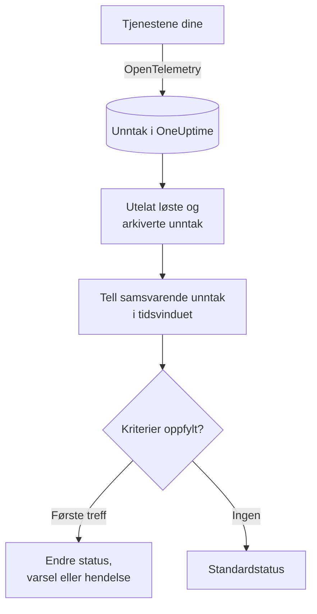

# Unntak-overvåking

En unntaksmonitor teller innenfor et tidsvindu unntakene tjenestene dine rapporterer til OneUptime som samsvarer med filtrene dine (melding, unntakstype, miljø, tjeneste). Når antallet oppfyller kriteriene dine, endrer den monitorens status, oppretter et varsel eller erklærer en hendelse. Bruk den til å bli varslet om hvert nytt krasj i produksjon, om én unntakstype eller om en plutselig økning i feil.

:::cards
- [Opprett monitoren](#opprett-en-unntaksmonitor): Velg hvilke unntak som telles, og når du skal varsles.
- [Miljøer](#miljøer): Begrens monitoren til `production`.
- [Slik evalueres den](#slik-evalueres-den): Hva som telles, og hva det gjør å løse et unntak.
- [Kriterier](#kriterier): Vilkårene og standardverdiene.
:::

## Slik fungerer det



Hvert minutt teller OneUptime unntakene som samsvarer med monitorens filtre og oppsto innenfor tidsvinduet, og utelater unntak du har merket som løst eller arkivert. Antallet sammenlignes med monitorens kriterier fra topp til bunn, og det første kriteriet som samsvarer, avgjør hva som skjer. Når ingen samsvarer, går monitoren tilbake til standardstatusen sin.

## Før du starter

- Tjenestene dine sender unntak til OneUptime via OpenTelemetry. Se [OpenTelemetry](/docs/telemetry/open-telemetry).
- For å begrense en monitor til et miljø må tjenestene dine angi ressursattributtet `deployment.environment`.

## Opprett en unntaksmonitor

:::steps
### Start en ny monitor

Gå til **Monitorer**, og klikk på **Opprett monitor**.

### Velg Exceptions

Under **Monitortype** klikker du på **Flere monitortyper** og velger **Unntak** under **Telemetri**, eller du skriver `exceptions` i søkefeltet. Skriv inn et **Navn**, og klikk deretter på **Neste**.

### Velg unntakene som skal telles

I **Unntaksmonitorkonfigurasjon** angir du **Filtrer unntaksmelding**, **Unntakstyper**, **Environments** og **Overvåk unntak i (tid)**. Et filter du lar stå tomt, samsvarer med alle unntak. **Forhåndsvisning av unntak** under filtrene viser unntakene de samsvarer med akkurat nå.

### Snevre dem inn (valgfritt)

Åpne **Flere felt** for å filtrere etter telemetritjeneste eller infrastrukturentitet, eller for også å telle løste og arkiverte unntak.

### Angi kriteriene

Kortet **Monitorkriterier** starter med to kriterier: frakoblet, med en hendelse, når et unntak samsvarer; tilkoblet når ingen gjør det. Endre dem til det du vil varsles om (se [Kriterier](#kriterier)).

### Opprett monitoren

Klikk på **Opprett monitor**. Monitoren åpnes på siden **Oversikt**, og den første evalueringen kjøres innen ett minutt.
:::

## Hva den spør etter

| Felt | Hva det samsvarer med | Standard |
| --- | --- | --- |
| **Filtrer unntaksmelding** | Unntak der meldingen inneholder denne teksten, uten forskjell på store og små bokstaver. | Tom: alle unntak |
| **Unntakstyper** | Unntak av en av disse typene, atskilt med komma, som `TypeError, NullReferenceException`. Typenavnet må samsvare nøyaktig. | Tom: alle typer |
| **Environments** | Unntak fra et av disse miljøene, atskilt med komma (se [Miljøer](#miljøer)). | Tom: alle miljøer |
| **Overvåk unntak i (tid)** | Unntak fra de siste 5 sekundene opp til de siste 24 timene. | **Siste 1 minutt** |
| **Filtrer etter telemetritjeneste** (under **Flere felt**) | Unntak fra en av de valgte tjenestene. | Tom: alle tjenester |
| **Filter by Infrastructure Entity** (under **Flere felt**) | Unntak fra en av de valgte vertene, podene, containerne og andre entitetene. | Tom: alle entiteter |
| **Inkluder løste unntak** (under **Flere felt**) | Tell også unntak som er merket som løst. | Av |
| **Inkluder arkiverte unntak** (under **Flere felt**) | Tell også arkiverte unntak. | Av |

Alle filtrene du angir, må samsvare for at et unntak skal telles.

### Miljøer

Miljøer kommer fra OpenTelemetry-ressursattributtet `deployment.environment` på hvert unntak, den samme verdien som unntaksutforskeren filtrerer på med `env:production`. Skriv inn ett miljø, eller flere atskilt med komma; et unntak telles når miljøet samsvarer med ett av dem.

Sammenligningen er nøyaktig og skiller mellom store og små bokstaver: `production` samsvarer ikke med `Production` eller `prod`. Unntak uten miljø telles ikke når dette filteret er angitt. La det stå tomt for å telle unntak fra alle miljøer, også dem uten miljø.

Miljøfilteret kombineres med alle andre filtre, så en monitor som er begrenset til én telemetritjeneste og `production`, teller bare den tjenestens produksjonsunntak.

Når du oppretter monitoren via API-et, setter du `environments` på trinnets `exceptionMonitor` til en liste over miljønavn:

```json
{
  "exceptionMonitor": {
    "telemetryServiceIds": [],
    "environments": ["production"],
    "exceptionTypes": [],
    "message": "",
    "includeResolved": false,
    "includeArchived": false,
    "lastXSecondsOfExceptions": 300
  }
}
```

## Slik evalueres den

- **Hvert minutt.** En unntaksmonitor sjekkes ikke av sonder, så den har ikke noe intervall å angi og ingen side **Sonder og intervall**.
- **Forekomster, ikke unntakstyper.** Monitoren teller hver gang et samsvarende unntak oppsto innenfor **Overvåk unntak i (tid)**. Ett unntak som kastes 40 ganger, teller 40.
- **Løste og arkiverte unntak utelates.** Med mindre du slår på **Inkluder løste unntak** eller **Inkluder arkiverte unntak**, teller ikke forekomstene av et unntak du har merket som løst eller arkivert. Å merke et unntak som løst kan derfor lukke hendelsen det åpnet. Når et løst unntak oppstår igjen, blir det automatisk uløst og telles på nytt.
- **Ingen unntak er et antall på 0.**
- **OneUptimes eget nedetid er ikke stillhet.** Så lenge tidsvinduet inneholder tid da OneUptime selv ikke mottok data (det startet på nytt, ble oppgradert eller tok igjen et etterslep), venter sjekken: statusen endres ikke, og ingen hendelse eller varsel åpnes eller løses. Se [Når OneUptime ikke mottar data](/docs/monitor/when-oneuptime-is-not-receiving).
- **Kriterier fra topp til bunn.** Det første kriteriet som samsvarer, avgjør, så legg det mest alvorlige øverst.

Hver statusendring registreres med årsaken på monitorens **Statustidslinje**.

## Kriterier

Kriteriene til en unntaksmonitor har én **Filtertype**: **Exception Count**, antallet unntak som samsvarte i vinduet. Velg et **Filtervilkår** og en **Verdi**.

| Filtervilkår | Samsvarer når antallet unntak er… |
| --- | --- |
| **Greater Than** | over verdien |
| **Greater Than Or Equal To** | lik verdien eller høyere |
| **Less Than** | under verdien |
| **Less Than Or Equal To** | lik verdien eller lavere |
| **Equal To** | nøyaktig verdien |
| **Not Equal To** | alt annet enn verdien |

Antall unntak har ingen avviksvilkår: det finnes ingen grunnlinje å sammenligne dem med.

En ny unntaksmonitor starter med disse kriteriene:

| Kriterium | Filter | Virkning |
| --- | --- | --- |
| Check if … has exceptions | **Exception Count** **Greater Than** `0` | Setter monitoren som frakoblet og erklærer en hendelse som løses automatisk |
| Check if … has no exceptions | **Exception Count** **Equal To** `0` | Setter monitoren som tilkoblet |

## Gjennomgått eksempel: bare produksjonsunntak

Du vil ha en hendelse hver gang API-et kaster et unntak i produksjon, og ingenting for staging. Du setter **Environments** til `production` og **Overvåk unntak i (tid)** til **Siste 5 minutter**, og beholder standardkriteriene. De siste fem minuttene:

| Unntak | Miljø | Tilstand | Telles? |
| --- | --- | --- | --- |
| `TypeError` × 3 | `production` | Aktivt | Ja: 3 |
| `TypeError` × 40 | `staging` | Aktivt | Nei: et annet miljø |
| `TimeoutError` × 2 | ingen | Aktivt | Nei: intet miljø |
| `NullReferenceException` × 4 | `production` | Løst etter at de oppsto | Nei: løst |

**Exception Count** er 3, så **Greater Than** `0` samsvarer: monitoren blir frakoblet, og en hendelse erklæres. Når det har gått fem minutter uten noe aktivt produksjonsunntak, samsvarer tilkoblet-kriteriet, og hendelsen løser seg selv.

## Feilsøking

:::details Unntak vises i utforskeren, men monitoren teller 0
Sammenlign verdien i **Environments** med utforskerens filter `env:`: sammenligningen er nøyaktig og skiller mellom store og små bokstaver, og unntak uten miljø utelates når filteret er angitt. Sjekk deretter om unntakene er løst eller arkivert. Åpne monitorens side **Kriterier** (under **Konfigurasjon**), og klikk på **Edit Monitoring Criteria**: **Forhåndsvisning av unntak** viser hva filtrene samsvarer med.
:::

:::details Hendelsen ble løst da jeg løste unntaket
Det er forventet. Løste unntak telles ikke, så antallet falt, og kriteriet sluttet å samsvare. Hvis unntaket oppstår igjen, blir det uløst og telles på nytt. Slå på **Inkluder løste unntak** for å telle dem uansett.
:::

:::details Et filter på unntakstype samsvarer ikke med noe
**Unntakstyper** sammenlignes nøyaktig med typenavnet unntaket ble rapportert med, som `TypeError`. Kopier typen fra unntaksutforskeren.
:::

## Neste steg

:::cards
- [Trase-overvåking](/docs/monitor/traces-monitor): Bli varslet om mislykkede spans og endepunkter.
- [Logg-overvåking](/docs/monitor/logs-monitor): Bli varslet om loggmengde og -innhold.
- [Hendelse- og varslingsmaler](/docs/monitor/incident-alert-templating): Skriv nyttige titler og beskrivelser for varsler.
- [OpenTelemetry](/docs/telemetry/open-telemetry): Send unntak til OneUptime.
:::
