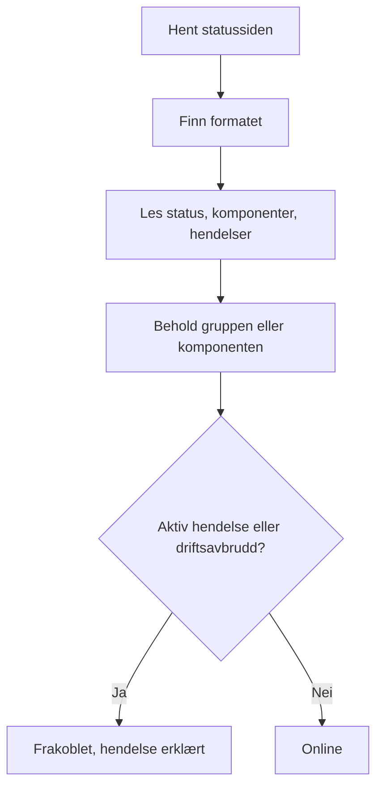

# Ekstern statusside-overvåking

En monitor for eksterne statussider følger med på den offentlige statussiden til en tjeneste du er avhengig av — AWS, GCP, Azure, GitHub, OpenAI, Anthropic og mange flere — og varsler deg når leverandøren melder om et driftsavbrudd eller redusert ytelse. Bruk den til å få vite om problemer hos leverandørene dine så snart de melder dem, og til å skille dem fra dine egne.

:::cards
- [Opprett monitoren](#opprett-en-monitor-for-eksterne-statussider): Lim inn URL-en til en statusside, og velg hva du vil følge med på.
- [Avgrens den](#konfigurasjonsalternativer): Følg med på én komponentgruppe eller én komponent.
- [Kriterier](#overvåkingskriterier): Hva som regnes som nede som standard.
- [Populære statussider](#populære-statusside-url-er): URL-er til tjenestene de fleste team er avhengige av.
:::

## Slik fungerer det

Ved hver kontroll henter en sonde statussiden, finner ut hvilket format den bruker, og leser den samlede statusen, komponentene og de aktive hendelsene. Hvis du har avgrenset monitoren til en komponentgruppe eller en komponent, teller bare de. Deretter avgjør kriteriene om monitoren er online eller frakoblet.

Du kan bruke den til å:

- Overvåke tilgjengeligheten til tredjepartstjenester applikasjonen din er avhengig av
- Bli varslet når leverandørene dine har driftsavbrudd
- Følge statusen til enkeltkomponenter
- Avgrense overvåkingen til én komponentgruppe (f.eks. bare "APIs" hos OpenAI), slik at hendelser andre steder på siden som ikke angår deg, ikke utløser monitoren din
- Oppdage redusert ytelse før det rammer brukerne dine
- Sammenholde dine egne hendelser med problemer hos leverandørene dine

## Støttede leverandører

| Leverandør | Beskrivelse |
| ------------------------ | ---------------------------------------------------------------------- |
| **Auto** (standard) | Finner formatet på statussiden automatisk |
| **Atlassian Statuspage** | Statussider som kjører på Atlassian Statuspage (JSON-API) |
| **incident.io** | Statussider som kjører på incident.io (f.eks. `https://status.openai.com`) |
| **RSS** | Statussider som tilbyr en RSS-feed |
| **Atom** | Statussider som tilbyr en Atom-feed |

### Automatisk gjenkjenning

Når leverandøren er satt til **Auto**, finner OneUptime formatet på statussiden automatisk, i denne rekkefølgen:

1. Først prøver den statusside-API-et til incident.io (`/proxy/<host>`).
2. Deretter prøver den JSON-API-et til Atlassian Statuspage (`/api/v2/status.json`, `/api/v2/components.json` og `/api/v2/incidents/unresolved.json`).
3. Hvis de mislykkes, prøver den å lese siden som en RSS- eller Atom-feed.
4. Som siste utvei gjør den en enkel kontroll av om siden kan nås over HTTP.

> [!NOTE]
> incident.io sjekkes først fordi noen statussider fra incident.io (som `https://status.openai.com`) også eksponerer et begrenset, Atlassian-kompatibelt endepunkt som utelater komponentgrupper og aktive hendelser. Når incident.io sjekkes først, brukes de rikere dataene med grupper.

Kontrollen av om siden kan nås, er også utveien når en leverandør du har valgt uttrykkelig, feiler. Den forteller deg bare om siden svarer — online ved et svar `2xx` eller `3xx` — og melder ingen komponenter eller hendelser.

## Opprett en monitor for eksterne statussider

:::steps
### Start en ny monitor

Gå til **Monitorer**, og klikk på **Opprett monitor**. Under **Monitortype** klikker du på **Flere monitortyper** og velger **External Status Page** under **Basic Monitoring**, eller skriver `statuspage` i søkefeltet. Skriv inn et **Navn**, og klikk deretter på **Neste**.

### Skriv inn URL-en til statussiden

Skriv inn **URL til statusside**. La **Leverandør** stå på **Auto** med mindre du kjenner formatet.

### Avgrens den, hvis du trenger det

Åpne **Flere felt** for å skrive inn et **Component Group Filter (Optional)**, som `APIs`, og et **Filter for komponentnavn (valgfritt)** for å følge med på én enkelt komponent (innenfor gruppen, hvis en gruppe er angitt).

### Test den

Klikk på **Test monitor** for å hente siden én gang, og sjekk leverandøren, komponentene og hendelsene den fant.

### Gå gjennom kriteriene

Kriterietrinnet starter med [standardkriteriene](#standardkriterier), som markerer monitoren som frakoblet når leverandøren melder om en aktiv hendelse eller et driftsavbrudd innenfor avgrensningen. Endre dem hvis du trenger det, og klikk deretter på **Neste**.

### Velg sonder, og opprett

Velg **Sonder** og et **Overvåkingsintervall** — det starter på **Hvert 5. minutt** — og klikk deretter på **Opprett monitor**.
:::

## Konfigurasjonsalternativer

| Alternativ | Hva du skriver inn | Standard |
| --- | --- | --- |
| **URL til statusside** | URL-en til statussiden. For sider som kjører på Atlassian Statuspage og incident.io, er dette vanligvis rot-URL-en (f.eks. `https://status.example.com`). For RSS-/Atom-feeder skriver du inn URL-en til feeden direkte. | — |
| **Leverandør** | **Auto** for å finne formatet, eller **Atlassian Statuspage**, **incident.io**, **RSS** eller **Atom** hvis du kjenner det. | **Auto** |
| **Component Group Filter (Optional)** | Gruppen monitoren avgrenses til. Under **Flere felt**. | Alle grupper |
| **Filter for komponentnavn (valgfritt)** | Komponenten du vil følge med på. Under **Flere felt**. | Alle komponenter innenfor avgrensningen |
| **Tidsavbrudd (ms)** | Den lengste tiden det ventes på statussiden. Under **Flere felt**. | `10000` (10 sekunder) |
| **Nye forsøk** | Hvor mange ganger det prøves på nytt, med ett sekunds mellomrom, etter at det første forsøket har mislyktes; `0` betyr ett enkelt forsøk. Under **Flere felt**. | `3` (opptil 4 forsøk) |

### Component Group Filter

Hvis statussiden deler komponentene sine inn i grupper, kan du avgrense monitoren til én gruppe. På `https://status.openai.com` avgrenser du for eksempel monitoren til API-tjenestene til OpenAI ved å skrive inn `APIs`.

Når en komponentgruppe er angitt, beregnes **antallet aktive hendelser** og den **samlede statusen** bare ut fra komponentene i den gruppen — en hendelse som rammer en gruppe som ikke angår deg (for eksempel ChatGPT), utløser ikke en monitor som er avgrenset til gruppen "APIs".

Filtrering på komponentgruppe støttes for leverandørene **Atlassian Statuspage** og **incident.io**. RSS- og Atom-feeder har ingen komponentgrupper.

### Filter for komponentnavn

Hvis statussiden melder om flere komponenter, kan du angi et komponentnavn for å overvåke bare den komponenten. Filteret samsvarer med alle komponenter der navnet inneholder det du skriver inn, uten hensyn til store og små bokstaver — `actions` samsvarer med en komponent som heter "Actions".

Når en komponentgruppe også er angitt, brukes filteret for komponentnavn **innenfor** den gruppen, slik at du kan treffe én enkelt komponent i en større gruppe. Når ingen av filtrene er angitt, overvåkes alle komponenter innenfor avgrensningen. På en RSS- eller Atom-feed sammenlignes navnefilteret med titlene på elementene i feeden.

> [!WARNING]
> Et filter som ikke samsvarer med noe, ser friskt ut: uten komponenter innenfor avgrensningen er det ingenting som kan melde om et driftsavbrudd. Sjekk stavemåten mot statussiden, og bruk **Test monitor** for å se hva filteret beholder.

## Overvåkingskriterier

Du kan konfigurere kriterier som avgjør når den eksterne tjenesten regnes som online eller frakoblet, ut fra:

| Filtertype | Hva den sjekker | Filtervilkår |
| --- | --- | --- |
| **External Status Page Is Online** | Om statussiden kan nås og returnerer statusdata | Sann eller Usann |
| **External Status Page Overall Status** | Den samlede statusen siden melder | Equal To, Not Equal To, Inneholder, Not Contains, Starts With, Ends With |
| **External Status Page Component Status** | Statusen til komponentene innenfor avgrensningen (med hensyn til filtrene for komponentgruppe / komponentnavn): I drift, Under Maintenance, Degraded Performance, Partial Outage, Major Outage eller Full Outage | Equal To, Not Equal To, Inneholder, Not Contains, Starts With, Ends With |
| **External Status Page Active Incidents** | Antallet aktive hendelser statussiden melder om nå (avgrenset til komponentgruppen / komponenten når et filter er angitt) | Equal To, Not Equal To og de numeriske sammenligningene |
| **External Status Page Response Time (in ms)** | Hvor lang tid det tar å hente dataene fra statussiden | Greater Than, Less Than, Greater Than Or Equal To, Less Than Or Equal To |

Den samlede statusen er det siden sier, så verdiene varierer med leverandøren: en Atlassian Statuspage melder sin egen beskrivelse, som `All Systems Operational`; en feed melder `operational` eller `degraded_performance`; kontrollen av om siden kan nås, melder `reachable` eller `unreachable`. Disse sammenligningene skiller mellom store og små bokstaver. For å varsle om driftsavbrudd er **External Status Page Active Incidents** og **External Status Page Component Status** som regel mer pålitelige.

På en RSS- eller Atom-feed regnes elementene fra de siste 24 timene som aktive hendelser: et RSS-element ut fra publiseringsdatoen, et Atom-element ut fra oppdateringsdatoen.

### Standardkriterier

Som standard oppretter OneUptime kriterier ut fra det som virkelig betyr noe for en statusside — de aktive hendelsene og helsen til komponentene, i stedet for bare om den kan nås:

| Kriterium | Filtre | Virkning |
| --- | --- | --- |
| Offline | **Hvilken som helst** av: siden er ikke online; det finnes minst én aktiv hendelse innenfor avgrensningen; en komponent innenfor avgrensningen melder Degraded Performance, Partial Outage, Major Outage eller Full Outage | Markerer monitoren som frakoblet og erklærer en hendelse, som løser seg selv når kriteriet slutter å samsvare |
| Online | **Alle** av: siden er online; det finnes ingen aktive hendelser innenfor avgrensningen | Markerer monitoren som online |

Fordi antallet aktive hendelser og statusene til komponentene tar hensyn til filtrene for komponentgruppe / komponentnavn, treffer disse standardkriteriene automatisk bare komponentene du bryr deg om.

## Malvariabler

Når du oppretter hendelser eller varsler fra monitorer for eksterne statussider, kan du bruke disse variablene i titler, beskrivelser og utbedringsnotater (se [Hendelse- og varslingsmaler](/docs/monitor/incident-alert-templating)):

| Variabel | Beskrivelse |
| ------------------------- | ------------------------------------------------------------------------------- |
| `{{isOnline}}`            | Om statussiden er online (true/false) |
| `{{responseTimeInMs}}`    | Svartid i millisekunder |
| `{{failureCause}}`        | Årsaken til feilen, hvis noen |
| `{{overallStatus}}`       | Verdien til den samlede statusindikatoren |
| `{{activeIncidentCount}}` | Antall aktive hendelser (avgrenset til filteret, hvis det finnes) |
| `{{componentStatuses}}`   | JSON-matrise med statusene til komponentene (`name`, `status`, `description`, `groupName`) |
| `{{provider}}`            | Den gjenkjente leverandøren (Atlassian Statuspage, incident.io, RSS, Atom); tom etter en kontroll av om siden kan nås |
| `{{componentGroup}}`      | Komponentgruppen monitoren er avgrenset til, hvis noen |
| `{{componentName}}`       | Komponenten monitoren er avgrenset til, hvis noen |

## Populære statusside-URL-er

Her er en liste over statussidene til populære tjenester. Mange av dem bruker Atlassian Statuspage eller incident.io, så leverandøren **Auto** gjenkjenner dem automatisk. En side som ikke er bygd på noen av dem, og som ikke er en feed, får bare kontrollen av om den kan nås — for slike overvåker du heller RSS- eller Atom-feeden til leverandøren, hvis den publiserer en.

| Tjeneste | URL til statusside |
| ---------------------------- | --------------------------------------------- |
| AWS                          | `https://health.aws.amazon.com/health/status` |
| Google Cloud Platform        | `https://status.cloud.google.com`             |
| Microsoft Azure              | `https://status.azure.com`                    |
| GitHub                       | `https://www.githubstatus.com`                |
| OpenAI                       | `https://status.openai.com`                   |
| Anthropic                    | `https://status.anthropic.com`                |
| Cloudflare                   | `https://www.cloudflarestatus.com`            |
| Datadog                      | `https://status.datadoghq.com`                |
| PagerDuty                    | `https://status.pagerduty.com`                |
| Twilio                       | `https://status.twilio.com`                   |
| Stripe                       | `https://status.stripe.com`                   |
| Slack                        | `https://status.slack.com`                    |
| Atlassian (Jira, Confluence) | `https://status.atlassian.com`                |
| Vercel                       | `https://www.vercel-status.com`               |
| Netlify                      | `https://www.netlifystatus.com`               |
| DigitalOcean                 | `https://status.digitalocean.com`             |
| Heroku                       | `https://status.heroku.com`                   |
| MongoDB Atlas                | `https://status.cloud.mongodb.com`            |
| Fastly                       | `https://status.fastly.com`                   |
| New Relic                    | `https://status.newrelic.com`                 |
| Sentry                       | `https://status.sentry.io`                    |
| CircleCI                     | `https://status.circleci.com`                 |

## Beste praksis

- **Bruk leverandøren Auto** med mindre du kjenner det nøyaktige formatet — automatisk gjenkjenning fungerer godt for de fleste statussider.
- **Avgrens til en komponentgruppe** hvis du bare er avhengig av en del av en leverandør (f.eks. bare "APIs" hos OpenAI), slik at hendelser som ikke angår deg, ikke lager støy.
- **Overvåk bestemte komponenter** hvis du bare er avhengig av bestemte tjenester.
- **Kombiner med dine egne monitorer** — sett monitorer for eksterne statussider sammen med dine egne API- og nettstedsmonitorer. Når begge går ned samtidig, peker leverandørens statusside deg raskere mot årsaken.

## Feilsøking

:::details Monitoren er frakoblet, men hendelsen gjelder en del av tjenesten jeg ikke bruker
Avgrens monitoren med et **Component Group Filter**, et **Filter for komponentnavn** eller begge. Antallet aktive hendelser og statusene til komponentene teller da bare det som er innenfor avgrensningen.
:::

:::details Monitoren blir aldri frakoblet, selv under et driftsavbrudd
Filtrene samsvarer kanskje ikke med noe, noe som ser friskt ut, eller siden får kanskje bare kontrollen av om den kan nås. Kjør **Test monitor**, og sjekk leverandøren og komponentene den fant.
:::

:::details Auto velger feil format, eller finner ingen komponenter
Sett **Leverandør** til den du vet at siden bruker. For en RSS- eller Atom-feed skriver du inn URL-en til selve feeden i stedet for statussidens.
:::

:::details En intern statusside kan ikke nås
En sonde avviser adresser i private nettverk med mindre den har lov til å nå dem. Sett `PROBE_ALLOW_PRIVATE_NETWORK_MONITORS=true` på en sonde inne i nettverket ditt — se [Tilgang til privat nettverk](/docs/self-hosted/private-network-access).
:::

## Neste trinn

:::cards
- [Hendelse- og varslingsmaler](/docs/monitor/incident-alert-templating): Sett statusen til leverandøren inn i titlene på hendelsene dine.
- [API-overvåking](/docs/monitor/api-monitor): Sjekk dine egne endepunkter ved siden av statusen til leverandøren din.
- [Opprett en monitor](/docs/monitor/create-monitor): Trinnene alle monitortyper har felles.
:::
