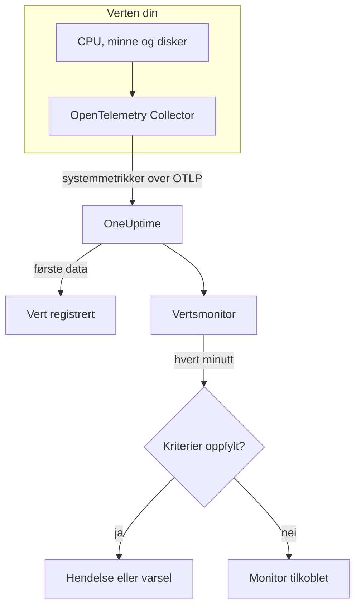

# Verts-overvåking

En vertsmonitor overvåker én maskin – CPU, minne, disker, belastning og prosesser – og sier fra når den er mettet eller holder på å fylles opp. Den leser OpenTelemetry-metrikkene `system.*` som en OpenTelemetry Collector sender fra verten, de samme dataene som produktet **Verter** viser, så ingenting undersøkes utenfra.

:::cards
- [Opprett monitoren](#opprett-en-vertsmonitor): Seks trinn i dashbordet.
- [Maler](#ferdige-varslingsmaler): Fem ferdige varsler for CPU, minne, disk, belastning og prosesser.
- [Metrikker](#innsamlede-metrikker): Vertsmetrikkene du kan varsle på, og enhetene deres.
- [Vert eller Server / VM?](#vertsmonitor-eller-server-vm-monitor): Hvilken av de to maskinmonitorene du skal bruke.
:::

## Slik fungerer det

En OpenTelemetry Collector kjører på verten med mottakeren `hostmetrics`. Hvert 30. sekund leser den vertens tall for CPU, minne, disk, nettverk, belastning og prosesser og sender dem til OneUptime over OTLP. De første dataene fra en vert registrerer den under **Verter**.

En vertsmonitor er knyttet til én vert. Hvert minutt kjører den spørringen sin over vertens metrikker og sammenligner resultatet med kriteriene sine.

### Vertsmonitor eller Server- / VM-monitor?

OneUptime har to monitorer for maskiner. De kan kjøre på samme vert.

| | Vertsmonitor | Server- / VM-monitor |
| --- | --- | --- |
| **Agent** | En OpenTelemetry Collector med mottakeren `hostmetrics` | OneUptimes infrastrukturagent |
| **Data** | OpenTelemetry-metrikkene `system.*` og `process.*`, de samme som sidene under **Verter** viser i diagrammer | En statusrapport som agenten sender til monitoren |
| **Kriterier** | Terskler eller avviksdeteksjon på enhver metrikkspørring eller formel | Innebygde kontroller som CPU-, minne- og diskbruk |
| **Oppsett** | Installer collectoren; verten registrerer seg selv | Opprett monitoren, og gi deretter den hemmelige nøkkelen til agenten |

Bruk vertsmonitoren når verten allerede sender OpenTelemetry-data, eller når du vil ha logger og rikere metrikker fra samme collector. Se [Server- / VM-overvåking](/docs/monitor/server-monitor) for den andre.

## Før du begynner

- **Kjør en OpenTelemetry Collector på verten** med mottakeren `hostmetrics`. [OpenTelemetry-collector på verten](/docs/telemetry/host-otel-collector) dekker Linux, macOS og Windows, og **Produkter → Infrastruktur → Verter → Dokumentasjon** gir en ferdig konfigurasjon.
- **Slå på utnyttelsesmetrikkene.** `system.cpu.utilization`, `system.memory.utilization` og `system.filesystem.utilization` er valgfrie i mottakeren, og malene for CPU, minne og filsystem trenger dem. Konfigurasjonen fra dashbordet slår dem på.
- **Kontroller at verten er registrert.** Den vises under **Produkter → Infrastruktur → Verter → Alle verter**, oppkalt etter sitt `host.name`, så snart de første dataene kommer.

## Opprett en vertsmonitor

:::steps
### Start en ny monitor

Gå til **Monitorer** og klikk på **Opprett monitor**.

### Velg Vert

Klikk på **Flere monitortyper** under **Monitortype**, og velg **Vert** under **Infrastruktur**. Skriv inn et **Navn** – det brukes i titler på hendelser og varsler – og klikk på **Neste**.

### Velg verten

Velg maskinen i **Vert** under **Host Monitor Configuration**. Hver vert som har sendt data, står i listen.

### Velg hva som skal overvåkes

Velg en av de tre fanene:

- **Quick Setup** – klikk på en [mal](#ferdige-varslingsmaler). Den angir metrikken, aggregeringen, tidsintervallet og tersklene, og erstatter kriteriene nedenfor med sine egne. Du kan fortsatt endre **Tidsintervall**.
- **Custom Metric** – velg én metrikk i **Host Metric**, og angi deretter **Aggregering** og **Tidsintervall**.
- **Avansert** – bygg spørringer og formler selv under **Velg målinger**, for eksempel et filter på `state` eller en gruppering etter `mountpoint`.

### Kontroller kriteriene

Åpne hvert kriterium under **Monitorkriterier** og kontroller **Metrikk**, **Aggregering**, **Betingelse** og **Threshold**. En mal fyller inn disse. Med **Custom Metric** eller **Avansert** starter monitoren med [standardkriteriene](#standardkriterier), som bare merker at en metrikk faller til null, så angi din egen terskel.

### Opprett monitoren

Klikk på **Opprett monitor**. OneUptime åpner monitorens side og evaluerer den hvert minutt. Hendelser og varsler den åpner, vises også på vertens sider **Hendelser** og **Varsler**.
:::

> [!TIP]
> For å sette opp flere maler samtidig åpner du verten fra **Produkter → Infrastruktur → Verter** og går til **Recommendations**. Velg malene du vil ha og hvem som skal varsles, så oppretter OneUptime én monitor per mal.

## Monitorinnstillinger

| Felt | Fane | Hva det gjør |
| --- | --- | --- |
| **Vert** | Alle | Påkrevd. Avgrenser hver spørring til vertens `resource.host.name`. |
| **Host Metric** | Custom Metric | Én metrikk fra [katalogen](#innsamlede-metrikker), gruppert som CPU, minne, disk, nettverk, belastning og prosesser. |
| **Aggregering** | Custom Metric | Hvordan målinger kombineres: **Gjennomsnitt**, **Maksimum**, **Minimum**, **Sum** eller **Antall**. Starter på metrikkens vanlige aggregering. |
| **Tidsintervall** | Alle | Det glidende vinduet spørringen leser, fra **Past 1 Minute** til **Past 365 Days**. En ny monitor starter på **Past 1 Minute**; maler angir sitt eget. |
| **Velg målinger** | Avansert | Spørringsbyggeren: **Metrikk**, **Aggregate by**, **Filter by attributes**, **Group by**, pluss **Legg til metrikk** og **Legg til formel** for å kombinere spørringer. |

## Ferdige varslingsmaler

**Quick Setup** tilbyr fem maler. Hver bygger en komplett monitor: en spørring, et kriterium som utløses, og et som gjenoppretter. Tersklene er utgangspunkter du kan redigere.

Et kriterium utløses bare når betingelsen gjelder i hvert minutt av vinduet, og det gjenoppretter 10 % forbi terskelen, slik at en verdi som svever ved grensen, ikke blafrer.

| Mal | Alvorlighetsgrad | Overvåker | Utløses når | Gjenoppretter når |
| --- | --- | --- | --- | --- |
| High CPU Utilization | Warning | `system.cpu.utilization` for tilstandene `user` og `system`, lagt sammen og vist som prosent, siste 5 minutter | Over 80 % | På eller under 72 % |
| High Memory Utilization | Warning | `system.memory.utilization` for tilstanden `used`, som prosent, siste 5 minutter | Over 85 % | På eller under 76,5 % |
| High Filesystem Usage | Kritisk | `system.filesystem.utilization`, Max per `mountpoint` og `device`, som prosent, siste 5 minutter | Over 90 % | På eller under 81 % |
| High Load Average (1m) | Warning | `system.cpu.load_average.1m`, Avg, siste 5 minutter | Over 4 | På eller under 3,6 |
| High Process Count | Warning | `system.processes.count`, Max, siste 5 minutter | Over 2000 | På eller under 1800 |

**Alvorlighetsgrad** er etiketten velgeren viser. Hendelsen og varselet en mal oppretter, starter på prosjektets mest alvorlige hendelses- og varslingsgrad; endre dem i kriteriene.

- **CPU** er opptatt tid (`user` pluss `system`), det samme tallet som vertens **Oversikt** viser i diagrammer. Iowait og steal er utelatt.
- **Minne** utelater buffere og sidebuffer, så en vert som stort sett inneholder hurtigbuffer, ikke utløser den.
- **Filsystem** åpner én hendelse per montering. Skrivebeskyttede pseudofilsystemer, som snap-monteringer av typen `squashfs` eller `devfs` på macOS, er alltid 100 % fulle; utelat dem i collectorens skraper `filesystem`.
- **Belastningsgjennomsnitt** er en rå lengde på kjørekøen, ikke delt på antall kjerner: 4 er metning på en vert med 2 kjerner og rutine på en med 32, så hev den på store verter.
- **Antall prosesser** sammenligner den største enkeltstående prosesstilstanden (`running`, `sleeping`, …), ikke vertens totale antall, så det vil ikke stemme med en prosessliste. Prosesskraperen rapporterer bare på Linux.

## Innsamlede metrikker

Listen **Host Metric** tilbyr disse metrikkene. Hver bærer `resource.host.name`, som er måten monitoren avgrenser spørringene sine til én vert på.

> [!IMPORTANT]
> Utnyttelsesmetrikkene er et forhold fra 0 til 1, ikke en prosent: bruk `0.8` for 80 % i en terskel på den rå metrikken. Malene regner om til prosent med en formel, så tersklene deres er 80, 85 og 90.

### CPU

| Metrikk | Enhet | Beskrivelse |
| --- | --- | --- |
| `system.cpu.utilization` | forhold | Andel av CPU-tiden i hver `state` (`user`, `system`, `idle`, …). Filtrer på `state`: et gjennomsnitt over alle tilstander når aldri en nyttig terskel. |
| `process.cpu.utilization` | forhold | CPU-utnyttelse for hver prosess på verten. |

### Minne

| Metrikk | Enhet | Beskrivelse |
| --- | --- | --- |
| `system.memory.utilization` | forhold | Andel av det fysiske minnet i hver `state` (`used`, `free`, `cached`, …). Filtrer på `state = used` for minne i bruk. |
| `system.memory.usage` | byte | Minnebruk i byte. |

### Disk

| Metrikk | Enhet | Beskrivelse |
| --- | --- | --- |
| `system.filesystem.utilization` | forhold | Andel av hvert filsystems kapasitet i bruk, per `mountpoint` og `device`. |
| `system.filesystem.usage` | byte | Filsystembruk i byte. |

### Nettverk

| Metrikk | Enhet | Beskrivelse |
| --- | --- | --- |
| `system.network.io` | byte | Mottatte og sendte byte. En teller over hele levetiden. |

### Belastning

| Metrikk | Enhet | Beskrivelse |
| --- | --- | --- |
| `system.cpu.load_average.1m` | antall | Belastningsgjennomsnitt det siste minuttet. |
| `system.cpu.load_average.5m` | antall | Belastningsgjennomsnitt de siste 5 minuttene. |
| `system.cpu.load_average.15m` | antall | Belastningsgjennomsnitt de siste 15 minuttene. |

### Prosesser

| Metrikk | Enhet | Beskrivelse |
| --- | --- | --- |
| `system.processes.count` | antall | Prosesser på verten, én serie per prosess-`status`. |

Spørringsbyggeren i **Avansert** viser hver metrikk verten sender, ikke bare disse.

## Overvåkingskriterier

Et kriterium sammenligner en av monitorens spørringer eller formler med en terskel. Kriteriene til en vertsmonitor har ingen **Filtertype**: hver regel kontrollerer metrikkverdien, med disse feltene.

| Felt | Hva det gjør |
| --- | --- |
| **Metrikk** | Spørringen eller formelen som kontrolleres, etter variabelnavnet. |
| **Aggregering** | Hvordan verdiene i vinduet blir til ett svar: **Gjennomsnitt**, **Sum**, **Maximum Value**, **Minimum Value**, **All Values** (hver verdi må samsvare) eller **Any Value** (én er nok). |
| **Betingelse** | **Greater Than**, **Less Than**, **Greater Than Or Equal To**, **Less Than Or Equal To** eller **Equal To** – eller en avviksbetingelse: **Anomalously High**, **Anomalously Low** eller **Anomalous**. |
| **Threshold** | Verdien det sammenlignes med. En liste over enheter står ved siden av når metrikken har en enhet. Vises ikke for avviksbetingelser. |
| **Følsomhet** | Bare avviksbetingelser. **Lav** (4σ), **Middels** (3σ, standard) eller **Høy** (2σ). |
| **Grunnlinjevindu** | Bare avviksbetingelser. 14 dager (standard), 28, 60 eller 90 dager med historikk. |
| **Hvis ingen data** | Under **Flere felt**. Hva som skjer når vinduet ikke har noen målinger: **Ignore** (standard), **Treat As Zero** eller **Trigger**. |

Avviksbetingelser sammenligner hver verdi med samme time i uken i grunnlinjen. De blir værende i en «Learning»-tilstand og gir ingenting før grunnlinjevinduet inneholder nok historikk.

Hvert kriterium sier også hva som skal skje når det samsvarer: endre monitorstatusen, opprette et varsel eller erklære en hendelse. Kriterier kontrolleres ovenfra og ned, og det første som samsvarer, avgjør.

### Standardkriterier

En monitor du ikke bygger fra en mal, starter med to kriterier:

| Rekkefølge | Kriterium | Samsvarer når | Deretter |
| --- | --- | --- | --- |
| 1 | Check if _monitor name_ is offline | En hvilken som helst verdi i den første spørringen er `0` | Markerer monitoren som **Frakoblet** og erklærer hendelsen «_monitor name_ is offline», som løser seg selv når monitoren kommer seg. |
| 2 | Check if _monitor name_ is online | En hvilken som helst verdi er over `0` | Markerer monitoren som **I drift**. |

> [!IMPORTANT]
> Stillhet samsvarer med ingen av kriteriene: en vert som slutter å sende data, etterlater monitoren slik den var. For å få beskjed når verten blir stille, setter du **Hvis ingen data** til **Trigger** på et kriterium. Tid der OneUptime selv ikke mottok data, er aldri manglende data: en kontroll der vinduet inneholder slik tid, venter i stedet, slik [Når OneUptime ikke mottar data](/docs/monitor/when-oneuptime-is-not-receiving) forklarer.

## Feilsøking

:::details Verten står ikke i listen Vert
Verter registrerer seg selv fra collectorens data, som trenger et `host.name` og vertens OS-type – begge kommer fra collectorens prosessor `resourcedetection`. Kontroller at collectoren kjører, og at verten står under **Produkter → Infrastruktur → Verter → Alle verter**. [OpenTelemetry-collector på verten](/docs/telemetry/host-otel-collector) dekker konfigurasjonen.
:::

:::details En CPU- eller minneterskel utløses aldri
Utnyttelsesmetrikkene er forhold som topper ut på `1.0`, så en håndskrevet terskel på `80` krysses aldri: bruk `0.8`, eller start fra en mal, som regner om til prosent. Filtrer også på `state` – `user` og `system` for CPU, `used` for minne. Et gjennomsnitt over alle tilstander holder seg nær 1 delt på antall tilstander.
:::

:::details Hendelser utløses for feil vert
Monitoren avgrenser hver spørring med `resource.host.name` lik verten du valgte. Verter som rapporterer samme `host.name`, slås sammen til én serie, så gi hver vert et unikt navn.
:::

:::details High Filesystem Usage utløses for en montering som alltid er full
Skrivebeskyttede pseudofilsystemer, som snap-loop-monteringer av typen `squashfs` under `/snap` eller `devfs` på macOS, er 100 % fulle med vilje og kommer seg aldri. Utelat dem fra collectorens skraper `filesystem`.
:::

## Neste trinn

:::cards
- [OpenTelemetry-collector på verten](/docs/telemetry/host-otel-collector): Installer og konfigurer collectoren denne monitoren leser.
- [Server- / VM-overvåking](/docs/monitor/server-monitor): Monitoren for maskiner som en agent sender til.
- [Metrikk-overvåking](/docs/monitor/metrics-monitor): Varsle på enhver metrikk, på tvers av verter og tjenester.
- [Hendelser – Oversikt](/docs/incidents/index): Hva som skjer etter at et kriterium har erklært en hendelse.
:::
