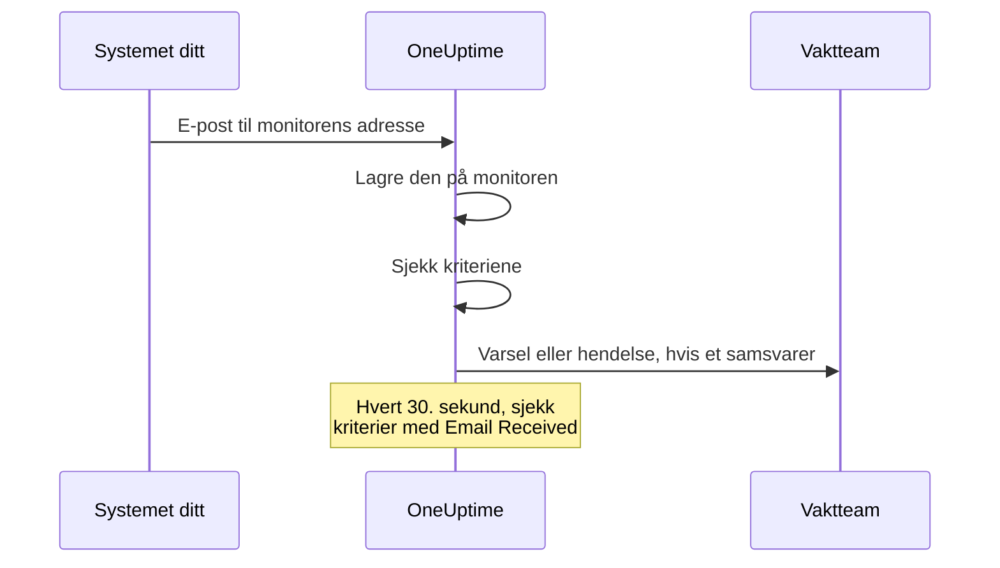

# Innkommende e-post-overvåking

En monitor for innkommende e-post gir deg en e-postadresse som hører til én monitor. Alt som kan sende e-post — en sikkerhetskopieringsjobb, et eldre system, varslingen til en skyleverandør — sender resultatene sine dit, og OneUptime sjekker hver e-post mot kriteriene dine for å markere monitoren som nede, åpne en hendelse eller opprette et varsel, og for å løse dem når klarsignalet kommer.

:::cards
- [Opprett monitoren](#opprett-en-monitor-for-innkommende-e-post): Få en adresse, og pek avsenderen din mot den.
- [Bekreft adressen](#bekreft-adressen-hos-avsenderen): Les en avsenders bekreftelses-e-post på monitoren.
- [Skriv kriterier](#tilgjengelige-filtertyper): Sjekk emnet, avsenderen eller innholdet, eller varsle når e-postene slutter å komme.
- [Bruk e-posten i varsler](#malvariabler): Sett emnet og innholdet inn i titler og beskrivelser.
:::

## Slik fungerer det

E-post er en push-modell: systemet ditt sender, og OneUptime lytter. Hver e-post sjekkes mot monitorens kriterier når den kommer. Kriterier som ser etter e-post som *skulle* ha kommet, sjekkes i tillegg etter en tidsplan, hvert 30. sekund.



1. Når du oppretter en monitor for innkommende e-post, gir OneUptime den en unik e-postadresse.
2. Hver e-post som sendes til den adressen, lagres på monitoren og evalueres mot kriteriene, ovenfra; det første kriteriet som samsvarer, avgjør.
3. Et samsvarende kriterium kan endre monitorens status, opprette et varsel og erklære en hendelse. En hendelse med **Løs hendelse automatisk** slått på, eller et varsel med **Løs varsel automatisk** slått på, løses når et annet kriterium samsvarer senere — for eksempel det som markerer monitoren som online.

## Opprett en monitor for innkommende e-post

:::steps
### Start en ny monitor

Gå til **Monitorer**, og klikk på **Opprett monitor**.

### Velg Incoming Email

Under **Monitortype** klikker du på **Flere monitortyper** og velger **Incoming Email** under **Inbound Monitoring**, eller skriver `email` i søkefeltet. Skriv inn et **Navn**, og klikk deretter på **Neste**.

### Gå gjennom kriteriene

Trinnet **Kriterier** starter med [standardkriteriene](#hva-du-får-fra-start), som markerer monitoren som frakoblet når en e-post nevner `error`. Klikk på et kriterium for å endre det, eller klikk på **Legg til kriterier** for å legge til et. Se [Eksempler på konfigurasjoner](#eksempler-på-konfigurasjoner) for vanlige oppsett.

### Opprett monitoren

Klikk på **Opprett monitor**. Monitoren åpnes på siden **Oversikt**, der kortet **Incoming Email Address** viser adressen med en kopieringsknapp til den første e-posten kommer.

### Send e-post til adressen

Konfigurer systemet ditt til å sende varslene sine til adressen. Hvis avsenderen ber deg bekrefte adressen først, se [Bekreft adressen hos avsenderen](#bekreft-adressen-hos-avsenderen).
:::

> [!NOTE]
> Adressen inneholder monitorens hemmelige nøkkel, så bare personer som kan redigere monitorer, kan se den. Alle andre ser at oppsettsdetaljene er skjult.

## Formatet på e-postadressen

Hver monitor for innkommende e-post får en unik adresse i dette formatet:

```text
monitor-{secret-key}@{inbound-domain}
```

Den hemmelige nøkkelen er en UUID, for eksempel `monitor-3f2b8c1e-5d4a-4f6b-9a7c-2e1d0b9f8a6c@inbound.yourdomain.com`. Etter at den første e-posten har kommet, blir adressen stående på monitorens side **Oversikt** i kortet **Inbound email address**, ved siden av tidspunktet da den siste e-posten kom. Monitorens side **Dokumentasjon** viser den også.

## Tilbakestill eller tilpass e-postadressen

Gå til monitorens fane **Innstillinger**. Kortet **Incoming Email Address** viser den gjeldende adressen og gir to måter å erstatte den på:

| Handling | Hva den gjør | Bruk den når |
| --- | --- | --- |
| **Reset Address** | Gir monitoren en ny, tilfeldig generert adresse `monitor-{secret-key}@{inbound-domain}`. Har monitoren en tilpasset adresse, fjerner tilbakestillingen den. Du blir bedt om å bekrefte først. | Adressen har lekket, eller du vil stenge ute det som sender til den. |
| **Customize Address** | Lar deg velge delen før @, for eksempel `nightly-backups@{inbound-domain}`. Skriv den inn i **Address name** — du kan skrive navnet eller lime inn hele adressen — og klikk på **Save Address**. | Du vil ha en adresse som folk kjenner igjen. |

Begge handlingene avsluttes med å vise den nye adressen med en kopieringsknapp.

> [!WARNING]
> **Den gamle adressen slutter å virke med en gang**: e-post som sendes til den, ignoreres, så oppdater alle systemer som sender e-post til denne monitoren.

Regler for tilpassede adresser:

- 3 til 64 tegn: små bokstaver, tall, punktum (`.`), bindestreker (`-`) og understreker (`_`), uten to punktum etter hverandre. Den må starte og slutte med en bokstav eller et tall. Store bokstaver gjøres om til små for deg.
- Domenet er alltid serverens domene for innkommende e-post.
- Navnet kan ikke allerede være i bruk av en annen monitor. Alle prosjektene på serveren deler domenet for innkommende e-post, så navnet må være unikt på tvers av alle.
- Navn på formen `monitor-{id}` og `workflow-{id}` er reservert for genererte adresser. Navn på postbokser som hører til selve domenet, er også reservert: `abuse`, `admin`, `administrator`, `hostmaster`, `mailer-daemon`, `noc`, `postmaster`, `root`, `security` og `webmaster`.

En tilpasset adresse er like mye en legitimasjon som en generert: alle som kjenner den, kan sende e-post som denne monitoren evaluerer. Genererte adresser er praktisk talt umulige å gjette, men et kort, opplagt navn er ikke det. Velg noe som er vanskelig å gjette hvis det betyr noe for deg.

API-brukere kan gjøre det samme via Monitor-API-et, på en eksisterende monitor: sett `incomingEmailCustomLocalPart` til navnet for å bruke en tilpasset adresse, eller sett den til `null` for å gå tilbake til den genererte. Tilbakestilling betyr å skrive en ny `incomingEmailSecretKey` og sette `incomingEmailCustomLocalPart` til `null` i samme oppdatering.

## Bekreft adressen hos avsenderen

Noen tjenester sender ikke varsler til en ny adresse før noen beviser at de kan lese e-post der. De sender først en bekreftelses-e-post, og den kommer til monitoren som enhver annen e-post. Slik leser du den:

:::steps
### Legg til adressen i tjenesten

Legg til monitorens adresse i tjenesten, og lagre. Tjenesten sender bekreftelses-e-posten sin.

### Åpne den nyeste e-posten

Åpne monitoren i OneUptime. På siden **Oversikt** viser kortet **Monitor-sammendrag** den nyeste e-posten. Sjekk at **Fra** og **Emne** hører til bekreftelses-e-posten, og klikk deretter på **Vis flere detaljer**.

### Kopier koden eller lenken

Koden eller lenken står i **E-postinnhold (tekst)**. **E-postinnhold (HTML)** viser HTML-kilden, så hvis du kopierer en lenke derfra, endrer du hver `&amp;` i den til `&`.

### Fullfør bekreftelsen

Fullfør bekreftelsen slik e-posten forteller deg.
:::

Har det kommet en annen e-post siden, viser kortet ikke lenger bekreftelses-e-posten. Åpne **Overvåkingslogger**, finn bekreftelses-e-posten ut fra emnet i kolonnen **E-post**, og klikk på **Vis sammendrag** på den raden.

> [!IMPORTANT]
> **Kriteriene dine ser den også.** Bekreftelses-e-posten evalueres som enhver annen e-post. En formulering som "if you received this in error" samsvarer med standardkriteriet `error` og markerer monitoren som frakoblet. For å unngå det slår du av **Sjekk denne overvåkeren** i kortet **Overvåking** på monitorens side **Innstillinger** mens du bekrefter (du blir bedt om å bekrefte). En monitor med overvåking slått av lagrer fortsatt e-posten, og kortet **Monitor-sammendrag** viser den fortsatt. Den evaluerer likevel ingenting, så e-posten får ingen rad i **Overvåkingslogger**: les den før en annen e-post kommer. Når du er ferdig, trykker du på **Slå på overvåking** i banneret øverst på monitorens sider, eller slår bryteren på igjen.

**Bekreftelsen hører til adressen.** Hvis du [tilbakestiller eller tilpasser adressen](#tilbakestill-eller-tilpass-e-postadressen), ser tjenesten en ny mottaker, og du må bekrefte på nytt.

### Handlingsgrupper i Azure Monitor

Siden juli 2026 har Azure gradvis innført et krav om at hver ny mottaker av typen **Email** i en handlingsgruppe bekreftes med en engangskode. Før det er gjort, sender handlingsgruppen verken varsler eller testvarsler til den adressen.

:::steps
1. Legg til et varsel av typen **Email** med monitorens adresse i handlingsgruppen, og lagre handlingsgruppen. Azure sender bekreftelses-e-posten fra en Microsoft-adresse som `azure-noreply@microsoft.com`.
2. Les den på monitoren som beskrevet ovenfor, og følg instruksjonene i den innen 30 minutter etter at du lagret handlingsgruppen. Hvis engangskoden utløper, åpner du handlingsgruppen og velger **Resend**.
3. Åpne handlingsgruppen, og velg **Test** for å sende et testvarsel. Det kommer til monitoren som et ekte varsel, så det viser også om kriteriene dine samsvarer med e-postene fra Azure.
:::

Bekreftelsen gjelder for alle handlingsgrupper i samme Azure-leietaker, så hver adresse trenger bare å bekreftes én gang.

### Amazon SNS

Et e-postabonnement på et SNS-emne mottar ingenting før det er bekreftet. Når du oppretter abonnementet, sender Amazon SNS en bekreftelses-e-post til adressen. Les den på monitoren som beskrevet ovenfor, og åpne lenken **Confirm subscription** i den i nettleseren. SNS sletter et abonnement som ikke er bekreftet innen 48 timer; skjer det, oppretter du abonnementet på nytt.

## Hva du får fra start

En ny monitor for innkommende e-post opprettes med to kriterier som leser innholdet i e-posten:

| Kriterium | Filtertype | Filtervilkår | Verdi | Virkning |
| -------- | ----------- | ---------------- | ------- | -------------------------------------------- |
| Offline  | Email Body  | Inneholder | `error` | Markerer monitoren som frakoblet, åpner en hendelse |
| Online   | Email Body  | Not Contains | `error` | Markerer monitoren som online |

Dette passer for det vanlige tilfellet der en jobb eller et verktøy fra en tredjepart sender sitt eget resultat på e-post: en melding der innholdet nevner `error`, tar monitoren ned, og den neste meldingen uten ordet får monitoren opp igjen og løser hendelsen. Sammenligningen av innholdet skiller ikke mellom store og små bokstaver, så `Error` og `ERROR` samsvarer også.

Endre verdien til det avsenderen faktisk skriver (`FAILED`, `exit code 1` og så videre).

> [!NOTE]
> Disse standardene er **ikke** en dødmannsbryter: ingenting her utløses når e-postene slutter å komme. Kriterier som bare leser emnet, avsenderen, innholdet eller mottakeren, evalueres når en e-post kommer, og ikke på noe annet tidspunkt. Vil du bli varslet ved stillhet, legger du til et kriterium **Email Received** / **Not Recieved In Minutes** — se [Eksempel 3](#eksempel-3-heartbeat-monitor-ingen-e-post-varsel).

## Tilgjengelige filtertyper

Du kan opprette kriterier ut fra disse e-postfeltene:

| Filtertype | Beskrivelse |
| ------------------------- | ----------------------------------------------------------------------------------- |
| **E-postemne** | Emnelinjen i den innkommende e-posten |
| **Email From Address** | Avsenderens e-postadresse: bare adressen, med små bokstaver, uten visningsnavn |
| **Email Body** | Ren tekst-delen av e-postinnholdet |
| **Email To Address** | Mottakerens e-postadresse |
| **Email Received** | Tidsbaserte kriterier for når e-poster mottas |
| **JavaScript Expression** | Et egendefinert JavaScript-uttrykk som må gi sann |

Monitorens egen adresse maskeres før noe kriterium leser e-posten, så i **Email To Address**, **E-postemne** og **Email Body** står det `[REDACTED]`.

## Filtervilkår

### Strengfiltre (emne, avsender, innhold, mottaker)

| Filtervilkår | Beskrivelse | Eksempel |
| ---------------- | ----------------------------------------- | ---------------------------------- |
| **Inneholder** | Feltet inneholder den angitte teksten | Emnet inneholder "CRITICAL" |
| **Not Contains** | Feltet inneholder ikke den angitte teksten | Emnet inneholder ikke "TEST" |
| **Equal To** | Feltet samsvarer nøyaktig med den angitte teksten | Avsenderen er lik "alerts@service.com" |
| **Not Equal To** | Feltet samsvarer ikke med den angitte teksten | Emnet er ikke lik "OK" |
| **Starts With** | Feltet starter med den angitte teksten | Emnet starter med "[ALERT]" |
| **Ends With** | Feltet slutter med den angitte teksten | Emnet slutter med "- Production" |
| **Is Empty** | Feltet er tomt | Innholdet er tomt |
| **Is Not Empty** | Feltet har innhold | Emnet er ikke tomt |

Ingen av disse sammenligningene skiller mellom store og små bokstaver. Et filter med tom verdi samsvarer aldri.

### Tidsbaserte filtre (Email Received)

Dashbordet staver disse vilkårene "Recieved".

| Filtervilkår | Beskrivelse | Eksempel |
| --------------------------- | ----------------------------------- | -------------------------------- |
| **Recieved In Minutes** | En e-post ble mottatt innen X minutter | E-post mottatt innen 30 minutter |
| **Not Recieved In Minutes** | Ingen e-post mottatt på X minutter | Ingen e-post mottatt på 60 minutter |

En monitor som aldri har mottatt en e-post, regner opprettelsestidspunktet som den siste e-posten.

### JavaScript Expression

| Filtervilkår | Beskrivelse |
| --------------------- | ------------------------------------- |
| **Evaluates To True** | Uttrykket returnerer en sann verdi |

Uttrykket kjører i en sandkasse uten bundne e-postfelt, så det kan ikke lese emnet, avsenderen, innholdet eller mottakeren til meldingen som utløste kontrollen. Bruk filtertypene **E-postemne**, **Email From Address**, **Email Body** og **Email To Address** for å sjekke innholdet i e-posten.

## Eksempler på konfigurasjoner

Hvert eksempel er et par kriterier. Et kriterium har filtre, en **Samsvarsbetingelse** (**Alle** eller **Hvilken som helst** av filtrene) og handlinger: endre monitorens status, opprette et varsel, erklære en hendelse. Slå på **Løs varsel automatisk** (eller **Løs hendelse automatisk**) under **Flere felt** i varselet eller hendelsen, slik at det andre kriteriet løser det det første åpnet.

### Eksempel 1: Opprett et varsel ved kritiske e-poster

| Kriterium | Filtre | Samsvarsbetingelse | Handlinger |
| --- | --- | --- | --- |
| Kritisk e-post | **E-postemne** Inneholder `CRITICAL`; **E-postemne** Inneholder `ALERT`; **E-postemne** Inneholder `ERROR` | **Hvilken som helst** | Endre statusen til frakoblet; opprett et varsel |
| Klarsignal | **E-postemne** Inneholder `RESOLVED`; **E-postemne** Inneholder `RECOVERED` | **Hvilken som helst** | Endre statusen til online |

Legg det kritiske kriteriet først: kriteriene sjekkes ovenfra, og det første som samsvarer, avgjør.

### Eksempel 2: Overvåk en bestemt avsender

| Kriterium | Filtre | Samsvarsbetingelse | Handlinger |
| --- | --- | --- | --- |
| Mislykket jobb | **Email From Address** Equal To `monitoring@legacy-system.com`; **E-postemne** Inneholder `Failed` | **Alle** | Endre statusen til frakoblet; erklær en hendelse |
| Vellykket jobb | **Email From Address** Equal To `monitoring@legacy-system.com`; **E-postemne** Inneholder `Success` | **Alle** | Endre statusen til online |

### Eksempel 3: Heartbeat-monitor (ingen e-post = varsel)

| Kriterium | Filtre | Handlinger |
| --- | --- | --- |
| E-posten er forsinket | **Email Received** Not Recieved In Minutes `60` | Endre statusen til frakoblet; opprett et varsel |
| E-posten har kommet | **Email Received** Recieved In Minutes `60` | Endre statusen til online |

Det første kriteriet utløses når det ikke har kommet noen e-post på 60 minutter — nyttig for planlagte jobber eller batchprosesser som sender en e-post når de er ferdige. Det andre løser varselet så snart en e-post kommer. Minutter da OneUptime selv ikke tok imot e-post, teller ikke med i de 60, slik [Når OneUptime ikke mottar data](/docs/monitor/when-oneuptime-is-not-receiving) forklarer.

## Bruksområder

| Bruksområde | Hva monitoren gjør |
| --- | --- |
| Integrasjon med eldre systemer | Gjør varsler som eldre systemer bare sender på e-post, om til hendelser i OneUptime, og løser dem når klarsignalet kommer. |
| Tjenester fra tredjeparter | Mottar varsler fra skyleverandører (AWS, GCP, Azure), sikkerhetsskannere, verktøy for sikkerhetskopiering og advarsler om sertifikater som utløper. |
| Planlagte jobber | Varsler når en e-post om at en jobb er ferdig, er forsinket, eller når en jobb sender en e-post om en feil. |
| Samling av varsler | Samler e-postvarsler fra Nagios, Zabbix eller andre verktøy, slik at OneUptime er det ene stedet du håndterer dem. |

## Malvariabler

Titlene, beskrivelsene og utbedringsnotatene til varslene og hendelsene denne monitoren oppretter, kan bruke disse variablene. Kriteriets skjemaer for varsler og hendelser viser dem under **Malvariabler**, og [Hendelse- og varslingsmaler](/docs/monitor/incident-alert-templating) forklarer syntaksen.

| Variabel | Beskrivelse |
| --------------------- | ----------------------------------------------------------------- |
| `{{emailSubject}}`    | Emnet til den mottatte e-posten |
| `{{emailFrom}}`       | Avsenderens e-postadresse |
| `{{emailTo}}`         | Hvem e-posten ble sendt til, med denne monitorens egen adresse maskert |
| `{{emailBody}}`       | Innholdet i e-posten som ren tekst |
| `{{emailReceivedAt}}` | Når e-posten ble mottatt, som et ISO 8601-tidsstempel i UTC |

- **En tittel får én linje av hver.** I en tittel kuttes hver variabel til én linje på høyst 150 tegn, som slutter med `...` når den var lengre. En tittel kan ikke være lengre enn 500 tegn, og et varsel eller en hendelse med for lang tittel opprettes ikke i det hele tatt, så hvis du siterte en hel e-post, ville monitoren ikke kunne varsle om lange e-poster. Beskrivelser og utbedringsnotater får hele verdien.
- **Denne monitorens adresse er maskert.** Adressen fungerer som et passord, så den maskeres før e-posten lagres, og `{{emailTo}}` blir `monitor-[REDACTED]@{inbound-domain}` (eller `[REDACTED]@{inbound-domain}` for en tilpasset adresse).
- **En kontroll for manglende e-post bruker den siste e-posten.** Når et kriterium med **Email Received** åpner et varsel fordi ingen e-post kom i tide, beskriver variablene den siste e-posten monitoren mottok. De er tomme hvis det ikke har kommet noen ennå.

## Visningen Monitor-sammendrag

Når monitoren har mottatt en e-post, viser kortet **Monitor-sammendrag** på siden **Oversikt** den nyeste:

- **Siste e-post mottatt**: Når den nyeste e-posten ble mottatt
- **Fra**: Avsenderen av den siste e-posten
- **Emne**: Emnelinjen i den siste e-posten

Klikk på **Vis flere detaljer** for å se resten:

- **E-posthoder**: De fullstendige hodene til den siste e-posten
- **E-postinnhold (tekst)**: Innholdet som ren tekst
- **E-postinnhold (HTML)**: HTML-innholdet, vist som HTML-kilde i stedet for gjengitt

### Tidligere e-poster

Kortet viser bare den nyeste e-posten. Hver e-post monitoren evaluerer, skrives også til **Overvåkingslogger**: kolonnen **E-post** viser emnet og avsenderen, og **Vis sammendrag** på raden viser hele e-posten på samme måte som kortet. En monitor med overvåking slått av evaluerer ingenting, så e-postene den mottar, får ingen rader. Hvis et av kriteriene dine sjekker **Email Received**, skriver monitoren også en rad hver gang den ser etter manglende e-post. Kolonnen **E-post** sier "Scheduled check" på de radene, og **Vis sammendrag** der viser den nyeste e-posten på tidspunktet for kontrollen, eller "No email yet" hvis ingen hadde kommet. Overvåkingslogger beholdes i én dag som standard. På en selvhostet server kan en administrator endre det med **Loggoppbevaring for overvåking (dager)** i innstillingene i Admin Dashboard.

## Selvhostet oppsett

Hvis du drifter OneUptime selv, må du konfigurere en leverandør for innkommende e-post. For øyeblikket støttes:

- **SendGrid Inbound Parse** - Se [SendGrid innkommende e-post](/docs/self-hosted/sendgrid-inbound-email) for oppsettsinstruksjoner

Inntil det er satt opp, sier monitorens adressekort at innkommende e-post ikke er konfigurert.

## Ting å tenke på

- **Sikkerheten til e-postadressen**: Monitorens e-postadresse fungerer som et passord: alle som kjenner den, kan sende e-post til monitoren. Ikke del den offentlig, og tilbakestill den fra monitorens fane **Innstillinger** hvis den lekker.
- **Størrelse på e-post**: OneUptime godtar en innkommende e-post på opptil 50 MB, vedlegg inkludert. Vedlegg lagres ikke — bare navnene, typene og størrelsene deres.
- **Behandlingstid**: E-poster behandles asynkront. Det kan gå noen sekunder fra en e-post sendes til varselet opprettes.
- **Store og små bokstaver**: Ingen av strengsammenligningene (Inneholder, Equal To osv.) skiller mellom store og små bokstaver.
- **Ren tekst**: Kriterier for innholdet leser ren tekst-delen av e-posten. En e-post som bare er sendt som HTML, har et tomt innhold for kriteriene — så den inneholder ikke `error`, og standardkriteriene markerer monitoren som online.

## Feilsøking

### E-poster mottas ikke

1. Bekreft at e-postadressen er riktig (se etter skrivefeil).
2. Sjekk om avsenderen venter på at du skal bekrefte adressen. Handlingsgrupper i Azure Monitor og Amazon SNS sender ingenting til en ny adresse før den er bekreftet. Se [Bekreft adressen hos avsenderen](#bekreft-adressen-hos-avsenderen).
3. Sjekk om e-posten blokkeres av spamfiltre.
4. Bekreft at leverandøren din for innkommende e-post er riktig konfigurert.
5. Sjekk loggene til OneUptime for feilmeldinger.

### Varsler opprettes ikke

1. Bekreft at kriteriene dine samsvarer med innholdet i e-posten. Husk at monitorens egen adresse står som `[REDACTED]`, og at en e-post med bare HTML har et tomt innhold.
2. Sjekk at overvåkingen er slått på: monitorens side **Innstillinger**, kortet **Overvåking**.
3. Åpne **Overvåkingslogger**, og klikk på **Vis sammendrag** på raden til e-posten for å se hva kriteriene leste.
4. Sjekk rekkefølgen på kriteriene: det første som samsvarer, avgjør.

### Varsler løses ikke

1. Bekreft at kriteriene for løsning samsvarer med klarsignalet.
2. Sjekk at **Løs varsel automatisk** (eller **Løs hendelse automatisk**) er slått på i kriteriet som åpnet det.
3. Sjekk at klarsignalet sendes til den samme monitoradressen.

## Neste trinn

:::cards
- [Hendelse- og varslingsmaler](/docs/monitor/incident-alert-templating): Sett emnet og innholdet i e-posten inn i varsler.
- [Innkommende forespørsel-overvåking](/docs/monitor/incoming-request-monitor): Motta heartbeats og webhooks over HTTP i stedet.
- [SendGrid innkommende e-post](/docs/self-hosted/sendgrid-inbound-email): Sett opp innkommende e-post på en selvhostet server.
:::
